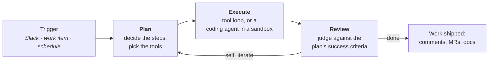
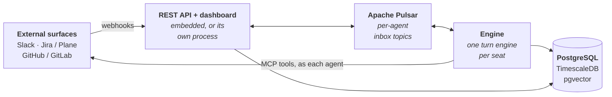

<div align="center">


# Crewlet

**Run an AI agent company.**

Crewlet is an open-source Python engine for orchestrating hierarchically organized
AI agent companies. You describe a company in YAML — mission, org chart, roles,
policies, integrations — and Crewlet runs it: one persistent agent per seat,
planning and executing real work on Slack, your issue tracker, and your code host,
learning from what it did, and escalating to the humans in the org chart when stuck.

[](https://pypi.org/project/crewlet/)
[](https://github.com/crewlet/crewlet/actions/workflows/ci.yml)
[](LICENSE)
[](pyproject.toml)
[](docs/index.md)

<a href="docs/getting-started/quickstart.md"><b>Quickstart</b></a> ·
<a href="docs/getting-started/choosing-your-stack.md"><b>Choosing your stack</b></a> ·
<a href="docs/concepts/overview.md"><b>Concepts</b></a> ·
<a href="docs/index.md"><b>Documentation</b></a> ·
<a href="CONTRIBUTING.md"><b>Contributing</b></a>

</div>

---

## The org chart is the execution graph

Identity, delegation, communication, and knowledge are all scoped by where a seat
sits in the hierarchy. The chart you draw is the graph the engine runs.

<table>
<tr>
<td width="33%" align="center" valign="top">
<br>
<b>The org chart runs the work</b><br>
<sub>Departments, teams, and seats nest to any depth. Leads assign work by reasoning
about their reports — not by a routing algorithm.</sub>
</td>
<td width="33%" align="center" valign="top">
<br>
<b>Company as code</b><br>
<sub>The whole company is versioned YAML in PostgreSQL — live-editable through a REST
API, with no restart for role, provider, or integration changes.</sub>
</td>
<td width="33%" align="center" valign="top">
<br>
<b>Plan → Execute → Review</b><br>
<sub>Every turn is planned, executed against explicit success criteria, then judged —
and looped back when the work isn't done.</sub>
</td>
</tr>
<tr>
<td width="33%" align="center" valign="top">
<br>
<b>Agents that ship code</b><br>
<sub>An engineer seat runs a coding agent in an isolated sandbox and opens the merge
request under its own identity — not yours.</sub>
</td>
<td width="33%" align="center" valign="top">
<br>
<b>Memory that compounds</b><br>
<sub>Agents search the team knowledge base at query time, keep a private diary, recall
similar past turns, and synthesize reusable skills.</sub>
</td>
<td width="33%" align="center" valign="top">
<br>
<b>Humans hold seats too</b><br>
<sub>Put yourself in the chart. Human seats lead units and receive escalations on the
surfaces you already use.</sub>
</td>
</tr>
</table>

---

## How a turn works

A trigger — a Slack message, a work-item webhook, a schedule — wakes exactly one
agent, which runs a three-phase turn:



Each phase gets its own narrow prompt, its own tool surface, and can run on its own
model — a frontier model to plan, a cheap one to summarize. See
[Turn Engine](docs/concepts/turn-engine.md).

---

## Quickstart

Bring up the infrastructure, describe a company, run it:

```bash
pip install "crewlet[postgresql,api]"

# PostgreSQL (TimescaleDB + pgvector) and Apache Pulsar
cp .env.example .env && docker compose up -d

export CREWLET_API_TOKEN_FOUNDER="$(openssl rand -hex 32)"
export ANTHROPIC_API_KEY="sk-ant-..."     # or OpenAI, or any OpenAI-compatible endpoint
export OPENAI_API_KEY="sk-..."            # embeddings

crewlet run config.yaml --import-company company.yaml
```

A four-agent company is about 40 lines of YAML:

```yaml
name: "Acme AI"
mission: "Ship AI-powered products fast"

providers:
  llm:
    default:
      type: anthropic
      model: claude-sonnet-5
      api_keys: ["${ANTHROPIC_API_KEY}"]

roles:
  - name: CEO
    goal: "Set product vision and make final calls"
    manages: [CTO, PM]

units:
  - name: Core Engineering
    type: team
    lead: CTO
    roles:
      - name: CTO
        goal: "Set technical direction and unblock engineers"
        manages: [Engineer]
      - name: Engineer
        goal: "Implement features, write tests, ship quality code"
```

The dashboard and webhook API come up with the engine. The full
[Quickstart](docs/getting-started/quickstart.md) walks through watching an agent's
first turn with no integrations at all, then wiring in the real ones.

> **Want the full picture first?** `examples/nimbus.company.yaml` is a complete
> seven-seat reference company — Plane, GitLab, Slack, and a code sandbox wired
> end-to-end, with the reasoning for every setting in comments.

> **Rather not write it by hand?** An AI assistant can interview you and author
> both files, checking its own work against the shipped JSON Schema — see
> [Authoring with an AI assistant](docs/getting-started/ai-authoring.md) for a
> step-by-step walkthrough.

---

## Plug in your stack

Crewlet is the engine; the surfaces your agents work on are yours to choose. Every
one has a hosted and a self-hosted path — see
[Choosing your stack](docs/getting-started/choosing-your-stack.md).

| | Options |
|---|---|
| **LLM** | [Anthropic](docs/getting-started/quickstart.md#llm-options), OpenAI, or **any OpenAI-compatible endpoint** — including your own vLLM / LiteLLM gateway |
| **Tracker + knowledge base** | [Plane](docs/integrations/plane.md) (self-hosted, covers both) · [Jira](docs/integrations/jira.md) + [Confluence](docs/integrations/confluence.md) |
| **Code host** | [GitLab](docs/integrations/gitlab.md) (gitlab.com or self-hosted) · [GitHub](docs/integrations/github.md) |
| **Chat** | [Slack](docs/integrations/slack.md) — one bot identity per agent |
| **Code sandbox** | [E2B cloud or self-hosted](docs/concepts/code-sandbox.md); Claude Code or OpenCode as the coding agent |

For Slack, Plane, and GitLab, one command provisions the whole fleet — a Slack app
or service account per seat, memberships, per-agent tokens minted into your config's
own `${VAR}` references, and the webhooks:

```bash
crewlet slack  provision company.yaml --base-url <url>
crewlet plane  provision company.yaml --create-projects --webhook-url <url>
crewlet gitlab provision company.yaml --webhook-url <url>
```

Add `--secret-store` and the minted credentials go straight into the encrypted
[secret store](docs/concepts/secret-store.md) the engine reads `${VAR}` from —
no env file to source, no shell to be in.

---

## Architecture



Agents are callback-driven: messages on an agent's inbox topic invoke its handler,
and events that piled up while it was busy are batched into a single digest turn.
Config lives in two tiers — an ops-owned bootstrap file on disk, and a versioned,
live-editable company document in PostgreSQL that can be
[encrypted at rest](docs/concepts/configuration.md#secrets) as a single opaque blob.

---

## CLI

```bash
crewlet run config.yaml --import-company company.yaml   # boot + import, idempotent
crewlet run api config.yaml                             # standalone API (split deployments)
crewlet validate company.yaml                           # check before importing
crewlet validate company.yaml --json                    # machine-readable errors
crewlet schema company                                  # JSON Schema (editors, CI, agents)

crewlet config export | show | revisions | diff         # inspect Tier B revisions
crewlet secrets keygen && crewlet config seal           # encrypt the config at rest
crewlet secrets set LLM_API_KEY                         # store a secret the engine reads ${VAR} from

crewlet plane import company.yaml examples/             # publish docs + tool skills
crewlet confluence import company.yaml                  # ...on the Confluence backend
```

Full reference: [CLI](docs/reference/cli.md) ·
[API endpoints](docs/reference/api-endpoints.md) ·
[Environment variables](docs/reference/environment-variables.md).

---

## Documentation

<table>
<tr>
<td valign="top" width="62%">

**Start here**
- [Installation](docs/getting-started/installation.md) — prerequisites and infrastructure
- [Quickstart](docs/getting-started/quickstart.md) — a company running in minutes
- [Choosing your stack](docs/getting-started/choosing-your-stack.md) — every external dependency, and what you set up yourself
- [Authoring with an AI assistant](docs/getting-started/ai-authoring.md) — let an AI write your company config
- [Configuration reference](docs/getting-started/configuration.md) — every YAML field

**Core concepts**
- [Overview](docs/concepts/overview.md) · [Organization model](docs/concepts/organization-model.md) · [Humans in the org chart](docs/concepts/humans-in-the-org.md)
- [Agent runtime](docs/concepts/agent-runtime.md) · [Turn engine](docs/concepts/turn-engine.md) · [Code sandbox](docs/concepts/code-sandbox.md)
- [Knowledge system](docs/concepts/knowledge-system.md) · [Agent learning](docs/concepts/agent-learning.md) · [Tool skills](docs/concepts/tool-skills.md)
- [Event system](docs/concepts/event-system.md) · [Scheduling](docs/concepts/scheduling.md) · [Configuration](docs/concepts/configuration.md)

**Guides**
- [Tools & MCP](docs/guides/tools-and-mcp.md) · [Extensions](docs/guides/extensions.md) · [Deployment](docs/guides/deployment.md)

</td>
<td valign="top" align="center" width="38%">

</td>
</tr>
</table>

---

## Contributing

Issues and pull requests are welcome. [CONTRIBUTING.md](CONTRIBUTING.md) covers the
dev setup, conventions, and the checks CI runs:

```bash
uv sync --all-extras
uv run pytest
uv run ruff check src/ tests/ && uv run ruff format --check src/ tests/
```

Releases go to PyPI from a `v*` tag — see [RELEASING.md](RELEASING.md).

Security issues: please report them privately — see [SECURITY.md](SECURITY.md).

## License

[MIT](LICENSE)

The dashboard's icon sprite is adapted from
[Feather Icons](https://feathericons.com) — MIT License,
Copyright (c) 2013-2023 Cole Bemis.
