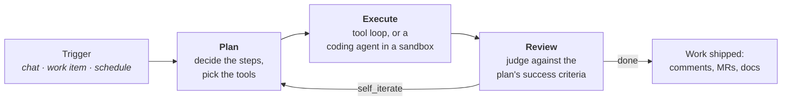
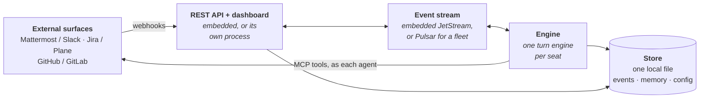

<div align="center">


# Crewlet

**Run an AI agent company.**

Crewlet is an open-source Go engine for orchestrating hierarchically organized
AI agent companies. You describe a company in YAML — mission, org chart, roles,
policies, integrations — and Crewlet runs it: one persistent agent per seat,
planning and executing real work in chat, your issue tracker, and your code host,
learning from what it did, and escalating to the humans in the org chart when stuck.

[](https://github.com/crewlet/crewlet/releases)
[](https://github.com/crewlet/crewlet/actions/workflows/ci.yml)
[](LICENSE)
[](go.mod)
[](docs/index.md)

<a href="docs/getting-started/quickstart.md"><b>Quickstart</b></a> ·
<a href="docs/getting-started/choosing-your-stack.md"><b>Choosing your stack</b></a> ·
<a href="docs/concepts/overview.md"><b>Concepts</b></a> ·
<a href="docs/index.md"><b>Documentation</b></a> ·
<a href="CONTRIBUTING.md"><b>Contributing</b></a>

</div>

---

## The org chart is the execution graph

Identity, delegation, communication, and knowledge are all scoped by where a seat
sits in the hierarchy. The chart you draw is the graph the engine runs.

<table>
<tr>
<td width="33%" align="center" valign="top">
<br>
<b>The org chart runs the work</b><br>
<sub>Departments, teams, and seats nest to any depth. Leads assign work by reasoning
about their reports — not by a routing algorithm.</sub>
</td>
<td width="33%" align="center" valign="top">
<br>
<b>Company as code</b><br>
<sub>The whole company is versioned YAML the engine stores and serves — live-editable
through a REST API, with no restart for role, provider, or integration changes.</sub>
</td>
<td width="33%" align="center" valign="top">
<br>
<b>Plan → Execute → Review</b><br>
<sub>Every turn is planned, executed against explicit success criteria, then judged —
and looped back when the work isn't done.</sub>
</td>
</tr>
<tr>
<td width="33%" align="center" valign="top">
<br>
<b>Agents that ship code</b><br>
<sub>An engineer seat runs a coding agent in an isolated sandbox and opens the merge
request under its own identity — not yours.</sub>
</td>
<td width="33%" align="center" valign="top">
<br>
<b>Memory that compounds</b><br>
<sub>Agents search the team knowledge base at query time, keep a private diary, recall
similar past turns, and synthesize reusable skills.</sub>
</td>
<td width="33%" align="center" valign="top">
<br>
<b>Humans hold seats too</b><br>
<sub>Put yourself in the chart. Human seats lead units and receive escalations on the
surfaces you already use.</sub>
</td>
</tr>
</table>

---

## How a turn works

A trigger — a chat message, a work-item webhook, a schedule — wakes exactly one
agent, which runs a three-phase turn:



Each phase gets its own narrow prompt, its own tool surface, and can run on its own
model — a frontier model to plan, a cheap one to summarize. See
[Turn Engine](docs/concepts/turn-engine.md).

---

## Quickstart

There is no infrastructure to bring up. Crewlet is one binary: it embeds its
event stream (a NATS JetStream server) and its database is a local file it
creates. Describe a company and run it:

```bash
go install github.com/crewlet/crewlet/cmd/crewlet@latest
# or grab a signed binary from the releases page, or run
# ghcr.io/crewlet/crewlet

export CREWLET_API_TOKEN_FOUNDER="$(openssl rand -hex 32)"
export ANTHROPIC_API_KEY="sk-ant-..."     # or OpenAI, or any OpenAI-compatible endpoint
export OPENAI_API_KEY="sk-..."            # embeddings

./crewlet run -config config.yaml -company company.yaml
```

The company file is a *seed*: it is imported the first time, and after that the
store is the source of truth and `crewlet config` edits it live.

A four-agent company is about 40 lines of YAML:

```yaml
name: "Acme AI"
mission: "Ship AI-powered products fast"

providers:
  llm:
    default:
      type: anthropic
      model: claude-sonnet-5
      api_keys: ["${ANTHROPIC_API_KEY}"]

roles:
  - name: CEO
    goal: "Set product vision and make final calls"
    manages: [CTO, PM]

units:
  - name: Core Engineering
    type: team
    lead: CTO
    roles:
      - name: CTO
        goal: "Set technical direction and unblock engineers"
        manages: [Engineer]
      - name: Engineer
        goal: "Implement features, write tests, ship quality code"
```

The dashboard and webhook API come up with the engine. The full
[Quickstart](docs/getting-started/quickstart.md) walks through watching an agent's
first turn with no integrations at all, then wiring in the real ones.

> **Want the full picture first?** `examples/nimbus.company.yaml` is a complete
> seven-seat reference company — Plane, GitLab, Mattermost, and a code sandbox wired
> end-to-end, with the reasoning for every setting in comments.

> **Rather not write it by hand?** An AI assistant can interview you and author
> both files, checking its own work against the shipped JSON Schema — see
> [Authoring with an AI assistant](docs/getting-started/ai-authoring.md) for a
> step-by-step walkthrough.

---

## Plug in your stack

Crewlet is the engine; the surfaces your agents work on are yours to choose — see
[Choosing your stack](docs/getting-started/choosing-your-stack.md).

**Routed end to end** — a delivery from one of these wakes the seat it concerns:

| | Options |
|---|---|
| **LLM** | [Anthropic](docs/getting-started/quickstart.md#llm-options), OpenAI, or **any OpenAI-compatible endpoint** — including your own vLLM / LiteLLM gateway |
| **Tracker** | [Plane](docs/integrations/plane.md) — self-hosted, tracker and knowledge base in one — or [Jira](docs/integrations/jira.md), Cloud or Data Center |
| **Knowledge base** | [Plane](docs/integrations/plane.md) pages, or [Confluence](docs/integrations/confluence.md) — the search behind every Plan phase, run as the asking seat |
| **Code host** | [GitLab](docs/integrations/gitlab.md) — gitlab.com or self-hosted — or [GitHub](docs/integrations/github.md), github.com or Enterprise Server |
| **Chat** | [Mattermost](docs/integrations/mattermost.md) — self-hosted, one bot identity per agent — or [Slack](docs/integrations/slack.md), one app per agent |
| **Code sandbox** | [The engine host](docs/concepts/code-sandbox.md), as a process tree or a container; Claude Code or OpenCode as the coding agent |

The knowledge base is **single-homed** — Plane or Confluence, never both, because two
searchers would make an agent's answer to "what do we already know about this" depend
on which one was asked. Everything else composes: a company can run Jira beside Plane,
GitHub beside GitLab, or Slack beside Mattermost, which is what a migration and an
open-source presence both look like.

One command provisions the whole fleet — a bot or
service account per seat, memberships, per-agent tokens minted into your config's own
`${VAR}` references, and the webhooks:

```bash
crewlet mattermost provision company.yaml
crewlet plane      provision company.yaml
crewlet gitlab     provision company.yaml -public-url <url>
crewlet jira       provision company.yaml -public-url <url> -env-file .env
crewlet slack      provision company.yaml -public-url <url> -env-file .env
crewlet github     provision company.yaml -public-url <url> -env-file .env
```

What each command can actually do differs by what the vendor allows: Mattermost,
Plane and GitLab create an account per seat and mint its token; Jira and GitHub
issue no credential on a provisioner's behalf, so those runs report which account
each seat's own credential authenticates as and register the webhooks.

Mattermost takes no URL because nothing has to reach the engine: it holds one
outbound websocket per agent seat instead of receiving webhooks, so that loop
runs behind NAT with no tunnel.

Add `-secret-store` and the minted credentials go straight into the encrypted
[secret store](docs/concepts/secret-store.md) the engine reads `${VAR}` from —
no env file to source, no shell to be in.

---

## Architecture



Agents are callback-driven: messages on an agent's inbox topic invoke its handler,
and events that piled up while it was busy are batched into a single digest turn.
Config lives in two tiers — an ops-owned bootstrap file on disk, and a versioned,
live-editable company document in the store that can be
[encrypted at rest](docs/concepts/configuration.md#secrets) as a single opaque blob.

---

## CLI

```bash
crewlet run                                   # boot; seeds the store on first run
crewlet run -roles ingress                    # API + webhooks only (split deployments)
crewlet validate                              # check both tiers before booting
crewlet schema company                        # JSON Schema (editors, CI, agents)

crewlet config import | show | export | revisions | diff | activate
crewlet secrets keygen                        # a keyring key — installing it seals the config
crewlet secrets set LLM_API_KEY               # a secret the engine reads ${VAR} from

crewlet plane import company.yaml docs/       # publish knowledge docs + tool skills
crewlet gitlab provision company.yaml         # reconcile the company's seats into GitLab
```

Full reference: [CLI](docs/reference/cli.md) ·
[API endpoints](docs/reference/api-endpoints.md) ·
[Environment variables](docs/reference/environment-variables.md).

---

## Documentation

<table>
<tr>
<td valign="top" width="62%">

**Start here**
- [Installation](docs/getting-started/installation.md) — prerequisites and infrastructure
- [Quickstart](docs/getting-started/quickstart.md) — a company running in minutes
- [Choosing your stack](docs/getting-started/choosing-your-stack.md) — every external dependency, and what you set up yourself
- [Authoring with an AI assistant](docs/getting-started/ai-authoring.md) — let an AI write your company config
- [Configuration reference](docs/getting-started/configuration.md) — every YAML field

**Core concepts**
- [Overview](docs/concepts/overview.md) · [Organization model](docs/concepts/organization-model.md) · [Humans in the org chart](docs/concepts/humans-in-the-org.md)
- [Agent runtime](docs/concepts/agent-runtime.md) · [Turn engine](docs/concepts/turn-engine.md) · [Code sandbox](docs/concepts/code-sandbox.md)
- [Knowledge system](docs/concepts/knowledge-system.md) · [Agent learning](docs/concepts/agent-learning.md) · [Tool skills](docs/concepts/tool-skills.md)
- [Event system](docs/concepts/event-system.md) · [Scheduling](docs/concepts/scheduling.md) · [Configuration](docs/concepts/configuration.md)

**Guides**
- [Tools & MCP](docs/guides/tools-and-mcp.md) · [Deployment](docs/guides/deployment.md) · [Running a Fleet](docs/guides/fleet.md)

</td>
<td valign="top" align="center" width="38%">

</td>
</tr>
</table>

---

## Contributing

Issues and pull requests are welcome. [CONTRIBUTING.md](CONTRIBUTING.md) covers the
dev setup, conventions, and the checks CI runs:

```bash
go build ./...
go test ./... -race
gofmt -l . && go vet ./... && golangci-lint run
```

Releases are cut by pushing a `v*` tag — see [RELEASING.md](RELEASING.md).

Security issues: please report them privately — see [SECURITY.md](SECURITY.md).

## License

[MIT](LICENSE)

The dashboard's icon sprite is adapted from
[Feather Icons](https://feathericons.com) — MIT License,
Copyright (c) 2013-2023 Cole Bemis.
