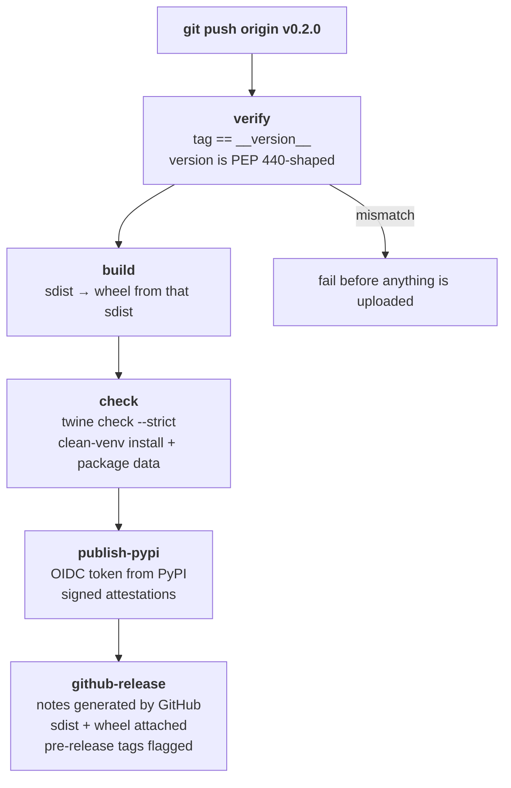

# Releasing

Maintainer runbook for publishing Crewlet to PyPI as
[`crewlet`](https://pypi.org/project/crewlet/). A release is one command —
pushing a `v*` tag — and everything else is done by
[`.github/workflows/release.yml`](.github/workflows/release.yml).

Nothing here is needed to *use* Crewlet; it is process for people with commit
rights on this repository, which is why it lives beside
[CONTRIBUTING.md](CONTRIBUTING.md) rather than in `docs/`.

---

## How a release flows



Pushing the tag is the whole release. The **GitHub Release is created
automatically** by the last job — you never open the *Draft a new release*
form. It titles the release from the version, has GitHub generate the body from
the pull requests merged since the previous tag, and attaches the same sdist and
wheel that went to PyPI.

The ordering matters: **a version can be uploaded to PyPI exactly once**. A bad
release can be yanked but never replaced, so every check that can fail runs
before the upload step, and the GitHub Release is created only after PyPI has
accepted the files — a Release must never point at a version the index
rejected.

`src/crewlet/__init__.py` holds the version. The tag is a trigger, not the
source of truth — the workflow refuses to build when they disagree, so a
mistyped tag costs you a `git tag -d`, not a burnt version number.

---

## One-time setup

### 1. Register the trusted publisher on PyPI

Crewlet publishes with [Trusted Publishing](https://docs.pypi.org/trusted-publishers/):
GitHub Actions proves its identity to PyPI over OpenID Connect and receives a
token scoped to that one run. **There is no API token in this repository, and
there should never be one** — a long-lived token is the single most valuable
thing a compromised workflow could steal.

You can register the publisher *before the project exists* using PyPI's
[pending publisher](https://docs.pypi.org/trusted-publishers/creating-a-project-through-oidc/)
flow, which is how the first release gets made. At
<https://pypi.org/manage/account/publishing/>, add:

| Field | Value |
|---|---|
| PyPI project name | `crewlet` |
| Owner | `crewlet` |
| Repository name | `crewlet` |
| Workflow name | `release.yml` |
| Environment name | `pypi` |

Repeat the same at <https://test.pypi.org/manage/account/publishing/> with the
environment name `testpypi`, so rehearsals work too.

> The publisher is bound to the **workflow filename** and the **environment
> name**. Renaming either — or moving the repository to a different
> owner/name — invalidates the binding, and publishing fails at upload with a
> confusing "not a trusted publisher" error. `tests/test_packaging` pins both
> names so a rename has to be deliberate.

### 2. Create the GitHub environments

Under **Settings → Environments**, create `pypi` and `testpypi`. For `pypi`,
add the protections that make the OIDC binding worth something:

- **Required reviewers** — a human approves the deployment before the upload
  step runs. This is the last stop before a permanent version number.
- **Deployment branches and tags** — restrict to the tag pattern `v*`, so a
  push to an arbitrary branch can never reach the publishing job.

### 3. Nothing else

No secrets, no `~/.pypirc`, no `twine upload` from a laptop. Releasing from a
workstation is not supported: it bypasses the verification steps and the
attestations, and the trusted publisher will not authenticate it anyway.

---

## Cutting a release

1. **Pick the version.** [Semantic versioning](https://semver.org/): the
   **minor** number moves for features, the **patch** number for fixes. A
   pre-release (`0.3.0rc1`, `0.3.0b1`) or dev version is allowed and is
   released the same way — the workflow flags it so GitHub does not present it
   as the latest release, matching pip, which will not resolve one without
   `--pre`.

2. **Bump `__version__`** in `src/crewlet/__init__.py`. That is the entire
   version bump — `pyproject.toml` reads it, and so does `crewlet --version`.

3. **Skim the merged pull requests** since the previous tag — they are the
   release notes. GitHub builds the Release body from their titles, so a title
   that reads as a commit log rather than a release note is worth editing on the
   pull request *before* you tag; the generated body is assembled at release
   time from whatever the titles say then.

4. **Run the checks**, including the packaging ones CI runs:

   ```bash
   uv run pytest
   uv run ruff check src/ tests/ && uv run ruff format --check src/ tests/
   uv run python -m build && uv run twine check --strict dist/*
   ```

5. **Rehearse on TestPyPI** (see below) if anything about the packaging changed.

6. **Merge to `main`, then tag it:**

   ```bash
   git tag v0.2.0
   git push origin v0.2.0
   ```

7. **Approve the deployment** when the `pypi` environment asks, and watch the
   run. When it is green, `pip install crewlet==0.2.0` works and the GitHub
   Release is up — created by the workflow, with the sdist and wheel attached.
   There is nothing to publish by hand.

---

## Release notes

The GitHub Release body is [generated by
GitHub](https://docs.github.com/en/repositories/releasing-projects-on-github/automatically-generated-release-notes)
from the pull requests merged since the previous tag — the workflow passes
`--generate-notes` to `gh release create`. Nothing is hand-assembled at release
time, and the notes stay accurate for whatever actually landed.

**They are the whole record of a release**, which puts the weight on pull
request titles: a title is what a reader deciding whether to upgrade sees, and
it is fixed once the pull request merges. `CONTRIBUTING.md` asks for titles
written as release notes for that reason. If a release ever needs prose the
titles cannot carry — a migration note, a breaking change worth a paragraph —
`gh release create` accepts `--notes-file` alongside `--generate-notes` and
appends the generated list to the file you pass.

`.github/release.yml` groups that list. Today it is two categories: everything
substantive first, then Dependabot's bumps (matched on the `dependencies` label
Dependabot applies itself) sorted to the bottom. The last category carries the
catch-all `*` so a pull request with no labels still appears — without it,
GitHub silently drops unmatched pull requests, which you would discover only by
reading a release that was missing something.

---

## Rehearsing on TestPyPI

Most release failures — a classifier PyPI refuses, a long description that will
not render, a trusted publisher that was never registered — surface only at
upload time. Run the workflow manually from **Actions → Release → Run
workflow** to do the full build and every check, then publish to TestPyPI
instead of PyPI:

```bash
pip install --index-url https://test.pypi.org/simple/ \
            --extra-index-url https://pypi.org/simple/ crewlet
```

The extra index is needed because TestPyPI does not mirror Crewlet's
dependencies.

Rehearsals use `skip-existing`, so re-running one against a version already
uploaded there is harmless. The real PyPI job deliberately does not:
re-publishing an existing version is a mistake worth failing on.

---

## What CI already guards

You do not need to remember most of the failure modes.
[`ci.yml`](.github/workflows/ci.yml) runs the same build on every pull request,
and `tests/test_packaging` asserts the metadata invariants:

- the version is single-sourced and PEP 440-shaped
- no deprecated `License ::` classifier alongside the SPDX `License-Expression`
  (a combination [PEP 639](https://peps.python.org/pep-0639/) requires PyPI to
  reject)
- the Python classifiers name exactly the interpreters CI runs, and every CI
  matrix names the same ones — a version added to `test` but not to
  `package-install` is a support claim only half of CI backs
- `crewlet[all]` is still the union of the runtime extras, and no extra is empty
- every relative link and image in `README.md` points at a real path **and** is
  rewritten to an absolute URL for the long description — PyPI has no
  repository to resolve them against, so a link the rewrite misses renders dead
  on the project page (see [README rendering](#readme-rendering) below)
- the release workflow still publishes via trusted publishing with no token,
  still creates the GitHub Release on a tag, and still flags pre-releases
- `.github/release.yml` still has a catch-all category, so no pull request can
  fall out of the generated notes

The version and tag checks the workflow runs on the tag live in
[`scripts/release_metadata.py`](scripts/release_metadata.py) rather than inside
the workflow YAML, so `tests/test_packaging` exercises them on every pull
request. Anything embedded in the workflow instead would run for the first time
on the tag that publishes — which is exactly the moment it is too late.

Two jobs cover the artifacts. **`package`** builds the wheel *from the sdist*
(so anything missing from the sdist fails there) and runs `twine check
--strict`. **`package-install`** then takes that one artifact and, on each
supported interpreter, installs it into a clean virtualenv and checks that
`crewlet --version` runs and that the non-Python package data shipped — the
dashboard assets under `src/crewlet/static/`, the SQL files under
`src/crewlet/db/migrations/`, and `py.typed`. That is a different install shape
from the `test` job, which installs `[dev,all]` editable from the source tree:
this one is the wheel, core dependencies only, the way PyPI serves it.

The release workflow builds and smoke-tests on one interpreter only. It is
cutting a single artifact, and a tag is cut from `main`, which CI has already
run across the full matrix.

---

## README rendering

`README.md` keeps repo-relative links because GitHub and
[docs.crewlet.ai](https://docs.crewlet.ai) both resolve them. PyPI does not, so
[`hatch-fancy-pypi-readme`](https://github.com/hynek/hatch-fancy-pypi-readme)
rewrites them at build time — links to `github.com/crewlet/crewlet/blob/main/…`,
images to `raw.githubusercontent.com`. The substitutions live at the bottom of
`pyproject.toml`.

Add a link in a form the patterns do not cover and the packaging test fails
with the surviving reference. Fix the pattern rather than the README: on-disk
links must stay relative.

---

## What ships in each artifact

| | Contents |
|---|---|
| **wheel** (`crewlet-X.Y.Z-py3-none-any.whl`) | `src/crewlet/` in full: Python modules, the dashboard's static assets, the SQL migrations, `py.typed` |
| **sdist** (`crewlet-X.Y.Z.tar.gz`) | The wheel's contents plus `tests/`, `docs/`, `examples/`, `schema/`, `scripts/`, `.github/`, and the root metadata files — a source release you can build, test, and read offline |

The sdist excludes only `CLAUDE.md` and `.claude/`: they configure the agent
tooling that writes this repository, not the software in it.

Both artifacts carry [PEP 740](https://peps.python.org/pep-0740/) digital
attestations, generated automatically because the upload is a trusted-publisher
upload. They let anyone verify the files came from this workflow in this
repository.

---

## If a release goes wrong

**Before the upload step ran** — delete the tag (`git push --delete origin
v0.2.0`), fix the problem, re-tag. Nothing is public yet.

**After PyPI accepted the files** — the version is spent. Fix forward with a new
patch release. If the bad release is actively harmful (broken install, leaked
credential, wrong contents), [yank](https://pypi.org/help/#yanked) it from the
project's *Manage* page: yanking hides it from fresh resolutions while leaving
it installable for anyone who pinned it exactly, so it does not break existing
lockfiles.

**The upload was rejected as not-a-trusted-publisher** — the binding does not
match. Check the owner, repository name, workflow *filename*, and environment
name against what is registered on PyPI; all four must agree exactly.
