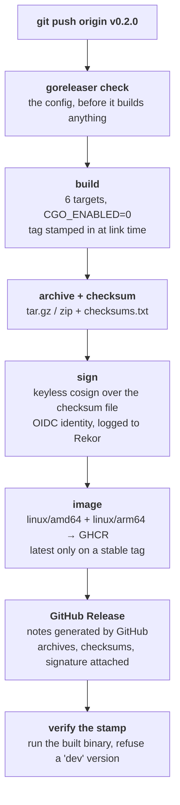

# Releasing

Maintainer runbook for publishing Crewlet. A release is one command — pushing a
`v*` tag — and everything else is done by
[`.github/workflows/release.yml`](.github/workflows/release.yml) driving
[goreleaser](https://goreleaser.com) from
[`.goreleaser.yaml`](.goreleaser.yaml).

Nothing here is needed to *use* Crewlet; it is process for people with commit
rights on this repository, which is why it lives beside
[CONTRIBUTING.md](CONTRIBUTING.md) rather than in `docs/`.

---

## How a release flows



Pushing the tag is the whole release. The **GitHub Release is created
automatically** — you never open the *Draft a new release* form. goreleaser
titles it from the version, has GitHub generate the body from the pull requests
merged since the previous tag, and attaches every archive, the checksum file and
its signature.

**The tag is the version.** Nothing in the tree records one, so there is nothing
for a tag to disagree with and no version bump to make. goreleaser stamps the
tag into `internal/version.value` at link time; a binary built any other way
(`go install`, a local `go build`) reports its module build info instead, so it
names itself honestly rather than claiming to be a release.

That single source of truth is the one thing this pipeline improves on the
package-index one it replaced, and it costs something in exchange: a mistyped
tag is not caught by a version comparison, because there is no second copy to
compare against. Delete it and re-tag — see [If a release goes
wrong](#if-a-release-goes-wrong).

---

## One-time setup

### Nothing, and that is the point

There is **no credential to provision**. The workflow authenticates three
different things with the run's own short-lived identity:

| What | How |
|---|---|
| Creating the GitHub Release | `GITHUB_TOKEN`, `contents: write` |
| Pushing to `ghcr.io/crewlet/crewlet` | the same token, `packages: write` |
| Signing the checksums | an OIDC token, `id-token: write` — cosign mints a short-lived certificate from it |

No API token, no stored key, no `~/.docker/config.json`, no private key for
cosign. That preserves the property the previous pipeline had under PyPI
Trusted Publishing: a compromised workflow has nothing long-lived to steal.

The one thing worth checking once, in **Settings → Actions → General**, is that
the default workflow token is allowed to write packages — otherwise the image
push fails at the end of an otherwise complete release.

Releasing from a workstation is not supported. It skips the signature and the
provenance the OIDC identity carries, and it would produce binaries nobody
checksummed.

---

## Cutting a release

1. **Pick the version.** [Semantic versioning](https://semver.org/): the
   **minor** number moves for features, the **patch** number for fixes. A
   pre-release (`v0.3.0-rc.1`) is released the same way and takes neither
   "Latest" on GitHub nor the `latest` image tag, so an operator who pinned
   nothing never receives one.

2. **Skim the merged pull requests** since the previous tag — they *are* the
   release notes. GitHub builds the body from their titles, so a title that
   reads as a commit log rather than a release note is worth editing on the
   pull request *before* you tag; the body is assembled at release time from
   whatever the titles say then.

3. **Run the checks CI runs:**

   ```bash
   go test ./... -race
   gofmt -l . && go vet ./... && golangci-lint run
   ```

4. **Rehearse the release itself** if anything about the release surface
   changed (see below). This is cheap and offline — do it whenever you are
   unsure.

5. **Merge to `main`, then tag it:**

   ```bash
   git tag v0.2.0
   git push origin v0.2.0
   ```

6. **Watch the run.** When it is green the archives, checksums and signature
   are on the Release, `ghcr.io/crewlet/crewlet:0.2.0` is pullable, and there
   is nothing to publish by hand.

---

## Rehearsing a release

The whole pipeline runs in **snapshot mode** without a tag and without
touching GitHub:

```bash
make snapshot   # goreleaser check
                # goreleaser release --snapshot --clean --skip=sign
```

That is the snapshot job's own pair of commands. `check` runs first so a
config error is reported as a config error rather than as whatever the build
does with a bad field, and **`--skip=sign` is not optional**: signing is not
part of the publish phase `--snapshot` already skips, so without it a
rehearsal runs `cosign sign-blob --yes` over the checksums and tries to mint a
real Sigstore certificate from a machine with no OIDC token to mint it from.

It builds all four targets, the archives, the checksums *and the container
image*. The image is worth a note: buildx cannot assemble a multi-platform
manifest without pushing it, so `dockers_v2` builds and pushes in one step and
runs in goreleaser's **publish** phase. `--skip=publish` therefore skips the
image build entirely and leaves the `Dockerfile` untested — which is why both
the CI job and `make snapshot` skip only signing. A snapshot pushes nothing
regardless: it builds each
architecture locally under its own suffixed tag
(`ghcr.io/crewlet/crewlet:0.2.1-SNAPSHOT-amd64` and `-arm64`), so there is no
`latest` and no manifest to find afterwards.

Building the `linux/arm64` image on an amd64 machine needs binfmt registered
(`docker run --privileged --rm tonistiigi/binfmt --install all`), or the arm64
leg fails inside `apt-get` with an exit code and no explanation. Add
`--skip=docker` if you only care about the binaries.

CI runs the same thing for you: the snapshot job fires on demand
(**Actions → release → Run workflow**) and on any pull request touching
`.goreleaser.yaml`, `Dockerfile`, `go.mod`, `internal/version/**` or the
workflow. That is what stops the release pipeline running for the first time
on the tag that publishes.

---

## What CI already guards

[`ci.yml`](.github/workflows/ci.yml) runs the build, the race suite, both store
drivers, the end-to-end gates and the linter on every pull request. The release
surface itself is guarded only by what the release pipeline does when it runs:

- **`goreleaser check`** runs first in both release jobs, so a malformed or
  unknown field in `.goreleaser.yaml` is reported as a config error rather than
  as whatever the build does with it.
- **The snapshot job builds everything** — all four targets, the archives, the
  checksums and the container image — on demand and on any pull request
  touching `.goreleaser.yaml`, `Dockerfile`, `go.mod`, `internal/version/**` or
  the workflow. A dependency that needs cgo, or a `Dockerfile` that no longer
  copies from `${TARGETPLATFORM}`, fails there rather than at tag time.
- **Both release jobs run the built binary** and compare what it reports against
  the version goreleaser recorded in `dist/metadata.json`. That is the only
  symptom the ldflags stamp has: rename `internal/version.value`, move the
  package or change the module path and the `-X` flag silently applies to
  nothing — the link still succeeds and the binary falls back to its build
  info. The comparison is equality, never a sentinel: sniffing the output for
  `dev` is what this used to do, and since Go 1.24 an unstamped build in a
  repository reports a tag-derived pseudo-version instead, so a stamp that
  applied to nothing shipped green. The publish job also checks that the tag
  goreleaser built is the ref the run was triggered by.

### What nothing guards — check these by hand

`internal/version` used to assert each of these against the file that carries
it. Those tests were dropped, and nothing replaced them: there is no actionlint,
no yamllint and no schema validation anywhere in the tree, and GitHub accepts
every one of these mistakes as valid configuration. Each fails **silently** —
the pipeline stays green and simply stops doing the thing — so read the file
when you touch it:

- **`.github/release.yml` keeps its catch-all `*` category.** Without it an
  unlabelled pull request is omitted from the release body with no warning, and
  nothing at release time diffs that body against the merged pull requests. The
  notes are the only record a release has, and the failure reads as a quiet
  week.
- **`prerelease: auto`, and the `latest` image tag stays guarded on the release
  being stable.** Lose either and a release candidate becomes GitHub's "Latest"
  or answers `docker pull crewlet` for everyone who pinned nothing.
- **`changelog.use: github-native`.** Any other mode builds the body from commit
  subjects instead of pull request titles and makes `.github/release.yml` a dead
  file that keeps being maintained.
- **Exactly one workflow carries `push: tags: ["v*"]`.** Two race to create one
  Release for one tag and the loser fails after its artifacts are built — and
  the opposite mistake, a trigger that ends up somewhere Actions ignores, means
  pushing a tag publishes nothing at all. Both `.yml` and `.yaml` count.
- **`docs-publish.yml` watches the release workflow by its exact `name:`.**
  GitHub reports nothing when that string matches no workflow, so a rename on
  either side just means the trigger never fires again and the site falls back
  to its hourly poll.
- **Every dependency surface has a `.github/dependabot.yml` entry.** A manifest
  nobody told Dependabot about produces no pull requests, which looks exactly
  like a manifest with nothing to update — that is how `go.mod` went unwatched
  for the length of the rewrite. Ecosystem names must match whole: as a
  substring, `docker` is satisfied by the `docker-compose` entry.
- **`.github/workflows/dependabot-merge.yml`'s guard and its merge flags.** The
  job holds `contents: write` and `pull-requests: write` and runs `gh pr review
  --approve`; its `if:` is the only thing stopping it approving a commit a
  person pushed onto a Dependabot branch, and `--auto` is the only thing holding
  the merge until the checks `main` requires have reported. Weakening either
  makes the workflow run *more*, never fail.

---

## What ships in a release

| | Contents |
|---|---|
| **archives** (`crewlet_X.Y.Z_<os>_<arch>.tar.gz`) | one `crewlet` binary, `LICENSE`, `README.md` — four of them: linux and darwin × amd64 and arm64. **No Windows**, and **no musl**; see below (and [`decisions/003`](decisions/003-turso-is-the-only-driver.md)) |
| **`checksums.txt`** | SHA-256 over every archive |
| **`checksums.txt.sig` + `checksums.txt.pem`** | the keyless cosign signature and its certificate |
| **`ghcr.io/crewlet/crewlet:X.Y.Z`** | a multi-arch image (linux/amd64, linux/arm64) — also `:latest` on a stable tag |

The binary is self-contained: the dashboard's assets are embedded, the store is
a file it creates, and the event stream is an embedded NATS JetStream server.
There is no runtime to install and nothing to point a DSN at.

The image is `debian:trixie-slim` with `ca-certificates`, `git` and `tini`
rather than `distroless` or `scratch`, because the engine **spawns process
trees** — the local sandbox backend runs a coding agent as a child process,
setup recipes are shell, and stdio MCP servers are child processes launched by
whatever the config names. On `scratch` all three fail at the moment they are
used, from an image that started perfectly happily. The reasoning is at the top
of the [`Dockerfile`](Dockerfile).

### Verifying a download

```bash
cosign verify-blob checksums.txt \
  --certificate checksums.txt.pem \
  --signature checksums.txt.sig \
  --certificate-identity-regexp '^https://github\.com/crewlet/crewlet/' \
  --certificate-oidc-issuer https://token.actions.githubusercontent.com

sha256sum -c checksums.txt --ignore-missing
```

One signature over the file that covers every artifact: verify the checksums
file, then the checksum of what you downloaded. The identity flags are not
optional — `verify-blob` without them accepts a signature from *any* identity,
which proves the file was signed by someone rather than by this repository.

---

## Release notes

The Release body is [generated by
GitHub](https://docs.github.com/en/repositories/releasing-projects-on-github/automatically-generated-release-notes)
from the pull requests merged since the previous tag. Nothing is hand-assembled
at release time, and the notes stay accurate for whatever actually landed.

**They are the whole record of a release** — there is no `CHANGELOG.md` — which
puts the weight on pull request titles: a title is what a reader deciding
whether to upgrade sees, and it is fixed once the pull request merges.
`CONTRIBUTING.md` asks for titles written as release notes for that reason.

[`.github/release.yml`](.github/release.yml) groups the list into two
categories: everything substantive first, then Dependabot's bumps (matched on
the `dependencies` label Dependabot applies itself) sorted to the bottom. The
last category carries the catch-all `*`, so a pull request with no labels still
appears.

If a release ever needs prose the titles cannot carry — a migration note, a
breaking change worth a paragraph — put it in `release.header` or
`release.footer` in `.goreleaser.yaml`, which wrap the generated list rather
than replacing it. Editing the body on GitHub afterwards works too, but is
lost if the tag is ever re-run: `release.mode` is `replace`, so a re-run
regenerates the body it built the first time instead of duplicating it.

---

## If a release goes wrong

**Before the workflow reached the release step** — delete the tag
(`git push --delete origin v0.2.0 && git tag -d v0.2.0`), fix the problem,
re-tag. Nothing is published yet.

**After the Release exists** — the artifacts are downloadable and the image tag
is pullable, so treat the version as spent and fix forward with a new patch
release. Deleting a Release and re-pushing the tag is possible and is the wrong
instinct: anyone who already pulled the image by digest, or scripted the
download URL, is left with something that no longer matches what the tag now
means.

If the bad release is actively harmful (broken binary, wrong contents, a leaked
credential), mark the Release as a pre-release so it stops being "Latest", cut
the fix immediately, and say so in the fixing release's notes. Container tags
are mutable and binaries are not, so also re-point `latest` by releasing the
fix rather than by retagging the image by hand.

**The image push was rejected** — the run's token could not write packages.
Check **Settings → Actions → General** (workflow permissions) and that the
package at `ghcr.io/crewlet/crewlet`, if it already exists, lists this
repository under its *Manage Actions access*.

**The signature step failed** — cosign could not mint a certificate, which
means the job did not get an OIDC token. Confirm `id-token: write` is still in
the `publish` job's `permissions`; it is not inherited from the workflow-level
block.
