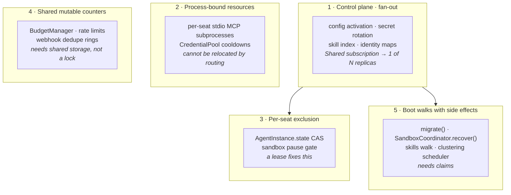

# Scaling Crewlet

**Status:** analysis + proposed direction. Nothing here is implemented.

**Audience:** Crewlet maintainers. The operator-facing rule ("run exactly one
engine") lives in [`docs/guides/deployment.md`](docs/guides/deployment.md#replica-count);
this file explains *why* it exists and what it would take to lift it.

---

## The constraint today

`crewlet run` must run as **exactly one process per company**. `crewlet run api`
may run alongside it, but is also effectively single-instance today (see
[The API half](#the-api-half)).

Nothing in the code enforces this and — until the change that added this file —
nothing in the docs stated it. An operator who sets `replicas: 2` gets duplicate
Slack replies, a token budget cap that is silently N× too large, and a config
hot-reload that reaches one replica out of N, with no error anywhere.

---

## Verdict on the obvious hypothesis

> *"The engine is a singleton because turns for one agent must be serialized.
> Solve that with Pulsar or a shared lock and the blocker goes away."*

**Half right, and the half that's right is the easy half.** Per-agent turn
serialization is a real constraint, but it is roughly the *fourth* hardest
problem, and neither of the two proposed mechanisms solves it as-is.

### What actually serializes turns today

Not a lock. Not a semaphore. Not a queue property.

```python
# src/crewlet/agent/turn.py:515 — _start_working_or_wait
while not agent.start_working(task_id):
    await agent.wait_for_state_change()
```

`AgentInstance.start_working` (`src/crewlet/agent/instance.py:142`) is a
compare-and-set on a plain Python attribute — `if self.state == AgentState.IDLE:
self.state = AgentState.WORKING`. Mutual exclusion holds because every handler
for a given seat dereferences **the same object in one process's heap**.

That matters for the redesign in two ways. First, there is no lock to "make
distributed" — the mechanism has to be built, not swapped. Second, the same
object also carries `current_task_id`, `working_task`, the token counters, the
onboarding latch, and the `AWAITING_SANDBOX` state that gates the sandbox
pause. A distributed lock replaces one of those five things.

### Why Pulsar `Key_Shared` does not work

Two independent reasons:

1. **No message ever carries a key.** `PulsarEventQueue._send_once` is
   `producer.send_async(data, callback)` (`src/crewlet/queue/pulsar.py:474`) —
   no `partition_key` anywhere in the repo. Every message would hash to Pulsar's
   `NONE_KEY` constant, which serializes **the entire org** onto one consumer.
2. **There is no key dimension to spread.** The inbox is already
   `crewlet.agent.{handle}.inbox` — one topic per seat. Key_Shared exists to
   partition *within* a topic; here the partitioning has already happened at the
   topic level.

Key_Shared also reassigns key ranges on every consumer join/leave — precisely
the window a multi-minute turn occupies. It gives per-key *ordering*, never
*mutual exclusion across a long-running handler*. Those are different problems
(see [Ordering vs. exclusion](#ordering-vs-exclusion)).

### Why `Failover` does not work either

The tempting one-line fix is to flip the per-seat inbox to a `Failover`
subscription: Pulsar elects one active consumer per topic, the rest stand by.

`_create_durable_consumer` (`src/crewlet/queue/pulsar.py:667`) never passes
`consumer_name`, so the client generates a random one. Pulsar elects the active
consumer by sorting on `(priorityLevel, consumerName)` — with random names, a
newly joining replica **preempts a running one on a coin flip**, for every seat,
on every deploy. On the switch Pulsar redelivers the old active's unacked
messages to a replica whose `AgentInstance` is a separate `IDLE` object,
reproducing exactly the duplicate turn it was introduced to prevent.

Pinning a stable `consumer_name` makes election deterministic in the wrong
direction: the lexicographically-first replica wins every seat and the rest are
pure standby.

`Failover` is a reasonable *locality hint* layered on top of an ownership
mechanism. It is not the ownership mechanism.

### Ordering vs. exclusion

Worth stating precisely, because they need different solutions and the codebase
only needs one of them:

- **Ordering** — event N for a seat is handled before event N+1. Crewlet does
  *not* require this. Inbox batching already reorders deliberately: partitions
  dispatch oldest-conversation-first, and deferred partitions are republished
  (`src/crewlet/queue/pulsar.py:930`).
- **Exclusion** — at most one turn runs for a seat at a time. Crewlet **does**
  require this, and it is what `start_working` provides.

So the target is a mutual-exclusion primitive with a multi-minute hold time and
a liveness story for a replica that dies mid-turn. Brokers are bad at that;
leases are good at it.

---

## The five classes of coupling

A repo audit found 146 distinct couplings (65 of them able to cause data loss,
duplicate external side effects, or hangs). They fall into five classes, and
**only class 3 is what a lock fixes**.



### 1. Control plane — the hardest problem

**Crewlet has no control plane.** Config activation, secret rotation, tool-skill
index updates and external-identity maps are all delivered over
*competing-consumer* subscriptions into *per-process memory*, with no reconcile
loop anywhere.

`_create_durable_consumer` hardcodes `consumer_type=pulsar.ConsumerType.Shared`
(`src/crewlet/queue/pulsar.py:671`) — the single construction path for every
durable consumer in the codebase. So:

| Topic | Group | Consequence with N replicas |
|---|---|---|
| `crewlet.config.revision_activated` | `engine-config` (`engine.py:1144`) | One replica applies the new org, providers, MCP creds, transports. N−1 run the old company forever. A deleted role keeps answering Slack. |
| `crewlet.config.revision_activated` (API) | `api-config` (`api/config_refresh.py:361`) | The dashboard shows a different company depending on which replica the load balancer picks. |
| secret snapshot | process-global `_SOURCE` (`secrets/resolver.py:59`) | A rotated credential reaches at most one replica; the rest keep using the revoked one. |

A lock makes this **strictly worse** — it guarantees one winner and N−1 losers.
This class needs broadcast *plus* periodic reconciliation against the
authoritative store, plus a fail-closed interlock so a stale replica refuses to
act. Broadcast alone is not enough: `subscribe_stream` is Shared +
`InitialPosition.Latest` + regex-discovery-lagged, which converts "always wrong"
into "silently wrong sometimes".

This is also the root that several other blockers chain off. The scheduler's
at-most-once ledger is genuinely correct SQL, but its *fire identity* is
computed from the handling replica's org (`schedule/scheduler.py:184`) — so
stale config defeats a ledger that is itself sound.

The sharpest edge: `app.state.configured` is per-process, and an unconfigured
replica drops inbound webhooks with **HTTP 200**
(`src/crewlet/api/routes/webhooks.py:152`). A missed broadcast becomes silent,
unretried, unrecoverable inbound data loss — the upstream sees success.

### 2. Process-bound resources

"Any replica can serve any seat" is false regardless of what the broker does.

- **Per-agent stdio MCP servers are child processes of the engine**
  (`engine.py:3319`), each holding that seat's credentials. A seat's tools live
  where its subprocesses live.
- **`CredentialPool` cooldowns are `time.monotonic()` values**
  (`providers/credential.py:82`) — a per-process, per-boot epoch not even
  *comparable* across replicas. A 429 cools a key on one replica; the other N−1
  keep hammering it for the full hour. Worse, when every key cools the provider
  raises `AllCredentialsExhausted`, which `FallbackLLMProvider` catches to fall
  through to the next provider — so **two replicas can answer the same seat on
  different models**.

MCP placement has to be decided *together with* turn routing, not after it.

### 3. Per-seat exclusion — the class the hypothesis is about

`AgentInstance.state` (`instance.py:55`), the `AWAITING_SANDBOX` gate
(`instance.py:197`), and the sandbox inbox pause — which is a **process-local
set** (`queue/pulsar.py:369`), so only 1 of N replicas ever actually pauses the
seat's inbox while a detached coding run is in flight.

This is the class a lease fixes cleanly.

### 4. Shared mutable counters

Not exclusion problems — storage problems:

- `BudgetManager` is in-memory (`concurrency.py:151`), so an org cap of 500 k
  tokens becomes N × 500 k.
- `ConcurrencyController`'s semaphore is per-process, so `max_concurrent` is
  N× the configured value.
- All four inbound webhook dedupe rings are in-memory dicts (Slack
  `transports/slack.py:175`, Jira, Confluence, Plane) — and **GitHub and GitLab
  have no dedupe at all**, not even the in-memory ring
  (`notifications/service.py:631`).
- The sandbox OTLP token store is a per-process dict (`sandbox/otel.py:40`)
  behind a load-balanced route.

### 5. Boot walks with external side effects

- `migrate()` runs on every boot with **no advisory lock** over non-idempotent
  DDL (`db/migrator.py:83`).
- `SandboxCoordinator.recover()` reaps every `resumed` row at boot
  (`sandbox/coordinator.py:498`). The "abandoned by a dead engine" inference is
  only valid when there is one engine — with peers, it tears down **live** runs.
- `SkillClusteringScheduler` (`learning/skill_scheduler.py:117`) is a bare
  interval loop with no claim: every replica runs a full LLM synthesis pass and
  writes duplicate pages to the shared knowledge base.
- Live role decommission calls `unsubscribe`, which deletes the **broker-side**
  subscription peers are still consuming (`engine.py:5116`).

---

## What is already multi-process safe

Credit where it is due — the codebase already contains three correct
cross-process claim primitives, and they are the templates for the rest:

| Primitive | Mechanism |
|---|---|
| `ScheduledRunStore.claim` (`schedule/store.py:85`) | `INSERT … ON CONFLICT DO NOTHING` on a composite PK — genuine at-most-once fire |
| `PendingSandboxRunStore.claim_for_resume` (`sandbox/pending_store.py:298`) | `WITH prev AS (SELECT … FOR UPDATE) UPDATE … RETURNING` — a real compare-and-set with the pre-flip status preserved |
| `OnboardingMarkerStore.try_claim_pass` (`learning/onboarding_markers.py:136`) | TTL-bounded lease — the closest thing to a general lease in the tree |

Also already safe: deterministic agent ids (`db/agents.py:32`) so identity never
forks; the TimescaleDB event store's `ON CONFLICT (event_time, event_id) DO
NOTHING` (`timescaledb/repository.py:89`); and `events/subscriptions.py`, whose
Shared group means each task-routing event is handled exactly once no matter how
many replicas run it.

---

## The API half

The standalone API is *already close to* horizontally scalable, and this is the
strongest argument against merging the two processes.

- **Standalone** `crewlet run api` uses
  `subscribe_stream("crewlet.events.>", stream.ingest)` (`cli.py:1602`) — a
  genuinely broadcast ephemeral consumer. Every API replica sees every event.
- **Embedded** uses `add_publish_listener` (`engine.py:2710`), which fires only
  on *this process's own* publishes.

So merging the halves **regresses the dashboard** from "sees everything" to
"sees 1/N", and drags the engine's in-process couplings (`app.state.engine`,
read by `/health`; `engine._build_tools_data()`, read by `/tools`) into every
replica.

This also falsifies the claim in `docs/concepts/overview.md` that the halves
"communicate only through Pulsar" — `create_app(engine=self, stream=stream,
event_store=…, database=…)` (`engine.py:2713`) hands the API four live
in-process object references. That claim has been corrected.

---

## Mechanism comparison

| Option | Verdict |
|---|---|
| **(a) Pulsar `Key_Shared`** | **Reject.** No key is ever set, and the inbox is already one topic per seat so there is no key dimension. Gives ordering, not exclusion. |
| **(b) Pulsar `Failover` per inbox topic** | **Reject as correctness; keep as locality hint.** `consumer_name` is unset → election is a coin flip → a joining replica preempts a running turn. |
| **(c) PG lease table with heartbeats** | **Adopt.** The only option that survives broker rebalance, gives a *fencing* answer to "do I still own this seat", and gates the non-inbox turn paths (scheduler, sandbox resume, A2A) that no broker mechanism touches. |
| **(d) Stateless API + sharded engine (do *not* merge)** | **Adopt first.** The API is nearly there; the fix list is small and bounded. |
| **(e) Full merge + consistent-hash seat ownership** | **Reject.** Needs a membership service that does not exist, churns on every rolling deploy, and does not address the control-plane class at all. |

### Recommendation: (d), then (c)

**Do not merge the processes.** Ship the API as the stateless, horizontally
scalable half. Shard the *engine* by **seat ownership** on a PostgreSQL lease,
with `Failover` as an optional locality hint layered on top once
`consumer_name` is set deliberately — never as the invariant.

Seat ownership, not request routing, is the right shard key: it is the only unit
that makes the per-seat MCP subprocesses (class 2) placeable, and it collapses
the per-subscription thread cost — `_create_durable_consumer` opens a dedicated
single-thread executor per subscription (`queue/pulsar.py:679`), so under "every
replica subscribes every seat" thread count scales with seats × replicas rather
than with work.

One trap the lease design must respect: `_start_working_or_wait` parks while
**holding the Pulsar delivery unacked**, and the inbox ack timeout is 30 minutes
(`pulsar.py:87`). A lease-blocked turn must therefore **NAK-and-defer, never
park** — otherwise the trigger redelivers to the peer and produces the exact
duplicate the lease exists to prevent. And NAK is not free: the negative-ack
redelivery delay is 1000 ms against `_INBOX_MAX_REDELIVER = 3`, so three
deferrals dead-letter a healthy event in three seconds. Both constants have to
move together.

---

## Prerequisites, in order

These are load-bearing and none of them exist today.

0. **Instance identity.** A replica id that is *stable across restarts*, sourced
   from the deployment (pod name / StatefulSet ordinal / an explicit Tier A
   field). Roughly fifteen of the fixes above presuppose one. It must not be a
   self-generated `uuid4` — that reproduces the `hook-{id(callback)}` orphaned-
   subscription leak (`engine.py:3453`).

1. **A held-connection `Database` API.** `Database` exposes exactly `execute`,
   `fetchrow`, `fetchval` (`db/client.py:54-68`), each acquiring and releasing a
   pooled connection per statement. asyncpg's pool reset runs
   `pg_advisory_unlock_all()` on release, so **every advisory-lock fix is a
   silent no-op** and no migration file can be transactional. `acquire()` /
   `transaction()` are a hard prerequisite.

2. **A `crewlet.db.leases` module**, modelled on `try_claim_pass`, with two
   defects fixed: an `owner` column so release is owner-predicated (today
   `release_claim` has no owner check and can clear a successor's live lease),
   and `renew(resource, owner, ttl)` for heartbeats. Prefer this over
   `pg_advisory_lock` everywhere except the migrator — advisory locks have no
   fencing token and no TTL, so a hung-but-connected holder blocks the fleet
   forever. For the migrator, release-on-disconnect is the *right* property (a
   SIGKILLed migrator must not wedge every future boot), so a real advisory lock
   on a held connection is correct there.

3. **A real control plane** — broadcast *plus* an interval reconcile against the
   authoritative store, plus fail-closed behaviour on staleness.

4. **Shared state for class 4** — budgets as an atomic conditional UPDATE,
   webhook dedupe as `INSERT … ON CONFLICT DO NOTHING` keyed on provider
   delivery ids (covering GitHub/GitLab, which have none today), rate limits and
   credential cooldowns in shared storage, stateless HMAC OTLP tokens.

5. **Only then** seat leases and per-agent exclusivity.

### One fix to avoid

A side-effect ledger keyed on `hash(trigger_event.id, tool_name,
canonical(arguments))` is unsound: it swallows a legitimate repeat call within
one turn, and adding a call ordinal breaks the redelivery case because a re-plan
through a non-deterministic LLM produces different ordinals. The workable shape
is a per-`(agent_handle, trigger_event.id)` **turn claim taken before planning**,
so a redelivered trigger short-circuits rather than re-planning.

---

## Pre-existing bugs surfaced by this audit

These are **not** scaling bugs. They are live in the currently documented
two-process deployment and are tracked separately from the work above.

1. **pgvector width is baked at 1536 by `crewlet run api`.**
   `_connect_and_migrate_from_db` derives `embedding_dimensions` from the active
   revision, falling back to `"1536"` when there is none (`cli.py:796`), and
   `_build_api_parser` has **no `--import-company` flag**. On the
   deployment.md-documented cold start, if the API wins the boot race against an
   empty `company_config` table it applies `002_episodes.sql` and
   `007_agent_diary.sql` at `vector(1536)` and records those versions. Migrations
   are forward-only, so an engine booting seconds later with a 3072-dim model can
   never widen them — every `agent_diary` and `episodes` insert raises forever,
   and `ReflectEngine` swallows it. The learning subsystem is silently dead.

2. **Three entry points race `migrate()`** — `cmd_run` (`cli.py:1180`),
   `cmd_api` (`cli.py:1572`) and `crewlet config import`
   (`cli_config_handlers.py:101`) — and deployment.md tells operators to start
   the engine and API concurrently. Beyond the `DuplicateTable` crash, there is a
   quieter corruption: `learning_health` is `CREATE OR REPLACE VIEW`'d in both
   `005_skill_use_telemetry.sql` and `009_skill_curator.sql`. Applied out of
   order, the view keeps the 005 definition while `schema_migrations` records 009
   as applied — permanently wrong operator metrics that no re-run will fix.

3. **The standalone API has no sandbox OTLP receiver.** `cmd_api`'s
   `create_app(...)` (`cli.py:1587`) omits it, so `app.state.sandbox_otel_receiver`
   is `None` and `/otlp/{token}/v1/{signal}` returns 503
   (`api/routes/webhooks.py:550`) for every export. In a split deployment the
   externally-reachable API *is* the standalone one, which is exactly what
   `CREWLET_SANDBOX_OTEL_RECEIVER_URL` is documented to point at.
