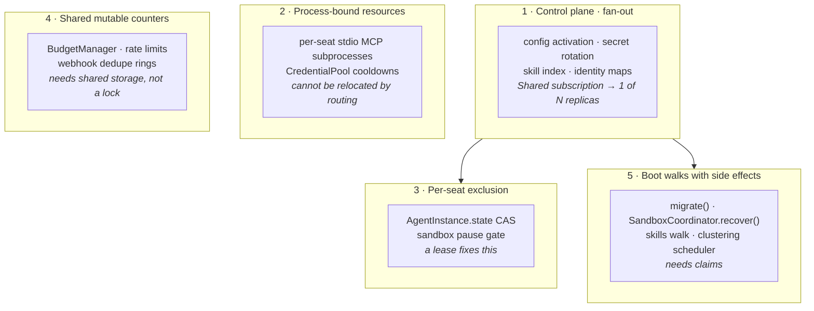
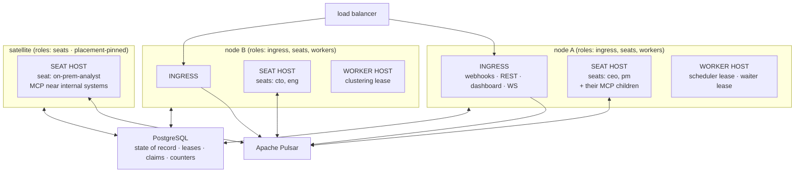

# Scaling Crewlet

**Status:** analysis + target-architecture decision. Nothing here is implemented.

**Audience:** Crewlet maintainers. The operator-facing rule ("run exactly one
engine") lives in [`docs/guides/deployment.md`](docs/guides/deployment.md#replica-count);
this file explains *why* it exists and records the decided direction for
lifting it. Breaking changes are in scope for the target design.

---

## The constraint today

`crewlet run` must run as **exactly one process per company**. `crewlet run api`
may run alongside it, but is also effectively single-instance today (see
[The wiring fork](#the-wiring-fork)).

Nothing in the code enforces this and — until the change that added this file —
nothing in the docs stated it. An operator who sets `replicas: 2` gets duplicate
Slack replies, a token budget cap that is silently N× too large, and a config
hot-reload that reaches one replica out of N, with no error anywhere.

---

## Verdict on the obvious hypothesis

> *"The engine is a singleton because turns for one agent must be serialized.
> Solve that with Pulsar or a shared lock and the blocker goes away."*

**Half right, and the half that's right is the easy half.** Per-agent turn
serialization is a real constraint, but it is roughly the *fourth* hardest
problem, and neither of the two proposed mechanisms solves it as-is.

### What actually serializes turns today

Not a lock. Not a semaphore. Not a queue property.

```python
# src/crewlet/agent/turn.py:515 — _start_working_or_wait
while not agent.start_working(task_id):
    await agent.wait_for_state_change()
```

`AgentInstance.start_working` (`src/crewlet/agent/instance.py:142`) is a
compare-and-set on a plain Python attribute — `if self.state == AgentState.IDLE:
self.state = AgentState.WORKING`. Mutual exclusion holds because every handler
for a given seat dereferences **the same object in one process's heap**.

That matters for the redesign in two ways. First, there is no lock to "make
distributed" — the mechanism has to be built, not swapped. Second, the same
object also carries `current_task_id`, `working_task`, the token counters, the
onboarding latch, and the `AWAITING_SANDBOX` state that gates the sandbox
pause. A distributed lock replaces one of those five things.

### Ordering vs. exclusion

Worth stating precisely, because they need different solutions and the codebase
only needs one of them:

- **Ordering** — event N for a seat is handled before event N+1. Crewlet does
  *not* require this. Inbox batching already reorders deliberately: partitions
  dispatch oldest-conversation-first, and deferred partitions are republished
  (`src/crewlet/queue/pulsar.py:930`).
- **Exclusion** — at most one turn runs for a seat at a time. Crewlet **does**
  require this, and it is what `start_working` provides.

So the target is a mutual-exclusion primitive with a multi-minute hold time and
a liveness story for a replica that dies mid-turn. Brokers are bad at that;
leases are good at it.

---

## The five classes of coupling

A repo audit found 146 distinct couplings (65 of them able to cause data loss,
duplicate external side effects, or hangs). They fall into five classes, and
**only class 3 is what a lock fixes**.



### 1. Control plane — the hardest problem

**Crewlet has no control plane.** Config activation, secret rotation, tool-skill
index updates and external-identity maps are all delivered over
*competing-consumer* subscriptions into *per-process memory*, with no reconcile
loop anywhere.

`_create_durable_consumer` hardcodes `consumer_type=pulsar.ConsumerType.Shared`
(`src/crewlet/queue/pulsar.py:671`) — the single construction path for every
durable consumer in the codebase. So:

| Topic | Group | Consequence with N replicas |
|---|---|---|
| `crewlet.config.revision_activated` | `engine-config` (`engine.py:1144`) | One replica applies the new org, providers, MCP creds, transports. N−1 run the old company forever. A deleted role keeps answering Slack. |
| `crewlet.config.revision_activated` (API) | `api-config` (`api/config_refresh.py:361`) | The dashboard shows a different company depending on which replica the load balancer picks. |
| secret snapshot | process-global `_SOURCE` (`secrets/resolver.py:59`) | A rotated credential reaches at most one replica; the rest keep using the revoked one. |

A lock makes this **strictly worse** — it guarantees one winner and N−1 losers.
This class needs broadcast *plus* periodic reconciliation against the
authoritative store, plus a fail-closed interlock so a stale replica refuses to
act. Broadcast alone is not enough: `subscribe_stream` is Shared +
`InitialPosition.Latest` + regex-discovery-lagged, which converts "always wrong"
into "silently wrong sometimes".

This is also the root that several other blockers chain off. The scheduler's
at-most-once ledger is genuinely correct SQL, but its *fire identity* is
computed from the handling replica's org (`schedule/scheduler.py:184`) — so
stale config defeats a ledger that is itself sound.

The sharpest edge: `app.state.configured` is per-process, and an unconfigured
replica drops inbound webhooks with **HTTP 200**
(`src/crewlet/api/routes/webhooks.py:152`). A missed broadcast becomes silent,
unretried, unrecoverable inbound data loss — the upstream sees success.

### 2. Process-bound resources

"Any replica can serve any seat" is false regardless of what the broker does.

- **Per-agent stdio MCP servers are child processes of the engine**
  (`engine.py:3319`), each holding that seat's credentials. A seat's tools live
  where its subprocesses live.
- **`CredentialPool` cooldowns are `time.monotonic()` values**
  (`providers/credential.py:82`) — a per-process, per-boot epoch not even
  *comparable* across replicas. A 429 cools a key on one replica; the other N−1
  keep hammering it for the full hour. Worse, when every key cools the provider
  raises `AllCredentialsExhausted`, which `FallbackLLMProvider` catches to fall
  through to the next provider — so **two replicas can answer the same seat on
  different models**.

MCP placement has to be decided *together with* turn routing, not after it.

### 3. Per-seat exclusion — the class the hypothesis is about

`AgentInstance.state` (`instance.py:55`), the `AWAITING_SANDBOX` gate
(`instance.py:197`), and the sandbox inbox pause — which is a **process-local
set** (`queue/pulsar.py:369`), so only 1 of N replicas ever actually pauses the
seat's inbox while a detached coding run is in flight.

This is the class a lease fixes cleanly.

### 4. Shared mutable counters

Not exclusion problems — storage problems:

- `BudgetManager` is in-memory (`concurrency.py:151`), so an org cap of 500 k
  tokens becomes N × 500 k.
- `ConcurrencyController`'s semaphore is per-process, so `max_concurrent` is
  N× the configured value.
- All four inbound webhook dedupe rings are in-memory dicts (Slack
  `transports/slack.py:175`, Jira, Confluence, Plane) — and **GitHub and GitLab
  have no dedupe at all**, not even the in-memory ring
  (`notifications/service.py:631`).
- The sandbox OTLP token store is a per-process dict (`sandbox/otel.py:40`)
  behind a load-balanced route.

### 5. Boot walks with external side effects

- `migrate()` runs on every boot with **no advisory lock** over non-idempotent
  DDL (`db/migrator.py:83`).
- `SandboxCoordinator.recover()` reaps every `resumed` row at boot
  (`sandbox/coordinator.py:498`). The "abandoned by a dead engine" inference is
  only valid when there is one engine — with peers, it tears down **live** runs.
- `SkillClusteringScheduler` (`learning/skill_scheduler.py:117`) is a bare
  interval loop with no claim: every replica runs a full LLM synthesis pass and
  writes duplicate pages to the shared knowledge base.
- Live role decommission calls `unsubscribe`, which deletes the **broker-side**
  subscription peers are still consuming (`engine.py:5116`).

---

## What is already multi-process safe

Credit where it is due — the codebase already contains three correct
cross-process claim primitives, and they are the templates for the rest:

| Primitive | Mechanism |
|---|---|
| `ScheduledRunStore.claim` (`schedule/store.py:85`) | `INSERT … ON CONFLICT DO NOTHING` on a composite PK — genuine at-most-once fire |
| `PendingSandboxRunStore.claim_for_resume` (`sandbox/pending_store.py:298`) | `WITH prev AS (SELECT … FOR UPDATE) UPDATE … RETURNING` — a real compare-and-set with the pre-flip status preserved |
| `OnboardingMarkerStore.try_claim_pass` (`learning/onboarding_markers.py:136`) | TTL-bounded lease — the closest thing to a general lease in the tree |

Also already safe: deterministic agent ids (`db/agents.py:32`) so identity never
forks; the TimescaleDB event store's `ON CONFLICT (event_time, event_id) DO
NOTHING` (`timescaledb/repository.py:89`); and `events/subscriptions.py`, whose
Shared group means each task-routing event is handled exactly once no matter how
many replicas run it.

---

## The wiring fork

The embedded and standalone API are **two different implementations of the same
surface**, and that fork is itself a bug factory:

- **Standalone** (`crewlet run api`) subscribes
  `subscribe_stream("crewlet.events.>", stream.ingest)` (`cli.py:1602`) — a
  genuinely broadcast consumer; every API process sees every event — and
  refreshes its state via `attach_config_refresh`.
- **Embedded** wires `add_publish_listener` (`engine.py:2710`) — which fires
  only on *this process's own* publishes — plus `engine=self` and boot-time
  snapshots of `agent_roles` / `org_data` / `tools_data` (`engine.py:2659-2740`).

All three live bugs found by the audit (standalone OTLP 503, the pgvector 1536
bake, the publish-listener vs subscribe_stream divergence) exist **because**
these two paths differ. Any target architecture must end with exactly one
wiring — the broadcast one — regardless of where the API runs.

---

## Target architecture: the Crewlet Node

**Decision: merge.** One process type — the **node** — run as N replicas,
homogeneous by default. This supersedes the earlier recommendation in this file
(keep the split, scale the API alone), which was made under a
no-breaking-changes premise. With breaking changes in scope, the calculus
flips, and an adversarial design review (three red-teams + a judge, grounded in
the code) confirmed it:

- The lease / turn-claim / control-plane / shared-counter machinery is
  **identical whether or not the API is merged** — every hard finding applies
  to both options, so it discriminates nothing.
- Merging **structurally deletes the wiring fork** (one codepath, the
  broadcast one). Keeping the split keeps the embedded mode for the single-host
  default, which keeps minting the bug class.
- The split's own stated motivation — "webhooks keep arriving while the engine
  restarts" — is served *better* by N ≥ 2 homogeneous nodes than by today's
  1 + 1 split.
- The asymmetry that decides it: **a node fleet can express the split topology
  as configuration** (`node.roles`), but the split can never recover the
  single-codepath property.

### The node



Every node runs up to three internal roles, restrictable via Tier A config:

1. **Ingress** — HTTP/WS: webhooks, REST, dashboard. Stateless: reads PG + the
   event store, publishes to Pulsar, and builds live state from the broadcast
   event stream — the standalone wiring, now the *only* wiring. The
   `add_publish_listener` feed, `engine=` reference, and boot-time
   `agent_roles`/`org_data`/`tools_data` snapshots are deleted, not deprecated.
2. **Seat host** — acquires per-seat leases and, for each owned seat, runs the
   inbox consumer, the `AgentInstance`, its stdio MCP children, and its turns.
3. **Worker host** — singleton duties (scheduler tick, skill clustering,
   curator, sandbox waiter, tool-skills walk), each behind its own singleton
   lease. Any node may hold them.

The role restriction is a config statement over one binary — an
ingress-restricted node runs the identical codepath minus lease claims, so the
escape hatch does not resurrect the fork. It does *not* provide a
credential-free DMZ: every node holds Tier A (DSN + keyring). If a hard
compliance boundary ever requires an ingress that cannot decrypt company
config, that is a *new, thinner* verify-HMAC-and-publish shim — deliberately
less code than today's API — not a role-restricted node.

### Remote seats (satellites)

A first-class requirement, and it falls out of the lease design: **an agent can
run as its own process on another machine while remaining part of the
company.** A satellite is a node with `roles: [seats]` and a placement
constraint — either the seat pins to the node (`role.placement.node: <node_id>`
or a label selector) or the node restricts what it may claim.

Why one would: the seat's MCP servers must run near an internal system, its
credentials must not leave a network zone, or it needs special hardware. The
lease table enforces placement (a constrained seat is only claimable by
matching nodes); everything else already works because a seat's entire
interface to the company is Pulsar (inbox, events, A2A wakes) + PG (leases,
claims, sandbox rows, memory). A satellite needs no inbound connectivity and no
node-to-node channel — which is exactly why A2A payloads must ride the durable
queue (below), never an in-memory fast path that assumes colocation.

A satellite carries Tier A (keyring, DSN, Pulsar URL). If the pinned node is
down, the seat is down — that is the meaning of pinning, and the dashboard must
say so rather than pretend the seat is idle.

### Seat leases — the corrected mechanics

A PG table, modelled on `try_claim_pass` with its two defects fixed
(owner-predicated release; heartbeat renewal):

```sql
seat_lease(
  resource     text PRIMARY KEY,   -- 'seat:{handle}' | 'worker:{duty}'
  owner        text NOT NULL,      -- node_id (deployment-provided, stable)
  epoch        bigint NOT NULL,    -- increments on EVERY ownership change: the fencing token
  expires_at   timestamptz NOT NULL,
  preferred    text DEFAULT ''     -- stickiness hint across deploys
)
```

Corrections from the design review — each of these replaces something the
naive design got wrong:

- **Owner-only *Shared* subscription, not Exclusive.** The owner is the only
  member of the seat's existing durable group, so single-consumer semantics
  hold in steady state, the cursor survives handoff, and takeover attaches
  instantly. Exclusive was rejected twice over: Pulsar's dead-letter policy is
  inert under Exclusive (poison messages NAK-loop forever), and a *wedged but
  alive* zombie — asyncio loop blocked while the C++ client's IO threads keep
  answering broker keepalives — holds an Exclusive slot indefinitely, with up
  to a full receiver queue of the seat's messages hostage in its prefetch.
  Correctness against zombies comes from fencing, not the broker.
- **Fencing must reach the writes.** The epoch is only a fencing token if
  writes check it: `pending_sandbox_run` mutations, turn-claim transitions, and
  budget updates carry `WHERE owner_epoch = $current`. A zombie's late write
  bounces off the epoch instead of resurrecting a dead run.
- **The heartbeat runs on a dedicated OS thread** with its own DB connection,
  and it *self-fences*: if renewal fails or the loop is observed stalled past
  TTL, the node kills its own seat work rather than trusting the lease it can
  no longer prove. An event-loop stall must not silently mass-expire every
  lease on the node while turns keep running.
- **A lease-blocked delivery defers by republish-then-ack, never NAK.** The NAK
  constants (`1000 ms` delay × `_INBOX_MAX_REDELIVER = 3`,
  `queue/pulsar.py:87-101`) dead-letter a healthy message in three seconds of
  ownership churn. The requeue-republish machinery the inbox batcher already
  has (identity-preserving, zero accrued redeliveries) is the correct deferral
  primitive.
- **Takeover and boot are the same pipeline, strictly ordered:** acquire lease
  → scan `pending_sandbox_run` for the seat → install pause state derived from
  the DB rows (`sandbox_id` non-empty ⇔ paused), reconstruct
  `AWAITING_SANDBOX` → attach the inbox consumer **last**. Attaching first
  opens a window where the new owner runs interloper turns against a seat that
  is mid-sandbox.
- **Placement/rebalance is deliberately dumb:** greedy claim up to
  `ceil(seats/N)` with the `preferred` hint for stickiness, and a claim-rate
  limit so a node death does not trigger an MCP spawn storm on the survivors
  (each takeover spawns that seat's stdio children). Rendezvous hashing and
  the like are placement *hints* at most — the lease is the truth. Accepted
  cost: rolling deploys may double-move some seats; the hint bounds it.

### Turn claims — a state machine, not an insert

The naive per-`(seat, trigger_event_id)` `INSERT … ON CONFLICT` claim has a
fatal flaw the review caught: if the node dies one LLM round in, the
redelivered trigger short-circuits on the claim row and the human's Slack
message is *silently dropped* — at-least-once quietly becomes at-most-once for
exactly the case redelivery exists for.

The claim is therefore a state machine:

```sql
turn_claim(
  seat          text,
  trigger_id    uuid,
  claimed_by    text,      -- node_id
  owner_epoch   bigint,
  state         text,      -- 'in_progress' | 'completed'
  expires_at    timestamptz,
  PRIMARY KEY (seat, trigger_id)
)
```

- Redelivery short-circuits **only on `completed`**.
- An `in_progress` claim whose epoch is dead (or expired) is **superseded** —
  the new owner re-runs the turn. Duplicate side effects from the partially-run
  first attempt are possible and documented; that window exists today for
  force-stop and is the honest cost of at-least-once + non-transactional
  external tools.
- Turn failure deletes the claim in the same `finally` that defers the
  delivery, preserving the retry contract.
- **Sandbox resumes never take a turn claim** — `claim_for_resume` on the
  pending row is already the at-most-once flip, and a turn claim on the
  completion event would turn the coordinator's carefully built
  un-claim-and-retry path into dead code.
- The zombie window is additionally bounded inside the loop: the tool loop
  checks local lease validity before each LLM round and before each
  side-effect-bearing tool call. Exactly-once external side effects remain
  impossible; the window shrinks to one round.

### Sandbox control must be owner-routed

The single fatal finding in the review: `SandboxRunStarted` / `Completed` ride
engine-wide topics with **one** competing-consumer group
(`sandbox/coordinator.py:58-60`). With N nodes, a completion lands on a
non-owner with probability (N−1)/N — which then claims the resume flip,
finds no local `AgentInstance`, logs `sandbox_resume_skipped` *without
raising*, and settles the run to `done`: the suspended Execute conversation is
destroyed, the box torn down, and the real owner's seat sits `AWAITING_SANDBOX`
with a paused inbox forever. ("NAK if not mine" is not a patch — three wrong
nodes dead-letter the completion.)

Fix, structurally: completion and started signals route to the owner, the same
way webhooks already reach the right seat — the final hop is a **per-seat
topic**, and routing emerges from who subscribes it, not from any "which node"
computation. Two variants:

- **A per-seat control topic** (`crewlet.agent.{handle}.sandbox-control`)
  subscribed only by the lease owner. It cannot be the inbox itself: while a
  seat is `AWAITING_SANDBOX` the owner keeps the inbox **paused** (the busy
  gate — deliveries buffer on the broker until the job finishes), so a
  completion riding the inbox would buffer behind the very pause it is
  supposed to lift. Same pattern as the inbox, separate never-paused lane.
- **No event at all** — the waiter (a worker-host singleton, already a poll
  loop; it *is* the completion signal) writes `completed` onto the pending row,
  and each seat host claims completions for its own seats with an owner-gated
  SQL claim (`WHERE seat IN <my leases> AND owner_epoch = $mine`). Slightly
  higher latency (bounded by the poll tick that already exists), strictly less
  machinery.

Additionally `_dispatch_resume_execute` must **raise** when the agent is not
local, so a misrouted claim reverts instead of settling. The pause reaper's
compare-and-set gap (`waiter.py:159`; `set_status` without a status
precondition) gets fixed by the same epoch-fenced predicates.

The generalizable rule this finding teaches: **any handler on a fleet-wide
Shared group must be either a pure router or owner-gated before its first side
effect.** `events/subscriptions.py` passes (resolve target, re-publish to the
per-seat topic, no claims); the notification service's inbound handler passes;
today's sandbox coordinator fails it — destructive at-most-once work before the
locality check, and a swallow-instead-of-raise when the check fails.

### A2A — payloads ride the durable wakes

The proposal to move `MemoryA2ABus` onto `non-persistent://` Pulsar topics was
**rejected as unworkable** by the review: `a2a_ask` sends the brief
milliseconds after opening the channel, the remote participant only starts
consuming after its inbox wake delivers, and a non-persistent topic keeps no
backlog — the opening brief is lost in the *common* case, not a race tail.
(`_full_topic` also hardcodes `persistent://`, and per-channel topics leak one
cached producer + one consumer thread per channel with no eviction hook.)

The correct shape is already half-built: the A2A *wake* is a durable inbox
event (`a2a/service.py:105` publishes to `crewlet.agent.{target}.inbox`).
So: **carry the payloads on the durable queue** — the brief in the wake event,
the reply on a durable response subject (or the requester's inbox) — and keep
`asyncio.Queue` only as a same-node fast path *optimization* behind the same
interface, never a correctness dependency. Channel bookkeeping
(`A2AService._channels`, process-local today) moves to a PG table so open/close
authorization works cross-node. This also removes the per-channel resource
leak, and it is what makes satellites work with no direct connectivity.

### Control plane — epochs, done carefully

Every node must converge on config, and the review corrected four things about
the naive "broadcast + fail-closed gate" design:

1. **Activation epoch ≠ revision id.** The documented secret-rotation gesture
   is *re-activating the unchanged revision* (`engine.py:594-598`) — a
   reconcile loop keyed on revision id can never propagate it, leaving revoked
   credentials live indefinitely on any node that missed the broadcast. The
   epoch is a counter that increments on **every** activation, including
   re-activation. Reconcile compares epochs.
2. **The poll is authoritative; the event is a latency optimization.** Per-node
   durable subscriptions orphan on crash (no cleanup path exists — the engine
   deliberately never uses the Pulsar admin API), and `subscribe_stream` starts
   at `Latest` and misses anything published while reconnecting. Use a
   non-durable **Reader** for the fast path — no broker-side state to orphan —
   backed by a ~15 s reconcile poll of the store. The `api-config` group gets
   the identical treatment (the naive design fixed only `engine-config`).
3. **Gate on fleet-applied, not on the raw store pointer.** A revision that
   fails to apply fails identically on all N nodes (same code, same payload);
   gating each node on `applied == store` turns today's graceful
   rollback-and-keep-serving into a fleet-wide 503-everything outage with a
   human as the only recovery. The gate compares against the latest revision
   that *successfully applied* (the `ConfigRevisionApplied` outcome already
   feeds a store-side status); a node whose apply failed with clean rollback
   keeps serving the prior epoch and reports divergence.
4. **Apply must not tear running turns.** `apply_config` swaps `self.org`,
   clears `_role_mcp_tools`, and restarts shared MCP subprocesses while running
   turns read them by reference — and rollback explicitly cannot restore MCP
   processes (`engine.py:1028-1035`). So: turns pin an **immutable config
   snapshot** (org + resolved tool surface) at turn start; restart-required
   subsystems apply behind a per-seat drain (stop starting turns for affected
   seats, wait, swap); a node restarts per-role MCP servers only for seats it
   owns; and node applies are jittered so one config edit does not restart
   every MCP server in the fleet simultaneously.

Webhook ingress fails closed only on what it actually depends on: HMAC
verification against **both current and prior secret during a bounded overlap
window** (so rotation doesn't 401 half the fleet's deliveries), and 503 —
never 200-drop — when genuinely unable to verify. Everything verified is
enqueued to Pulsar regardless of the node's config staleness, because a publish
is epoch-independent.

One more rotation hole the review found: stdio MCP children capture resolved
secrets in their spawn env, and the restart-diff compares the **raw** `${VAR}`
spec (`engine.py:3917-3926`), which rotation doesn't change — so rotation never
restarts them. The apply path must hash each server's *resolved* env and
restart on resolved-value change.

### Shared counters move to PG

Unchanged from the audit's conclusions: budgets as one atomic conditional
`UPDATE` (org + seat in one statement, replacing the in-memory
check-then-rollback), webhook dedupe as `INSERT … ON CONFLICT DO NOTHING`
claims keyed on provider delivery ids (which also finally gives GitHub/GitLab
dedupe), credential cooldowns as wall-clock timestamps in PG so a 429 cools a
key fleet-wide, OTLP tokens become stateless HMAC (any ingress node verifies),
and `ConcurrencyController` stays per-node but its config value is understood
as per-node (documented as such).

### Deploys and drain

The engine's pause-then-drain shutdown generalizes, with one correction: the
naive "finish all turns, then release all leases" holds every seat hostage to
the node's longest turn — and detached-sandbox turns are *uncapped*. So:

- Readiness (`/ready`, distinct from `/health`) flips off first: the LB stops
  sending HTTP, the node stops claiming leases.
- **Each seat's lease releases as that seat goes idle** — peers pick seats up
  one by one instead of waiting for the last turn.
- A seat in `AWAITING_SANDBOX` releases **immediately**: its entire state is
  the PG row, which is precisely what the suspend/resume design bought.
- Node death is the same flow driven by TTL expiry instead of cooperation; the
  in-flight trigger redelivers, and the turn-claim state machine decides
  re-run vs short-circuit.

`crewlet migrate` becomes an explicit step (advisory-locked on a held
connection — the one place session-scoped release-on-disconnect is the *right*
property); nodes verify schema version at boot and wait, never migrate.

### Security prerequisite

Blessing internet-facing homogeneous nodes requires closing a hole that is
already indefensible today: bearer auth guards only `/config/*`, CORS is `*`,
and `/events`, `/agents/{id}/memory`, and `/ws/stream` serve full LLM
transcripts unauthenticated. Full-surface auth + CORS tightening ships
**before** the topology change, not with it.

### Honest limits

- **Exactly-once external side effects do not exist.** The turn-claim +
  per-round lease checks bound the duplicate window; they cannot close it. A
  node death mid-turn may repeat a Slack post — same as today's force-stop, now
  stated.
- **A wedged-alive zombie** can act for up to one LLM round + one heartbeat
  interval after losing its lease. Fencing bounds the damage to that window.
- **Per-company singletons remain** — behind leases, so any node can host
  them, but the scheduler tick, curator, clustering, and waiter are each one
  logical instance. The scheduler tick additionally skips while its node's
  applied epoch is stale (fire identity is org-derived, and a schedule rename
  across an epoch boundary is a delete + create — dedup on the name cannot
  survive it).

---

## Rejected mechanisms and alternatives

| Option | Why rejected |
|---|---|
| **Pulsar `Key_Shared`** | No message carries a key (`pulsar.py:474`), and the inbox is already one topic per seat — no key dimension exists. Gives ordering, not exclusion; ranges rebalance on consumer churn, exactly the window a multi-minute turn occupies. |
| **Pulsar `Failover` per inbox** | `consumer_name` is unset, so election is a coin flip — a joining replica preempts a running turn. Pinning names makes the lexicographically-first node win every seat. At most a locality hint over leases. |
| **Pulsar `Exclusive` per inbox** | DLQ policy inert under Exclusive; a wedged-alive zombie (C++ IO threads answer keepalives while the Python loop is blocked) holds the slot and its prefetch hostage indefinitely. |
| **Consistent-hash seat placement** | Needs a membership service that doesn't exist; membership churns on every rolling deploy — mid-turn reassignment is the failure mode, not the feature. |
| **A2A over `non-persistent://` topics** | The opening brief is sent before the remote consumer can exist and non-persistent topics keep no backlog — dropped in the common case. Payloads ride the durable inbox wakes instead. |
| **Keep the split as the target** | Its two operational wins (independent deploy cadence, ingress crash isolation) are recoverable inside the node via per-seat drain release and `node.roles`; its cost — two wirings forever — is not recoverable from the other side. Would flip back if: a hard compliance need for a keyring-less DMZ ingress (build the thin shim then), or real orgs routinely running multi-hour sandbox turns *without* per-seat lease release (making rolling deploys drag), or the embedded-only `create_app` parameters surviving "for compatibility" — that quietly forfeits the merge's entire payoff. |

---

## Migration path

Sequenced so every step is independently shippable and the fork dies early:

1. **Foundations** — deployment-provided `node_id` (Tier A field; stable across
   restarts — a self-generated uuid4 reproduces the `hook-{id(callback)}`
   orphan-subscription leak); `Database.acquire()`/`transaction()` (asyncpg's
   pool reset runs `pg_advisory_unlock_all()` on release, so every
   advisory-lock idea is a silent no-op until this exists); `crewlet.db.leases`
   with owner-predicated release + renewal; `crewlet migrate` as an explicit,
   locked step.
2. **Kill the fork** — every node wires the API the standalone way
   (`subscribe_stream` + config refresh + store reads); delete
   `add_publish_listener` feeding, `engine=`, and the boot-time snapshots;
   give the API the OTLP receiver; webhooks fail closed (503, never 200-drop);
   full-surface auth + CORS. This step alone fixes two of the three live bugs.
3. **Shared counters** — budgets, dedupe claims, cooldowns, OTLP HMAC.
4. **Control plane** — activation epoch, Reader + reconcile poll,
   fleet-applied gating, per-turn config snapshots, resolved-env-hash MCP
   restarts, dual-secret HMAC overlap.
5. **Seat host** — leases, owner-only subscriptions, the takeover pipeline,
   turn-claim state machine, owner-routed sandbox control, epoch-fenced PG
   writes, per-seat drain release.
6. **A2A on the durable queue** + channel state in PG.
7. **Placement** — satellite nodes, `node.roles`, seat pinning; CLI converges
   on `crewlet node` (aliases for `run`/`run api` through a deprecation
   window).

Steps 1–4 are pure wins even if sharding never ships: they fix the live bugs,
the silent webhook drop, and the rotation holes in today's topology.

---

## Pre-existing bugs surfaced by this audit

These are **not** scaling bugs. They are live in the currently documented
two-process deployment and are tracked separately from the work above.

1. **pgvector width is baked at 1536 by `crewlet run api`.**
   `_connect_and_migrate_from_db` derives `embedding_dimensions` from the active
   revision, falling back to `"1536"` when there is none (`cli.py:796`), and
   `_build_api_parser` has **no `--import-company` flag**. On the
   deployment.md-documented cold start, if the API wins the boot race against an
   empty `company_config` table it applies `002_episodes.sql` and
   `007_agent_diary.sql` at `vector(1536)` and records those versions. Migrations
   are forward-only, so an engine booting seconds later with a 3072-dim model can
   never widen them — every `agent_diary` and `episodes` insert raises forever,
   and `ReflectEngine` swallows it. The learning subsystem is silently dead.

2. **Three entry points race `migrate()`** — `cmd_run` (`cli.py:1180`),
   `cmd_api` (`cli.py:1572`) and `crewlet config import`
   (`cli_config_handlers.py:101`) — and deployment.md tells operators to start
   the engine and API concurrently. Beyond the `DuplicateTable` crash, there is a
   quieter corruption: `learning_health` is `CREATE OR REPLACE VIEW`'d in both
   `005_skill_use_telemetry.sql` and `009_skill_curator.sql`. Applied out of
   order, the view keeps the 005 definition while `schema_migrations` records 009
   as applied — permanently wrong operator metrics that no re-run will fix.

3. **The standalone API has no sandbox OTLP receiver.** `cmd_api`'s
   `create_app(...)` (`cli.py:1587`) omits it, so `app.state.sandbox_otel_receiver`
   is `None` and `/otlp/{token}/v1/{signal}` returns 503
   (`api/routes/webhooks.py:550`) for every export. In a split deployment the
   externally-reachable API *is* the standalone one, which is exactly what
   `CREWLET_SANDBOX_OTEL_RECEIVER_URL` is documented to point at.
