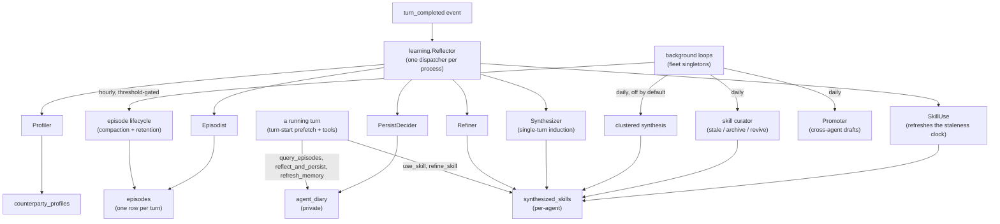
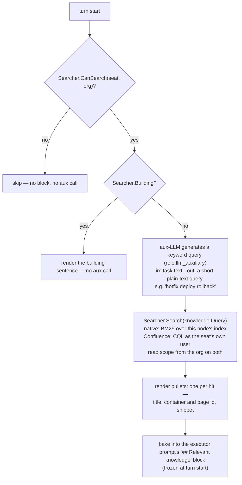

# Agent Learning

The agent-learning subsystem turns finished turns into durable, retrievable lessons — so the same agent (and its team, and the org) gets better over time without retraining the underlying model.

This page describes the shipped architecture: what runs in-engine, where each piece slots into the [Turn Engine](turn-engine.md) and [Knowledge System](knowledge-system.md), and the deliberate non-goals.

> **Provider-agnostic by design.** Learning lives in the org/data layer, not in a model checkpoint. Any `llm.Provider` can back any role. Model fine-tuning is never required and is not part of the in-engine learning loop.

---

## Why tools alone are not enough

A common misconception is that adding memory/skill tools is sufficient to make an agent "learn." It is not. For a learning loop to be *effective* — i.e. for the LLM to reliably produce good lessons and invoke the right tool at the right moment — four layers must line up:

| Layer | What it does | Where Crewlet carries it |
|---|---|---|
| **1. Model training** | Weights that know the memory/reflection protocol | **Not required.** Layers 2–4 do the work; any stock Claude/GPT works. |
| **2. Per-phase contract** | Short, per-phase system-prompt rules that remind the LLM *when* to persist, reflect, recall | The executor and review prompt builders in `internal/agent/prompts`: guidance blocks injected only when the matching tool is registered. See [Prompt scaffolding](#prompt-scaffolding). |
| **3. Tool descriptions** | One-line *when to use* text on each tool — Crewlet pushes guardrails into descriptions, not prompts | Builtins (`query_episodes`, `reflect_and_persist`, `refresh_memory`, `refine_skill`, `use_skill`, `mark_onboarded`) have precise one-line descriptions. |
| **4. Deterministic harness** | Post-turn code that runs reflection regardless of whether the LLM "remembers" to | the reflect engine — the load-bearing piece. LLM cooperation is a bonus, not a dependency. |

Crewlet puts the weight on layers **2–4**. Layer 1 is desirable but optional — effectiveness is not gated on any one vendor's checkpoint.

---

## Subsystems

Small components, each with a single responsibility, plus the orchestrator that wires them.

**Two ways in, and they are not the same shape.** Everything learned *from a turn* arrives on one event through one dispatcher; the two passes driven by a *clock* rather than a turn are their own loops, and fleet singletons.



### 1. PersistDecider (post-turn personal memory)

Replaces "hope the LLM remembers to capture a durable fact" with a deterministic post-Review decision.

- **Trigger:** after the turn settles `done`, or `failed` (a reviewer's `failed`, or one the engine set: a fired guard, a spent budget, an exhausted provider chain). `self_iterate` is a mid-state; reinforcing it would teach the agent from incomplete work.
- **Decision:** small auxiliary-model prompt answering *what, if anything, should persist?* Defaults to NOOP. The classifier picks a tier:
  - `LONG` — durable preference / fact (no TTL).
  - `SHORT` — situational, with a TTL in days (sprint focus, vacation, delegation context).
  - `DOC` — would be team-relevant; the decider does not write personal memory but logs the recommendation. Real cross-agent propagation goes through the team knowledge base, not the diary. **The log is the only copy**: no row is written and the `persist_decider_completed` event carries the tier, not the rule — so `persist_decider_doc_observed` quotes the first 120 bytes of the rule at info, marked where it was cut, and `persist_decider_doc_observed_content` carries the rule, its rationale and its target hint whole at debug. Turn debug on for a company whose standing rules you want to route into the docs.
  - `NOOP` — nothing worth persisting.
- **Writing-style rule:** persisted entries are **declarative facts, not instructions**. `"User prefers concise responses"` ✓ — `"Always respond concisely"` ✗. Instructions drift out of date and get re-discovered as contradictions; facts compose cleanly. (Adopted verbatim from Hermes's memory guidance.)
- **Effect:** writes a row to the agent's `agent_diary` via `learning.Diary.Write` — agent-scope only. A `LONG` or `SHORT` the decider does not keep — a note past the 2 000-byte limit (`persist_decider_note_oversized`), or a `LONG` refused because the seat's durable notes are full (`persist_decider_diary_full`, below) — is reported the way a `DOC` rule is, and for the same reason: nothing else holds it. The warning quotes its first 120 bytes, marked where it was cut, and the same event name with `_content` appended carries it whole at debug.

### 2. Diary and `reflect_and_persist` (in-flight personal memory)

The agent's private observation log. Two kinds:

| Kind | TTL | Use |
|---|---|---|
| `diary_long` | None | Durable preferences and facts (`Stakeholder X prefers digests`). No deadline — a durable fact does not stop being true — but **capped per seat at 500 entries**, because recall scans and cosines every one of them at every turn start. **At the cap the next durable note is refused, and nothing already kept is dropped to make room**: making room would delete a fact the seat chose to keep without the seat ever being told, and it would go on acting as if it still knew it. `reflect_and_persist` answers the seat with the refusal, naming the cap; the post-turn decider has nobody to answer, so it logs `persist_decider_diary_full` at warn with the note's first 120 bytes, puts the whole note on `persist_decider_diary_full_content` at debug, and its `persist_decider_completed` event carries `classification: LONG` with `persisted: false`. Short notes are not counted against the cap. **The refusal does not lift**: nothing in this build deletes a durable note — no tool retires one and no sweep drops one — so a seat that reaches 500 has every later durable note refused from then on. A seat can hold more than 500 only when memory replication brings together notes two nodes each wrote before either had the other's; it stays over the cap and is refused the same way. No sweep trims it back, for two reasons: the seat would never be told which facts it lost, and memory replication carries no deletes, so a dropped note would come back the next time a node hydrated the seat. Each note also counts its recalls, reported as `retrievals` by `GET /agents/{id}/memory`. A **use** is an entry the relevance filter *selected*, not one it merely considered: the candidate pool is similarity ∪ recency, so counting candidates would move every entry's counter on every turn. Both read paths — the `## Personal memory` block and `refresh_memory`'s hinted re-filter — run through that one filter, so both count. The write is detached from the turn's context, since a recall the seat already benefited from must still be recorded when the turn is finishing. |
| `diary_short` | Set | Situational state (`Sprint freeze runs through 2026-05-10`, `Opened PR-123 from sandbox run, awaiting review`). The deadline is days from the write: the post-turn decider's `SHORT` tier proposes one, and `reflect_and_persist` takes it as `ttl_days`, which on its own makes the note `diary_short` — 1 to 180, and 30 for a `kind: diary_short` note that names none (`learning.ShortTTLDefaultDays`, `learning.ShortTTLMaxDays`). The decider clamps a proposal past 180, having nobody to ask; the tool refuses it, naming the limit, and refuses `ttl_days` on a note declared `diary_long` and any `kind` other than the two, rather than keeping a note for a time or a tier nobody asked for. Excluded by the read's own SQL predicate once the TTL passes — so an expired row never consumes a slot in the recency window — and physically deleted by the [retention sweep](../guides/fleet.md), which runs this table on every node rather than under the fleet's singleton duty: a seat's diary rows are written into whichever node ran its turn and carried between nodes by memory sync, so every node holds rows only its own sweep can reach. |

Two writers converge: the post-turn `PersistDecider` (above) and the in-flight `reflect_and_persist` LLM-facing builtin. Both go through `learning.Diary.Write`, which stores the note verbatim. The `## Personal memory` prefetch and `refresh_memory` read the diary via **hybrid candidate selection**: `learning.Diary.Recall` (vector top-K matches to the trigger) unioned with `learning.Diary.Recent` (recency top-K), deduped by row id — the two halves are 50 each, so the union is the bound and there is no separate cap over it — then passed to an aux-LLM relevance filter that picks the final digest. The two halves serve different needs: vector search catches **topical / semantic matches** to the current trigger; recency catches **broadly-applicable operational rules** that may not be a topical match (e.g. "use semantic commit messages on every PR"). The aux filter judges from the merged pool.

**Where the vector comes from.** `learning.Diary.Write` embeds the note as it stores it. Neither writer supplies a vector — the store makes one, from the note's own content, so a note's recallability cannot depend on which of the two wrote it. One vector per note and never a window set: a note is capped at 2 000 bytes, which is inside the 4 KiB window an episode summary has to be split into. A vector the caller brought is kept as-is rather than re-embedded.

A row with **no** vector is a supported state, reached two ways: a company that configures no `providers.embeddings` has no embedder to give the diary, and an embedder that fails on the write logs `diary_embedding_failed` and stores the note anyway. Either way `learning.Diary.Recall` skips that row whatever the query, and the pool the `## Personal memory` block is filtered from falls back to its recency half. The note is never lost for it: the note cannot be reconstructed once the turn is over, and the vector can, by nothing more than a re-embed.

**Write-boundary hygiene.** Content is stored verbatim — never length-truncated, so the agent reads back exactly what was written. Nothing at the write collapses a paraphrase of a note the seat already has: the post-turn classifier is shown the seat's 50 most recent notes and asked not to repeat one, and that prompt is the only dedup there is — `reflect_and_persist` has none, and a write whose row id is already taken is dropped rather than merged. A note past `learning.MaxContentBytes` (2 000 **bytes** — the guard is `len()` over the note, so a seat writing CJK gets roughly a third as many characters) is **refused, never trimmed**, by both writers: `reflect_and_persist` refuses with the limit named, so the model can tighten the text and retry, and the post-turn `PersistDecider` skips the row and logs it, because there is nobody there to ask. One store, one rule — the two used to disagree, the tool refusing while the decider stored whatever the classifier produced. Nothing on this path is sliced: a note is short by construction once `MaxContentBytes` has refused the long ones, so there is no length left for a writer to trim to. The post-turn `PersistDecider` is additionally skipped when the turn already self-persisted in-flight (the executor called `reflect_and_persist`), so the two writers don't double-write the same fact. Prompt-injection scanning at this boundary is a separate concern and deliberately not bundled in: what the write enforces is the length rule and the shape of the row, never the trustworthiness of the text.

The diary is read by:
- The `## Personal memory` prefetch block (see [Personal memory prefetch + refresh](#personal-memory-prefetch--refresh)).
- The mid-turn `refresh_memory` builtin, which re-runs the same diary query with an enriched context hint.

### 3. Profiler (entity modeling)

Crewlet's multi-party equivalent of Hermes's "model of who you are."

- **Input:** observed interactions per counterparty (colleague, stakeholder, external human) from Slack/Jira/A2A events. A [coalesced trigger](event-system.md#inbox-batching--coalescing) runs one observation pass per **distinct sender** (`Profiler.subjectsOf` groups a sender's messages in order first), so a thread where one human sent four messages is one counterparty and a multi-human thread is genuinely several. A seat never profiles itself. **At most eight parties are profiled per turn**, in the order they first spoke, because each is its own auxiliary call and the seat's next turn waits behind them. The rest are neither profiled nor counted as an interaction for that turn — recording an interaction nobody looked at would read as a counterparty whose traits have settled — and `counterparty_subjects_not_profiled` says how many were left out, under the turn's id. What they said is on that turn's `turn_completed` event in the event log.
- **Output:** one `learning.Profile` row per `(observer_handle, subject_handle | subject_external_id, subject_platform)`: preferred communication style, past decisions, sensitivities, topics of interest. Stored in the `counterparty_profiles` table (not the diary; not Confluence).
- **Scope:** per-observer always — a fact one agent learns about Bob is private to that agent. Cross-agent propagation goes through humans + the team knowledge base, not auto-merging.
- **Retrieval:** the turn-start prefetch injects the trigger counterparties' profiles into the executor's prompt when the trigger has identifiable senders (one block per distinct sender with a stored profile). `lookup_colleague` resolves who a colleague is and does not return a profile.

### 4. Episodes and `query_episodes` (search own past)

Agents can search their own prior turns.

- **Source:** the `episodes` table in the node's own store, replicated onto the memory changelog so it follows the seat across nodes — one row per completed turn (`agent_handle`, `task_summary`, `plan_summary`, `tool_sequence`, `skills_used`, `review_outcome`, `started_at`, `ended_at`, `duration_ms`, `embedding`, `embedding_windows`).
- **Builtin:** `query_episodes(query?, conversation?, outcome_filter?, limit?, offset?)`: vector similarity over the task summary when `query` is given, recency otherwise; scoped to the calling agent's handle, available to the executor. `conversation` and `outcome_filter` narrow **either** mode, and they narrow it in the store's own statement — before the limit — so "my failures like this" is the nearest failures, not the failures among the nearest few turns. `outcome_filter` is `done` or `failed`, the only outcomes an episode is written with; any other value is refused naming the two, because answering it would read as "none of your turns ended that way". A page that is not every matching turn says so — the store reads one row past it as evidence — and names the `offset` that reads on. A compacted row prints as the pattern it folded (how many turns, `common_task_pattern`, `common_outcome`) rather than as a turn with an empty summary.
- **A long summary is embedded whole, in windows.** A task summary is not bounded — a coalesced trigger merges up to 100 constituents, and a vendor's subject line is whatever the vendor sent — so the summary is split into 4 KiB windows overlapping by 512 bytes, every window is embedded, and the vectors are packed into the row's one `embedding` blob with `embedding_windows` saying how many. **An episode scores as its nearest window**, never as a mean: a turn is worth recalling because part of what it did matches, and averaging would rank a one-line summary that is entirely on topic above a long one with a perfect paragraph. The short summaries that are almost all of them stay exactly one window, byte for byte what they always were. Before this, the summary was cut at its first 8 000 bytes with no marker and nothing on the row to say so, and everything past the cut reached no vector — so it reached no `query_episodes` result and no `## Similar prior work` block. What that cost was *searchability*, never text: `task_summary` has always held the whole summary, and every mode of `query_episodes` returns it in full.
- **A failed window costs its window.** The embedding provider fails per call, and those failures are transient, so the windows already made are kept, the count of them is written to the row, and `episode_embedding_partial` names how many of how many landed. The whole episode's embedding is bounded by one 15-second budget (`learning.DefaultEmbedTimeout`) rather than by a cap on the text: what a spent budget costs is the searchability of a pathological summary's tail, never the episode.
- **Auxiliary summarization:** raw episode hits are passed through the role's `llm_auxiliary` model (a cheap one) before reaching the executor, keeping its context window small (`learning.summarize_episodes`). Falls back to raw bullets when it is off, when no aux model answers, and when the answer stopped at its output cap — a briefing cut mid-sentence *replaces* the bullets it summarises, so a cut one is treated as no answer (`prefetch_auxiliary_answer_truncated` at warn). The same rule holds for the other two auxiliary passes: a memory-filter answer or a knowledge search query cut at its cap is not used.
- **Frozen-at-turn-start:** the `## Similar prior work` prefetch resolves once per turn and bakes the summary into the system prompt. A `self_iterate` round (review, then the executor again) reuses the same prefix so the LLM provider's prompt cache keeps working.

### 5. Synthesizer (skill induction)

Mines recurring successful trajectories and drafts a new procedural skill.

- **Single-turn induction** runs inline in the reflect engine: a **settled** turn (`done` or `failed`) that used ≥`min_tool_calls` tools is offered to the auxiliary model, which drafts a skill or declines. Declining is the ordinary answer — most turns are not procedures — so a turn with no reusable shape costs one cheap call and writes nothing.
- **Three gates, all before the model call**, because a draft made only to be discarded is money spent for nothing: the per-seat cap (`max_skills_per_agent`), and a duplicate check comparing the turn's tool set against the seat's existing skills by Jaccard similarity (`duplicate_jaccard_threshold`). The comparison is over the tool **set**, not the ordered run — two turns calling the same four tools in a different order are the same procedure, and treating order as identity is how a seat ends up with a skill per permutation. A draft the model returns without a name, summary or body is dropped rather than written with the gap.
- **Clustered synthesis** (`scheduler_enabled`, `cluster_*`) is the other half, and it catches what single-turn induction cannot: the shape a seat arrives at over a fortnight — three tools, unremarkable on any one turn, run the same way eleven times. Repetition is evidence a single turn cannot offer, and it is invisible from inside any one of them. A daily [singleton](seat-ownership.md#singleton-duties) pass reads each seat's last `episode_fetch_limit` (default 200) turns, greedy-clusters them by tool-sequence Jaccard at `cluster_jaccard_threshold` (default 0.6), and drafts from the largest cluster of size ≥`cluster_min_size` (default 3). It is **off by default** — `scheduler_enabled: false` — because the pass costs an auxiliary call per seat per day and a young company has nothing to cluster yet.
  - **One draft per seat per pass, largest cluster first.** Not every qualifying cluster: each draft is a completion, and a seat with three real patterns learns them over three days with the strongest evidence going first. A pass that drafted everything could also fill the per-seat cap in a single tick.
  - **A cluster the seat has already learned is skipped, not a stop.** The next pattern down may be one it has not — the same `duplicate_jaccard_threshold` the inline path uses, which is *stricter* than the pooling threshold on purpose: pooling asks "is this the same kind of work", rejecting a draft asks "is this the same skill".
  - **Only raw, settled turns with ≥`min_tool_calls` tools are evidence.** A compacted row is already a summary of a cluster and would count a fold as one turn; a `self_iterate` round is work the agent judged incomplete.
  - **The stored `tool_sequence` is a run that actually happened** — the cluster's representative — rather than a union of its members, because the duplicate check compares stored sequences against new turns and a union nobody performed matches everything loosely.
  - The `skill_synthesized` event carries `trigger: clustered` and the `cluster_size`, and **no `turn_id`**: the draft came from a group, and naming any single member would put a trace on the event that explains none of the others.
- **Output:** a row in `synthesized_skills` keyed by `(agent_handle, name)` — agent-scope only. The body is stored in the familiar SKILL.md Markdown shape, which `use_skill` returns verbatim.
- **Cross-agent promotion** is the third path, and its output is deliberately *not* a skill row. Every other skill here is agent-scope (one seat's row, in one seat's prompt) because a skill is a procedure a particular seat follows. A procedure four seats independently arrived at is something the **team** has, which makes it documentation. So when ≥`min_sibling_count` **distinct seats** in one unit converge on a similar tool run, a daily [singleton](seat-ownership.md#singleton-duties) pass distils the cluster into a **draft page in the team knowledge base** under the unit's `Auto-Drafted Skills` parent, for a lead to review.
  - **Distinct seats, not skills.** One seat that drafted four near-identical skills is a catalogue that needs curating, not a team convergence — counting rows rather than owners would promote it and present one agent's habit as the unit's practice.
  - **Direct members only.** A parent unit does not pool its children's catalogues: it would find the convergence the child already promoted and draft it again one level up, on a page naming a team that never converged on anything.
  - **The draft is hidden until a person publishes it.** The `## Relevant knowledge` search excludes the auto-drafted subtree (and, as a fail-closed backstop where a backend has no parent chain, the `[Auto-draft] ` title prefix), so an unvetted draft never reaches another agent. A lead adopts one by moving it out of that parent; once published it is an ordinary knowledge-base page reachable through the query-time search. Rejecting one is a delete — it is re-drafted only if the team converges again.
  - **One backend, matched.** The pass writes through a small `learning.PromotionWriter` seam: `confluence.PromotionWriter` posts rendered storage-format XHTML under the unit's `space`, creating the `Auto-Drafted Skills` parent if the space has none, and **refusing the draft** rather than filing it at the space root if that parent cannot be created, because a page outside the subtree is one every agent can read. The container is the unit's **wiki space**, never its tracker project: a unit carries both identities, and filing a draft under the tracker's key would create a page in whatever space happened to share the name, or fail against nothing at all.
  - **Cross-tick dedup is the writer's job**, because the pass re-clusters the same persisted rows every tick and would otherwise yield one draft a day forever. Confluence keys on the title, which is unique within a space. One converging cluster yields one page, and a tick that finds the existing draft stays quiet rather than re-announcing the promotion.
  - **A unit with no container is soft-skipped** with the field to set in the log; a company that configured knowledge for one team and not another is supported, and failing would stop the configured team's promotions too. A write failure announces nothing, and the next tick retries.
  - Success publishes `skill_promoted` carrying the unit, the `container_key`, the `page_id` / `page_title`, and both `sibling_count` and `distinct_agents`, because one agent repeating itself and five agents converging are different findings.
  - The engine carries no unit-scope skill rows of its own.
- **Collision guard:** the synthesizer rejects names that already exist in the agent's own `synthesized_skills` table. There's no global skill registry to guard against — synthesized skills are per-agent, and shared procedures live in the team knowledge base rather than in an engine-side registry.

### 6. Refiner and `refine_skill` (improve skills during use)

When a synthesized skill was central to a successful turn, append an *observed-in-practice* bullet; when it contributed to a failed turn, append a *counter-example*.

- **Auto path:** the reflect engine dispatches the refiner after every **settled** turn (`done` or `failed`) whose `skills_used` is non-empty. A `self_iterate` round is not refined — it is work the agent itself judged incomplete, so a lesson drawn from it is one the next round may contradict, and the turn will emit another `turn_completed` when it does settle. The auxiliary model picks one observation (or NOOP); successful turns produce `Observed in practice: …`, failures produce `Counter-example: …`.
- **One call, one bullet, at most one skill.** The turn's whole offered catalogue goes into a single prompt and the model chooses which skill — if any — learned something. Per-skill calls would cost a completion per skill per turn for answers that are almost always NOOP, and a turn rarely teaches two procedures something new at once. A name the model invents is dropped rather than matched onto the nearest candidate: a bullet appended to the wrong procedure is worse than no bullet.
- **NOOP is the expected answer**, and it is not an error. A model asked what a turn taught will produce something for any turn at all, and a skill that grows a bullet per turn stops being a procedure and becomes a diary of the turns that read it. The prompt says twice that answering nothing is correct.
- **Only skills that still exist.** The turn's `skills_used` is a list of ids captured when its prompt was built; the refiner intersects it with the live catalogue, so a skill the [curator](#skill-curator) archived in the meantime is not resurrected. A turn whose skills have all been archived costs no model call at all.
- **Bullets collect under one `## What practice added` heading** at the end of the body, rather than scattering a new section through the steps on every refinement — a reader sees the procedure first and what practice added to it second.
- **Manual path:** the LLM-facing `refine_skill` builtin lets the executor correct its own skills mid-turn. It takes `skill_name`, the **full** corrected `content` and an optional `reason`; the new text replaces the body in its entirety. A whole-body replacement rather than a patch, because a model asked for a diff produces something diff-shaped that does not apply, and a half-applied edit leaves a procedure that is neither the old one nor the new — with nothing to compare against, since the prior body is already archived by then. Patch-on-encounter: a seat that finds a skill outdated corrects it immediately rather than waiting for a separate consolidation pass. A seat may only refine its **own** skills.
- **Versioning:** every refinement archives the prior state to `synthesized_skill_versions` and bumps the live row's `version`. History is bounded by `max_versions_kept` (default 10) per skill. **No surface reads the archive back yet**: `learning.Skills.Versions` lists it and `learning.Skills.Rollback` restores one as a forward step (the archived body becomes the body of a new version, so a rollback can itself be rolled back), but no API route, tool or screen calls either. The rows ride the seat's memory changelog like the rest of its memory.
- **Body cap:** `max_body_bytes` (default 20 000 — **bytes**, despite the field's name: the check is `len()` over the assembled body, so a procedure written in CJK reaches the ceiling at roughly a third of the characters) — a refinement that would breach the cap is **refused, never truncated**, so a runaway loop can't blow up a skill body. A clip lands mid-step and the model reads the remainder as the whole procedure. The auto path skips silently and logs it; the manual tool refuses with the field name, because there a model can tighten the text and retry.
- **`enabled` gates both halves.** `learning.skill_refinement.enabled: false` withdraws the `refine_skill` tool *and* leaves the post-turn refiner unwired — they write the same rows through the same version archive, so a company that turned refinement off and still had the tool would watch its skills change under a knob it had set to false. `use_skill` is unaffected: reading a skill is not changing one. Setting **both** `auto_refine_on_success` and `auto_refine_on_failure` to false is refinement-off spelled the long way, and the engine leaves the worker unbuilt rather than skipping every turn.

### 7. Reflector (the orchestrator)

The deterministic harness. Owns when reflection runs and coordinates the workers above.

- **Hooks:** subscribes to `turn_completed` on the EventQueue, under its **own consumer group**. Its own, shared with nothing: reflection is the one subsystem an operator turns off on its own, and a group shared with another consumer would take that consumer's traffic down with it.
- **One consumer, not one per writer.** Everything a seat learns is learned from one event, and every writer is gated on the same questions about it. Three subscriptions would mean three redelivery windows over one turn, three places to discover a company that learns nothing, and three chances for one of them to be quietly unwired.
- **One dispatcher per process, not per config revision.** A [config apply](configuration.md) swaps the org and the worker set behind it; the subscription and the redelivery guard stay put. Rebuilding it per revision would empty that guard, so a redelivery landing either side of an apply would be classified twice: two auxiliary calls, two differently-worded rows for one fact. A refused worker set leaves the previous one serving: reflecting against a stale org is a far smaller wrong than not reflecting at all. A node that boots with no company has no org to attach the dispatcher to, so its first apply attaches it, and an attach that fails refuses that apply rather than serving a company that learns nothing.
- **Gates, in order.** Each is reported by name, per worker, per turn, because "this company never learns anything" needs an answer that says *which* gate closed:
  1. **No workers** — nothing is wired, so there is no question to ask about this turn.
  2. **No role** — the turn came from a seat this revision no longer has. Learning about a renamed or removed role writes memory under an identity nothing can read back.
  3. **Per-role opt-out** — `learning_enabled: false` opts a noisy or sensitive role out without disabling the subsystem globally. Unset inherits the company-wide setting.
  4. **No budget** — the company or the seat is already at its `token_budget` ceiling, so the pass declines to *start*. Reflection is best effort and this is the skip that costs nothing: a pass that runs and then discovers it is over budget has already made its auxiliary calls. The gate reads the counters against their caps without moving them, and every auxiliary call a learning worker makes is read the same way before it is sent, so a pass that reaches the ceiling partway sends no further call. It sits **before** the duplicate ring on purpose — an exhausted budget is the one *transient* refusal in this list, so a turn skipped for it stays reflectable when the ceiling moves, while every other gate would still hold on a redelivery. An **unreachable** counter reflects anyway: unknown is not "no", and a coordination blip must not silently stop a company learning.
  5. **Duplicate** — a bounded ring of recently-processed RUN ids (not work keys: a redelivered trigger genuinely runs again, and its reflection is a second pass over a second execution — what collapses THAT is the episode row's own work-key index, not this ring). Reflection is *not* idempotent: each pass is a fresh auxiliary call that can write a second, differently-worded row for the same fact. The ring is per-process and deliberately not durable — a second node reflecting the same turn writes a second diary row, which is the [bounded duplication](#what-does-not-happen) the engine promises rather than exactly-once. It **evicts** rather than growing: past the bound, a redelivery is far outside any backend's redelivery window.
  6. **No engagement** — the turn opted out (`plan_decision: skip`), or finished `done` having called no tool at all. Either way the agent processed nothing externally observable, and a fact read off the trigger would teach it a directive it never received.
  7. **Per-worker skip** — each worker states its own applicability, because they genuinely differ: the persist decider must not run on an unsettled turn, the counterparty profiler must.
- **Failure mode:** every dispatch is best-effort and each worker runs under its own panic recovery, so one worker's bug costs neither the pass's remaining workers nor its sentinel. A failed worker logs and the next one still runs; a failed reflect never fails the parent turn. The handler **always acks**: reflection is work about a turn that is already over, so a nak would redeliver it to spend another round of auxiliary tokens reaching the same conclusion.

#### What the turn event has to carry

The dispatcher is a queue consumer, so it usually runs on a node that never saw the trigger. Everything the gates read therefore rides on the `turn_completed` payload itself — the tool sequences, the outcome and the opt-out decision, the skills the prompt offered, and the inbound interactions with their senders resolved. A field left off that payload is a fact no worker can consult, and the gates fail **open-looking**: an absent tool sequence reads as "the agent engaged with nothing", which silently skips every worker on exactly the successful turns worth learning from, while the dispatcher reports a clean pass.

---

## Prompt scaffolding

Short, conditional guidance fragments are appended to the executor's system prompt, injected **only when the matching tool is registered for the role**. This scaffolding is sourced from the [Tool Skills](tool-skills.md) registry — knowledge-base pages (the engine's own, or Confluence's) operators can edit at runtime — rather than being hardcoded in engine prose. The bundled `examples/tool-skills/` files ship ready-made versions:

| Bundled skill | Trigger | What it teaches |
|---|---|---|
| `examples/tool-skills/reflect-and-persist.md` | `tool: reflect_and_persist` | Persist *declarative facts, not instructions to yourself*. |
| `examples/tool-skills/refine-skill.md` | `tool: refine_skill` | Patch a loaded skill when it goes stale; don't wait to be asked. |
| `examples/tool-skills/retrieval-research.md` | `any_of` of `query_episodes` / the `atlassian` MCP server / `refresh_memory` | The consolidated retrieval re-search rule — see below. |
| `examples/tool-skills/observed-directives.md` | `tool: mattermost_post_message` | Share team-relevant directives via the agent's broadcast surface. |
| `examples/tool-skills/getting-unstuck.md` | `any_of` of colleague-surface tools (`mattermost_post_message`, the `atlassian` MCP server, `a2a_ask`) | Manager-handoff conventions: when stuck, mention manager on the surface where the problem lives. |
| `examples/tool-skills/channel-discovery.md` | `any_of` of the Mattermost channel, post and user-search tools | How to choose the right Mattermost channel or surface, and how to fall back when membership is missing. |

The `retrieval-research` skill carries the **consolidated retrieval re-search block**. The three relevance prefetches — `## Similar prior work`, `## Relevant knowledge`, `## Personal memory` — are all derived from the *triggering message as it stood at turn start, before any recon*, so they share one rule: after recon has given the seat a richer query, re-query the corresponding tool — *even when the initial block already had entries*. Rather than repeat that rule in three near-identical blocks, the shared preamble states it once and one terse per-tool line (`query_episodes` / the knowledge backend's page-search tools / `refresh_memory`) is appended for each re-query tool the role actually has. On a thin trigger the turn-start message genuinely is a bare pointer (the [thin-trigger gate](#thin-trigger-gate) skips the prefetch entirely); on a substantive trigger it is the whole message but still pre-recon. Either way the guidance makes the assumption legible to the LLM so the re-query pattern does not rest on the model guessing.

Plus four always-on prefetch blocks (rendered when the data exists):

- **`## Similar prior work`** — top 3 episode-search hits, summarised by the aux model.
- **`## Personal memory`** — diary entries selected via [hybrid vector ∪ recency candidate selection](#hybrid-candidate-selection), then filtered for relevance to the current task / trigger by the aux model.
- **`## Synthesized skills you've learned`** — names + descriptions of the agent's own synthesized skills, loadable via `use_skill`.
- **`## Relevant knowledge`** — knowledge-base pages from a live query-time search: the aux LLM generates a short search query from the trigger, and the [`knowledge.Searcher`](knowledge-system.md#the-knowledgesearcher-seam) runs it scoped to the role's accessible containers. See [Relevant-knowledge prefetch](#relevant-knowledge-prefetch) below.

Plus the conditional prefetch:

- **`## First-turn onboarding`** — rendered until the agent calls `mark_onboarded`. Lists the relevant `Onboarding` knowledge-base pages on the agent's unit chain. Stored markers live in `agent_onboarding_markers`, keyed by `agent_id` and stamped with a `chain_hash`; an org-chain change invalidates the marker so the hint re-fires for the new structure.

These blocks are **layer 2** from the four-layer table above. The reflect engine (layer 4) runs regardless of whether the LLM follows them — the scaffolding is an optimization that lets well-behaved models cooperate, not a dependency.

---

## Personal memory prefetch + refresh

The `## Personal memory` block runs once at turn start (`prefetch.Fetcher.personalMemory`): it assembles a candidate pool of the agent's diary rows, filters them by relevance to the trigger via the aux model, and renders a digest into the system prompt, which is not re-queried mid-turn.

### Hybrid candidate selection

`Fetcher.memoryCandidates` builds the candidate pool that feeds the aux filter. Given a trigger query, it returns the **union** of two top-K reads against the agent's diary:

- **Vector top-K** — `learning.Diary.Recall` ranks by cosine distance against the diary's embedding column, scoped to the agent's id and to unexpired rows. The distance is computed **by the database** (`vector_distance_cos`), so only the rows above the relevance floor cross the driver boundary rather than every embedded row the seat owns. This catches *topical / semantic matches* to the trigger.
- **Recency top-K** — `learning.Diary.Recent` reads the most-recent unexpired rows, again scoped to the agent's id. This catches *broadly-applicable operational rules* that may not be a topical match to this particular trigger — "use semantic commit messages on every PR," "always tag the security channel before merging auth changes" — which the vector half would miss when the trigger is unrelated to the rule's topic but the rule still applies.

The two sets are deduped by row id. Their sizes (50 each, `memoryVectorLimit` and `memoryRecencyLimit`) are what bounds the pool; a further cap over the union used to sit here and was unreachable arithmetic, since a dedup of two 50-row halves cannot exceed 100. The aux-LLM relevance filter then judges from this merged pool: the same filter as before, over a better-recall candidate pool. The hybrid is **not pure vector** (which would miss the broadly-applicable rules) and **not pure recency** (which falls off for long-lived agents with >100 LONG entries, where old-but-relevant rows would drop off the window and never reach the filter).

`PersistDecider`'s write-side dedup reads the diary's recency list alone (`Diary.Recent`, up to 50 rows), which is the correct shape for the "is this paraphrase already in the diary?" check.

### Failure modes

The prefetch filters against the **salient inbound message** — the raw message, not the notification builder's enriched task description (see [Salient-body sourcing](#salient-body-sourcing)). That leaves two failure modes:

1. **Context-thin triggers** ("yes", "+1", a thread reply with little semantic content) — the salient message itself is thin, so the filter has nothing to match on and the block ends up empty. When that happens *and* the agent has memory rows, the block renders the gate-path hint line nudging the seat to refresh after recon.
2. **Richer triggers** can produce a non-empty block, but the entries the trigger-time filter chose may not be the most relevant once the executor has read the thread / fetched the ticket / queried knowledge and learned what the conversation is *actually* about.

The `refresh_memory(context_hint=…)` builtin fixes both. The `refresh_memory` line of the bundled `retrieval-research` [Tool Skill](tool-skills.md) (`examples/tool-skills/retrieval-research.md`) tells the executor to call refresh after any tool call that materially changed its understanding of the conversation — *even when the initial block already had entries*, not only as an escape hatch from the empty case. The tool re-runs the filter with the executor's `context_hint` as the task it judges relevance against, and returns the freshly-rendered digest as the tool result.

**The filter's whole answer is kept.** The filter is told to pick at most eight memories. A filter that names more anyway has judged every one of them relevant, so none is dropped: the `## Personal memory` block shows every memory it picked, in its own order. What bounds the block is the candidate pool the filter picks from — at most 100, the two halves above — since an index outside it is discarded. `refresh_memory` gets the filter's whole answer and prints `limit` of it (default 5, at most 25); a page that is not the whole answer says how many are left and the `offset` that reads them, and a repeat of the hint with that offset is answered from the idempotency cache below, so it pages the same answer rather than a fresh one. Without a `context_hint`, `refresh_memory` pages your notes newest first the same way: a page that stops short of your oldest note says older ones exist and names the `offset` that reads on. Those positions are counted afresh on each call, so a note kept or expired between two calls moves the next page by one. Bounded by:

- **Per-turn cap** — `learning.personal_memory.max_refreshes_per_turn` (default 3). A hint beyond the cap is refused with the count spent, so the model learns the shape of the limit and stops trying instead of silently no-op'ing. A hint whose filter call *failed* still spends its slot — otherwise a failing call is retryable without bound, which is the same unbounded spend the cap exists to stop — but retrying that same hint is allowed and does re-run the filter.
- **Idempotency cache** — a repeat of a hint already used this turn (case- and whitespace-normalised) is answered from the ledger without a fresh auxiliary call, including when the answer was "nothing bears on this". A repeat is free *because it is answered from here*, not merely uncharged: re-running the filter for free would leave the cap bounding nothing, since a model alternating two hints could spend a completion per round forever. What is cached is the **filtered rows**, not the rendered text, so a repeat asking for a larger `limit`, or for an `offset` past the first page, gets the extra notes rather than the first call's rendering.
- **Per-turn isolation** — state keyed by the RUN id (`turn_id`, which names one execution — see [a turn's two identities](turn-engine.md#a-turns-two-identities)) and bounded to the most recent 256 turns, far more than a node runs at once. Per run rather than per unit of work, deliberately: a redelivered trigger runs again with a fresh context and must not inherit the spend or the answers of the attempt it is repeating; the bound is what makes it a cache rather than a leak, since nothing tells the tool when a turn ended. State from one turn never leaks into another.
- **Frozen-prefix-cache safe** — refresh output lands as a tool-result message, not a system-prompt rewrite. The LLM provider's prompt cache stays valid across iterations.

---

## Relevant-knowledge prefetch

The `## Relevant knowledge` block surfaces team-published documents — playbooks, runbooks, ADRs, conventions, design docs, anything in the agent's accessible knowledge-base containers — without forcing the seat to discover them by guessing names against `use_skill` or by remembering to call the knowledge-search tool first. It runs one knowledge-base search per turn through the [`knowledge.Searcher` seam](knowledge-system.md#the-knowledgesearcher-seam) — BM25 over this node's own index on the native backend, a live CQL query on Confluence, and exactly one backend per company; the [Personal memory prefetch](#personal-memory-prefetch--refresh) is the closest sibling in spirit, though that one reads the private diary via hybrid vector ∪ recency candidate selection filtered by an aux-LLM relevance pass.

### Why "knowledge" and not "skills"

An alternative design would carve out a special "team-skill" label so operators could mark certain pages as procedures meant for agents. That reintroduces an operator-curated/synthesized skill split — two parallel skill surfaces to maintain — which the project deliberately avoids.

The shipped design takes the opposite stance: **a knowledge-base page is a knowledge-base page**. The search runs against the agent's accessible containers and the backend's own relevance ranking decides which pages come back; there is no engine-side "skill" label or parallel surface to maintain.

### Source: query-time knowledge-base search

For each turn:

1. The searcher gate runs: `Searcher.CanSearch(seat, org)`, a cheap, no-I/O check that a search could return anything. Natively it always can — every seat reads every page. On Confluence it can when `knowledge.scope` names containers, or when the seat holds its own Confluence credential for an unscoped search. When it says no, the block is left out and the aux-LLM query-generation call is skipped entirely.
2. A node whose native index has not finished its first build (`Searcher.Building`, also no I/O) renders the [building sentence](knowledge-system.md#native-backend--the-engines-own-pages) instead of searching, and skips the aux call too: a search there can miss any page, and the block could not vouch for what it found. Confluence keeps no index and is never building.
3. The role's auxiliary model (`role.llm_auxiliary`) turns the task description into a short plain-text keyword query (the user prompt ends `Knowledge-base search query:`). Scope is **not** the aux model's job — the searcher derives it internally from the org-wide `knowledge.*` list via [accessible containers](knowledge-system.md#accessible-containers). There is no per-unit/role union: a unit's `space` is integration identity (webhook routing + write home), not read scope.
4. The searcher runs the query. **Natively**, it is ranked by BM25 over this node's own index, narrowed to `knowledge.scope` when one is set, and every seat reads every page. **On Confluence**, it runs as the agent's own Confluence user (the seat's own credential from its `mcp_env`, falling back to the org-level token) as a CQL `text ~ "..."` clause, narrowed by `space IN (...)` when a scope is set, and Confluence enforces page permissions natively, so restricted pages the agent cannot see never appear. On both, the tool-skills container is left out and unreviewed [auto-drafts](#5-synthesizer-skill-induction) are excluded by the query's default ancestor exclusion (`knowledge.AutoDraftedParent`, "Auto-Drafted Skills").

### Flow



### Loading full bodies

Each bullet renders a hit's title, its container and page id, and a snippet — enough for the executor to decide which pages to open. To read one in full it opens it by that page id with its knowledge base's page-read tool: `get_page` on the native backend (which also takes `CONTAINER/Title`), the Confluence MCP server's `confluence_get_page` on Confluence. A fresh search is `search_knowledge` on either backend, or `confluence_search` on Confluence for a query the seat writes in CQL itself. The block's closing line names the capability — open a page by its id — rather than a tool, because the tool differs by backend.

### Hardening

- **Never an error for the turn.** With no searcher wired, a gate that says no, or a query-generation call that fails, the block is left out; a search that fails (an unreachable backend) returns no hits and renders the gate-path hint below. `Search` is best-effort by the seam's contract.
- **A building index says so.** A native node whose index is still on its first build renders the building sentence instead of searching, rather than an empty result a seat would read as "nothing has been written down".
- **The gate-path hint** rendered when the block would otherwise go silently empty — either the thin-trigger gate skipped the search, or the search ran and returned nothing. Mirrors `personal_memory`'s hint; points the agent at `search_knowledge` as the mid-turn escape hatch.
- **Frozen at turn start.** The block is part of the system-prompt prefix, so a `self_iterate` round reuses the same prefix and the LLM provider's prompt cache stays valid.
- **Once per turn.** The query is generated and the search runs once; anything more the agent needs it asks for.

### The executor asks instead (thin triggers)

On a [thin-trigger](#thin-trigger-gate) turn the turn-start `## Relevant knowledge` prefetch is gated off — generating a search query from a bare pointer is noise. That leaves a gap: the agent does its recon *inside* the turn, and until it has, it has no relevant-knowledge block at all.

The **`search_knowledge` builtin** closes it. The gated block renders a hint saying to search again once the task's real shape is known, and the executor calls the tool with a query it writes itself — over the same `knowledge.Searcher` seam, with the same auto-draft exclusion, authenticating as the same seat. The result comes back as an ordinary tool result, spliced into the conversation the agent is already in.

The three-phase engine had a *push* here instead: a second search the engine ran between the phases, keyed on the plan summary, because the actor could not ask for itself — it was a different conversation. With one loop there is nothing between the phases to hang a push on, and there no longer needs to be: the frame that just did the recon is the frame that searches.

Being a tool rather than a seam, it is also cheap to be honest about. A seat the backend cannot serve — no backend wired, or on Confluence no read scope and no credential of its own — is told so in a sentence rather than handed an empty block to interpret; a node whose index is still building says that, and adds it to an answer that did find pages; and a search that came back empty, a failed one included, answers that nothing matched and to try other keywords.

### Telemetry

The turn-start `prefetch_summary` event's `relevant_knowledge_hit`, `relevant_knowledge_bytes` and `relevant_knowledge_selection_count` are recorded alongside the other prefetch blocks. The selection count distinguishes the two paths where the hit is true: a non-zero count means real pages were rendered; zero with a true hit means a hint was rendered in place of pages: the thin-trigger gate skipped the search, the search ran and returned nothing, or this node's index was still on its first build. Operators investigating low effectiveness pivot on this field to tell "no signal" from "hint nudge only."

A block stuck at 0% hit rate over a representative window is almost always one of:

- No `knowledge.scope` configured **and** the agent has no per-agent backend credentials, so it can't search unscoped (a credential-less / fallback-token agent with no containers searches nothing, and `CanSearch` gates the whole prefetch off).
- Nothing answers searches for this company on this node: `knowledge.backend: none`, a Confluence company whose org token did not resolve, or a native company on a node that booted on another knowledge backend (its native searcher starts with the node — see [Knowledge System](knowledge-system.md#the-knowledgesearcher-seam)). On Confluence, also check the seat's own **page permissions**: the search runs as that account, so a space it cannot read silently contributes nothing (see [Confluence § Knowledge search](../integrations/confluence.md)).
- Aux LLM unavailable (`llm_auxiliary` not configured and the role's primary `llm` doesn't resolve as an aux provider), so query generation cannot run.

---

## Thin-trigger gate

All three relevance-driven turn-start prefetches — `## Personal memory`, `## Relevant knowledge`, and `## Similar prior work` (episode recall) — run an aux-LLM call against the **bare trigger** at turn start, *before* the agent has done any recon. For a self-contained trigger (a full task assignment, a detailed issue body) that's high-value: the agent gets relevant memory / docs / episodes baked into the system prompt for free.

But for an **event-driven turn the trigger is a pointer, not the context**. A Jira webhook says "POC-518 got a comment"; a Slack thread reply says "+1". The real context only exists *after* the agent fetches the issue / reads the thread. Running the aux filter against the bare pointer is near-guaranteed low-value — it has nothing substantive to match against — and we'd also spend prompt space rendering "nothing matched, go look later". So on the common webhook turn we'd pay twice (a wasted aux call + prompt clutter) for a result the agent has to redo via tools anyway.

The gate skips the aux call when the trigger is a pointer. It is **pure logic — no LLM call**: the decision is read from notification metadata (`issue_key` / `thread_ts` / `event_type`), which is exactly why it's cheap enough to gate on.

| Stage | Carries the signal |
|---|---|
| **Notification builder** | `notify.Prompt.RequiresRecon`: true when the builder emitted a "go fetch the real thing" directive. Jira and Confluence page events (`## Get Full Context`), GitHub `review_requested` ("read the diff"), Slack thread replies (read-the-thread). The generic builder returns false, because its body *is* the message. |
| **the notification service** | Carries the builder's answer onto the notification it publishes, so nothing downstream has to re-derive it. |
| **The inbound interaction** | The flag is read off the trigger event into the interaction: the one normalized, platform-agnostic property workers *may* branch on (it is not an event-type check). A coalesced trigger yields one interaction per constituent message, all carrying the event-level merged flag, and the whole-trigger predicate is true when any of them is. A2A and internal `task_assigned` triggers carry their own context, so always false. |
| **Prefetch** | All three relevance prefetches read it: personal memory, relevant knowledge and episode recall. When set: skip the aux call (for personal memory the relevance filter, for relevant knowledge the query generation and live knowledge-base search, for episode recall the vector query). All three then render a **gate-path hint** so the block stays visible and self-explanatory rather than vanishing — `EmptyMemoryHint`, `EmptyKnowledgeHint` and `EmptyRecallHint` respectively — and the matching per-tool line in the [retrieval re-search guidance](#prompt-scaffolding) carries the same nudge. |

The signal lives at the notification builder because the builder *decides* whether to emit a recon directive — classifying from `event.type` downstream would duplicate that decision and let the two drift. A raw token-count heuristic doesn't work here: a webhook `task_description` is *long* (title + event metadata + multi-step "How to Handle This" boilerplate) but *thin on substance* — length would wrongly classify it as rich.

Personal memory still does its cheap diary recency list on a thin trigger (a DB read, no LLM) so it can render the hint only when the agent actually has memory rows to refresh — the vector half of the hybrid would key on a bare pointer that has nothing substantive to match, so it's skipped alongside the aux filter. Relevant knowledge skips the query generation and live knowledge-base search entirely — it only needs `CanSearch` to confirm a search could return anything (so the search-tool nudge is actionable) before rendering the hint. Episode recall skips the vector query outright and renders its hint unconditionally: unlike a diary list or an accessible-spaces check, the only way to know whether an agent *has* matching past episodes is the vector query the gate exists to skip — so the hint is phrased conditionally ("if this task resembles something you have done before…") to read correctly even for an agent with no episodes.

**Observability.** The summary's `trigger_requires_recon` records the gate decision once per turn. Without it, a gated prefetch and a filter that ran-and-found-nothing look identical in telemetry (both report a false `*_hit` and a zero selection count); with it, an operator seeing an empty `## Relevant knowledge` block can tell the prefetch was *gated* (the trigger was a pointer) rather than *broken*. The event's summary line surfaces it in the trace view: the count of blocks that hit out of six (`prefetch: N/6 hits`), marked as a thin trigger with its filters gated when the gate fired.

This makes the prefetch honest about its role: it's an **optimization for rich triggers**, and for event-driven turns the tool-call path is the *primary* retrieval path — re-query-after-recon is the expected pattern, not a fallback. The agent pulls mid-turn via `refresh_memory` / `search_knowledge` / `query_episodes`, guided by the [retrieval re-search guidance](#prompt-scaffolding) — one loop, so the frame that discovers it needs something is the frame that asks for it.

**One block is not gated, deliberately.** A pointer-shaped trigger is very often a *follow-up on a conversation this seat already worked* — the second comment on POC-518, the reply in a thread it answered yesterday. [Conversation sessions](conversation-sessions.md) render what the seat itself already said there, and that lookup is a keyed read rather than a similarity match: no embedding, no aux LLM, nothing for the gate to save. So on exactly the turns where all three prefetches above go quiet, the seat still arrives knowing what it last said and did in this conversation — which is what stops it answering the same question twice while it goes off to re-read the thread.

---

## Salient-body sourcing

The relevance prefetches, the counterparty profiler, the PersistDecider, and `refresh_memory` all reason about *what the sender said*. None of them want the notification builder's scaffolding.

A source's `notify.Prompt` builds the **enriched body**: for a Slack message, about 1.5k characters of `## Triage` instructions front-loaded *before* the actual message. That enriched body becomes the turn's task text (the executor needs the triage contract). But a relevance filter keyed on a leading slice of it never reaches the message: it filters against boilerplate that is byte-identical on every Slack turn.

So the raw message rides separately. The notification's `SalientBody` carries the inbound body verbatim — the message, no scaffolding — alongside the enriched `body`. `InboundInteraction.body` is sourced from it (falling back to the enriched `body` for events that carry no `salient_body`); a [coalesced trigger](event-system.md#inbox-batching--coalescing) sources one interaction body per constituent message, and the merged notification's own `salient_body` is the same messages joined chronologically with sender attribution (`Alice: …`).

Which surfaces actually read the salient half, today:

| Surface | Reads |
|---|---|
| Counterparty profiler / PersistDecider | `InboundInteraction.body` — the salient text, one entry per constituent |
| `## Personal memory` prefetch | the turn's task text → aux filter prompt |
| `## Relevant knowledge` prefetch | the turn's task text → aux-LLM query generation + knowledge-base search |
| `## Similar prior work` (episode recall) | the turn's task text → vector query |
| `refresh_memory` | its `context_hint` alone, as the filter's task text |

**Known gap — the three turn-start relevance surfaces read the ENRICHED task,
not the salient text.** `prefetch.Request.Task` is the trigger as the turn describes
it, which for a chat surface carries the third-party app's triage scaffolding in front
of the message, and for a coalesced conversation is the whole digest. It is
neither stripped nor bounded, so a filter prompt and an embedding query both
receive the scaffolding, and a busy thread's digest can be arbitrarily long.
Coalescing bounds the *count* of constituents (`notification_coalesce_max_batch`,
at most 100) but nothing bounds their length. Routing these three through the
salient text, with a length bound chosen against the embedding backend's own
input limit, is the fix; it is a behaviour change to what every relevance
judgement is made against, so it is called out here rather than done quietly.

Without this, a stored memory that perfectly answered a question went unused: the filter only ever saw the triage boilerplate, so it could not see the question.

---

## Episode lifecycle

The `episodes` table is the raw substrate of agent learning. Without lifecycle management it grows forever. The episode lifecycle worker drains it on a threshold-gated pass, walking each seat and doing nothing for the ones that are not due.

**Episodes have no plain retention sweep, deliberately.** Every other short-horizon table gets a range delete on a single horizon. Episodes cannot: their retention is this pass, which applies four different horizons to four different row states. A single `DELETE WHERE ended_at < cutoff` would collapse all four, and the row it would take first is the compacted summary — the only record of a whole era of a seat's work, standing in for hundreds of turns that are already gone.

### Trigger: threshold-gated, on a slow loop

The worker ticks hourly and, for each seat, runs one indexed `count(*)`. A seat under `max_raw_episodes_per_agent` (default 500) is skipped without touching the pass; a seat over it gets the full lifecycle run. The count is the gate rather than the pass's own early return, because "not yet" is the overwhelmingly common answer and it must cost one query rather than a walk.

The cadence is far shorter than the [skill curator's](#skill-curator) because what it watches is a **count**, not a clock: a busy seat crosses its threshold in a burst, and every turn past that point pays the recall scan over rows that should already have been folded. An hour bounds that overshoot to one hour of one seat's traffic.

**It is a fleet singleton**, claimed per tick under the node's own incarnation: two nodes compacting one seat's episodes would summarise the same cluster twice and pay for it twice. The claim **fails closed**: not knowing whether a peer holds the duty is exactly the case where running anyway produces the double write. No background pass fires on start, because every node in a fleet starts within seconds of a rolling restart: firing on start means every node races for the duty at once, and a crash-looping node spends the company's tokens on every restart.

**The loops are the process's, and the passes are the revision's.** A node arms the four background loops (episode lifecycle, skill curator, clustered synthesis, promotion) once, whatever its company configures and with no company at all, and every [config apply](configuration.md#the-engine-half) hands them the passes that revision turns on, built from its models, credentials and knobs. A loop keeps its clock across an apply: a pass the revision turns on runs at that loop's next tick, a cadence the revision changes (`skill_curator.interval_hours`, `skill_synthesis.scheduler_interval_seconds`) starts over from the apply, and an apply that leaves a cadence alone leaves the next tick where it was, so a company edited more often than its curator ticks still curates. A loop whose pass is off claims no duty. That is what lets the first company a fresh node is handed (every company created from the dashboard) run its passes without a restart, and what starts compaction, clustering and promotion, the three that call a model, on the apply that gives a company with no `providers.llm` its first provider.

**Compaction needs a summarizer.** The pass folds a cluster by asking the seat's own `llm_auxiliary` chain to describe what its members had in common — per seat, so a company whose seats run on different models has each one's memory compacted by the model that seat is configured with. With no auxiliary model configured anywhere, the pass does not run at all: what it could still do is delete, and deleting is the half an operator least wants unsupervised. The rows stay raw and readable instead.

### One worker, four actions

For each seat over its threshold the worker runs the full lifecycle pass:

1. **Drop non-terminal episodes** older than `non_terminal_max_age_days` (default 14). `self_iterate` is a mid-state — the reflect engine's terminal-outcome gate already excludes it from skill synthesis, and it only feeds `query_episodes` recall as noise. Cheap SQL DELETE; no LLM.
2. **Drop tool-free turns** older than `tool_free_max_age_days` (default 90). A turn that called no tools cannot be compacted — clustering pools turns by tool-sequence overlap, and there is no overlap to measure — so without this the raw rows of a chat-only seat grow for the life of the deployment, and every one of them is scanned and cosined at the start of every turn. The horizon is far longer than the two either side of it because this sweep drops the only record of work that really happened: a fact worth keeping past a quarter is one the seat should have written to its diary with `reflect_and_persist`. Cheap SQL DELETE; no LLM. This is the one sweep whose deletions are irrecoverable, so its volume is reported on its own: `episode_lifecycle_pass` carries `tool_free_dropped` beside the other per-pass counts. Watch it before shortening the horizon — the `CompactionCompleted` event folds the same number into `non_terminal_dropped`, so the log is the only place it is visible alone.
3. **Drop skill-consolidated episodes** older than `consolidated_grace_days` (default 30). When the synthesizer drafts a skill from a cluster of episodes it stamps `consolidated_into_skill_id` on each source row; the lifecycle worker drops them after grace because the skill itself now carries the learning forward. The grace gives operators a chance to audit / detect bad consolidations before the source disappears.
4. **Compact the rest**, the centerpiece. Pulls remaining raw episodes older than `compaction_min_age_days` (default 30), greedy-clusters them by tool-sequence Jaccard, and for each cluster of size ≥`compaction_min_cluster_size` (default 3) calls the role's `llm_auxiliary` to summarise into a compacted row (`common_task_pattern`, `common_outcome`, `success_rate`, `subjects_involved`, `notable_patterns`). Writes one `kind='compacted'` row, deletes the cluster's originals (except `exemplar_count` of them, default 2, retained as raw rows for drill-down and referenced by the new compacted row's `exemplar_turn_ids`).

   **One window per pass, and the windows walk.** A pass reads `compaction_batch_size` (default 200) eligible rows, oldest first, and clusters within them. Rows the fold can never take are left out of the window altogether — a turn that called no tools, and an exemplar a fold kept. Rows it cannot take *yet* — a turn whose tool shape nothing else matched, a pair short of the minimum cluster size — stay raw where they are, so a window read from the oldest row every time would, once 200 of them piled up, read the same 200 on every pass, fold nothing, and never reach a newer turn. Instead a window that did not reach the end of the eligible rows leaves the next pass reading on from its last row, and the window that reaches the end sends the pass after it back to the oldest row. `episode_lifecycle_pass` carries `candidates` (rows this window read), `candidates_resumed` (it started where the previous window stopped) and `more_candidates` (there are eligible rows past it), which is what tells a pass that folded nothing because its window had nothing foldable from one that folded nothing because there was nothing. The position is held in memory by the process running the pass, and a config apply keeps it — every apply builds the pass again, and a position that started over with each one would, in a company applying config more often than a walk takes, read the same first windows on every pass. A restart loses it, and a node that has not walked a seat starts that seat at its oldest row; either costs one walk that begins at the start. A cluster is formed inside one window, so two similar turns either side of a window's edge are not pooled by that pass — which is also what bounds the largest summarisation prompt at `compaction_batch_size` turns.
5. **Optional: evict ancient compacted entries** older than `compacted_max_age_days` (default 0 = disabled). Hard long-tail storage cap for orgs that need years-out limits; off by default since compacted summaries are 10-100× smaller than the raw rows they replaced.

**What a fold leaves in the log, and where the rest of it is.** Each successful fold logs `episode_cluster_compacted` with the seat, the cluster size, the exemplars kept, the raw rows deleted, the new row's `episode_id`, and the opening of its `common_task_pattern` — shortened to about 120 bytes and marked with `…` when it was, so a pattern the model wrote short is never mistaken for one the log shortened. That field is a preview and not the record: the whole sentence is the row's own `common_task_pattern` column, and the `episode_id` on the same line says which row holds it.

The sentence has **two copies, and no screen renders either one back**. The first is that column. The second is the seat's memory changelog (`CREWLET_MEMORY`): `episodes` is one of the tables carried there, `common_task_pattern` among its columns, and a fold writes a new row — so the node's next publish cycle, or the flush the seat gets when it is released, puts the whole row on the stream under its own subject. That stream keeps one message per subject and has no age bound, and a memory delete does not travel, so the row's current value stays there for as long as the stream does. Of the two it is the route to reach for: it is readable from a running fleet, while the column sits in a store file the engine holds exclusively while the node is up.

A seat reads it back through `query_episodes`, whose recency mode prints a compacted row as its pattern and outcome — the fold leaves the turn-shaped prose columns empty, because the row is not a turn, so printed as a turn it said nothing. Similarity recall still excludes compacted rows unless a caller asks for them, and the dashboard's memory rows leave the column out, so a folded row shows there as an empty summary with a count and a `compacted` flag: on a screen, that is the gap still open.

A cluster the model could not summarise is **left raw** — nothing is deleted, and the pass that next reads its window tries it again — and logs `episode_cluster_not_summarised` at warn. When the failure was the answer itself (prose instead of JSON, an apology wrapped around a fence, an object that breaks halfway), that warning quotes about the first 400 bytes of what came back, and the answer **in full** follows on `episode_summary_undecodable` at debug. The debug line matters because that answer has no other copy anywhere: the summary row is never written, and no event carries a completion's content.

`logging.level: debug` is what turns that second line on, and two things about it are worth knowing before you reach for it. It is [Tier A](configuration.md): **node-wide** — there is no per-seat log level — and a **restart** to change, though `-log-level debug` or `$CREWLET_LOG_LEVEL` sets it for one invocation. And it is **prospective only**: the fold swallows the failure and writes nothing, so the answer behind the warning you are looking at is already gone, and debug catches the next occurrence. That is exactly why the warning itself carries the first 400 bytes — it is the evidence you get without having predicted the failure.

**Every other model answer this subsystem cannot use is reported the same way**, on a pair of lines rather than one: a bounded, marked quote of the first 400 bytes on the line an operator sees, and the same event name plus `_answer` at debug carrying the answer whole. That covers `persist_decider_unparseable` (the persistence classifier), `counterparty_patch_unparseable` (the profiler) and `skill_draft_undecodable` (the synthesizer). `skill_refinement_unparseable` is a debug line already — a refiner declining is the expected answer — so it carries the answer whole on the one line and quotes nothing. The pairing is not tidiness: an answer that failed to decode has no other copy anywhere in the engine, so a lone bounded quote would be the value being destroyed rather than shortened.

### Two physical row shapes share the same table

After the migration `episodes` rows distinguish on `kind`:

| Field | `kind='raw'` | `kind='compacted'` |
|---|---|---|
| `count` | always 1 | N original episodes collapsed |
| `task_summary` / `plan_summary` | per-turn detail | empty — the row is not a turn |
| `tool_sequence` | the tools the turn called | the representative member's, the shape every other member was matched against |
| `review_outcome` | how the turn ended | `done` when at least half the members ended `done`, otherwise `failed` |
| `started_at` / `ended_at` | one turn's timestamps | the earliest start and the latest end among the members |
| `common_task_pattern` / `common_outcome` / `success_rate` / `subjects_involved` / `notable_patterns` | unused | LLM-summarised aggregate |
| `exemplar_turn_ids` | empty | the ids of the `exemplar_count` members (default 2) kept raw as drill-down anchors |
| `consolidated_into_skill_id` | set when a skill drafted from this row | always NULL |

Callers:

- **`query_episodes` builtin**: renders raw entries as single past turns, and a compacted entry as the pattern it folded.
- **`Synthesizer`**: raw rows only, on both paths. Compacted aggregates are too coarse to draft a clean skill body from, and the clustered pass would count one fold as one turn.
- **`Refiner`**: reads no episodes at all. It is shown the skills the turn was offered and the turn itself (task, plan, tool sequence, outcome), which is the whole question it answers.

### What this protects

- **Storage growth** — bounded by `max_raw_episodes_per_agent` for raw rows; compacted rows are ~10-100× smaller per unit of original work.
- **Recall pollution** — non-terminal noise drops fast; old patterns become aggregate summaries instead of crowding similarity hits.
- **Learning drift** — when a skill captures a workflow, the source episodes get out of the seat's view (after grace), so the agent stops being shown stale per-turn detail of work the skill now represents abstractly.
- **Long-tail signal preservation** — routine work that never qualifies as a skill (most agent turns) survives as a compacted aggregate rather than getting dropped wholesale.

### What does NOT happen

- **No work on the caller's path** — nothing about compaction runs inside a turn. Reads pay no latency cost for it, and neither does the write that crossed the threshold.
- **Compaction never feeds skill synthesis** — the consolidation hierarchy is one-directional: raw → skill, raw → compacted. A compacted entry doesn't get re-promoted to a skill; if the same pattern recurs after compaction, the *new* raw episodes form a fresh cluster the synthesizer can pick up.
- **No work for idle seats** — a seat under its threshold costs one indexed count per tick and nothing else. The loop wakes; the seat does not.

---

## Skill curator

A synthesized skill that nothing uses any more should leave the catalogue, and one that is used again should come back. That is a clock, not an event, so it is the second background pass — a fleet singleton on the same claim discipline as the episode lifecycle, ticking **daily**. A day, because the transitions it makes are measured in tens of days: a pass an hour would scan the whole catalogue 24 times to make the same zero transitions, and the one it eventually makes would land at most an hour earlier, against a threshold nobody set to the hour.

The state machine is `active → stale → archived` on disuse, and `stale → active` on use:

| Transition | When | Effect |
| --- | --- | --- |
| `active → stale` | unused for `stale_after_days` (default 30) | Still listed and still loadable — the prefetch renders it with an ageing marker, so the agent knows. |
| `stale → archived` | unused for `archive_after_days` (default 90) | Listings hide it and the loader refuses it. **Archived is not deleted:** the row stays readable, so restoring one is an operator edit rather than a re-synthesis. |
| `stale → active` | the skill is used again | Revival happens in the same transaction as the use, so the skill is back in the very next turn-start prefetch rather than after the curator's next tick, which on the default schedule is up to a day later. |

An **archive window inside the stale window** is a misconfiguration, and taken literally it archives rows the same policy calls fresh. It is widened to the stale window instead, which is the reading both halves agree on.

Skills the operator has **pinned** are exempt from every automatic transition. Nothing promotes a skill to pinned.

### Being offered is being used

A skill's staleness clock is its last-used stamp, and the thing that moves it is the turn-start prefetch **offering** the skill — not the model then loading its body.

That is the honest reading of what the stamp answers. A skill rendered into the prompt *is* in the catalogue and *is* what the seat is being asked to work from; whether the model loaded the body is a question about that turn, not about the skill's currency. Keying on the load would age out every skill whose menu line was enough — which is the well-written ones.

The ids follow the prompt's own character budget: a skill whose menu line did not fit was never offered, so its clock does not move. A stamp that cannot be written is announced as a telemetry failure rather than swallowed, because an operator has to see a clock that stopped **before** the curator archives a hot skill.

Without this the whole catalogue ages out over a quarter while the prefetch is putting it in front of a model the entire time — and not as a slow degradation anyone notices. The menu simply gets shorter.

## Telemetry harness

The learning loop produces durable artefacts (synthesized skills, diary entries, counterparty profiles, episodes) and the surfaces that read them. Without per-surface measurement an operator cannot answer two basic questions:

1. **Are skills being used?** [Berlot-Attwell et al. (2024)](https://arxiv.org/abs/2410.20274) showed that in some library-learning systems the apparent gain from skill induction comes from extra LLM sampling rather than skill *reuse*. Crewlet's induction pipeline does real work; whether the resulting skills earn their keep is an empirical question that requires telemetry.
2. **Are the turn-start prefetches actually firing?** A block stuck at 0% hit rate (e.g. `episode_recall` returning empty for every turn) is almost always a configuration / data problem, not a turn problem — but only visible if hit / miss is recorded.

The harness lives in:

| Surface | What's tracked | Where it lands |
|---|---|---|
| `synthesized_skills.use_count` / `last_used_at` | Per-skill use count + most-recent-use timestamp | Bumped by `learning.Skills.MarkUsed`, called from the `use_skill` builtin after a successful resolution and from the `SkillUse` reflection worker for every skill a turn was offered. |
| `skill_used` event | One per `use_skill(name)` resolution | Published on `crewlet.events.skill_used`; correlated to the host turn via `trace_id` / `span_id`. |
| `skill_synthesized` / `skill_refined` / `skill_promoted` events | Lifecycle markers: induction, refinement, cross-agent promotion | Published on `crewlet.events.skill_*`; the dashboard groups them by trace. |
| `prefetch_summary` event | One per turn after the six context prefetches resolve, recording per-block `hit` (bool) + `bytes` (rendered size), the knowledge `selection_count`, and the `trigger_requires_recon` gate decision. Every block degrades to empty rather than failing, so this is the only signal that tells an unreachable store from one with nothing to say. | Published on `crewlet.events.prefetch_summary` once per turn. |
| `persist_decider_completed` `classification` / `ttl_until` | Tier label (`LONG` / `SHORT` / `DOC` / `NOOP`) + TTL on `SHORT` writes | Existing event extended so dashboards can plot the per-agent tier distribution. |
| `learning_health` SQL view | Per-agent rollup: `total_skills`, `skills_used_at_least_once`, `total_skill_uses`, `most_recent_skill_use`, `avg_uses_per_skill`, `avg_skill_age_days` | Created by the store's `0002_learning.sql` migration; query it directly from the store. |

### Berlot-Attwell threshold

The single load-bearing metric is `avg_uses_per_skill` from `learning_health`. The literature's working threshold:

```
avg_uses_per_skill < 0.1  →  the library isn't doing what it claims;
                              investigate retrieval, granularity, or
                              whether the gain is just from extra
                              sampling
```

A new agent will sit at zero until it has been alive long enough to retrieve. Combine with `avg_skill_age_days` to discount young rows.

### Best-effort rule

Every telemetry write (`Skills.MarkUsed`, the `skill_used` publish, the `prefetch_summary` publish) is best-effort: a failure is logged once and swallowed so the host path (skill load, turn) is never broken by measurement. Test mode (no event queue / no DB) is a silent no-op.

---

## Integration points

| Touchpoint | Role |
|---|---|
| `internal/engine` (the turn's telemetry) | Emits `turn_completed` when a turn closes, carrying everything the reflection gates read: what the turn set out to do, its outcome, the final round's tool sequence and every tool name the turn called, the review outcome, the skills the prompt offered, and the inbound interactions with their senders resolved. |
| `internal/agent/prompts` | The executor's prompt builder injects conditional guidance blocks gated on tool availability. |
| `internal/knowledge`, `internal/pages`, `internal/confluence` | The knowledge-search seam and its two backends — the native searcher over this node's own index, and the Confluence searcher (CQL) — backing the `## Relevant knowledge` prefetch and `search_knowledge`; the org-wide read scope narrows either by container. See [Knowledge System](knowledge-system.md). |
| `internal/agent/builtin` | Builtins, registered into `internal/tools`: `query_episodes`, `reflect_and_persist`, `refresh_memory`, `refine_skill`, `use_skill`, `mark_onboarded`. |
| `internal/events` | `turn_completed`, `episode_written`, `persist_decider_completed`, `counterparty_profile_updated`, `reflection_completed`, `skill_synthesized`, `skill_refined`, `skill_promoted`, `skill_used`, `skill_staled`, `skill_archived`, `skill_revived`, `skill_telemetry_write_failed`, `prefetch_summary`, `compaction_requested`, `compaction_completed`. |
| `internal/store` | Holds `episodes`, `agent_diary` and the dashboard's event log, in the node's own file. |
| `internal/learning/memsync` | Makes that file a cache rather than the only copy: every memory row is published to a compacted changelog on the stream, and a node acquiring a seat replays it into its own store before the mailbox attaches. Without it a seat that moved node would run its next turn having forgotten everything. See [A seat's memory follows it](seat-ownership.md#a-seats-memory-follows-it). |
| `internal/learning` | The reflect dispatcher (`Reflector`) and its per-turn workers (`PersistDecider`, `Episodist`, `Profiler`, `SkillUse`, `Synthesizer`, `Refiner`), the background passes behind `Background` (episode `Lifecycle`, the skill curator, clustered synthesis, cross-agent `Promoter`), `Skills` for synthesis and refinement, `Diary`, and the onboarding marker store. The turn-start prefetches are `internal/agent/prefetch`. |
| `internal/config` | `learning:` block — per-role enable flag, reflection budget, promotion thresholds, lifecycle knobs. See [Configuration](../getting-started/configuration.md). |
| `internal/api` | `GET /agents/{id}/memory` (and the `agent_memory` query) aggregates the diary, the episodes, the synthesized skills and the counterparty profiles for the seat page's **Memory** tab, projected onto the wire at the API boundary rather than marshalled from the domain types. See [API endpoints](../reference/api-endpoints.md#get-agentsidmemory). |

---

## Data model summary

| Table | What it holds | Keyed by |
|---|---|---|
| `episodes` | One row per completed turn (raw) or per cluster (compacted) | `id`; indexed by `started_at` |
| `agent_diary` | The agent's private observation log; rows carry an `embedding` for the vector half of the `## Personal memory` prefetch's hybrid candidate selection | `id`; indexed by `agent_id`, `kind`; vector index on `embedding` where the driver offers one |
| `synthesized_skills` | Auto-drafted skills, agent-scope | `id`; unique on `(agent_handle, name)` |
| `synthesized_skill_versions` | Refinement history | `id`; references `skill_id` |
| `counterparty_profiles` | One row per `(observer, subject, platform)` | composite |
| `agent_onboarding_markers` | `mark_onboarded` bookkeeping | `agent_id` (PK) |

Shared knowledge has no table *here*: natively it is rows in the REPLICATED estate — the pages themselves, and the vectors derived from them — and on Confluence there is no local copy at all, only a live query (see [Knowledge System](knowledge-system.md)).

---

## Deliberate non-goals

- **Single-user persona model.** Crewlet is multi-party; a counterparty profile is per-identity and observer-scoped.
- **Model-level fine-tuning as a core feature.** Optional, downstream of a stable trajectory dataset. No role is required to use a learning-aware model.
- **Cross-org knowledge leakage.** Synthesized skills are agent-scope only; cross-agent promotion lands as a knowledge-base draft for human review, not as an engine-side row.
- **Black-box self-modification.** Every synthesized skill edit is versioned, with the prior body archived (see [Versioning](#6-refiner-and-refine_skill-improve-skills-during-use)). Counterparty profiles are written through a single observer, never auto-merged.
- **Auto-promotion of casual remarks to team rules.** A directive issued in Slack to one agent reaches another only when (a) a human or authorized agent updates the relevant knowledge-base page, (b) the receiving agent broadcasts to the team, or (c) someone with structural authority decides to formalise. The system does not auto-promote personal counterparty-profile observations to unit-shared knowledge.
- **A monolithic "learning agent."** Six small, independently testable components beat a single reflective super-loop.

---

## Prior art: Hermes Agent

The learning subsystem was designed with [Nous Research's Hermes Agent](https://github.com/NousResearch/hermes-agent) as a reference point — reimplemented rather than taken as a dependency. Hermes is a vertically-integrated single-user CLI agent, not a library — its memory manager, skill tools, and session search are threaded through a 600k-line monolith with assumptions (home-directory storage, single user, single agent, no hierarchy) that are incompatible with Crewlet's org model.

That said, several Hermes design choices are directly useful and adopted above:

| Hermes pattern | Adopted where |
|---|---|
| Conditional prompt-guidance blocks injected only when the matching tool is registered | [Prompt scaffolding](#prompt-scaffolding) |
| "Declarative facts, not instructions to yourself" memory-writing rule | `PersistDecider` writing-style rule |
| "Patch skills on encounter; don't wait to be asked" | `Refiner` patch-on-encounter norm |
| 5-tool-call default threshold for treating a turn as skill-worthy | `Synthesizer` default trigger |
| Cheap auxiliary model for summarizing session/episode-search hits | `query_episodes` + `## Similar prior work` prefetch |
| Frozen memory snapshot at session start for prefix-cache stability | Context prefetches frozen at turn start |
| Pluggable `MemoryProvider` interface (mem0, honcho, supermemory, …) | Validates the `agent_diary` store shape |

Explicitly rejected:

- **Monolithic CLI coupling** — Hermes's learning loop is threaded through its agent entry point; ours sits behind the `EventQueue` as its own package.
- **LLM-nudge-only triggers**: Hermes's pipeline fires only if the model invokes the tool. Ours pairs nudges with the deterministic reflect dispatcher.
- **Single-user `USER.md` persona**: replaced by multi-party counterparty profiles keyed by `(observer, subject, platform)`.
- **Home-dir file storage** — replaced by vector-indexed tables in the engine's own store.
- **Unversioned skill overwrites** — Crewlet archives each prior revision.
- **No model fine-tuning requirement** — notably, Hermes itself also runs on stock models; Crewlet's in-engine learning never touches weights.
