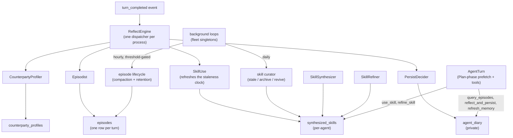
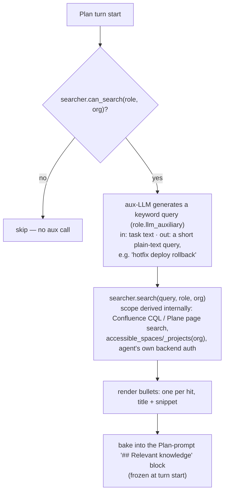

# Agent Learning

The agent-learning subsystem turns finished turns into durable, retrievable lessons — so the same agent (and its team, and the org) gets better over time without retraining the underlying model.

This page describes the shipped architecture: what runs in-engine, where each piece slots into the [Turn Engine](turn-engine.md) and [Knowledge System](knowledge-system.md), and the deliberate non-goals.

> **Provider-agnostic by design.** Learning lives in the org/data layer, not in a model checkpoint. Any `LLMProvider` can back any role. Model fine-tuning is never required and is not part of the in-engine learning loop.

---

## Why tools alone are not enough

A common misconception is that adding memory/skill tools is sufficient to make an agent "learn." It is not. For a learning loop to be *effective* — i.e. for the LLM to reliably produce good lessons and invoke the right tool at the right moment — four layers must line up:

| Layer | What it does | Where Crewlet carries it |
|---|---|---|
| **1. Model training** | Weights that know the memory/reflection protocol | **Not required.** Layers 2–4 do the work; any stock Claude/GPT works. |
| **2. Per-phase contract** | Short, per-phase system-prompt rules that remind the LLM *when* to persist, reflect, recall | Plan/Review prompt builders in `internal/agent/prompts` — guidance blocks injected only when the matching tool is registered. See [Prompt scaffolding](#prompt-scaffolding). |
| **3. Tool descriptions** | One-line *when to use* text on each tool — Crewlet pushes guardrails into descriptions, not prompts | Builtins (`query_episodes`, `reflect_and_persist`, `refresh_memory`, `refine_skill`, `use_skill`, `mark_onboarded`) have precise one-line descriptions. |
| **4. Deterministic harness** | Post-turn code that runs reflection regardless of whether the LLM "remembers" to | the reflect engine — the load-bearing piece. LLM cooperation is a bonus, not a dependency. |

Crewlet puts the weight on layers **2–4**. Layer 1 is desirable but optional — effectiveness is not gated on any one vendor's checkpoint.

---

## Subsystems

Small components, each with a single responsibility, plus the orchestrator that wires them.

**Two ways in, and they are not the same shape.** Everything learned *from a turn* arrives on one event through one dispatcher; the two passes driven by a *clock* rather than a turn are their own loops, and fleet singletons.



### 1. PersistDecider — *post-turn personal memory*

Replaces "hope the LLM remembers to capture a durable fact" with a deterministic post-Review decision.

- **Trigger:** after `submit_review` emits `done`, or after the engine terminates the turn as `failed` (stall guard, max-iter exhaustion, unhandled exception, LLM unavailable). `self_iterate` is a mid-state; reinforcing it would teach the agent from incomplete work.
- **Decision:** small auxiliary-model prompt answering *what, if anything, should persist?* Defaults to NOOP. The classifier picks a tier:
  - `LONG` — durable preference / fact (no TTL).
  - `SHORT` — situational, with a TTL in days (sprint focus, vacation, delegation context).
  - `DOC` — would be team-relevant; the decider does not write personal memory but logs the recommendation. Real cross-agent propagation goes through the team knowledge base, not the diary.
  - `NOOP` — nothing worth persisting.
- **Writing-style rule:** persisted entries are **declarative facts, not instructions**. `"User prefers concise responses"` ✓ — `"Always respond concisely"` ✗. Instructions drift out of date and get re-discovered as contradictions; facts compose cleanly. (Adopted verbatim from Hermes's memory guidance.)
- **Effect:** writes a row to the agent's `agent_diary` via `learning.Diary.Write` — agent-scope only.

### 2. AgentDiary + `reflect_and_persist` — *in-flight personal memory*

The agent's private observation log. Two kinds:

| Kind | TTL | Use |
|---|---|---|
| `diary_long` | None | Durable preferences and facts (`Stakeholder X prefers digests`). |
| `diary_short` | Set | Situational state (`Sprint freeze runs through 2026-05-10`, `Opened PR-123 from sandbox run, awaiting review`). Excluded by the read's own SQL predicate once the TTL passes — so an expired row never consumes a slot in the recency window — and physically deleted by the [retention sweep](../guides/fleet.md), which runs on the same fleet-wide singleton tick as the other short-horizon tables. |

Two writers converge: the post-turn `PersistDecider` (above) and the in-flight `reflect_and_persist` LLM-facing builtin. Both go through `learning.Diary.Write`, which embeds the content on write so the row is reachable by vector similarity later. The `## Personal memory` prefetch and `refresh_memory` read the diary via **hybrid candidate selection**: `learning.Diary.Recall` (vector top-K matches to the trigger) unioned with `learning.Diary.Recent` (recency top-K), deduped by row id and capped at `memoryCandidatePool` (100), then passed to an aux-LLM relevance filter that picks the final digest. The two halves serve different needs: vector search catches **topical / semantic matches** to the current trigger; recency catches **broadly-applicable operational rules** that may not be a topical match (e.g. "use semantic commit messages on every PR"). The aux filter judges from the merged pool.

**Write-boundary hygiene.** `learning.Diary.Write` runs a cheap guard on every write: an exact-duplicate of a live row short-circuits to the existing row id rather than inserting a paraphrase the read-side filter would then have to wade through. Content is stored verbatim — never length-truncated, so the agent reads back exactly what was written; only the text handed to the embeddings provider is sliced, to stay within its token limit. The post-turn `PersistDecider` is additionally skipped when the turn already self-persisted in-flight (the planner called `reflect_and_persist`), so the two writers don't double-write the same fact. Prompt-injection scanning at this boundary is a separate concern, deliberately not bundled into the hygiene pass — the guard is about write dedup, not content vetting.

The diary is read by:
- The Plan-phase `## Personal memory` prefetch block (see [`fetch_personal_memory_block`](#personal-memory-prefetch--refresh)).
- The mid-turn `refresh_memory` builtin, which re-runs the same diary query with an enriched context hint.

### 3. CounterpartyProfiler — *entity modeling*

Crewlet's multi-party equivalent of Hermes's "model of who you are."

- **Input:** observed interactions per counterparty (colleague, stakeholder, external human) from Slack/Jira/A2A events. A [coalesced trigger](event-system.md#inbox-batching--coalescing) runs one observation pass per **distinct sender** (`merge_interactions_by_sender` joins a sender's messages chronologically first) — a thread where one human sent four messages is one counterparty; a multi-human thread is genuinely several.
- **Output:** one `CounterpartyProfile` row per `(observer_handle, subject_handle | subject_external_id, subject_platform)` — preferred communication style, past decisions, sensitivities, topics of interest. Stored in the `counterparty_profiles` table (not the diary; not Confluence).
- **Scope:** per-observer always — a fact one agent learns about Bob is private to that agent. Cross-agent propagation goes through humans + the team knowledge base, not auto-merging.
- **Retrieval:** `lookup_colleague` returns the profile when present; the Plan phase auto-injects the trigger counterparties' profiles into prompts when the trigger has identifiable senders (one block per distinct sender with a stored profile).

### 4. EpisodicMemory + `query_episodes` — *search own past*

Agents can search their own prior turns.

- **Source:** the `episodes` table in the node's own store — one row per completed turn (`agent_handle`, `task_summary`, `plan_summary`, `tool_sequence`, `skills_used`, `review_outcome`, `started_at`, `ended_at`, `duration_ms`, `embedding`).
- **Builtin:** `query_episodes(query, limit, outcome_filter?)` — vector similarity over `task_summary | plan_summary` concat, scoped to the calling agent's handle, available in Plan phase.
- **Auxiliary summarization:** raw episode hits are passed through the role's `llm_auxiliary` model (a cheap one) before reaching the planner, keeping the planner's context window small. Falls back to raw bullets when no aux model is configured.
- **Frozen-at-turn-start:** the Plan-phase `## Similar prior work` prefetch resolves once per turn and bakes the summary into the system prompt. Re-iteration (Review → Plan again) reuses the same prefix so the LLM provider's prompt cache keeps working.

### 5. SkillSynthesizer — *skill induction*

Mines recurring successful trajectories and drafts a new procedural skill.

- **Single-turn induction** runs inline in the reflect engine: a **settled** turn (`done` or `failed`) that used ≥`min_tool_calls` tools is offered to the auxiliary model, which drafts a skill or declines. Declining is the ordinary answer — most turns are not procedures — so a turn with no reusable shape costs one cheap call and writes nothing.
- **Three gates, all before the model call**, because a draft made only to be discarded is money spent for nothing: the per-seat cap (`max_skills_per_agent`), and a duplicate check comparing the turn's tool set against the seat's existing skills by Jaccard similarity (`duplicate_jaccard_threshold`). The comparison is over the tool **set**, not the ordered run — two turns calling the same four tools in a different order are the same procedure, and treating order as identity is how a seat ends up with a skill per permutation. A draft the model returns without a name, summary or body is dropped rather than written with the gap.
- **Clustered synthesis** (`scheduler_enabled`, `cluster_*`) is the other half, and it catches what single-turn induction cannot: the shape a seat arrives at over a fortnight — three tools, unremarkable on any one turn, run the same way eleven times. Repetition is evidence a single turn cannot offer, and it is invisible from inside any one of them. A daily [singleton](seat-ownership.md#singleton-duties) pass reads each seat's last `episode_fetch_limit` (default 200) turns, greedy-clusters them by tool-sequence Jaccard at `cluster_jaccard_threshold` (default 0.6), and drafts from the largest cluster of size ≥`cluster_min_size` (default 3). It is **off by default** — `scheduler_enabled: false` — because the pass costs an auxiliary call per seat per day and a young company has nothing to cluster yet.
  - **One draft per seat per pass, largest cluster first.** Not every qualifying cluster: each draft is a completion, and a seat with three real patterns learns them over three days with the strongest evidence going first. A pass that drafted everything could also fill the per-seat cap in a single tick.
  - **A cluster the seat has already learned is skipped, not a stop.** The next pattern down may be one it has not — the same `duplicate_jaccard_threshold` the inline path uses, which is *stricter* than the pooling threshold on purpose: pooling asks "is this the same kind of work", rejecting a draft asks "is this the same skill".
  - **Only raw, settled turns with ≥`min_tool_calls` tools are evidence.** A compacted row is already a summary of a cluster and would count a fold as one turn; a `self_iterate` round is work the agent judged incomplete.
  - **The stored `tool_sequence` is a run that actually happened** — the cluster's representative — rather than a union of its members, because the duplicate check compares stored sequences against new turns and a union nobody performed matches everything loosely.
  - The `SkillSynthesized` event carries `trigger: clustered` and the `cluster_size`, and **no `turn_id`**: the draft came from a group, and naming any single member would put a trace on the event that explains none of the others.
- **Output:** a row in `synthesized_skills` keyed by `(agent_handle, name)` — agent-scope only. The body is stored in the familiar SKILL.md Markdown shape, which `use_skill` returns verbatim.
- **Cross-agent promotion is not implemented in this build either.** `skill_promotion`'s fields validate and are read by nothing, and no `SkillPromoted` event is ever constructed. What the design calls for, for whoever builds it: when ≥N siblings in the same `OrgUnit` independently converge on a similar pattern, a separate promotion pass distils the cluster into a **draft page in the team knowledge base** under the unit's `Auto-Drafted Skills` parent. The synthesizer builds a backend-neutral markdown draft and hands it to a **`PromotionPageWriter`** — the small consumer-owned seam (`resolve_unit_container` / `missing_container_hint` / `create_draft_page`) implemented per backend: `ConfluencePromotionWriter` posts rendered XHTML into the unit's `integrations.confluence.space`; `PlanePromotionWriter` posts into the unit's `integrations.plane.project`, [ensuring the parent page exists](../integrations/plane.md#skill-promotion-on-plane). A unit without a configured container soft-skips with the writer's remediation hint; a write failure returns nothing so the scheduler retries next tick. Because the scheduler re-clusters the same persisted rows every tick, **cross-tick dedup is the writer's job**, per backend: Confluence rejects a repeat create with a 4xx on the duplicate title, while the Plane writer stamps `external_id="draft:<name>"` (the fork 409s on the duplicate pair) and returns the existing page instead of creating another — either way one converging cluster yields one draft, not one per tick. Draft titles carry the `[Auto-draft] ` prefix (`knowledge.AutoDraftedParent`), and the `## Relevant knowledge` search hides pages under the `Auto-Drafted Skills` parent — so an unvetted draft never reaches other agents. A unit lead reviews and publishes by moving the page out of the parent; once published it's a regular knowledge-base page, reachable through the query-time search. The engine carries no unit-scope skill rows of its own. Success publishes a `SkillPromoted` event whose `container_key` field carries the unit's configured container (space key / project identifier) alongside `page_id` / `page_title`.
- **Collision guard:** the synthesizer rejects names that already exist in the agent's own `synthesized_skills` table. There's no global skill registry to guard against — synthesized skills are per-agent, and shared procedures live in the team knowledge base rather than in an engine-side registry.

### 6. SkillRefiner + `refine_skill` — *improve skills during use*

When a synthesized skill was central to a successful turn, append an *observed-in-practice* bullet; when it contributed to a failed turn, append a *counter-example*.

- **Auto path:** the reflect engine dispatches the refiner after every **settled** turn (`done` or `failed`) whose `skills_used` is non-empty. A `self_iterate` round is not refined — it is work the agent itself judged incomplete, so a lesson drawn from it is one the next round may contradict, and the turn will emit another `turn_completed` when it does settle. The auxiliary model picks one observation (or NOOP); successful turns produce `Observed in practice: …`, failures produce `Counter-example: …`.
- **One call, one bullet, at most one skill.** The turn's whole offered catalogue goes into a single prompt and the model chooses which skill — if any — learned something. Per-skill calls would cost a completion per skill per turn for answers that are almost always NOOP, and a turn rarely teaches two procedures something new at once. A name the model invents is dropped rather than matched onto the nearest candidate: a bullet appended to the wrong procedure is worse than no bullet.
- **NOOP is the expected answer**, and it is not an error. A model asked what a turn taught will produce something for any turn at all, and a skill that grows a bullet per turn stops being a procedure and becomes a diary of the turns that read it. The prompt says twice that answering nothing is correct.
- **Only skills that still exist.** The turn's `skills_used` is a list of ids captured when its prompt was built; the refiner intersects it with the live catalogue, so a skill the [curator](#8-skillcurator--keep-the-catalogue-honest) archived in the meantime is not resurrected. A turn whose skills have all been archived costs no model call at all.
- **Bullets collect under one `## What practice added` heading** at the end of the body, rather than scattering a new section through the steps on every refinement — a reader sees the procedure first and what practice added to it second.
- **Manual path:** the LLM-facing `refine_skill` builtin lets the planner correct its own skills mid-turn. It takes `skill_name`, the **full** corrected `content` and an optional `reason`; the new text replaces the body in its entirety. A whole-body replacement rather than a patch, because a model asked for a diff produces something diff-shaped that does not apply, and a half-applied edit leaves a procedure that is neither the old one nor the new — with nothing to compare against, since the prior body is already archived by then. Patch-on-encounter: if the plan finds a skill outdated, it corrects it immediately rather than waiting for a separate consolidation pass. A seat may only refine its **own** skills.
- **Versioning:** every refinement archives the prior state to `synthesized_skill_versions` and bumps the live row's `version`. Rollback is a forward-step operation (the archived body becomes the body of a new version), so rewinding then un-rewinding works without losing history. History is bounded by `max_versions_kept` (default 10) per skill.
- **Body cap:** `max_body_chars` (default 20 000) — a refinement that would breach the cap is **refused, never truncated**, so a runaway loop can't blow up a skill body. A clip lands mid-step and the model reads the remainder as the whole procedure. The auto path skips silently and logs it; the manual tool refuses with the field name, because there a model can tighten the text and retry.
- **`enabled` gates both halves.** `learning.skill_refinement.enabled: false` withdraws the `refine_skill` tool *and* leaves the post-turn refiner unwired — they write the same rows through the same version archive, so a company that turned refinement off and still had the tool would watch its skills change under a knob it had set to false. `use_skill` is unaffected: reading a skill is not changing one. Setting **both** `auto_refine_on_success` and `auto_refine_on_failure` to false is refinement-off spelled the long way, and the engine leaves the worker unbuilt rather than skipping every turn.

### 7. ReflectEngine — *the orchestrator*

The deterministic harness. Owns when reflection runs and coordinates the workers above.

- **Hooks:** subscribes to `turn_completed` on the EventQueue, under its **own consumer group**. Its own, shared with nothing: reflection is the one subsystem an operator turns off on its own, and a group shared with another consumer would take that consumer's traffic down with it.
- **One consumer, not one per writer.** Everything a seat learns is learned from one event, and every writer is gated on the same questions about it. Three subscriptions would mean three redelivery windows over one turn, three places to discover a company that learns nothing, and three chances for one of them to be quietly unwired.
- **One dispatcher per process, not per config revision.** A [config apply](configuration.md) swaps the org and the worker set behind it; the subscription and the redelivery guard stay put. Rebuilding it per revision would empty that guard, so a redelivery landing either side of an apply would be classified twice — two auxiliary calls, two differently-worded rows for one fact. A refused worker set leaves the previous one serving: reflecting against a stale org is a far smaller wrong than not reflecting at all.
- **Gates, in order.** Each is reported by name, per worker, per turn, because "this company never learns anything" needs an answer that says *which* gate closed:
  1. **No workers** — nothing is wired, so there is no question to ask about this turn.
  2. **No role** — the turn came from a seat this revision no longer has. Learning about a renamed or removed role writes memory under an identity nothing can read back.
  3. **Per-role opt-out** — `learning_enabled: false` opts a noisy or sensitive role out without disabling the subsystem globally. Unset inherits the company-wide setting.
  4. **No budget** — the company or the seat is already at its `token_budget` ceiling, so the pass declines to *start*. Reflection is best effort and this is the skip that costs nothing: a pass that runs and then discovers it is over budget has already made its auxiliary calls. It sits **before** the duplicate ring on purpose — an exhausted budget is the one *transient* refusal in this list, so a turn skipped for it stays reflectable when the ceiling moves, while every other gate would still hold on a redelivery. An **unreachable** counter reflects anyway: unknown is not "no", and a coordination blip must not silently stop a company learning.
  5. **Duplicate** — a bounded ring of recently-processed work keys. Reflection is *not* idempotent: each pass is a fresh auxiliary call that can write a second, differently-worded row for the same fact. The ring is per-process and deliberately not durable — a second node reflecting the same turn writes a second diary row, which is the [bounded duplication](#what-does-not-happen) the engine promises rather than exactly-once. It **evicts** rather than growing: past the bound, a redelivery is far outside any backend's redelivery window.
  6. **No engagement** — the planner opted out (`plan_decision: skip`), or was coerced to `direct` and called nothing. Either way the agent processed nothing externally observable, and a fact read off the trigger would teach it a directive it never received.
  7. **Per-worker skip** — each worker states its own applicability, because they genuinely differ: the persist decider must not run on an unsettled turn, the counterparty profiler must.
- **Failure mode:** every dispatch is best-effort and each worker runs under its own panic recovery, so one worker's bug costs neither the pass's remaining workers nor its sentinel. A failed worker logs and the next one still runs; a failed reflect never fails the parent turn. The handler **always acks**: reflection is work about a turn that is already over, so a nak would redeliver it to spend another round of auxiliary tokens reaching the same conclusion.

#### What the turn event has to carry

The dispatcher is a queue consumer, so it usually runs on a node that never saw the trigger. Everything the gates read therefore rides on the `turn_completed` payload itself — the tool sequences, the plan decision, the skills the prompt offered, and the inbound interactions with their senders resolved. A field left off that payload is a fact no worker can consult, and the gates fail **open-looking**: an absent tool sequence reads as "the agent engaged with nothing", which silently skips every worker on exactly the successful turns worth learning from, while the dispatcher reports a clean pass.

---

## Prompt scaffolding

Short, conditional guidance fragments are appended to the Plan-phase system prompt, injected **only when the matching tool is registered for the role**. This scaffolding is sourced from the [Tool Skills](tool-skills.md) registry — knowledge-base pages (Confluence or Plane) operators can edit at runtime — rather than being hardcoded in engine prose. The bundled `examples/tool-skills/` files ship ready-made versions:

| Bundled skill | Trigger | What it teaches |
|---|---|---|
| `examples/tool-skills/reflect-and-persist.md` | `tool: reflect_and_persist` | Persist *declarative facts, not instructions to yourself*. |
| `examples/tool-skills/refine-skill.md` | `tool: refine_skill` | Patch a loaded skill when it goes stale; don't wait to be asked. |
| `examples/tool-skills/retrieval-research.md` | `any_of` of `query_episodes` / the `plane` MCP server / `refresh_memory` | The consolidated retrieval re-search rule — see below. |
| `examples/tool-skills/observed-directives.md` | `tool: slack_conversations_add_message` | Share team-relevant directives via the agent's broadcast surface. |
| `examples/tool-skills/getting-unstuck.md` | `any_of` of colleague-surface tools (Slack post / the `plane` MCP server / `a2a_ask`) | Manager-handoff conventions — when stuck, mention manager on the surface where the problem lives. |
| `examples/tool-skills/channel-discovery.md` | `any_of` of Slack discovery tools | How to find the right Slack channel via `channels_list`, and how to fall back when membership is missing. |

The `retrieval-research` skill carries the **consolidated retrieval re-search block**. The three relevance prefetches — `## Similar prior work`, `## Relevant knowledge`, `## Personal memory` — are all derived from the *triggering message as it stood at turn start, before any recon*, so they share one rule: after recon has given the planner a richer query, re-query the corresponding tool — *even when the initial block already had entries*. Rather than repeat that rule in three near-identical blocks, the shared preamble states it once and one terse per-tool line (`query_episodes` / the knowledge backend's page-search tools / `refresh_memory`) is appended for each re-query tool the role actually has. On a thin trigger the turn-start message genuinely is a bare pointer (the [thin-trigger gate](#thin-trigger-gate) skips the prefetch entirely); on a substantive trigger it is the whole message but still pre-recon. Either way the guidance makes the assumption legible to the LLM so the re-query pattern does not rest on the model guessing.

Plus four always-on prefetch blocks (rendered when the data exists):

- **`## Similar prior work`** — top 3 episode-search hits, summarised by the aux model.
- **`## Personal memory`** — diary entries selected via [hybrid vector ∪ recency candidate selection](#hybrid-candidate-selection), then filtered for relevance to the current task / trigger by the aux model.
- **`## Synthesized skills you've learned`** — names + descriptions of the agent's own synthesized skills, loadable via `use_skill`.
- **`## Relevant knowledge`** — knowledge-base pages from a live query-time search: the aux LLM generates a short search query from the trigger, and the [`knowledge.Searcher`](knowledge-system.md#the-knowledgesearcher-seam) runs it scoped to the role's accessible containers. See [Relevant-knowledge prefetch](#relevant-knowledge-prefetch) below.

Plus the conditional prefetch:

- **`## First-turn onboarding`** — rendered until the agent calls `mark_onboarded`. Lists the relevant `Onboarding` knowledge-base pages on the agent's unit chain. Stored markers live in `agent_onboarding_markers`, keyed by `agent_id` and stamped with a `chain_hash`; an org-chain change invalidates the marker so the hint re-fires for the new structure.

These blocks are **layer 2** from the four-layer table above. The reflect engine (layer 4) runs regardless of whether the LLM follows them — the scaffolding is an optimization that lets well-behaved models cooperate, not a dependency.

---

## Personal memory prefetch + refresh

The Plan-phase `## Personal memory` block runs `fetch_personal_memory_block` once at turn start: assembles a candidate pool of the agent's diary rows, filters them by relevance to the trigger via the aux model, renders a digest. Bake the digest into the system prompt; do not re-query mid-turn.

### Hybrid candidate selection

`fetch_existing_memories` is the candidate-pool helper that feeds the aux filter. Given a trigger query, it returns the **union** of two top-K reads against the agent's diary:

- **Vector top-K** — `learning.Diary.Search` runs cosine similarity against the diary's embedding column, scoped to the agent's id. This catches *topical / semantic matches* to the trigger.
- **Recency top-K** — `learning.Diary.List` reads the most-recent rows in insert order, again scoped to the agent's id. This catches *broadly-applicable operational rules* that may not be a topical match to this particular trigger — "use semantic commit messages on every PR," "always tag the security channel before merging auth changes" — which the vector half would miss when the trigger is unrelated to the rule's topic but the rule still applies.

The two sets are deduped by row id and capped at `memoryCandidatePool` (100). The aux-LLM relevance filter then judges from this merged pool — same filter as before, just a better-recall candidate pool. The hybrid is **not pure vector** (which would miss the broadly-applicable rules) and **not pure recency** (which falls off for long-lived agents with >100 LONG entries — old-but-relevant rows would drop off the window and never reach the filter).

`PersistDecider`'s write-side dedup keeps calling `fetch_existing_memories` *without* a query — that path falls back to pure recency, which is the correct shape for the "is this paraphrase already in the diary?" check.

### Failure modes

The prefetch filters against the **salient inbound message** — the raw message, not the notification builder's enriched task description (see [Salient-body sourcing](#salient-body-sourcing)). That leaves two failure modes:

1. **Context-thin triggers** ("yes", "+1", a thread reply with little semantic content) — the salient message itself is thin, so the filter has nothing to match on and the block ends up empty. When that happens *and* the agent has memory rows, the block renders an the gate-path hint line nudging the planner to refresh after recon.
2. **Richer triggers** can produce a non-empty block, but the entries the trigger-time filter chose may not be the most relevant once the planner has read the thread / fetched the ticket / queried knowledge and learned what the conversation is *actually* about.

The `refresh_memory(context_hint=…)` builtin fixes both. The `refresh_memory` line of the bundled `retrieval-research` [Tool Skill](tool-skills.md) (`examples/tool-skills/retrieval-research.md`) tells the planner to call refresh after any tool call that materially changed its understanding of the conversation — *even when the initial block already had entries*, not only as an escape hatch from the empty case. The tool re-runs the filter with the planner's enriched `context_hint` appended to the original task and returns the freshly-rendered digest as the tool result. Bounded by:

- **Per-turn cap** — `learning.personal_memory.max_refreshes_per_turn` (default 3). A hint beyond the cap is refused with the count spent, so the planner learns the shape of the limit and stops trying instead of silently no-op'ing. A hint whose filter call *failed* still spends its slot — otherwise a failing call is retryable without bound, which is the same unbounded spend the cap exists to stop — but retrying that same hint is allowed and does re-run the filter.
- **Idempotency cache** — a repeat of a hint already used this turn (case- and whitespace-normalised) is answered from the ledger without a fresh auxiliary call, including when the answer was "nothing bears on this". A repeat is free *because it is answered from here*, not merely uncharged: re-running the filter for free would leave the cap bounding nothing, since a model alternating two hints could spend a completion per round forever. What is cached is the **filtered rows**, not the rendered text, so a repeat asking for a larger `limit` gets the extra notes rather than the first call's rendering.
- **Per-turn isolation** — state keyed by `turn_id` and bounded to the most recent 256 turns, far more than a node runs at once; the bound is what makes it a cache rather than a leak, since nothing tells the tool when a turn ended. State from one turn never leaks into another.
- **Frozen-prefix-cache safe** — refresh output lands as a tool-result message, not a system-prompt rewrite. The LLM provider's prompt cache stays valid across iterations.

---

## Relevant-knowledge prefetch

The Plan-phase `## Relevant knowledge` block surfaces team-published documents — playbooks, runbooks, ADRs, conventions, design docs, anything in the agent's accessible knowledge-base containers — without forcing the planner to discover them by guessing names against `use_skill` or by remembering to call the knowledge-search tool first. It runs a live knowledge-base search once per turn through the [`knowledge.Searcher` seam](knowledge-system.md#the-knowledgesearcher-seam) (Confluence CQL or Plane page search — one backend per org); the [Personal memory prefetch](#personal-memory-prefetch--refresh) is the closest sibling in spirit, though that one reads the private diary via hybrid vector ∪ recency candidate selection filtered by an aux-LLM relevance pass.

### Why "knowledge" and not "skills"

An alternative design would carve out a special "team-skill" label so operators could mark certain pages as procedures meant for agents. That reintroduces an operator-curated/synthesized skill split — two parallel skill surfaces to maintain — which the project deliberately avoids.

The shipped design takes the opposite stance: **a knowledge-base page is a knowledge-base page**. The search runs against the agent's accessible containers and the backend's own ranking decides which pages come back (Confluence: relevance; Plane: recency); there is no engine-side "skill" label or parallel surface to maintain.

### Source: query-time knowledge-base search

For each Plan turn:

1. The searcher gate runs: `searcher.can_search(role, org)` — a cheap, no-I/O check that a search could return anything (the role has accessible containers, or its own backend credentials for an unscoped search). When it says no, the aux-LLM query-generation call is skipped entirely.
2. The role's auxiliary model (`role.llm_auxiliary`) turns the task description into a short plain-text keyword query (the user prompt ends `Knowledge-base search query:`). Scope is **not** the aux model's job — the searcher derives it internally from the org-wide `knowledge.*` list via [`accessible_spaces` / `accessible_projects`](knowledge-system.md#accessible-containers). There is no per-unit/role union: a unit's `integrations.confluence.space` / `integrations.plane.project` is integration identity (webhook routing + write home), not read scope.
3. The searcher runs the query as the agent's own backend user (per-agent token from `mcp_env.atlassian` / `mcp_env.plane`, falling back to the org-level token) — on Confluence as a CQL `text ~ "..."` clause narrowed by `space IN (...)`, on Plane sent verbatim to the fork's tokenised page search narrowed by resolved project UUIDs. The backend enforces page permissions natively, so restricted pages the agent cannot see never appear; unreviewed [auto-drafts](#5-skillsynthesizer--skill-induction) are excluded via the default `exclude_ancestors=["Auto-Drafted Skills"]`.

### Flow



### Loading full bodies

The bullets render title + snippet — enough for the planner to decide which pages to open. To pull a full body or run a fresh search, the planner uses the backend's MCP tools — on Confluence `confluence_get_page` / `confluence_search`, on Plane the `plane` server's page read/search tools. The block prose describes the capability, never a hardcoded tool name.

### Hardening

- **Show-nothing on search unavailability / failure.** When the backend is unreachable or query generation fails, the block renders nothing rather than erroring the turn — `search()` is best-effort by protocol contract.
- **The gate-path hint** rendered when the block would otherwise go silently empty — either the thin-trigger gate skipped the search, or the search ran and returned nothing. Mirrors `personal_memory`'s hint; points the planner at the knowledge-search tool as the mid-turn escape hatch.
- **Frozen at turn start.** The block is part of the system-prompt prefix, so re-iteration (Review → Plan) reuses the same prefix and the LLM provider's prompt cache stays valid.
- **Once per turn.** The query is generated and the search runs once; the result is reused across phases.

### Post-Plan re-fetch (thin triggers)

On a [thin-trigger](#thin-trigger-gate) turn the Plan-time `## Relevant knowledge` prefetch is gated off — generating a search query from a bare pointer is noise. That leaves a gap: the planner does its recon *inside* the Plan phase, but the Execute phase that follows would still run blind, with no relevant-knowledge block at all.

`fetch_post_plan_relevant_knowledge` (`internal/agent/runner/phases.go`) closes it. After Plan submits, the turn engine re-runs the relevant-knowledge search — but keyed on **`plan.summary()`**, not the task description. On a thin trigger the original task is webhook boilerplate; the plan summary is the recon-informed, task-shaped query the gate was waiting for. The re-fetch uses the `query_override` parameter of the relevant-knowledge wrapper, which forces the thin-trigger gate **off** (the override *is* a real query) and re-points query generation at it. The rendered block is injected into the Execute system prompt as its own `## Relevant knowledge` section.

It runs only when **all** of: the trigger required recon (otherwise the Plan-time prefetch already saw a real trigger — no gap), the plan decision is `plan` or `direct` (`skip` never reaches Execute), and the plan summary is non-empty. It runs **once per turn iteration** — a `self_iterate` round produces a fresh plan summary, so the re-fetch reflects the corrected plan.

This is the **push** half of the thin-trigger story: the [retrieval re-search guidance](#prompt-scaffolding) is the *pull* path (the planner chooses to call the knowledge-search tool mid-Plan), and the post-Plan re-fetch is the non-discretionary *push* into Execute that fires whether or not the planner pulled. **Boundary:** it enriches only the Execute phase that follows Plan — it does not retroactively cover tool calls the planner made *inside* the Plan phase.

### Telemetry

the plan-prefetch summary's `relevant_knowledge_hit` / `relevant_knowledge_bytes` / `relevant_knowledge_selection_count` are recorded alongside the other prefetch blocks. The selection count distinguishes the two `hit=True` paths: a non-zero count means real pages were rendered; zero with `hit=True` means the gate-path hint was rendered — the thin-trigger gate skipped the search, or the search ran and returned nothing. Operators investigating low effectiveness pivot on this field to tell "no signal" from "hint nudge only."

The post-Plan re-fetch emits its own `RelevantKnowledgeRefetched` event whenever it takes its active path (thin trigger + `plan` / `direct` + non-empty summary), carrying `iteration`, `plan_decision`, `block_bytes`, and `selection_count`. The overwhelmingly common non-thin-trigger turn emits nothing. The event lets an operator correlate a gated Plan prefetch with the block Execute actually received.

A block stuck at 0% hit rate over a representative window is almost always one of:

- No `knowledge.confluence_spaces` / `knowledge.plane_projects` configured **and** the agent has no per-agent backend credentials, so it can't search unscoped (a credential-less / fallback-token agent with no containers searches nothing — `can_search` gates the whole prefetch off).
- Neither `confluence` nor an enabled `integrations.plane` configured, so no searcher is wired — or no pages in the accessible containers match. On Plane, also check **project membership**: the search is membership-scoped, so a seat that isn't a member of the scoped projects silently gets nothing (see [Plane § Knowledge scope](../integrations/plane.md#knowledge-scope)).
- Aux LLM unavailable (`llm_auxiliary` not configured and the role's primary `llm` doesn't resolve as an aux provider), so query generation cannot run.

---

## Thin-trigger gate

All three relevance-driven Plan-phase prefetches — `## Personal memory`, `## Relevant knowledge`, and `## Similar prior work` (episode recall) — run an aux-LLM call against the **bare trigger** at turn start, *before* the planner has done any recon. For a self-contained trigger (a full task assignment, a detailed issue body) that's high-value: the planner gets relevant memory / docs / episodes baked into the system prompt for free.

But for an **event-driven turn the trigger is a pointer, not the context**. A Jira webhook says "POC-518 got a comment"; a Slack thread reply says "+1". The real context only exists *after* the planner fetches the issue / reads the thread. Running the aux filter against the bare pointer is near-guaranteed low-value — it has nothing substantive to match against — and we'd also spend prompt space rendering "nothing matched, go look later". So on the common webhook turn we'd pay twice (a wasted aux call + prompt clutter) for a result the planner has to redo via tools anyway.

The gate skips the aux call when the trigger is a pointer. It is **pure logic — no LLM call**: the decision is read from notification metadata (`issue_key` / `thread_ts` / `event_type`), which is exactly why it's cheap enough to gate on.

| Stage | Carries the signal |
|---|---|
| **Notification builder** | `notify.Prompt.RequiresRecon` — `True` when the builder emitted a "go fetch the real thing" directive. Jira / Confluence page / Plane work-item + page events (`## Get Full Context`), GitHub `review_requested` ("read the diff"), Slack thread replies (read-the-thread). The generic builder returns `False` — its body *is* the message. |
| **the notification service** | Carries the builder's answer onto the notification it publishes, so nothing downstream has to re-derive it. |
| **The inbound interaction** | The flag is read off the trigger event into the interaction — the one normalized, platform-agnostic property workers *may* branch on (it is not an event-type check). A coalesced trigger yields one interaction per constituent message, all carrying the event-level merged flag, and the whole-trigger predicate is true when any of them is. A2A and internal `TaskAssigned` triggers carry their own context → always `False`. |
| **Prefetch** | All three relevance prefetches read it: personal memory, relevant knowledge and episode recall. When set: skip the aux call (for personal memory the relevance filter, for relevant knowledge the query generation and live knowledge-base search, for episode recall the vector query). All three then render a **gate-path hint** so the block stays visible and self-explanatory rather than vanishing — `EmptyMemoryHint`, `EmptyKnowledgeHint` and `EmptyRecallHint` respectively — and the matching per-tool line in the [retrieval re-search guidance](#prompt-scaffolding) carries the same nudge. |

The signal lives at the notification builder because the builder *decides* whether to emit a recon directive — classifying from `event.type` downstream would duplicate that decision and let the two drift. A raw token-count heuristic doesn't work here: a webhook `task_description` is *long* (title + event metadata + multi-step "How to Handle This" boilerplate) but *thin on substance* — length would wrongly classify it as rich.

Personal memory still does its cheap diary recency list on a thin trigger (a DB read, no LLM) so it can render the hint only when the agent actually has memory rows to refresh — the vector half of the hybrid would key on a bare pointer that has nothing substantive to match, so it's skipped alongside the aux filter. Relevant knowledge skips the query generation and live knowledge-base search entirely — it only needs `CanSearch` to confirm a search could return anything (so the search-tool nudge is actionable) before rendering the hint. Episode recall skips the vector query outright and renders its hint unconditionally: unlike a diary list or an accessible-spaces check, the only way to know whether an agent *has* matching past episodes is the vector query the gate exists to skip — so the hint is phrased conditionally ("if this task resembles something you have done before…") to read correctly even for an agent with no episodes.

**Observability.** The summary's `trigger_requires_recon` records the gate decision once per turn. Without it, a gated prefetch and a filter that ran-and-found-nothing look identical in telemetry (both `*_hit=False` / `selection_count=0`); with it, an operator seeing an empty `## Relevant knowledge` block can tell the prefetch was *gated* (the trigger was a pointer) rather than *broken*. The event's `summary` surfaces it in the trace view (`"… plan prefetch: N/6 hits (thin trigger — filters gated)"`).

This makes the prefetch honest about its role: it's an **optimization for rich triggers**, and for event-driven turns the tool-call path is the *primary* retrieval path — re-query-after-recon is the expected pattern, not a fallback. That re-query happens two ways: the planner *pulls* mid-Plan via `refresh_memory` / the knowledge backend's search tools / `query_episodes` (guided by the [retrieval re-search guidance](#prompt-scaffolding)), and for relevant knowledge the turn engine also *pushes* — the [post-Plan re-fetch](#post-plan-re-fetch-thin-triggers) re-runs the search keyed on the plan summary and injects the result into the Execute prompt, so Execute is covered whether or not the planner pulled.

**One block is not gated, deliberately.** A pointer-shaped trigger is very often a *follow-up on a conversation this seat already worked* — the second comment on POC-518, the reply in a thread it answered yesterday. [Conversation sessions](conversation-sessions.md) render what the seat itself already said there, and that lookup is a keyed read rather than a similarity match: no embedding, no aux LLM, nothing for the gate to save. So on exactly the turns where all three prefetches above go quiet, the seat still arrives knowing what it last said and did in this conversation — which is what stops it answering the same question twice while it goes off to re-read the thread.

---

## Salient-body sourcing

The relevance prefetches, the counterparty profiler, the PersistDecider, and `refresh_memory` all reason about *what the sender said*. None of them want the notification builder's scaffolding.

`build_notification_prompt` produces the **enriched body** — for a Slack message, ~1.5k chars of `## Triage` instructions front-loaded *before* the actual message. That enriched body becomes the planner's `task_description` (the planner needs the triage contract). But a relevance filter keyed on a `task[:N]` prefix of it never reaches the message: it filters against boilerplate that is byte-identical on every Slack turn.

So the raw message rides separately. the notification's `SalientBody` carries the inbound body verbatim — the message, no scaffolding — alongside the enriched `body`. `InboundInteraction.body` is sourced from it (falling back to the enriched `body` for events that carry no `salient_body`); a [coalesced trigger](event-system.md#inbox-batching--coalescing) sources one interaction body per constituent message. `salient_task_text(interactions, fallback)` (`internal/events/types/interaction.go`) is the single chooser: a single interaction body renders verbatim, multiple bodies join chronologically with sender attribution (`Alice: …`) and the joined text is clipped to the same 4,000-char bound a single body always had (embedding queries and filter prompts never receive `max_batch × 4000` chars), and the turn's `task_description` is the fallback — internal `TaskAssigned` triggers have no notification scaffolding, so the fallback is already clean.

Every relevance surface routes through it:

| Surface | Reads |
|---|---|
| `## Personal memory` prefetch | the salient text → aux filter prompt |
| `## Relevant knowledge` prefetch | the salient text → aux-LLM query generation + knowledge-base search |
| `## Similar prior work` (episode recall) | the salient text → vector query |
| `refresh_memory` | the salient text as the base task the `context_hint` is appended to |
| Counterparty profiler / PersistDecider | `InboundInteraction.body` directly |

Without this, a stored memory that perfectly answered a question went unused: the filter only ever saw the triage boilerplate, so it could not see the question.

---

## Episode lifecycle

The `episodes` table is the raw substrate of agent learning. Without lifecycle management it grows forever. The episode lifecycle worker drains it on a threshold-gated pass, walking each seat and doing nothing for the ones that are not due.

**Episodes have no plain retention sweep, deliberately.** Every other short-horizon table gets a range delete on a single horizon. Episodes cannot: their retention is this pass, which applies four different horizons to four different row states. A single `DELETE WHERE ended_at < cutoff` would collapse all four, and the row it would take first is the compacted summary — the only record of a whole era of a seat's work, standing in for hundreds of turns that are already gone.

### Trigger: threshold-gated, on a slow loop

The worker ticks hourly and, for each seat, runs one indexed `count(*)`. A seat under `max_raw_episodes_per_agent` (default 500) is skipped without touching the pass; a seat over it gets the full lifecycle run. The count is the gate rather than the pass's own early return, because "not yet" is the overwhelmingly common answer and it must cost one query rather than a walk.

The cadence is far shorter than the [skill curator's](#skill-curator) because what it watches is a **count**, not a clock: a busy seat crosses its threshold in a burst, and every turn past that point pays the recall scan over rows that should already have been folded. An hour bounds that overshoot to one hour of one seat's traffic.

**It is a fleet singleton**, claimed per tick under the node's own incarnation — two nodes compacting one seat's episodes would summarise the same cluster twice and pay for it twice. The claim **fails closed**: not knowing whether a peer holds the duty is exactly the case where running anyway produces the double write. Neither background pass fires on start, because every node in a fleet starts within seconds of a rolling restart — firing on start means every node races for the duty at once, and a crash-looping node spends the company's tokens on every restart.

**Compaction needs a summarizer.** The pass folds a cluster by asking the seat's own `llm_auxiliary` chain to describe what its members had in common — per seat, so a company whose seats run on different models has each one's memory compacted by the model that seat is configured with. With no auxiliary model configured anywhere, the pass does not run at all: what it could still do is delete, and deleting is the half an operator least wants unsupervised. The rows stay raw and readable instead.

### One worker, four actions

For each seat over its threshold the worker runs the full lifecycle pass:

1. **Drop non-terminal episodes** older than `non_terminal_max_age_days` (default 14). `self_iterate` is a mid-state — the reflect engine's terminal-outcome gate already excludes it from skill synthesis, and it only feeds `query_episodes` recall as noise. Cheap SQL DELETE; no LLM.
2. **Drop skill-consolidated episodes** older than `consolidated_grace_days` (default 30). When the synthesizer drafts a skill from a cluster of episodes it stamps `consolidated_into_skill_id` on each source row; the lifecycle worker drops them after grace because the skill itself now carries the learning forward. The grace gives operators a chance to audit / detect bad consolidations before the source disappears.
3. **Compact the rest** — the centerpiece. Pulls remaining raw episodes older than `compaction_min_age_days` (default 30), greedy-clusters them by tool-sequence Jaccard, and for each cluster of size ≥`compaction_min_cluster_size` (default 3) calls the role's `llm_auxiliary` to summarise into a `CompactedEpisode` shape (`common_task_pattern`, `common_outcome`, `success_rate`, `subjects_involved`, `notable_patterns`). Writes one `kind='compacted'` row, deletes the cluster's originals (except 2-3 exemplars retained as raw rows for drill-down, referenced by the new compacted row's `exemplar_turn_ids`).
4. **Optional: evict ancient compacted entries** older than `compacted_max_age_days` (default 0 = disabled). Hard long-tail storage cap for orgs that need years-out limits; off by default since compacted summaries are 10-100× smaller than the raw rows they replaced.

### Two physical row shapes share the same table

After the migration `episodes` rows distinguish on `kind`:

| Field | `kind='raw'` | `kind='compacted'` |
|---|---|---|
| `count` | always 1 | N original episodes collapsed |
| `task_summary` / `plan_summary` / `tool_sequence` / `review_outcome` | per-turn detail | the cluster's *common* values |
| `started_at` / `ended_at` | one turn's timestamps | the cluster's window |
| `common_task_pattern` / `common_outcome` / `success_rate` / `subjects_involved` / `notable_patterns` | unused | LLM-summarised aggregate |
| `exemplar_turn_ids` | empty | 2-3 raw rows kept as drill-down anchors |
| `consolidated_into_skill_id` | set when a skill drafted from this row | always NULL |

Vector similarity returns both kinds in one query. Callers branch on `kind` at render time:

- **`query_episodes` builtin** — kinds=both; renders raw entries as single past turns, compacted entries as `[pattern, observed N×]` aggregates.
- **`## Similar prior work` Plan-prompt block** — kinds=both; the auxiliary `summarize_episodes` step has a kind-aware prompt that emits the right bullet shape per row.
- **`SkillSynthesizer`** — kinds=`['raw']` only, on both paths. Compacted aggregates are too coarse to draft a clean skill body from, and the clustered pass would count one fold as one turn.
- **`SkillRefiner`** — reads no episodes at all. It is shown the skills the turn was offered and the turn itself (task, plan, tool sequence, outcome), which is the whole question it answers.

### What this protects

- **Storage growth** — bounded by `max_raw_episodes_per_agent` for raw rows; compacted rows are ~10-100× smaller per unit of original work.
- **Recall pollution** — non-terminal noise drops fast; old patterns become aggregate summaries instead of crowding similarity hits.
- **Learning drift** — when a skill captures a workflow, the source episodes get out of the planner's view (after grace), so the agent stops being shown stale per-turn detail of work the skill now represents abstractly.
- **Long-tail signal preservation** — routine work that never qualifies as a skill (most agent turns) survives as a compacted aggregate rather than getting dropped wholesale. The planner can still answer "you've done this kind of work N times" via the compacted entry.

### What does NOT happen

- **No work on the caller's path** — nothing about compaction runs inside a turn. Reads pay no latency cost for it, and neither does the write that crossed the threshold.
- **Compaction never feeds skill synthesis** — the consolidation hierarchy is one-directional: raw → skill, raw → compacted. A compacted entry doesn't get re-promoted to a skill; if the same pattern recurs after compaction, the *new* raw episodes form a fresh cluster the synthesizer can pick up.
- **No work for idle seats** — a seat under its threshold costs one indexed count per tick and nothing else. The loop wakes; the seat does not.

---

## Skill curator

A synthesized skill that nothing uses any more should leave the catalogue, and one that is used again should come back. That is a clock, not an event, so it is the second background pass — a fleet singleton on the same claim discipline as the episode lifecycle, ticking **daily**. A day, because the transitions it makes are measured in tens of days: a pass an hour would scan the whole catalogue 24 times to make the same zero transitions, and the one it eventually makes would land at most an hour earlier, against a threshold nobody set to the hour.

The state machine is `active → stale → archived` on disuse, and `stale → active` on use:

| Transition | When | Effect |
| --- | --- | --- |
| `active → stale` | unused for `stale_after_days` (default 30) | Still listed and still loadable — the prefetch renders it with an ageing marker, so the agent knows. |
| `stale → archived` | unused for `archive_after_days` (default 90) | Listings hide it and the loader refuses it. **Archived is not deleted:** the row stays readable, so restoring one is an operator edit rather than a re-synthesis. |
| `stale → active` | the skill is used again | Revival happens in the same transaction as the use, so the skill is back in the very next Plan prefetch rather than after the curator's next tick — which on the default schedule is up to a day later. |

An **archive window inside the stale window** is a misconfiguration, and taken literally it archives rows the same policy calls fresh. It is widened to the stale window instead, which is the reading both halves agree on.

Skills the operator has **pinned** are exempt from every automatic transition. Nothing promotes a skill to pinned.

### Being offered is being used

A skill's staleness clock is its last-used stamp, and the thing that moves it is the Plan-phase prefetch **offering** the skill — not the model then loading its body.

That is the honest reading of what the stamp answers. A skill rendered into the prompt *is* in the catalogue and *is* what the seat is being asked to work from; whether the model loaded the body is a question about that turn, not about the skill's currency. Keying on the load would age out every skill whose menu line was enough — which is the well-written ones.

The ids follow the prompt's own character budget: a skill whose menu line did not fit was never offered, so its clock does not move. A stamp that cannot be written is announced as a telemetry failure rather than swallowed, because an operator has to see a clock that stopped **before** the curator archives a hot skill.

Without this the whole catalogue ages out over a quarter while the prefetch is putting it in front of a model the entire time — and not as a slow degradation anyone notices. The menu simply gets shorter.

## Telemetry harness

The learning loop produces durable artefacts (synthesized skills, diary entries, counterparty profiles, episodes) and the surfaces that read them. Without per-surface measurement an operator cannot answer two basic questions:

1. **Are skills being used?** [Berlot-Attwell et al. (2024)](https://arxiv.org/abs/2410.20274) showed that in some library-learning systems the apparent gain from skill induction comes from extra LLM sampling rather than skill *reuse*. Crewlet's induction pipeline does real work; whether the resulting skills earn their keep is an empirical question that requires telemetry.
2. **Are the Plan-phase prefetches actually firing?** A block stuck at 0% hit rate (e.g. `episode_recall` returning empty for every turn) is almost always a configuration / data problem, not a turn problem — but only visible if hit / miss is recorded.

The harness lives in:

| Surface | What's tracked | Where it lands |
|---|---|---|
| `synthesized_skills.use_count` / `last_used_at` | Per-skill load count + most-recent-load timestamp | Bumped by `learning.Skills.MarkUsed`, called from the `use_skill` builtin after a successful resolution. |
| `SkillUsed` event | One per `use_skill(name)` resolution | Published on `crewlet.events.skill_used`; correlated to the host turn via `trace_id` / `span_id`. |
| `SkillSynthesized` / `SkillRefined` / `SkillPromoted` events | Lifecycle markers — induction, refinement, cross-agent promotion | Published on `crewlet.events.skill_*`; the dashboard groups them by trace. |
| `PlanPrefetchSummary` event | One per turn after the Plan-phase prefetches resolve, recording per-block `hit` (bool) + `bytes` (rendered size) + the `trigger_requires_recon` gate decision. | Published on `crewlet.events.plan_prefetch_summary` once per turn. |
| `RelevantKnowledgeRefetched` event | Emitted when the [post-Plan re-fetch](#post-plan-re-fetch-thin-triggers) takes its active path (thin trigger + `plan` / `direct`), recording `iteration` / `plan_decision` / `block_bytes` / `selection_count`. | Published on `crewlet.events.relevant_knowledge_refetched`; nothing on non-thin-trigger turns. |
| `PersistDeciderCompleted.classification` / `ttl_until` | Tier label (`LONG` / `SHORT` / `DOC` / `NOOP`) + TTL on `SHORT` writes | Existing event extended so dashboards can plot the per-agent tier distribution. |
| `learning_health` SQL view | Per-agent rollup: `total_skills`, `skills_used_at_least_once`, `total_skill_uses`, `most_recent_skill_use`, `avg_uses_per_skill`, `avg_skill_age_days` | Created by `005_skill_use_telemetry.sql`; query directly from psql / a dashboard. |

### Berlot-Attwell threshold

The single load-bearing metric is `avg_uses_per_skill` from `learning_health`. The literature's working threshold:

```
avg_uses_per_skill < 0.1  →  the library isn't doing what it claims;
                              investigate retrieval, granularity, or
                              whether the gain is just from extra
                              sampling
```

A new agent will sit at zero until it has been alive long enough to retrieve. Combine with `avg_skill_age_days` to discount young rows.

### Best-effort rule

Every telemetry write — `mark_used`, `SkillUsed` publish, `PlanPrefetchSummary` publish — is best-effort: a failure is logged once and swallowed so the host path (skill load, turn) is never broken by measurement. Test mode (no event queue / no DB) is a silent no-op.

---

## Integration points

| Touchpoint | Role |
|---|---|
| `internal/agent/turn` (TurnEngine) | Emits `turn_completed` carrying everything the reflection gates read: the plan summary and decision, the Plan and Execute tool sequences, the review outcome, the skills the prompt offered, and the inbound interactions with their senders resolved. |
| `internal/agent/prompts` | Plan-phase prompt builders inject conditional guidance blocks gated on tool availability. |
| `internal/knowledge` | The knowledge-search seam and its two backends — the Confluence searcher (CQL) and the Plane searcher (fork page search), one per company — backing the `## Relevant knowledge` prefetch; `accessibility` scopes it by space / project. See [Knowledge System](knowledge-system.md). |
| `internal/tools` (registry) | Builtins: `query_episodes`, `reflect_and_persist`, `refresh_memory`, `refine_skill`, `use_skill`, `mark_onboarded`. |
| `internal/events` | `turn_completed`, `episode_written`, `persist_decider_completed`, `counterparty_profile_updated`, `reflection_completed`, `skill_synthesized`, `skill_refined`, `skill_promoted`, `skill_used`, `skill_staled`, `skill_archived`, `skill_revived`, `skill_telemetry_write_failed`, `plan_prefetch_summary`, `relevant_knowledge_refetched`, `compaction_requested`, `compaction_completed`. |
| `internal/store` | Holds `episodes`, `agent_diary` and the dashboard's event log, in the node's own file. |
| `internal/learning` | The reflect dispatcher and its per-turn workers (`PersistDecider`, `Episodist`, `Profiler`, `SkillUse`, `Synthesizer`, `Refiner`), the two background passes (`Lifecycle` for episodes, `Background` for the skill curator), `Skills` for synthesis and refinement, `Diary`, the onboarding marker store, and the relevant-knowledge prefetch. |
| `internal/config` | `learning:` block — per-role enable flag, reflection budget, promotion thresholds, lifecycle knobs. See [Configuration](../getting-started/configuration.md). |
| `internal/api` | `GET /agents/{id}/memory` aggregates personal memories, episodes, counterparty profiles, and synthesized skills for the dashboard's per-agent memory view. See [API endpoints](../reference/api-endpoints.md#get-agentsidmemory). |

---

## Data model summary

| Table | What it holds | Keyed by |
|---|---|---|
| `episodes` | One row per completed turn (raw) or per cluster (compacted) | `id`; indexed by `started_at` |
| `agent_diary` | The agent's private observation log; rows carry an `embedding` for the vector half of the `## Personal memory` prefetch's hybrid candidate selection | `id`; indexed by `agent_id`, `kind`; vector index on `embedding` where the driver offers one |
| `synthesized_skills` | Auto-drafted skills, agent-scope | `id`; unique on `(agent_handle, name)` |
| `synthesized_skill_versions` | Refinement history | `id`; references `skill_id` |
| `counterparty_profiles` | One row per `(observer, subject, platform)` | composite |
| `agent_onboarding_markers` | `mark_onboarded` bookkeeping | `agent_id` (PK) |

Shared knowledge has no table — the knowledge base (Confluence or Plane) is searched live (see [Knowledge System](knowledge-system.md)).

---

## Deliberate non-goals

- **Single-user persona model.** Crewlet is multi-party; `CounterpartyProfile` is per-identity and observer-scoped.
- **Model-level fine-tuning as a core feature.** Optional, downstream of a stable trajectory dataset. No role is required to use a learning-aware model.
- **Cross-org knowledge leakage.** Synthesized skills are agent-scope only; cross-agent promotion lands as a knowledge-base draft for human review, not as an engine-side row.
- **Black-box self-modification.** Every synthesized skill edit is versioned and rollback-able. Counterparty profiles are written through a single observer, never auto-merged.
- **Auto-promotion of casual remarks to team rules.** A directive issued in Slack to one agent reaches another only when (a) a human or authorized agent updates the relevant knowledge-base page, (b) the receiving agent broadcasts to the team, or (c) someone with structural authority decides to formalise. The system does not auto-promote personal `CounterpartyProfile` observations to unit-shared knowledge.
- **A monolithic "learning agent."** Six small, independently testable components beat a single reflective super-loop.

---

## Prior art: Hermes Agent

The learning subsystem was designed with [Nous Research's Hermes Agent](https://github.com/NousResearch/hermes-agent) as a reference point — reimplemented rather than taken as a dependency. Hermes is a vertically-integrated single-user CLI agent, not a library — its memory manager, skill tools, and session search are threaded through a 600k-line monolith with assumptions (home-directory storage, single user, single agent, no hierarchy) that are incompatible with Crewlet's org model.

That said, several Hermes design choices are directly useful and adopted above:

| Hermes pattern | Adopted where |
|---|---|
| Conditional prompt-guidance blocks injected only when the matching tool is registered | [Prompt scaffolding](#prompt-scaffolding) |
| "Declarative facts, not instructions to yourself" memory-writing rule | `PersistDecider` writing-style rule |
| "Patch skills on encounter — don't wait to be asked" | `SkillRefiner` patch-on-encounter norm |
| 5-tool-call default threshold for treating a turn as skill-worthy | `SkillSynthesizer` default trigger |
| Cheap auxiliary model for summarizing session/episode-search hits | `query_episodes` + `## Similar prior work` prefetch |
| Frozen memory snapshot at session start for prefix-cache stability | Plan-phase prefetches frozen at turn start |
| Pluggable `MemoryProvider` interface (mem0, honcho, supermemory, …) | Validates the `agent_diary` store shape |

Explicitly rejected:

- **Monolithic CLI coupling** — Hermes's learning loop is threaded through its agent entry point; ours sits behind the `EventQueue` as its own package.
- **LLM-nudge-only triggers** — Hermes's pipeline fires only if the model invokes the tool. Ours pairs nudges with a deterministic the reflect engine.
- **Single-user `USER.md` persona** — replaced by multi-party `CounterpartyProfile` keyed by `(observer, subject, platform)`.
- **Home-dir file storage** — replaced by vector-indexed tables in the engine's own store.
- **Unversioned skill overwrites** — Crewlet keeps prior revisions for rollback.
- **No model fine-tuning requirement** — notably, Hermes itself also runs on stock models; Crewlet's in-engine learning never touches weights.
