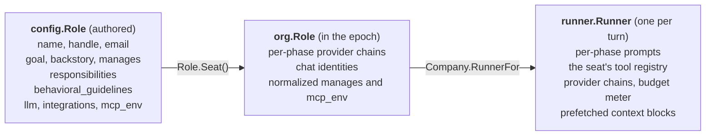
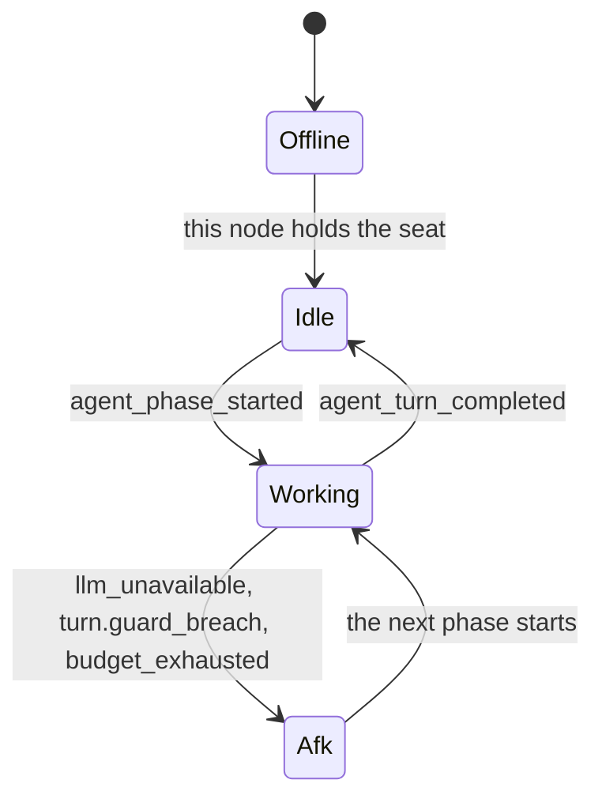
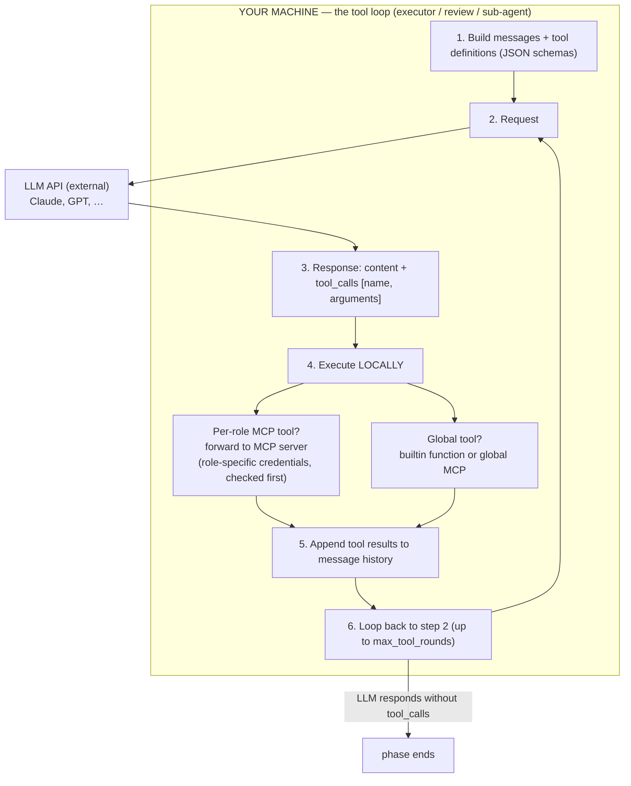
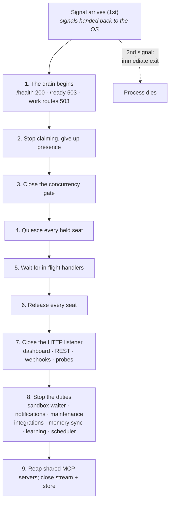

# Agent Runtime

The agent runtime (`internal/agent`, wired together by `internal/engine`) runs a seat's turns: what wakes a seat, what a turn is handed, and how the process stops without abandoning one.

> **Per-turn execution:** every agent turn runs through the two-stage **Executor and Reviewer** [Turn Engine](turn-engine.md). A seat's inbox partition reaches `engine.Dispatcher.Dispatch`, which screens it (ownership, posture, duplicates, the completion ledger), merges a coalesced conversation, restores the trigger's trace and hands one request to the turn. The turn pins the epoch, builds the seat's runner, runs the onboarding pass when one is due, and then calls `turn.Run`, which owns the rounds: the delegation-depth check, the wall-clock cap, the engine's own delivery check, the stall guard and the iteration cap. The sections below describe the surrounding lifecycle; the turn-engine doc describes what happens inside a turn.

---

## Seat Definition and the Runner

Each **agent seat** (`kind: agent`, the default) is one `roles:` entry, and there is no long-lived agent object behind it. The authored `config.Role` becomes an `org.Role` in the epoch's `Organization`, and every turn builds a fresh **runner** for that seat from the epoch it pinned. [Human seats](humans-in-the-org.md) are never run: they exist in the `Organization` and resolve through the party registry (`notify.Registry`).

**Identity is deterministic, and it is not the handle.** A seat's agent id is `org.DeriveAgentID(company name, origin handle)`: a UUIDv5 over `"<company name>:<origin handle>"` in a fixed namespace (`org.Organization.AgentIDFor` applies it to an agent seat). The **origin handle** is the handle the seat was created under, frozen on the seat's chart row by its first rename and never moved again — so the id is the same across processes, machines, restarts *and renames*, which is what lets any node address a seat another node is running and what lets a founder rename a colleague without retiring them. The seat's memory is keyed by that id or by the handle its rows were written under: `agent_diary` and `agent_onboarding_markers` rows by the agent id, `episodes` and `synthesized_skills` by the handle, and `counterparty_profiles` by the observing seat's handle. All of it survives engine restarts, and the id-keyed half survives a rename.

> **Rename caveat.** *Both* inputs are part of the derived id: changing
> a seat's handle **or the company's `name`** creates a new derived
> id and orphans the prior per-agent rows (diary, onboarding markers,
> counterparty profiles). The seat keeps working; it has simply lost
> its memory. A company rename does this to *every* seat at once, so
> settle `name` and each `handle` before the company runs. (An explicit
> `handle` on each role pins half of it; nothing pins the company name.)



For a seat with direct reports, the executor prompt includes a **team roster**: each report's name and handle with a compact profile (background, goal, responsibilities), rendered from the in-memory `Organization` so the lead can reason about who to assign work to.

---

## Agent States

The engine keeps no per-seat state machine. What a seat is doing is derived from its events by the dashboard's live projection (`internal/api/livestate`), and the states it reports are these:



- **Offline**: no node this API can see is serving the seat. The roster marks a seat idle only when this node holds its lease, so on a fleet a seat a peer is running reads as offline here; the fleet view answers who holds what.
- **Idle**: the seat is held, its mailbox is attached, and no turn is running.
- **Working**: a phase has started and the turn has not completed.
- **Afk**: an engine-detected failure stopped the turn (no model answered, a turn guard fired, or the token budget ran out). The cause is kept until the seat does real work again.

The dashboard adds one state of its own: a seat whose detached [sandbox run](code-sandbox.md) is still in flight reads as busy even though the turn that started the run has completed.

How a seat comes to be held, and what happens when it is released, is [Seat Ownership](seat-ownership.md).

---

## Agent Execution Loop

Each agent, when triggered (by event or task assignment), executes a **turn** through the two-stage [Turn Engine](turn-engine.md):

```
1. Collect context (task, knowledge, trigger event, delegation chain),
   and derive from the trigger WHO IS WAITING for this turn

2. Executor phase
   ├── Tool surface = every first-party tool except mark_onboarded,
   │     plus submit_work, activate_tool, list_mcp_server_tools
   ├── The system prompt carries a slim catalogue: builtin tool names
   │     and MCP SERVER names, never the 50-150 MCP tool schemas
   ├── To use an MCP tool: list_mcp_server_tools(server) to discover
   │     names, then activate_tool(name) to promote it onto the surface
   │     so its schema arrives on the next round. Nothing is named in
   │     advance, so nothing has to be reconciled afterwards.
   └── Ends by calling submit_work: outcome, summary, deliveries,
         checked against the engine's own record of the turn

3. Engine check (no model call)
   ├── no_action nobody asked for and nothing acted on -> the turn ends
   └── a claim the record refutes -> loop back with a correction

4. Reviewer phase
   ├── submit_review emits a decision
   └── done | self_iterate (loop back, carrying the prior-work ledger
         so the next round does only the gap) | failed

5. Publish agent_turn_completed and turn_completed; reflection consumes the latter
```

The executor and the reviewer can run on different LLM models — see the [Turn Engine](turn-engine.md#per-phase-llm-models) doc.

---

## The LLM ↔ Tool Proxy

The LLM is an external HTTP service — it cannot access local code, MCP servers, or engine internals directly. The shared tool-call loop (`internal/agent/toolloop`, driven by each phase of the [Turn Engine](turn-engine.md)) acts as a **proxy** that translates between the LLM's text-based tool calls and local execution:



Both builtin and MCP tools produce identical tool definition schemas. From the LLM's perspective, `lookup_colleague` (builtin) and an MCP server's issue-creation tool look the same: a function it can ask the engine to call.

---

## System Prompts (per phase)

Under the two-stage [Turn Engine](turn-engine.md), each phase builds its own narrow system prompt — there is no single monolithic prompt for a turn. Each builder lives in `internal/agent/prompts/`; the detail layer is in `internal/agent/prompts/sections.go`. Founder-defined role/org context (mission, vision, policies, backstory, responsibilities, behavioral guidelines, team roster) renders **directly from the in-memory `Organization` model into the executor's prompt** via the section builders — no DB seed step, no reconcile pass.

| Phase | What's in the prompt |
|---|---|
| **Executor** | Identity (role, unit, goal, manager, direct reports, team channel), company mission and vision, full policy text, role profile (backstory, responsibilities, behavioral guidelines), unit context (purpose, goals), team roster with per-member profile (leads only), the `## Human colleagues` note (only in a company with human seats), the executor's contract, [Tool Skills](tool-skills.md) **catalogue** (one-line summary per triggered skill), **slim** tool catalogue (builtin tool names + MCP server names; MCP tool names hidden behind ``list_mcp_server_tools``). Plus ``## The thread so far`` — the chat thread the turn was woken in, read at turn start and handed over rather than left for the agent to fetch (see [the thread block](#the-thread-a-turn-was-woken-in) below); it is not a learning prefetch but the trigger's own context, which is why it leads. Then the six learning prefetches, in the order they render: ``## First-turn onboarding`` (until ``mark_onboarded`` fires), ``## Personal memory`` (diary), ``## Synthesized skills you've learned``, ``## Relevant knowledge`` (a knowledge-base search built from the trigger), ``## Similar prior work`` (episodes), and ``## Known counterparty``. On rounds after the first, the user message also carries the [prior-work ledger](turn-engine.md#prior-work-ledger-across-self_iterate-rounds) as ``## Already done earlier in this turn``. |
| **Review** | One-line identity, the round's own account of what it set out to do, the outcome word (and who wrote it), the verbatim tool log, the text it produced, the decision-enum contract, and the [Tool Skills](tool-skills.md) catalogue for MCP-server-keyed skills (operator-scoped to the review phase). On rounds after the first, a `## Earlier rounds (already delivered)` section carries the [prior-work ledger](turn-engine.md#prior-work-ledger-across-self_iterate-rounds) so the duplicate-delivery rule holds turn-wide. No tool catalogue, no policies, no roster, no prefetch. |
| **Worker** (`delegate`) | The worker's persona (a `workers:` template or the parent's inline prompt), the [Tool Skills](tool-skills.md) catalogue scoped to the tools the worker was granted, the slim tool catalogue, then the mandated runtime preamble (no further delegation, no colleague contact, read-only discovery only, and end by calling `submit_result`). |

Why the split: the executor is the frame making every ownership / delegation / policy-sensitive decision AND acting on it, so it gets the whole picture — the two-prompt engine's real cost was never the tokens saved by splitting them, it was sending the identity scaffold twice and throwing away everything the planner had read. The reviewer's question is narrower: is this round's work right, given what the record says it did. Standing memory, the team's docs and the requester's traits are what the executor needed to DO the work; in front of a reviewer they compete with the evidence it is meant to judge.

### Built-in engine scaffolding

Engine guardrails (event triage, escalation judgement, tool usage, knowledge-system usage) are carried by tool descriptions (`search_knowledge`, colleague-surface tools) and by the executor and review contracts themselves, not by dedicated prompt prose. Each tool's one-line description tells the LLM when to use it; the per-phase contract tells the LLM what output shape is expected. There is no special escalation mechanism: when stuck, an agent reaches its manager with the same colleague-surface tools it uses for any other collaboration (a Slack mention, a Jira comment, `a2a_ask`); the reviewer routes a turn that has *not yet* reached anybody back through `self_iterate` so the next round makes that outreach, and ends one that already has as `done`, because the colleague's reply is what re-triggers the agent (no `escalate` tool, no `ask_colleague` decision, and no waiting state).

Tool- and MCP-server-specific guidance (when to call ``reflect_and_persist``, how to mention teammates on Jira vs Slack, when to author code via the [code sandbox](code-sandbox.md) and what the GitHub tools are for) lives in the [Tool Skills](tool-skills.md) registry — modular knowledge-base-sourced fragments (Confluence pages) where each skill carries a short **summary** (always inline in the per-phase catalogue) and a rich **body** that loads on demand via the always-on ``load_tool_skill`` builtin. The engine ships no skill prose; operators seed the skills container with ``crewlet confluence import`` and edit pages in the backend's editor thereafter.

There is no single monolithic system prompt to read: `internal/agent/prompts` builds one per phase (`BuildOnboarding`, `BuildExecutor`, `BuildReview`, `BuildSubagent`) from the same identity sections, and each phase sees only the guidance and the tool catalogue that phase is meant to act on.

### The thread a turn was woken in

A chat thread reply is usually thin — "yes", "+1", "what about the other one" — and the thread is the context. The engine used to say so in the prompt and tell the agent to go and read the thread with its chat tools. On a company whose chat tools come from a per-role MCP server that costs **three rounds** before a word is read: `list_mcp_server_tools`, then `activate_tool`, and only then the call, with the tool's schema arriving on the *next* message. An agent that skipped the trip answered the eleven words of trigger text with no idea what the thread was about.

So the engine reads it instead, at turn start, and renders it as ``## The thread so far``. Everything it needs is already on the node: the channel and the thread root are stamped on the trigger's own metadata by the chat parser, and each seat's authenticated client is held by its transport — so **the read is made as that agent**, on that bot's own token and its own channel membership. No new credential, and no new scope: [Mattermost](../integrations/mattermost.md) reads `GET /api/v4/posts/{root}/thread` on the bot token it already holds, and [Slack](../integrations/slack.md) reads `conversations.replies` on the `*:history` scopes the app manifest already requests.

What lands in the prompt:

- **Oldest first**, with the thread's root always kept — it is what the thread is about — and then the newest messages. The root keeps its place even when there is nothing to render in it: an alert app posts its payload in blocks or attachments and no text at all, a system line is channel bookkeeping, and Mattermost leaves a *deleted* root out of its answer while every reply to it stays. The block then carries one line saying the first message could not be shown, which is the honest alternative to the silent one — dropping it promotes the oldest surviving reply into the root's slot, where every bound protects it and the preamble calls it what the thread is about.
- **Bounded by whole messages, never a cut inside one**: at most 30 messages and 8000 characters, dropped oldest-first, and the block **says how many it dropped**. The root (or the line standing in for it) and the newest message survive both bounds however long they are. 8000 is one third of the conversation ledger's 24000-character budget, because both blocks are frozen into the same system prompt and re-sent on every round of every phase, and the thread must not crowd out the seat's own cross-turn history. Neither bound is configurable.
- **Senders resolved through the party registry**, so a colleague reads as `Tech Lead (lead)` rather than an opaque platform id; a stranger renders as whatever the backend volunteered and then as the raw id, and never as a blank.
- **The seat's own earlier replies marked `**you**`**, resolved by the transport from the identity it learned at connect. On Slack that takes *both* the bot user id and the app id, because a `bot_message` echo of the seat's own post carries the app id and no user id at all.
- **A thread too long to read says so, in place of the claim it would otherwise make.** Slack pages `conversations.replies` from the *oldest* end, 100 messages at a time, up to 10 pages — so a thread past ~1000 messages cannot be reached at its newest end at all. The walk keeps the root and the newest of what it did reach rather than the oldest of the thread, and the block then drops its ordinary "the newest messages are what woke you" framing for one that says it stops short and tells the seat to read the rest with its chat tools: on that path the newest message is exactly what is missing, so the ordinary sentence would be guaranteed false. Everything either end dropped is in the count. The page size is 100 rather than the 200 Slack recommends because the client reads at most 1 MiB of a response before decoding it, and 200 messages carrying blocks, attachments or unfurls exceed that — which fails the read outright rather than shortening it. Mattermost has no such bound: `GET /api/v4/posts/{root}/thread` answers the whole thread in one response.

**It is best effort, always.** A thread that could not be read — a node in maintenance mode runs no chat transport, a chat instance unreachable at boot leaves the company running without its chat surface, a seat whose token was refused has no client, a channel the bot is not in — renders a *different* sentence from a thread that was read and had nothing in it. "There is nothing earlier" says answer the trigger as it stands; "it could not be read from this node" tells the seat to go and read the thread itself, which is the one case where the old instruction was right. Neither ever fails a turn.

**It does not make the trigger thick.** `RequiresRecon` still gates the three relevance prefetches on a chat thread reply, and deliberately so: that flag describes the trigger *body*, which this block does not change, and those filters judge relevance against the trigger *text* — "+1" is exactly as useless a search query with the thread in the prompt as it was without. The flag is also stored on every past event and read by the dashboard, so flipping its meaning would rewrite what every historical turn claims about itself. The block is reported separately on `prefetch_summary` (`thread_context_hit` / `_bytes` / `_posts` / `_read` / `_stopped_short`). `_hit` and `_bytes` cannot separate the block's states on their own — every path renders non-empty prose — so `_read` says whether a backend answered at all, which is what tells a thread that was read and empty from one the seat was told to go and find, `_posts` says how much was handed over, and `_stopped_short` says the read could not reach the thread's newest message.

---

## Built-in Tools

The engine ships these tools (`internal/agent/builtin`, registered in the epoch's `tools.Registry` with the origin `builtin`). A tool whose dependency is absent is **omitted** rather than registered and broken, so a company without a store, a knowledge backend or a sandbox gets exactly the tools it can serve, and the node logs the list it registered (`builtin_tools_registered`).

| Tool | Registered when | Purpose |
|------|-----------------|---------|
| `lookup_colleague` | always | Resolve any colleague identifier (handle, role name, a human's contact ID) to one seat, case-insensitively, with partial and fuzzy fallbacks; a handle a seat **used to** answer to resolves too, ranked below every live match and above every approximate one; returns the candidate list when more than one seat matches |
| `a2a_ask` | the node has a stream and a coordination store | Ask one AI colleague one question. The colleague is woken on its own inbox and answers in its own turn, so the call returns as soon as the question is sent |
| `use_skill` | a learning store | Load one of the seat's own [synthesized skills](agent-learning.md#5-synthesizer-skill-induction) on demand |
| `refine_skill` | a learning store | Replace a synthesized skill's body with a corrected procedure; the previous version is kept |
| `query_episodes` | a learning store | Recall the seat's own past turns: by meaning (`query`), by conversation, or most recent first |
| `refresh_memory` | a learning store | Re-run the personal-memory filter mid-turn with a context hint |
| `reflect_and_persist` | a learning store | Keep a durable fact in the seat's private diary (`kind`: `long`, the default, or `short`) |
| `mark_onboarded` | a learning store | Stamp the seat's onboarding marker after reading the relevant knowledge-base pages (offered to the onboarding pass, not to the executor) |
| `run_sandbox` | `providers.sandbox` is configured | Hand a code task to a coding agent in a [sandbox](code-sandbox.md); the executor suspends until the run reports |
| `load_tool_skill` | the company publishes [Tool Skills](tool-skills.md) | Load the full body of a Tool Skill by exact key (the catalogue carries only the summary). Required skills (the default; `required: false` opts out) must be loaded this way before the tools they cover can be called, and the engine rejects earlier calls with a "load this skill first" error |
| `search_knowledge` | a knowledge backend | Search the company knowledge base on a query the executor writes itself, over the same seam as the turn-start `## Relevant knowledge` prefetch. It is what a seat woken by a bare pointer uses once it knows what the task actually needs: the prefetch's own search is gated off on such a trigger, because a query built from "PR #42 got a comment" matches the wrong pages or none |
| `delegate` | per turn, executor only | Hand narrowly-scoped work to one or more short-lived [workers](turn-engine.md#workers), optionally as a dependency graph. Built per turn rather than registered once: it carries that turn's grant (the parent's own live tool set, minus the control tools and anything that writes to a shared surface) and that seat's visible worker templates, so it cannot be a shared registry entry. Absent when the seat's remaining token allowance cannot be read, because delegating with no readable ceiling is delegating with no ceiling |

The phase tools are not in the registry: the runner adds `submit_work`, `activate_tool` and `list_mcp_server_tools` to the executor's surface, `submit_review` to the reviewer's, and `submit_result` plus a discovery pair of its own to a worker's.

Colleague outreach happens through the upstream MCP tools directly (on the common stack: a chat server's post-message tool, the tracker's comment and update tools, the wiki's comment tool, the code host's review tools; these are examples, not engine-known names). The engine ships no chat or tracker wrappers of its own; `a2a_ask` is the one colleague tool it registers, and it is narrowly scoped to tight-loop, mechanical sync between agents. Use whichever chat, issue-tracker, wiki or code-host tools your MCP servers expose for any collaboration a human teammate would reasonably want to see. The engine prompts name none of these: they describe the *capability* and the LLM picks the tool from its catalogue (see [Tool Capabilities](tool-capabilities.md)). See [Turn Engine: Colleague-surface tools](turn-engine.md#colleague-surface-tools) for when to use each.

Decisions use the agent's Slack MCP tools and team channel — see [Decision Framework](decision-framework.md).

### MCP Tools

MCP tools (Jira, Slack, GitHub, and so on) are discovered from the configured MCP servers and registered alongside builtins: a shared server's tools when an epoch is applied, and a `shared: false` server's tools into the seat's own registry when the node acquires that seat's lease. The executor does **not** see every MCP tool name in its system prompt (a role with 50–150 MCP tools would push 15–25 KB of catalogue into every prompt); instead the prompt lists *MCP server names* and the LLM walks the discover-then-activate flow:

1. `list_mcp_server_tools(server)` — returns the `name: description` listing for one server.
2. `activate_tool(name)`: promotes a tool from the catalogue onto the phase's active tool list so the LLM can call it on the next round.

Both meta-tools are available to the executor and to the onboarding pass. A worker cannot use the parent's pair (`activate_tool` and `list_mcp_server_tools` are on the worker denylist, because they would activate tools onto the parent's surface); it gets a pair of its own, bound to its filtered grant, so it can discover and activate only read-only tools the parent could already reach.

Roles with GitHub credentials in `mcp_env.github` get a per-role instance of the [remote GitHub MCP server](https://github.com/github/github-mcp-server) (declared as a `shared: false` `http` entry in `mcp_servers`), giving them the full GitHub toolset for reading/reviewing/tracking code (issues, PRs, repos, code search, actions); code authoring goes through the [code sandbox](code-sandbox.md). See [GitHub Integration](../integrations/github.md).

---

## Agent Registry

There is no pool of agent instances. Three structures answer the questions a pool would:

- **Which seats exist**: the epoch's `Organization`. `Company.Seats()` lists its agent seats for placement; human seats are left out.
- **Which seats this node runs**: the seat host (`internal/seat`), from the leases it holds. A node claims its fair share, attaches each seat's mailbox last, and releases a seat whose role an apply removed. See [Seat Ownership](seat-ownership.md).
- **Who an event is for**: the party registry (`notify.Registry`), rebuilt on every apply, which resolves a handle, a role name, a derived agent id, an email or an external ID on any connected surface. Resolution is derived from the organization, so the node that consumes a delivery can route to a seat it is not running.

A failure is scoped to a turn, not to an instance: a phase that breaks fails that turn (see [Turn Engine](turn-engine.md)), and a seat whose acquire hook fails is released and not re-attempted on that node for one lease TTL, which gives a peer a clear run at it.

Since each agent is a unique individual, there is no load-balancing or role-based routing. Task assignment is a team lead decision, not an engine algorithm.

---

## Execution Model

Agents are **callback-driven**. When a node acquires a seat it attaches a handler to the seat's durable subscription (`agent-{seat-id}`) on its inbox topic (`crewlet.agent.{seat-id}.inbox`), and the queue invokes that handler as messages arrive. There is no per-agent loop to run.

Inbox delivery is **batched per conversation** (see [Event System — Inbox batching](event-system.md#inbox-batching--coalescing)): events that queued up while the agent was busy — or within the configured linger window — are drained together and partitioned by partition key, so ten comments on one Jira issue or Slack thread reach the handler as ONE batch and trigger ONE digest turn instead of ten. Every partition — one event or several — reaches the same dispatcher and runs one [Turn Engine](turn-engine.md) turn; what differs is only the ask it is handed. A single-event partition is handed its own event, and a multi-event one is merged into a single coalesced notification first, so the third-party app's scaffolding renders once and the seat is told to treat the thread as one piece of work.

### Concurrency

The engine runs **genuinely parallel** work within a single process:

- Each delivery is handled in its own goroutine, so seats make progress independently rather than taking turns
- Multiple agents can be in the `Working` state simultaneously
- A **per-node concurrency gate** limits how many agent turns run at once: Tier A's `node.max_concurrent` (default 32)
- A turn takes a slot after the ownership check and before its first model round-trip, and releases it when the turn ends

**What the gate is for, and what already bounds itself.** A seat's mailbox is a durable subscription whose handler runs one batch at a time, so a *seat* is already serial — it never runs two turns at once. What is not bounded is how many seats run at once: that is [placement](seat-ownership.md)'s arithmetic over the company's seat count and the live node count, not a statement about the machine this process is on. A node handed forty seats would open forty simultaneous model round-trips and their tool loops. `max_concurrent` is the knob that says how many the host can actually take.

**A turn past the ceiling waits, in this process.** It is not handed back for the broker to redeliver on the broker's own schedule — for a chat message someone is waiting on, that turns a busy moment into a visible stall. The waiting turn starts the instant a slot frees. The one exception is a drain, below.

**What it does not gate, and why that is not an oversight.** Post-turn [reflection](agent-learning.md) does not take a slot. It does not need one: it consumes `turn_completed` through a single durable subscription whose handler runs one delivery at a time, so a node runs at most one reflection pass at a time however many turns finish at once. Making it compete for turn slots instead would let a backlog of completed turns starve live seats — a company under load would stop answering people in order to finish learning from what it already answered — and the reverse, learning starved indefinitely by traffic, is what the separate consumer group exists to prevent. Auxiliary spend is bounded where it belongs, by the [token budget](../guides/deployment.md), and every learning worker resolves its model through the metered registry so that counter sees it.

**Sizing it.** It is per *node*, so a fleet's ceiling is N × the value — see [Scaling Out](scaling.md#what-stays-per-process-deliberately). The default of 32 is above the seat count of a single-node company (the example company runs a handful of seats; a large one runs tens) so it changes nothing for a company running today, while still bounding a node that has been handed far more seats than its host can serve. Raise it on a bigger host; lower it on a satellite running one agent. There is no "unbounded" — `0` means "take the default", and effectively-no-limit is a large number you can see in your config. Note this is a *different* knob from a cli-agent provider's own `max_concurrent`, which caps that provider's subprocesses; see [Subscription LLM backends](subscription-llm-backends.md).

That is real parallelism rather than one cooperative loop, which is the
single biggest behavioural difference from the engine's first
implementation: anything shared between turns is guarded rather than
safe-by-construction, and the whole suite runs under the race detector for
exactly that reason.

### Graceful shutdown

SIGINT / SIGTERM trigger a **drain with the probes up**, designed so a restart picks up cleanly without a half-finished turn: the node stops taking new work, lets the turns already running finish, hands its seats back, and only then closes its HTTP listener and its backends. The engine owns the process signals exclusively. Nothing else in the process may install a handler, the embedded API server included.

**The listener stays up for the whole drain, and the door is a refusal rather than a closed port.** An orchestrator watches a node precisely while it drains, so `GET /health` keeps answering `200` with `status: "shutting_down"`, and `GET /ready` answers `503` with `reason: "draining"`. Traffic moves elsewhere, and nothing kills the node in the middle of the turns the drain exists to finish. What the drain must not do is keep making work for itself, so from its first moment every route that would start new work answers `503` with `{"error": "draining"}` and a `Retry-After`: the webhook edge, the `/config`, `/secrets` and `/setup` writes, the operator's writes, `POST /operator/mcp` and backups. Reads keep being served, the dashboard included, and so do the sandbox bridge (`/mcp/{token}`) and the telemetry edge (`/otlp/{token}`), because those carry the tool calls and spans of coding runs that started before the drain and would only be broken by a refusal. See [During a drain](../reference/api-endpoints.md#during-a-drain) for the exact rule.



1. **The drain begins.** The engine reports that it is shutting down from this
   moment, before anything that can block: the HTTP surface starts refusing
   new work and both probes report the drain. The watchdog is disarmed, since
   the drain and the teardown legitimately block for longer than it would
   tolerate; no further config revision is applied, because everything one
   would build is about to be torn down; and the stop is announced in the
   audit log (`org_stopped`).
2. **Stop claiming and give up presence**, so peers stop reserving a share of
   the company for a node that will never claim again.
3. **Close the concurrency gate.** Turns still parked at it are released at
   once and their deliveries deferred (left unacked, so a peer picks them up
   rather than waiting out a redelivery timer) instead of starting fresh LLM
   rounds mid-drain. The gate closes *before* the mailboxes quiesce:
   quiescing stops new deliveries, but a turn already delivered and parked
   behind a slot is past that point.
4. **Quiesce every held seat.** The node stops taking new work while staying
   attached. This is what makes the wait below terminate: without it the
   mailbox keeps feeding this node work for as long as its peers keep
   publishing, and "wait until nothing is running" never comes true.
5. **Wait for in-flight handlers**, indefinitely: running turns finish their
   rounds until the count hits 0, with `drain_in_progress` logging the
   in-flight count every 10 s. A turn parked on a
   [detached coding run](code-sandbox.md) is not one of them. It suspended
   when the run detached and its trigger is already recorded as worked, which
   is exactly why coding work is detached: a drain that waited for a real
   coding job would wait for its whole runtime. The run's record lives in the
   fleet's coordination store rather than in this node, so whichever node
   holds the seat next picks it up rather than it being lost with this
   process.
6. **Release every seat**, each lease given back with its mailbox intact and
   on a bounded budget of one heartbeat interval, so peers can claim them at
   once rather than waiting out the lease TTL. The drain then logs
   `drain_complete`.
7. **Close the HTTP listener**, and not before: until now the probes are what
   the orchestrator reads, and they read the stream and the coordination
   store the next steps close. Requests still running get a five-second grace
   and are then cut, the live feed stops, and every dashboard socket is
   closed (`api_stopped`).
8. **Stop the duties**: the sandbox waiter first (its keepalive is what stops
   a running box being reaped while turns are still finishing), then the
   notification transports, the maintenance duties, the integration reconcile
   loop, memory sync, the learning passes, the cron scheduler and the
   credential cooldown refresh.
9. **Close the backends**: the shared MCP servers are reaped, then the stream
   connection and the store file are closed (`engine_stopped`).

**Let LLMs finish their rounds — but only the running ones.** The drain distinguishes two kinds of in-flight turn. Turns already past the concurrency gate (model rounds under way) run to completion: they may have fired side effects, and abandoning that work buys a faster deploy by throwing away what was nearly done. Turns delivered before the quiesce but still *waiting* for a slot abort immediately — they have called no model and fired nothing, so their trigger is simply deferred. Without this split, a backlog parked behind `max_concurrent` would run full multi-minute executor → reviewer turns one after another during a shutdown that waits for them indefinitely.

**No engine-level timeout on the drain.** Step 5 waits as long as in-flight turns need, and the listener stays up for all of it. We don't try to second-guess "too long", because the host already provides that cutoff:

- **Interactive:** a second Ctrl+C tells us you're done waiting.
- **Kubernetes:** `terminationGracePeriodSeconds` (default 30 s) — after which the kubelet sends SIGKILL.
- **systemd:** `TimeoutStopSec` (default 90 s) — same SIGKILL fallback.

Embedding our own grace window would duplicate that decision in two places and inevitably disagree. Size the orchestrator's grace period to cover your expected turn length (a multi-tool executor → reviewer turn can comfortably take 2–5 minutes).

**Force stop (second signal).** The first signal starts the drain and
*hands the signals back to the operating system*, so a second SIGINT or
SIGTERM does what it always does: the process dies immediately, with no
cleanup. That handover is what makes the unbounded drain above safe to
offer — without it the engine would still be the installed handler, every
further press would be swallowed, and an operator watching a drain from
the terminal they started it in would have no way to abort it short of
SIGKILL from somewhere else.

A turn killed that way leaves its trigger **unacknowledged** rather than
NAK'd, because nothing gets to run. The broker redelivers it once its ack
window elapses, so the work is not lost — it is just slower to come back
than after a graceful drain, where each finished turn acks normally and
each turn still parked at the concurrency gate is deferred, so a peer takes
it straight over. A redelivered turn runs from scratch, and side effects the
killed turn already fired (a chat post, a work-item comment) may
duplicate — the [completion ledger](seat-ownership.md#the-completion-ledger)
covers a turn that *finished*, and this one did not. That is the trade-off
you opted into by sending the second signal.

**Watching the drain.** On the dashboard and over the API, for as long as it lasts: the listener closes only once the drain has completed, so the dashboard shows the node as draining with its in-flight count, `GET /health` reports it, and `GET /ready` names the reason. The log says the same and outlives the process: `engine_draining` on the first signal, with what is being waited for and how to stop waiting, then `drain_in_progress` with the in-flight count every 10 seconds, then `drain_complete`, `api_stopped` and `engine_stopped`. Set [`logging.file`](../guides/deployment.md#the-log-file) if you want that record to survive the terminal it was watched in: the file is closed last of everything, after the drain and after the trace flush, so `engine_stopped` is in it.

A node's drain is reported **by that node**: its own probes, its own dashboard and its own log. It gives up its presence at step 2, so a peer's **Fleet** screen stops listing it rather than showing it draining. On a split deployment a `-roles ingress` node drains the same way; it holds no seats and runs no turns, so its drain is short.

The drain is available programmatically up to the moment the listener closes:

- `Engine.ShuttingDown`: `true` from the first moment of the drain and never `false` again. The HTTP surface refuses work on it and both probes report it.
- `GET /health`: `200` throughout, with `status: "shutting_down"`, `shutting_down: true` and the in-flight count as `in_flight`.
- `GET /ready`: `503` throughout, with `draining: true` and `reason: "draining"`.

Per-agent visibility is finer-grained: each working agent's row carries `current_phase` (`onboarding`, `execute`, `review`, or `subagent` for a worker) plus the round number, derived from the `agent_phase_started` events the runner publishes at the top of each phase.
