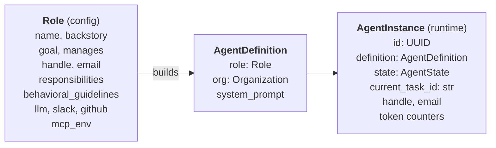
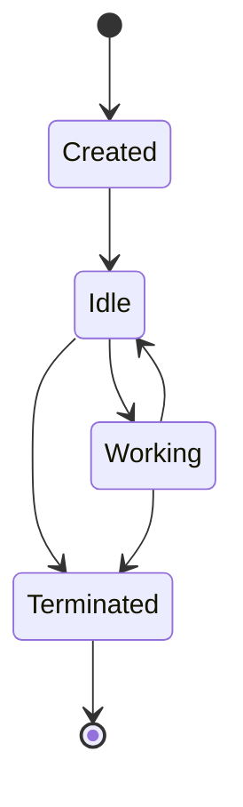
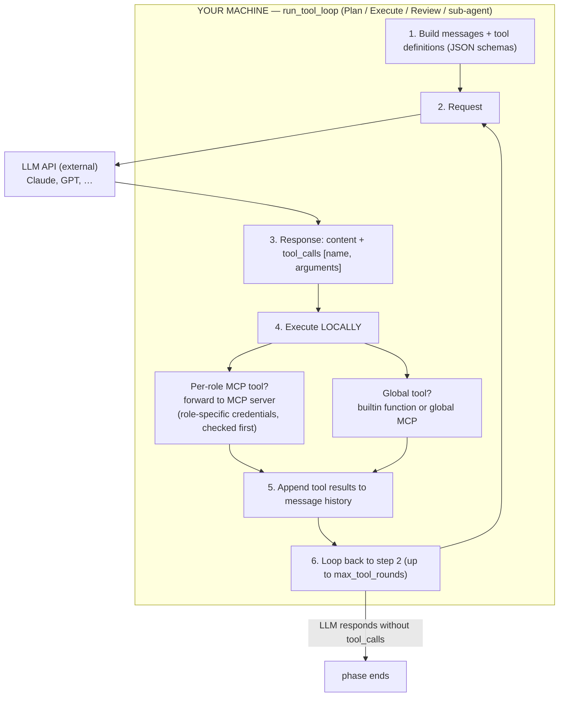
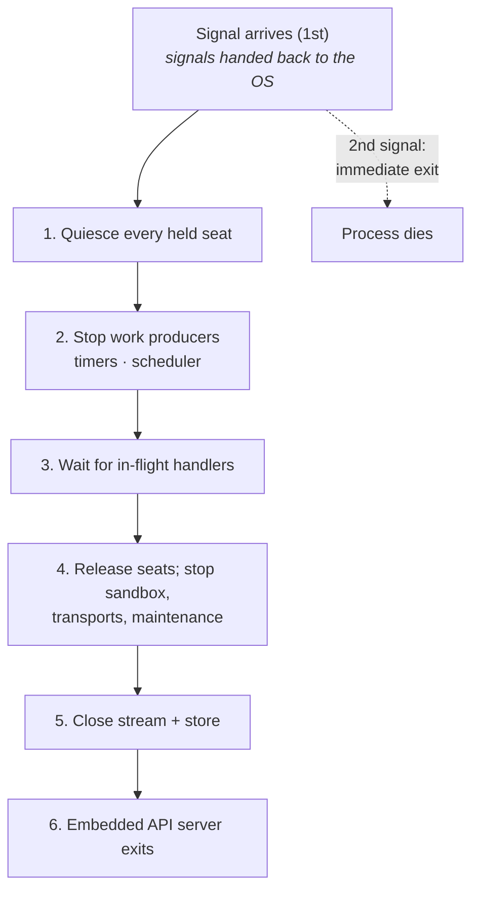

# Agent Runtime

The agent runtime (`internal/agent`) manages agent lifecycle, execution, and memory.

> **Per-turn execution:** every agent turn runs through the three-phase **Plan → Execute → Review** [Turn Engine](turn-engine.md). Every agent turn described on this page dispatches into `turn.Engine.Run`, which owns concurrency, OTel context restoration, phase dispatch with the iteration cap and stall detection, ephemeral sub-agent spawning, and the runtime invariants (delegation-depth cap, sub-agent tool allowlist, budget cascade). The sections below describe the surrounding lifecycle; the turn-engine doc describes what happens inside a turn.

---

## Agent Definition vs Agent Instance

Each **agent seat** (`Role.kind == "agent"`) maps 1:1 to an AgentDefinition and a single AgentInstance. [Human seats](humans-in-the-org.md) are never spawned — they exist only in the `Organization` and resolve through the party-level `HandleRegistry` API.

**Identity is deterministic.** `AgentInstance.id` is computed as
`uuid5(AGENT_ID_NAMESPACE, f"{org.name}:{handle}")` (see
`org.Organization.AgentIDFor`).  The same role in the same org
always lands on the same `UUID` across processes, machines, and
restarts.  Anything keyed by `agent.id` -- ``agent_diary`` rows,
``agent_onboarding_markers`` rows, ``counterparty_profiles`` keyed
by ``observer_handle`` -- therefore survives engine restarts.

> **Rename caveat.** *Both* inputs are part of the derived id: changing
> a role's handle **or the organisation's `name`** creates a new derived
> id and orphans the prior per-agent rows (diary, onboarding markers,
> counterparty profiles).  The seat keeps working — it has simply lost
> its memory.  A company rename does this to *every* seat at once, so
> settle `name` and each `handle` before the company runs.  (An explicit
> `handle` on each role pins half of it; nothing pins the org name.)



For team lead agents, the system prompt includes a **team roster** — a summary of each direct report's name and handle. Detailed per-member profiles (skills, backstory, tools) render directly into the lead's Plan-phase prompt from the in-memory `Organization` model when the lead needs to reason about assignment.

---

## Agent States



- **Created** — instantiated but not yet registered with the engine
- **Idle** — listening for events, available for task assignment
- **Working** — actively executing a task (LLM calls in progress)
- **Terminated** — removed from the company

---

## Agent Execution Loop

Each agent, when triggered (by event or task assignment), executes a **turn** through the three-phase [Turn Engine](turn-engine.md):

```
1. Collect context (task, knowledge, trigger event, delegation chain)

2. Plan phase
   ├── Planner LLM sees a slim catalogue (builtin tool names + MCP
   │     server names) in its system prompt
   ├── Meta-tools: submit_plan, activate_tool, list_mcp_server_tools,
   │     load_tool_skill
   ├── To use an MCP tool: list_mcp_server_tools(server) to discover
   │     names, then activate_tool(name) to promote into tools=[...].
   │     Reserve activation for read-only recon (Slack thread reads,
   │     Jira fetches, agent lookup); action / write tools should not
   │     be activated here -- name them in tools_needed for Execute.
   └── Emits a Plan: reasoning, steps, tools needed, success criteria

3. Execute phase
   ├── Tool surface = plan.tools_needed ∪ executor_always_on_tools
   │     ∪ {activate_tool, list_mcp_server_tools}
   ├── Same slim catalogue Plan sees, same discover-then-activate flow
   │     -- the executor can recover when the planner missed a tool
   │     by calling list_mcp_server_tools + activate_tool mid-run.
   │     Successful activations fire phase.tool_activated events.
   └── Tool-call loop drives the LLM through the plan

4. Review phase
   ├── submit_review emits a ReviewOutcome
   └── done | self_iterate (loop back to Plan, carrying the
         prior-work ledger so the next pass plans only the gap)

5. Emit events, update memory, return to Idle
```

The Plan and Execute phases can run on different LLM models — see the [Turn Engine](turn-engine.md#per-phase-llm-models) doc.

---

## The LLM ↔ Tool Proxy

The LLM is an external HTTP service — it cannot access local code, MCP servers, or engine internals directly. The shared tool-call loop (`internal/agent/toolloop`, driven by each phase of the [Turn Engine](turn-engine.md)) acts as a **proxy** that translates between the LLM's text-based tool calls and local execution:



Both builtin and MCP tools produce identical tool definition schemas. From the LLM's perspective, `lookup_colleague` (builtin) and `jira_create_issue` (MCP) look the same — a function it can request the engine to call.

---

## System Prompts (per phase)

Under the three-phase [Turn Engine](turn-engine.md), each phase builds its own narrow system prompt — there is no single monolithic prompt for a turn. Each builder lives in `internal/agent/prompts/`; the detail layer is in `internal/agent/prompts/sections.go`. Founder-defined role/org context (mission, vision, policies, backstory, responsibilities, behavioral guidelines, team roster) renders **directly from the in-memory `Organization` model into the Plan prompt** via the section builders in `internal/agent` — no DB seed step, no reconcile pass.

| Phase | What's in the prompt |
|---|---|
| **Plan** | Identity (role, unit, goal, manager, direct reports, Slack channel), full policy text, role profile (backstory + responsibilities + behavioral guidelines), unit context (purpose + goals), team roster with per-member profile (leads only), compact plan-phase contract, [Tool Skills](tool-skills.md) **catalogue** (one-line summary per triggered skill), **slim** tool catalogue (builtin tool names + MCP server names; MCP tool names hidden behind ``list_mcp_server_tools``). Plus the five learning prefetches: ``## Similar prior work`` (episodes), ``## Personal memory`` (diary), ``## Synthesized skills you've learned``, ``## Relevant knowledge`` (live knowledge-base search — the aux LLM generates a plain-text query from the trigger, run against Confluence or Plane), ``## First-turn onboarding`` (until ``mark_onboarded`` fires). On iterations after the first, the user message also carries the [prior-work ledger](turn-engine.md#prior-work-ledger-across-self_iterate-rounds) as ``## Already done earlier in this turn``. |
| **Execute** | One-line identity, plan summary, execute contract (which now describes the discover-then-activate flow), [Tool Skills](tool-skills.md) catalogue scoped to ``plan.tools_needed``, optional counterparty profile block, optional ``## Relevant knowledge`` block (the [post-Plan re-fetch](agent-learning.md#post-plan-re-fetch-thin-triggers) — present only on thin-trigger turns where the Plan-phase prefetch was gated off), and the same slim tool catalogue Plan carries so the executor knows what discovery surface is available. Skill bodies arrive on demand via the always-on ``load_tool_skill`` builtin. Its user message carries the same ``## Already done earlier in this turn`` [ledger](turn-engine.md#prior-work-ledger-across-self_iterate-rounds) Plan gets — Execute is what actually fires side effects. No policies, no roster. |
| **Review** | One-line identity, plan summary + Plan tool log + Execute tool log, decision-enum contract, [Tool Skills](tool-skills.md) catalogue for MCP-server-keyed skills (operator-scoped to the Review phase). Both phase tool logs render as separate sections (`## What Plan did` / `## What Execute did`) so the reviewer can tell which phase delivered each side effect — without the Plan log, a side effect fired during in-Plan recon looks like missing delivery and the reviewer self-iterates a turn that already shipped. On iterations after the first, a `## Earlier iterations (already delivered)` section carries the [prior-work ledger](turn-engine.md#prior-work-ledger-across-self_iterate-rounds) so the duplicate-delivery rule holds turn-wide. No tool catalogue, no policies, no roster. |
| **Sub-agent** | Parent-provided task prompt, [Tool Skills](tool-skills.md) catalogue scoped to the parent-passed tool allowlist, then the mandated runtime preamble (no further sub-agents, no colleague contact, concise final answer). |

Why the split: the planner is the only phase making ownership / delegation / policy-sensitive decisions, so it gets the richest context. Execute and Review run against the plan's explicit `success_criteria` — they don't need to re-derive those from policies or backstory.

### Built-in engine scaffolding

Engine guardrails ("event triage framework", "escalation judgement", "tool usage instructions", "knowledge-system usage") are carried by tool descriptions (`confluence_search`, colleague-surface tools) and by the plan/review contracts themselves — not by dedicated prompt prose. Each tool's one-line description tells the LLM when to use it; the per-phase contract tells the LLM what output shape is expected. There is no special escalation mechanism — when stuck, an agent reaches its manager with the same colleague-surface tools it uses for any other collaboration (a Slack mention, a Jira comment, `a2a_ask`); Review routes a blocked turn back through `self_iterate` so Plan adds that outreach step (no `escalate` tool, and no `ask_colleague` decision).

Tool- and MCP-server-specific guidance (when to call ``reflect_and_persist``, how to mention teammates on Jira vs Slack, when to author code via the [code sandbox](code-sandbox.md) and what the GitHub tools are for) lives in the [Tool Skills](tool-skills.md) registry — modular knowledge-base-sourced fragments (Confluence or Plane pages) where each skill carries a short **summary** (always inline in the per-phase catalogue) and a rich **body** that loads on demand via the always-on ``load_tool_skill`` builtin. The engine ships no skill prose; operators seed the skills container with ``crewlet confluence import`` / ``crewlet plane import`` and edit pages in the backend's editor thereafter.

There is no single monolithic system prompt to read: `internal/agent/prompts` builds one PER PHASE (`BuildOnboarding`, `BuildPlan`, `BuildExecute`, `BuildReview`) from the same identity sections, and each phase sees only the guidance and the tool catalogue that phase is meant to act on.

---

## Built-in Tools

Every agent has access to these built-in tools (registered in the `ToolRegistry`):

| Tool | Purpose |
|------|---------|
| `lookup_colleague` | Resolve any agent identifier (handle, Slack user, Jira ID, etc.) — case-insensitive with substring / fuzzy fallback; returns a candidate list when ambiguous |
| `use_skill` | Load one of the agent's own [synthesized skills](agent-learning.md#5-skillsynthesizer--skill-induction) on demand |
| `load_tool_skill` | Load the full body of a [Tool Skill](tool-skills.md) by exact key (the catalogue carries only the summary). Required skills (the default; `required: false` opts out) must be loaded this way before the tools they cover can be called — the engine rejects earlier calls with a "load this skill first" error |
| `refine_skill` | Patch a synthesized skill (append observation, replace body) |
| `query_episodes` | Search the agent's own past turns by similarity |
| `reflect_and_persist` | Capture a durable fact in the agent's private diary (LONG / SHORT) |
| `refresh_memory` | Re-run the personal-memory filter mid-turn with a context hint |
| `mark_onboarded` | Stamp the agent's onboarding marker after reading the relevant knowledge-base pages |
| `spawn_subagent` | Run an ephemeral bespoke sub-agent with a parent-chosen tool allowlist. See [Turn Engine — Sub-agent phase](turn-engine.md) |

Colleague outreach happens through the upstream MCP tools directly (on the common stack: `slack_conversations_postMessage`, `jira_add_comment`, `jira_update_issue`, `confluence_add_footer_comment`, `request_copilot_review` — these are *examples*, not engine-known names) — there are no thin engine-side wrappers (`slack_message`, `jira_comment`, etc.); `register_colleague_tools` registers only `a2a_ask`, the private agent-to-agent bus. Use whichever chat / issue-tracker / wiki / code-host tools your MCP servers expose for any collaboration a human teammate would reasonably want to see; `a2a_ask` is narrowly scoped to tight-loop / mechanical sync between agents. The engine prompts name none of these — they describe the *capability* and the LLM picks the tool from its catalogue (see [Tool Capabilities](tool-capabilities.md)). See [Turn Engine — Colleague-surface tools](turn-engine.md#colleague-surface-tools) for when to use each.

Decisions use the agent's Slack MCP tools and team channel — see [Decision Framework](decision-framework.md).

### MCP Tools

MCP tools (Jira, Slack, GitHub, etc.) are dynamically discovered from configured MCP servers at engine boot and registered alongside builtins. Plan and Execute do **not** see every MCP tool name in their system prompts (a role with 50–150 MCP tools would push 15–25 KB of catalogue into every prompt); instead the prompt lists *MCP server names* and the LLM walks the discover-then-activate flow:

1. `list_mcp_server_tools(server)` — returns the `name: description` listing for one server.
2. `activate_tool(name)` — promotes a tool from the catalogue into `tools=[...]` so the LLM can call it on the next round.

Both meta-tools are available in Plan and Execute. Sub-agents have a fixed parent-chosen surface and cannot discover or activate tools (`activate_tool` / `list_mcp_server_tools` are on the sub-agent denylist).

Roles with GitHub credentials in `mcp_env.github` get a per-role instance of the [remote GitHub MCP server](https://github.com/github/github-mcp-server) (declared as a `shared: false` `http` entry in `mcp_servers`), giving them the full GitHub toolset for reading/reviewing/tracking code (issues, PRs, repos, code search, actions); code authoring goes through the [code sandbox](code-sandbox.md). See [GitHub Integration](../integrations/github.md).

---

## Agent Registry

The `AgentPool` serves as a registry of all agent instances:

- Spawns one instance per agent seat (1:1 mapping; human seats are skipped)
- Looks up agents by ID, email, or handle (for webhook routing)
- Handles agent failures (restart with fresh instance, same identity)
- Supports dynamic changes (add/remove agents at runtime via org hot-reload)

Since each agent is a unique individual, there is no load-balancing or role-based routing. Task assignment is a team lead decision, not an engine algorithm.

---

## Execution Model

Agents are **callback-driven** — the Engine subscribes a handler per agent on the EventQueue. When messages arrive on an agent's inbox topic (`crewlet.agent.{handle}.inbox`), the queue invokes the handler. No dedicated loop or polling.

Inbox delivery is **batched per conversation** (see [Event System — Inbox batching](event-system.md#inbox-batching--coalescing)): events that queued up while the agent was busy — or within the configured linger window — are drained together and partitioned by conversation key, so ten comments on one Jira issue or Slack thread reach the handler as ONE batch and trigger ONE digest turn instead of ten. The handler dispatches single-event partitions by event type — task assignments trigger a [Turn Engine](turn-engine.md) turn, A2A requests and notifications have their own handlers — and merges multi-event partitions into a single coalesced notification turn.

### Concurrency

The engine runs **genuinely parallel** work within a single process:

- Each delivery is handled in its own goroutine, so seats make progress independently rather than taking turns
- Multiple agents can be in the `Working` state simultaneously
- A concurrency gate limits how many agent turns run at once, with optional per-role limits
- A turn takes a slot before its LLM loop and releases it when done

That is real parallelism rather than one cooperative loop, which is the
single biggest behavioural difference from the engine's first
implementation: anything shared between turns is guarded rather than
safe-by-construction, and the whole suite runs under the race detector for
exactly that reason.

### Graceful shutdown

SIGINT / SIGTERM trigger a **quiesce-then-drain** shutdown, designed so a restart picks up cleanly without a half-finished turn. The engine owns the process signals exclusively — nothing else in the process may install a handler — and the embedded API server is *not* one of the things holding one. If it were, it would shut the dashboard down on the first Ctrl+C, exactly when an operator wants it alive to watch the drain converge.



1. **Quiesce every held seat** — the node stops taking new work while staying
   attached. This is what makes the wait below terminate: without it the
   mailbox keeps feeding this node work for as long as its peers keep
   publishing, and "wait until nothing is running" never comes true.
   Quiesce is also the *reversible* verb, so a drain that turns out to be a
   shed can be undone.
2. **Stop work producers** — deadline timers and the cron scheduler. Turns
   still parked at the concurrency gate are NAK'd back to the broker
   (redelivered promptly) instead of starting fresh LLM rounds mid-drain.
3. **Wait for in-flight handlers** — indefinitely; running turns finish
   their rounds until the count hits 0, with `drain_in_progress` logging the
   in-flight count every 10 s.
4. **Release the seats**, then stop the sandbox waiter, the notification
   transports and the maintenance duties — the waiter last of the three to
   start stopping, because its keepalive is what stops a running box being
   reaped while turns are still finishing.
5. **Close the backends** — the stream connection and the store file.
6. **API server exits** — the dashboard is served through the whole drain,
   and is brought down only after the engine has fully stopped.

**Let LLMs finish their rounds — but only the running ones.** The drain distinguishes two kinds of in-flight turn. Turns already past the concurrency gate (LLM rounds under way) run to completion. Turns that were delivered before the quiesce but are still *waiting* for a slot abort immediately — they haven't called an LLM or fired a side effect yet, so the NAK'd trigger simply redelivers. Without this split, a backlog parked behind `max_concurrent` would run full multi-minute Plan → Execute → Review turns one after another during shutdown.

**No engine-level timeout on the drain.** Step 3 waits as long as in-flight turns need. We don't try to second-guess "too long" — the host already provides that cutoff:

- **Interactive:** a second Ctrl+C tells us you're done waiting.
- **Kubernetes:** `terminationGracePeriodSeconds` (default 30 s) — after which the kubelet sends SIGKILL.
- **systemd:** `TimeoutStopSec` (default 90 s) — same SIGKILL fallback.

Embedding our own grace window would duplicate that decision in two places and inevitably disagree. Size the orchestrator's grace period to cover your expected turn length (a multi-tool Plan → Execute → Review can comfortably take 2–5 minutes).

**Force stop (second signal).** The first signal starts the drain and
*hands the signals back to the operating system*, so a second SIGINT or
SIGTERM does what it always does: the process dies immediately, with no
cleanup. That handover is what makes the unbounded drain above safe to
offer — without it the engine would still be the installed handler, every
further press would be swallowed, and an operator watching a drain from
the terminal they started it in would have no way to abort it short of
SIGKILL from somewhere else.

A turn killed that way leaves its trigger **unacknowledged** rather than
NAK'd, because nothing gets to run. The broker redelivers it once its ack
window elapses, so the work is not lost — it is just slower to come back
than after a graceful drain, where each finished turn acks normally and
each turn still queued behind the concurrency gate is NAK'd for prompt
redelivery. A redelivered turn runs from scratch, and side effects the
killed turn already fired (a chat post, a work-item comment) may
duplicate — the [completion ledger](seat-ownership.md#the-completion-ledger)
covers a turn that *finished*, and this one did not. That is the trade-off
you opted into by sending the second signal.

**Watching the drain.** The dashboard stays live through the entire drain (the embedded API server is stopped only after `stop()` completes). Its footer pill shows the engine's in-flight handler count whenever it's non-zero or the engine has flipped to "shutting down" — turns red during the drain so operators can watch it converge to 0. The count is also available programmatically:

- the engine's in-flight turn count
- `engine.shutting_down` — `True` from the first moment of `stop()` (unlike `is_running`, which only flips once teardown completes)
- `GET /health` — JSON includes `in_flight` and `shutting_down`, and `status` reads `"shutting_down"` during the drain (embedded API only; the standalone API process omits these fields because it has no engine reference)

The console shows the same story: the first Ctrl+C prints what is being waited for and how to escalate, and the engine logs `drain_in_progress` with the in-flight count every 10 seconds until the drain converges (`drain_complete`).

Per-agent visibility is finer-grained: each working agent's row carries `current_phase` (`plan` / `execute` / `review`) plus the iteration number, derived from `AgentPhaseStarted` events the turn engine emits at the top of each phase.
