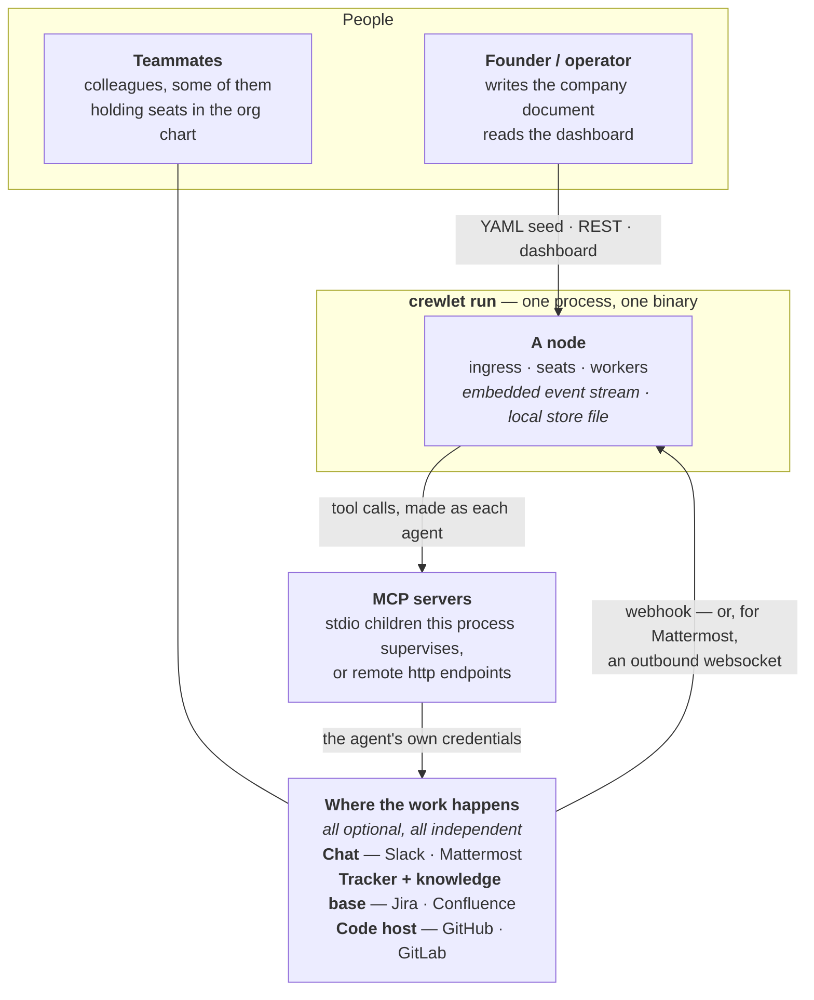
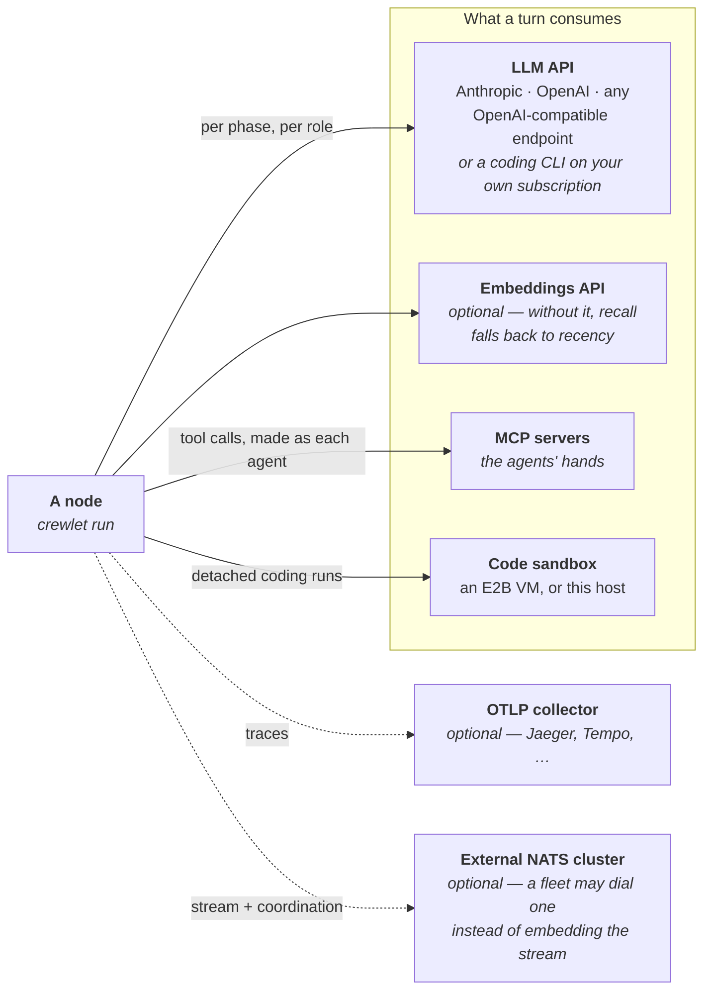
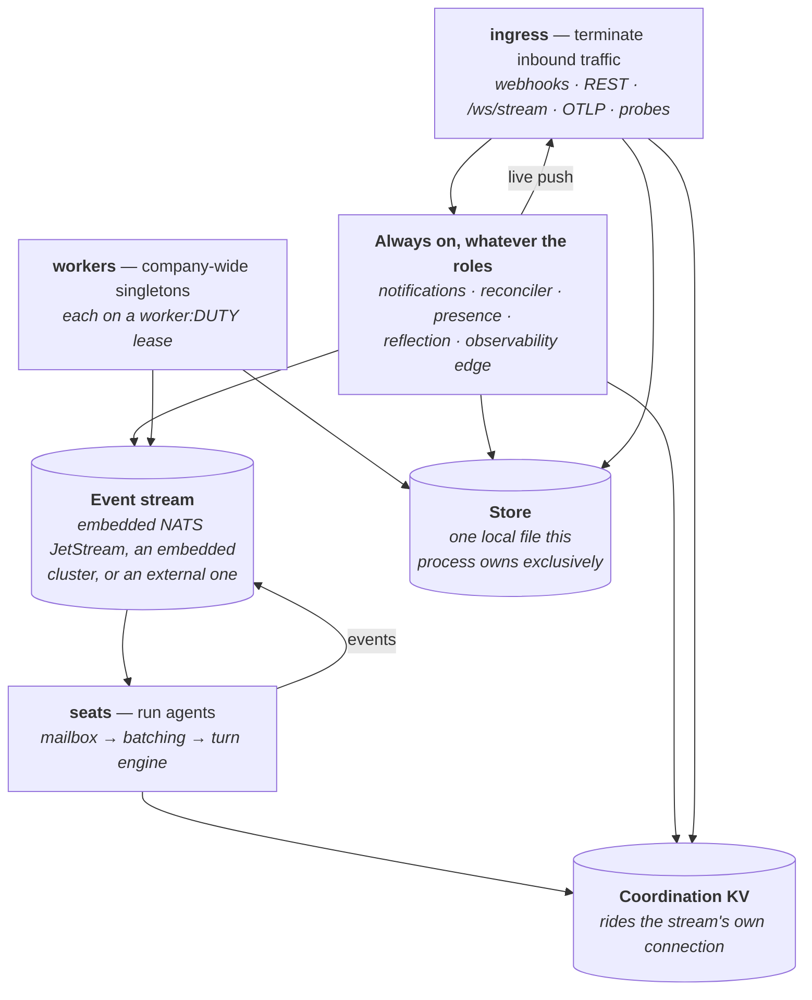
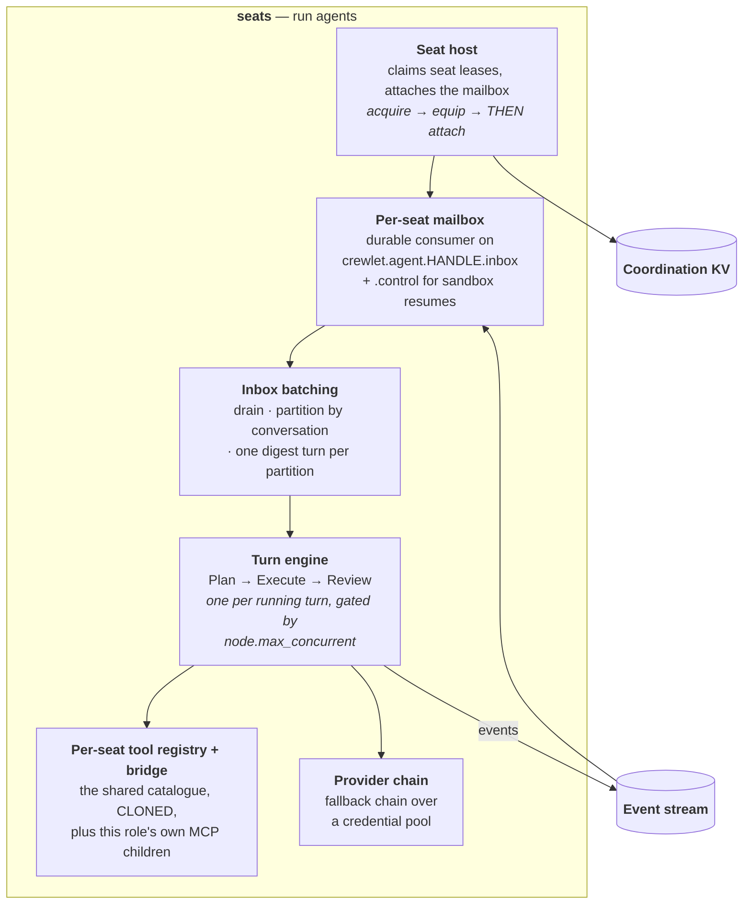
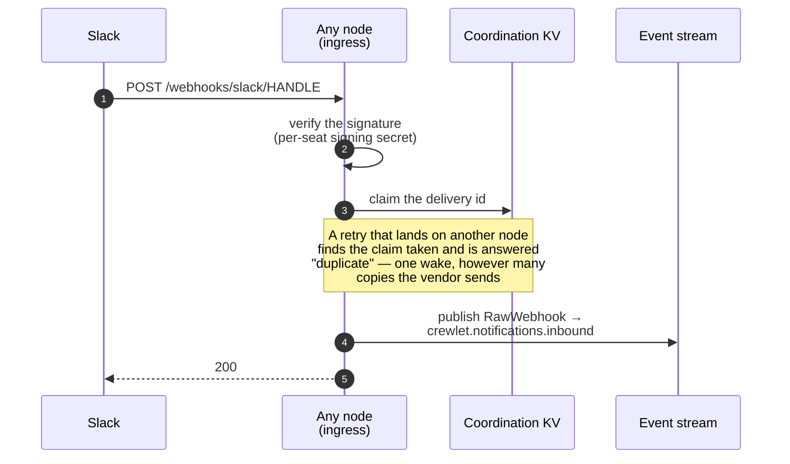
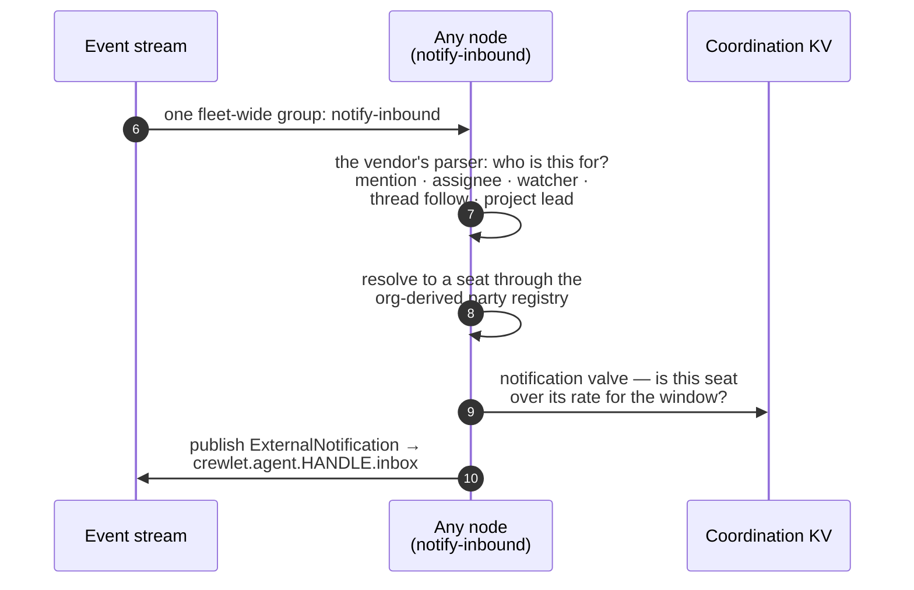
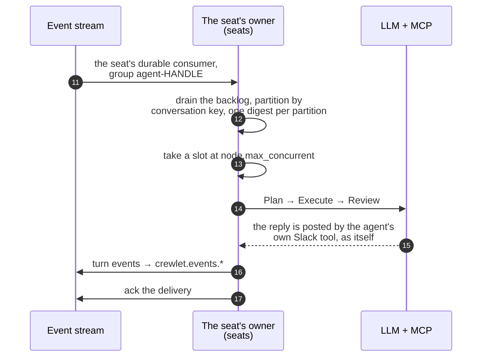
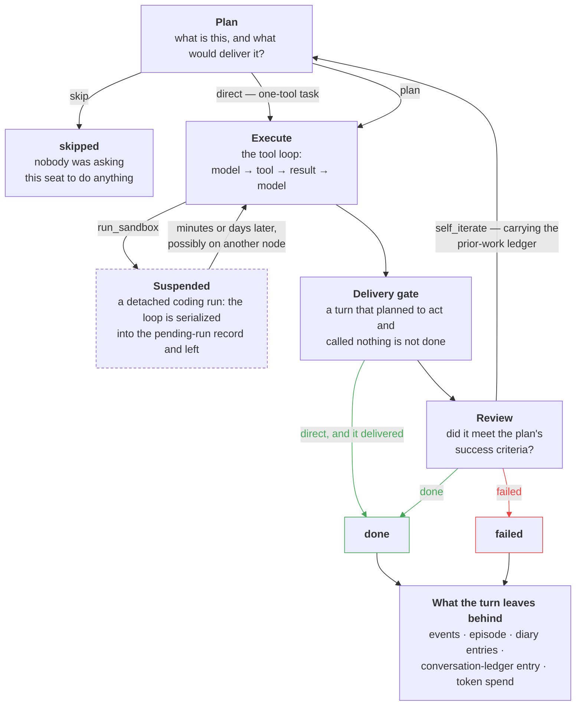
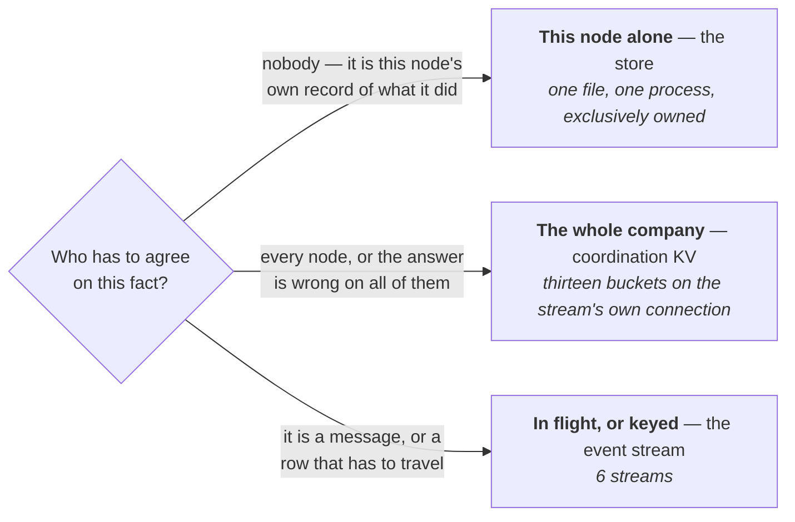
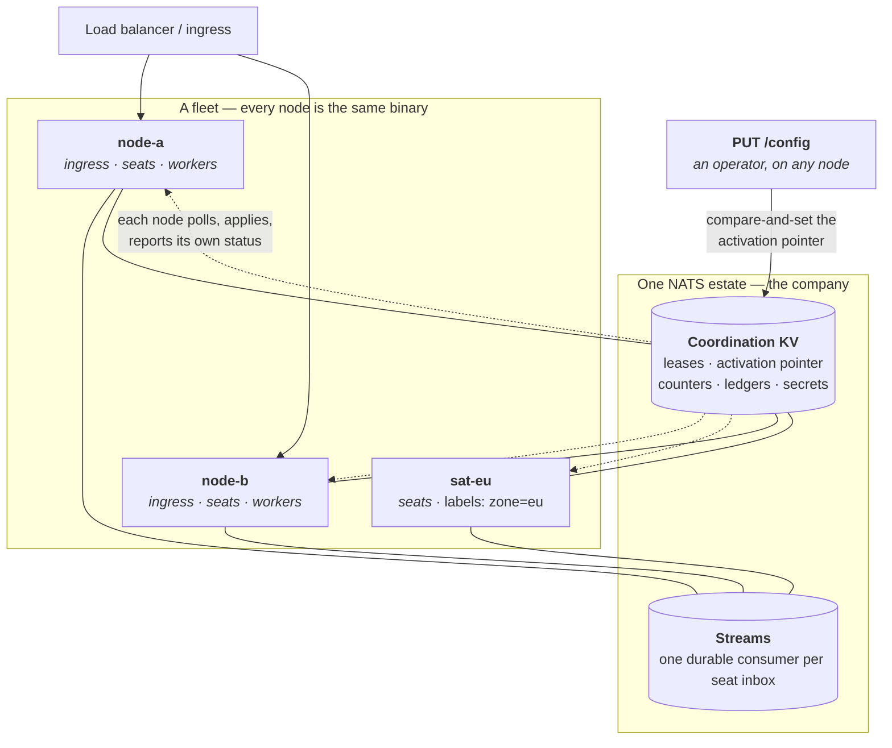

# Architecture

Crewlet is one Go binary. Start it and a company is running: an HTTP surface,
an event stream, a database, a runtime that holds seats and executes turns —
with no broker to operate, no database to provision, and nothing to install
beside it.

This page draws that binary at six zoom levels, from what sits outside its
boundary down to the path a single trigger takes through it. It is a **map**:
every box belongs to a page that goes deeper, and [the last
section](#which-page-owns-which-box) says which. The [Overview](overview.md)
carries the one-diagram version; everything past that is here.

---

## 1. The boundary

Everything Crewlet needs to *run* is inside the process. Everything it needs to
be *useful* is outside it — the surfaces your company already works on, the
models that think, and the tool servers that act.

Two things about that outside half are easy to miss and are the whole design, so
it takes two pictures. The first is the round trip — work arrives on those
surfaces, and it is delivered back to the same ones.

**The engine never calls a vendor's API on its own account.** It calls MCP
servers, and each seat's server carries *that seat's* credentials
(`role.mcp_env`), so a comment on an issue is written by the agent, not by a
service account fronting for it. The engine's own vendor packages exist for the
*inbound* half — verifying a delivery, parsing it, deciding whose it is — plus
provisioning and the chat working-indicator. See [Tool
capabilities](tool-capabilities.md) for why no engine prompt names a vendor tool.

The second picture is the supply — what a node reaches out to while a turn runs.
Its MCP servers are the ones above; the two dashed edges are the process-level
connections a deployment may never make at all.

**Nothing outside the boundary is a hard dependency except a model.** No
embeddings means no similarity search — the diary's candidate pool falls back to
recency and the "similar prior work" block renders nothing, both first-class
states rather than failures. No sandbox means no `run_sandbox` tool. No chat,
tracker or code host means an agent has fewer surfaces to be reached on and to
act through, and every other one still routes end to end.

| Outside the boundary | Required? | What it is for | Without it |
|---|---|---|---|
| An LLM provider | **Yes** | Every phase of every turn | Nothing runs |
| MCP servers | In practice | The agents' hands — chat, tracker, wiki, code host | Agents have only the [builtins](agent-runtime.md#built-in-tools) |
| Chat · tracker · code host | No, each | Where triggers arrive and work is delivered | That surface simply routes nothing |
| Embeddings provider | No | Vector recall over `agent_diary` and `episodes` | Recall degrades to recency; episodes render nothing |
| Code sandbox | No | Code authoring as a detached Execute phase | No `run_sandbox`; agents still read and review code over MCP |
| OTLP collector | No | Exported traces | Trace ids are still minted and still stored on every event row |
| External NATS | No | The stream for a fleet that will not embed it | The process embeds its own — the default |

---

## 2. Inside one node

`crewlet run` is *the* node, and what it does is a config value:
`node.roles` picks from `ingress`, `seats` and `workers`. Declaring none means
all three, which is the single-process company — one process serving the API and
the dashboard, running every agent, and performing the company-wide duties.

That is one `crewlet run` process. `node.roles` picks from `ingress`, `seats`
and `workers` — declare none and you get all three — and the always-on set runs
on every node whatever it says. The three backends are opened together and
closed together.

Three of those four groups are **inventories, not pipelines**: no box inside
`ingress`, `workers` or the always-on set hands work to another box in the same
group. They are named here rather than drawn.

**Two slots and a file.** The stream and coordination are the two *chosen*
backends, validated together — a multi-node fleet cannot coordinate locally, and
a two-member fleet has no quorum. The store is not a third choice: it is this
node's own file, opened with them because everything that writes to it is driven
by them. A node holding one without the others could hear work it may not do,
hold seats it cannot serve, or run turns it cannot record.

**Coordination rides the stream's connection.** Not a second dial that could
fail on its own, and never the store file — see [Coordination](coordination.md)
for the line between the two estates and [section 5](#5-where-state-lives) for
which fact lives where. Only the *lease* half follows `coordination.type`: on a
single node it falls back to an in-process store, while the shared
buckets — the activation pointer, the ledgers, the counters, the company's
secrets — are opened on every topology, because a lone node still has to read
back what it wrote.

**The routes `ingress` terminates.**

| Route | What it is |
|---|---|
| `/webhooks/slack/HANDLE` · `/webhooks/github` · `/webhooks/gitlab` · `/webhooks/jira` · `/webhooks/confluence` · `/webhooks/forge` | The webhook routes. A delivery is verified, then claimed once per fleet, then handed to the notification service. |
| `/config` · `/secrets` · `/agents` · `/org` · `/tools` · `/query` · `/backup` · `/budgets/reset` | The REST and config plane. It reads and writes the coordination KV and the store directly. |
| `/ws/stream` | The dashboard's only data channel: live pushes plus a query channel. The observability edge's projector is what pushes onto it. |
| `/otlp/{token}/v1/{signal}` | Signed-token trace ingest. |
| `/health` · `/ready` | The two probes — [section 6](#6-one-node-or-a-fleet) says why they answer different questions. |

**`workers` is four company-wide singletons, each held on its own
`worker:DUTY` lease.**

| Lease | Duty |
|---|---|
| `worker:scheduler` | Role- and unit-scoped cron; a fire is published to the stream. |
| `worker:sandbox-waiter` | Polls detached runs and resumes the turns waiting on them, over the stream. The same tick is the box keepalive. |
| `worker:maintenance` | The retention sweep, over this node's store. |
| `worker:skill-curator` | Every learning background pass: skill ageing, episode compaction, clustering. |

**Five more services run on every node, whatever the roles say.**

| Always on | What it does |
|---|---|
| Notification service | One fleet-wide group, `notify-inbound`: parse → resolve → valve → wake, publishing the wake to the seat's inbox on the stream. |
| Config reconciler | Polls the activation pointer, applies an epoch, reports status — all in the KV. |
| Node presence | The `node:ID` lease in the KV, plus the posture heartbeat. |
| Reflection worker | Consumes `turn_completed`, one delivery at a time, and writes to the store. |
| Observability edge | Two routes off one published event: a publish listener writes the store row, a projector pushes it live onto `/ws/stream`. |

`seats` is the exception — the one group whose boxes hand work to each other.
This is what a wake becomes after the stream delivers it:

**Two MCP lifetimes, and the difference is a security boundary.** A
`shared: true` server is one company-wide child bound to the **config epoch**.
A `shared: false` server is a *template*, and each seat gets its own child bound
to that **seat's lease** — spawned before its mailbox opens, killed when the
lease goes. The credentials in one of those children *are* that seat's identity,
and two children of one template publish identical tool names: in a single
registry one would shadow the other and every seat would call whichever won,
acting in the tracker or the chat backend as somebody else. So a claimed seat
gets its own cloned registry and its own bridge.

**One model call has three layers of failure handling, each owning exactly one
decision.** The backend *classifies* and does nothing else — it never retries.
The credential pool decides whether the **key** is at fault: a rate-limit or
auth failure benches that key for a cooldown and the next call leases another,
least-in-flight. The fallback chain decides whether the **model** is worth
abandoning and moves to the next one in the role's chain. That is why the same
429 produces three different behaviours at three different altitudes, and why
cooldowns are fleet state rather than per-process: a limit belongs to the key at
the vendor, so four nodes should not each pay their own 429 to learn it.

**The observability edge is two routes, not one, and the split is deliberate.**
A published event forks. It is written to this node's `crewlet_events` **inline,
in the publishing goroutine**, through a publish listener with no consumer
group — so no two nodes can ever write one row. And it is read back off the
broker by an **ephemeral broadcast** subscription on `crewlet.events.>` that
feeds the live projection — so a dashboard tab attached to node B shows turns
that ran on node A. Swap either mechanism for the other and you lose the
guarantee the other one was providing.

The two sets are not identical, and each exception carries its reason in
`internal/events`: a few types are live-only — a per-round progress signal, a
snapshot of in-memory meters — because persisting them would fill the log with
intermediate states of rows it already holds finished, or let a dashboard
hydrate a dead process's counters and render them as current. What the
projection shows and what the store keeps are two questions with two answers.

**Embedded and standalone are one wiring with one seam.** The API half runs in
the engine's process by default and can run as its own; what differs is not the
routes but what the process can *see*, and that is a single interface. A nil
runtime is a real answer — "there is no engine here" — rather than a missing
one, so the engine-only fields are simply absent instead of zero.

**The HTTP surface binds before the engine starts.** A seat is not claimed until
its per-role MCP children are up — one subprocess per server per seat, each a
spawn, a handshake and a `tools/list` — and on the example company that is 21
children. Binding first means the dashboard, the REST API and every webhook
route answer during that window, and `/ready` says honestly that this node holds
no seats yet. Webhooks arriving in the window are retained rather than dropped,
because a seat's mailbox is created before any claiming.

---

## 3. The path a trigger takes

A person mentions an agent in a Slack thread. Here is every hop between that
message and the agent's reply — across a fleet, where the node that *receives*
the delivery is rarely the node that *runs* the seat.

It is drawn in three legs, one per process that touches the delivery: on a
fleet those are usually three different processes, and on one node they are
three parts of the same one. Each leg ends by publishing to a subject and the next
begins by consuming from it — the seam between the pictures is the seam in the
architecture, and no hop is hiding in it. The coordination store and the event
stream appear in more than one leg; there is one of each, company-wide, not one
per picture. The step numbers run 1–17 straight through.

**Leg 1 — the node that took the delivery.** Verify it, claim it, publish it,
and answer the vendor only once it is on the stream.

**Leg 2 — any node in the inbound group.** It takes the delivery off
`crewlet.notifications.inbound`, works out whose it is, and publishes a wake
onto that seat's own subject.

**Leg 3 — the node holding that seat.** Its mailbox is a durable consumer on
`crewlet.agent.HANDLE.inbox`. Everything from there is the turn, and the reply
leaves as the agent rather than back down the path it arrived on.

Five properties of that path are worth stating on their own, because each one
is why a step exists at all.

**The delivery is claimed before it is published.** Two concurrent retries must
not both wake a seat, and a vendor retrying reaches whichever node a load
balancer picks — so the claim lives in the fleet's coordination store, not in
the receiving node's memory. Publishing then comes *before* the store row and
the live push, because the publish is the only step that has to happen: a
delivery that reached the stream will be worked even if the receiving process
dies in the next instruction. A publish that fails releases the claim and
answers 503, so the vendor's retry finds the delivery unclaimed.

**Routing is a publish, never a call.** The inbound consumer group is
fleet-wide, so the node that wins a delivery is usually *not* the node running
the recipient. Every resolution goes through the org-derived registry — seat
ids are a UUIDv5 over `(org name, handle)`, so every node computes the same
answer with no database and no running instance — and every wake is a publish to
the seat's inbox subject. A service that resolved against local state would drop
most of a fleet's mail.

**The mailbox exists whether or not the seat is running.** A seat's inbox is a
durable consumer created with nothing attached, and it retains what is
published while no node holds the seat. That is what turns three otherwise
alarming moments — a rolling upgrade, a seat moving between nodes, a node that
has not finished booting — into non-events rather than lost messages. It is
also why every node creates a mailbox for *every* seat in the company rather
than for its own share: the mailbox streams use interest retention, so a
publish to a subject no durable consumer covers is dropped in silence.

**One trace covers the whole path.** The webhook edge starts the span, the wake
event carries `trace_id` and `parent_span_id` forward, and every event the turn
publishes hangs beneath it — so a delivery and the turn it woke are one story at
the collector, and the same ids are columns on the event rows whether or not a
collector exists.

**There are two inbound edges, not one.** Five vendors plus Atlassian's Forge
relay arrive as verified HTTP on `/webhooks/*` and take every step above.
Mattermost does not: it holds **one websocket per seat**, outbound from this
node, so it needs no public URL and no signing secret — and it joins the picture
only at the republish onto `crewlet.notifications.inbound`, with its own
per-socket dedupe instead of the fleet claim. Everything from that subject
onward is identical for both.

A schedule firing, an `a2a_ask` from a colleague and a sandbox run completing
enter further down still: they publish straight to
`crewlet.agent.HANDLE.inbox` (or `.control`), and everything from the mailbox
onward is identical again.

---

## 4. The path a turn takes

Every trigger that reaches a seat runs the same three-phase turn — a batch of
triggers for one conversation is one turn. What varies is which phases run, and
whether the turn survives its own process.

**Two nested loops, not one.** The outer loop is the turn: Plan → Execute →
Review, re-entered on `self_iterate` up to `turn_engine.max_iterations`. The
inner loop is the model↔tool round trip *inside each phase*, bounded by its own
cap (`plan_max_tool_rounds`, `max_tool_rounds`). A turn is therefore up to
`max_iterations × (Plan rounds + Execute rounds + Review rounds)` priced model
calls, which is the number to reason about when sizing a budget — not "one call
per turn".

**Each phase gets its own prompt, its own tool surface and its own model.** The
planner is the only phase making ownership, delegation and policy-sensitive
decisions, so it carries the richest context — identity, policies, the team
roster, and the **Plan-phase prefetch**. That prefetch is six blocks rendered
concurrently *before the turn starts*: personal memory, relevant knowledge,
similar prior work, known counterparty, synthesized skills, first-turn
onboarding. Execute and Review run against the plan's explicit
`success_criteria` and do not re-derive them. A frontier model can plan while a
cheap one summarizes; see [Turn Engine](turn-engine.md).

**Tools are discovered, not enumerated.** A role with 50–150 MCP tools would
push 15–25 KB of catalogue into every prompt, so Plan and Execute see *server
names* and walk `list_mcp_server_tools` → `activate_tool` to promote what they
actually need. From the model's side a builtin and an MCP tool are the same
thing: a function it can ask the engine to call.

**A suspended turn is the reason there is no parked goroutine anywhere.** A
detached coding run stops the Execute loop mid-round with its `run_sandbox` call
*unanswered*, and the conversation is serialized into the pending-run record
rather than held in memory. The run outlives the process: it may be resumed
after a restart, on a different node, days later once a person answers the
agent's question. The record carries an explicit version, and a build that does
not understand it refuses loudly and leaves the row untouched.

**The delivery gate is the engine's own judgement, between the phases.** Review
says whether the criteria were met; the gate says whether anything was actually
*delivered*, by comparing what the plan promised against what each phase called
and what the surface says those tools do. It has teeth in both directions: it
forces a Review over a `direct` plan whose Execute delivered nothing, and it
overturns a `done` into `self_iterate` with a correction. The two failure modes
it exists for are a seat that composed a reply and never posted it, and a seat
that posted it twice.

**Nothing about a turn's shape is ambient.** The configuration a turn reads is
taken by value at the top of the turn from one immutable epoch, so a config
apply landing mid-turn cannot change the round cap between Plan and Execute. A
turn holds the company it started under until it ends.

---

## 5. Where state lives

Three estates, and which one a fact belongs to is decided by a single
question: **who has to agree on it?**

What each of the three holds, in full:

**This node alone — the store.**

| Tables | What they hold |
|---|---|
| **`crewlet_events`** · `crewlet_event_parties` | The audit log and its party index |
| **`agent_diary`** · **`episodes`** | Vector-indexed recall |
| **`synthesized_skills`** · `synthesized_skill_versions` · `counterparty_profiles` · `agent_onboarding_markers` | The rest of the learning subsystem — skill induction and its versions, counterparty profiles, first-turn onboarding markers |
| **`conversation_sessions`** | What this seat already said in that thread |
| `company_config` · `scheduled_runs` · `chat_thread_follows` · `secret_values` | Revisions, cron bookkeeping, thread follows, and the secret store's bootstrap half |

**The whole company — coordination KV.**

| Bucket | What it holds |
|---|---|
| **`crewlet_leases`** | `node:` · `seat:` · `worker:` ownership. The bucket's age **is** the lease TTL |
| **`crewlet_epochs`** | The monotonic fencing counter. No age at all — see below |
| **`crewlet_config`** | The activation pointer and its payload — the pointer's own revision **is** the epoch |
| **`crewlet_status`** | One key per node: which revision it applied |
| **`crewlet_ledger`** · **`crewlet_claims`** · `crewlet_fires` | Turn completions, webhook delivery claims, scheduled-fire claims |
| **`crewlet_budgets`** · `crewlet_rate` · `crewlet_cooldowns` | The token counter, the notification valve, benched credentials |
| **`crewlet_secrets`** · `crewlet_channels` · `crewlet_sandbox_runs` | The company's sealed credentials, open A2A channels, detached coding runs |

**In flight, or keyed — the event stream.**

| Stream | Subjects |
|---|---|
| **`CREWLET_AGENT`** | `crewlet.agent.>` |
| **`CREWLET_NOTIFICATIONS`** | `crewlet.notifications.>` |
| **`CREWLET_EVENTS`** | `crewlet.events.>` |
| **`CREWLET_CONFIG`** | `crewlet.config.>` |
| **`CREWLET_MEMORY`** | `crewlet.memory.>` — *one message per subject: a keyed table, not a log* |
| **`CREWLET_DLQ`** | `dlq.>` — *deliberately outside* `crewlet.*` |

**Mailboxes and event history are different kinds of stream.** The two
mailbox streams use *interest* retention — a message lives until its durable
consumer acks it, which is what makes a seat's inbox a mailbox rather than a
log. The event, config, memory and dead-letter streams use *limits* retention:
events and dead letters age out, config nudges age out within the hour because
losing one costs a poll interval and never a revision, and memory has no age
bound at all — what a seat should still remember is the learning subsystem's
decision, not the broker's.

**A seat's memory follows the seat.** Memory is written to the *node's* store,
and placement moves seats — so every memory row also rides
`crewlet.memory.HANDLE.TABLE.DIGEST`, one subject per row, on a stream that
retains exactly one message per subject. A node acquiring a seat replays that
seat's rows in a single pass and hydrates them **before** the mailbox is
attached. Deletes deliberately do not travel: the lifecycle re-converges, and a
tombstone protocol would be a second thing to keep correct forever.

**The line was learned, not designed.** Migrations `0010`–`0013` are what
breaking it cost: the delivery dedupe, the completion ledger, the config
activation pointer, per-node apply status, the token counter, the A2A channel
ledger and the detached-run record all started as tables in one node's file,
where each of them answered a company-wide question with one node's opinion.
They were moved, and the rule is now the one above. See
[Coordination](coordination.md).

**Retention here is a bucket's age, never a per-write TTL.** On the embedded
broker a per-key TTL is create-only — an update clears it, leaving the key
immortal — so a horizon has to be fixed when its bucket is created, and that is
why there are thirteen of them rather than one with prefixes — two in the lease
store, eleven in the fleet store. The first two are the sharpest illustration: `crewlet_leases` has an age, *and that age is the
lease TTL* — a renew rewrites the key and restarts the clock, so a node that
stops renewing stops holding and nothing has to notice it died. `crewlet_epochs`
sits beside it with no age at all, because a fence that restarts is not a fence.
Two buckets, opposite retentions, for the same subsystem.

---

## 6. One node, or a fleet

One node is the design's degenerate case, not a lesser path: it runs the API,
every seat and every duty, with an embedded stream and local coordination.
Nothing about the code path changes when a second node appears — what changes is
that ownership starts being contested, and there is already a lease for that.

**The presence lease is the membership service.** Every node claims `node:{ID}`
on the same heartbeat as its seats, carrying its roles, its labels and its
status. Reading `node:*` back is the whole of fleet discovery — no gossip, no
coordinator, no registry to configure — which is why adding a node is starting
a process and removing one is stopping it. Dropping that row is the first thing
a drain does.

**Placement is deliberately dumb.** Every node greedily claims up to a fair
share — `ceil(seats / live nodes)`, live nodes being the presence leases of
nodes that actually run seats, and summed **per placement group** rather than
computed once fleet-wide, because one global ratio strands the seats that are
pinned somewhere. Every node computes the same number from the same table and
stops there; two nodes racing for the last seat is settled by the lease, not by
the arithmetic. It converges in **both** directions, because claiming alone
only converges for a fleet that shrinks. A `preferred` hint *orders* the attempt
and never gates it, so a rolling deploy tends to land seats back where their MCP
children are already warm — and a seat whose preferred node is gone is still
taken by somebody.

**Acquire, equip, then attach — and release in reverse.** A seat is not
serving until its instance is spawned, its budget loaded, its MCP children are
up and its sandbox runs recovered. Only then is the mailbox attached. The
release order is the mirror, so a seat is never left consuming work it no longer
owns. That ordering is the one behaviour none of the composed packages can
express alone, and it is why [`internal/node`](seat-ownership.md) exists.

**Every ownership question is three-valued.** Held, definitively not held, and
**unknown** — and treating unknown as loss tears a healthy company down over a
two-second store blip. Unknown is bounded rather than trusted, on two different
clocks: a seat stops *admitting* work once its last successful renew is older
than the heartbeat interval, and is only given up once that renew is older than
the lease TTL. Stop taking new work early, hand the seat over late. See
[Coordination](coordination.md#the-three-valued-answer).

**`/health` and `/ready` answer different questions.** `/health` stays 200
through a drain — an orchestrator that killed a node for reporting unhealthy
mid-drain would destroy the turns the drain exists to finish — and it is where
the posture is visible. `/ready` steers traffic, and fails on `shed` and `stuck`
**only**: `wait` and `isolated` stay ready on purpose, because failing readiness
on ordinary rollout lag makes the fastest node the cause of a fleet-wide outage,
and stepping out of rotation when *no* peer has the epoch is not shedding, it is
stopping.

**One config, agreed by pointer.** An activation is a compare-and-set on an
append-only pointer whose own revision *is* the epoch, so two operators
activating at once get two revisions rather than overwriting each other. Each
node polls it, applies, and writes its own status; a node that is behind picks
a posture — `serve`, `wait`, `shed`, `isolated` or `stuck` — from what it can see
of the pointer and of its peers. A shedding node refuses at *trigger
admission*: the delivery goes straight back to the broker and this node stops
consuming, on a seat's inbox and on the ingress topic alike, so the work moves
to a peer that has the epoch rather than being run against a company this node
is no longer sure of. **Lag alone never sheds** — every rollout produces lag,
and shedding on it would make the first node to apply the cause of a fleet-wide
outage. See [Control plane](control-plane.md).

---

## Which page owns which box

Every box in the diagrams above is somebody else's subject in full. This table
is the index; each package also states its own rationale in its package doc, so
`go doc ./internal/coord` is the authority on coordination rather than any page
here.

| Box | Package | Read |
|---|---|---|
| The org chart, seats, handles | `internal/org` | [Organization model](organization-model.md) · [Humans in the org chart](humans-in-the-org.md) |
| The two config tiers, the apply | `internal/config` | [Configuration](configuration.md) |
| Webhook routes, verification, parsers | `internal/api/webhooks`, `internal/whsec` | [Jira](../integrations/jira.md) · [Confluence](../integrations/confluence.md) · [GitHub](../integrations/github.md) · [GitLab](../integrations/gitlab.md) · [Slack](../integrations/slack.md) · [Mattermost](../integrations/mattermost.md) |
| Routing a delivery to a seat | `internal/notify` | [Event system](event-system.md) |
| Subjects, streams, delivery semantics | `internal/queue`, `internal/events` | [Event system](event-system.md) |
| Inbox batching and coalescing | `internal/agent/inbox` | [Event system](event-system.md#inbox-batching--coalescing) |
| Seat leases, placement, acquire and release | `internal/seat`, `internal/node` | [Seat ownership](seat-ownership.md) |
| Leases, buckets, the three-valued answer | `internal/coord` | [Coordination](coordination.md) |
| The activation pointer and node postures | `internal/configplane` | [Control plane](control-plane.md) |
| Plan → Execute → Review, sub-agents | `internal/agent/turn`, `runner`, `toolloop` | [Turn engine](turn-engine.md) · [Agent runtime](agent-runtime.md) |
| The tool registry, MCP children, A2A | `internal/tools`, `internal/mcp`, `internal/a2a` | [Tools & MCP](../guides/tools-and-mcp.md) · [Tool capabilities](tool-capabilities.md) |
| Knowledge-base-sourced prompt fragments | `internal/agent/skills` | [Tool skills](tool-skills.md) |
| Live knowledge search | `internal/knowledge` | [Knowledge system](knowledge-system.md) |
| Diary, episodes, skill induction, profiles | `internal/learning` | [Agent learning](agent-learning.md) |
| What a seat already said in one thread | `internal/agent/ledger` | [Conversation sessions](conversation-sessions.md) |
| Models, the fallback chain, the key pool | `internal/providers` | [Provider layer](overview.md#provider-layer) · [Subscription LLM backends](subscription-llm-backends.md) |
| Detached coding runs | `internal/sandbox`, `internal/hostbox` | [Code sandbox](code-sandbox.md) |
| Cron-scoped recurring work | `internal/schedule` | [Scheduling](scheduling.md) |
| The company's sealed credentials | `internal/fleetsecrets` | [Secret store](secret-store.md) |
| The local database and its migrations | `internal/store` | [Database](overview.md#database) · [Backups & restore](../guides/backup.md) |
| REST, the dashboard, the socket | `internal/api`, `static/dashboard` | [API endpoints](../reference/api-endpoints.md) · [Dashboard design](../reference/dashboard-design.md) |
| Event rows, live projection, traces | `internal/observe`, `internal/tracing`, `internal/tokens` | [Deployment](../guides/deployment.md) |
| Why there is no task state | — | [Task engine](task-engine.md) |
| DACI, and why it needs no engine | — | [Decision framework](decision-framework.md) |
| More than one node | `internal/seat/placement` | [Scaling out](scaling.md) · [Running a fleet](../guides/fleet.md) · [Satellite nodes](../guides/satellite-nodes.md) |
