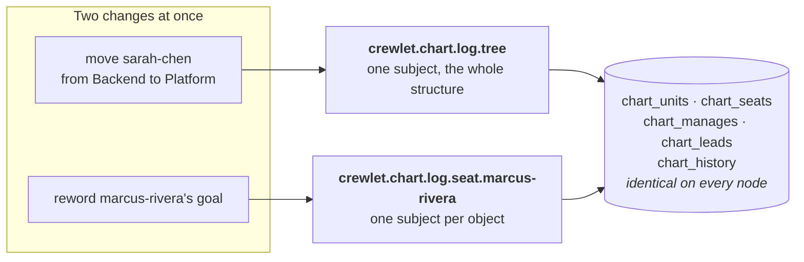

# The Org Chart Domain

Your company's org chart — its units, its seats, and who sits where — is a
**replicated state machine**. Every change to it is one record on an ordered
stream the fleet shares, applied into an identical set of SQL tables on every
node, with each node's position committed in the same transaction as the rows
it wrote.

It is the fourth domain on the [state-log framework](../guides/replication.md),
beside [the tracker](task-engine.md), the [knowledge base](knowledge-system.md)
and the embeddings. If you have read how those work, the chart works the same
way; this page is about the parts that are different, and about what changes
for you as an operator.

---

## Why the chart is a log and not a document

Until now the chart lived inside the Tier B company document — one nested
object, rewritten whole by whoever wrote the document last. That is a fine way
to author a chart and a poor way to *operate* one:

- **A write was the whole document.** Adding one seat re-stated every other
  seat, so two people editing two different teams collided on a revision
  neither of them had touched — and the loser's change was not refused, it was
  overwritten by a value the winner never looked at.
- **There was no per-object contention.** The unit of contention was the
  company, so a reconcile that wanted to touch one team had to take the whole
  chart.
- **A change left no record.** A document revision says what the chart
  *became*. It never says what *happened*: who moved, out of which unit, into
  which, at whose hand, from which config revision. A reorganisation is exactly
  the change a company most needs an audit of.

As a log, each of those is answered by construction. Two leads editing two
seats never contend. A reorganisation is a row with an actor, a revision and a
timestamp on it. And a node that is behind can say *how far* behind it is,
rather than reporting a position it cannot compare to anything.

---

## Two kinds of change, and why they arbitrate differently

This is the one place the chart departs from the shape the tracker and the
knowledge base share, and it is worth understanding because it is what you will
see in a contention error.

**Structure** — who sits under whom, who leads what, and what the chart no
longer names — arbitrates on **one subject for the whole chart**. Every
reparent, every placement, every removal and every import contends there, and
exactly one wins.

**Content** — a backstory, a goal, a purpose, a channel, a model chain —
arbitrates **per object**, on that unit's or that seat's own subject. Two leads
editing two seats never contend at all.

The reason for the split is that an org chart's containment *is* the object. A
task belongs to a project and a page to a container; in both cases containment
is a field on the thing contained, so two writers moving two tasks into one
project never have to agree about anything. Moving a unit touches two parents
and every ancestor above them — so two moves that are each perfectly valid on
their own can jointly produce a **cycle**, and neither writer ever looked at the
other's subject. One subject for the whole structure makes that state
unreachable rather than merely detectable.

What it costs is that every structural change in the company serialises. That
is deliberate: a chart changes when somebody is hired, moved or promoted, so the
serialised write is the rarest one your company makes, and the ordinary traffic
does not touch it.

---

## What it means for you

**Nothing to configure, and one thing you may want to.** The chart's log has a
byte ceiling, `stream.chart_log_max_bytes`, and it is the only state log whose
default is *not* derived from your disk: unset, it takes a flat **1 GiB**. The
other three logs grow with a corpus your volume has something to say about, and
a chart does not — it is hundreds of objects, and it changes when somebody is
hired, moved or promoted rather than on every comment or every save. At the
modelled rate, a completely blocked trim reaches a gibibyte in well over a
century. Raise it only if you are reorganising continuously *and* your trim is
stopped, and read [Retention](../guides/retention.md) first, because a stopped
trim is the actual problem in that sentence.

Crossing the ceiling **refuses the append** rather than dropping the oldest
record. Nothing on this stream is derivable from anything else, so shedding
history would be data loss with a tidy name.

**A node behind on the chart does not serve turns.** The chart is a *readiness
input*, which means a node that cannot keep up with it is not admitted to run
seats. That is a stronger stance than the engine takes for the tracker or the
knowledge base, and the reason is what a stale chart produces: not wrong output
but *confidently* wrong output. A node behind here routes an escalation to a
manager who no longer holds the seat, hands a turn a roster of people who have
moved, and admits a seat the company has removed. Every other answer the engine
gives is scoped by the chart.

**A key is an address, not an identity.** A unit's key and a seat's handle are
what people type — into `manages:`, into `lead:`, into a vendor mapping. When
one changes, the old key goes on resolving to the same object, so references
somebody already wrote down keep working. What does *not* follow a handle change
is a seat's **memory**: its agent id is derived from the company name and the
handle, so a seat that takes a new handle is a new agent as far as its diary and
its onboarding markers are concerned. Settle handles before a company runs.

**An unchanged revision is a no-op.** Re-activating a config revision the chart
has already imported — which is the credential-rotation gesture, and therefore
routine — writes nothing and wakes nobody. Every node reaches that conclusion
the same way, from a ledger row rather than from a comparison each node makes
for itself.

---

## What the engine stores

All of it lives in the **replicated** estate — the second of the node's two
database files, the one a snapshot copies. Nothing here is in the node's own
file, and nothing here is in the coordination store.

| Table | What it holds |
|---|---|
| `chart_units` | One unit: its key, its display name, its purpose and goals, its chat channel, its tracker and knowledge identities, where it sits, and who leads it. Plus `former_keys_json` — the keys it used to answer to |
| `chart_seats` | One seat, agent or human: its handle, its backstory and goal, its contact address, its identities, and which unit it sits in. Plus `email_index`, the matched form of its address |
| `chart_manages` | One authored `manages:` entry, stored **unexpanded** — a `manages:` naming a unit reaches every seat in its subtree, and that expansion is a function of the tree at the moment it is read |
| `chart_leads` | One unit's authored lead, as an edge. Lead *inheritance* means the effective lead of a team is an ancestor's authored row, so this is walked rather than read |
| `chart_history` | One row per change: what happened, to what, by whom, from which config revision, and when |
| `chart_import_ledger` | Which config revision produced which position on the log, and how many objects it placed. This is what makes a re-activation a no-op, and it is where you look to answer "which revision is this company's structure actually running" |

Both edge tables store **what was authored**, including an entry that resolves
to nothing. A `manages:` naming a seat nobody has added yet is kept as written:
a chart is built in pieces, every intermediate revision is applied by every
node, and refusing a partly wired chart would make that sequence impossible.
Dangling references are reported where the tree is read — see
[Organization Model](organization-model.md).

---

## What the chart is not

It is not the **organization** a turn reads. `internal/org` builds that: the
normalised tree, with lead inheritance applied and every `manages:` entry
expanded. These tables hold what was *authored*, and every derivation is
computed from them rather than stored beside them — a derived value written down
is a second answer that goes stale the moment an ancestor changes, recomputed by
nothing.

It is also not a second place to edit your company. You author the chart the way
you always have; this is what the engine does with it once you have.

---

## Where to go next

- **[Organization Model](organization-model.md)** — how you author a chart, and
  every derivation the engine performs over it
- **[Replication](../guides/replication.md)** — the state-log framework the
  chart is a domain of, and how the byte ceilings are sized together
- **[Architecture § Where state lives](architecture.md#5-where-state-lives)** —
  every estate, table, bucket and stream in one place
- **[Control Plane](control-plane.md)** — how a config revision reaches every
  node in the first place
