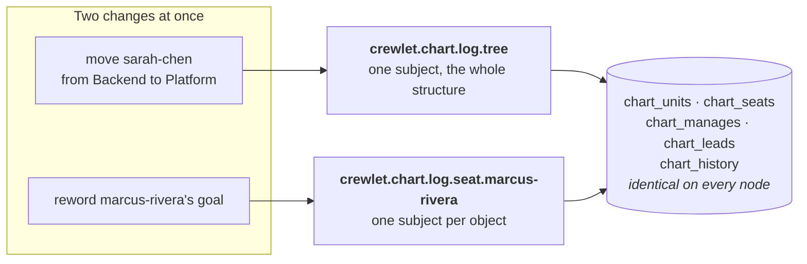

# The Org Chart Domain

Your company's org chart — its units, its seats, and who sits where — is a
**replicated state machine**. Every change to it is one record on an ordered
stream the fleet shares, applied into an identical set of SQL tables on every
node, with each node's position committed in the same transaction as the rows
it wrote.

It is the fourth domain on the [state-log framework](../guides/replication.md),
beside [the tracker](task-engine.md), the [knowledge base](knowledge-system.md)
and the embeddings. If you have read how those work, the chart works the same
way; this page is about the parts that are different, and about what changes
for you as an operator.

---

## Why the chart is a log and not a document

Until now the chart lived inside the Tier B company document — one nested
object, rewritten whole by whoever wrote the document last. That is a fine way
to author a chart and a poor way to *operate* one:

- **A write was the whole document.** Adding one seat re-stated every other
  seat, so two people editing two different teams collided on a revision
  neither of them had touched — and the loser's change was not refused, it was
  overwritten by a value the winner never looked at.
- **There was no per-object contention.** The unit of contention was the
  company, so a reconcile that wanted to touch one team had to take the whole
  chart.
- **A change left no record.** A document revision says what the chart
  *became*. It never says what *happened*: who moved, out of which unit, into
  which, at whose hand, from which config revision. A reorganisation is exactly
  the change a company most needs an audit of.

As a log, each of those is answered by construction. Two leads editing two
seats never contend. A reorganisation is a row with an actor, a revision and a
timestamp on it. And a node that is behind can say *how far* behind it is,
rather than reporting a position it cannot compare to anything.

---

## Two kinds of change, and why they arbitrate differently

This is the one place the chart departs from the shape the tracker and the
knowledge base share, and it is worth understanding because it is what you will
see in a contention error.

**Structure** — who sits under whom, who leads what, and what the chart no
longer names — arbitrates on **one subject for the whole chart**. Every
reparent, every placement, every removal and every import contends there, and
exactly one wins.

**Content** — a backstory, a goal, a purpose, a channel, a model chain —
arbitrates **per object**, on that unit's or that seat's own subject. Two leads
editing two seats never contend at all.

The reason for the split is that an org chart's containment *is* the object. A
task belongs to a project and a page to a container; in both cases containment
is a field on the thing contained, so two writers moving two tasks into one
project never have to agree about anything. Moving a unit touches two parents
and every ancestor above them — so two moves that are each perfectly valid on
their own can jointly produce a **cycle**, and neither writer ever looked at the
other's subject. One subject for the whole structure makes that state
unreachable rather than merely detectable.

What it costs is that every structural change in the company serialises. That
is deliberate: a chart changes when somebody is hired, moved or promoted, so the
serialised write is the rarest one your company makes, and the ordinary traffic
does not touch it.

---

## What it means for you

**The config API no longer writes it, and says so.** A `PUT` or a `PATCH
/config` carrying a top-level `roles:` or `units:` is refused in full with
`400 chart_not_writable_here`, and so is a write to `/config/roles/{handle}` or
`/config/units/{key}`; both stay readable. It is a refusal rather than a quiet
drop because the quiet drop is what actually hurts: a founder sends a whole
document with a new seat in it, the write succeeds, the revision activates —
and the seat is nowhere, with their own document saying it exists.

**A fresh deployment's chart is seeded from the company file**, by `crewlet run
-company company.yaml`, and only while the chart is empty — see
[the boot seed](control-plane.md#the-boot-seed).

**Your `company.yaml` still holds both halves**, and always will. You author one
document describing a company, `crewlet validate` reads it whole, and `crewlet
config import` divides it: the settings to a revision, the chart to this log.

**A revision written before the split is refused at apply, and served on every
read.** It still carries the chart inside it, so a node applying one would have
to pick between running a chart no other node reads and dropping it to serve a
company with no seats. It refuses instead and names the repair — one `crewlet
config import`. Every read still answers, because that revision is exactly the
one you have to look at in order to repair it.

**Nothing to configure, and one thing you may want to.** The chart's log has a
byte ceiling, `stream.chart_log_max_bytes`, and it is the only state log whose
default is *not* derived from your disk: unset, it takes a flat **1 GiB**. The
other three logs grow with a corpus your volume has something to say about, and
a chart does not — it is hundreds of objects, and it changes when somebody is
hired, moved or promoted rather than on every comment or every save. At the
modelled rate, a completely blocked trim reaches a gibibyte in well over a
century. Raise it only if you are reorganising continuously *and* your trim is
stopped, and read [Retention](../guides/retention.md) first, because a stopped
trim is the actual problem in that sentence.

Crossing the ceiling **refuses the append** rather than dropping the oldest
record. Nothing on this stream is derivable from anything else, so shedding
history would be data loss with a tidy name.

**A chart write takes effect on the next turn, everywhere the company reaches.**
Publishing a chart record publishes a *company*, and every node that applies it
brings the same list of things up to it that a config activation does — the
party registry a mention resolves through, the vendor account a seat's
credential names, the seat's own MCP children, the projects and knowledge
containers its units declare, its mailbox, its schedules, and the payloads
every open dashboard renders. Written as two lists it followed only the
activation, and a seat hired this morning was in the org tree and nowhere else:
unaddressable, with no mailbox, on no screen, firing no schedule, until
somebody happened to change a provider. See
[What follows a published company](configuration.md#what-follows-a-published-company).

**A node behind on the chart does not serve turns.** The chart is a *readiness
input*, which means a node that cannot keep up with it is not admitted to run
seats. That is a stronger stance than the engine takes for the tracker or the
knowledge base, and the reason is what a stale chart produces: not wrong output
but *confidently* wrong output. A node behind here routes an escalation to a
manager who no longer holds the seat, hands a turn a roster of people who have
moved, and admits a seat the company has removed. Every other answer the engine
gives is scoped by the chart.

**A key is an address, not an identity.** A unit's key and a seat's handle are
what people type — into `manages:`, into `lead:`, into a vendor mapping. When
one changes, the old key goes on resolving to the same object, so references
somebody already wrote down keep working.

The **identity** is separate and it is what everything durable is named by. Each
row records the address it was created under — `origin_handle` on a seat,
`origin_key` on a unit — written by the object's *first* rename, which is the
last moment that address is still known, and never touched again. A seat's agent
id is derived from the company name and its origin handle, so its mailbox, its
seat lease, its memory changelog and its schedule history all stay where they
were. A unit's origin key is what its scheduled work is keyed on, which is also
what stops two teams that share a display name sharing one fire.

Two alias sets sit beside them and do a different job. `former_keys_json` holds
the addresses an object used to answer to, newest first and **capped**: it keeps
a reference somebody typed resolving, and a reference nobody has followed in
sixteen renames is not worth a row growing for ever. The origin is uncapped and
is one value, because an identity a cap could drop would be no identity at all.

**An address somebody still answers to cannot be taken, retired or not.** A
rename onto a key another unit holds is refused, and so is one onto a key
another unit merely *used* to hold — because a retired key still resolves, so
handing it to a second object would silently re-point every reference written
before the first one moved. Renaming *back* is not a collision: an object
claiming an address it used to answer to is claiming something that already
resolves to it, which is the undo an operator is most likely to want.

The rule is enforced twice, and the second place is the important one. A claim
arbitrates on the **address's** own subject and a create on the **structure's**,
so the two never contend at the broker: a claim decided while an address was
free can be applied after a create that took it. That ordering is legal and
cannot be made otherwise, so the apply asks again and **drops** the claim
rather than raising — the key is a primary key, and an apply that raised would
fail on every node identically, on a record none of them can ever get past,
turning one lost rename into a stalled domain across the fleet.

**An unchanged revision is a no-op.** Re-activating a config revision the chart
has already imported — which is the credential-rotation gesture, and therefore
routine — writes nothing and wakes nobody. Every node reaches that conclusion
the same way, from a ledger row rather than from a comparison each node makes
for itself.

---

## What the engine stores

All of it lives in the **replicated** estate — the second of the node's two
database files, the one a snapshot copies. Nothing here is in the node's own
file, and nothing here is in the coordination store.

| Table | What it holds |
|---|---|
| `chart_units` | One unit: its key, its display name, its purpose and goals, its chat channel, its tracker and knowledge identities, where it sits, and who leads it. Plus `former_keys_json` — the keys it used to answer to |
| `chart_seats` | One seat, agent or human: its handle, its backstory and goal, its contact address, its identities, and which unit it sits in. Plus `email_index`, the matched form of its address, and `document` — which carries the seat's **runtime** half (below) |
| `chart_manages` | One authored `manages:` entry, stored **unexpanded** — a `manages:` naming a unit reaches every seat in its subtree, and that expansion is a function of the tree at the moment it is read |
| `chart_leads` | One unit's authored lead, as an edge. Lead *inheritance* means the effective lead of a team is an ancestor's authored row, so this is walked rather than read |
| `chart_history` | One row per change: what happened, to what, by whom, from which config revision, and when |
| `chart_import_ledger` | Which config revision produced which position on the log, and how many objects it placed. This is what makes a re-activation a no-op, and it is where you look to answer "which revision is this company's structure actually running" |
| `chart_removed` | What the chart no longer names, with the record that removed it and the reason given. A removal is the one operation here with no inverse — nothing ever names a removed object again — so the row is what stops a redelivery writing the object back, and it **outlives the record**: a removal below the trim floor has nothing on the log left to prove it happened |
| `chart_evictions` | Which nodes the fleet has stopped counting on this log, and from which position. Every node reaches the same verdict about every record from it, with no clock and no coordination read — which is what makes it the fence that still holds when coordination cannot be reached at all |
| `chart_log_generations` | One row per reanchor: which generation the new stream opened at, what the previous one's high-water mark was, and who asked |

### What the applier writes, and what it deliberately does not

A **unit and a seat each have two writers**, on two different subjects: the
object's own content, and its placement in the tree. They arbitrate separately
and land in either order, so each apply reads the row, changes **only its own
half**, and writes the whole thing back. A content record that could set a
parent would reparent a team from a change that never mentioned the tree; a
placement that could set a name would revert a rename nobody made. The same
rule is why a placement for an object whose content has not arrived yet is
**normal rather than broken**: an import publishes the structure first, and
each object's content follows on its own subject.

**Half of a seat is opaque here, and that is deliberate.** This domain owns who exists, where they sit and who reports to whom — and it can say what every one of those means, validate it, arbitrate it and render it. It cannot say what an `mcp_env` key is for, what a model chain falls back to, or which sandbox cell a seat runs in. A chart that grew a column per runtime setting would be the company document again with a log underneath it.

So a seat's model chain, tool credentials, sandbox cell, worker grants and schedules travel as **one document the chart carries and does not read**, and a unit's inherited credentials and scheduled work do the same. What is in the *rows* is everything the chart has a column, an edge table or a subject for — and nothing is in both halves. A field in both would be two copies of one fact, of which the copy inside an opaque blob is the one nothing validates, nothing indexes and nothing can arbitrate: a rename that moved the row would leave the old name inside the document, and a reader would get whichever half it unpacked last. A build-time check walks the seat and unit types and fails on a field that is in neither half or in both.

**Nothing here is derived.** There is no table of effective leads, no expanded
`manages:` set, no "who manages whom" the applier computes. Every one of those
is a function of the tree at the moment it is read, and a derived value written
down is a second answer that goes stale the moment an ancestor moves — with
nothing to recompute it, because the change that moved the ancestor never named
the row that went stale. The engine derives them on the way out instead; see
[Organization Model](organization-model.md).

**A rename moves the structure and leaves the text alone.** When a unit's key
changes, every child's parent and every seat's unit follow it in the same
commit, so no read ever sees a reference to a key nothing answers to. A
`manages:` entry naming the old key is **not** rewritten: it is what somebody
typed, the retired key goes on resolving, and editing it here would change a
document nobody edited — which the next config apply would undo anyway.

Both edge tables store **what was authored**, including an entry that resolves
to nothing. A `manages:` naming a seat nobody has added yet is kept as written:
a chart is built in pieces, every intermediate revision is applied by every
node, and refusing a partly wired chart would make that sequence impossible.
Dangling references are reported where the tree is read — see
[Organization Model](organization-model.md).

### Reading it back

Every answer carries **the position it was true as of** — not a "hydrated"
boolean. The question a caller has is not "are you caught up", which is a
snapshot of a moving thing and false by the time it is read, but "what did you
know when you answered this". A position answers that and it composes: write at
P, then require your next read to include P.

- **The whole chart is one read.** A company has hundreds of objects, not the
  hundreds of thousands the tracker holds, and every derivation over a chart is
  a walk — so the thing a walk is computed from has to be one answer.
- **A retired key goes on resolving** until something else claims it, and then
  the claimant wins. A key is pasted into chat and typed into `manages:`
  entries, so one that stopped resolving would break every reference anybody
  had already written; but a unit created under a retired name must not
  silently resolve to the old object for ever.
- **"Removed" is a different answer from "no such thing."** A tombstone reads
  back with when, by whom and why, so a person asking where their team went is
  told it was dissolved in March and merged into infrastructure, rather than
  that it never existed.
- **The import ledger answers which revision this structure is running**, and
  where on the log it landed. It is what makes re-activating an unchanged
  revision — the credential-rotation gesture, and therefore routine — a no-op
  every node reaches the same way, from a row rather than from a comparison
  each node makes for itself.

---

## What the chart is not

It is not the **organization** a turn reads. `internal/org` builds that: the
normalised tree, with lead inheritance applied and every `manages:` entry
expanded. These tables hold what was *authored*, and every derivation is
computed from them rather than stored beside them — a derived value written down
is a second answer that goes stale the moment an ancestor changes, recomputed by
nothing.

It is also not a second place to edit your company. You author the chart the way
you always have; this is what the engine does with it once you have.

---

## Where to go next

- **[Organization Model](organization-model.md)** — how you author a chart, and
  every derivation the engine performs over it
- **[Replication](../guides/replication.md)** — the state-log framework the
  chart is a domain of, and how the byte ceilings are sized together
- **[Architecture § Where state lives](architecture.md#5-where-state-lives)** —
  every estate, table, bucket and stream in one place
- **[Control Plane](control-plane.md)** — how a config revision reaches every
  node in the first place
