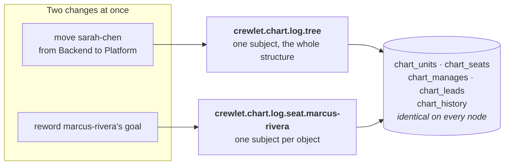

# The Org Chart Domain

Your company's org chart — its units, its seats, and who sits where — is a
**replicated state machine**. Every change to it is one record on an ordered
stream the fleet shares, applied into an identical set of SQL tables on every
node, with each node's position committed in the same transaction as the rows
it wrote.

It is the fourth domain on the [state-log framework](../guides/replication.md),
beside [the tracker](task-engine.md), the [knowledge base](knowledge-system.md)
and the embeddings. If you have read how those work, the chart works the same
way; this page is about the parts that are different, and about what changes
for you as an operator.

---

## Why the chart is a log and not a document

Until now the chart lived inside the Tier B company document — one nested
object, rewritten whole by whoever wrote the document last. That is a fine way
to author a chart and a poor way to *operate* one:

- **A write was the whole document.** Adding one seat re-stated every other
  seat, so two people editing two different teams collided on a revision
  neither of them had touched — and the loser's change was not refused, it was
  overwritten by a value the winner never looked at.
- **There was no per-object contention.** The unit of contention was the
  company, so a reconcile that wanted to touch one team had to take the whole
  chart.
- **A change left no record.** A document revision says what the chart
  *became*. It never says what *happened*: who moved, out of which unit, into
  which, at whose hand, from which config revision. A reorganisation is exactly
  the change a company most needs an audit of.

As a log, each of those is answered by construction. Two leads editing two
seats never contend. A reorganisation is a row with an actor, a revision and a
timestamp on it. And a node that is behind can say *how far* behind it is,
rather than reporting a position it cannot compare to anything.

---

## Two kinds of change, and why they arbitrate differently

This is the one place the chart departs from the shape the tracker and the
knowledge base share, and it is worth understanding because it is what you will
see in a contention error.

**Structure** — who sits under whom, who leads what, what each object is
called, and what the chart no longer names — arbitrates on **one subject for
the whole chart**. Every reparent, every placement, every rename, every removal
and every import contends there, and exactly one wins.

**Content** — a backstory, a goal, a purpose, a channel, a model chain —
arbitrates **per object**, on that unit's or that seat's own subject. Two leads
editing two seats never contend at all.

The reason for the split is that an org chart's containment *is* the object. A
task belongs to a project and a page to a container; in both cases containment
is a field on the thing contained, so two writers moving two tasks into one
project never have to agree about anything. Moving a unit touches two parents
and every ancestor above them — so two moves that are each perfectly valid on
their own can jointly produce a **cycle**, and neither writer ever looked at the
other's subject. One subject for the whole structure makes that state
unreachable rather than merely detectable.

What it costs is that every structural change in the company serialises. That
is deliberate: a chart changes when somebody is hired, moved or promoted, so the
serialised write is the rarest one your company makes, and the ordinary traffic
does not touch it.

```mermaid
flowchart LR
    subgraph writers["Two changes at once"]
        A["move sarah-chen<br/>from Backend to Platform"]
        B["reword marcus-rivera's goal"]
    end
    TREE["<b>crewlet.chart.log.tree</b><br/>one subject, the whole structure"]
    SEAT["<b>crewlet.chart.log.seat.marcus-rivera</b><br/>one subject per object"]
    ROWS[("chart_units · chart_seats<br/>chart_manages · chart_leads<br/>chart_history<br/><i>identical on every node</i>")]
    A --> TREE --> ROWS
    B --> SEAT --> ROWS
```

---

## What it means for you

**The config API no longer writes it, and says so.** A `PUT` or a `PATCH
/config` carrying a top-level `roles:` or `units:` is refused in full with
`400 chart_not_writable_here`, and so is a write to `/config/roles/{handle}` or
`/config/units/{key}`; both stay readable. It is a refusal rather than a quiet
drop because the quiet drop is what actually hurts: a founder sends a whole
document with a new seat in it, the write succeeds, the revision activates —
and the seat is nowhere, with their own document saying it exists.

**It has its own routes instead.** `GET`/`PATCH /chart/units/{key}` and
`/chart/seats/{handle}` for content, `POST /chart/batch` for structure,
`POST /chart/units/{key}/rename` for an address (a one-operation batch),
`POST /chart/import` for a
whole revision's authored placement, and `GET /company/export` for the document
back out. What decides them is **which half of an object you are writing**: the
public half is whoever leads that object, and anything under `runtime` — a
seat's model chain, its credentials, its sandbox cell, its `mcp_env` — takes
the company's own `config:write` grant, because a stdio MCP server is
`exec.Command` with the config's command. Reads split the same way and default
to **stripped**. See
[the `/chart/*` reference](../reference/api-endpoints.md#chart--the-org-chart-auth-gated)
and [Configure via the API](../guides/configure-via-api.md#evolving-the-org-chart).

**Nothing validates the pair, so the engine reports on it.** A settings
revision that removes a provider every seat runs on is a valid revision, and
refusing it would refuse an operator's edit over a seat they have never heard
of — so `GET /chart/check` and `/health`'s `consistency` block carry one
continuous evaluation over the chart this node holds and the settings epoch it
applied. See
[the continuous report](configuration.md#the-continuous-report-what-nothing-can-refuse-at-a-write).

**One of its findings reads the identity directory**, and what it says depends
on whether this node has one. `seat_unheld` is a human seat nobody in the
directory is bound to — a seat the chart holds, work routes to, and no person
can sign in and act as. On a node that runs no identity domain that arm is
**skipped rather than answered**: such a node's copy of that estate is
legitimately empty, so reading it would report every human seat in the company
as unheld. A report that cannot ask does not guess.

**And the seats nobody holds are listable.** `GET /chart/seats?kind=human&unheld=true`
answers the same question as a filter, which is what an invite screen needs
before it asks who to send a link to. On a node with no identity domain the
filter is **refused with `503`** rather than applied to an empty directory —
returning every human seat in the company under a parameter that promised the
opposite is the one failure a screen renders as a finished answer.

**Removing a seat somebody holds is refused, and the refusal is advisory.** The
chart's removal decide reads the directory inside its own snapshot and names
the person, because the ordinary mistake is a reorganisation that takes out a
seat a colleague is still using — after which they sign in and lead nothing,
with no message anywhere saying why.

It is *advisory* rather than arbitration, and the word matters. The chart and
the identity estate are two domains: two logs, two appliers, two anchors. A
bind and a removal can each pass their own decide and both land, and the
residue — a person bound to a seat that no longer exists — is a named legal
state a duty reports, never corruption. Arbitration across the two would need
one log, and one log for the chart and the directory would serialise every
hire against every sign-in.

On a node that cannot read the directory the removal is **refused naming the
node**, not allowed. That is the one place the seam's absence is a refusal
rather than a skip: a report may omit a finding it cannot compute, and a write
may not proceed on evidence it does not have — otherwise a seats-only
satellite is the one place every removal succeeds, and the one place it is
least likely to be noticed.

**A fresh deployment's chart is seeded from the company file**, by `crewlet run
-company company.yaml`, and only while the chart is empty — see
[the boot seed](control-plane.md#the-boot-seed). An OFFLINE `crewlet config
import` is the other way a file reaches the chart: it stages the chart in the
node's own database and the next start publishes it. That one is not a seed —
it publishes over whatever the chart holds, because it is your explicit "this
file is the chart again".

**Your `company.yaml` still holds both halves**, and always will. You author one
document describing a company, `crewlet validate` reads it whole, and `crewlet
config import` divides it: the settings to a revision, the chart to this log.

**A revision written before the split is refused at apply, and served on every
read.** It still carries the chart inside it, so a node applying one would have
to pick between running a chart no other node reads and dropping it to serve a
company with no seats. It refuses instead and names the repair — one `crewlet
config import`. Every read still answers, because that revision is exactly the
one you have to look at in order to repair it.

**Nothing to configure, and one thing you may want to.** The chart's log has a
byte ceiling, `stream.chart_log_max_bytes`, and it is one of two state logs
whose default is *not* derived from your disk: unset, it takes a flat **64
MiB**. The corpus-sized logs grow with something your volume has an opinion
about, and a chart does not — it is hundreds of objects, and it changes when
somebody is hired, moved or promoted rather than on every comment or every
save. At the modelled rate that is **four years** of a completely blocked trim.

It is deliberately *below* every corpus-sized log's 1 GiB floor, because a
floor is a property of the log it was written for: the broker grants a stream
its whole ceiling when it creates it, so this number is free space a node needs
before it can boot at all, and a chart at the corpus floor would reserve a
gibibyte for a log that will not fill one this century. (The
[identity estate](identity-and-access.md#sizing-streamiam_log_max_bytes) is the
other undisked one, and it takes a larger flat default because sessions make it
grow every morning.)

Raise it only if you are reorganising continuously *and* your trim is stopped,
and read [Retention](../guides/retention.md) first, because a stopped trim is
the actual problem in that sentence.

Crossing the ceiling **refuses the append** rather than dropping the oldest
record. Nothing on this stream is derivable from anything else, so shedding
history would be data loss with a tidy name.

**A chart write takes effect on the next turn, everywhere the company reaches.**
Publishing a chart record publishes a *company*, and every node that applies it
brings the same list of things up to it that a config activation does — the
party registry a mention resolves through, the vendor account a seat's
credential names, the seat's own MCP children, the projects and knowledge
containers its units declare, its mailbox, its schedules, and the payloads
every open dashboard renders. Written as two lists it followed only the
activation, and a seat hired this morning was in the org tree and nowhere else:
unaddressable, with no mailbox, on no screen, firing no schedule, until
somebody happened to change a provider. See
[What follows a published company](configuration.md#what-follows-a-published-company).

**A node behind on the chart does not serve turns.** The chart is a *readiness
input*, which means a node that cannot keep up with it is not admitted to run
seats. That is a stronger stance than the engine takes for the tracker or the
knowledge base, and the reason is what a stale chart produces: not wrong output
but *confidently* wrong output. A node behind here routes an escalation to a
manager who no longer holds the seat, hands a turn a roster of people who have
moved, and admits a seat the company has removed. Every other answer the engine
gives is scoped by the chart.

**A key is an address, not an identity.** A unit's key and a seat's handle are
what people type — into `manages:`, into `lead:`, into a vendor mapping. When
one changes, the old key goes on resolving to the same object, so references
somebody already wrote down keep working.

The **identity** is separate and it is what everything durable is named by. Each
row records the address it was created under — `origin_handle` on a seat,
`origin_key` on a unit — written by the object's *first* rename, which is the
last moment that address is still known, and never touched again. A seat's agent
id is derived from the company name and its origin handle, so its mailbox, its
seat lease, its memory changelog and its schedule history all stay where they
were. A unit's origin key is what its scheduled work is keyed on, which is also
what stops two teams that share a display name sharing one fire.

Two alias sets sit beside them and do a different job. `former_keys_json` holds
the addresses an object used to answer to, newest first and **capped**: it keeps
a reference somebody typed resolving, and a reference nobody has followed in
sixteen renames is not worth a row growing for ever. The origin is uncapped and
is one value, because an identity a cap could drop would be no identity at all.

**An identity is never issued twice.** The address an object was created under
resolves to it for ever — however many renames ago it was retired, and after its
alias has fallen off the capped list — and nothing else may take it:

- **No rename onto it.** Another seat renamed onto a retired identity would
  answer to the address the first one's mailbox and diary are named by.
- **No creation onto it**, through either path that creates an object: a
  structural batch refuses it at its decide (`the key is taken`, naming the
  seat that holds it), and an import — which decides nothing at its decide —
  has the placement **declined** at the apply (`chart_apply_declined`, counted
  on `crewlet.chart.apply.declined`). A new object's identity is the address it
  is created under, so a seat created on another's identity would be a second
  seat sharing the first one's mailbox, lease and diary.
- **A removal tombstones it** beside the address the object held, under the same
  record. A removed seat's identity therefore stays unavailable exactly as its
  last address does, rather than becoming free the moment the seat is gone.

**A content write never creates its object.** A creation takes an address, and
an address is exact only where every structural change contends; a content
write contends with nobody but writers of its own object, so one that created
would put a seat in the chart that no structural write ever arbitrated. It is
refused instead, naming `POST /chart/batch` — or, where the rows already say
why the object is not there, naming its removal and the reason given, or the
address it was renamed to. It **waits first**: the batch that created the
object may have been answered `202` and not be applied on this node yet, which
is the ordinary shape of a hire, so the write waits for this node to apply
everything the structure had been written by and decides once more.

**A seat's kind is structure.** Whether a person or an agent holds a seat
decides whether anything runs there — whether a node claims it and gives it a
mailbox, whether a person can be bound to it — so it is stated by the
`create_seat` that makes the seat and changed only by a `set_kind`, on the
tree's one subject, and never by a content write: a lead editing a backstory
cannot turn a person's seat into an agent's. It used to ride in the content
record, which left a hire's seat with no kind at all between its create and its
content — an agent by omission, which a node would claim. A seat's edge carries
its kind as part of its structural post-state, an import's included. Making a
person's seat an agent's is refused while somebody holds it, as a removal is.
A seat an earlier build placed and nothing has filled names no kind in its
stored document and `agent` in the row's `kind` column, and every read of the
row takes the column's — so such a seat is an agent's to every reader, and its
first content write fills it as one.

**A seat nothing has filled is incomplete.** A hire is two records, and the
second may be late or never arrive: until a content record lands the seat has a
place and a kind and no name, backstory or model chain. It is in the chart and
in the organization, so the structure around it reads whole, and **no node
places it** — so a hire whose content never arrives never gets a mailbox. The
signal is the row's own `version`, which only a content record writes, so every
row every build ever wrote answers it the same way.

**A create says it is one.** Every edge a batch publishes carries the verb of
what the batch did to that object — `create_unit`, `create_seat`, `move`,
`set_lead`, `set_kind` or `rename` — beside the object's whole structural post-state, and the apply
decides by it. Without the verb an edge is only a placement, and a placement of
an object the chart already holds is a move: so a create that met an address
somebody had taken since its decide — a rename or a content record from a
build still on the old version, on a subject of its own — moved whatever held
it under the creator's parent and cleared its lead, while the create itself
landed as nothing. With it:

- a **create** whose address is held when it applies is **declined**, and the
  object holding it stays exactly where it is;
- a **move** or a **lead change** whose object a removal took in between is
  declined rather than written back as a new object;
- and a **content** record that meets no row is declined as well, because its
  write refused an object the chart did not hold, so an absent row means a
  removal or a rename the log ordered first.

Each is logged as `chart_apply_declined` and counted on
`crewlet.chart.apply.declined` by what was declined and why, and none writes a
history row: a row saying a unit was created beside a decline saying it was not
would be a history of something that never happened. An import's edges carry no
verb and keep meaning what they always have — create what is absent, place what
is present — because an import states a revision's complete structure and
decides nothing about which of its objects exist.

These are **version 2** of the chart's record. A record a version-1 build wrote
is read for ever as what it meant, under the rules it met when it was first
applied: its edges are placements, its content records may create their row,
each creation is declined only onto a removed address or another object's
identity (a rekey, onto any address somebody else answers to), its history
names its first edge, and none of the rules version 2 added — the address's
shape below, an edge declined under a unit its record failed to make — is asked
of it. That is what keeps one log one chart: a node that applied a version-1
placement of `jane.doe` holds the seat, and a node replaying the same record on
this build must hold it too. A version-1 build meeting a version-2 record
retains it rather than applying a create as a move, and applies it once it is
upgraded.

Every path that gives an address — a create, an import and a rename — asks
**one** set of rules on every version-2 record, so none of them can forget one:
a reserved word (`root`, `tree`, `barrier`, and `none` for a seat), a seat
handle outside the handle grammar (a `.` or a `:` is a login's shape, which
every name lookup sends to the identity directory), a removed address, an
address somebody answers to as a key, or somebody's identity. A rename also may
not take another object's retired alias; a creation may.

A retired alias that is *not* an identity is different and stays takeable by a
new object — the claimant then wins every reference written with it, which is
the rule below. And **a rename onto a removed address is refused** too: the
tombstone that stops the removed object's old records applying is keyed on the
address, so an object renamed onto it would have every later change to it
dropped as a change to the removed one.

**An address somebody still answers to cannot be taken, retired or not.** A
rename onto a key another unit holds is refused, and so is one onto a key
another unit merely *used* to hold — because a retired key still resolves, so
handing it to a second object would silently re-point every reference written
before the first one moved. Renaming *back* is not a collision: an object
claiming an address it used to answer to is claiming something that already
resolves to it, which is the undo an operator is most likely to want.

**A rename is structure**, a `rename` operation in a batch on the tree's one
subject — `POST /chart/units/{key}/rename` publishes exactly that. It used to be
a claim on the new address's own subject, which contended with other claims on
that address and with nothing else: a create of the same address was decided
without seeing the claim, the log could apply it second, and it then met the
renamed unit on its address and moved it. On one subject whichever of the two is
decided second sees the other and is refused, so a rename that loses is a `400`
naming the rule rather than a `200` for a change that never happened. A batch
names each object by the address it has **at that point**, so an operation after
a rename uses the new key, and a unit renamed twice in one batch retires only the
address the batch found it at — an address it held between two operations of
one record was never one anybody could have referred to.

The rule is still asked again at the apply, and **dropped** rather than raised
there: a build mid-upgrade still writes renames and content records on subjects
of their own, so the log can order one of those between a batch's decide and
its apply. The key is a primary key, and an apply that raised would fail on
every node identically, on a record none of them can ever get past, turning one
lost rename into a stalled domain across the fleet. What the batch placed under
an address its own create or rename did not get is declined with it (reason
`parent`), rather than filed under whatever unit answers to that address now.

**An unchanged revision is a no-op.** Re-activating a config revision the chart
has already imported — which is the credential-rotation gesture, and therefore
routine — writes nothing and wakes nobody. Every node reaches that conclusion
the same way, from a ledger row rather than from a comparison each node makes
for itself.

---

## What the engine stores

All of it lives in the **replicated** estate — the second of the node's two
database files, the one a snapshot copies. Nothing here is in the node's own
file, and nothing here is in the coordination store.

| Table | What it holds |
|---|---|
| `chart_units` | One unit: its key, its display name, its purpose and goals, its chat channel, its tracker and knowledge identities, where it sits, and who leads it. Plus `former_keys_json` — the keys it used to answer to |
| `chart_seats` | One seat, agent or human: its handle, its backstory and goal, its contact address, its identities, and which unit it sits in. Plus `email_index`, the matched form of its address, and `document` — which carries the seat's **runtime** half (below) |
| `chart_manages` | One authored `manages:` entry, stored **unexpanded** — a `manages:` naming a unit reaches every seat in its subtree, and that expansion is a function of the tree at the moment it is read |
| `chart_leads` | One unit's authored lead, as an edge. Lead *inheritance* means the effective lead of a team is an ancestor's authored row, so this is walked rather than read |
| `chart_history` | One row per change: what happened, to what, by whom, from which config revision, and when |
| `chart_import_ledger` | Which config revision produced which position on the log, and how many objects it placed. This is what makes a re-activation a no-op, and it is where you look to answer "which revision is this company's structure actually running" |
| `chart_removed` | What the chart no longer names, with the record that removed it and the reason given. A removal is the one operation here with no inverse — nothing ever names a removed object again — so the row is what stops a redelivery writing the object back, and it **outlives the record**: a removal below the trim floor has nothing on the log left to prove it happened |
| `chart_evictions` | Which nodes the fleet has stopped counting on this log, and from which position. Every node reaches the same verdict about every record from it, with no clock and no coordination read — which is what makes it the fence that still holds when coordination cannot be reached at all |
| `chart_log_generations` | One row per reanchor: which generation the new stream opened at, what the previous one's high-water mark was, and who asked |

### What the applier writes, and what it deliberately does not

A **unit and a seat each have two writers**, on two different subjects: the
object's own content, and its placement in the tree. They arbitrate separately
and land in either order, so each apply reads the row, changes **only its own
half**, and writes the whole thing back. A content record that could set a
parent would reparent a team from a change that never mentioned the tree; a
placement that could set a name would revert a rename nobody made. The same
rule is why a placement for an object whose content has not arrived yet is
**normal rather than broken**: an import publishes the structure first, and
each object's content follows on its own subject.

**Half of a seat is opaque here, and that is deliberate.** This domain owns who exists, where they sit and who reports to whom — and it can say what every one of those means, validate it, arbitrate it and render it. It cannot say what an `mcp_env` key is for, what a model chain falls back to, or which sandbox cell a seat runs in. A chart that grew a column per runtime setting would be the company document again with a log underneath it.

So a seat's model chain, tool credentials, sandbox cell, worker grants and schedules travel as **one document the chart carries and does not read**, and a unit's inherited credentials and scheduled work do the same. What is in the *rows* is everything the chart has a column, an edge table or a subject for — and nothing is in both halves. A field in both would be two copies of one fact, of which the copy inside an opaque blob is the one nothing validates, nothing indexes and nothing can arbitrate: a rename that moved the row would leave the old name inside the document, and a reader would get whichever half it unpacked last. A build-time check walks the seat and unit types and fails on a field that is in neither half or in both.

**Nothing here is derived.** There is no table of effective leads, no expanded
`manages:` set, no "who manages whom" the applier computes. Every one of those
is a function of the tree at the moment it is read, and a derived value written
down is a second answer that goes stale the moment an ancestor moves — with
nothing to recompute it, because the change that moved the ancestor never named
the row that went stale. The engine derives them on the way out instead; see
[Organization Model](organization-model.md).

**A rename moves every reference to its object by key.** When a unit's key
changes, every child's parent and every seat's unit follow it in the same
commit, and when a seat's handle changes, so does the lead of every unit it
leads — so no read ever sees a reference to a key nothing answers to. Each of
those rows moves **whole**: its columns and the document the company view is
built from, together, because a row whose column followed and whose document
did not is one the view reads under the old key (dropping a renamed unit's
subtree to the org root) and one its next content write puts back.

The **`manages:` entries** that named the object move with it: every entry that
reached it before the rename — by the address it left, a retired one, or the
one it was created under — names its new address after. Left as typed, an entry
reached the object only through the retired alias, which is capped at sixteen
(so it named nobody after enough renames) and which a new object may take (so a
`create_seat` on the old handle silently gave the manager the newcomer). Two
entries are left, because the organisation reads them as naming something else:
one naming a unit by a key some **seat** also answers to names that seat, since
a seat reading of a spelling wins; and a unit renamed onto a key a seat answers
to keeps the entries on its retired key, which still reaches it, rather than
handing them to the seat. A version-1 rekey on the log left every entry as
typed, and is read for ever as that.

Both edge tables store **what was authored**, including an entry that resolves
to nothing. A `manages:` naming a seat nobody has added yet is kept as written:
a chart is built in pieces, every intermediate revision is applied by every
node, and refusing a partly wired chart would make that sequence impossible.
Dangling references are reported where the tree is read — see
[Organization Model](organization-model.md).

### Reading it back

Every answer carries **the position it was true as of** — not a "hydrated"
boolean. The question a caller has is not "are you caught up", which is a
snapshot of a moving thing and false by the time it is read, but "what did you
know when you answered this". A position answers that and it composes: write at
P, then require your next read to include P.

- **The whole chart is one read.** A company has hundreds of objects, not the
  hundreds of thousands the tracker holds, and every derivation over a chart is
  a walk — so the thing a walk is computed from has to be one answer.
- **A retired key goes on resolving** until something else claims it, and then
  the claimant wins. A key is pasted into chat and typed into `manages:`
  entries, so one that stopped resolving would break every reference anybody
  had already written; but a unit created under a retired name must not
  silently resolve to the old object for ever. The one retired key nothing
  else can claim is the one an object was **created** under — its identity —
  which resolves to it for ever.
- **"Removed" is a different answer from "no such thing."** A tombstone reads
  back with when, by whom and why, so a person asking where their team went is
  told it was dissolved in March and merged into infrastructure, rather than
  that it never existed.
- **The import ledger answers which revision this structure is running**, and
  where on the log it landed. It is what makes re-activating an unchanged
  revision — the credential-rotation gesture, and therefore routine — a no-op
  every node reaches the same way, from a row rather than from a comparison
  each node makes for itself.

---

## What the chart is not

It is not the **organization** a turn reads. `internal/org` builds that: the
normalised tree, with lead inheritance applied and every `manages:` entry
expanded. These tables hold what was *authored*, and every derivation is
computed from them rather than stored beside them — a derived value written down
is a second answer that goes stale the moment an ancestor changes, recomputed by
nothing.

It is also not a second place to edit your company. You author the chart the way
you always have; this is what the engine does with it once you have.

---

## Where to go next

- **[Organization Model](organization-model.md)** — how you author a chart, and
  every derivation the engine performs over it
- **[Replication](../guides/replication.md)** — the state-log framework the
  chart is a domain of, and how the byte ceilings are sized together
- **[Architecture § Where state lives](architecture.md#5-where-state-lives)** —
  every estate, table, bucket and stream in one place
- **[Control Plane](control-plane.md)** — how a config revision reaches every
  node in the first place
- **[API endpoints § `/chart/*`](../reference/api-endpoints.md#chart--the-org-chart-auth-gated)**
  — every route, what each one takes, and what a write's three outcomes mean
