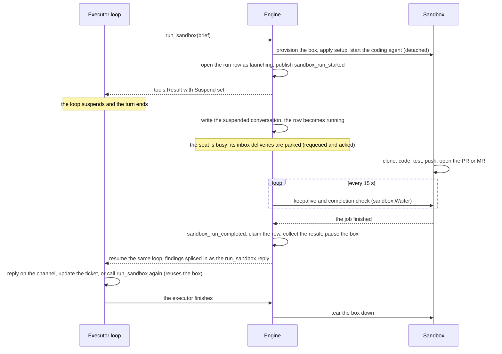

# Code Sandbox

> **v1 status.** Both backends run — `e2b` (a remote VM per run, on the vendor
> cloud or a self-hosted cluster) and `local` (the engine host, as a process
> tree or in a container) — and the engine-fronted OTLP receiver is wired.
> `providers.sandbox` is a **catalogue**: configure either backend or both, and
> each seat picks its cell with `role.sandbox.run_in`.

Crewlet agents author code through the **`run_sandbox` Execute tool**: the executor calls it with a concrete code task, the engine provisions an isolated sandbox (a real VM with a shell, a filesystem, and a git checkout), and a **coding agent** — Claude Code or OpenCode — works on the task autonomously inside it. The call is **detached**: the Execute tool-loop *suspends* when the job starts, the engine persists the in-flight conversation, and when the job completes — minutes or hours later — the **same loop resumes** with the coding agent's findings spliced in as that tool call's reply. The executor then reports and acts with its own tools (replying on the originating channel, updating the ticket) in the same turn, with full context.

This is how a Crewlet agent implements a feature, makes tests pass, reproduces a bug, or runs a one-off script — anything that needs a shell and a checkout. The sandbox is the isolation boundary: arbitrary, autonomously generated code runs *there*, never on the engine host, which is why the coding agent can run fully permissioned (Claude Code `--permission-mode bypassPermissions`; OpenCode `permission: "allow"`).

The moving parts live in `internal/sandbox/` — the provider, the manager, the coding-agent runners under `codingagent/`, the waiter, the coordinator, the pending store, and `launch.go`, which is the plumbing between the Execute loop and a detached run.

---

## How a coding task runs

For a role gated with `role.sandbox.enabled` (and an engine-level `providers.sandbox`), the [turn engine](turn-engine.md) exposes `run_sandbox` on the executor's tool surface. The executor calls it with a `brief` — the concrete task, naming the repository and the exact change or investigation — and reports the result in the same turn.



The details, each load-bearing:

- **Call → suspend.** `run_sandbox` provisions the box, starts the coding agent as a background command, persists a durable run record in the [coordination store](coordination.md) (the brief, the task, both conversation values — the conversation identity a later answer is matched on and the resume reports back to, and the inbox partition the kick-off trigger arrived in — the trace context, and whether the turn owes anybody an answer), and returns a `tools.Result` with `Suspend` set. The Execute loop leaves that call unanswered and the turn ends. The launch publishes `sandbox_run_started` to the seat's control topic, and the coordinator marks the seat busy from the pending store's own list of the seat's active runs. Nothing is parked in memory; everything the resume needs is in the row.

  **The record lands in two writes, and the state says which one it is at.** The serialized Execute conversation — the messages, including the dangling `run_sandbox` call — cannot be written by the tool: the runner holds it only until the turn's frame unwinds, which happens *after* the call returns. So the launch opens the row as `launching` and the unwinding turn writes the conversation, flipping it to `running` in the same compare-and-swap. In between, the job is already executing and the row has nothing to resume into — so **nothing polls or claims a `launching` run**. A completion fired in that window used to be claimed against an empty conversation, and the coordinator, finding nothing to re-enter, failed the run: a coding job that finished before the turn unwound destroyed the agent's whole turn, permanently and with no retry. The window is milliseconds on an idle host and hundreds of milliseconds on a loaded one, and a trivial run is exactly the one that fits inside it.
- **Busy while it runs.** While a run HOLDS the seat, every delivery to its inbox is **parked**: the dispatcher requeues it onto the inbox and acks the original, so nothing is held against a broker ack window during an hours-long job and no new turn starts. The one delivery it answers instead is a person's reply to a clarification question one of the seat's runs asked. The agent runs **one coding job at a time**: the first call that suspends ends the round. A run parked waiting on a human answer holds nothing — the seat works as usual, and its deliveries are offered to that question before they become turns (see [Mid-run clarification](#mid-run-clarification-crewlet-ask)).

  Nothing pauses the inbox itself, so a seat parked on a long run cycles its requeued deliveries for the length of the run; the same-id dedupe and the completion ledger keep that from losing or repeating work (see the known gap under [Turn Engine: Runtime invariants](turn-engine.md#runtime-invariants)).
- **Completion → resume.** The completion event is claimed **at-most-once** (an atomic status flip on the row) and **only for the job it reports**: every launch gets a new id on the row and the completion carries it, so a duplicate that arrives after its job parked on a question, or after the resumed executor started the next job, claims nothing. The result is collected, tokens are post-accounted once per run (see [Budgets](#budgets)), and the suspended loop is rebuilt from the row: the saved messages, the activated tools and loaded skills replayed, and the coding agent's findings appended as the `run_sandbox` call's reply, framed as "the sandbox did the code work; don't redo it; report / act now". The same `turn_id` continues, so the whole sequence renders as one turn on the dashboard — and so does the round count: the loop re-enters the round the executor parked in, so a suspend and its resume share one `turn_engine.max_iterations` instead of getting one each. A failed resume dispatch hands the claim back, to the status it was taken from, so the redelivered completion can retry, and the suspended loop is never lost. That includes a resume a drain interrupts: the hand-back does not inherit the drain’s cancellation, so the seat’s next owner resumes the turn rather than reaping it as abandoned. The one exception is a resumed turn that broke after it had already written outside the engine (pushed a branch, commented on an issue): a retry would repeat those writes, so the run is settled instead, its box reclaimed and its record deleted, and the seat is freed. Otherwise it hands back only the claim it took: when the resumed executor has already started another job in the turn, or the seat's next owner has reaped the run as abandoned, the row is left as it stands, because the relaunch replaced the conversation a retry would re-enter and the reap has already ended the run.
- **Reuse across calls.** The box is a per-Execute-phase resource. On collect it is **paused** (snapshotted), not destroyed; if the resumed executor calls `run_sandbox` again — a follow-up fix, a clarification answer to incorporate — the tool reattaches to the same paused box and checkout (clearing the previous run's result markers, keeping the disk state) and suspends again. When the resumed Execute finishes *without* another call, the box is torn down. The two are told apart by the launch id, not the row's status: a new job that finishes, or parks on a question of its own, before the resumed turn has returned keeps its box and its tail.
- **A settled run has no record.** When a run ends, whether its resumed Execute finished or it was lost, its box is reclaimed first and then its record is **deleted** from the coordination store. The record's bucket has no age (a parked run can wait days, and an age would reap the only thing that knows a billed box exists), and the completion poll and every seat recovery read all of it, so a finished run kept there would be read on every one of those passes for the life of the deployment. What a run ended as is recorded elsewhere: the resumed turn's own phase events, or a `sandbox_run_failed` event naming why it was lost. The box goes first on purpose: a record that outlives its box is reaped by the seat's next recovery, while a box that outlived its record would be named by nothing.
- **Review sees the whole turn.** The tool-execution log from the suspended segment (the `run_sandbox` call and anything before it) is replayed to the front of the resumed loop's log, so Review's evidence check sees the code work happened. The clone/test/push commands run *inside* the box, never as engine-visible tool calls — a successful `run_sandbox` call *is* the code work.

There is deliberately no synchronous "block the turn until the sandbox finishes" mode: a turn that held its concurrency slot and its broker message for a real coding job's runtime would trip the inbox ack window and the shutdown drain. A short job in the detached model simply completes fast.

---

## Enabling it

Two switches, both required: an **engine-wide provider** and a **per-role gate**. Without the provider, no role can use the sandbox regardless of gates; without the gate, a role never sees the `run_sandbox` tool.

### Engine provider — `providers.sandbox`

A sibling of `providers.llm`, live-reloadable, with secrets kept as `${VAR}` references and resolved at construction time:

```yaml
providers:
  sandbox:
    # THE CATALOGUE: which boxes exist. Configure either, or both.
    e2b:
      api_key: "${E2B_API_KEY}"   # required whenever e2b: is present — the API
                                  #   authenticates every call
      domain: ""                  # set → self-hosted / local cluster; empty → the cloud
      template: ""                # empty → the prebuilt template for the coding agent;
                                  #   ALSO how a remote box is sized (below)
    local:
      state_dir: ""               # empty → $CREWLET_SANDBOX_LOCAL_HOME,
                                  #   else ~/.crewlet/sandboxes
      image: ""                   # required only if some seat runs in a container
      runtime: auto               # auto | docker | podman
      run_args: []                # how a container box is SIZED

    default_run_in: e2b           # direct | container | e2b — where a seat that
                                  #   names none runs
    default_coding_agent: claude-code   # claude-code | opencode
    default_timeout_seconds: 900  # box TTL / keepalive window — NOT a run cap (below)
    default_pause_ttl_seconds: 1800     # omit for this default; 0 = never pause. how long a blocked run's paused box is
                                        #   held before the reaper takes it
    default_max_turns: 0          # agentic-round cap for coding runs; 0 = uncapped
    setup: []                     # engine-wide provisioning steps (see Setup steps)
```

- **The block is a catalogue, not a mode.** It says which boxes *exist*; `role.sandbox.run_in` says where each seat's work goes. This is the shape's whole reason: a company has exactly one `providers.sandbox`, so a company-wide `type:` meant choosing the engine host for the seat that needs the operator's own subscription login *and* for the seat whose generated code must never touch that host. Those are different decisions about different work. **Leave the block out entirely** to run with no sandbox at all — there is no `type: none` any more, because an absent block already says it and a present one that meant "off" read as "on" in every document that carried it.
- **An empty block is refused.** `providers.sandbox: {}` configures nothing, and without this rule it would apply cleanly: every sandbox-enabled seat plans around a box it never gets, and code work quietly never happens. Give it `e2b:`, `local:`, or `fake: true`.
- **`default_run_in` is required unless the catalogue names exactly one cell — or nothing would read it.** `local:` alone is **two** cells (it serves both `direct` and `container`), and there is deliberately no implicit answer: `direct` runs the coding agent as the engine's own user, and `e2b` mints billable VMs, so neither may be chosen for an operator who did not say which they meant. Only an `e2b:`-only catalogue (and `fake: true`) resolve on their own. What makes the default *required* is something that would fall to it: a sandbox-enabled seat with no `run_in`, or an agent-mode entry with no `cli.run_in`. A company whose every such seat and entry names its own cell needs no default at all — that is the shape the catalogue exists for — and validation refuses the silent seat or entry **where it is written**, offering `default_run_in` as the other remedy.

The one thing an ambiguous catalogue may not do is reach **nothing at all**: a default, a seat's `run_in` or an agent-mode entry's `cli.run_in` has to name some cell. A backend is built only for a cell something reaches, so a catalogue nothing names builds none — and because the sandbox runtime is assembled **once at boot**, adding a sandbox-enabled seat later with a live Tier B edit would apply cleanly and leave code work silently not happening for the life of the process. Every catalogue that resolves a default reaches it, precisely so a seat added later has somewhere to go.
- **`api_key`, `domain` and `template` live under `e2b:`**, where they can only mean what they say — a `domain:` at the top of the block used to read as a cluster address beside `type: local` and configure nothing. The key is **required** whenever `e2b:` is present, including against a self-hosted cluster: `domain` changes *which* API is talked to, never whether it authenticates.
- **`local.image`, `runtime`, `network` and `run_args` are container-only**, and are checked against the cells your seats actually reach: an image is **required** when some seat runs in a container and **refused** when none does, because there it looks like configuration and configures nothing. Required unconditionally it would refuse a perfectly good direct-only company; unchecked, the seat's first coding run fails at container create, minutes into a turn.

- **`default_timeout_seconds` is not a run-time limit.** It is the box's TTL / keepalive window: the completion poll refreshes a running box's TTL to this value on every tick, so the clock never kills a live job. It is effectively the *orphan-reclaim grace* — how long a box outlives an engine that stopped heart-beating (a crash) before E2B reaps it. A coding job is never force-stopped on a timer.
- **`default_pause_ttl_seconds`** bounds how long a run blocked on a human answer keeps its *paused* box. E2B holds a paused sandbox indefinitely — there is no provider-side TTL — and bills for the snapshot, so expiring it is the engine's job: past this age the completion poll [reaps it](#mid-run-clarification-crewlet-ask) and the run re-seeds from the pushed branch when the answer arrives. 30 minutes trades a bounded snapshot bill against exact resume for the replies that come back quickly; raise it if your teams answer in hours. `0` means never pause — the box is torn down the moment the run blocks, for zero snapshot cost — and *omitting* the key is how you take the 1800s default. The two are different settings and the field distinguishes them, which it did not before: read as a plain number, an explicit `0` was indistinguishable from an absent field and was quietly mapped onto the default, so a company that asked for zero snapshot cost was billed for every paused box for half an hour. Negative values are rejected here: an unbounded pause is the leak the knob exists to prevent. A *role* inherits this default by leaving `role.sandbox.pause_ttl_seconds` out entirely — the older spelling, `-1`, still means the same thing and is still accepted. Correctness never depends on the box: the durable state is the pushed branch plus the persisted row.
- **`default_max_turns` is the only engine-side bound on a runaway coding agent.** A coding job is deliberately never force-stopped on a clock (see `default_timeout_seconds` above), and the completion poll refreshes a running box's TTL on every tick precisely so that it cannot be — so nothing else stops an agent that is thrashing rather than working. This caps its agentic *rounds* instead, which is a measure of work done rather than time spent. `0`, the default, is uncapped: the right number depends on the tasks a company gives its agents, and a cap set too low truncates real work mid-task, which is worse than the runaway it was guarding against. There is no companion budget cap — the fleet's own [token meter](agent-learning.md) already post-charges a collected run against the seat's budget, and a second ceiling denominated in the operator's dollars would just disagree with it. A role overrides this with `role.sandbox.max_turns`.
- **Sizing is `template`, not a limits knob.** There is deliberately no `default_limits`. A box's vCPU and RAM are properties of its **template**, fixed when the template is built; the sandbox-*create* API accepts no resource arguments at all, and disk is not exposed in either place. An engine-side limits field could only ever be parsed and dropped — an operator setting `memory_mb: 16384` would silently get whatever the template had. To give agents bigger boxes, build a template with the resources you want and name it in `template:`; a `container` box is sized with `local.image` and `local.run_args` instead. There is no per-run or per-seat template field: sizing is a property of the backend, configured once, and the `Spec` field that used to sit in front of `e2b.template` was set by nobody while looking exactly like a wired knob.
- **Hot-reload:** a changed `providers.sandbox` rebuilds the manager and its backends on the next apply (`Coordinator.SetManager`); in-flight runs keep their rows, and the next launch picks up the new backends. The coordinator and the completion poll are built once, at boot, and only when the booting company reaches a sandbox cell, so a node that booted with no sandbox runtime needs a restart before a revision that adds one offers `run_sandbox`.

### Per-role gate — `role.sandbox`

Absent → the role never sees the sandbox option. Present with `enabled: true` → the `run_sandbox` tool appears in the role's Execute surface (and the executor is taught when to use it).

```yaml
roles:
  - name: Senior Engineer
    mcp_env:
      github: { Authorization: "Bearer ${GITHUB_TOKEN_SENIOR}" }
    sandbox:
      enabled: true
      run_in: ""                        # direct | container | e2b
                                        #   empty → inherit providers.sandbox.default_run_in
      coding_agent: ""                  # empty → inherit providers.sandbox.default_coding_agent
      # pause_ttl_seconds:              # leave out → provider default; 0 → never hold a paused box
      # max_turns:                      # leave out → provider default; 0 → uncapped
      env:                              # env injected into this seat's runs, ${VAR}-expanded
        GITHUB_TOKEN: "${GITHUB_TOKEN_SENIOR}"   # this seat's own PAT (git-auth recipe + gh)
        NPM_TOKEN: "${NPM_TOKEN_SENIOR}"
      mcp:
        servers: [github, atlassian]    # which of the role's MCP servers the coding agent gets
      setup:                            # per-role provisioning steps, applied after the
        - name: node                    #   engine-wide providers.sandbox.setup
          commands: ["corepack enable"]
          brief: "Node 22 + pnpm are preinstalled; use pnpm for installs."
```

`role.sandbox.env` is where **external-service tokens are declared** — the engine names no tool-specific variable of its own (see [Credentials and the run environment](#credentials-and-the-run-environment)). By convention a seat points `GITHUB_TOKEN` / `GITLAB_TOKEN` at the *same* `${VAR}` as its `mcp_env` code-host credential, so PRs/MRs land under the agent's own identity — see [GitHub](../integrations/github.md) and [GitLab](../integrations/gitlab.md).

---

## Where code work runs

`role.sandbox.run_in` names one **cell** of the catalogue. The three cells and the two backends behind them:

| `run_in` | Backend | Runs as | Isolates state | Isolates the **host** | Needs |
|---|---|---|---|---|---|
| `direct` | `local:` | the engine user, on the host | yes | **no** | the coding CLI installed on that host |
| `container` | `local:` | a PID in a Docker/Podman container | yes | yes | `local.image` with the coding CLI |
| `e2b` | `e2b:` | a fresh remote VM per run | yes | yes | `e2b.api_key` |
| `self` | *none* | inside this seat's own executor run | — | — | an executor in [agent mode](subscription-llm-backends.md#agent-mode) |

**`self` is the one cell with no backend**, because it *is* the
executor's box. A seat whose executor is a coding CLI in agent mode
already holds a shell, an editor and a checkout; provisioning a second
box beside it would give the seat two filesystems with the work in the
one the turn cannot see. So `run_sandbox` refuses on such a seat with a
message saying to use the shell it already has, and nothing is
provisioned. It is refused on any other runtime — there the seat has no
shell of its own, and `self` would read as a working choice while
quietly turning code work off — and it cannot be a company-wide
`default_run_in`, which would do exactly that to every seat that is not
in agent mode.

An **agent-mode executor** is placed by its own entry's `cli.run_in` rather than by the seat's, because where that runtime runs is a property of the runtime: the CLI's subscription login is on the engine host, so a local cell reaches it directly while a remote one needs the headless token instead. A seat that names none takes `providers.sandbox.default_run_in`, resolved at **launch** rather than at config time, so changing the catalogue reaches every seat that wrote nothing without rewriting their blocks. The entry's cell is **reached** exactly as a seat's is: the backend behind it is built for it, and `run_in: container` there needs `local.image` just as it would on a seat. Validation refuses the impossible and nothing else: a `run_in` whose backend is not configured — on a seat or on an agent-mode entry — a company default naming an unconfigured backend, a seat or agent-mode entry that names no cell against a catalogue with no default, an agent-mode entry in a company with no catalogue at all, and a seat with an enabled gate in such a company — each of which otherwise reads as working configuration and fails inside a turn.

**A run remembers its cell.** The placement is written onto the run's durable row *before the box exists*, and reconnect, teardown and the pause reaper all read it from there. It is not re-derived: the turn that collects a run may be a different process on a different node, days later, with the company configuration applied again in between — and reconnecting to a remote box through the local backend does not error usefully, it reports a box that has vanished, so a job that is still running would be abandoned as gone. A row written before the field existed decodes empty and takes the default, so a rolling upgrade strands nothing.

### Sandbox backends

The provider layer is pluggable behind the `sandbox.Provider` interface (`internal/sandbox/protocol.go`). Two backends run code, and one stands in for them:

- **E2B cloud** (`e2b:`, no `domain`). Sign up at [e2b.dev](https://e2b.dev), export `E2B_API_KEY` from the dashboard. The engine talks to the documented REST API directly — there is no Go SDK to install, and no optional dependency for any of this — and uses E2B's prebuilt [`claude`](https://e2b.dev/docs/agents/claude-code) / [`opencode`](https://e2b.dev/docs/agents/opencode) templates (the coding-agent CLI preinstalled), picked automatically per coding agent when `template` is empty.
- **Self-hosted / local E2B** (`e2b:` + `domain`). E2B's infrastructure is open source ([e2b-dev/infra](https://github.com/e2b-dev/infra)); set `domain` to your cluster's domain and the **same code path** talks to it — one field is the whole cloud↔self-hosted switch, because the control-plane address and every box's own hostname are both derived from it. The cluster still issues its own key.
- **[Local](#local-sandboxes)** (`local:`). The engine host itself — `run_in: direct` (a process tree) or `run_in: container` (Docker/Podman). No remote account and no API key, and the coding agent can use the **subscription login** `crewlet llm login` already established. See below.
- **`fake: true`** — deterministic in-process stubs (`internal/sandbox/fake.go`): an in-memory filesystem, scripted coding-agent results, no network. The unit-test substrate; it does **not** run real code. It answers **every** cell, and is refused beside a real backend — the double *replaces* the backends rather than joining them, so a real block underneath it would read as configuration and configure nothing.
- **No sandbox at all** — omit `providers.sandbox`. Sandbox-gated seats fall back to the native executor loop, and `run_sandbox` never appears. (A seat with an enabled gate in that company is refused, rather than silently offered nothing.)

The closed set `run_in` is checked against is exactly the set the engine can construct — a test walks it, because a value the config accepts and the engine cannot build fails at the first coding run and nowhere earlier. The engine builds a backend only for the cells your company actually **reaches**, read from the same computation validation uses: built eagerly instead, it constructed a container backend for a company whose seats all run `direct` and failed the apply demanding an image the validator had just refused as a field nothing would read.

> **Two planes, and they behave differently on purpose.** The control plane (`api.<domain>`) mints, kills, pauses and re-times boxes under a bounded timeout, because minting a VM is a real allocation with a real cost when it is abandoned. The in-box plane — running commands, reading and writing files — is reached on each box's own hostname and carries **no overall deadline at all**: a coding agent's foreground command legitimately runs for many minutes, so what bounds it is the gap *between* output frames rather than the length of the call.

### Local sandboxes

The `local:` backend runs the coding agent on the machine running `crewlet run`. It exists for the case the [subscription LLM backends](subscription-llm-backends.md) create: you already logged a coding CLI in on that host, and you want code work to use that same login — no E2B account, no API key, no token to mint.

```yaml
providers:
  sandbox:
    local:
      state_dir: ""               # empty → $CREWLET_SANDBOX_LOCAL_HOME,
                                  #   else ~/.crewlet/sandboxes
    default_run_in: direct        # direct | container — no implied answer
    default_coding_agent: claude-code
```

Both shipped examples pair a `local:` catalogue with `run_in: direct`, and the difference between them is worth reading side by side. [`examples/nimbus.company.yaml`](../../examples/nimbus.company.yaml) runs `opencode` as the coding agent inside the box and has a code host to push to, so its runs open merge requests. [`examples/nimbus-claude-cli.company.yaml`](../../examples/nimbus-claude-cli.company.yaml) takes it one step further and has **no code host at all**: its three engineering seats run a `cli-agent` entry in [**agent mode**](subscription-llm-backends.md#agent-mode), so the *executor itself* is the coding CLI's own agentic loop in a box that reuses the operator's Claude login, and each seat's `role.sandbox.run_in: self` says its code work rides that run rather than starting a second box.

That second shape is worth saying out loud, because a sandbox and a code host are often assumed to come together. A sandbox with nowhere to push is still a place to run code: a spike, a benchmark, a reproduction, an SDK example that has actually executed. Add a code host later and the same runs start opening merge requests; nothing about the sandbox block changes.

**`local:` alone still needs a `default_run_in`** (or a `run_in` on every sandbox-enabled seat), because it serves two cells and choosing `direct` is choosing to run an autonomous coding agent as the engine user. It carries no mode of its own any more: `direct` and `container` are a choice about **one seat's work**, and a block-level mode could only ever answer for every seat at once.

| | `run_in: direct` | `run_in: container` |
|---|---|---|
| Runs as | the engine user, on the host | PID inside a Docker/Podman container |
| Isolates state (per box) | yes | yes |
| Isolates the **host** | **no** | yes |
| Needs an image | no | yes (`image:`, no default) |
| System paths in setup steps | refused | work, as on E2B |
| Sizing | the host | `run_args: ["--cpus", "2", "--memory", "4g"]` |

**Both modes isolate state.** Each box gets its own directory with `HOME`, the XDG variables and `TMPDIR` pointed inside it, an **allowlisted** environment (PATH, locale, TLS trust, proxy — never the engine's own `SLACK_BOT_TOKEN` or database DSN), and an empty per-box workspace as the working directory. In `container` mode the run environment is handed to the runtime through an `--env-file` inside the box rather than as `-e KEY=value`, because a process's argv is world-readable on the host (`/proc/<pid>/cmdline`, every `ps`) and that environment carries the seat's LLM key and whatever token `role.sandbox.env` declares.

**Boxes are removed at teardown, and a crash-orphaned one is reaped on the next create, but only when it is genuinely orphaned.** Two independent questions are asked. *Is anything running in it?* A live process group that is still the box's own job (`direct`) or an existing container, read from the operating system rather than inferred. *Has anything touched it?* The completion poll refreshes a keepalive stamp on every tick, which is what `Sandbox.SetTimeout` means on this backend, exactly as it refreshes an E2B box's TTL. A box is reaped only when both say no: nothing running, and nothing has touched it for a whole `default_timeout_seconds`. A run blocked on a human answer is covered by the first (its process group is stopped, not gone) and bounded by `pause_ttl_seconds`, which is the knob that owns that wait. A reaped box still gives back any login the run refreshed before it was abandoned.

**A pid is not an identity.** A `direct` box records its job's process group as the leader's pid *together with the leader's start time*, read from the kernel's own process record (`/proc/<pid>/stat` with the boot id on Linux, `sysctl kern.proc.pid` on macOS) while the engine still holds the unreaped process. Every later act on that record, from a different process or hours on, first asks whether the group is still that one: the kernel hands a pid out again once its process is gone, and a bare pid read back from disk may by then lead somebody else's processes. A recorded group that is gone or now belongs to a later process keeps no box alive and receives no signal, so a teardown, a kill or a clarification pause can never reach a stranger's tree. When the kernel's record cannot be read, the reaper keeps the directory and a signal is withheld and logged (`local_sandbox_signal_withheld`), because neither can tell a live job from a recycled pid.

**Only `container` isolates the host.** In `direct` the coding agent runs with its own tools enabled as the engine user, so it can read what that user can read and reach what its credentials reach. That is the normal bargain of a local mode, and it is the right one on a workstation or a dedicated VM — but it is not a security boundary, and Crewlet will not pretend otherwise. On a shared host, or anywhere the work is untrusted, give that seat `run_in: container` — or point the whole company at it with `default_run_in`:

```yaml
providers:
  sandbox:
    local:
      image: ghcr.io/acme/crewlet-coding:1   # must have the coding CLI installed
      runtime: auto                          # auto | docker | podman
      network: ""                            # "none" cuts the box off entirely —
                                             #   including from its own LLM
      run_args: ["--cpus", "2", "--memory", "4g"]
    default_run_in: container
```

The box directory is bind-mounted at `/home/user` — the same home E2B uses — so in-box paths, setup steps and briefs are identical across the two backends. The container is started with `--init` so a finished detached job is reaped rather than left as a zombie (which the completion probe would read as *still running*).

**The container runs as the engine's own user, and the mount is proved before the box is used.** A bind mount is one directory shared by two processes, so both of them have to be able to manage what the other writes. Under a **rootful** Docker or Podman the container's root is the host's root, and every directory the box creates in the mount comes out root-owned — the engine, which is not root, can then neither install the agent's `crewlet-ask` shim into it nor reclaim the box's disk at teardown, so box directories accumulate on the host with no error anywhere. Crewlet therefore passes `--user <uid>:<gid>` on a rootful runtime and **not** on a rootless one, where the user namespace already maps container root onto the invoking user and `--user` would map it into the subuid range instead. The runtime is asked which it is (`docker info` / `podman info`); an unanswerable probe is treated as rootful, because that mistake fails loudly at creation while the other is silent.

If your image genuinely needs its own user — one that installs packages at run time, say — put `--user 0:0` in `run_args`. Operator flags are spliced last and both runtimes take the final occurrence of a repeated flag, so yours wins. Be aware you are taking back the problem above.

Every container box is then proved once, at creation, before anything runs in it: the engine writes a token the box reads back, and the box creates a directory the engine writes into and removes. That catches the ownership case and one other that is otherwise invisible — a `runtime` pointed at a daemon on **another host** (`DOCKER_HOST`, a forwarded socket) bind-mounts *that* machine's filesystem, so the agent finds no brief, no credentials and no shim. A box that fails the proof is torn down and the error names the cause; use the `e2b` provider for a genuinely remote runtime.

**Setup commands get a provisioning budget, not a control one.** Each command may run for `timeout_seconds` (default 600). Real provisioning — a dependency install, a cold image pull, a large clone — takes minutes, and without its own budget these inherited the backend's control-plane timeout and were killed, failing the whole acquisition. Raise it for a step you know is slow; lower it for one that should be instant, so a hung command surfaces as a named setup failure rather than eating the turn. A failure reports the step and the command's position, never the command text: `${VAR}` references in commands are resolved before they run, so the text can carry the credential it was given.

**Setup steps and the local cells.** `direct` has no filesystem virtualisation, so a setup step that writes a *system* path is refused with an error naming the mode — it would otherwise write to the engine host's real `/usr/local/bin`. The [git-auth recipe](#the-git-auth-recipe) above is one of these; under `direct`, root it in the box's home instead:

File paths in a setup step are absolute and are **not** shell-expanded, so `$HOME` does not work there — write the helper with a `commands` heredoc, which does run in a shell:

```yaml
setup:
  - name: git-auth-local
    commands:
      - mkdir -p "$HOME/.local/bin"
      - |
        cat > "$HOME/.local/bin/git-credential-crewlet" <<'SH'
        #!/bin/sh
        ...
        SH
      - chmod +x "$HOME/.local/bin/git-credential-crewlet"
      - 'git config --global credential."https://github.com".helper "$HOME/.local/bin/git-credential-crewlet"'
```

`container` mode needs no such change.

**Credentials.** When the role's resolved sandbox LLM provider is a [`cli-agent`](subscription-llm-backends.md) entry, the local backend seeds that provider's credential files into the box before the run and writes a **refreshed** one back afterwards — OAuth access tokens expire in hours and most vendors rotate the refresh token with them, so discarding the rewritten file would log the fleet out at the next expiry. A credential the operator has since removed with `crewlet llm logout` is never re-created from a box.

**Pause / resume works.** A run blocked on a human answer is genuinely suspended: `direct` SIGSTOPs the job's process group, `container` issues `docker pause`. Both hold memory, which is exactly why the same `default_pause_ttl_seconds` reaper bounds them as it bounds a billed E2B snapshot.

**What local mode does not give you:** template-based sizing (use `run_args`, or the host), provider-enforced network egress policy (use `network:` plus your own firewall), and a fresh machine per run — a `direct` box shares the host's installed toolchain, which is usually the point.

---

## Coding agents

Two runners ship behind the `sandbox.Runner` interface, selected by `role.sandbox.coding_agent` (falling back to `providers.sandbox.default_coding_agent`). Both are handed the same brief and return the same structured result; the engine treats them interchangeably.

### Claude Code

Runs headless — `claude -p "<brief>" --output-format json --permission-mode bypassPermissions` — and its JSON output maps directly onto the result (final text, session id, token usage, cost).

Claude Code **speaks the Anthropic API only**, so it needs an Anthropic-compatible credential. The sandbox's LLM derives from the role's provider chain: `role.llm_sandbox` → `llm` → `default`. Point `role.llm_sandbox` at an `anthropic` `providers.llm` entry (a custom `base_url` on that entry becomes `ANTHROPIC_BASE_URL`, so an Anthropic-API gateway works). A role whose resolved provider is *not* Anthropic-compatible cannot launch Claude Code: the launch fails with a `SandboxCredentialError` (see [Failure modes](#failure-modes)) unless `ANTHROPIC_API_KEY` (or a Bedrock/Vertex/Foundry toggle) is supplied in `role.sandbox.env`.

**A subscription counts.** When the resolved provider is a [`cli-agent`](subscription-llm-backends.md) entry, the headless subscription token (`CLAUDE_CODE_OAUTH_TOKEN`, minted by `crewlet llm login <key> -capture-token`) is exported into the box and Claude Code there bills your Pro/Max plan — no API key anywhere. This works on **every** backend including remote E2B, because a token is one scoped, revocable variable. The credential *files* deliberately never leave the engine host: they carry a refresh token whose rotation is shared fleet state. A CLI that mints no headless token (Codex, Gemini CLI) therefore needs a [local cell](#local-sandboxes) — `run_in: direct` or `run_in: container` — where the coding agent reads the login directly.

### OpenCode

Runs `opencode run "<brief>" --format json` and is **provider-agnostic**: it works with any OpenAI-compatible endpoint, so it reuses the LLM provider the role already has — no extra secret. An org whose only provider is OpenAI-compatible should keep `default_coding_agent: opencode` rather than pay for a parallel Anthropic credential.

The runner **writes the provider configuration into the sandbox itself**: when the role's provider pins a custom `base_url`, it declares a custom provider (`crewlet`) in `opencode.json` with an explicit `baseURL` and the exact model, addressed as `crewlet/<model>` — bypassing OpenCode's Models.dev catalog and the vendor default endpoint, both of which would otherwise break a custom gateway (`ProviderModelNotFoundError`, or silently hitting `api.openai.com`). The API key is referenced via OpenCode's `{env:VAR}` interpolation, so the secret rides the sandbox env and is never written into the config payload. The same `opencode.json` sets `permission: "allow"` (headless runs have no human to approve a prompt — a gate left at `ask` is auto-rejected, which notably kills runs whose checkout lives outside OpenCode's cwd), `share: disabled`, and `autoupdate: false` (a CLI that updates itself mid-run swaps the tool under the brief while the seat's turn is suspended waiting on it). That file is written on **every** run, including one that names no provider and no server: OpenCode takes no config flag, so the file's location in the checkout is the wiring — a run that wrote none would not fall back to the vendor's defaults, it would inherit whatever the previous run left on a reused box, MCP block and dead per-run bridge URL included.

OpenCode exposes no stable token/cost envelope, so those fields stay zero on its runs — honest accounting over fabricated numbers.

### Runs are uncapped; the transcript is published

A detached coding job is **never force-stopped on a wall-clock timer**. The waiter refreshes the box's TTL every poll tick (keepalive), so a legitimately long run is free to finish; the TTL only reclaims a box the engine has stopped heart-beating for. Completion is detected by tracking the job itself — see [Durability and completion](#durability-completion-and-observability).

Because the brief instructs the coding agent that it is *not* the last step, it writes a structured **findings report** to a known file before stopping; `collect` prefers that file for the result text (it survives an agent that finishes but never exits, and a tool-only run that streamed no final message). The runner also reconstructs an **activity transcript** — for OpenCode from its line-flushed `--format json` event stream (`[tool] bash: <command>`, errors flagged), for Claude Code from captured stderr — and the engine publishes it, tail-capped and **secret-redacted**, as the run's Execute phase event. The dashboard renders the findings as markdown with the transcript as a collapsed step list, so an operator reads exactly what the sandbox did. A sandbox Execute therefore shows as three phase rows under one turn: the kickoff (the executor's reasoning + the launch), the coding-agent output, and the resume (the executor reporting/acting on it).

---

## Setup steps — provisioning the box

A coding agent's box needs environment wiring beyond the CLI itself: git auth, registry credentials, toolchains. Provisioning is a declarative **setup-step** framework (`internal/sandbox/setup.go`); each `sandbox.SetupStep` contributes:

- `files` — content written into the box (helper scripts, config files);
- `commands` — shell commands run after the files land; a non-zero exit **fails the acquisition** and tears the box down, so a half-provisioned box never receives a brief promising an environment it doesn't have;
- `env` — variables merged into the coding agent's run env (`${VAR}`-resolved with the rest);
- `brief` — a paragraph folded into the coding agent's "## Your environment" block, *telling* it what the step made true (an agent that wastes rounds rediscovering how to authenticate is slower than one that knows).

Steps come **entirely from company config** — the engine ships none of its own, git auth included — applied in order: `providers.sandbox.setup` (engine-wide, every sandbox role) then `role.sandbox.setup` (per-role extras). Setup commands execute **with the run env**, so a recipe can read the engine's per-launch identity facts (`$CREWLET_AGENT_HANDLE`, `$CREWLET_AGENT_EMAIL`) and its own configured tokens at provisioning time. A reused box skips re-apply — its provisioning survives with its disk state.

Every step has a `name`, unique within its list: it is what a setup failure points at, and because a step's `env` and `files` are credentials, it is also what a config read masks them under and what [sending the read back restores them by](configuration.md#reads-and-export). A document with two steps of one name in the same list is refused on every write; the same name in `providers.sandbox.setup` and in a seat's own `sandbox.setup` is fine. A config read shows a step's `env` and `files` values only when each is exactly one `${VAR}` reference.

### The git-auth recipe

Injecting a code-host token is necessary but not sufficient: a headless `git clone https://github.com/...` has no way to *supply* it and dies with `could not read Username`. The recommended wiring is a config recipe — a credential helper plus rewrites, shipped as an ordinary engine-wide step:

```yaml
providers:
  sandbox:
    setup:
      - name: git-auth
        files:
          /usr/local/bin/git-credential-crewlet: |
            #!/bin/sh
            [ "$1" = "get" ] || exit 0
            [ -n "$GITHUB_TOKEN" ] || exit 0
            ok=""
            while IFS= read -r line; do
                [ -z "$line" ] && break
                [ "$line" = "host=github.com" ] && ok=1
            done
            [ -n "$ok" ] || exit 0
            echo "username=x-access-token"
            echo "password=$GITHUB_TOKEN"
        commands:
          - chmod +x /usr/local/bin/git-credential-crewlet
          - 'git config --global credential."https://github.com".helper /usr/local/bin/git-credential-crewlet'
          - 'git config --global --add url."https://github.com/".insteadOf "git@github.com:"'
          - 'git config --global --add url."https://github.com/".insteadOf "ssh://git@github.com/"'
          - 'git config --global user.name "$CREWLET_AGENT_HANDLE"'
          - 'git config --global user.email "$CREWLET_AGENT_EMAIL"'
        env:
          GIT_TERMINAL_PROMPT: "0"
        brief: >-
          Use $GITHUB_TOKEN (already in your environment) for all GitHub work:
          git authenticates to github.com with it automatically — clone/fetch/push
          over plain HTTPS; SSH remotes are rewritten; never embed the token in a
          URL. Your git commit identity is preconfigured.
```

Each piece is load-bearing: the helper is **scoped to the code host twice** (the credential config key *and* the `host=` check in the script), so the PAT can never be offered to a foreign host such as a malicious submodule URL; it reads the token from the env at git-runtime (never persisted to disk) and stays silent without one, so public clones fall through to anonymous; the `insteadOf` rewrites use `--add` because the key is multi-valued (without it the second value replaces the first and scp-style `git@…:` remotes stay SSH, failing on host-key verification in a keyless box); and commit identity comes from the engine's generic `$CREWLET_AGENT_*` facts, so commits attribute to the seat without the recipe hardcoding a name.

The GitLab form of this recipe — same shape, `gitlab.com` scoping, `oauth2` username, MRs opened via `git push -o merge_request.create` push options — is in [GitLab Integration](../integrations/gitlab.md#how-code-authoring-works); the GitHub form is documented in [GitHub Integration](../integrations/github.md). The repo to work in is **not** role config — it is task context the executor names in the brief, and the coding agent clones it inside the box with the seat's injected token.

---

## Credentials and the run environment

The run env injected into each job is assembled in `internal/sandbox/launch.go`. The engine contributes only **tool-agnostic** facts:

- **LLM credentials**, derived from the role's resolved `providers.llm` entry (the chain above): `ANTHROPIC_API_KEY` / `ANTHROPIC_BASE_URL` for an Anthropic provider, `OPENAI_API_KEY` / `OPENAI_BASE_URL` otherwise (for OpenCode the real endpoint redirect is the custom provider written into `opencode.json`; the env forms are kept for parity).
- **Agent identity** — `CREWLET_AGENT_HANDLE` and `CREWLET_AGENT_EMAIL`, the per-launch facts static config cannot know, which setup recipes map into tool shape (git commit identity above).
- **A subscription token**, when the resolved provider is a `cli-agent` entry: the profile's own variable (`CLAUDE_CODE_OAUTH_TOKEN`) rather than an API key. Its credential *files* travel only to a [local](#local-sandboxes) box, never to a remote one.

Everything tool-specific comes from config: external-service tokens (`GITHUB_TOKEN`, `GITLAB_TOKEN`, registry tokens, a test `DATABASE_URL`, …) are declared in `role.sandbox.env` or a setup step's `env` and merely `${VAR}`-resolved — the engine never extracts, names, or special-cases them. Precedence, later wins: derived LLM creds → agent identity → setup-step env → `role.sandbox.env` → non-secret OTel values.

Any `${VAR}` reference whose variable is unset or empty — whole (`"${TOKEN}"`) or embedded (`"Bearer ${TOKEN}"`) — logs a **`sandbox_env_unresolved`** warning naming the keys (never the values), so a seat whose token isn't exported fails loudly instead of mysteriously. Resolved values are injected only into that sandbox's process env and die with it; the DB stores only the `${VAR}` references. Shared infrastructure secrets — above all the OTLP backend's ingest token — never enter the sandbox at all (see below).

---

## MCP inside the sandbox

The coding agent is itself an MCP client, so the engine renders the role's servers into the box (`internal/sandbox/mcprender.go` → Claude Code's `.mcp.json` via `--mcp-config --strict-mcp-config`, or OpenCode's `opencode.json`). Scoping is at the **server level only**: `role.sandbox.mcp.servers` names which of the role's `mcp_servers` to expose, and the coding agent gets **every tool those servers expose**. There is no per-tool allowlist — OpenCode has no allowlist flag and Claude Code runs `bypassPermissions` headless, so a curated list couldn't be enforced uniformly and would give a false sense of restriction. A role that shouldn't reach a surface simply doesn't list that server.

Credentials from `role.mcp_env` are resolved into the rendered specs (HTTP servers get them as headers, stdio servers as env), so the in-box server instances authenticate as the seat. The connected server names are also listed in the coding agent's environment brief.

A named server the company's `mcp_servers` does not carry is **skipped**, with a warning, rather than rendered empty — the agent must never be offered a server it cannot reach, because it spends a round discovering that. The same holds for a server whose `transport` is neither `stdio` nor `http`. One skipped entry does not cost the seat the rest of its surface.

Two practical caveats:

- **A cloud sandbox cannot reach your laptop.** An HTTP MCP server (or a git host) on `localhost` / a private LAN address is unreachable from an E2B cloud box. For laptop-local development stacks, use a self-hosted E2B `domain` on the same network, a tunnel, or scope those servers out of the sandbox.
- **stdio servers must exist in the box.** A stdio spec is *spawned inside* the sandbox, so its command must be present in the template (E2B's prebuilt templates cover common cases; anything else belongs in a custom template or a setup step).

---

## The tool bridge — a seat's own tools, from inside a box

A coding agent doing code work has the servers above rendered into its box. A coding agent running its seat's **executor** — see [Subscription LLM backends](subscription-llm-backends.md) — needs something different: the seat's *whole* tool surface, including the engine's own builtins and the delivery tools the turn is judged on. Those cannot be shipped in. Most are MCP children holding the **seat's** credentials, several are engine control, and handing either to a box running generated code is the failure the sandbox exists to prevent.

So the box gets **one** MCP server, on the engine, and every call comes back out:

```
box ──MCP/streamable-HTTP──▶  POST /mcp/{token}  ──▶  the seat's live tools.Surface
                                                        (grant · skill guard · recording)
```

**The dispatch is the seat's own.** A bridged call goes through the same `tools.Surface.Execute` a native tool loop calls, so the grant, the [required-skill guard](tool-skills.md), the failure shape and the recording are all the ones an operator already knows. `internal/api/mcpbridge` never grows a second idea of whether a tool is allowed — a second copy would drift, and it would drift on the security half.

**The credential is per-run and expires with it.** The box holds no API token; what admits a request is a signed token in the endpoint's own path, the same shape the OTLP receiver uses (`internal/runtoken`). Two gates stand behind it: the signature says this fleet minted it, and the session map says the run it names is still going, so a box that outlived its run keeps no working key. Set `CREWLET_MCP_BRIDGE_URL` to this node's own HTTP listener, as the sandbox reaches it; unset, no bridge is mounted and agent mode is refused for the seat rather than starting a run that cannot call anything. A node that sets it and binds no listener (`api.port: 0`) refuses agent mode too, naming `api.port`.

**Every call is written down where a resume can read it.** A native tool loop keeps its calls in memory and the turn writes them at the end; a bridged run's calls are made by a process outside the engine, minutes apart, possibly across a restart. Each one is appended to the run's own coordination row, bounded, dropping from the *middle* rather than the start — how a run began and how it ended are what explain it. Without that, the reviewer of a resumed run judges a turn whose entire tool log is gone, which the delivery check reads as a turn that acted on nothing.

**The node that runs the seat serves its bridge.** A session is a live tool surface in the process that opened it (the seat's MCP children, its skill guard, its recording), so no other process can answer a box, and `CREWLET_MCP_BRIDGE_URL` must address that node itself: not a load balancer in front of several, and not a peer that runs only the `ingress` role. A node whose roles leave out `ingress` still binds `api.port` for this one route when it runs seats and has a bridge URL set (see [Running a Fleet](../guides/fleet.md#node-roles)). The token is signed from Tier A `secrets.keys`, under a domain that separates bridge tokens from telemetry tokens, so that a peer a misrouted call reaches can log that the URL addresses the wrong node (`mcp_bridge_unresolved`) instead of treating the call as forged. With no keyring the key is per-process: every session still works, the peer loses only that diagnosis, and the node says so at `INFO` (`mcp_bridge_signing_key_ephemeral`).

---

## Mid-run clarification (`crewlet-ask`)

Once it is in the code, the coding agent may hit something only a person can answer — an ambiguous spec, a design decision above its remit. Headless coding agents can't pause to ask interactively, so every box gets a shim, **`crewlet-ask`** (`internal/sandbox/codingagent/ask.go`), and the brief instructs: *don't guess — commit and push your WIP branch, run `crewlet-ask "<question>" --to <audience>`, and stop.* The audience is `requester`, `team`, `manager`, or a named teammate — the brief carries the unit roster and lead so the agent can name a real person.

The shim is **signal-only**: it records the question to a file and never posts anything itself. When the run completes with a pending question:

1. The engine (never the sandbox) posts the question on its normal, audited per-role surface — the originating conversation — via a short dispatched turn, keeping identity attribution and capability guards on the engine.
2. The run is parked (`awaiting_clarification`) with both conversation values; the suspended Execute state is preserved untouched; the box is left **paused** so the checkout survives. Unlike a running job, **the agent goes free** — a human reply can take days, so its inbox flows and it can do other work. The question is announced first and recorded second, and the agent is freed only once the record lands: a question recorded but never announced would wait for an answer nobody was asked for, and a seat freed ahead of the record reads as idle with nothing open, which is the state in which a person's reply is run as an unrelated turn.

   **A park that could not be written is not a park.** The run reaches this step holding the claim a completion took, so a step that fails leaves the claim to give back: handed back, the completion poll fires again, the paused box is collected a second time and the park is retried. If the claim cannot be handed back either, nothing retries at all — a row left in the claim is read by no poll, re-claimed by no redelivery, matched by no answer and expired by no reaper — so the run is ended like any other lost turn (box reclaimed, record deleted, `sandbox_run_failed` with reason `claim_unreverted`) rather than left to strand a billed box until the seat changes hands.
3. The next inbound message in that **conversation** is treated as the answer — matched against the [conversation identity](event-system.md) the row was written with, which is what makes the rule positional ("the next thing to arrive here") while letting the answer arrive wherever the person actually replies. It has to be the identity rather than the inbox partition: a run launched from a *top-level direct message* parks under the bare DM channel, and the engine's own chat prompt tells the seat to reply **as a thread** — so the person's answer arrives partitioned on that thread, and comparing partitions meant the clarification was never delivered and the box waited out its pause TTL. A direct message is one conversation however it is threaded, which is exactly what the identity says. A row parked before the identity existed carries only the partition, and matches on it as it always did. The coordinator claims the parked run (at-most-once) and **resumes the same suspended Execute loop**, splicing in the question, the answer, and the WIP branch as the `run_sandbox` call's reply, with instructions to call `run_sandbox` again incorporating the answer, which reattaches to the paused box and checkout. No fresh turn and no re-investigation.

   **Every delivery to a seat with a question open is offered to that match first**, and that follows from step 2 rather than adding to it: a parked run frees its seat, so the answer arrives on the ordinary path looking like any other message — nothing about a chat reply says which coding run it ends. So the dispatcher offers each delivery to the parked run *before* consuming it, and only what no parked run claims becomes a turn. It is offered after the completion ledger has had its say, so a redelivered trigger that already produced a turn is never spliced in as an answer as well; the delivery a **held** seat requeues is offered too, because a second run of the same seat can be waiting while the first is still going.

   **The offer answers what to DO with the delivery, in three words, and an error is never one of them.** *Consumed* — the run was resumed with it, or another inbound claimed that run first — so it is acked and no turn runs. *Deferred* — a run was matched and the answer is **still owed** to it, because the claim was taken and given back or the coordination store could not say whether it was taken at all — so the delivery is **handed back to the broker** (NAK'd, never acked) and offered again once the queue's own backoff has passed — here, or on the seat's next owner. *Not mine* — nothing was awaiting this conversation, or the run it matched is terminally gone — so it falls through and is worked as the ordinary message it looks like. The middle one is the case that was missing: every failure used to report "not the answer", so a resume this node could not make sent the person's reply on to an ordinary turn while the run that asked waited out its pause TTL for a further message that may never come. The ambiguous cases resolve towards the run, because an answer that arrives twice is recoverable and an answer that is spent is not.

   **A lookup that cannot be made is decided by what this node already knows.** It is the ambiguous case in its purest form — the store could not say *which* of the seat's runs is awaiting a reply — so it is not answered by the store at all, but by the seat's own awaiting count, which the node holds in memory (seeded from the store when it claimed the seat, moved since by its own transitions) and can therefore read when the store is exactly what is failing. No awaiting run on the seat: *not mine*, because nothing is owed the delivery and an unreadable store must not swallow an ordinary message — on a company with no parked runs that is every message a seat receives. An awaiting run: *deferred*, because something here **is** waiting for somebody's reply and only which row could not be read. Its hand-backs are bounded by the same count as a matched run's, under a key naming the seat; past it the message is let go to the ordinary route and `sandbox_answer_lookup_exhausted` says so.

   **The hand-back is bounded and it is SPACED, and the two together are the tolerance.** A parked run stays matchable for ever (the pause reaper only moves it to `reseed`), so a resume that fails the same way every time would circle the inbox for the life of the process. **Three clauses** end it, and the first is the one the *message* carries. Every hand-back is a NAK, and on this broker a NAK spends one of the message's deliveries — the same budget the message also spends on ordinary handoffs — so the offer stops while **5 deliveries are still left** and those are kept for the ordinary route. That reserve is read on **each message's own** count, never on the partition's: a delivery is a whole partition, its messages sit at different counts as a matter of course, and gated on the partition's number (the smallest of them) a person's clarification reply on its *first* delivery is refused the answer route outright whenever an older message on the same conversation is near its own budget — and refused for good, since the spent message stays in the partition. One message with the deliveries to spare is enough to keep the offer open, because that is the one an answer arrives on; when every message of the delivery is inside the reserve the route lets go. The hand-back still returns the whole partition, so it can spend the last delivery of a co-partitioned message, and `sandbox_answer_offered_over_a_spent_sibling` says so when it might. That is the deliberate trade: a dead-letter is loud (a copy on the dead-letter subject and a `dead_lettered` line), while a reply spent on an unrelated turn is silent and leaves a paused box waiting out its pause TTL for an answer that already arrived. That reserve is what makes the headroom claim true at all: the other two clauses are per node and per process, and they reset on exactly the events (a seat handoff, a restart) that do *not* reset the count the broker enforces, so three nodes of ten attempts each would hand one reply back 27 times and the 25th would dead-letter it. Past the reserve the message becomes the ordinary turn it looks like and `sandbox_answer_headroom_reserved` says so. The second clause is the count inside one process: **10 attempts on one message**, which bounds a single node's thrash. The tolerance is the **spacing**: a deferred answer is NAK'd rather than republished, so it comes back on the queue's own backoff (a second, doubling, to a 30-second ceiling) and ten attempts span minutes rather than the milliseconds an immediate republish burned them in — long enough for the failures that actually reach this path to clear: a seat lease moving to a node that can resume the run (45 s), a config apply that brings the missing runner, a store blip. The third clause is the run's own **`pause_ttl_seconds`**: this node hands one message back for at most as long as the engine was willing to hold the box for that reply, and no longer. Past any clause the message is let go to the ordinary route and a line says so (`sandbox_answer_requeue_exhausted` for the attempt count); the run is **not** ended, because every failure that gets there is a statement about *this node* — no resumer, a suspended conversation this build cannot decode, a seat not in this node's company — and a restart or a seat handoff is exactly what makes the next attempt worth making. The attempt budget is per node and per message: a second reply gets its own, one run keeps at most four of them at a time, and nothing is charged at all while another of that seat's runs is *holding* it, because there the delivery is requeued for the seat's sake whatever the offer says. The reserve applies only where a deferral NAKs: a **held** seat's delivery is requeued instead, which is a new message with a budget of its own, so the offer there is made whatever the old message had left.
   **Two questions open on one direct message** are told apart by the thread each was asked in: the identity admits both — that is what makes a DM one conversation — and the run whose own partition matches the reply's wins, with the most recently parked question answering a top-level reply that matches neither.

The durable state is always **git plus the persisted row** — the WIP branch is pushed *before* the agent asks, so the paused box is a fast-resume optimization, never the store. Clarification rounds chain within the same turn, bounded by the turn's existing iteration cap and the budget cascade.

**The pause reaper.** A human reply can take days, and E2B holds a paused box — billing for the snapshot — until something kills it. Nothing else would, so the completion poll enforces `pause_ttl_seconds` on the same tick it uses for running jobs. The box's age is durable (`paused_at` on the run record, stamped when the box is paused), so the deadline survives an engine restart — and a seat handoff — instead of resetting with the process. Past the TTL, a parked run gets:

1. **the box killed by id** with `sandbox.Provider.Kill`, never `Connect`, which auto-resumes a paused sandbox and would boot the VM back up purely to shut it down;
2. **the box released on the row** (`sandbox_id` cleared, `paused_at` cleared) — which is also what makes the next `run_sandbox` provision a fresh box rather than reattach to a dead id;
3. **the run flipped to `reseed`** — still claimable, still matched by conversation, because the run is not over. The answer can arrive days later and still resumes the same suspended Execute loop; only the spliced reply differs, telling the executor the machine is gone and the brief must re-check-out the pushed branch.

**A pause that was never recorded is still a pause.** Stamping `paused_at` is a *second* store write, made once the box is already paused, and it is warn-only: the job is over by then, and refusing a collected result over a timestamp would throw the whole run away. So a run can park holding a snapshot its row does not date — and reading that as "no snapshot" skipped exactly the box that needed reaping, on a remote provider, for ever. A parked row naming a box therefore *is* a held box: with no stamp, the deadline runs from the row's own last write, which on a parked run is the park itself (a park that does not land is not a park — see step 2 above), and which can only be later than the pause it failed to record, never earlier. The same reading draws the dashboard's `paused_at`, so the screen and the reclaim cannot disagree about which boxes are being paid for. A pause held for any *other* reason takes no such fallback: every one of those lasts a single dispatch and is settled by the tail that made it, so there a missing stamp means the box is live.

`pause_ttl_seconds: 0` takes the same path with no snapshot at all: the box is torn down the moment the run blocks and the run parks straight into `reseed`.

The reaper is scoped to **clarification waits** on purpose. The lifecycle pauses a box in one other place — between collecting a completion and resuming the Execute loop — but that pause lasts a single dispatch and is settled by the tail that made it, so expiring it would only break in-turn reuse. The one paused box no tail will ever settle is a run whose engine died mid-resume; that one is reaped by the coordinator's recovery pass at boot, the single moment the row is unambiguously abandoned.

---

## Durability, completion, and observability

**Pending runs survive restarts, and seat handoffs.** Every detached run is a record in the fleet's [coordination store](coordination.md#what-the-fleet-shares), not in the node's own database, and the difference is the whole reason it is durable at all: a run outlives its turn, its process and sometimes its *node*, and the node that owns the seat next is the one whose recovery pass has to find it. Per-node, that pass listed nothing, so the suspended conversation was unreachable and a billed box was neither resumed nor reaped. On acquiring a seat (boot included) the coordinator's recovery pass (`Coordinator.RecoverSeat`) takes ownership of the seat's running jobs and marks the seat busy again; the waiter then drives those jobs to completion. Recovery also reaps a run left in `resumed`: that state can only mean the previous engine died between claiming a completion and settling it, so nothing will ever pick it up again (the at-most-once claim already flipped) and its paused box would leak. A run left in `launching` is reaped for the same reason one step earlier: that engine died between starting the job and writing the conversation a resume would re-enter, so there is nothing to re-enter and never will be. Both are only safe to reap *here*: taking the seat's lease is what proves no live process is still driving the row, which for a `launching` row is the whole argument, since one on a seat this node already owns is a launch happening right now. A restart never orphans a job, because E2B boxes run server-side, independent of the engine, and any process can reconnect by `sandbox_id`.

**The completion poll is THE completion signal.** The `sandbox.Waiter` reconnects to each running box every 15 s (`DefaultPollInterval`) and asks the runner whether the job finished. There is deliberately no push callback from inside the sandbox: only a poll can see a job that died before its last step, and the tick has to run anyway because it **doubles as the box keepalive** (the TTL refresh that makes runs uncapped). Three signals cover every way a job can end:

1. **The done-marker** — the wrapper shell wrote the exit code after the agent process returned (clean finish or crash; the marker is non-empty by construction so it can't be confused with "not yet").
2. **A terminal event in the streamed output** — `opencode run` is known to finish its work yet never exit ([opencode#17516](https://github.com/anomalyco/opencode/issues/17516)); its `--format json` events are flushed per line, so the terminal `step_finish` (reason `stop`) / `session.status: idle` / `error` event lands before the hang and the poll reads it. Teardown then reaps the husk.
3. **Process liveness**: the box is asked whether the detached wrapper is still running. A remote or container box answers with `kill -0` on the wrapper's pid inside its own process namespace; a `direct` box answers from the job's recorded identity (the pid and its start time, see [Local sandboxes](#local-sandboxes)), because on the engine host a pid the kernel has handed to another process would otherwise read as the job and hold a dead run open. A dead wrapper with no marker means the whole process group was killed (SIGKILL / OOM); the run completes and `collect` surfaces the partial output and exit code instead of stalling forever.

**A vanished sandbox can't orphan a run.** If reconnecting fails on several consecutive ticks (~1 min at defaults), the waiter declares the box gone and fires completion anyway: E2B reclaimed it, a network partition, or the engine was down past the keepalive grace. The coordinator's collect then cannot reconnect either, so it frees the agent, ends the run and announces it as `sandbox_run_failed` with reason `collect_unreachable`, rather than polling a dead box forever.

**Per-run OTel, without handing the sandbox a secret.** The coding agent's telemetry exports to an **engine-fronted OTLP receiver**, enabled by setting `CREWLET_SANDBOX_OTEL_RECEIVER_URL` to the engine API base the sandbox can reach. Each run gets a **per-run, trace-scoped, expiring token embedded in the endpoint path** (`POST /otlp/{token}/v1/{signal}`), so `OTEL_EXPORTER_OTLP_HEADERS` — the backend's ingest credential — never enters the box; the receiver validates the token and forwards upstream, adding the real auth outside the sandbox. That variable is set **empty** in the box rather than left unset, because an exporter reads it from the ambient environment otherwise and a box inherits whatever the engine host exported.

The token is **signed and self-describing** rather than a key into a store, because minting and verifying can happen on different nodes: the node running the seat mints when it launches a run, and whichever node the box exports to verifies. Every node derives the signing key from the Tier A keyring, so a fleet agrees without sharing state, and with no keyring configured the key is per-process, which works on one node and is warned about loudly on more. Expiry rides in the token, so nothing is reaped and a restart does not invalidate a live run's endpoint.

The receiver **accepts and drops** when no upstream is configured: the engine's own per-turn span still carries the trace, and a deployment with no backend should not have every export fail. A failing backend is never reported to the box either — an exporter that gets a 5xx retries, and retries against a backend that is down turn one outage into two. The run env also carries non-secret resource attributes (`crewlet.turn_id`, `crewlet.agent_handle`) and a `TRACEPARENT`, so Claude Code's spans/metrics nest under the turn (its `CLAUDE_CODE_*` telemetry toggles are injected only for that runner). OpenCode emits no OTLP today — its observability is the published transcript plus the engine-side lifecycle events.

**A run keeps the work item its turn is on.** The launch writes the turn's `work_item` onto the run's record and onto `sandbox_run_started`, and a question the run parks on carries it on `sandbox_clarification_requested`. The record is where the resumed turn reads its item from — the event that resumes it, a box's completion or a person's chat answer, names none — so the second half of the turn is charged to the same work as the first, under the basis `resume` (see [Which work a turn is on](turn-engine.md#which-work-a-turn-is-on)). What the turn had written before it detached travels on its suspended conversation for the same reason. **A record keeps every key it cannot read**: each status flip, claim and release rewrites the whole record, and a node running an older build writes back the keys a newer one added rather than dropping them, so a rolling upgrade cannot strip the item, or anything added after it, off a parked run.

**Dashboard.** The live-state projection maintains an active-sandboxes set from the `SandboxRunStarted` / `SandboxClarificationRequested` / `SandboxRunCompleted` lifecycle events, and the dashboard's **Coding runs** screen shows every one — agent, coding agent, task, elapsed, status — merged with the DURABLE record, so a run whose box has already been reclaimed is still there. A run parked on a clarification is also the first thing the overview's attention queue reports, with the question it asked.

---

## Budgets

The coding agent calls the LLM itself, from inside the sandbox, so the engine cannot gate it mid-stream like the native loop. The model is **cap + post-account**:

- **Pre-flight floor.** A launch is refused when the agent's remaining token budget is below `turn_engine.sandbox_min_budget_tokens` (default 2000); the `run_sandbox` call returns a normal failure the executor can act on, without suspending.
- **Self-limits.** `role.sandbox.max_turns` becomes the coding agent's own cap — Claude Code's `--max-turns` — so the run self-limits. And a **pre-flight floor**: a seat whose remaining token budget is below `turn_engine.sandbox_min_budget_tokens` (default 2000) is refused the launch outright, because a coding run costs a box, a clone and a toolchain install before it produces a token. A budget read that FAILED is refused too — launching on an unknown budget is how a company discovers its ceiling by spending past it.
- **A spent seat is not resumed into a refusal.** On a seat no run holds, a person's reply to a run's clarification question is offered to the run only after the [budget park](agent-runtime.md#the-budget-park) has asked whether the seat has room, because resuming the run charges tokens exactly as a turn does. A seat whose window is refusing holds the reply on its inbox until the window turns over, then offers it. A collected run that takes a window past its ceiling parks the seat's next delivery the same way.
- **Post-accounting.** On collect, reported usage is charged to the budget cascade, and the phase event carries the real usage and cost so the Tokens view rolls sandbox spend up alongside native phases. Mid-run enforcement is best-effort by design, the price of the capability; OpenCode's unreported usage stays at zero rather than being invented.
- **Charged once per run.** A run's tokens reach the seat's counter and the company's once, however many times its completion is delivered. A resume that fails (the seat moved between the publish and the receive, say) sends the completion back, and the retry collects the same finished job again; the run's coordination record says its spend is already counted, so that retry charges nothing, whether it lands on the same node, on the seat's next owner, or after a restart. The record is written by the same compare-and-swap that hands the completion back, so no retry can find the run reopened without it. A second `run_sandbox` call in the same turn is a second job and is charged on its own. The charge is a **post-charge**: the tokens are already spent, so no cap can refuse them, and both counters record the run in full — in the day, week and month it is collected in, on the company's clock — whatever the ceilings say. A run that takes a counter past a cap is logged as `sandbox_spend_over_budget`, the turn continues regardless, and the next round the seat or the company attempts is refused against the recorded figure. An over-cap charge is recorded like any other, so a retry does not offer it again; only a charge the counter never answered (`sandbox_accounting_failed`) is, and if that one had in fact landed, the retry counts it twice, which trips a cap early rather than late.
- **Charged to the task too.** A turn on a native task charges that task for the runs it detached: the turn segment that resumes from a collected run adds the run's tokens to the task's own spend, beside its own phases (see [Spend is on the task](../guides/work-tracker.md#spend-is-on-the-task)). A run that stopped to ask a question has no such segment until a person answers, so its tokens are recorded with the question on the run's row, and the segment the answer resumes is the one that pays them — whichever node it runs on, however long the question waited. Each segment is recorded once, under the run and launch it resumed, so a retried resume adds nothing.

---

## Security model

- **The sandbox is the isolation boundary.** Arbitrary, autonomously generated code runs *there*, never on the engine host. That is the whole reason running the coding agent with permissions bypassed is acceptable: the blast radius is one ephemeral, provider-isolated VM that is torn down at phase end. Human gating, where wanted, happens at the merge request — not mid-run.
- **`run_in: direct` moves that boundary, deliberately.** There the coding agent runs as the engine user: per-box state isolation and an allowlisted environment still hold, but the host does not. Pick it for a workstation or a dedicated VM you are willing to hand to an autonomous agent; pick `container` (or `e2b`) anywhere else. This is the one cell in Crewlet where the sandbox is not a security boundary, and it is opt-in twice over — a `local:` block *plus* an explicit `run_in` naming it, on the seat or as the company default. Because the choice is now per seat, a company can run the seat that needs the host login `direct` and every other seat somewhere the host is not reachable, which the block-wide mode this replaced could not express.
- **Only the seat's own identity enters the box.** The injected env carries credentials the agent legitimately acts *as* — its LLM key and the external-service tokens its config declares (`role.sandbox.env`). Leaking those from inside the box exposes only what the agent already is. Because the code-host token is the seat's **own** PAT, an MR/PR the coding agent opens is attributed to the agent, not to a shared bot identity.
- **Shared infrastructure secrets never enter the box.** The OTLP backend's ingest token is the canonical example: the sandbox sees only an engine-fronted, path-token-scoped OTLP endpoint (`CREWLET_SANDBOX_OTEL_RECEIVER_URL`); the engine attaches the real backend credential upstream. Apply the same rule to any credential you add — if the agent doesn't act *as* it, don't inject it.
- **Injected values are ephemeral.** `${VAR}` references are resolved at acquire time into that sandbox's process env only; the database stores references, never values, and the values die with the box.
- **Workers cannot launch sandboxes.** `run_sandbox` is on the worker control denylist, alongside `delegate` and the discovery meta-tools, denied by name whether a task names it explicitly or the worker finds it through discovery. The `role.sandbox.enabled` gate does not cover this on its own: it is a property of the **seat**, not of a phase, so on a sandbox-enabled seat the tool would otherwise be reachable from a worker's grant too. The reason it must be denied is ownership rather than capability: a detached run is keyed to the **parent** turn (the pending row carries the parent's `turn_id`, and a completion resumes the parent's suspended executor), and a worker's loop cannot suspend to wait for it, so the parent turn would finish without persisting a suspended conversation and the run would come back with nothing to resume into.
- **Network egress is the provider's policy.** The engine does not enforce egress rules; use your E2B template's network policy for that, and prefer an allowlist (the LLM endpoint, the git host, the engine's OTLP receiver) in templates for sandbox-enabled production roles.
- **Budgets still bound the run** (previous section), and the collected artifact passes through the same result validators as a native Execute before reaching Review.

---

## Failure modes

What an operator should recognize:

- **`SandboxCredentialError` at launch** — the seat runs code in a **remote** cell on a [`cli-agent` provider](subscription-llm-backends.md) whose login cannot follow it there. The credential *files* stay on the engine host (they carry a refresh token whose rotation is fleet state), so unless something in the run environment authenticates, the coding agent would fail at its first model call with the vendor's own "not authenticated" — minutes in, naming nothing you could act on. The run never starts, and the error carries **your** remedy of the two: a CLI that mints a headless token says "run `crewlet llm login <key> -capture-token`", and one that does not (Codex, Gemini CLI) says to give the seat `run_in: direct` or `run_in: container`.
  A credential you declared yourself in `role.sandbox.env` counts — the check asks the CLI's profile which variable names authenticate and looks for those in the merged run environment, rather than trying to recognise a credential by inspection. That is what lets it be a refusal instead of a warning. An unresolved `${VAR}` lands as blank and does **not** count.
- **`local sandbox (run_in "direct") refuses to touch …`** (a `sandbox.LocalError`): a setup step tried to write a system path under `run_in: direct`, which has no filesystem virtualisation. Root the file under the box's `$HOME`, or move the seat to `run_in: container`.
- **`… neither docker nor podman is on the engine host's PATH`** (a `sandbox.LocalError`): `run_in: container` with no container runtime on the engine host's PATH. Install one, name it in `local.runtime`, or use `direct`.
- **`cannot see its own box directory`** — the runtime is driving a daemon on another host, so the bind mount is that machine's filesystem rather than this one's. Point `local.runtime` at a local daemon, or use `run_in: e2b` for a remote runtime.
- **`"container" needs the `local:` backend configured under providers.sandbox`** — a seat names a cell the catalogue does not hold. Add the block the cell needs, or point the seat at one that is configured; the message lists what this catalogue has.
- **`the catalogue offers more than one place to do it`** — a sandbox-enabled seat (or an agent-mode entry) names no cell and the catalogue names no `default_run_in`. Name the cell where the message points, or name the default. A catalogue is not refused for being ambiguous on its own — only a seat or entry that would actually fall to the missing default is.
- **`nothing names one, so no backend is built`** — an ambiguous catalogue that *nothing* reaches: no `default_run_in`, no seat's `run_in`, no agent-mode `cli.run_in`. Nothing would be built and no seat could ever run code, and a seat added later by a live edit would not fix it — the runtime is assembled once at boot. Name the default, give a seat a `run_in`, or remove the block.
- **`writes its box directory as a user this engine cannot manage`** — the container is running as someone the engine cannot follow into the mount, which happens when `run_args` overrides the `--user` the backend chose. Drop that override, or run the engine as the same user the container does.
- **`sandbox_env_unresolved` warnings** — a declared `${VAR}` resolved empty; the run proceeds but the coding agent will hit auth failures (a clone dying anonymously, a 401 from a registry). Export the variable the config references.
- **Setup-step failure** (`sandbox_setup_failed`) — a provisioning command exited non-zero; the box is torn down before any brief runs. This is an operator config problem (a broken recipe), logged distinctly from a coding-agent install failure.
- **Sandbox lost mid-run**: the waiter's gone-detection above. The run is ended and announced as `sandbox_run_failed` (reason `collect_unreachable`); look for `sandbox_connect_failed` streaks preceding it. If the engine was down longer than `default_timeout_seconds`, E2B reaped the box as an orphan, and that TTL is the knob to raise for deployments with long maintenance windows.
- **Collect failure**: the box was reachable but the result couldn't be read; the box is torn down, the run ended and announced (`collect_unreachable`), and the agent freed. The coding agent's exit code and stderr are surfaced where available so the failure is diagnosable, not a silent stall.
- **`sandbox_suspension_*` errors** (`sandbox_run_failed` with reason `suspension_unrecorded`): the turn suspended but the conversation a resume re-enters never reached the run's record, because the runner recorded none, it would not serialize, the coordination store refused the write, or the run was no longer launching. The coding job was already executing, so a run still launching has its box reclaimed at once and is ended, rather than left to run to its TTL with nothing able to collect it. A run that is no longer launching is left alone and not announced: a write reported as refused can have landed, which makes it an ordinary suspended run the completion poll resumes, and a run already ended was announced by whoever ended it. A store refusal points at the coordination store; the other three are a defect in the engine worth reporting.
- **`sandbox_run_failed` with reason `claim_unreverted`**: the coordination store refused two writes on one row in a row. A completion claims a run's tail before collecting it, and every failure after that claim is recoverable only because the claim can be given back — so when the park a run asked for, or the revert a failed resume makes, cannot be written *and* the claim cannot be returned either, the run is ended here instead. The row would otherwise sit in `resumed`, which no completion poll reads, no redelivery can re-claim, no answer matches and no pause reaper expires: an unrecoverable turn plus a paused box billed until the seat changes hands. Look at the coordination store — this reason means it refused or could not be reached twice within one delivery.
- **`sandbox_answer_headroom_reserved`** (a log line, not an announcement): every message of this delivery has spent nearly all of its deliveries, so the answer route stopped offering it and the 5 that are left are kept for the ordinary route, which is being run on it now. It is what stops a reply being handed back until the broker dead-letters it, and it is the expected end of a resume that fails on *every* node rather than on this one — the per-process attempt count below cannot see that, because a seat handoff resets it and the broker's count is on the message. The line names the seat, what the partition had left and the reserve. A parked run is unaffected: it keeps waiting, bounded by `pause_ttl_seconds`.
- **`sandbox_answer_offered_over_a_spent_sibling`** (a log line): the opposite decision, and the one whose cost is paid elsewhere. A message of this delivery still has the deliveries to spare, so a parked run is being offered it — while another message in the same partition is inside the reserve, and a hand-back returns the whole partition. It is the advance notice for a `dead_lettered` line on that sibling, and it is the expected shape of a conversation whose earlier message has been handed back many times and which is still collecting fresh replies.
- **`sandbox_answer_requeue_exhausted`** (a log line, not an announcement): this node handed one message to one parked run every attempt its budget allowed — ten of them, spaced by the queue's own backoff, or as many as the run's `pause_ttl_seconds` left room for — and could not resume it once, so the message was let go to the ordinary route and is being worked as the turn it looks like. The run stays parked on its question and its box is still bounded by `pause_ttl_seconds`. The line names the run, the delivery and the window; the error beside it is the one to read, and it is nearly always this node rather than the run — no resumer on this node, a suspended conversation a peer's build wrote, or a seat that is not in this node's company. A seat handoff or a restart gives the next message a clean set of attempts.
- **`sandbox_answer_lookup_exhausted`** (a log line, not an announcement): this node could not read *which* of a seat's runs is awaiting a reply — the coordination store refused the lookup — for every attempt the message's budget allowed, while the seat's own count said one of its runs is waiting for one. The message has been let go to the ordinary route and is being worked as the turn it looks like. The line names the seat and the delivery; the error beside it is the store's. `sandbox_answer_lookup_failed` is the same failure before the budget is spent, at warn, once per attempt.
- **`sandbox_claimed_settled_unread`** (a log line, not an announcement): the resumed turn came back — cleanly or having broken after writing outside the engine — and the run's record could not be read to find out which box to reclaim. The settle does not go quiet over that: leaving the row in `resumed` is the same unrecoverable state `claim_unreverted` exists to avoid. Instead it asks the coordination store to end the run **while it is still the claim it took**, which is what keeps it off a job the resumed turn relaunched — a relaunch moves the row back to `launching` and reuses the same box, so the ending declines it (`sandbox_claimed_settle_declined`) and that run is ended by its own turn or by the seat's next recovery pass. A store that refuses this too logs `sandbox_claimed_settle_failed` and leaves the row for recovery; both lines point at the coordination store.
- **`sandbox_run_failed` with reason `seat_removed`**: the seat was removed from the company and not restored within the 24-hour retirement grace, so its runs were ended when its mailbox was retired. See [Seat Ownership § The removed seat](seat-ownership.md#the-removed-seat).
- **A run that "finishes" with no report** — the coding agent neither wrote its findings file nor streamed a final message. `collect` surfaces stderr and the exit code as the error; the resumed executor sees a failed run rather than an empty success.

---

## Testing

`providers.sandbox.fake: true` wires the in-process fakes (`sandbox.FakeProvider`, `sandbox.FakeRunner`): scripted results, an in-memory filesystem, no network, per the project rule that tests never touch real services. The runner tests pin the exact CLI invocations (`claude -p … --output-format json`, `opencode run … --format json`) and output parsers, and `internal/config/examples_test.go` parses the git-auth recipe out of *this page* and holds it to its security properties (host scoping at both layers, `--add` rewrites, identity from the engine's agent facts) so an edit cannot quietly widen them. This is the copy readers take, so this is the copy under test.
