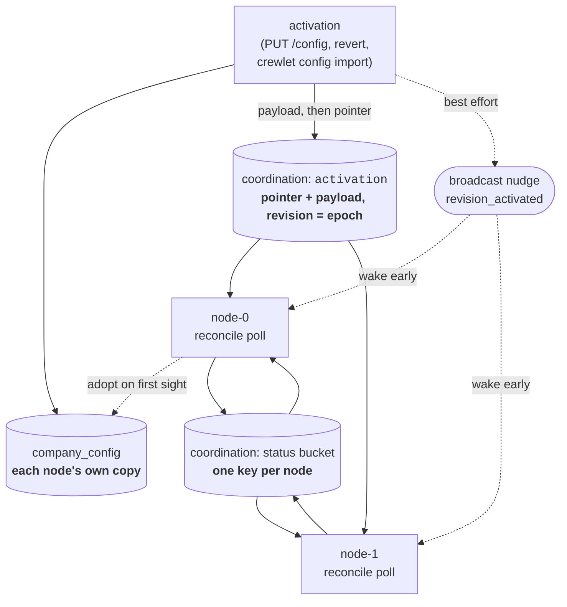
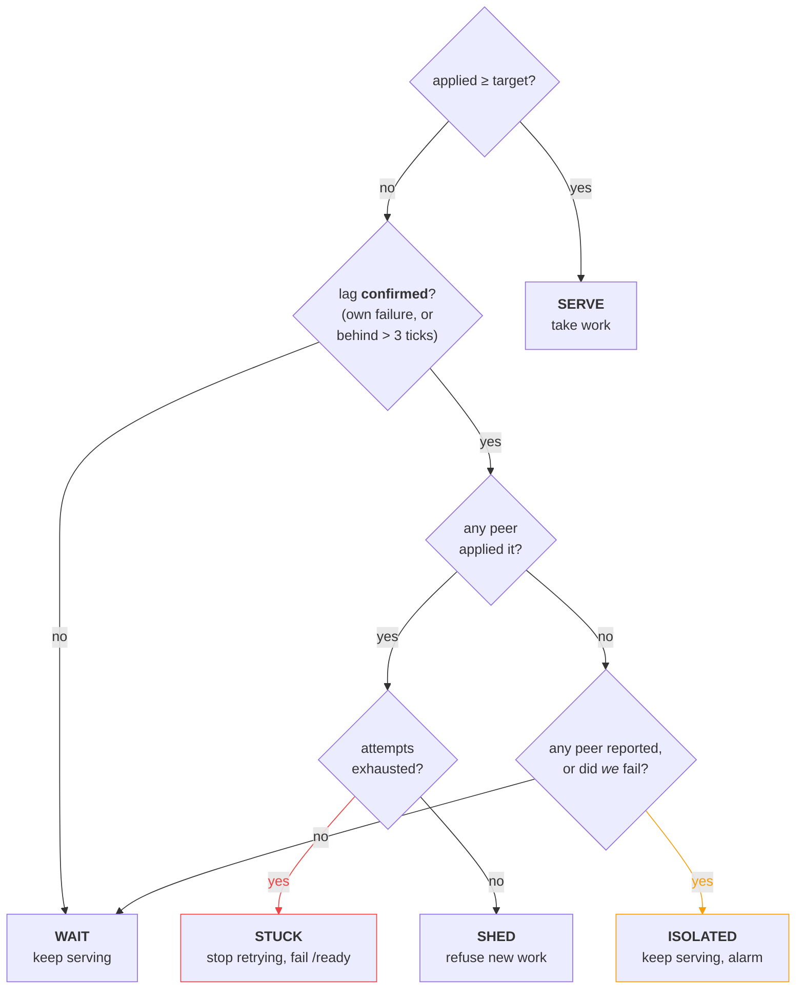

# Control Plane

The **control plane** is how every Crewlet node in a deployment converges on the same company config — and, when one cannot, how it decides what to do about its own traffic.

It is two keys in the fleet's [coordination store](coordination.md) and a poll loop. The interesting part is not delivery; it is the decision a lagging node makes, where the obvious answer turns every successful rollout into an outage.

---

## The problem

Config activation used to be delivered as an event over a **competing-consumer** subscription — group `engine-config` for the engine, `api-config` for the API — with no reconcile loop anywhere.

Competing consumers mean exactly one member of a group receives each message. With one engine process that is invisible. With N, exactly **one** applied any given revision and the other N−1 kept running the previous company indefinitely:

- a deleted role kept answering Slack;
- a rotated credential kept being used;
- a rotated webhook signing secret meant HMAC verification failed on the stale nodes — and verification failure is a *skip plus an ack*, so those nodes silently ate their share of every inbound message;
- and the dashboard reported success, because the one node that did apply it published `revision_applied(ok)`.

Broadcasting the event fixes the fan-out but not the reliability. An ephemeral broadcast consumer starts at the latest message, so anything published while a node reconnects is gone and there is no cursor to replay from. A node that misses one is stale forever, which is the same bug with a smaller window.

## The design



**The `activation` key is the authoritative pointer**, and it lives in the coordination store rather than in a node's own database. The split is the whole point: *which revision is current* is a question the fleet has to agree on, and a pointer each node reads out of its own file is a fleet of one.

**The payload travels with it.** A revision is written to the database of whichever node served the write, so every *other* node meets it for the first time when the pointer names it — and a peer with no copy has nothing to apply. So `Activate` publishes the sealed body and then moves the pointer, in that order: a crash between them leaves a body nothing points at, which the next activation replaces, while the other order points the fleet at bytes no node can read.

Only the **current** revision's body is kept there. A node that has fallen behind needs exactly the revision the pointer names and never an older one, so a per-revision history in a bucket with no retention would be unbounded growth for rows nothing would ever read. A node that fetches a revision **adopts** it into its own `company_config` — which is where its history, its diffs and its revert targets are read from, so a node that applied without adopting would serve an epoch its own operator surface cannot show.

The body is whatever the node sealed. With a keyring configured the coordination store holds ciphertext exactly as the node's database does, and a node opens it with the Tier A keyring it was deployed with.

**Its revision is the epoch.** The coordination store assigns every key write a monotonic revision, so publishing the pointer appends and flips in a single write — there is no instant where a node can read an epoch whose target has not been published, and two operators activating at once get two different epochs rather than racing over a counter the engine keeps. It also gives the counter the property a plain revision-id pointer could never have: it moves on every activation *including re-activation of an unchanged revision*, which is the documented gesture for picking up a rotated credential (see [Secret Store § Propagation](secret-store.md#propagation)).

The pointer's bucket has **no retention at all**. Everything else the fleet shares ages out; a pointer that expired would restart the epoch, and a fencing sequence that restarts is not a fence.

> **On an embedded broker the coordination store lives inside the running engine**, so an *offline* `crewlet config import --activate` can mark a revision active locally but cannot move the pointer — it says so, and tells you to use `PUT /config` against a running node instead. A node that starts holding an active revision the fleet has no pointer for publishes it, unless the pointer it finds is newer; a restarted single-node deployment therefore comes back pointing at what it was already serving, and a node rejoining a live fleet converges on the fleet rather than rolling it back.

**Every node polls it** every ~15 s (±20 % jitter). A poll cannot miss anything, because it asks. The jitter exists only to break lock-step after a synchronized fleet restart — a rolling deploy boots every pod within the same second — and is deliberately applied to the *interval*, never to the apply.

**The `revision_activated` event survives as a nudge.** It wakes the loop so an operator's change lands in milliseconds instead of seconds. It is delivered as an **ephemeral broadcast**, never a consumer group: every node has to hear every activation, and a competing group would hand each one to exactly one node — the delivery shape that made config a fleet of one before the pointer existed.

It is also deliberately thin. The event carries the revision id and its summary and nothing a node acts on: the woken loop re-reads the *pointer*. That is what makes losing a nudge cost one poll interval and never a revision, and it is why a node that cannot subscribe at all — an attach failure is logged, not fatal — simply converges on its interval like any other. After a nudge fires, the next iteration still waits a full jittered interval, so an activation storm cannot become an apply storm.

**The status bucket is what each node managed to do** — one key per node, last-write-wins. This is what makes partial apply visible, and it has three outcomes rather than two:

| Status | Meaning |
|---|---|
| `ok` | Applied cleanly. |
| `error` | Refused. Nothing was rolled back because nothing was mutated: the build comes first and touches nothing, so a revision that cannot be built leaves the previous epoch current and still correct — a legitimate degraded-but-correct state, and one work can safely route to. |
| `degraded` | Failed **after** a subsystem that cannot be un-applied was mutated, so this node's declared epoch would not be the whole truth — it would report the prior config while its tool surface was amputated. Never counted as converged, and never counted as somewhere work can go. **Not reachable in this build**, and the status is documented rather than quietly dropped because the ordering that keeps it unreachable is a live constraint: everything an apply cannot undo has to stay behind the epoch swap. See [`Engine.Apply`](configuration.md#the-engine-half). |

Each node **re-stamps its key every tick**, not only when it converges, and the posture decision only counts reports written in the last four intervals (~60 s). Both halves are needed together. The bucket is keyed by node rather than by event, so a node that is scaled in, redeployed or crashed would otherwise leave its last `ok` behind forever, and a surviving node that cannot apply the current epoch would read that ghost as "there is a healthy peer to shed to" and step out of rotation to hand work to a process that no longer exists. Bounding on freshness fixes that, but only if a live node keeps writing: a converged node that reported once and went quiet would age out of its own fleet's view, and a lagging peer would read `peers_ok = 0` off a perfectly healthy fleet. One idempotent write per node per tick is what makes a key mean *"alive, at this epoch"* rather than *"was alive, once"*.

**The bucket's own age is that bound**, set to four reconcile intervals when the store is opened. Nothing sweeps it, because there is nothing to sweep: a node that stops reporting stops renewing, and the broker expires the key on its own. That is also why the value is a bucket-wide constant rather than a per-write TTL — see [Coordination § Retention is a bucket's age](coordination.md#retention-is-a-buckets-age).

A node's **coordination record** of a failure is truncated at 2 000 bytes (not
characters — the cut is applied to bytes, on a rune boundary). That record is
re-read by every peer on every posture decision and rendered on the dashboard's
**Fleet** screen, so one node returning a megabyte of Go error would be paid for
by every reader on every tick.

The **`config_revision_applied` event** carries up to 64 KiB of it — thirty
times more, and marked when it cuts. It is written once and kept for the event
store's retention horizon, so it is the copy an operator reads days later to
find out why a revision did not apply, and a 2 000-byte cut removes exactly the
end of a wrapped chain where the cause sits. It is bounded at all only so the
event can be published: one over the queue's payload ceiling is refused and
dropped, which would cost the operator the whole record rather than its tail.

---

## Posture: what a lagging node does

Reading those two tables together is what lets a node distinguish *"I am behind because propagation takes a moment"* from *"I am behind because I cannot apply this"* — which need opposite responses.



The rule that matters, and the one an obvious design gets backwards:

> The target is the store's activation pointer, but **lag alone is not a reason to shed.**

Every successful rollout produces lag. The first node to apply advances the pointer, and every peer is behind until it polls. A node that sheds on that makes the fastest node the cause of a fleet-wide outage — and the faster it is, the longer everyone else is down.

So lag has to be **confirmed** before it means anything: either this node recorded a failure for that epoch, or the lag outlasted what propagation could explain (three poll intervals, ~45 s — comfortably longer than a poll plus a normal apply, short enough that a genuinely stuck node leaves rotation quickly).

Only then does peer health pick the action. And when *no* peer managed the epoch either, the honest conclusion is that the **revision** is bad rather than this node — so it keeps serving the epoch it already had, which a refused apply leaves untouched, and raises divergence loudly. Shedding there would take the whole fleet down over one bad revision, which is precisely what publishing rather than mutating exists to avoid.

Retry is **bounded** (three attempts). Without a bound, a revision that fails on one node only — a missing per-node env var, an MCP binary absent from that image — would re-apply every tick forever, restarting that node's MCP children each time.

Note where exhaustion sits in that chart: **after** peer health, not before it. The bound itself is unconditional — a node stops re-applying at three attempts whatever posture it reports — but `STUCK` is a claim about *this node* being the anomaly, and that claim is only true when the epoch demonstrably applies somewhere else. With no healthy peer there is nowhere for the work to go, so stepping out of rotation is not shedding, it is stopping; and every node in a fleet that cannot apply a revision exhausts its attempts at roughly the same moment, so ranking exhaustion first took the whole company dark about 45 s after a bad activation. A single-node deployment reaches the same place by a shorter path: no peer will ever report anything, so its own failure is the only evidence there is, and it stays `isolated` — serving the config it already had — rather than failing readiness over a revision nothing else in the fleet ever saw.

The budget is **per epoch**, not per process. Activating a fixed revision resets it, so the runbook's answer to a stuck node — push a corrected revision — is one the node actually acts on.

### Where the gate sits

A shedding node refuses work at **trigger admission**, not at `run_turn`. Two reasons, both concrete:

- A stale node still *consumes* inbound messages. Slack HMAC verification happens consume-side against that node's cached secret, and a failure is a skip plus an ack — so gating later means the node silently eats its share of the fleet's inbound.
- Refusing at `run_turn` would permanently wedge a seat whose sandbox run just completed: the pending row is already flipped to `resumed`, the box collected, the agent `AWAITING_SANDBOX` with its inbox paused, and nothing reaps a `resumed` row in-process.

Refusal **defers**: the delivery goes straight back to the broker and this node stops consuming — on a seat's inbox and on the ingress topic alike. Never a bare NAK. The two hand the message back the same way; what a deferral adds is quiescing the consumer, and that is the whole difference. A node that NAKed and kept fetching would be handed the same event again a second later, refuse it again, and spend one of its twenty-five deliveries on every lap — so a shed that lasts minutes dead-letters a perfectly healthy event on a node that was never the problem.

And never a republish, which is the form this took first. A shed *releases* this node's seats, and a fenced release republishes nothing (see [Seat Ownership](seat-ownership.md#establishing-a-seat-and-giving-it-back)): a republished event is a **new message**, and the completion ledger's idempotency and the batch layer's aging both key on the identity a NAK preserves — so the copy is not the delivery a successor was entitled to, it is a second one nothing can collapse against the first. Worse, it lands on a subject this node is still attached to at that instant — so if the release that should follow does not happen, the copy comes straight back, is shed again and republished again, at whatever rate the broker will serve. A deferral cannot spin: the consumer stops after the first one, and the seat's release (or, if the posture recovers first, the next successful lease renew) is what starts it again.

The ingress consumer has no seat to release it, so the reconcile tick starts it: on every tick whose posture admits work, the node un-quiesces `crewlet.notifications.inbound`. That is deliberately a **convergence rather than an edge**. The refusal runs on the delivery path while the posture changes on the reconcile loop, so a recovery edge can fire just before the shed's last in-flight delivery quiesces a consumer nothing would then restart — a node that accepts webhooks, reads none of them, and reports a perfectly healthy config. Converging on "if I admit work, I am consuming" cannot lose that race.

Sandbox-driven turns bypass the gate entirely: a completion is dispatched directly by the `SandboxCoordinator` and never passes through inbox admission. They are the tail of a turn this node already started, and refusing them destroys durable state rather than deferring it.

The topic pause a shed applies is **reason-scoped** (`reason="config"`), so it cannot collide with the sandbox busy gate holding the same topics. Without that, a node converging back to `serve` would un-gate a seat mid-sandbox, and a completing sandbox would un-gate a diverged node.

The **scheduler** is gated too, and differently: a tick on a shedding node is skipped whole rather than fired. A schedule's fire identity is org-derived — its name, cron and target seat — so a stale node would fire the previous company's schedules, and unlike a delivery there is no queued copy to fall back on. The skipped window stays open, so the missed-tick catchup evaluates it once the node converges; anything a peer already fired is absorbed by the fleet's at-most-once fire claim.

---

## Rotation

A config revision and the *values* its `${VAR}` references resolve to are two different things, and re-activating an unchanged revision is the documented gesture for picking up a rotated credential. The payload is byte-identical, so an apply that compared payloads would rebuild nothing on exactly the operation an operator performs to make it rebuild: the LLM providers would keep the revoked key, the trackers their old token, and every shared MCP child the credential it captured at spawn.

**Nothing compares the payload.** No step between the operator's gesture and the rebuild looks at a revision's bytes, so there is nothing for a rotation to slip through. The property falls out of the control plane's shape instead:

- The pointer's **KV sequence is the epoch**, and the store assigns a new one on every write. Re-activating a revision therefore mints a new epoch even though the value written is byte-identical.
- A node's reconciler skips on the **epoch it has already applied**, never on payload content — so a re-activation always reaches `Apply`.
- `Apply` **re-reads the secret store first**, before it builds anything, and `${VAR}` references stay verbatim in the stored revision and are resolved where a provider is *constructed*. So the rebuild that follows is against freshly resolved values, without anything having compared them.

**What that rebuild reaches, and what it does not.** A rotation is only useful where something that *captured* the old value is replaced, and an apply does not reach everything that holds one:

| Holder | Rotated by a re-activation? |
|---|---|
| LLM providers | **Yes** — the epoch's providers are constructed from the fresh resolver. |
| Jira / Confluence / GitLab / GitHub | **Yes** — each tracker is reconciled against the new epoch and re-resolves the engine credential. |
| Shared MCP children | **Yes, selectively** — see below. |
| Per-role MCP children | **No.** They belong to a seat's *lease*, not to the epoch: spawned when a seat is claimed and torn down when it is released, so a rotated `mcp_env` value reaches one only when its seat next changes hands. |
| Mattermost / Slack transports | **No.** They are built once, at boot. A rotated chat bot token needs a process restart. |

The shared MCP children are the one place a comparison does happen, and it is deliberate: a child is a *process*, and restarting every one on every apply would tear down working servers to arrive back where they started. So `Bridge.Reconcile` compares the spec it is handed against the one the child is already running and leaves an unchanged server alone. What makes that safe for a rotation is *what* it compares — the spec's `env`, `headers` and `url` are resolved at the edge before the comparison, so a moved credential reads as a changed spec and restarts that one child. Comparing the stored config entry, where `${VAR}` stays verbatim, would silently stop rotation from reaching MCP children at all; two tests hold that line by re-applying the same document and asserting which children survive it.

That is the whole of the comparison, and it is over resolved values rather than a digest of them. Nothing keeps a digest of live credentials across applies, which is what a broader selective rebuild would need and what would turn a rotation into a leak the moment such a digest reached a log line or a row.

> One more surface, and it is out of the engine's hands entirely rather than merely off the apply path: a **running code sandbox** received its credentials in the box's environment at launch, and no engine-side refresh reaches a live box. There the bound is the run's duration plus any clarification pause, not seconds. Tear the run down if a rotation is a revocation.

---

## What a running turn sees

**Nothing moves under a running turn, because nothing is mutated in place.** An epoch is published rather than edited, so the question is only ever *which* epoch a turn is reading — and a turn answers that once. `runTurn` pins the company in a local at the top and builds everything from that one value: the runner, the round caps, the prefetch, the telemetry. Two reads could straddle a publish, and a turn that built its runner from one revision and took its round caps from the next would be running a company that never existed. That is the failure publishing-instead-of-mutating exists to remove, and the pin is what collects the benefit.

The prompt is frozen harder still: it is **rendered to strings before the runner is built**, so the runner has nowhere to re-fetch from and a `self_iterate` loop cannot move the system prompt underneath the executor between rounds.

**What a pin cannot hold is a capability.** It holds a *catalogue* — the tool objects the epoch's registry names — and an MCP tool object holds the client it dispatches to. If the apply restarted that server, the client behind a pinned tool is closed, and the call comes back as a tool error the model can read (`MCP tool error (server/tool): …`) rather than as a name that vanished mid-turn or a panic. A model that sees a failed tool result can say so; one whose tool disappeared cannot.

That is the whole exposure, and it is small enough that **the apply does not wait for in-flight turns at all** — there is no drain, and no seat is quiesced before an epoch is published. It stays small because of what the apply restarts: only a *shared* server whose resolved spec actually moved, and per-role children are not on the apply path at all, so the common config change restarts nothing a turn is holding.

---

## Operator surface

`GET /health` stays `200` through everything — an orchestrator watching liveness must not SIGKILL a node that is finishing in-flight turns — and reports what the node concluded:

```json
{
  "status": "shed",
  "node": "node-2",
  "configured": true,
  "in_flight": 3,
  "shutting_down": false,
  "posture": "shed",
  "applied_epoch": 40
}
```

`GET /ready` is what steers traffic, and it fails on `shed` and `stuck` only:

| Posture | `/ready` | Why |
|---|---|---|
| `serve` | 200 | Converged. |
| `wait` | 200 | Ordinary propagation during a rollout. Failing here is the fleet-wide-outage bug. |
| `isolated` | 200 | *No* node applied the revision — taking this one out would take the fleet out over one bad revision. |
| `shed` | 503 | Confirmed: cannot apply an epoch its peers have. |
| `stuck` | 503 | Retries exhausted. Needs an operator. |

`posture` on `/health` is the only place the *reason* is visible — `/ready` returns a bare 503 either way, and "draining" and "cannot apply epoch 41" call for opposite responses. A drain outranks a posture in `status`, because it is the operator's own action.

### Reading a stuck node

Each node's status carries the `error` it failed with, so the first question — *is this the revision or is this the node?* — is answered by the **Fleet** screen, which calls out every node whose applied epoch is behind the target and prints the error it failed with. It is also one request:

```bash
curl -s -H "Authorization: Bearer $CREWLET_API_TOKEN" \
  http://localhost:8080/query/fleet | jq '.nodes[] |
    {id, config_epoch, config_status, config_error, config_reported_at}'
```

A node that stopped reporting **drops out of this list** once its status ages past the freshness bound — which is the same fact the posture decision reads, so what an operator sees and what the fleet concluded cannot disagree.

One node `error` while peers are `ok` is a per-node problem: a missing env var, an image without some MCP binary. Every node `error` on the same epoch is the revision — revert it. Any node `degraded` needs a **restart** of that process specifically: the status exists precisely for a failure past something no later apply can put back, so nothing short of a restart will. No build reports it today.

### After the fact

The fleet view above is a **live** view and deliberately forgetful: a node that stops reporting drops out of it within a minute, which is exactly the node — the one that crashed, or was scaled in mid-rollout — an incident review is looking for.

The durable answer is the event log. Every apply publishes `config_revision_applied`, with the reporting node in the event's `source`:

```bash
curl -s -H "Authorization: Bearer $CREWLET_API_TOKEN" \
  "http://localhost:8080/query/events?type=config_revision_applied&limit=50" |
  jq '.events[] | {id, source, timestamp, failed, summary}'
```

The `summary` reads as a failure for every status other than `ok` — `degraded` included, because a node that could not finish an apply has not converged and a line that hedged would let the fleet look healthier than it is.

A listing never carries payloads (see [API § An event on the wire](../reference/api-endpoints.md#an-event-on-the-wire)), so fetch the one you want by id for the detail:

```bash
curl -s -H "Authorization: Bearer $CREWLET_API_TOKEN" \
  http://localhost:8080/events/$EVENT_ID | jq '.payload'
```

```json
{
  "revision_id": "cfg-…",
  "status": "degraded",
  "error": "engine: apply: …",
  "applied_subsystems": ["secrets", "company", "tools", "learning"]
}
```

`applied_subsystems` is the ordered list of what this node had already rebuilt when it stopped — `secrets`, `company`, `tools`, `learning`, `sandbox`, `parties`, `integrations`, `epoch`, `seat_tools`, `mailboxes`, `scheduler`. That is the difference between "refused before anything changed" and "torn down halfway", which is precisely what decides whether the node needs a restart. An `error` with an **empty** list never reached the apply at all: the revision could not be read, opened or parsed.

Like every other event this lives in each node's own log, so a node whose disk is gone took its rows with it — but a node that merely stopped reporting, or was replaced, still has them.

---

## See also

- [Coordination](coordination.md) — the shared store this plane's two keys live in, and what else does
- [Scaling Out](scaling.md) — the model this sits inside, and the other four kinds of coupling a fleet had to resolve
- [Configuration](configuration.md) — the two-tier split, and the apply itself stage by stage
- [Secret Store](secret-store.md) — where rotated credentials live and how re-activation picks them up
- [Deployment](../guides/deployment.md) — running more than one node
- [Event System](event-system.md) — subscription types and why a competing group was the wrong one here
