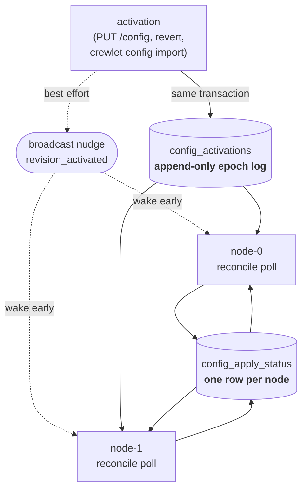
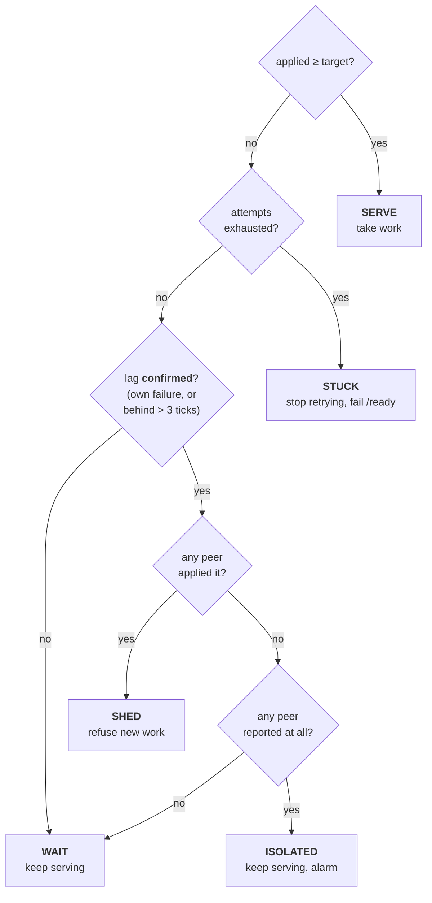

# Control Plane

The **control plane** is how every Crewlet node in a deployment converges on the same company config — and, when one cannot, how it decides what to do about its own traffic.

It is two PostgreSQL tables and a poll loop. The interesting part is not delivery; it is the decision a lagging node makes, where the obvious answer turns every successful rollout into an outage.

---

## The problem

Config activation used to be delivered as a Pulsar event over a **competing-consumer** subscription — group `engine-config` for the engine, `api-config` for the API — with no reconcile loop anywhere.

Competing consumers mean exactly one member of a group receives each message. With one engine process that is invisible. With N, exactly **one** applied any given revision and the other N−1 kept running the previous company indefinitely:

- a deleted role kept answering Slack;
- a rotated credential kept being used;
- a rotated webhook signing secret meant HMAC verification failed on the stale nodes — and verification failure is a *skip plus an ack*, so those nodes silently ate their share of every inbound message;
- and the dashboard reported success, because the one node that did apply it published `revision_applied(ok)`.

Broadcasting the event fixes the fan-out but not the reliability. An ephemeral broadcast consumer starts at the latest message, so anything published while a node reconnects is gone and there is no cursor to replay from. A node that misses one is stale forever, which is the same bug with a smaller window.

## The design



**`config_activations` is the authoritative pointer.** It is an append log rather than a column on `company_config`, because the counter has to move on every activation *including re-activation of an unchanged revision* — that is the documented gesture for picking up a rotated credential (see [Secret Store § Propagation](secret-store.md#propagation)), and a pointer keyed on the revision id could never express it. `BIGSERIAL` is the monotonic epoch; the current target is `MAX(epoch)`.

The append runs **inside the activation's own transaction**, so the `is_active` flip and the epoch commit together. A crash between them would otherwise leave a fleet converged on a revision nobody asked for, or an activation no node ever notices.

**Every node polls it** every ~15 s (±20 % jitter). A poll cannot miss anything, because it asks. The jitter exists only to break lock-step after a synchronized fleet restart — a rolling deploy boots every pod within the same second — and is deliberately applied to the *interval*, never to the apply.

**The `revision_activated` event survives as a nudge.** It wakes the loop so an operator's change lands in milliseconds instead of seconds. Losing it costs one poll interval, never a revision. After a nudge fires, the next iteration still waits a full jittered interval, so an activation storm cannot become an apply storm.

**`config_apply_status` is what each node managed to do** — one row per node, last-write-wins. This is what makes partial apply visible, and it has three outcomes rather than two:

| Status | Meaning |
|---|---|
| `ok` | Applied cleanly. |
| `error` | Failed and rolled back. The node still serves the prior epoch — a legitimate degraded-but-correct state, and one work can safely route to. |
| `degraded` | Failed **after** a restart-required subsystem was mutated. Rollback restores and restarts transports, but it cannot respawn the per-role MCP children the failed revision already started. So this node's declared epoch is not the whole truth — it reports the prior config while its tool surface may be amputated. Never counted as converged, and never counted as somewhere work can go. |

---

## Posture: what a lagging node does

Reading those two tables together is what lets a node distinguish *"I am behind because propagation takes a moment"* from *"I am behind because I cannot apply this"* — which need opposite responses.



The rule that matters, and the one an obvious design gets backwards:

> The target is the store's activation pointer, but **lag alone is not a reason to shed.**

Every successful rollout produces lag. The first node to apply advances the pointer, and every peer is behind until it polls. A node that sheds on that makes the fastest node the cause of a fleet-wide outage — and the faster it is, the longer everyone else is down.

So lag has to be **confirmed** before it means anything: either this node recorded a failure for that epoch, or the lag outlasted what propagation could explain (three poll intervals, ~45 s — comfortably longer than a poll plus a normal apply, short enough that a genuinely stuck node leaves rotation quickly).

Only then does peer health pick the action. And when *no* peer managed the epoch either, the honest conclusion is that the **revision** is bad rather than this node — so it keeps serving what rollback preserved and raises divergence loudly. Shedding there would take the whole fleet down over one bad revision, which is precisely what the rollback path exists to avoid.

Retry is **bounded** (three attempts). Without a bound, a revision that fails on one node only — a missing per-node env var, an MCP binary absent from that image — would re-apply every tick forever, restarting that node's MCP children each time.

### Where the gate sits

A shedding node refuses work at **trigger admission**, not at `run_turn`. Two reasons, both concrete:

- A stale node still *consumes* inbound messages. Slack HMAC verification happens consume-side against that node's cached secret, and a failure is a skip plus an ack — so gating later means the node silently eats its share of the fleet's inbound.
- Refusing at `run_turn` would permanently wedge a seat whose sandbox run just completed: the pending row is already flipped to `resumed`, the box collected, the agent `AWAITING_SANDBOX` with its inbox paused, and nothing reaps a `resumed` row in-process.

Refusal is **republish-then-ack**, never NAK — three redeliveries at one second dead-letter a perfectly healthy event, and a shed can last minutes. The copy waits on the topic for a node that can read it.

Sandbox-driven turns bypass the gate entirely: a completion is dispatched directly by the `SandboxCoordinator` and never passes through inbox admission. They are the tail of a turn this node already started, and refusing them destroys durable state rather than deferring it.

The topic pause a shed applies is **reason-scoped** (`reason="config"`), so it cannot collide with the sandbox busy gate holding the same topics. Without that, a node converging back to `serve` would un-gate a seat mid-sandbox, and a completing sandbox would un-gate a diverged node.

The **scheduler** is gated too, and differently: a tick on a shedding node is skipped whole rather than fired. A schedule's fire identity is org-derived — its name, cron and target seat — so a stale node would fire the previous company's schedules, and unlike a delivery there is no queued copy to fall back on. The skipped window stays open, so the missed-tick catchup evaluates it once the node converges; anything a peer already fired is absorbed by the `scheduled_runs` at-most-once claim.

---

## Rotation

A config revision and the *values* its `${VAR}` references resolve to are two different things, and `apply_config` used to compare only the first.

That gap was the whole of secret rotation. Re-activating an unchanged revision produces a byte-identical payload, so the no-op early-out fired and nothing rebuilt: MCP children kept the credential they captured at spawn, LLM providers kept the revoked key, transports kept the old token.

The engine now compares a **resolution fingerprint** alongside the payload — a process-local *keyed* digest (`blake2b`, per-process random key) over what every `${VAR}` the payload references currently resolves to. Equal payload **and** equal fingerprint is a true no-op; equal payload with a moved fingerprint is a rotation, and the credential-bearing subsystems rebuild.

The key is per-process and never persisted or logged. A bare hash of a short credential in a log line or a database row is offline-brute-forceable, which would turn the fix into a leak. A fingerprint is meaningful only as "has this changed since the last apply *in this process*" — which is exactly, and only, what it is asked.

> One surface this cannot reach: a **running code sandbox** received its credentials in the box's environment at launch, and no engine-side refresh reaches a live box. There the bound is the run's duration plus any clarification pause, not seconds. Tear the run down if a rotation is a revocation.

---

## What a running turn sees

A live apply mutates engine state **in place** so in-flight work keeps working: the LLM provider map is `clear()` + `update()`d (identity preserved on purpose), `_role_mcp_tools` is rewritten per role, an `AgentDefinition` is reassigned on the running instance, and the `TurnEngineSettings` cell hands out a new model in one shot.

In-place is right — the alternative is a turn holding a reference to a dict nobody updates any more. But *keeps working* is not *stays coherent*, and each of those is read repeatedly within one turn: the ~18 turn-engine settings accessors re-read the cell on **every access**, `_role_mcp_tools` is read twice from two different places, and the agent's definition is read from roughly twenty. A turn could plan against one company and execute against another — one round cap for Plan and a different one for Execute, or a sub-agent budget sized from a fraction its parent never saw.

Two mechanisms, and the split between them is the point.

**The pin.** A turn captures those four things once, at the top, and reads through the capture for the rest of it. The capture lives in a `contextvars.ContextVar`, so it propagates into every task the turn spawns — a sub-agent inherits the turn that spawned it — without threading a parameter through every phase signature. It is keyed by owner and seat, so a concurrent turn for a different seat, or a second engine in the same process, reads live state.

**The drain.** A pin holds a *catalogue*, not a *capability*: pinning an MCP tool wrapper does not keep the client it dispatches to alive, so a pinned turn whose server was respawned fails as a dead tool rather than as a name that vanished. So before the apply mutates a seat — swapping its definition, respawning its per-role MCP children, decommissioning it — it waits for that seat's in-flight turns, capped at 10 s.

The cap is on the tail of an LLM round: that is the unit of work a turn cannot be interrupted inside, and the reason a mid-turn rewire is visible at all. Past it the apply proceeds and logs `seat_drain_timed_out` — an apply that blocks indefinitely on one busy seat is strictly worse than one turn seeing a mid-flight rewire, which is what every turn saw before the drain existed.

The drain counts turns, deliberately, rather than reading `AgentState`. A seat parked on a detached sandbox run stays `AWAITING_SANDBOX` for the whole run plus any clarification pause, so draining on the state would let one agent's pending question block a config apply — and through it the whole node. A suspended turn releases its count and its resume takes a fresh one.

---

## Operator surface

`GET /health` stays `200` through everything — an orchestrator watching liveness must not SIGKILL a node that is finishing in-flight turns — and reports what the node concluded:

```json
{
  "status": "shed",
  "node": "node-2",
  "configured": true,
  "in_flight": 3,
  "shutting_down": false,
  "posture": "shed",
  "applied_epoch": 40
}
```

`GET /ready` is what steers traffic, and it fails on `shed` and `stuck` only:

| Posture | `/ready` | Why |
|---|---|---|
| `serve` | 200 | Converged. |
| `wait` | 200 | Ordinary propagation during a rollout. Failing here is the fleet-wide-outage bug. |
| `isolated` | 200 | *No* node applied the revision — taking this one out would take the fleet out over one bad revision. |
| `shed` | 503 | Confirmed: cannot apply an epoch its peers have. |
| `stuck` | 503 | Retries exhausted. Needs an operator. |

`posture` on `/health` is the only place the *reason* is visible — `/ready` returns a bare 503 either way, and "draining" and "cannot apply epoch 41" call for opposite responses. A drain outranks a posture in `status`, because it is the operator's own action.

### Reading a stuck node

`config_apply_status` carries the failing node's `error`, so the first question — *is this the revision or is this the node?* — is answered by the table:

```sql
SELECT node_id, epoch, status, error, updated_at
FROM config_apply_status
ORDER BY node_id;
```

One node `error` while peers are `ok` is a per-node problem: a missing env var, an image without some MCP binary. Every node `error` on the same epoch is the revision — revert it. Any node `degraded` needs a **restart** of that process specifically; rollback did not restore what the apply tore down, and nothing short of a restart will.

---

## See also

- [Configuration](configuration.md) — the two-tier split, the apply itself, and rollback
- [Secret Store](secret-store.md) — where rotated credentials live and how re-activation picks them up
- [Deployment](../guides/deployment.md) — running more than one node
- [Event System](event-system.md) — subscription types and why a competing group was the wrong one here
