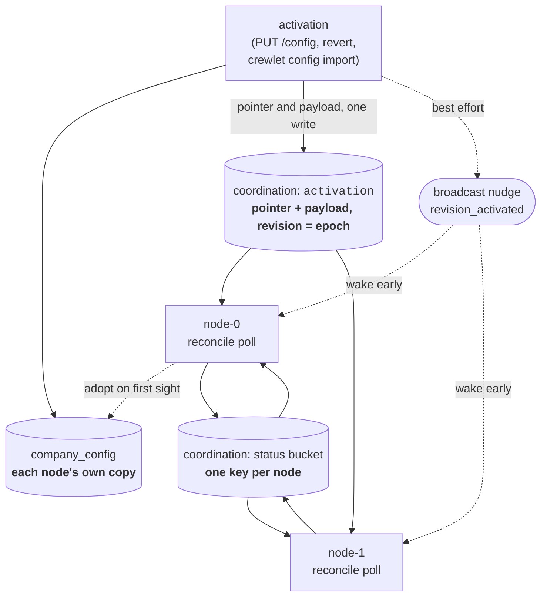
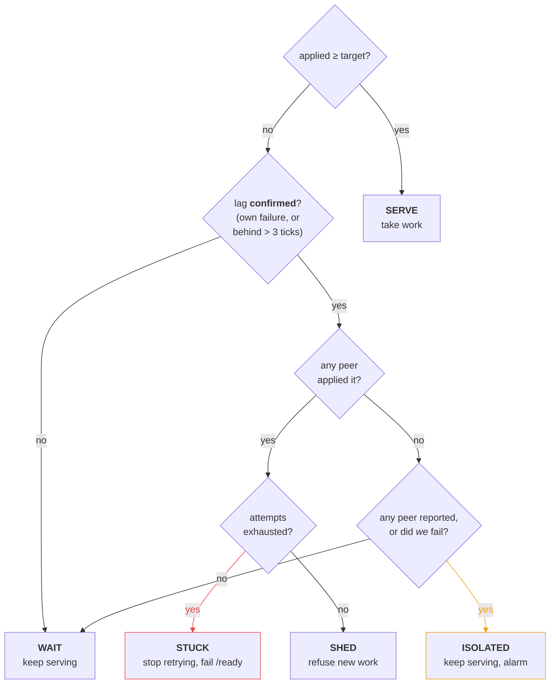

# Control Plane

The **control plane** is how every Crewlet node in a deployment converges on the same company config — and, when one cannot, how it decides what to do about its own traffic.

It is two keys in the fleet's [coordination store](coordination.md) and a poll loop. The interesting part is not delivery; it is the decision a lagging node makes, where the obvious answer turns every successful rollout into an outage.

---

## The problem

Config activation used to be delivered as an event over a **competing-consumer** subscription — group `engine-config` for the engine, `api-config` for the API — with no reconcile loop anywhere.

Competing consumers mean exactly one member of a group receives each message. With one engine process that is invisible. With N, exactly **one** applied any given revision and the other N−1 kept running the previous company indefinitely:

- a deleted role kept answering Slack;
- a rotated credential kept being used;
- a rotated webhook signing secret meant HMAC verification failed on the stale nodes — and verification failure is a *skip plus an ack*, so those nodes silently ate their share of every inbound message;
- and the dashboard reported success, because the one node that did apply it published `revision_applied(ok)`.

Broadcasting the event fixes the fan-out but not the reliability. An ephemeral broadcast consumer starts at the latest message, so anything published while a node reconnects is gone and there is no cursor to replay from. A node that misses one is stale forever, which is the same bug with a smaller window.

## The design


```mermaid
flowchart TD
    ACT["activation<br/>(PUT /config, revert,<br/>crewlet config import)"]
    DB[("company_config<br/><b>each node's own copy</b>")]
    PTR[("coordination: <code>activation</code><br/><b>pointer + payload, revision = epoch</b>")]
    NUDGE(["broadcast nudge<br/>revision_activated"])
    N1["node-0<br/>reconcile poll"]
    N2["node-1<br/>reconcile poll"]
    STATUS[("coordination: status bucket<br/><b>one key per node</b>")]
    ACT --> DB
    ACT -->|pointer and payload, one write| PTR
    ACT -.->|best effort| NUDGE
    NUDGE -.->|wake early| N1
    NUDGE -.->|wake early| N2
    PTR --> N1
    PTR --> N2
    N1 -.->|adopt on first sight| DB
    N1 --> STATUS
    N2 --> STATUS
    STATUS --> N1
    STATUS --> N2
```

**The `activation` key is the authoritative pointer**, and it lives in the coordination store rather than in a node's own database. The split is the whole point: *which revision is current* is a question the fleet has to agree on, and a pointer each node reads out of its own file is a fleet of one.

**The payload travels with it — inside it.** A revision is written to the database of whichever node served the write, so every *other* node meets it for the first time when the pointer names it, and a peer with no copy has nothing to apply. So `Activate` writes the sealed body **in the pointer's own record**, one write that either lands whole or does not land. The body used to be a key of its own, written just before the pointer, and the order was chosen so that a crash between the two left a body nothing pointed at. What the order could not stop was a second writer. Two nodes activating at once each wrote a body to the one key, and the flip that landed first was then pointed at a body the other had overwritten, so every peer answered "no such revision" for the epoch the fleet was on until somebody activated again. Two nodes booting together each publish the revision they hold, so they do exactly this, and so did an edit that *lost* its compare-and-set, because its body had already landed before its flip was refused. One record cannot come apart. The price is the body's bytes on every read of the pointer, which a reconcile tick makes; a company document is kilobytes.

**On the wire the body is JSON.** It is carried as the object it is: the envelope `{"__encrypted__":"enc:v1:<key id>:<ciphertext>"}` sits as the record's `payload` field, compacted and otherwise byte for byte what was sealed. It used to be carried as bytes, which the record spelled as a base64 string over an envelope whose ciphertext was base64 already, so every body was encoded twice and a third larger for nothing. Anything that is not a JSON object is refused before it is written, because a pointer naming a body no node can decode is a fleet that converges on nothing. **The body is mirrored for a peer on an earlier build.** A build from before the body moved into the pointer reads it only from a key beside the pointer, `revision_payload`, as that base64 string, and ignores the `payload` field it does not know. A rolling upgrade puts both builds on one bucket, and the fleet activates during a rollout whether or not anybody edits the company: the integration loop re-activates the revision when it seals a credential, a site it discovers is written back into the configuration, and a node whose revision is newer than the pointer publishes it at boot. So every activation also writes its body to that key, as a mirror, **after** the pointer. Before would be the race above again: a write whose flip was then refused had already replaced the body the winning pointer named. Each mirror carries the epoch it copies and is written only over an older one, so activations that race leave it naming the pointer, and it is never written over a body that a later pointer from an earlier build depends on. A node on the earlier build that polls in the moment between the two writes sees a pointer whose body is not beside it yet; it records one failed attempt and applies the revision on its next poll, and the nudge that wakes nodes early is sent only after both writes. What the mirror cannot close is the earlier build's own race: that build writes its body before its pointer, so one of its nodes activating in the same instant as an upgraded one can leave the mirror naming the other revision, exactly as two of its own nodes always could, until the next activation. The key is read in the other direction too. A bucket an earlier build wrote holds a pointer with no `payload` field, and the body beside it is what a node upgraded in place applies until somebody next activates.

Only the **current** revision's body is kept there: in the pointer, and in its mirror beside it. A node that has fallen behind needs exactly the revision the pointer names and never an older one, so a per-revision history in a bucket with no retention would be unbounded growth for rows nothing would ever read. A node that fetches a revision **adopts** it into its own `company_config` — which is where its history, its diffs and its revert targets are read from, so a node that applied without adopting would serve an epoch its own operator surface cannot show.

**So does the revision's author.** Every revision records who wrote it (`created_by`), **what** that is (`created_by_kind`, one of `agent`, `human`, `operator` and `system`) and the credential it came through (`operator_id`), exactly as every other write in the engine names its caller (`iam.ActorFor`): a person the identity directory binds to a seat writes as that seat, kind `human`; anybody else on `/config` or `/setup` under their own login — `token:<id>` for a Tier A token — kind `operator`, as does the login running an offline `crewlet config import` or `rekey`; and the engine's own write is kind `system` with no credential — a node seeding the store from its `-company` file (recorded under the node's id), or the reconcile loop reloading after it sealed a credential (recorded as `reconcile loop`). A disconnect the loop carries out is recorded under whoever **asked** for it rather than as the loop's own, because the loop only carries it out (see [Integration Reconcile](integration-reconcile.md)). The kind is stated by the writer, because a label cannot say it: nothing stops a Tier A token being given the id `node`. The pointer carries the revision's **origin** — author, kind, credential, source and the instant it was written — so a node adopting the revision records the same author as the node that stored it first. Before it did, every other node recorded an adopted revision as written by `peer`, from `fleet`, at the moment it was activated, and the history answered differently depending on which node served it.

The origin is **additive on the wire**. An older build reading a pointer this build published ignores it; this build reading a pointer an older build published finds no origin and records the author as **not recorded** — never as itself, and never as a placeholder name. A node that adopted a revision without its author learns it the next time the fleet points at that revision; an author a node already knows is never overwritten, because the node that stored its own write is the authority on it. The revision's *parent* is deliberately not carried: it names a revision the adopting node may never have held.

**A node's own active revision is a claim, so only the fleet makes it.** It is what the node's `GET /config` serves, what the node boots on, and what the node offers the fleet at its next start whenever it is newer than the pointer. So a write through the API stores its revision in the history first and marks it the node's active revision only after the pointer has moved to it: a write that loses the compare-and-set stays history, and is never served or republished by the node that took it. And once a node has applied the fleet's epoch, its reconciler keeps the fleet's revision as the node's active one on every tick, correcting a copy that disagrees, whether a local activation failed after the fleet took the write or an offline import had already been superseded when the node started.

**The body is authenticated by its seal.** It is sealed under the fleet's Tier A keyring — which every node holds — so the coordination store holds ciphertext exactly as the node's database does, and a node opens it with the keyring it was deployed with. The seal is AES-GCM, so opening it is also the proof that a node of this fleet wrote it: the broker authenticates nothing, and anything that can reach it can write this bucket. A body that does not open — **stored unsealed**, or sealed under a key this node does not hold — is refused before it is kept: the apply is recorded as an error, the epoch is not reached, and the body never enters the node's own `company_config`, where it would be shown, diffed and offered as a revert target. The recorded error says what fixes it, which depends on where the bytes came from. A body that arrived unsealed was either forged by something that reaches the broker or published by a node holding a revision an older build stored in the clear, and the remedy is on that node: `crewlet config seal` seals its active revision and activates it again. A node whose **own** copy of the fleet's revision is unsealed is told to run the same command itself, and a body sealed under a key the node does not hold means its `secrets.keys` is missing a key the fleet seals under. What the seal does not authenticate is the pointer beside it: a party that can write the bucket can still point the fleet at a revision it has already seen sealed, which is why the broker must be reachable only by the fleet (see [Deployment § Every node embeds a member of one cluster](../guides/deployment.md#every-node-embeds-a-member-of-one-cluster)).

**Its revision is the epoch.** The coordination store assigns every key write a monotonic revision, so publishing the pointer appends and flips in a single write — there is no instant where a node can read an epoch whose target has not been published, and two operators activating at once get two different epochs rather than racing over a counter the engine keeps. It also gives the counter the property a plain revision-id pointer could never have: it moves on every activation *including re-activation of an unchanged revision*, which is the documented gesture for picking up a rotated credential (see [Secret Store § Propagation](secret-store.md#propagation)).

**Every activation carries a later instant than the one it replaces.** The
pointer records the instant a revision was activated, and every row a
configuration derives — a tracker project, a knowledge container — is stamped
with it and refuses an older stamp, so an older configuration applied late
cannot walk a newer one back. That guard needs a later activation to carry a
later instant, and the instant is the activating node's own clock; so inside
the same compare-and-set that replaces the pointer, an activation whose
instant is no later, to the millisecond, than the pointer's is published at
one millisecond after it, and the fleet's history of activations is in the
order the fleet made them whichever node's clock ran behind. Even an
unconditional publish is a compare-and-set underneath for this reason.
`Activate` returns the instant it published, and a node keeps that instant on
its own copy of the revision (`activated_at`), because it is what the node
boots its company with next time.

The pointer's bucket has **no retention at all**. Everything else the fleet shares ages out; a pointer that expired would restart the epoch, and a fencing sequence that restarts is not a fence.

> **On an embedded broker the coordination store lives inside the running engine**, so an *offline* `crewlet config import` — one run while the engine is stopped — can mark a revision active locally but cannot move the pointer; it says so, and the node publishes it at its next start. Run against a **running** node the same command goes through that node's `PUT /config` instead, which moves the pointer at once. A node that starts holding an active revision the fleet has no pointer for publishes it, unless the pointer it finds is newer; a restarted single-node deployment therefore comes back pointing at what it was already serving, and a node rejoining a live fleet converges on the fleet rather than rolling it back.

**Every node polls it** every ~15 s (±20 % jitter). A poll cannot miss anything, because it asks. The jitter exists only to break lock-step after a synchronized fleet restart — a rolling deploy boots every pod within the same second — and is deliberately applied to the *interval*, never to the apply.

**The `revision_activated` event survives as a nudge.** It wakes the loop so an operator's change lands in milliseconds instead of seconds. It is delivered as an **ephemeral broadcast**, never a consumer group: every node has to hear every activation, and a competing group would hand each one to exactly one node — the delivery shape that made config a fleet of one before the pointer existed.

It is also deliberately thin. The event carries the revision id and its summary and nothing a node acts on: the woken loop re-reads the *pointer*. That is what makes losing a nudge cost one poll interval and never a revision, and it is why a node that cannot subscribe at all — an attach failure is logged, not fatal — simply converges on its interval like any other. After a nudge fires, the next iteration still waits a full jittered interval, so an activation storm cannot become an apply storm.

**The status bucket is what each node managed to do** — one key per node, last-write-wins. This is what makes partial apply visible, and it has three outcomes rather than two:

| Status | Meaning |
|---|---|
| `ok` | Applied cleanly. |
| `error` | Refused. Nothing was rolled back because nothing was mutated: the build comes first and touches nothing, so a revision that cannot be built leaves the previous epoch current and still correct — a legitimate degraded-but-correct state, and one work can safely route to. |
| `degraded` | Failed **after** a subsystem that cannot be un-applied was mutated, so this node's declared epoch would not be the whole truth — it would report the prior config while its tool surface was amputated. Never counted as converged, and never counted as somewhere work can go. **Not reachable in this build**, and the status is documented rather than quietly dropped because the ordering that keeps it unreachable is a live constraint: everything an apply cannot undo has to stay behind the epoch swap. See [`Engine.Apply`](configuration.md#the-engine-half). |

Each node **re-stamps its key every tick**, not only when it converges, and the posture decision only counts reports written in the last four intervals (~60 s). Both halves are needed together. The bucket is keyed by node rather than by event, so a node that is scaled in, redeployed or crashed would otherwise leave its last `ok` behind forever, and a surviving node that cannot apply the current epoch would read that ghost as "there is a healthy peer to shed to" and step out of rotation to hand work to a process that no longer exists. Bounding on freshness fixes that, but only if a live node keeps writing: a converged node that reported once and went quiet would age out of its own fleet's view, and a lagging peer would read `PeersOK` as 0 off a perfectly healthy fleet. One idempotent write per node per tick is what makes a key mean *"alive, at this epoch"* rather than *"was alive, once"*.

**The bucket's own age is that bound**, set to four reconcile intervals when the store is opened. Nothing sweeps it, because there is nothing to sweep: a node that stops reporting stops renewing, and the broker expires the key on its own. That is also why the value is a bucket-wide constant rather than a per-write TTL — see [Coordination § Retention is a bucket's age](coordination.md#retention-is-a-buckets-age).

A node's **coordination record** of a failure is truncated at 2 000 bytes (not
characters — the cut is applied to bytes, on a rune boundary). That record is
re-read by every peer on every posture decision and rendered on the dashboard's
**Settings › Nodes** screen, so one node returning a megabyte of Go error would be paid for
by every reader on every tick.

The **`config_revision_applied` event** carries up to 64 KiB of it — thirty
times more, and marked when it cuts. It is written once and kept for the event
store's retention horizon, so it is the copy an operator reads days later to
find out why a revision did not apply, and a 2 000-byte cut removes exactly the
end of a wrapped chain where the cause sits. It is bounded at all only so the
event can be published: one over the queue's payload ceiling is refused and
dropped, which would cost the operator the whole record rather than its tail.

---

## Posture: what a lagging node does

Reading those two tables together is what lets a node distinguish *"I am behind because propagation takes a moment"* from *"I am behind because I cannot apply this"* — which need opposite responses.


```mermaid
flowchart TD
    START{"applied ≥ target?"}
    CONF{"lag <b>confirmed</b>?<br/>(own failure, or<br/>behind &gt; 3 ticks)"}
    PEERS{"any peer<br/>applied it?"}
    ATT{"attempts<br/>exhausted?"}
    ANY{"any peer reported,<br/>or did <i>we</i> fail?"}
    SERVE["<b>SERVE</b><br/>take work"]
    WAIT["<b>WAIT</b><br/>keep serving"]
    SHED["<b>SHED</b><br/>refuse new work"]
    STUCK["<b>STUCK</b><br/>stop retrying, fail /ready"]
    ISO["<b>ISOLATED</b><br/>keep serving, alarm"]
    START -->|yes| SERVE
    START -->|no| CONF
    CONF -->|no| WAIT
    CONF -->|yes| PEERS
    PEERS -->|yes| ATT
    ATT -->|yes| STUCK
    ATT -->|no| SHED
    PEERS -->|no| ANY
    ANY -->|yes| ISO
    ANY -->|no| WAIT

    STUCK:::danger
    ISO:::warning
    classDef danger stroke:#ef4444
    classDef warning stroke:#f59e0b
    linkStyle 5 stroke:#ef4444,color:#ef4444
    linkStyle 8 stroke:#f59e0b,color:#f59e0b
```

The rule that matters, and the one an obvious design gets backwards:

> The target is the store's activation pointer, but **lag alone is not a reason to shed.**

Every successful rollout produces lag. The first node to apply advances the pointer, and every peer is behind until it polls. A node that sheds on that makes the fastest node the cause of a fleet-wide outage — and the faster it is, the longer everyone else is down.

So lag has to be **confirmed** before it means anything: either this node recorded a failure for that epoch, or the lag outlasted what propagation could explain (three poll intervals, ~45 s — comfortably longer than a poll plus a normal apply, short enough that a genuinely stuck node leaves rotation quickly).

Only then does peer health pick the action. And when *no* peer managed the epoch either, the honest conclusion is that the **revision** is bad rather than this node — so it keeps serving the epoch it already had, which a refused apply leaves untouched, and raises divergence loudly. Shedding there would take the whole fleet down over one bad revision, which is precisely what publishing rather than mutating exists to avoid.

Retry is **bounded** (three attempts). Without a bound, a revision that fails on one node only — a missing per-node env var, an MCP binary absent from that image — would re-apply every tick forever, restarting that node's MCP children each time.

Note where exhaustion sits in that chart: **after** peer health, not before it. The bound itself is unconditional — a node stops re-applying at three attempts whatever posture it reports — but `STUCK` is a claim about *this node* being the anomaly, and that claim is only true when the epoch demonstrably applies somewhere else. With no healthy peer there is nowhere for the work to go, so stepping out of rotation is not shedding, it is stopping; and every node in a fleet that cannot apply a revision exhausts its attempts at roughly the same moment, so ranking exhaustion first took the whole company dark about 45 s after a bad activation. A single-node deployment reaches the same place by a shorter path: no peer will ever report anything, so its own failure is the only evidence there is, and it stays `isolated` — serving the config it already had — rather than failing readiness over a revision nothing else in the fleet ever saw.

The budget is **per epoch**, not per process. Activating a fixed revision resets it, so the runbook's answer to a stuck node — push a corrected revision — is one the node actually acts on.

### Where the gate sits

A shedding node refuses work at **trigger admission**, not inside the turn (`Engine.runTurn`). Two reasons, both concrete:

- A stale node still *consumes* inbound messages. Signature verification happens consume-side against that node's cached secret, and a failure is a skip plus an ack, so gating later means the node silently eats its share of the fleet's inbound.
- Refusing inside the turn would permanently wedge a seat whose sandbox run just completed: the pending row is already flipped to `resumed`, the box collected, the seat still marked busy, and nothing reaps a `resumed` row in-process.

Refusal **defers**: the delivery goes straight back to the broker and this node stops consuming — on a seat's inbox and on the ingress topic alike. Never a bare NAK. The two hand the message back the same way; what a deferral adds is quiescing the consumer, and that is the whole difference. A node that NAKed and kept fetching would be handed the same event again a second later, refuse it again, and spend one of its twenty-five deliveries on every lap — so a shed that lasts minutes dead-letters a perfectly healthy event on a node that was never the problem.

And never a republish, which is the form this took first. A shed *releases* this node's seats, and a fenced release republishes nothing (see [Seat Ownership](seat-ownership.md#establishing-a-seat-and-giving-it-back)): a republished event is a **new message**, and the completion ledger's idempotency and the batch layer's aging both key on the identity a NAK preserves — so the copy is not the delivery a successor was entitled to, it is a second one nothing can collapse against the first. Worse, it lands on a subject this node is still attached to at that instant — so if the release that should follow does not happen, the copy comes straight back, is shed again and republished again, at whatever rate the broker will serve. A deferral cannot spin: the consumer stops after the first one, and the seat's release (or, if the posture recovers first, the next successful lease renew) is what starts it again.

The ingress consumer has no seat to release it, so the reconcile tick starts it: on every tick whose posture admits work, the node un-quiesces `crewlet.notifications.inbound`. That is deliberately a **convergence rather than an edge**. The refusal runs on the delivery path while the posture changes on the reconcile loop, so a recovery edge can fire just before the shed's last in-flight delivery quiesces a consumer nothing would then restart — a node that accepts webhooks, reads none of them, and reports a perfectly healthy config. Converging on "if I admit work, I am consuming" cannot lose that race.

Sandbox-driven turns bypass the gate entirely: a completion is dispatched directly by the `sandbox.Coordinator` and never passes through inbox admission. They are the tail of a turn this node already started, and refusing them destroys durable state rather than deferring it.

A shed takes **no topic pause**. Deferring quiesces the one consumer that refused, and the sandbox busy state is a separate count the coordinator keeps from the pending store, so the two cannot release each other: a node converging back to `serve` restarts consumers without un-gating a seat mid-sandbox, and a completing sandbox clears its busy count without restarting a diverged node's consumers.

The **scheduler** is gated too, and differently: a tick on a shedding node is skipped whole rather than fired. A schedule's fire identity is org-derived — its name, cron and target seat — so a stale node would fire the previous company's schedules, and unlike a delivery there is no queued copy to fall back on. The skipped window stays open, so the missed-tick catchup evaluates it once the node converges; anything a peer already fired is absorbed by the fleet's at-most-once fire claim.

The **integration reconcile loop** is gated the same way and for the same reason, and it is the one where the stale document reaches *outside* the deployment. Every reconciler reads the live company config on each pass, so a shedding node would converge a third-party app to the revision the fleet has already replaced: an account a removed seat should no longer hold is kept, a webhook is re-registered at the previous public base, and the status row says `ready`. It declines **before claiming the duty**, so its lease lapses and a peer holding the current revision takes the loop over rather than waiting behind a holder that does nothing, and it logs `integration_reconcile_shed` going in and `integration_reconcile_resumed` coming out.

The gate stops there rather than being folded into every worker duty, and that is a decision rather than an omission. Posture and `node.roles` are decided by subsystems that do not consult each other — the shed rule counts any peer with a fresh `ok` row as somewhere the work can go, including an ingress-only node that will never claim a singleton. Applied to all of them, an `ingress` + `seats,workers` fleet whose worker node fails a single apply would end with nobody running the scheduler, the retention sweep, the sandbox waiter or the curator, `/ready` green on the node that is fine, and not one log line to say so.

---

## Rotation

A config revision and the *values* its `${VAR}` references resolve to are two different things, and re-activating an unchanged revision is the documented gesture for picking up a rotated credential. The payload is byte-identical, so an apply that compared payloads would rebuild nothing on exactly the operation an operator performs to make it rebuild: the LLM providers would keep the revoked key, the trackers their old token, and every shared MCP child the credential it captured at spawn.

**Nothing compares the payload.** No step between the operator's gesture and the rebuild looks at a revision's bytes, so there is nothing for a rotation to slip through. The property falls out of the control plane's shape instead:

- The pointer's **KV sequence is the epoch**, and the store assigns a new one on every write. Re-activating a revision therefore mints a new epoch even though the value written is byte-identical.
- A node's reconciler skips on the **epoch it has already applied**, never on payload content — so a re-activation always reaches `Apply`.
- `Apply` **re-reads the secret store first**, before it builds anything, and `${VAR}` references stay verbatim in the stored revision and are resolved where a provider is *constructed*. So the rebuild that follows is against freshly resolved values, without anything having compared them.

**What that rebuild reaches, and what it does not.** A rotation is only useful where something that *captured* the old value is replaced, and an apply does not reach everything that holds one:

| Holder | Rotated by a re-activation? |
|---|---|
| LLM providers | **Yes** — the epoch's providers are constructed from the fresh resolver. |
| Jira / Confluence / GitLab / GitHub | **Yes** — each tracker is reconciled against the new epoch and re-resolves the engine credential. |
| Shared MCP children | **Yes, selectively** — see below. |
| Per-role MCP children | **Yes, selectively.** They belong to a seat's *lease* rather than to the epoch, and the apply's `seat_tools` step recomputes each held seat's specs over resolved values, so a rotated `mcp_env` value restarts that seat's one child and leaves the rest running — the shared children's comparison, below. |
| Slack transport | **Yes.** It is rebuilt on every apply (`Engine.reconcileSlack`); what is replaced is an HTTP client and the working-status driver, with no socket to drop. |
| Mattermost transport | **Yes, when a value it is built from moved.** It holds a websocket per seat, so `Engine.reconcileMattermost` rebuilds only when a fingerprint over the resolved URL, team, status and every seat's resolved bot token, username and channel changes, and a rotated bot token is such a change. |
| Native tracker projects | **Nothing to rotate, but they are re-stamped.** The apply stamps each project with the activation's own instant, and a re-activation is a new activation. It therefore records one "org chart re-applied" change per project, once, however many nodes apply it. Re-applying the *same* activation, which is what every restart does, writes nothing. |

The shared MCP children, and the Mattermost transport above, are the places a comparison does happen, and it is deliberate: a child is a *process*, and restarting every one on every apply would tear down working servers to arrive back where they started. So `Bridge.Reconcile` compares the spec it is handed against the one the child is already running and leaves an unchanged server alone. What makes that safe for a rotation is *what* it compares: the spec's `env`, `headers` and `url` are resolved at the edge before the comparison, so a moved credential reads as a changed spec and restarts that one child. Comparing the stored config entry, where `${VAR}` stays verbatim, would silently stop rotation from reaching MCP children at all; two tests hold that line by re-applying the same document and asserting which children survive it.

That is the whole of the comparison, and it is over resolved values rather than a digest of them. Nothing keeps a digest of live credentials across applies, which is what a broader selective rebuild would need and what would turn a rotation into a leak the moment such a digest reached a log line or a row.

> One more surface, and it is out of the engine's hands entirely rather than merely off the apply path: a **running code sandbox** received its credentials in the box's environment at launch, and no engine-side refresh reaches a live box. There the bound is the run's duration plus any clarification pause, not seconds. Tear the run down if a rotation is a revocation.

---

## What runs before the first revision

A node started with no active revision is not an idle one. Its **core runtime** is started at boot on every node, company or not: every domain's state log, the node gate over every identity-claiming log, the [identity estate](identity-and-access.md) with the triggers that keep this node's view of it, and — on a node that publishes — the log's trim and the identity duties. That is what lets the company's first person be invited under a Tier A token and sign in on a node that has nothing else yet.

What waits for the first revision is what only a company can say anything about: whether the engine keeps its own tracker and knowledge base at all, and so the writers and readers over those two logs, their lexical index, their change feeds and the embedding duty. The apply's `native` stage brings them up under the API already serving, and the surfaces over them — `/work`, `/pages`, `/operator/mcp` and the socket's work questions — read them per request, so they answer `503 no_active_revision` until then and serve from then on with no restart. The logs themselves have been applied all along: a join replaces the whole replicated file and a snapshot names every registered domain, so a node applying part of the register could neither adopt nor donate, and the trim, which counts nodes per log, would be pinned by it.

A node's seats are admitted on the **core** log's hydration, so a node waiting for its first company is already caught up the moment it gets one. At a stop the order is the reverse of what depends on what: the directory's view trigger first — a registry rebuild must not outlive what it serves — then the fleet duties, the native half's embedding writer before the core's trim and identity duties because it publishes into a log the trim is deciding how far to purge, and every duty before the node gives its duty leases back; then the native halves — their change feeds, lexical index and search answerer, each of which reads what the logs write — and the logs last.

---

## What a running turn sees

**Nothing moves under a running turn, because nothing is mutated in place.** An epoch is published rather than edited, so the question is only ever *which* epoch a turn is reading — and a turn answers that once. `runTurn` pins the company in a local at the top and builds everything from that one value: the runner, the round caps, the prefetch, the telemetry. Two reads could straddle a publish, and a turn that built its runner from one revision and took its round caps from the next would be running a company that never existed. That is the failure publishing-instead-of-mutating exists to remove, and the pin is what collects the benefit.

The prompt is frozen harder still: it is **rendered to strings before the runner is built**, so the runner has nowhere to re-fetch from and a `self_iterate` loop cannot move the system prompt underneath the executor between rounds.

**What a pin cannot hold is a capability.** It holds a *catalogue* — the tool objects the epoch's registry names — and an MCP tool object holds the client it dispatches to. If the apply restarted that server, the client behind a pinned tool is closed, and the call comes back as a tool error the model can read (`MCP tool error (server/tool): …`) rather than as a name that vanished mid-turn or a panic. A model that sees a failed tool result can say so; one whose tool disappeared cannot.

That is the whole exposure, and it is small enough that **the apply does not wait for in-flight turns at all** — there is no drain, and no seat is quiesced before an epoch is published. It stays small because of what the apply restarts: only a *shared* server whose resolved spec actually moved, and per-role children are not on the apply path at all — they are reconciled by the [convergence](configuration.md#what-follows-a-published-company) and only where the org chart changed what the seat declares — so the common config change restarts nothing a turn is holding.

---

## Operator surface

`GET /health` stays `200` through everything — an orchestrator watching liveness must not SIGKILL a node that is finishing in-flight turns — and reports what the node concluded:

```json
{
  "status": "shed",
  "node": "node-2",
  "configured": true,
  "in_flight": 3,
  "shutting_down": false,
  "posture": "shed",
  "applied_epoch": 40
}
```

`GET /ready` is what steers traffic, and it fails on `shed` and `stuck` only:

| Posture | `/ready` | Why |
|---|---|---|
| `serve` | 200 | Converged. |
| `wait` | 200 | Ordinary propagation during a rollout. Failing here is the fleet-wide-outage bug. |
| `isolated` | 200 | *No* node applied the revision — taking this one out would take the fleet out over one bad revision. |
| `shed` | 503 | Confirmed: cannot apply an epoch its peers have. |
| `stuck` | 503 | Retries exhausted. Needs an operator. |

Both probes say *why*, because "draining" and "cannot apply epoch 41" call for opposite responses. `/health` carries the posture itself, and `/ready` names what took the node out of rotation in `reason`: `draining`, `unconfigured`, `shed` or `stuck`. A drain outranks a posture in both, because it is the operator's own action.

### Reading a stuck node

Each node's status carries the `error` it failed with, so the first question — *is this the revision or is this the node?* — is answered by the **Settings › Nodes** screen, which calls out every node whose applied epoch is behind the target and prints the error it failed with. It is also one request:

```bash
curl -s -H "Authorization: Bearer $CREWLET_API_TOKEN" \
  http://localhost:8000/query/fleet | jq '.nodes[] |
    {id, config_epoch, config_status, config_error, config_reported_at}'
```

A node that stopped reporting **drops out of this list** once its status ages past the freshness bound — which is the same fact the posture decision reads, so what an operator sees and what the fleet concluded cannot disagree.

One node `error` while peers are `ok` is a per-node problem: a missing env var, an image without some MCP binary. Every node `error` on the same epoch is the revision — revert it. Any node `degraded` needs a **restart** of that process specifically: the status exists precisely for a failure past something no later apply can put back, so nothing short of a restart will. No build reports it today.

### After the fact

The fleet view above is a **live** view and deliberately forgetful: a node that stops reporting drops out of it within a minute, which is exactly the node — the one that crashed, or was scaled in mid-rollout — an incident review is looking for.

The durable answer is the event log. Every apply publishes `config_revision_applied`, with the reporting node in the event's `source`:

```bash
curl -s -H "Authorization: Bearer $CREWLET_API_TOKEN" \
  "http://localhost:8000/query/events?type=config_revision_applied&limit=50" |
  jq '.events[] | {id, source, timestamp, failed, summary}'
```

The `summary` reads as a failure for every status other than `ok` — `degraded` included, because a node that could not finish an apply has not converged and a line that hedged would let the fleet look healthier than it is.

A listing never carries payloads (see [API § An event on the wire](../reference/api-endpoints.md#an-event-on-the-wire)), so fetch the one you want by id for the detail:

```bash
curl -s -H "Authorization: Bearer $CREWLET_API_TOKEN" \
  http://localhost:8000/events/$EVENT_ID | jq '.payload'
```

```json
{
  "revision_id": "cfg-…",
  "status": "error",
  "error": "engine: apply: …",
  "applied_subsystems": ["secrets", "company"]
}
```

`applied_subsystems` is the ordered list of what this node had already rebuilt when it stopped, out of `secrets`, `company`, `native`, `sandbox_runtime`, `tools`, `learning`, `sandbox`, `integrations`, `epoch`, `maintenance`, `learning_passes`, and then the [convergence](configuration.md#what-follows-a-published-company) every published company runs — `parties`, `seat_identities`, `seat_tools`, `tracker_projects`, `knowledge_containers`, `mailboxes`, `scheduler`, `published` (the example above refused the revision's `providers.sandbox`, whose catalogue is built straight after the company and before anything else on the node moves). That is the difference between "refused before anything changed" and "torn down halfway", which is precisely what decides whether the node needs a restart. An `error` with **no** `applied_subsystems` — the field is absent rather than an empty array — means nothing on this node changed, and it still serves the previous epoch. There is one way to get one: the revision never reached the apply, because its body is in no store this node can reach, it could not be fetched, read, opened or parsed, or it is not a runnable company (`engine: store: no such config revision: …` — the activation pointer names a revision neither this node's database nor the coordination store holds — `engine: fetch revision …`, `engine: read revision …`, one of the three refusals of a body that does not open under this node's keyring, which each name the revision and the remedy, `engine: parse revision …`, `engine: revision … is not a runnable company`) — a storage, transport or authoring fault, and the `error` text says which. Every apply that starts reports at least `secrets`, because re-reading the secret store is its first stage (see [The engine half](configuration.md#the-engine-half)), and nothing about the revision is checked against this node's Tier A before it: a node whose stream would not survive a restart is refused when it starts, so it never reaches an apply to refuse.

Like every other event this lives in each node's own log, so a node whose disk is gone took its rows with it — but a node that merely stopped reporting, or was replaced, still has them.

---

## See also

- [Coordination](coordination.md) — the shared store this plane's two keys live in, and what else does
- [Scaling Out](scaling.md) — the model this sits inside, and the other four kinds of coupling a fleet had to resolve
- [Configuration](configuration.md) — the two-tier split, and the apply itself stage by stage
- [Secret Store](secret-store.md) — where rotated credentials live and how re-activation picks them up
- [Deployment](../guides/deployment.md) — running more than one node
- [Event System](event-system.md) — subscription types and why a competing group was the wrong one here
