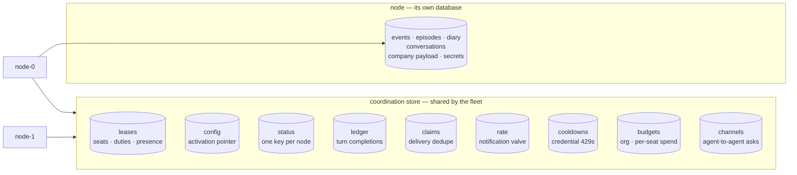

# Coordination

Crewlet keeps state in two places, and which one a fact belongs in is decided by a single question: **does the company have to agree on it, or does one node?**

- The **[store](#what-stays-node-local)** is the node's own database. One file, one process, exclusively owned. Nothing in it has to be safe against a peer.
- The **coordination store** is the fleet's shared slot. Everything that must be true for the *company* rather than for a process lives here.

Getting a fact into the wrong one is not a crash. It is a subsystem that looks correct on one node and is quietly wrong on four — which is how every entry in the table below arrived.

---

## The three-valued answer

Every question this layer answers has **three** outcomes, not two:

| Answer | Meaning |
|---|---|
| yes | The store said so. |
| no | The store said so. |
| **unknown** | The store could not be reached. |

Collapsing the third into `no` is the single most incident-hardened lesson in the engine. "I do not hold this seat" and "I could not ask whether I hold this seat" are different facts, and treating the second as the first tears a healthy company down over a two-second blip in a database.

So every call returns `(value, error)`, never a bare bool — and **each contract states which direction is safe for it**, because the safe direction is not the same for all of them:

| Contract | On an unreachable store | Why that direction |
|---|---|---|
| Rate valve | **Fails closed** — refuse | A valve that opens when it cannot be read is not a valve. The cost of refusing is a delayed notification. |
| Delivery dedupe | **Fails open** — do not suppress | A claim that cannot be read has not suppressed anything. Suppressing on a read failure drops the delivery entirely, and nothing redelivers it. |
| Completion ledger | **Fails open** — do the work | The pre-ledger answer. Failing closed parks real work during an outage; the redundant turn is bounded and visible. |
| Lease renew | **Holds, briefly** | Ambiguity is not loss. The watchdog is what bounds it — see [Seat Ownership](seat-ownership.md). |
| Budget charge | **Fails closed** — stop the round | Money leaves the building for every token, and a counter that cannot be reached must not un-cap a company. An error is *not* a refusal, though: the caller fails the turn rather than telling an agent it is out of budget. |

---

## What the fleet shares

| Slot | Answers | Documented in |
|---|---|---|
| `leases` | Which node runs which seat, which node holds which duty, and which nodes are alive at all | [Seat Ownership](seat-ownership.md#the-lease) |
| `config` | Which company revision is current. The key's own revision is the fencing epoch | [Control Plane](control-plane.md) |
| `status` | What each node managed to apply, and when it last said so | [Control Plane](control-plane.md) |
| `ledger` | Has this trigger already been worked — read before a turn, written after one | [The completion ledger](seat-ownership.md#the-completion-ledger) |
| `claims` | Has this inbound delivery been seen — the dedupe that used to be a per-process map, so a vendor's retry to a *different* ingress node woke the same seat twice | [Event System](event-system.md) |
| `rate` | The notification valve. Four nodes ran four of them, so a seat capped at five a second emitted twenty | [Event System](event-system.md) |
| `cooldowns` | Which provider credential is cooling after a 429. Per-process monotonic values are not even *comparable* across nodes | [Deployment](../guides/deployment.md) |
| `budgets` | Org and per-seat token spend. Caps stay config-derived in memory; only *usage* is shared, because a counter per node makes an org cap of 500 000 into N × 500 000 | [Deployment § Token budgets](../guides/deployment.md#token-budgets) |
| `channels` | Who is asking whom, and whether the ask is still open. The record authorizing an answer is read by the node that owns the *answering* seat — never the one that opened it | [Event System § Agent-to-agent](event-system.md) |

A fleet is not configured — it is **discovered** from these, which is why adding a node is starting a process and removing one is stopping it.

---

## Credential cooldowns, in practice

The `cooldowns` slot is the one an operator sees behave differently the moment a second node joins, so it is worth stating what it actually does.

A rate limit belongs to the **key**, at the vendor — not to the process that discovered it. Without sharing, four nodes each pay their own 429 to learn what the first one already knew, and with a two-key bag that is eight wasted calls and eight slowed turns for one quota window. The two halves of the fix are deliberately on different clocks:

| Half | When | Why there |
|---|---|---|
| **Publish** | Synchronously, on the bench that caused it | That is the only moment the fact exists. Deferring it to a tick leaves a window in which every peer rediscovers it. The write is detached from the caller's context and bounded at two seconds — the call it belongs to has *already* failed and is about to be retried on another key. |
| **Pull** | Every 15 seconds, per node | A cooldown runs for a minute at the very least (60 s is the configurable floor), so reading one a few seconds late costs nothing — while a coordination read in front of every model call would put the store's latency under every turn and its availability under the whole company. |

Three properties follow from that, and each is load-bearing:

- **A record is an instant, not a duration.** A peer that received "cool for an hour" would restart the hour whenever it happened to read the record, so a key benched once would stay benched as long as anyone kept pulling.
- **A pull extends, never shortens.** A peer's record is evidence a key is refused; the *absence* of one is not evidence a key works. So a node whose own 429 no peer heard about is never talked out of it — and an unreadable store is a no-op rather than a mass un-benching.
- **The record is scoped by the provider entry, and carries a hint rather than the key.** One credential listed under a `fast` entry and a `smart` entry is two rate-limit buckets at the vendor; an unscoped record would turn one model's burst into a company-wide outage. And the ledger is a shared store, so what goes in it is 12 hex characters of SHA-256 — enough to tell a handful of keys apart in a log, not reversible.

A node that has just started pulls **immediately** rather than waiting out its first interval: a fresh process has an empty bench, and the fleet may have a key cooling for the next hour. When one arrives that way the node says so — `credential_cooled_by_peer`, naming the provider, the key's hint and the time left — which is the only answer to the question this creates: *why is a key benched on a node that never saw a failure?*

A single node shares nothing, because there is no peer to tell. Cooldowns stay in its own process, exactly as they did before any of this existed.

---

## Retention is a bucket's age

Every slot above except `leases`, `config`, `budgets` and `channels` forgets on a horizon, and the horizon is a property of the **bucket**, not of the write.

That is a constraint rather than a preference. On the default embedded backend a per-key TTL is *create-only*: an update clears it, leaving the key immortal. A rate window that is incremented four times would therefore never expire — the one key in the system guaranteed to be written more than once. So each retention is fixed when its bucket is created, which is why they are **separate buckets** rather than prefixes in one:

| Bucket | Age | Sized from |
|---|---|---|
| `rate` | a few multiples of the window | A closed window must age out, and must never outlive its successor |
| `claims` | 5 minutes | A vendor's redelivery and an operator's replay, not the vendor's full retry schedule |
| `ledger` | 7 days | Must outlast the queue's redelivery horizon **and** the scheduler's catchup ceiling — expiring a completion a tick could still evaluate lets that fire run twice |
| `cooldowns` | 24 hours | The longest cooldown anything sets. A cooldown stores its own end instant, so the bucket only has to outlive the longest one |
| `status` | 4 reconcile intervals (~60 s) | A node that stops reporting must **vanish** from the fleet view rather than linger as a healthy row nobody is writing |
| `config` | none | The pointer is the fencing sequence, and a fence that restarts is not a fence |
| `budgets` | none | A cap is a ceiling for the life of a deployment. A counter that rolled itself over would silently re-arm a company somebody had stopped on purpose, on a horizon nobody chose — so clearing one is an operator action (`crewlet budgets reset`) |
| `channels` | none | A bucket's age cannot tell an **open** channel from a closed one, so a TTL would reap the authorization record of an ask still waiting for its answer. Closing an idle channel and deleting a closed one are decisions instead, taken by the [maintenance duty](seat-ownership.md#singleton-duties) |

Putting two of those in one bucket gives one of them the other's retention, and **every such mistake is silent** — a cooldown that expired in a second, a fleet view showing a node that died last week.

This is also why the retention sweep in the [maintenance duty](seat-ownership.md#singleton-duties) has no jobs for any of them: the broker expires the records, so there is nothing left for a sweep to delete, and a job that swept an empty table every tick would only report that it had. `channels` is the single exception, for the reason its row gives — an ageless bucket has nothing expiring it, so the sweep does both halves by hand.

---

## What stays node-local

The node's own database holds everything a *single* node is the only reader of. The test is not "is it durable" — all of it is — but "would a peer reading this change any answer?"

- **The event log, the diary, episodes, counterparty profiles, synthesized skills.** A seat's memory is read by the node running that seat.
- **Conversation history.** Replicating a long thread to the whole fleet buys nothing: the seat's owner is the only reader, and ownership already moves with the lease.
- **The company payload.** Bulk that every node holds its own copy of. Only *which revision is current* is shared — see [Control Plane](control-plane.md).
- **The secret store.** Each node resolves `${VAR}` through its own encrypted rows, sealed with the Tier A keyring it was deployed with.
- **Scheduled-run claims, pending sandbox runs, thread follows.**
- **`token_usage`** — the per-agent audit *record* of what was spent. Not the counter anything enforces against; that is the `budgets` slot above.

And two things stay **per-process** deliberately:

- **`max_concurrent`.** The concurrency gate is per node, so an org's ceiling is N × the configured value. Size it per node, not per company. This is the one knob a fleet genuinely changes the meaning of.
- **A seat's MCP subprocesses.** They are children of the node that claimed the seat, and they die with the release.

---

## Backends

| Topology | Coordination store | When |
|---|---|---|
| Embedded (default) | The engine's own in-process NATS JetStream KV | One node, or a small fleet pointed at one another |
| External NATS | A JetStream cluster's KV | A fleet that wants coordination to outlive any single engine |
| Pulsar | A NATS estate alongside the Pulsar broker | Pulsar carries the events; coordination still needs a KV |
| Memory | An in-process twin | Tests, and a single node with nothing to coordinate with |

The twin is not a lesser implementation: it is held to the **same certified suite** as the real backends (`internal/coord/coordtest`), because a twin that agrees only with itself proves nothing.

> **On the embedded backend the coordination store lives inside the running engine.** It exists while the engine runs. That is the correct trade for a single node — nothing else to install — but it has two visible consequences.
>
> An *offline* `crewlet config import --activate` cannot move the activation pointer, because there is nothing running to move it in. The command says so. A node that starts holding an active revision the fleet has no pointer for publishes it at boot, so a restart converges without any operator action.
>
> And the operator commands that act on this state talk to a **running node** rather than to a file: `crewlet budgets show` and `crewlet budgets reset` are clients of that node's API. Opening the store from outside would either find nothing (the engine is down, and an embedded broker exists only while it runs) or corrupt it (the engine is up, and a second broker on the same store directory is *accepted* rather than refused).

---

## See also

- [Seat Ownership](seat-ownership.md) — leases, the fencing epoch, singleton duties and the watchdog
- [Control Plane](control-plane.md) — the activation pointer and per-node apply status
- [Scaling Out](scaling.md) — the five kinds of coupling a fleet had to resolve, and which one a lock actually fixes
- [Deployment](../guides/deployment.md) — running more than one node
- [Event System](event-system.md) — the queue this sits beside, and what it is not
