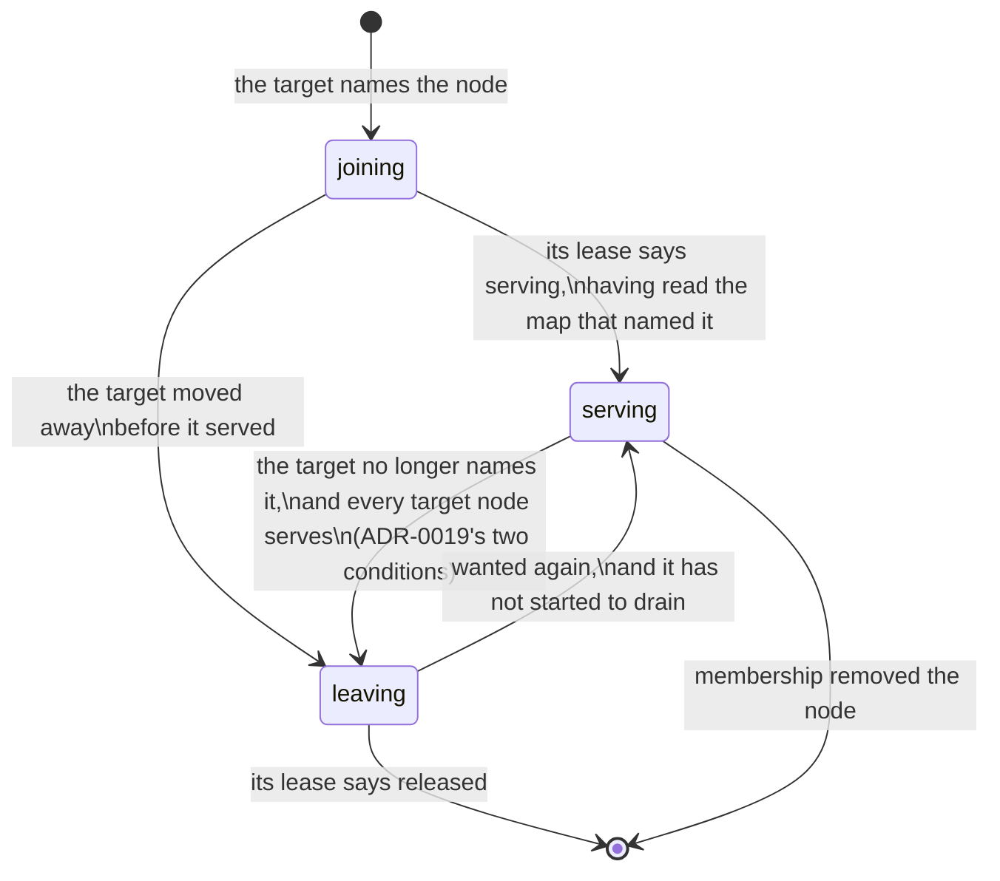
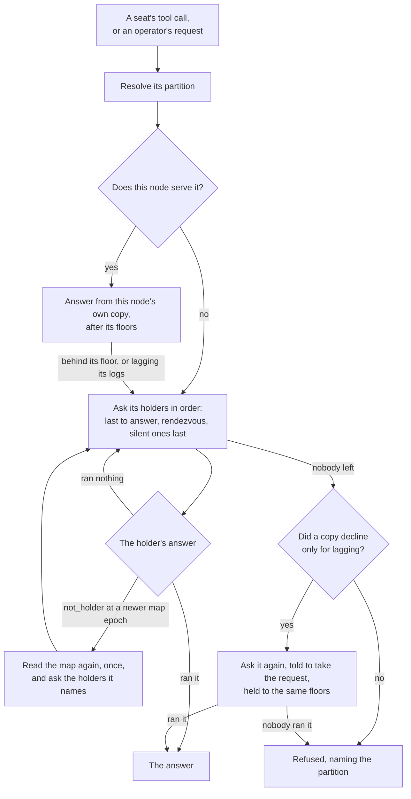

# Estate Placement

The **replicated estate** is the company's durable state that every node agrees
on: its tracker, its knowledge base and the search vectors over both. Each is a
state-log domain — an ordered log of records, applied into identical SQL copies
— and this page is about **which data nodes hold those copies**.

> **Every fleet on this build runs layout 0.** The estate is not divided into
> partitions: every data node holds the whole of it, in one file, and there is
> no estate map. Every surface below says so in one sentence — *layout 0: every
> data node holds the whole estate, so there is no partition to place, move or
> hold a node for* — and every gesture is refused in the same words. The rest
> of this page describes what those surfaces show and do once a layout divides
> the estate; the configuration and the gestures exist now so that a company
> running a partitioned layout already says how many copies it wants.

## Partitions and layouts

A **layout** divides the estate into **spaces**, each of a fixed number of
**partitions**. The partitioned layout has three: `tracker` (a project's work
lives in one of its partitions), `pages` (a container's pages live in one of
its) and `company` (the company-wide reference data, one partition). A
partition is written `tracker.007`; each carries one log per domain it holds —
the tracker's and the vectors' in a tracker partition — and one file on every
node that holds it.

A partition is the unit everything here moves: one file, one snapshot, one join,
one leave. A layout's partition counts are fixed for its life; changing them is
a repartition, which is a new layout.

## The estate map

Which data nodes hold each partition is a question the whole company has to
answer the same way now — every node routes a partition's reads and writes to
its holders — so it is **one record in the coordination store**
(`CREWLET_ESTATE_MAP`, see [Coordination](coordination.md)), changed only by
compare-and-set and watched by every node. It has two halves:

- The **target** is where each partition *should* be: the company's
  `estate.replicas` copies, drawn over the map's members by the same integer
  straw2 draw the [object store](object-store.md) uses, under a salt of the
  estate map's own so a partition's holders are never an object group's. One
  draw covers every partition of every space, with balanced shares so a node of
  twice the weight holds about twice the partitions, and copies spread across
  `estate.failure_domain` while there are enough values of it to go round.
- The **holder table** is where each partition *is*: each holder is `joining`,
  `serving` or `leaving`, with the map epoch it entered that state. Routers
  route by the holder table and nothing else.

The map's **epoch counts the holder table** and nothing else. A change of
members, shares, copies or an operator's move changes the target; the epoch
moves only when a holder is added, changes state or is removed.



## How a request reaches its partition

Every node — with `data` or without — reaches the estate through one
**router**, and a seat's tools behave the same on either kind of node. So do
the operator's surfaces: the API's tracker and knowledge-base routes, a
project's file rows and the operator's own MCP go through the same router, so a
data node whose copy is out of service answers its operator from a peer's copy,
exactly as it answers its seats. Each operation says which partition it
addresses: an operation on one task the partition that holds the task, a query
over a domain that domain's partition. At layout 0 every one of them addresses
`estate.000`.



- **This node first, where it serves the partition.** A data node answers its
  own seats' calls from its own copy, in-process, and asks nobody.
- **Otherwise the partition's holders, in order**: the node that last answered
  for this partition, then an order that spreads askers across the holders, with
  a node that went silent in the last thirty seconds asked last. At layout 0 the
  holders are every live data node the fleet's presence names; once the estate
  is divided they are the map's serving holders.
- **A node that ran nothing is passed over, whatever the operation**: one that
  does not serve the partition (`not_holder`), runs no native backend for it,
  whose copy lags its logs (asked again last — see *Which copy answers* below),
  or that is behind the caller's floor. A
  write the answering node refused because it does not serve the log's
  partition — or could not tell whether it does — appended nothing, and moves on
  too. What may be repeated once a node *may* have run a write is the
  operation's own rule: a tracker write moves on under the same operation id, a
  knowledge-base write that went unanswered is reported as unknown and never sent
  twice, and a tracker write one holder answered *unvouched* — its ledger cannot
  say whether the operation landed — is asked of the next holder under the same
  id before the caller is told the outcome is unknown.
- **`not_holder` carries the answering node's map epoch.** Newer than the one
  the asker routed by, it means the asker's view is old: it reads the map again,
  once per request, and asks the holders the fresh map names. Otherwise the
  answering node is the one behind — joining and not serving yet, or leaving —
  and the asker moves on. A node that cannot *tell* whether it serves the
  partition answers `holding_unknown` instead, naming no epoch: nothing about
  the asker's map is in question, so it moves on without reading it again.
- **Nobody serving is an answer that names the partition** — *no node serves
  `tracker.007` right now*, with what each holder said — never an empty list,
  which would say the company has none of what was asked for.

A read waits up to ten seconds on one holder before the next is asked, a write
up to a minute (or the caller's own deadline); neither is ever longer than the
caller's deadline.

### A read across partitions

A read that addresses several partitions — a search over every partition
holding its corpus — is a **gather**: each partition is answered by a node that
serves it, and the answers are merged by the read's own order. The asking node
asks each holder **once**, for all of that holder's partitions together, and
answers the partitions it serves itself in-process. A partition its holder
failed is asked of its next holder — and never again of the one that failed
it, within that read. A batch too large for one reply is answered in pages,
and a batch that takes longer than one attempt is answered shortly before the
asker would stop waiting, with every partition the holder finished; the rest
are asked of it again. A reply in which the holder settled anything carries at
least one settled partition, so a batch asked of that holder again is always
smaller: a partition whose answer is too large for any reply is the `error`
that names its size, and a reply in which the holder finished nothing moves
every partition in it on rather than being asked for again. A holder waits for
every partition's floor at once, and a node runs at most one of these
per-partition queries per CPU at a time across **everything** it is running
them for — every batch it is answering for other nodes and every read across
partitions of its own — since they all share its processors. Those places are
shared fairly between the requests waiting for them rather than first come,
first served: the next one goes to the request holding the fewest, and among
those to the one whose turn it is, a request going to the back of the line each
time one of its queries starts. So a read that arrives behind another's large
batch waits for at most a turn of each request ahead of it, never for every
query that batch queued — long enough, on a busy holder, for the later read to
be answered before any of its own queries had run. The CPUs are the process's
as the Go runtime counts them, which follows the container's CPU limit as it
changes. A read of a single partition is one query per request and does not
count against that bound.

The answer carries what it covered: the partitions that answered, where each of
their logs was when it was read, and every partition that did **not** answer,
named with why — `unserved`, `unreachable`, `behind`, `not_holder` or `error`.
A seat's tools render a missing partition as *N of M partitions did not answer;
this list may be incomplete*, never as a shorter list; and a read nothing
answered is refused naming the partitions, as a single partition is.

**What each partition is read at.** A seat's read of one partition is
`linearizable`, as it always was. Across several it is `session`: each holder
first reaches the asking node's own writes on the read's own log in that
partition **and the record whose notification started the turn** — a native
notification carries its record's position, and the turn hands it to the
node's floors before its first read. That is "no older than what I wrote and what woke me" without a
barrier on every log per read. An operator's read stays `linearizable`: each
holder appends a barrier on the partition's log of the read's own domain and
answers at or after it. A gather of one partition is a single-partition read, so at layout 0
every read is answered exactly as before.

**Read-your-writes, on every node.** Each node keeps one table of the furthest
position its writes reached on each log. Every request for a partition carries
this node's floors on the logs of the request's own domain in that partition —
a tracker read the tracker log's, a knowledge-base read the knowledge base's —
and whichever holder answers — this node included — first waits up to two
seconds to have applied them, or says it is behind and the next holder is
asked. A data node's own copy is held to the same floors, because its seats may
have written a partition through another holder while it was not serving it.
Floors on another partition's logs are never carried: a lag there is not one
this partition's holders could close. Nor are floors on another domain's log in
the same partition: no read depends on another domain's rows, so a knowledge
base whose applier is behind never holds up a tracker read, even at layout 0,
where one partition carries every log.

**Which copy answers.** A copy answers requests once it is level with its logs,
or has drained them since it started and stays within a thousand records of
their ends. A copy that does not — catching up after a restart, or pushed past
the thousand by a burst of writes — *lags*: it is passed over for a holder whose
copy does not, and asked again, told to take the request anyway, when no such
holder is left, because lagging is a copy's distance from its logs rather than
a fault. The floors and the read's own level still hold what it answers to, so
a single data node a burst put behind keeps answering its own seats rather than
refusing them until it catches up. Seat admission is stricter, and asks it of
the copy that will serve the seat: a node's own where it serves the partition,
otherwise the first holder that answers — so a node claims no seat while its
own copy is behind, and a node holding no data claims none until a data node's
copy is level.

**A copy that is wrong is not served, and its node keeps its seats.** A copy
whose applier halted, whose node was evicted, that is below its log, whose
checkpoint names another stream, whose prefix stalled or that has held a record
it cannot decode past the deferral grace stops serving its partition: other
nodes asking it are told it does not serve it, and its own seats' calls go to
the partition's other holders — exactly as a node holding no data is served
(`estate_partition_not_served` is logged once, when it stops). It serves again
the moment a reading finds the copy sound. The seats stay because they were
never the problem; a node gives them back only when it cannot route at all,
its view of who serves the estate unreadable past the 60-second bound (see
[a copy that is wrong](seat-ownership.md#a-copy-that-is-behind-and-a-copy-that-is-wrong)).

## Who is in the map

A data node offers itself on its **estate lease** (`estate:<node>`): its share
(`store.estate.weight`), its labels, the layout it runs, the map it last acted
on, whether its store can hold partitions, and — in its own words — what it
holds of each partition: `adopting`, `catching_up`, `serving`, `faulted`,
`draining` or `released`. The lease is released last in a shutdown drain, after
the node has stopped serving every partition, so a draining node never reads as
one that has gone.

Membership is the object store's lifecycle, shared: absence counted in the
maintainer's own fifteen-second ticks and never on a clock, removal after forty
of them (ten minutes) and never onto nothing, probation for a removed node seen
back, and an operator's out and hold. A lease that does not **say** its store is
healthy, or runs another layout, is counted exactly as a failed store: absent
for that tick, and removed if it goes on not saying.

## Joining and leaving, make before break

The `estate-map` duty runs one step per partition per tick:

1. A holder whose node membership removed is dropped.
2. A holder that says it is draining or released is leaving on its own; a
   leaving holder that says released, having read the map that told it to go,
   is removed.
3. A joiner that says it serves, having read the map that named it, is
   promoted — unless the node is barred (below), whose join is withdrawn.
4. A node whose lease reports a partition the map does not list is
   **adopted** — after a restore, or a node that came back with its files: an
   established copy serving, one still being built joining or leaving, and
   any copy of a barred node leaving.
5. A serving holder the target no longer names is retired only under **both**
   of ADR-0019's conditions: every target node serves the partition by the map
   *and* by its own lease, and has acted on the map that made it a server. The
   last server is never retired.
6. Every target node not yet holding the partition joins it — at most one
   transfer at a time per node, since a join into a partition somebody serves is
   a snapshot transfer, while a join into a partition nobody serves (every
   partition of a new deployment) has no donor to wait for.

Steps 1 to 5 also run **between ticks**. A node's word reaches the map when
its estate lease is renewed, so the duty's holder lists the estate leases every
second while a map exists and, once they have changed and then held still for a
second, converges the map again: a joiner is routed to, and the copy it
replaces let go, within a couple of seconds of its lease saying it serves
rather than up to a tick later. That pass counts no absence and names no join —
both stay the tick's, so membership's grace is still forty ticks and a node
still starts at most one transfer per tick.

The write side follows the same states. A joining node takes the partition's
writes from the moment its lease says `serving`, and a leaving one stops taking
them when its lease says `draining` and then **releases** each of the
partition's logs. What becomes of a write it had in flight depends on how far
the write had got. One still being decided when the node began to leave is
refused `not_holder` before anything is appended, because the node asks again
whether it serves the partition just before it appends. One already appended is
placed by the log's order alone: landed before the node's release, it is in
order and applies on every node; landed after it, it is dropped on every node
rather than applied behind the node's back, and its writer is refused
`released` — see
[Replication](../guides/replication.md#a-node-that-leaves-a-partition-releases-its-logs).
A node asked to write to a partition it does not serve refuses `not_holder`,
and another node that serves it takes the write.

A **copy**, to every surface and alarm, is a holder the map lists serving whose
node holds a live estate lease saying its store is healthy and that it runs the
map's layout. The map itself keeps a serving holder serving for membership's
ten-minute grace after its node goes; routers route to it and nothing answers,
so nothing that counts copies counts it.

## Configuration

```yaml
# company.yaml (Tier B) — the company's decision
estate:
  replicas: 3          # copies of each partition, 1..10; 0 is the default, 3
  failure_domain: zone # a node.labels key no two copies share a value of

# crewlet.yaml (Tier A) — a fact about this data node
store:
  estate:
    weight: 1          # this node's share of the partitions, 1..64; 0 is 1
```

Both are read once the estate is divided; at layout 0 every data node holds the
whole estate whatever they say.

## Reading it

- **`GET /estate`**, and the `estate` question on the socket — see the
  [API reference](../reference/api-endpoints.md#get-estate). Operator-only.
- **`crewlet estate map`** — see the [CLI reference](../reference/cli.md#crewlet-estate).
  It lists every partition that is not settled; `-all` lists every one.
- The dashboard's **Estate** screen, under Admin: one tab per space, a row per
  partition with its holders coloured by the map's state and by what each node's
  own lease reports, the members panel, the hold and the layout.

Each answers in one of five states: `whole` (layout 0), `no_map` (a partitioned
layout whose first map is not written yet — a wait), `placed`, `unreadable` (a
map a newer build wrote) and `unavailable`.

## Alarms

Every node that runs the state log watches the estate map on the maintainer's
own fifteen-second cadence and raises four [alarms](../reference/alarms.md),
each at a threshold another decision already made:

| Alarm | Fires when |
|---|---|
| `estate_partition_unserved` | A partition has no copy that can answer — the event itself |
| `estate_under_replicated` | A partition has had fewer copies than its target for longer than membership's ten-minute grace, the time the map gives a member before replacing it |
| `estate_move_stalled` | A holder has been joining for longer than the rejoin window (`stream.tracker_retention.rejoin_window`, 30 minutes by default), the budget a join is sized against |
| `estate_view_stale` | This node's view of the map or of the estate leases has not been confirmed within the age past which nothing may decide from it: the 60-second bound every cached coordination fact is held to, or the estate leases' TTL (`coordination.lease_ttl_seconds`) where that is shorter — the one rule the view itself decides by, so the alarm and the view never disagree |

The two durations are **this node's own observation**: the map records epochs,
not times, so each node measures how long it has seen a condition hold without
a break, on its own clock. That is a lower bound — a node that restarted, or
whose view went stale in between, counts from again — so an alarm can fire a
sighting late, never on a condition nobody saw hold. While the view is stale the
other three alarms are silent and `estate_view_stale` says why. The view lists
the estate leases at least every fifteen seconds whatever the lease TTL, so a
healthy node's view is never stale. Each half's age runs from when the store
was **asked** for what the view holds — a read of the map or a listing of the
leases is dated when it was sent, never when its answer arrived, and a listing
is trusted for a lease TTL from that instant. A change the map's watch delivers
has no asking: it is dated when the node receives it, by a loop that waits on
nothing else, so a read the store has stopped answering never holds a delivery
back to be dated late — except the first delivery each time the watch opens,
which is the map the store read as it opened and is dated when that opening was
asked for. So a slow answer never makes the view look fresher than anything the
store said. A watch the store closes is opened again, no sooner than a second
after the one it replaces was asked for, and one the store refuses is asked for
again fifteen seconds later, while the reads go on confirming the map. At
layout 0 there is no map, so nothing can be short of copies or stalled joining,
and `estate_under_replicated` and `estate_move_stalled` never fire.
`estate_partition_unserved` still can: the one partition is unserved when no
data node a router would ask — a live data node in the fleet's presence — has
an estate lease saying its copy serves or is catching up, which is every data
node's copy wrong at once. The fleet's presence itself is not judged, since it
answers routing alone; a presence that cannot be read makes a sighting no
sighting, as a stale view does.

## The gestures

| Gesture | Effect | Confirmed by |
|---|---|---|
| `crewlet estate out <node>` | Takes the node out of every partition's target: each copy it holds is rebuilt on another member while it serves, then released; refused where no other member could take its copies | the node |
| `crewlet estate in <node>` | Puts it back, or vouches for a node the map removed; refused for a node an eviction bars | the node |
| `crewlet estate hold -for D` | No member is removed for being gone, for at most a day | the map's generation |
| `crewlet estate release` | Ends the hold | the map's generation |
| `crewlet estate move <partition> -from <node>` | That partition's copy on that node is rebuilt on the member its ranking offers next, then released; refused where no member is left to rebuild on, and waits — the node back in the target — while members that left since leave none | the node |
| `crewlet estate move … -cancel` | Lifts the move | the node |

A hold and a release act on the whole map rather than on one node, so they
repeat the map's **generation** — which `crewlet estate map` prints — and land
only on that map: one confirmed for another fleet's, or for this one's before
it was written again from nothing, is refused with nothing written. The
generation is judged against the stored map, never before it: where there is
no map there is no generation to repeat, and the refusal is the one that says
why.

An out **moves copies and never drops one**. It is refused
(`nowhere_to_rebuild`) where no other member could take the copies the node
holds — as many placeable members as `estate.replicas`, three data nodes at
three copies — because every partition would keep one copy fewer once the node
was let go rather than have its copy rebuilt. That is one rule for both
placement maps, the object store's as well: a fleet shrinks by lowering
`estate.replicas` first, the company deciding to keep fewer copies, and never as
a side effect of a gesture about one node. The out is judged by the MAP's count,
which the map takes on its duty's next tick after the configuration is
activated, so take the node out once `crewlet estate map` shows the lower count:
sent before, it is refused again, its detail naming the activation the map's
count still comes from. A move waits on the same count. A member absent right now still
counts as somewhere to rebuild, since the map places on it until the tick
removes it.

A move **moves a copy and never drops one**. It is refused where no other
member could hold the partition's copy, and the members can change after it: a
member taken out or removed for being gone can leave the others unable to hold
every copy without the node the partition was moved off. Then that node is in
the partition's target again — the partition keeps the company's copies like
every other one — and the move stays on the map, **waiting**, until a member
returns and it takes effect. No gesture
moves the epoch; the maintainer's next tick moves the holders toward the new
targets.

**An eviction bars the node, and a readmission puts it back.**
[`crewlet retention evict`](../guides/retention.md#eviction) takes the node out
as `crewlet estate out` would, recorded with the reason `evicted` — a node the
operator judged gone, told apart from one taken out for maintenance — after the
gesture's record is on every log the node is counted on. Unlike an operator's
out, which ends when membership removes the member, the eviction is a **bar**:
it is recorded whether or not the map still holds the node — an evicted
machine is usually one the map has already let go — and neither its removal nor
its being forgotten lifts it, so a repaired machine restarted under the old id
joins as a member out and the maintainer places nothing on it while its logs
still gate it. Nor is it ever **served from**: a copy it comes back with is
listed `leaving`, whatever its lease says, and released — where an out's copy
would serve until the partition's target does, which on a fleet taking one
transfer per node at a time is hours of routers sending writes that every
holder drops. A node barred while it still serves (an eviction forced past a
live lease) is retired like any other server, once the target serves without
it, because its copy is faithful and may be the only one to rebuild from. And
while it waits, a barred node's copy is still **donated**: only its own records
are dropped, so the copy it applies is the same as any holder's, and a node
keeps offering a joiner the copies it keeps whether or not it may write them.
That is what lets a partition whose only copy came back on an evicted machine
be served again — by the node the map names in its place, adopting that copy.
`crewlet retention readmit` lifts the bar, and only once every
log has taken the node back: until then the map's part answers that it waits
for the logs, and the same operation id finishes both, on any node
([the retention guide](../guides/retention.md#eviction) says how). A gesture
reaches every log from whichever node it runs on: the node writes the logs of
the partitions it serves and runs, and sends every other log's record — as
the estate's `statelog.gate` operation — to a node that serves that
partition, which writes it on its behalf; and a readmission's judgement, made
once before anything is written, reads each such log's bound there too
(`statelog.readmission_bound`), since that node's fence is the one the
readmitted node is held to. Nothing else lifts the bar:
`crewlet estate in` refuses a barred node (`barred_member`) with the map
unchanged — and the dashboard's estate screen offers a barred node no
**Put back** but **Readmit…**, the readmission itself — because an in cannot
see the logs, and lifting the bar before they have all taken the node back
would place partitions on a node they still gate.
`crewlet estate map`
names every bar. The map's answer is a line of the gesture's own: a map that
could not be written leaves the gesture unfinished, and the same operation id
finishes it.
