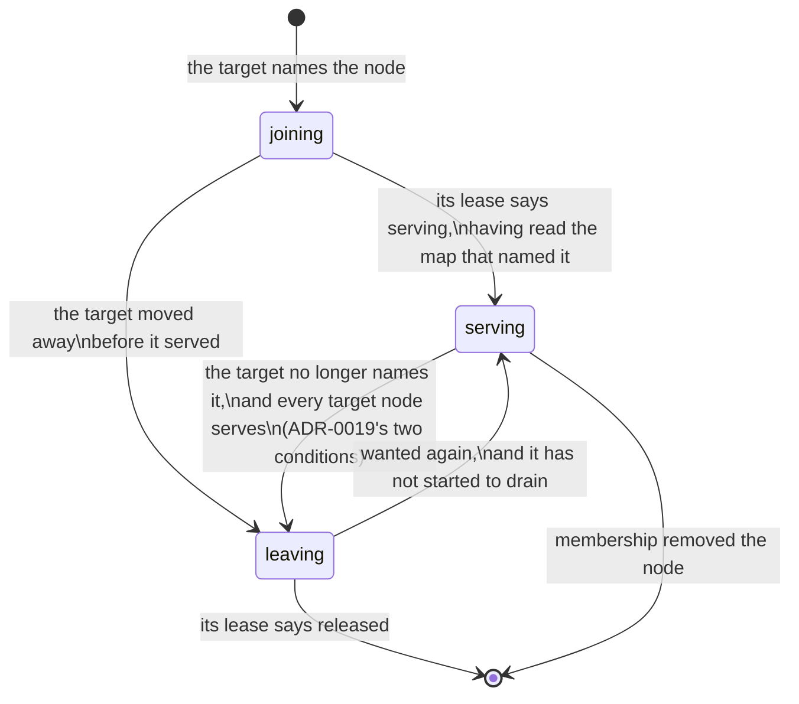

# Estate Placement

The **replicated estate** is the company's durable state that every node agrees
on: its tracker, its knowledge base and the search vectors over both. Each is a
state-log domain — an ordered log of records, applied into identical SQL copies
— and this page is about **which data nodes hold those copies**.

> **Every fleet on this build runs layout 0.** The estate is not divided into
> partitions: every data node holds the whole of it, in one file, and there is
> no estate map. Every surface below says so in one sentence — *layout 0: every
> data node holds the whole estate, so there is no partition to place, move or
> hold a node for* — and every gesture is refused in the same words. The rest
> of this page describes what those surfaces show and do once a layout divides
> the estate; the configuration and the gestures exist now so that a company
> running a partitioned layout already says how many copies it wants.

## Partitions and layouts

A **layout** divides the estate into **spaces**, each of a fixed number of
**partitions**. The partitioned layout has three: `tracker` (a project's work
lives in one of its partitions), `pages` (a container's pages live in one of
its) and `company` (the company-wide reference data, one partition). A
partition is written `tracker.007`; each carries one log per domain it holds —
the tracker's and the vectors' in a tracker partition — and one file on every
node that holds it.

A partition is the unit everything here moves: one file, one snapshot, one join,
one leave. A layout's partition counts are fixed for its life; changing them is
a repartition, which is a new layout.

## The estate map

Which data nodes hold each partition is a question the whole company has to
answer the same way now — every node routes a partition's reads and writes to
its holders — so it is **one record in the coordination store**
(`CREWLET_ESTATE_MAP`, see [Coordination](coordination.md)), changed only by
compare-and-set and watched by every node. It has two halves:

- The **target** is where each partition *should* be: the company's
  `estate.replicas` copies, drawn over the map's members by the same integer
  straw2 draw the [object store](object-store.md) uses, under a salt of the
  estate map's own so a partition's holders are never an object group's. One
  draw covers every partition of every space, with balanced shares so a node of
  twice the weight holds about twice the partitions, and copies spread across
  `estate.failure_domain` while there are enough values of it to go round.
- The **holder table** is where each partition *is*: each holder is `joining`,
  `serving` or `leaving`, with the map epoch it entered that state. Routers
  route by the holder table and nothing else.

The map's **epoch counts the holder table** and nothing else. A change of
members, shares, copies or an operator's move changes the target; the epoch
moves only when a holder is added, changes state or is removed.



## Who is in the map

A data node offers itself on its **estate lease** (`estate:<node>`): its share
(`store.estate.weight`), its labels, the layout it runs, the map it last acted
on, whether its store can hold partitions, and — in its own words — what it
holds of each partition: `adopting`, `catching_up`, `serving`, `faulted`,
`draining` or `released`. The lease is released last in a shutdown drain, after
the node has stopped serving every partition, so a draining node never reads as
one that has gone.

Membership is the object store's lifecycle, shared: absence counted in the
maintainer's own fifteen-second ticks and never on a clock, removal after forty
of them (ten minutes) and never onto nothing, probation for a removed node seen
back, and an operator's out and hold. A lease that does not **say** its store is
healthy, or runs another layout, is counted exactly as a failed store: absent
for that tick, and removed if it goes on not saying.

## Joining and leaving, make before break

The `estate-map` duty runs one step per partition per tick:

1. A holder whose node membership removed is dropped.
2. A holder that says it is draining or released is leaving on its own; a
   leaving holder that says released, having read the map that told it to go,
   is removed.
3. A joiner that says it serves, having read the map that named it, is
   promoted.
4. A node whose lease reports a partition the map does not list is
   **adopted** — after a restore, or a node that came back with its files: an
   established copy serving, one still being built joining or leaving.
5. A serving holder the target no longer names is retired only under **both**
   of ADR-0019's conditions: every target node serves the partition by the map
   *and* by its own lease, and has acted on the map that made it a server. The
   last server is never retired.
6. Every target node not yet holding the partition joins it — at most one
   transfer at a time per node, since a join into a partition somebody serves is
   a snapshot transfer, while a join into a partition nobody serves (every
   partition of a new deployment) has no donor to wait for.

The write side follows the same states. A joining node takes the partition's
writes from the moment its lease says `serving`, and a leaving one stops taking
them when its lease says `draining` and then **releases** each of the
partition's logs, so a write it still had in flight is dropped on every node
rather than applied behind its back — see
[Replication](../guides/replication.md#a-node-that-leaves-a-partition-releases-its-logs).
A node asked to write to a partition it does not serve refuses `not_holder`,
and another node that serves it takes the write.

A **copy**, to every surface and alarm, is a holder the map lists serving whose
node holds a live estate lease saying its store is healthy and that it runs the
map's layout. The map itself keeps a serving holder serving for membership's
ten-minute grace after its node goes; routers route to it and nothing answers,
so nothing that counts copies counts it.

## Configuration

```yaml
# company.yaml (Tier B) — the company's decision
estate:
  replicas: 3          # copies of each partition, 1..10; 0 is the default, 3
  failure_domain: zone # a node.labels key no two copies share a value of

# crewlet.yaml (Tier A) — a fact about this data node
store:
  estate:
    weight: 1          # this node's share of the partitions, 1..64; 0 is 1
```

Both are read once the estate is divided; at layout 0 every data node holds the
whole estate whatever they say.

## Reading it

- **`GET /estate`**, and the `estate` question on the socket — see the
  [API reference](../reference/api-endpoints.md#get-estate). Operator-only.
- **`crewlet estate map`** — see the [CLI reference](../reference/cli.md#crewlet-estate).
  It lists every partition that is not settled; `-all` lists every one.
- The dashboard's **Estate** screen, under Admin: one tab per space, a row per
  partition with its holders coloured by the map's state and by what each node's
  own lease reports, the members panel, the hold and the layout.

Each answers in one of five states: `whole` (layout 0), `no_map` (a partitioned
layout whose first map is not written yet — a wait), `placed`, `unreadable` (a
map a newer build wrote) and `unavailable`.

## Alarms

Every node that runs the state log watches the estate map on the maintainer's
own fifteen-second cadence and raises four [alarms](../reference/alarms.md),
each at a threshold another decision already made:

| Alarm | Fires when |
|---|---|
| `estate_partition_unserved` | A partition has no copy that can answer — the event itself |
| `estate_under_replicated` | A partition has had fewer copies than its target for longer than membership's ten-minute grace, the time the map gives a member before replacing it |
| `estate_move_stalled` | A holder has been joining for longer than the rejoin window (`stream.tracker_retention.rejoin_window`, 30 minutes by default), the budget a join is sized against |
| `estate_view_stale` | This node's view of the map or of the estate leases has not been confirmed within the age past which nothing may decide from it: the 60-second bound every cached coordination fact is held to, or the estate leases' TTL (`coordination.lease_ttl_seconds`) where that is shorter — the one rule the view itself decides by, so the alarm and the view never disagree |

The two durations are **this node's own observation**: the map records epochs,
not times, so each node measures how long it has seen a condition hold without
a break, on its own clock. That is a lower bound — a node that restarted, or
whose view went stale in between, counts from again — so an alarm can fire a
sighting late, never on a condition nobody saw hold. While the view is stale the
other three alarms are silent and `estate_view_stale` says why. The view lists
the estate leases at least every fifteen seconds whatever the lease TTL, so a
healthy node's view is never stale. At layout 0 there is no map, so only
`estate_view_stale` can fire; the fleet's presence, which names layout 0's
servers, is not judged, since it answers routing alone.

## The gestures

| Gesture | Effect | Confirmed by |
|---|---|---|
| `crewlet estate out <node>` | Takes the node out of every partition's target: each copy it holds is rebuilt on another member while it serves, then released | the node |
| `crewlet estate in <node>` | Puts it back, or vouches for a node the map removed | the node |
| `crewlet estate hold -for D` | No member is removed for being gone, for at most a day | the map's generation |
| `crewlet estate release` | Ends the hold | the map's generation |
| `crewlet estate move <partition> -from <node>` | That partition's copy on that node is rebuilt on the member its ranking offers next, then released; refused where no member is left to rebuild on, and waits — the node back in the target — while members that left since leave none | the node |
| `crewlet estate move … -cancel` | Lifts the move | the node |

A hold and a release act on the whole map rather than on one node, so they
repeat the map's **generation** — which `crewlet estate map` prints — and land
only on that map: one confirmed for another fleet's, or for this one's before
it was written again from nothing, is refused with nothing written. The
generation is judged against the stored map, never before it: where there is
no map there is no generation to repeat, and the refusal is the one that says
why.

A move **moves a copy and never drops one**. It is refused where no other
member could hold the partition's copy, and the members can change after it: a
member taken out or removed for being gone can leave the others unable to hold
every copy without the node the partition was moved off. Then that node is in
the partition's target again — the partition keeps the company's copies like
every other one — and the move stays on the map, **waiting**, until a member
returns and it takes effect. No gesture
moves the epoch; the maintainer's next tick moves the holders toward the new
targets.
