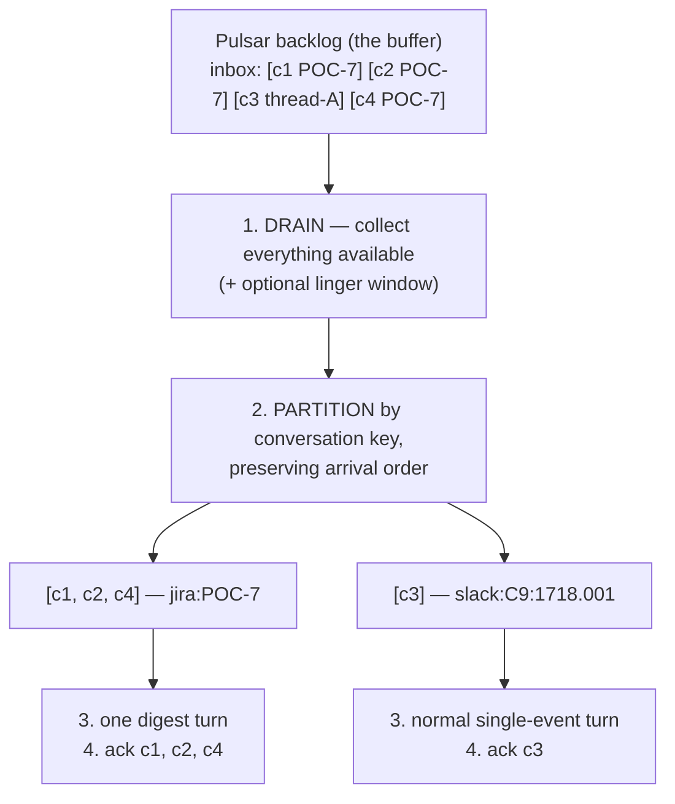
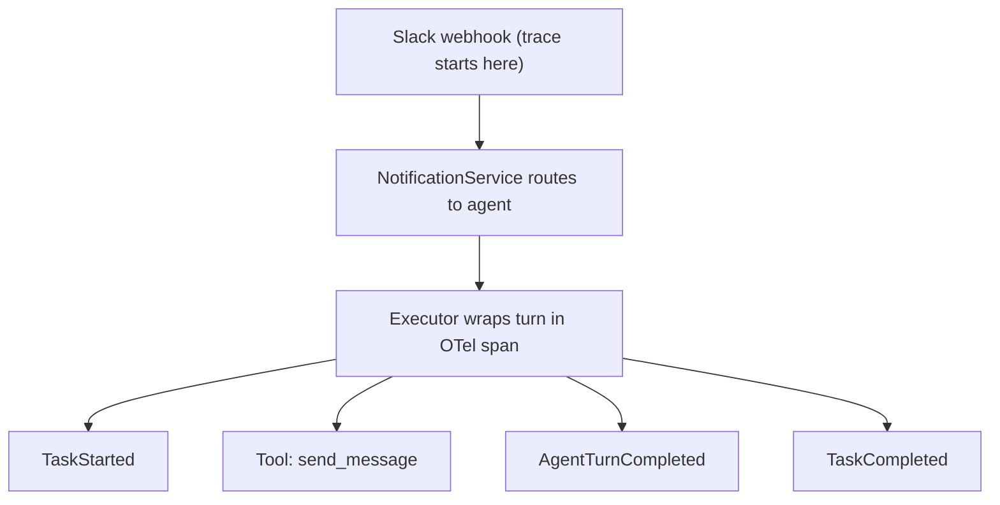
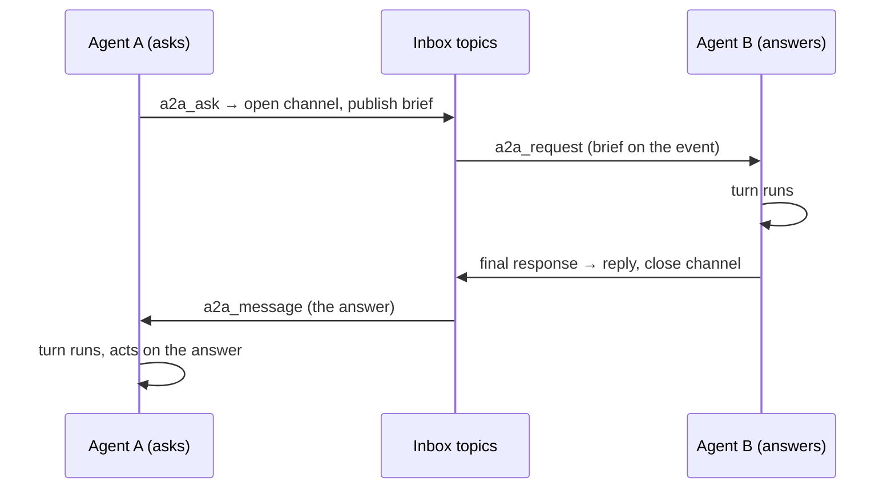

# Event System

All inter-component communication in Crewlet flows through a persistent event queue (`internal/queue`), backed by Apache Pulsar.

---

## Interfaces

One protocol serves all inter-component communication:

- **`EventQueue`** — persistent pub/sub with consumer groups. For fire-and-forget messages: task routing to agent inboxes, inbound/outbound notifications.

An in-memory implementation (`queue/memory` in `internal/queue/memory`) is used exclusively in tests. Production deployments use Apache Pulsar.

---

## Topic Structure

```
# EventQueue topics (persistent, at-least-once via Apache Pulsar)
crewlet.agent.{handle}.inbox         # Per-agent inbox — all work arrives here
crewlet.notifications.inbound        # Inbound webhooks from external systems
crewlet.notifications.outbound       # Outbound messages to external systems
```

---

## Routing

Routing is two-stage: events are first published to internal topics (e.g., `crewlet.events.task_assigned`), where the Engine's subscription handlers determine the target agent and re-publish to that agent's inbox topic. This keeps the event producers decoupled from the routing logic — they emit events without knowing which agent should handle them.

Handlers read the org through a provider on every event (never a captured snapshot), so a hot reload that swaps `engine.org` — including seat-kind flips — re-routes immediately.

**Routing is an org function, not a process-local one.** Every handler resolves its recipient from the live organization — a role name, or an agent id, to a seat, and a seat to its inbox subject — and never from the local agent pool. Each `crewlet.events.*` topic has ONE fleet-wide consumer group, so whichever node wins a delivery is the node that has to route it; that node usually is not the one running the recipient. This works because agent ids are *derived* rather than assigned: `org.Organization.AgentIDFor` is a `uuid5` over the org name and the seat's handle, so every node computes the same id for the same seat, and `AgentSeatByID` / `AgentSeatByHandle` invert it with no database and no live instance. The inbox subject itself has one definition, `topics.AgentInbox` — a producer and a consumer that disagree about a topic name do not raise, they just stop talking to each other.

When the resolved target is a **[human seat](humans-in-the-org.md)**, the event is skipped: a human has no inbox and no turn to wake, and the engine never sends as itself. These internal events route to agents only; the human is notified natively by the PM tool / Slack where the work lives (and agents reach humans through their own colleague-surface tools with an @-mention). Inbound external-surface webhooks addressed to a human are likewise recorded as an info-level skip, not an undeliverable warning.

---

## Inbox Batching & Coalescing

An agent turn takes minutes; webhooks arrive in seconds. Without batching, ten comments on one Jira issue that arrived while the agent was mid-turn would drain as **ten sequential full turns** — 10× LLM cost, each turn seeing one comment in isolation, potentially ten separate replies. Inbox delivery is therefore **batched per conversation**.

**The buffer is the broker backlog** — no second in-memory buffering layer. Holding events in process memory after their broker message was acknowledged would silently lose them on a crash; instead, the inbox consume loop changes how the backlog is *drained*:



**`subscribe_batch`** (`EventQueue` protocol; Pulsar + memory backends) implements steps 1–4: after the first message arrives it drains everything immediately available — plus anything arriving within `BatchOptions.LingerSeconds` of the first message — up to `BatchOptions.MaxBatch`, partitions by a caller-supplied key, invokes the handler **once per partition** (sequentially — per-agent serialization is unchanged), and acknowledges a partition's messages only after its handler returns. A failing partition negatively-acknowledges exactly its own messages (normal redelivery / DLQ policy per message) without blocking or replaying other conversations from the same drain. `pause_delivery` during collection NAKs anything fetched-but-undispatched so the next engine subscription gets it promptly.

**Ack-budget deferral.** Every drained message's broker ack-timeout clock starts at receive, but a partition handler is typically a full multi-minute turn — dispatching a long tail of partitions sequentially would hold later messages delivered-but-unacked for the *sum* of preceding turns and blow through the 30-minute ack window mid-drain (redelivered duplicate turns). The Pulsar backend therefore dispatches partitions only while the drain is within a 60-second budget **measured from the first receive** — time spent lingering in collection counts against it, which is also why the linger config is capped at 60s; once the budget is spent, every remaining partition is **requeued** — each event republished to the topic (identity intact: same id, timestamp, trace; the event store's `(event_time, event_id)` upsert stays idempotent), then the original acked. Requeued events carry zero accrued redeliveries (deferral can never push a healthy conversation toward the DLQ) and re-partition on the next drain, which begins right after the current turn — so throughput matches sequential dispatch while each message's unacked window only ever covers one turn. Partitions dispatch **oldest conversation first** (by oldest constituent event timestamp, which survives requeue): a deferred conversation ages and outranks the hot conversation's fresh arrivals on the next drain, so steady inflow on one issue cannot starve a waiting DM.

**Conversation keys** (`notify.Prompt.ConversationKey`) are derived by pure logic from webhook metadata, via the same per-source `notify.Prompt` classes that own prompt building: Jira keys on the issue (`jira:POC-7`), Confluence on the page, GitHub on `repo#number`. Slack keys on the **whole channel for top-level DM and group-DM messages** (`channel_type` `im`/`mpim`, or a `D`-prefixed channel id when the event variant omits the field — a human firing four rapid top-level DM messages is one conversation; a DM *thread reply* keeps its thread key so the merged trigger never carries the wrong reply target) and on channel + thread root elsewhere (`slack:C9:1718.001` — a top-level channel message keys on its own `ts` so its replies join it, while two unrelated asks in a shared channel never merge). Everything else — `task_assigned`, A2A wakes, notifications without a derivable conversation — keys uniquely on the event id and is **never coalesced**: single-event partitions follow exactly the pre-batching dispatch path.

The same key now has a second consumer that outlives the drain. Coalescing merges the messages of one conversation that arrive *together*; [conversation sessions](conversation-sessions.md) carry what the seat did about them into that conversation's **next** turn, and the episode row and the turn's telemetry are stamped with the key so history can be asked for by thread rather than only by agent and time. The `event:{uuid}` fallback above is exactly why those consumers store nothing for a trigger without a real conversation: no later message could ever reproduce that key to read the row back.

**Busy agents queue; parked agents requeue.** A delivery that finds its agent mid-turn does not fail: `turn.Engine.Run` WAITS for the running turn to finish (the handler already holds the delivery for a full turn, so the ack window — 30 minutes — is sized for a wait plus a worst-case turn). A delivery that finds the agent parked on a detached sandbox job (`AWAITING_SANDBOX`, potentially hours) is requeued + acked instead — the coordinator keeps the topic paused, so the copies buffer on the broker and flow when the job completes. Before the engine has a turn engine at all (booted with zero LLM providers), the handler pauses the topic and requeues likewise; the late turn-engine build resumes every inbox. Busy-agent handling therefore never consumes-and-drops and never pushes healthy events toward the dead-letter topic.

**Unsubscribe.** `EventQueue.Unsubscribe` tears down the durable group consumer(s) for the pair and deletes the broker-side subscription (retained messages for the group are dropped). The engine calls it when a role is decommissioned live, so a removed seat neither keeps a consumer bound to a terminated instance nor accumulates undeliverable events forever. Inbox subscription is idempotent per agent handle — boot and the late turn-engine path both walk the pool, and only the first subscribe per agent creates a consumer.

**The digest trigger.** A multi-event partition is merged by `internal/notify`'s coalescer into ONE notification: a chronological digest of the earlier messages, then the **latest** constituent's full enriched body — so the per-source scaffolding (triage rules, `## Get Full Context`) renders exactly once and points at the most recent state. Two noise filters apply in the digest: per-source supersede rules (`notify.Prompt.DigestBody` — Jira `issue_updated` bodies, stale full descriptions whose current state the Jira prompt never renders anyway, collapse to their event lead) and a source-agnostic **same-sender duplicate dedupe** — a constituent whose effective body is byte-identical to a later message from the same sender collapses to a marker (GitHub lifecycle webhooks re-emit the full PR description per event; the later copy still renders, so nothing is lost, and two different people saying "+1" both survive). Comments and messages always keep their text. The merged event carries every constituent in `messages` (sender, salient body, metadata, per-message recon flag — full fidelity for the [learning workers](agent-learning.md), which observe **each distinct sender**), a conservative event-level recon merge, the max-depth constituent's delegation bookkeeping (batching cannot launder the depth cap), and the latest constituent's trace context. Same-id duplicate deliveries (an at-least-once edge the requeue machinery itself can produce) are dropped at the handler before any merging. If a partition cannot be merged (a malformed constituent), the engine degrades to per-event dispatch — the tail is requeued as independent inbox messages FIRST, then the first event runs in the current ack scope — so a requeue failure aborts before any turn ran and a completed turn is never replayed by a later event's failure; partially-requeued copies collapse via the same-id dedupe on redelivery. A `NotificationsCoalesced` telemetry event records each merge for the dashboard / event store.

**Two knobs** (Tier B, hot-reloadable — see the [configuration reference](../getting-started/configuration.md)):

| Field | Default | Meaning |
|---|---|---|
| `notification_coalesce_window_seconds` | `0` | Linger after the first pending event before dispatching. `0` adds **no latency** and still coalesces the busy case — backlog that accumulated during a turn is drained together regardless. A positive window (5–15 s) additionally absorbs bursts while the agent is idle (a human typing several messages, a Jira comment+status+assign webhook cluster). |
| `notification_coalesce_max_batch` | `20` | Cap per digest; a larger backlog arrives as successive capped batches rather than one unbounded megaprompt. |

With the window at `0`, an idle-agent burst worst-cases at **two** turns (the first message wakes the agent immediately; everything arriving during that turn coalesces into one follow-up turn per conversation) — never N.

**Relation to the rate limiter.** `notification_rate_limit` (NotificationService, default off) *drops* notifications above N/agent/second — it remains purely a safety valve against pathological webhook storms and notification loops. Burst handling is coalescing's job: a coalesced comment is context preserved, a dropped one is context lost.

DACI decisions are conducted in **Slack threads** — the driver opens a thread in the team channel with its own Slack MCP tools and all contributions, proposals, and approvals are thread replies; there is no engine-side decision machinery. See [Decision Framework](decision-framework.md) for details.

---

## Event Types

```text
# Lifecycle
OrgStarted, OrgStopped
AgentSpawned, AgentTerminated, AgentReassigned
RoleUpdated              # role definition changed during config reload

# Task (routed to specific agent inboxes)
TaskCreated, TaskAssigned, TaskStarted
TaskCompleted, TaskFailed, TaskDelegated

# Communication
MessageSent              # agent sent a message to a channel

# Knowledge
DocumentCreated, DocumentUpdated

# Notification
ExternalNotification     # inbound from Jira, Slack, GitHub, email
NotificationSkipped      # dropped notification with reason (traceability)
NotificationsCoalesced   # N same-conversation inbox events merged into one
                         # digest trigger (see Inbox Batching above)

# System
AgentTurnCompleted       # full LLM reasoning cycle with tokens/tools
AgentTurnProgress        # incremental per-round updates (not persisted);
                         # carries turn_id/phase/iteration so live
                         # consumers can place in-flight rounds inside
                         # the turn/phase grouping. Fires twice per
                         # round -- when the model has spoken, then
                         # when that round's tools have returned
BudgetExhausted
TurnGuardBreach          # runtime invariant fired (stall / max_iter / depth_cap /
                         # unhandled_exception / scheduled_timeout).
                         # Drives the dashboard `afk` state.
LLMUnavailable           # FallbackLLMProvider chain exhausted.
                         # Drives the dashboard `afk` state.
```

---

## Event Schema

Every event carries a common set of fields: a unique ID (UUID), a type string, a UTC timestamp, an optional source identifier, and a free-form payload dict. Specialized event types (e.g., `TaskAssigned`) add their own fields with defaults.

Events also carry **OpenTelemetry trace context** and self-describing properties:

```go
type Event struct {
    ID        uuid.UUID
    Type      string
    Timestamp time.Time
    Source    string
    Payload   map[string]any   // free-form extras; typed fields live in Data

    // OpenTelemetry trace context — captured at construction from the
    // active span.
    TraceID      string // W3C 32-char hex, groups causally related events
    SpanID       string // W3C 16-char hex, identifies this event in the trace
    ParentSpanID string // links to the event/span that caused this one

    // Turn-engine bookkeeping, so an agent woken by a colleague handoff
    // inherits the correct depth and chain.
    DelegationDepth int
    ParentTurnID    string
    DelegationChain []string

    // Data is the typed body, non-nil when Type is registered in this
    // build. Marshalled flat into the same JSON object as the envelope.
    Data Payload
}
```

`Payload` is the typed half: each registered event type is a Go type with its
own fields and its own `Summary()` — "who did what", in a person's words — and
an `Actor()` (role, then source, then agent id, then `system`). An event type
this build does not know decodes into the envelope with `Data` nil, and
re-publishes losslessly.

Changes are additive-only — new fields get defaults, existing fields are never removed, and an event type this build does not know round-trips through it losslessly rather than being dropped: a rolling upgrade puts unknown types on the wire in both directions. Every backend retains each subscription's undelivered backlog until it is consumed, so a restart resumes cleanly; durable, replayable event history is the [event store](../guides/deployment.md#the-event-store), not the queue. On Pulsar, time-based retention of already-acknowledged messages is an optional namespace retention policy.

---

## Distributed Tracing

Events carry **OpenTelemetry-compatible trace context** (W3C Trace Context format). Trace IDs propagate automatically through the system — no manual threading:



**How it works:**

1. Webhook handlers create an OTel span → all events created inside inherit `trace_id`
2. When events cross async boundaries (EventQueue → handler), the receiving component restores the OTel context from the event's `trace_id`/`span_id`
3. The Event model's `trace_id` field defaults to the active span's trace id which reads the active OTel span

**Where "automatic" stops.** Point 3 is a read of the *ambient* span, so it
only works while one is open. An event constructed outside every span gets an
**empty** `trace_id` — and an event with no trace is unreachable from the work
it belongs to, which on the dashboard shows up as a trace link that goes
nowhere. Phases open spans, the engine itself does not, so anything published
from engine code *after* `run_turn` has returned is in that state. Those call
sites copy the causing event's context forward explicitly
(`trace_id` / `span_id` / `parent_span_id`) rather than relying on capture —
the A2A reply and channel-close do this from the ask, and
`A2AMessageDelivered` from the wake. Copy it **verbatim**: `run_turn` calls
`restore_context` with those values, so the woken turn becomes a child of the
span that caused it.

**When notifications are dropped** (own message, not following thread, rate limit), a `NotificationSkipped` event is emitted with the skip reason — visible in the trace so you can see why a webhook didn't reach an agent.

The dashboard groups events by `trace_id` into collapsible trace trees. See [Deployment — Tracing](../guides/deployment.md#tracing) for OTLP export configuration.

---

## Publish Listeners

The `EventQueue` supports **publish listeners** — async callbacks invoked inline during every `publish()` call. Listeners receive the topic and event, and run in the same coroutine as the publish. Exceptions in listeners are logged but do not prevent the publish or affect queue delivery.

This is used by the **event store writer** to persist events directly at publish time, inline on the node that published — no subscription, and therefore no consumer group that could let two nodes write one row or lose one in a rebalance. See [Deployment — The event store](../guides/deployment.md#the-event-store) for details.

---

## Broadcast Streams (`subscribe_stream`)

Beyond competing-consumer `subscribe()` and inline `add_publish_listener`, the `EventQueue` exposes **`subscribe_stream(topic_pattern, handler)`** for live-stream consumers (dashboards, real-time log views). Every subscriber receives every matching event — no consumer-group division.

The Pulsar backend implements this with a per-caller **regex topic-pattern subscription**, started at the latest message (so it streams new events — backfill is served separately by the REST event store) and torn down when the caller unsubscribes. Because Pulsar discovers pattern-matching topics on a periodic cycle, a brand-new agent's first events may lag the stream briefly; already-active topics match immediately. The memory backend implements it with a topic-filtered publish listener.

The dashboard's `/ws/stream` endpoint uses this primitive: each connected tab is one ephemeral consumer, and the in-process `api/stream` both updates the live-state projection and fans every event out to every connected WebSocket. See [API Endpoints — Live Stream](../reference/api-endpoints.md#live-stream).

`topic_pattern` accepts subject wildcards: `*` matches one segment, `>` matches one-or-more trailing segments.

---

## Communication

Two communication systems:

### External Channels (Slack, Email)

Org-wide announcements, department coordination, and team discussions happen through external tools (Slack channels, email) via the **Notification Service**. Agents use MCP tools to post and receive messages from Slack, and the notification service routes inbound webhooks to agent inboxes.

- **Org-wide** — announcements (via Slack `#announcements` channel)
- **Department** — leads-only coordination (via Slack department channel)
- **Team** — team coordination, DACI decisions (via Slack team channel)

### Ephemeral A2A channels (`crewlet.a2a`)

Private 1:1 conversations between agents, for tight-loop / mechanical sync that should *not* show up on the team's chat or issue tracker. One question, one answer, then the channel closes.

An agent opens one with the `a2a_ask` tool and ends its turn. The brief travels **on the wake event** in the target's inbox, so it reaches whichever node owns that seat; the answering agent's **final response is the reply**, delivered back on the same channel and waking the asker. There is no `send_a2a_message` tool and no channel lifecycle for a model to manage — replying is just answering.



Both hops are ordinary inbox deliveries: durable, ordered per conversation, routed to the seat's owner, and covered by the [completion ledger](seat-ownership.md#the-completion-ledger) so a redelivery does not run the turn twice. Channel state — the two participants, open or closed, the message count — lives in the `a2a_channels` table, because every authorization decision reads it and the two parties are usually on different nodes. Without a database it falls back to an in-process store, which is correct for a single node and no more (same rule as [seat placement](seat-ownership.md)).

A channel is closed by the answering turn. One whose answer never came — a crashed turn, a node that died between the wake and the reply — is closed by the maintenance sweep after `A2A_CHANNEL_IDLE_TIMEOUT_SECONDS` (1 hour, three times the longest a turn can legitimately still be running), and the row is deleted after seven days. Closed rows outlive the conversation on purpose: *closed* is the answer to "why did my reply bounce", while a vanished row is indistinguishable from a typo'd channel id.

Either way the close publishes `a2a_channel_closed` naming both participants, the message count and how long the channel was open — including on the sweep path, which is where it matters most, since a channel only reaches the sweep because a turn did not finish. The duration is the difference between the store's own `opened_at` and `closed_at`, not between two nodes' clocks: a channel is opened on one node and closed on another as a matter of course, and the difference of two machines' opinions of the time is skew rather than a duration.

| Aspect | External Channels (Slack) | A2A channels |
|---|---|---|
| **Lifetime** | Permanent (Slack workspace) | Ephemeral (one question and its answer) |
| **Backend** | Slack API + Notification Service | Agent inbox topics + `a2a_channels` |
| **Persistence** | Yes (Slack history) | State yes, content only as events |
| **Visibility** | The team sees it | Private to the two agents |
| **Use case** | Broadcasting, team coordination | Tight-loop / mechanical sync |
