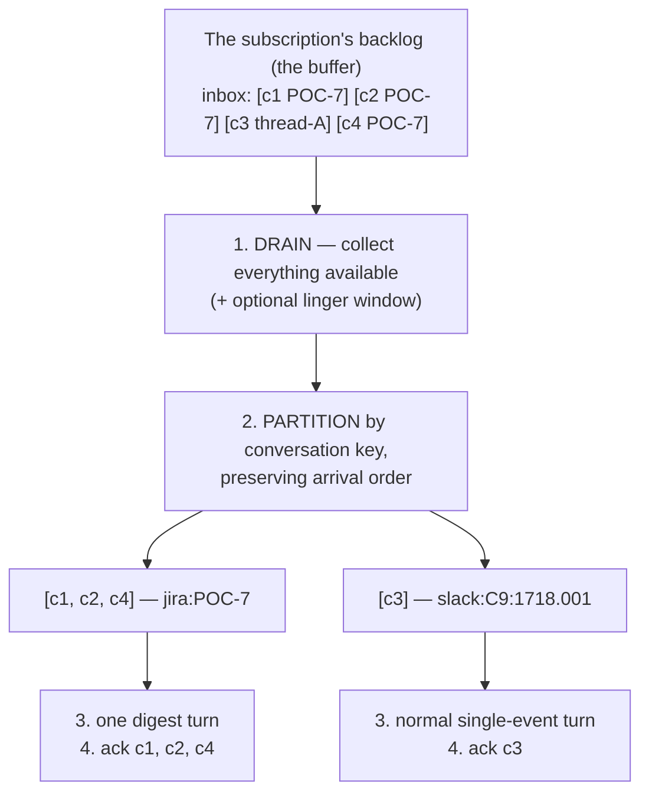
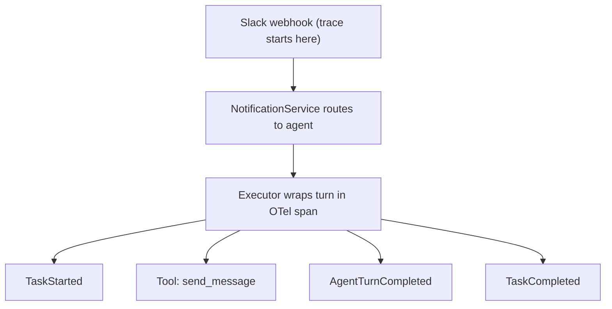
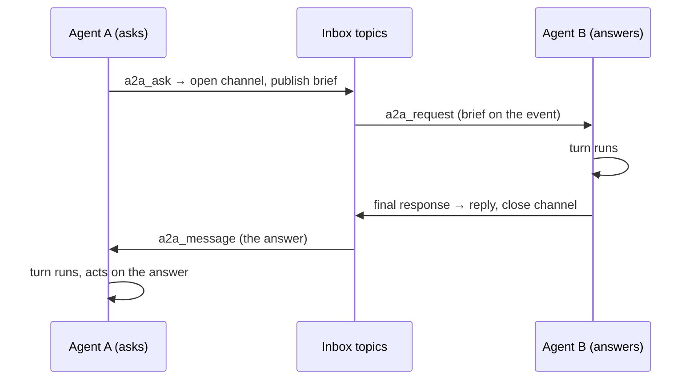

# Event System

All inter-component communication in Crewlet flows through a persistent event queue (`internal/queue`), backed by NATS JetStream — a broker the engine runs **inside its own process** by default, and an external NATS cluster when a fleet needs one.

---

## Interfaces

One protocol serves all inter-component communication:

- **`EventQueue`** — persistent pub/sub with consumer groups. For fire-and-forget messages: inbound deliveries, the wakes they route to agent inboxes, and everything a turn publishes about itself.

**Two implementations** sit behind it — the JetStream client and an in-memory twin — and **nothing above `internal/queue` may branch on which one is running**. Where the broker itself runs is a third question, and it is a *connection* choice inside the first implementation rather than a second code path:

| Where the broker runs | What that is |
|---|---|
| **In this process** — `stream.type: embedded`, the default | A NATS JetStream server started in the engine's own process. No listener, no port, no service to operate: in the solo case it binds no socket at all, so the broker cannot be reached from outside the process. `stream.store_dir` makes its streams file-backed and restart-surviving; left empty they live in memory, which is what a test and a stateless ingress-only node want. |
| **Somewhere else** — `stream.type: nats` | The same client code against a NATS server or cluster somebody else runs, dialled through `stream.url`. That sameness is what lets a laptop run the whole company with no services and a fleet run the same binary against a cluster. |
| **Nowhere — the in-memory twin** (`internal/queue/memory`) | The test twin: a real broker object plus N clients rather than one fused thing, so a test can stop a node and still inspect what its subscription retained. |

Both are certified by **one** conformance suite (`internal/queue/queuetest`). A backend that suite has not certified does not exist as far as the engine is concerned — which is exactly why the twin is certified by the same cases as the real broker rather than by cases written for a twin.

A fleet's shape is a stream choice: clustered embedded members (`stream.cluster.name` / `.port` / `.peers` on each node, `stream.replicas: 3`) or one external cluster every node dials. See [Running a Fleet](../guides/fleet.md).

---

## Topic Structure

```text
# Per-seat, durable. One consumer group per seat, so membership IS ownership:
# the node that attaches is the node that gets that seat's work.
crewlet.agent.{handle}.inbox         # Per-agent inbox — all work arrives here
crewlet.agent.{handle}.control       # Sandbox completions — separate, because a
                                     #   detached run PAUSES the inbox and a
                                     #   completion riding it would queue behind
                                     #   the very pause it exists to lift

# Fleet-wide work queues — ONE consumer group each, so whichever node wins a
# delivery is the node that has to route it
crewlet.notifications.inbound        # Inbound webhooks from external systems.
                                     #   There is no outbound counterpart:
                                     #   nothing the engine sends outward is
                                     #   queued — an agent writes through its
                                     #   OWN MCP tools inside its turn, and the
                                     #   chat working-indicator is a transport
                                     #   call on the node already running it
crewlet.events.{type}                # Internal routing (see Routing, below)

# Control plane. Best-effort nudges: losing one costs a poll interval, never a
# revision, because the authoritative path polls the activation pointer
crewlet.config.revision_activated
crewlet.config.revision_applied

# A seat's memory, ONE SUBJECT PER ROW, on a stream that retains one message
# per subject — so it holds the current value of every row rather than a log of
# every write, and a node acquiring a seat replays it in a single pass
crewlet.memory.{handle}.{table}.{key-digest}

# Dead letters, deliberately OUTSIDE the crewlet.* space so the dashboard's
# crewlet.events.> stream cannot resurface poison as live traffic
dlq.{topic}.{group}.{digest}         # the head is for grepping, the digest is
                                     #   the identity: a join alone aliases
                                     #   distinct (topic, group) pairs
```

Every one of those strings is built by `internal/queue/topics` and nowhere else. The inbox subject alone had nine call sites when it was formatted by hand — nine chances for a producer and a consumer to disagree about a name that has to match exactly, and a mismatch raises nothing anywhere: it is a message published to a topic nobody reads.

The subjects are grouped into streams by **purpose**, because retention differs by purpose rather than by taste:

| Stream | Carries | Retention, and why |
|---|---|---|
| `CREWLET_AGENT` | `crewlet.agent.>` | **Interest.** A message is kept while a durable consumer that has not acked it exists, and a publish to a subject no consumer covers is dropped. That is precisely the mailbox semantic the contract already promises, so the broker enforcing it is a feature — and it is why every seat's consumer must exist before anything publishes to it |
| `CREWLET_NOTIFICATIONS` | `crewlet.notifications.>` | Interest, for the same reason: these are work queues, not a log |
| `CREWLET_EVENTS` | `crewlet.events.>` | **Limits**, with an age bound — 30 days, or `stream.event_retention_hours`. Its consumers are ephemeral dashboards and per-node materializers that must be able to fall behind, disconnect and catch up |
| `CREWLET_CONFIG` | `crewlet.config.>` | Limits, one hour. A short bound keeps a restarted node from replaying a week of stale activation announcements |
| `CREWLET_DLQ` | `dlq.>` | Limits, the event stream's age bound. Nothing consumes dead letters automatically, and an operator investigating poison needs them still to be there |

A subject in a namespace the engine does not itself define gets a stream provisioned on demand, with the mailbox semantic as its default. That is deliberate rather than lax: the stream topology is the backend's business, but the **subject space** is the engine's, and a whitelist here would make the backend the authority on what the engine may name.

---

## Delivery Semantics

What the engine relies on, and where each behaviour is enforced (`internal/queue/jetstream`):

**Pull, not push.** Consumers fetch — one message for an ordinary subscription, one drain's worth for an inbox — when they are ready to run one. Nothing is pushed into a client-side queue, so a consumer that is quiesced, paused or detached holds no mail hostage; it simply stops asking. It is also what makes quiescing reversible at no cost: resuming is fetching again, not reclaiming a prefetch.

**A durable consumer, created detached.** `EnsureSubscription` creates a seat's consumer with explicit acks and nothing attached, positioned at `DeliverAll` — about a millisecond, which is what makes it affordable for every node to create the mailbox behind every seat in the company at boot. Never at "latest": such a consumer exists and still discards everything published before something first attaches to it, which is the whole failure this call prevents.

**Three outcomes, not two.** A handler acks, naks, or **defers**:

- **Ack** — done. It is the zero value, so the quiet path is the safe one.
- **Nak** — the handler failed. Redelivered after a one-second spacing, because an immediately-redelivered failure spins the loop at full speed against whatever is broken.
- **Defer** — *this process has lost the right to do this work*. The message goes back with an immediate Nak — about a millisecond, where letting the ack timer expire would park a seat's mail for the whole ack window on every lease movement — and the consumer **quiesces itself**, since continuing to fetch would hand it more work it has equally lost the right to do. Never a republish: a republished event is a new message at the stream's tail, and both the [completion ledger](seat-ownership.md#the-completion-ledger)'s idempotency and the batch layer's aging key on the identity a Nak preserves.

**The ack clock is real.** A fetched-unacked message stays invisible to every other consumer of that subscription for `ackWait` — **30 minutes**, sized for a wait behind a running turn plus one worst-case turn. It is a backstop rather than the handoff path: a seat that loses its lease defers explicitly and its successor sees the message in about a millisecond, where waiting the clock out would cost half an hour.

**Dead-lettering is decided client-side, with the broker as backstop.** A message is republished to `CREWLET_DLQ` and terminated once it has been delivered 25 times. The decision lives in the consume loop because that is where the dead-letter subject is known and the body is in hand; the broker's own `MaxDeliver` is configured to the same number so a bug in that path cannot produce an infinite loop. Twenty-five is sized for handoffs as well as poison — a deferral returns via Nak and **counts as a delivery**, so a message would have to be in flight across 25 seat migrations to exhaust the budget. The honest caveat, which no budget solves: a fast crash-loop is indistinguishable from poison.

**Order within a conversation comes from event timestamps, not from the broker.** A redelivered message returns *behind* never-delivered ones. Nothing above the queue may assume otherwise, which is why the batch layer sorts by the events' own timestamps.

---

## Routing

Routing is two-stage: events are first published to internal topics (e.g., `crewlet.events.task_assigned`), where the Engine's subscription handlers determine the target agent and re-publish to that agent's inbox topic. This keeps the event producers decoupled from the routing logic — they emit events without knowing which agent should handle them.

Handlers read the org through a provider on every event (never a captured snapshot), so a hot reload that swaps `engine.org` — including seat-kind flips — re-routes immediately.

**Routing is an org function, not a process-local one.** Every handler resolves its recipient from the live organization — a role name, or an agent id, to a seat, and a seat to its inbox subject — and never from the local agent pool. Each `crewlet.events.*` topic has ONE fleet-wide consumer group, so whichever node wins a delivery is the node that has to route it; that node usually is not the one running the recipient. This works because agent ids are *derived* rather than assigned: `org.Organization.AgentIDFor` is a `uuid5` over the org name and the seat's handle, so every node computes the same id for the same seat, and `AgentSeatByID` / `AgentSeatByHandle` invert it with no database and no live instance. The inbox subject itself has one definition, `topics.AgentInbox` — a producer and a consumer that disagree about a topic name do not raise, they just stop talking to each other.

### A seat's mailbox exists before the seat is running

A durable subscription **is** the mailbox, and it exists independently of whether anyone is consuming it. That is not a detail — publishing to a topic that no subscription covers **drops the event silently**, with nothing anywhere reporting a loss. On the shipped backend that is the broker's own rule rather than a convention the engine could soften: the agent and notification streams use interest retention, which keeps a message exactly while some durable consumer that has not acked it exists.

So every node creates the subscription behind **every agent seat in the company** as it starts, before it claims a single one, and again whenever an applied revision adds a role. Not its own share: a mailbox is a fact about the company, and the node that ends up serving a seat may not be the one that made its mailbox. Creating one is idempotent, so a fleet doing it N times costs N−1 no-ops.

What this buys is that a trigger aimed at a seat nobody is running yet **waits** instead of vanishing:

- during boot and during a rollout, where seats are claimed a few per sweep and the rest are briefly unowned;
- for a seat whose placement no live node matches — a role pinned to a node that is down, or carrying a label nobody has. The sweep already reports those as `seats_unplaceable`; their work now accumulates and drains the moment a matching node appears.

When the resolved target is a **[human seat](humans-in-the-org.md)**, the event is skipped: a human has no inbox and no turn to wake, and the engine never sends as itself. These internal events route to agents only; the human is notified natively by the PM tool / Slack where the work lives (and agents reach humans through their own colleague-surface tools with an @-mention). Inbound external-surface webhooks addressed to a human are likewise recorded as an info-level skip, not an undeliverable warning.

---

## Inbox Batching & Coalescing

An agent turn takes minutes; webhooks arrive in seconds. Without batching, ten comments on one Jira issue that arrived while the agent was mid-turn would drain as **ten sequential full turns** — 10× LLM cost, each turn seeing one comment in isolation, potentially ten separate replies. Inbox delivery is therefore **batched per conversation**.

**The buffer is the broker backlog** — no second in-memory buffering layer. Holding events in process memory after their broker message was acknowledged would silently lose them on a crash; instead, the inbox consume loop changes how the backlog is *drained*:



**`SubscribeBatch`** (the `EventQueue` contract; both implementations) does steps 1–4: after the first message arrives it drains everything immediately available — plus anything arriving within `BatchOptions.LingerSeconds` of the first message — up to `BatchOptions.MaxBatch`, partitions by a caller-supplied key, invokes the handler **once per partition** (sequentially — per-agent serialization is unchanged), and acknowledges a partition's messages only after its handler returns. A failing partition negatively-acknowledges exactly its own messages (normal redelivery / DLQ policy per message) without blocking or replaying other conversations from the same drain. A pause taken *during* collection — `PauseDelivery`, or a hold on this seat's inbox — NAKs the whole drain back rather than flushing it past the pause: the point of pausing a seat's inbox is that no turn starts, and a batch collected a moment earlier would start one.

**The ack budget.** Every drained message's ack clock starts at receive, but a partition handler is typically a full multi-minute turn — so dispatching a long tail of partitions sequentially holds later messages delivered-but-unacked for the *sum* of the preceding turns. That clock is real: `ackWait` is 30 minutes, and collection plus one handler run must fit inside it — which is why the linger is capped at 60 s. The number lives once, as `queue.MaxLingerSeconds`: the contract clamps to it on every read so programmatic construction cannot bypass it, and config validation refuses an out-of-range value at load from that same constant, so an operator is told rather than silently cut. A drain whose partitions together outlast the window is not lost, it is **redelivered**: the tail comes back, each redelivery spends one unit of the 25-delivery budget, and the [completion ledger](seat-ownership.md#the-completion-ledger) plus the same-id dedupe are what make that a redelivery rather than a second turn (`TurnTriggerSkipped` is emitted precisely so it is not invisible). What is never substituted is a republish: it would be a *new* message at the stream's tail, and both the ledger's idempotency and the batch layer's aging key on the identity a NAK preserves. Partitions dispatch **oldest conversation first** (by oldest constituent event timestamp): a waiting conversation ages and outranks the hot conversation's fresh arrivals on the next drain, so steady inflow on one issue cannot starve a waiting DM.

**Conversation keys** (`notify.Prompt.ConversationKey`) are derived by pure logic from webhook metadata, via the same per-source `notify.Prompt` classes that own prompt building: Jira keys on the issue (`jira:POC-7`), Confluence on the page, GitHub on `repo#number`. Slack keys on the **whole channel for top-level DM and group-DM messages** (`channel_type` `im`/`mpim`, or a `D`-prefixed channel id when the event variant omits the field — a human firing four rapid top-level DM messages is one conversation; a DM *thread reply* keeps its thread key so the merged trigger never carries the wrong reply target) and on channel + thread root elsewhere (`slack:C9:1718.001` — a top-level channel message keys on its own `ts` so its replies join it, while two unrelated asks in a shared channel never merge). Everything else — `task_assigned`, A2A wakes, notifications without a derivable conversation — keys uniquely on the event id and is **never coalesced**: single-event partitions follow exactly the pre-batching dispatch path.

The same key now has a second consumer that outlives the drain. Coalescing merges the messages of one conversation that arrive *together*; [conversation sessions](conversation-sessions.md) carry what the seat did about them into that conversation's **next** turn, and the episode row and the turn's telemetry are stamped with the key so history can be asked for by thread rather than only by agent and time. The `event:{uuid}` fallback above is exactly why those consumers store nothing for a trigger without a real conversation: no later message could ever reproduce that key to read the row back.

**Busy agents queue; parked agents requeue.** A delivery that finds its agent mid-turn does not fail, and nothing has to make it wait: a seat's attachment dispatches one partition at a time from a single goroutine, so the next partition is not fetched until the running one's handler returns, and the per-node concurrency gate holds anything past `node.max_concurrent` in this process rather than handing it back. The handler therefore holds the delivery for a full turn, which is what JetStream's ack window — 30 minutes — is sized for: a wait plus a worst-case turn. A delivery that finds the agent parked on a detached sandbox job (`AWAITING_SANDBOX`, potentially hours) is requeued + acked instead, so nothing is held against the ack window. Before the engine has a turn engine at all (booted with zero LLM providers), the handler pauses the topic first and then requeues. Neither path consumes-and-drops, and neither pushes a healthy event toward the dead-letter topic.

> **Known gap — the park spins, and the pause is one-way.** Two halves of the same missing piece. Nothing takes a pause hold for the sandbox park, so its requeued copies land back on a topic the seat is still consuming and are re-parked immediately: a seat parked on a long run republishes and acks in a loop for the length of the run. Nothing loses work — the same-id dedupe and the completion ledger hold — but the loop is real. And `ResumeTopic` has no caller at all, so the hold the zero-provider path *does* take is never lifted. Both want the same fix and have to land together: a pause at the park, and a release driven by the condition clearing, because a pause without a release leaves a seat deaf until the process restarts.

**Letting go of a subscription — four verbs, not one.** "Unsubscribe" never said *which* kind of letting go it meant, so the contract spells all four out by destructiveness: `Quiesce` stops taking new work while staying attached, `Unquiesce` undoes it, `Detach` closes this process's consumers and leaves the durable subscription (its cursor and its retained mail survive, which is what makes a seat handoff cheap and an unowned seat safe), and `DeleteSubscription` destroys the subscription and the mail it retains. The last one deliberately does not require a local attachment, because decommissioning a role must not depend on which node happened to be running the seat. Creating an inbox subscription is idempotent per agent handle: the node's own start and every config apply both walk the pool, and only the first call per seat creates a consumer.

> **Known gap.** `DeleteSubscription` has no caller. A role removed from a live company therefore keeps its durable subscription, and events addressed to it accumulate against a seat nothing will ever run. Nothing else in the engine tears one down, so this is not covered elsewhere — it wants a decommission step on the config apply, beside the pool walk that creates them.

**The digest trigger.** A multi-event partition is merged by `internal/notify`'s coalescer into ONE notification: a chronological digest of the earlier messages, then the **latest** constituent's full enriched body — so the per-source scaffolding (triage rules, `## Get Full Context`) renders exactly once and points at the most recent state. Two noise filters apply in the digest: per-source supersede rules (`notify.Prompt.DigestBody` — Jira `issue_updated` bodies, stale full descriptions whose current state the Jira prompt never renders anyway, collapse to their event lead) and a source-agnostic **same-sender duplicate dedupe** — a constituent whose effective body is byte-identical to a later message from the same sender collapses to a marker, so a vendor that re-emits unchanged state does not bury the one actionable line. It is the backstop rather than the first line of defence: where a vendor has a supersede rule the rule fires first (a code host's lifecycle events collapse to their lead there, never reaching this), and what reaches the dedupe is the case no rule anticipated. Two different people each saying "+1" are two facts and both survive. Comments and messages always keep their text. The merged event carries every constituent in `messages` (sender, salient body, metadata, per-message recon flag — full fidelity for the [learning workers](agent-learning.md), which observe **each distinct sender**), a conservative event-level recon merge and an equally conservative delivery-obligation merge (one direct ask inside a burst of broadcasts is still somebody waiting), the max-depth constituent's delegation bookkeeping (batching cannot launder the depth cap), and the FIRST constituent's trace context — the same event the merged ask leads with, because a span cannot have two parents and rooting the turn under the message the rest are replies to is what makes the trace readable. The other constituents are already recorded as the turn's interactions. Same-id duplicate deliveries (an at-least-once edge the requeue machinery itself can produce) are dropped at the handler before any merging. If a partition cannot be merged (a malformed constituent), the engine degrades to per-event dispatch — the tail is requeued as independent inbox messages FIRST, then the first event runs in the current ack scope — so a requeue failure aborts before any turn ran and a completed turn is never replayed by a later event's failure; partially-requeued copies collapse via the same-id dedupe on redelivery. A `NotificationsCoalesced` telemetry event records each merge for the dashboard / event store.

**Two knobs** (Tier B, hot-reloadable — see the [configuration reference](../getting-started/configuration.md)):

| Field | Default | Meaning |
|---|---|---|
| `notification_coalesce_window_seconds` | `0` (range `0`–`60`) | Linger after the first pending event before dispatching. `0` adds **no latency** and still coalesces the busy case — backlog that accumulated during a turn is drained together regardless. A positive window (5–15 s) additionally absorbs bursts while the agent is idle (a human typing several messages, a Jira comment+status+assign webhook cluster). |
| `notification_coalesce_max_batch` | `20` (range `1`–`100`) | Events collected into one **drain**, before partitioning — so it bounds a digest as a consequence (a digest can never exceed it) and it bounds the drain itself, which is what has to fit the ack budget alongside a whole turn. A larger backlog arrives as successive capped drains rather than one unbounded megaprompt, and a drain that spans several conversations shares the cap between them: 24 events over 4 conversations at `20` is two drains, so 8 turns rather than 4. Raise it for a company whose seats routinely serve several busy threads at once. The `100` ceiling is the digest's: the trigger is re-sent to the model on every round of the tool loop, so a constituent count multiplies the dominant repeated content of a turn. |

With the window at `0`, an idle-agent burst worst-cases at **two** turns (the first message wakes the agent immediately; everything arriving during that turn coalesces into one follow-up turn per conversation) — never N.

**Relation to the rate limiter.** `notification_rate_limit` (NotificationService, default off) *drops* notifications above N/agent/second — it remains purely a safety valve against pathological webhook storms and notification loops. Burst handling is coalescing's job: a coalesced comment is context preserved, a dropped one is context lost.

DACI decisions are conducted in **Slack threads** — the driver opens a thread in the team channel with its own Slack MCP tools and all contributions, proposals, and approvals are thread replies; there is no engine-side decision machinery. See [Decision Framework](decision-framework.md) for details.

---

## Event Types

Grouped by the **category** each one is filed under — the same closed set the
`GET /events?category=` filter and the dashboard's category chips use. The
authoritative list, generated from the engine's own map, is
[Deployment § What gets stored](../guides/deployment.md#what-gets-stored-and-under-which-category);
this is the shape of it, with the notes that need a sentence.

```text
# lifecycle — the org and its seats coming and going, plus the config
#             changes an operator goes looking for after the fact
OrgStarted, OrgStopped
AgentSpawned, AgentTerminated, AgentReassigned
RoleUpdated                # role definition changed during a config apply
ConfigRevisionActivated    # a new revision is the one to serve
ConfigRevisionApplied      # one node's outcome, and how far it got

# task — work created, assigned and done, including a detached coding run
#        (the execution of a task) and a schedule firing (which creates one)
TaskCreated, TaskAssigned, TaskStarted
TaskCompleted, TaskFailed, TaskDelegated
SandboxRunStarted, SandboxClarificationRequested, SandboxRunCompleted
ScheduledTaskFired

# communication
MessageSent                # agent sent a message to a channel

# a2a — one ask, one answer, then closed
A2AChannelOpened, A2AMessageSent, A2AMessageDelivered, A2AChannelClosed

# knowledge
DocumentCreated, DocumentUpdated

# decision — DACI is behavioural guidance on the org's own chat surfaces,
#            so NOTHING in Crewlet publishes these four. They stay mapped as
#            the seam an extension that does model decisions writes through,
#            and they are why the category exists to filter on at all
DecisionRequested, DecisionResolved
ContributionRequested, ContributionReceived

# notification — what arrived from outside, and what the engine decided
ExternalNotification       # inbound from a vendor webhook or chat socket
NotificationSkipped        # dropped notification with reason (traceability)
NotificationsCoalesced     # N same-conversation inbox events merged into one
                           # digest trigger (see Inbox Batching above)
TurnTriggerSkipped         # a redelivery the completion ledger had already
                           # worked -- emitted precisely so it is not invisible

# learning — the reflection subsystem and the skill lifecycle, grouped so a
#            dashboard can include or exclude all of it with one toggle
TurnCompleted, EpisodeWritten, PersistDeciderCompleted
CounterpartyProfileUpdated, ReflectionCompleted
SkillSynthesized, SkillRefined, SkillPromoted, SkillUsed
SkillStaled, SkillArchived, SkillRevived
PrefetchSummary
CompactionRequested, CompactionCompleted

# system — the engine talking about itself
AgentTurnCompleted         # full LLM reasoning cycle with tokens/tools
AgentPhaseStarted, AgentPhaseCompleted
BudgetExhausted
TurnGuardBreach            # runtime invariant fired (stall / max_iter /
                           # depth_cap / unhandled_exception /
                           # scheduled_timeout). Drives the dashboard `afk`
                           # state
LLMUnavailable             # the fallback chain is exhausted. Drives `afk` too
ProviderFallback           # the chain moved to its next provider
SubagentBatched, PromptSize, ExecuteMissingTool
PhaseToolActivated, PhaseToolSkillBlocked, SkillTelemetryWriteFailed

# webhook — no event type: the receiver writes the delivery's row itself,
#           with the provider's exact bytes as the payload
```

**Three types are published and deliberately never stored**, each for a stated
reason — `AgentTurnProgress` (a live-only per-round signal whose durable record
is `AgentPhaseCompleted`), `BudgetReported` (a snapshot of in-memory meters
that mean nothing outside the run that produced them) and `RawWebhook` (the
delivery is already a row). The first two still drive the live projection. See
the exclusions table in the Deployment page above.

---

## Event Schema

Every event carries a common set of fields: a unique ID (UUID), a type string, a UTC timestamp, an optional source identifier, and a free-form payload dict. Specialized event types (e.g., `TaskAssigned`) add their own fields with defaults.

Events also carry **OpenTelemetry trace context** and self-describing properties:

```go
type Event struct {
    ID        uuid.UUID
    Type      string
    Timestamp time.Time
    Source    string
    Payload   map[string]any   // free-form extras; typed fields live in Data

    // OpenTelemetry trace context — captured at construction from the
    // active span.
    TraceID      string // W3C 32-char hex, groups causally related events
    SpanID       string // W3C 16-char hex, identifies this event in the trace
    ParentSpanID string // links to the event/span that caused this one

    // Turn-engine bookkeeping, so an agent woken by a colleague handoff
    // inherits the correct depth and chain.
    DelegationDepth int
    ParentTurnID    string
    DelegationChain []string

    // Data is the typed body, non-nil when Type is registered in this
    // build. Marshalled flat into the same JSON object as the envelope.
    Data Payload
}
```

`Payload` is the typed half: each registered event type is a Go type with its
own fields and its own `Summary()` — "who did what", in a person's words — and
an `Actor()` (role, then source, then agent id, then `system`). An event type
this build does not know decodes into the envelope with `Data` nil, and
re-publishes losslessly.

Changes are additive-only — new fields get defaults, existing fields are never removed, and an event type this build does not know round-trips through it losslessly rather than being dropped: a rolling upgrade puts unknown types on the wire in both directions. Every backend retains each subscription's undelivered backlog until it is consumed, so a restart resumes cleanly; durable, replayable event history is the [event store](../guides/deployment.md#the-event-store), not the queue. The queue keeps no ledger of everything ever published, and that is the mailbox semantic rather than a gap: on the work-queue streams an acked message is gone at once, and what a subscription retains is what nobody has acked yet. The one stream that keeps history is `CREWLET_EVENTS`, and it keeps it by **age** (`stream.event_retention_hours`, 30 days by default) rather than until someone reads it.

---

## Distributed Tracing

Events carry **OpenTelemetry-compatible trace context** (W3C Trace Context format). Trace IDs propagate automatically through the system — no manual threading:



**How it works:**

1. The webhook edge opens a span, so a delivery is the root of the trace
   everything it causes hangs under. An inbound W3C `traceparent` is honoured
   if one is present, which is what makes a delivery forwarded through your own
   gateway join your trace rather than start a second one.
2. Events carry `trace_id` / `span_id` / `parent_span_id` in the envelope. That
   is the only carrier — the queue backends move an event's bytes and nothing
   else — and it is what crosses the broker, the store and a node boundary.
3. When an event wakes a seat, the dispatcher restores its trace onto the
   context before the turn runs, so the turn's span is a child of the span that
   caused it rather than a new root.

**The trace is passed, never captured.** An event's trace is an argument to its
constructor (`events.New(payload, trace)`), and the caller derives that
argument from the context with `tracing.TraceOf(ctx)`. This is deliberate: an
event that read an *ambient* span at construction would be one whose trace
depends on which frame happened to build it.

`TraceOf` never returns empty. Inside a span it reports that span's ids; with
no span open it mints a fresh root, which is what every publisher in the engine
used to do by hand. So there is no "events published outside a span lose their
trace" case any more — the older behaviour, where such an event got an empty
`trace_id` and became unreachable from the work it belonged to, is gone.

**Each event's `span_id` is the span that emitted it**, and `parent_span_id`
the span above. A turn does not republish its trigger's span id as its own;
that made every event in a turn look like the same span and collapsed the
dashboard's tree onto the wake that started it.

**When notifications are dropped** (own message, not following thread, rate limit), a `NotificationSkipped` event is emitted with the skip reason — visible in the trace so you can see why a webhook didn't reach an agent.

The dashboard groups events by `trace_id` into collapsible trace trees. See [Deployment — Tracing](../guides/deployment.md#tracing) for OTLP export configuration.

---

## Publish Listeners

The `EventQueue` supports **publish listeners** — callbacks `AddPublishListener` registers, invoked inline during every `Publish`. Listeners receive the topic and the event and run on the publishing goroutine, after the broker has acknowledged the message. A listener that fails, or panics, is logged and never propagates: telemetry must not be able to fail a publish.

This is used by the **event store writer** to persist events directly at publish time, inline on the node that published — no subscription, and therefore no consumer group that could let two nodes write one row or lose one in a rebalance. See [Deployment — The event store](../guides/deployment.md#the-event-store) for details.

---

## Broadcast Streams (`SubscribeStream`)

Beyond competing-consumer `Subscribe` and inline `AddPublishListener`, the `EventQueue` exposes **`SubscribeStream(pattern, handler)`** for live-stream consumers (dashboards, real-time log views). Every subscriber receives every matching event — no consumer-group division.

The JetStream backend implements it as a per-caller **ephemeral consumer** on the stream the pattern resolves to, and three of its settings are the whole design. It delivers from *now* rather than from the beginning, because a live feed that replayed a month of history on every browser refresh would be unusable and the durable half of that question is a REST query against the event store. It acknowledges nothing, because a dashboard must never be able to hold a message — a slow subscriber misses events rather than keeping them from anyone else. And it carries a one-minute inactivity threshold, so the server reaps it shortly after a browser tab goes away even if the caller never unsubscribes. A pattern that would span every namespace is refused rather than resolved to a guess. The memory twin implements the same primitive with a topic-filtered publish listener.

The dashboard's `/ws/stream` endpoint uses this primitive: each connected tab is one ephemeral consumer, and the in-process `api/stream` both updates the live-state projection and fans every event out to every connected WebSocket. See [API Endpoints — Live Stream](../reference/api-endpoints.md#live-stream).

The pattern accepts subject wildcards: `*` matches one segment, `>` matches one-or-more trailing segments. Crewlet's subject grammar **is** NATS grammar, which is a large part of why this backend fits: the wildcards a caller writes are the wildcards the broker matches, with no translation layer to disagree about.

---

## Communication

Two communication systems:

### External Channels (Slack, Email)

Org-wide announcements, department coordination, and team discussions happen through external tools (Slack channels, email) via the **Notification Service**. Agents use MCP tools to post and receive messages from Slack, and the notification service routes inbound webhooks to agent inboxes.

- **Org-wide** — announcements (via Slack `#announcements` channel)
- **Department** — leads-only coordination (via Slack department channel)
- **Team** — team coordination, DACI decisions (via Slack team channel)

### Ephemeral A2A channels (`crewlet.a2a`)

Private 1:1 conversations between agents, for tight-loop / mechanical sync that should *not* show up on the team's chat or issue tracker. One question, one answer, then the channel closes.

An agent opens one with the `a2a_ask` tool and ends its turn. The brief travels **on the wake event** in the target's inbox, so it reaches whichever node owns that seat; the answering agent's **final response is the reply**, delivered back on the same channel and waking the asker. There is no `send_a2a_message` tool and no channel lifecycle for a model to manage — replying is just answering.



Both hops are ordinary inbox deliveries: durable, ordered per conversation, routed to the seat's owner, and covered by the [completion ledger](seat-ownership.md#the-completion-ledger) so a redelivery does not run the turn twice. Channel state — the two participants, open or closed, the message count — lives in the [coordination store](coordination.md)'s `channels` slot, because the two parties are usually on different nodes and the node that authorizes the *answer* is the one that owns the answering seat, never the one that opened the channel. A single node uses the in-process coordination twin, which is a real implementation of the same certified contract rather than a fallback.

A channel is closed by the answering turn. One whose answer never came — a crashed turn, a node that died between the wake and the reply — is closed by the [maintenance duty](seat-ownership.md#singleton-duties) after **1 hour** idle (three times the longest a turn can legitimately still be running), and the record is deleted seven days after that. Neither is configurable, and neither is a bucket age: the coordination store expires its other slots on a clock, but a clock cannot tell an *open* channel from a closed one, so it would reap the authorization record of an ask still waiting for its answer. Closed records outlive the conversation on purpose: *closed* is the answer to "why did my reply bounce", while a vanished record is indistinguishable from a typo'd channel id.

Either way the close publishes `a2a_channel_closed` naming both participants, the message count and how long the channel was open — including on the sweep path, which is where it matters most, since a channel only reaches the sweep because a turn did not finish. The duration is the difference between the record's own `opened_at` and `closed_at`, not between two nodes' clocks: a channel is opened on one node and closed on another as a matter of course, and the difference of two machines' opinions of the time is skew rather than a duration.

| Aspect | External Channels (Slack) | A2A channels |
|---|---|---|
| **Lifetime** | Permanent (Slack workspace) | Ephemeral (one question and its answer) |
| **Backend** | Slack API + Notification Service | Agent inbox topics + the coordination store's `channels` slot |
| **Persistence** | Yes (Slack history) | State yes, content only as events |
| **Visibility** | The team sees it | Private to the two agents |
| **Use case** | Broadcasting, team coordination | Tight-loop / mechanical sync |
