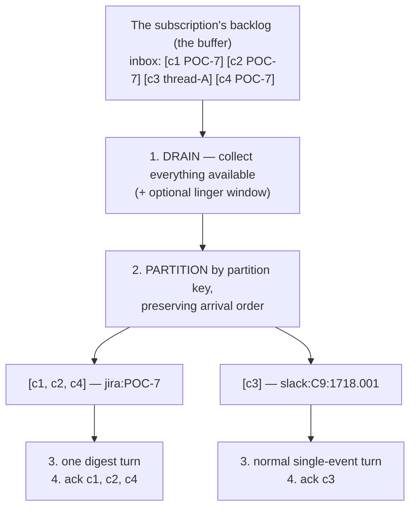
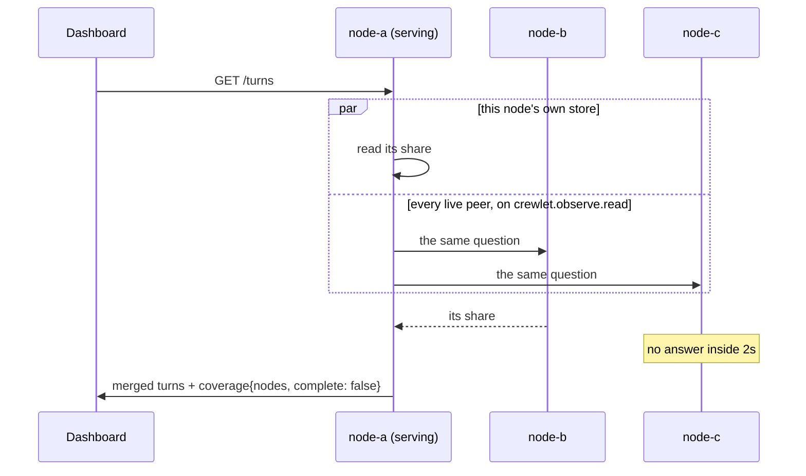
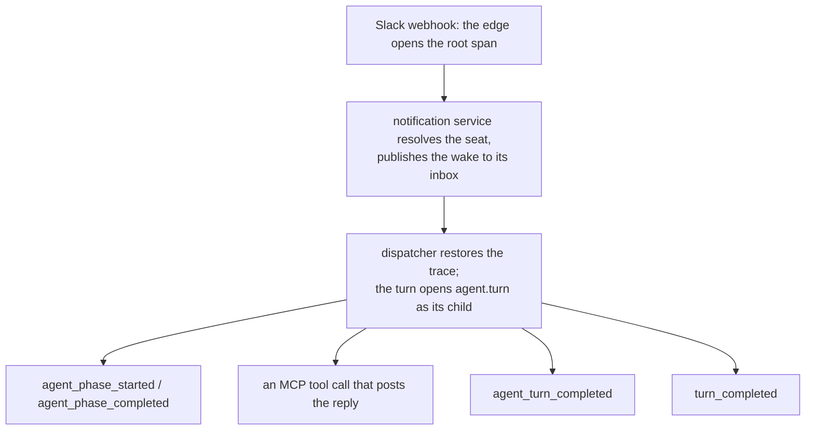
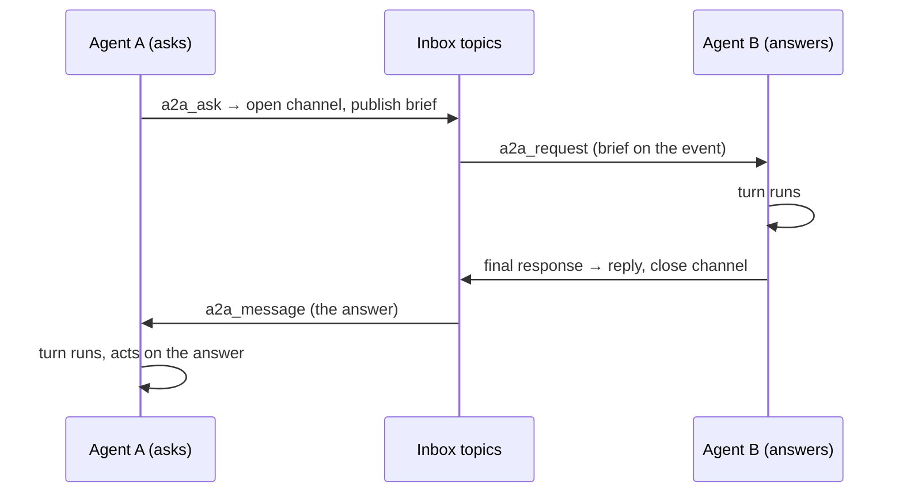

# Event System

All inter-component communication in Crewlet flows through a persistent event queue (`internal/queue`), backed by NATS JetStream — a broker the engine runs **inside its own process** by default, and an external NATS cluster when a fleet needs one.

---

## Interfaces

One interface serves all inter-component communication:

- **`queue.EventQueue`**: persistent pub/sub with consumer groups. For fire-and-forget messages: inbound deliveries, the wakes they route to agent inboxes, and everything a turn publishes about itself.

**Two implementations** sit behind it — the JetStream client and an in-memory twin — and **nothing above `internal/queue` may branch on which one is running**. Where the broker itself runs is a third question, and it is a *connection* choice inside the first implementation rather than a second code path:

| Where the broker runs | What that is |
|---|---|
| **In this process** — `stream.type: embedded`, the default | A NATS JetStream server started in the engine's own process. No listener, no port, no service to operate: in the solo case it binds no socket at all, so the broker cannot be reached from outside the process. `stream.store_dir` makes its streams file-backed and restart-surviving; left empty they live in memory, which a company whose tracker and knowledge base are both a vendor's may use — on any node, whatever its `node.roles`, since every node runs the engine. On either native backend — the default pairing — the engine **refuses** an in-memory stream, because the company's own tracker and knowledge base keep their logs there and a restart would recreate them empty (see [Configuration](../getting-started/configuration.md#stream)). |
| **Somewhere else** — `stream.type: nats` | The same client code against a NATS server or cluster somebody else runs, dialled through `stream.url`. That sameness is what lets a laptop run the whole company with no services and a fleet run the same binary against a cluster. |
| **Nowhere — the in-memory twin** (`internal/queue/memory`) | The test twin: a real broker object plus N clients rather than one fused thing, so a test can stop a node and still inspect what its subscription retained. |

Both are certified by **one** conformance suite (`internal/queue/queuetest`). A backend that suite has not certified does not exist as far as the engine is concerned — which is exactly why the twin is certified by the same cases as the real broker rather than by cases written for a twin.

A fleet's shape is a stream choice: clustered embedded members (`stream.cluster.name` / `.port` / `.peers` on each node, `stream.replicas: 3`) or one external cluster every node dials. See [Running a Fleet](../guides/fleet.md).

---

## Topic Structure

```text
# Per-seat, durable. One consumer group per seat, so membership IS ownership:
# the node that attaches is the node that gets that seat's work.
crewlet.agent.{handle}.inbox         # Per-agent inbox — all work arrives here
crewlet.agent.{handle}.control       # Sandbox starts and completions. Separate,
                                     #   because while a run holds the seat
                                     #   every inbox delivery is parked, and a
                                     #   completion riding the inbox would be
                                     #   parked behind the very busy state it
                                     #   exists to clear

# Fleet-wide work queues — ONE consumer group each, so whichever node wins a
# delivery is the node that has to route it
crewlet.notifications.inbound        # Inbound webhooks from external systems.
                                     #   There is no outbound counterpart:
                                     #   nothing the engine sends outward is
                                     #   queued — an agent writes through its
                                     #   OWN MCP tools inside its turn, and the
                                     #   chat working-indicator is a transport
                                     #   call on the node already running it
crewlet.events.{type}                # What the engine records about itself:
                                     #   the event store's listener, the live
                                     #   projection and reflection's
                                     #   turn_completed group read it. Nothing
                                     #   routes work from here (see Routing)

# Control plane. Best-effort nudges: losing one costs a poll interval, never a
# revision, because the authoritative path polls the activation pointer
crewlet.config.revision_activated
crewlet.config.revision_applied

# A seat's memory, ONE SUBJECT PER ROW, on a stream that retains one message
# per subject — so it holds the current value of every row rather than a log of
# every write, and a node acquiring a seat replays it in a single pass
crewlet.memory.{handle}.{table}.{key-digest}

# Dead letters, deliberately OUTSIDE the crewlet.* space so the dashboard's
# crewlet.events.> stream cannot resurface poison as live traffic
dlq.{topic}.{group}.{digest}         # the head is for grepping, the digest is
                                     #   the identity: a join alone aliases
                                     #   distinct (topic, group) pairs
```

Every one of those strings is built by `internal/queue/topics` and nowhere else. The inbox subject alone had nine call sites when it was formatted by hand — nine chances for a producer and a consumer to disagree about a name that has to match exactly, and a mismatch raises nothing anywhere: it is a message published to a topic nobody reads.

The subjects are grouped into streams by **purpose**, because retention differs by purpose rather than by taste:

| Stream | Carries | Retention, and why |
|---|---|---|
| `CREWLET_AGENT` | `crewlet.agent.>` | **Interest.** A message is kept while a durable consumer that has not acked it exists, and a publish to a subject no consumer covers is dropped. That is precisely the mailbox semantic the contract already promises, so the broker enforcing it is a feature — and it is why every seat's consumer must exist before anything publishes to it |
| `CREWLET_NOTIFICATIONS` | `crewlet.notifications.>` | Interest, for the same reason: these are work queues, not a log |
| `CREWLET_EVENTS` | `crewlet.events.>` | **Limits**, with an age bound — 30 days, or `stream.event_retention_hours`. Its consumers are ephemeral dashboards and per-node materializers that must be able to fall behind, disconnect and catch up |
| `CREWLET_CONFIG` | `crewlet.config.>` | Limits, one hour. A short bound keeps a restarted node from replaying a week of stale activation announcements |
| `CREWLET_DLQ` | `dlq.>` | Limits, the event stream's age bound. Nothing consumes dead letters automatically, and an operator investigating poison needs them still to be there |

A subject in a namespace the engine does not itself define gets a stream provisioned on demand, with the mailbox semantic as its default. That is deliberate rather than lax: the stream topology is the backend's business, but the **subject space** is the engine's, and a whitelist here would make the backend the authority on what the engine may name.

---

## Delivery Semantics

What the engine relies on, and where each behaviour is enforced (`internal/queue/jetstream`):

**Pull, not push.** Consumers fetch — one message for an ordinary subscription, one drain's worth for an inbox — when they are ready to run one. Nothing is pushed into a client-side queue, so a consumer that is quiesced, paused or detached holds no mail hostage; it simply stops asking. It is also what makes quiescing reversible at no cost: resuming is fetching again, not reclaiming a prefetch.

**A durable consumer, created detached.** `EnsureSubscription` creates a seat's consumer with explicit acks and nothing attached, positioned at `DeliverAll` — about a millisecond, which is what makes it affordable for every node to create the mailbox behind every seat in the company at boot. Never at "latest": such a consumer exists and still discards everything published before something first attaches to it, which is the whole failure this call prevents.

**Every durable subscription can be listed.** `ListSubscriptions` answers which subscriptions the broker holds under a topic pattern, attached or not and whichever node created them, as the exact topic and group each was created with. It is how a mailbox is found after everything that knew its name has forgotten it (see [Seat Ownership § The removed seat](seat-ownership.md#the-removed-seat)). On JetStream a durable consumer's name is a lossy rewrite of that pair plus a digest, so each consumer also records the pair in its metadata, written on every `EnsureSubscription`, and that pair is listed only when it derives the consumer's own name, because a caller acts on the pair and a pair naming another subscription would send it to delete the wrong one; a consumer created before that is listed under the pair its name proves, and one whose name cannot prove it (a group containing a dot, a space or a wildcard, or a name long enough to be truncated) is logged as `jetstream_subscription_unnamed` and left out. Only streams the engine provisions (`CREWLET_*`) are searched, so another application's consumers on a shared account are never listed.

**Three outcomes, not two.** A handler acks, naks, or **defers**:

- **Ack** — done. It is the zero value, so the quiet path is the safe one.
- **Nak** — the handler failed. Redelivered after a one-second spacing that doubles on each further failure, up to 30 seconds, because an immediately-redelivered failure spins the loop at full speed against whatever is broken while a flat spacing spends all 25 attempts inside half a minute. The doubling spreads the delivery budget over about ten minutes, so a benched provider credential, a vendor rate-limit window or a restarting database is outlasted rather than dead-lettered; a failure that outlives that window is not transient, and holding a seat's mailbox behind it is worse than the dead-letter copy. The in-memory twin redelivers immediately by design: it models ordering and the budget, not the clock.
- **Defer** — *this process has lost the right to do this work*. The message goes back with an immediate Nak — about a millisecond, where letting the ack timer expire would park a seat's mail for the whole ack window on every lease movement — and the consumer **quiesces itself**, since continuing to fetch would hand it more work it has equally lost the right to do. **It costs one delivery, exactly as a Nak does, on every backend**: no broker here has a "give this back without counting it", so what keeps a healthy event alive across handoffs is a budget sized for them (25 rather than the 10 a free-handoff broker would need), never a handoff that is free. The in-memory twin spends one too — it used to return a deferred batch untouched, which modelled a broker nobody runs and left the one conformance case about handoff cost running against the twin alone. Never a republish: a republished event is a new message at the stream's tail, and both the [completion ledger](seat-ownership.md#the-completion-ledger)'s idempotency and the batch layer's aging key on the identity a Nak preserves.

**The ack clock is real.** A fetched-unacked message stays invisible to every other consumer of that subscription for `ackWait` — **30 minutes**, sized for a wait behind a running turn plus one worst-case turn. It is a backstop rather than the handoff path: a seat that loses its lease defers explicitly and its successor sees the message in about a millisecond, where waiting the clock out would cost half an hour.

**Dead-lettering is decided client-side, with the broker as backstop.** A message is republished to `CREWLET_DLQ` and terminated once it has been delivered 25 times. The decision lives in the consume loop because that is where the dead-letter subject is known and the body is in hand; the broker's own `MaxDeliver` is configured to the same number so a bug in that path cannot produce an infinite loop. Twenty-five is sized for handoffs as well as poison — a deferral returns via Nak and **counts as a delivery**, so a message would have to be in flight across 25 seat migrations to exhaust the budget. The honest caveat, which no budget solves: a fast crash-loop is indistinguishable from poison.

**A handler is told how much of that budget is left**, because a handler that hands a message back is spending a budget it cannot otherwise see: the count rides on the *message*, so it survives the seat handoffs and restarts that reset anything a process remembers. Every delivery carries the number of *further* deliveries it has before the dead-letter — zero on the last one.

**Two numbers, because one cannot answer both questions.** A partition's messages sit at different counts as a matter of course: a conversation whose earlier message has been handed back a dozen times keeps collecting fresh replies, and each of those arrives with a whole budget. So a handler is told the **partition's** headroom — the smallest of its messages', which is what "will handing this batch back dead-letter something" asks, since one outcome covers them all — *and* **each message's own**, which is what a handler deciding about one particular event has to read. Reading the first where the second is meant bounds a caller by the worst message it happens to be batched with; reading the second where the first is meant hands a batch back believing it costs nothing. Both are part of the contract rather than one backend's courtesy: both backends state the per-message counts, in the contract's convention rather than in their own (the two brokers count deliveries and redeliveries respectively), the contract itself folds the partition's from them so no backend can fold it differently, and the conformance suite certifies both — including a partition deliberately built at mixed counts. The engine's one caller today is the [mid-run clarification](code-sandbox.md#mid-run-clarification-crewlet-ask) answer route, which reads *the reply's own* headroom and stops offering it to a parked coding run while deliveries are still left, rather than handing it back until the broker dead-letters it.

**Order within a conversation comes from event timestamps, not from the broker.** A redelivered message returns *behind* never-delivered ones. Nothing above the queue may assume otherwise, which is why the batch layer sorts by the events' own timestamps.

---

## Routing

Work reaches a seat by being **published straight to its inbox subject** by whatever decided the seat should do it. There is no second routing hop through `crewlet.events.*`: that subject space is the record of what happened, not a work queue. Three producers put work on inboxes:

- the **notification service** (`notify.Service`), which consumes `crewlet.notifications.inbound` in one fleet-wide group, resolves each delivery to its recipients, and publishes a wake to each agent seat's inbox;
- the **scheduler**, which resolves a firing schedule's target seat and publishes `task_assigned` to that inbox (and records `scheduled_task_fired` on `crewlet.events.*`);
- the **A2A service**, which publishes the `a2a_request` wake to the target's inbox and the `a2a_message` answer to the asker's.

A producer reads the organization from the epoch current when it handles the event (`Engine.Company`), never from a snapshot captured earlier, so an applied revision (including a seat-kind flip) re-routes from the next event on.

**Routing is an org function, not a process-local one.** Every producer resolves its recipient from the organization (a handle, a role name or an agent id to a seat, and a seat to its inbox subject) and never from which seats this node runs. The inbound work queue has ONE fleet-wide consumer group, so whichever node wins a delivery is the node that has to route it; that node usually is not the one running the recipient. This works because agent ids are *derived* rather than assigned: `org.Organization.AgentIDFor` is a `uuid5` over the org name and the seat's handle, so every node computes the same id for the same seat, and `AgentSeatByID` / `AgentSeatByHandle` invert it with no database and no live instance. The inbox subject itself has one definition, `topics.AgentInbox`, because a producer and a consumer that disagree about a topic name do not raise, they just stop talking to each other.

### A seat's mailbox exists before the seat is running

A durable subscription **is** the mailbox, and it exists independently of whether anyone is consuming it. That is not a detail — publishing to a topic that no subscription covers **drops the event silently**, with nothing anywhere reporting a loss. On the shipped backend that is the broker's own rule rather than a convention the engine could soften: the agent and notification streams use interest retention, which keeps a message exactly while some durable consumer that has not acked it exists.

So every node creates the subscription behind **every agent seat in the company** as it starts, before it claims a single one, and again whenever an applied revision adds a role. Not its own share: a mailbox is a fact about the company, and the node that ends up serving a seat may not be the one that made its mailbox. Creating one is idempotent, so a fleet doing it N times costs N−1 no-ops.

What this buys is that a trigger aimed at a seat nobody is running yet **waits** instead of vanishing:

- during boot and during a rollout, where seats are claimed a few per sweep and the rest are briefly unowned;
- for a seat whose placement no live node matches — a role pinned to a node that is down, or carrying a label nobody has. The sweep already reports those as `seats_unplaceable`; their work now accumulates and drains the moment a matching node appears.

When the resolved target is a **[human seat](humans-in-the-org.md)**, the event is skipped: a human has no inbox and no turn to wake, and the engine never sends as itself. These internal events route to agents only; the human is notified natively by the PM tool / Slack where the work lives (and agents reach humans through their own colleague-surface tools with an @-mention). Inbound external-surface webhooks addressed to a human are likewise recorded as an info-level skip, not an undeliverable warning.

---

## Inbox Batching & Coalescing

An agent turn takes minutes; webhooks arrive in seconds. Without batching, ten comments on one Jira issue that arrived while the agent was mid-turn would drain as **ten sequential full turns** — 10× LLM cost, each turn seeing one comment in isolation, potentially ten separate replies. Inbox delivery is therefore **batched per conversation**.

**The buffer is the broker backlog** — no second in-memory buffering layer. Holding events in process memory after their broker message was acknowledged would silently lose them on a crash; instead, the inbox consume loop changes how the backlog is *drained*:



**`SubscribeBatch`** (the `EventQueue` contract; both implementations) does steps 1 to 4: after the first message arrives it drains everything immediately available, plus anything arriving within the `queue.BatchOptions` linger window of the first message, up to its batch cap, partitions by a caller-supplied key, invokes the handler **once per partition** (sequentially, so per-agent serialization is unchanged), and acknowledges a partition's messages only after its handler returns. A failing partition negatively-acknowledges exactly its own messages (normal redelivery / DLQ policy per message) without blocking or replaying other conversations from the same drain. A pause taken *during* collection (`PauseDelivery`, or a hold on this seat's inbox) NAKs the whole drain back rather than flushing it past the pause: the point of pausing a seat's inbox is that no turn starts, and a batch collected a moment earlier would start one. One that lands *between* partitions — a deferral the loop has just applied, a hold, a drain pause, a detach — stops the drain the same way, and the partitions it never dispatched go back through the same budget check: **being drained is the delivery**, so the rest of a stopped drain costs one delivery each exactly as the partition that stopped it does. There is no cheaper way back for a message a consumer changed its mind about.

**The ack budget.** Every drained message's ack clock starts at receive, but a partition handler is typically a full multi-minute turn — so dispatching a long tail of partitions sequentially holds later messages delivered-but-unacked for the *sum* of the preceding turns. That clock is real: `ackWait` is 30 minutes, and collection plus one handler run must fit inside it — which is why the linger is capped at 60 s. The number lives once, as `queue.MaxLingerSeconds`: the contract clamps to it on every read so programmatic construction cannot bypass it, and config validation refuses an out-of-range value at load from that same constant, so an operator is told rather than silently cut. A drain whose partitions together outlast the window is not lost, it is **redelivered**: the tail comes back, each redelivery spends one unit of the 25-delivery budget, and the [completion ledger](seat-ownership.md#the-completion-ledger) plus the same-id dedupe are what make that a redelivery rather than a second turn (`TurnTriggerSkipped` is emitted precisely so it is not invisible). What is never substituted is a republish: it would be a *new* message at the stream's tail, and both the ledger's idempotency and the batch layer's aging key on the identity a NAK preserves. Partitions dispatch **oldest conversation first** (by oldest constituent event timestamp): a waiting conversation ages and outranks the hot conversation's fresh arrivals on the next drain, so steady inflow on one issue cannot starve a waiting DM.

**Partition keys** (`notify.Prompt.PartitionKey`, namespaced by source) are derived by pure logic from webhook metadata, via the same per-source `notify.Prompt` classes that own prompt building: Jira keys on the issue (`jira:POC-7`), Confluence on the page, GitHub on `repo#number`. Slack keys on the **whole channel for top-level DM and group-DM messages** (`channel_type` `im`/`mpim`, or a `D`-prefixed channel id when the event variant omits the field; a human firing four rapid top-level DM messages is one batch, and a DM *thread reply* keeps its thread key so the merged trigger never carries the wrong reply target) and on channel + thread root elsewhere (`slack:C9:1718.001`: a top-level channel message keys on its own `ts` so its replies join it, while two unrelated asks in a shared channel never merge). Everything else (`task_assigned`, A2A wakes, notifications without a derivable conversation) keys uniquely on the event id and is **never coalesced**: single-event partitions follow exactly the pre-batching dispatch path.

**Conversation identities** (`notify.Prompt.ConversationIdentity`, namespaced the same way) are the SECOND key, and the one that outlives the drain. Coalescing merges the messages of one partition that arrive *together*; [conversation sessions](conversation-sessions.md) carry what the seat did about them into that conversation's **next** turn, and the episode row and the turn's telemetry are stamped with the identity so history can be asked for by thread rather than only by agent and time. The `event:{uuid}` fallback above serves both keys, which is exactly why those consumers store nothing for a trigger without a real conversation: no later message could ever reproduce that key to read the row back.

For every source but chat the two are the same string — an issue key, a page id, a monitor id and a task key are each one object that is both the merge unit and the durable thread. **Chat is where they differ, and only for a direct message**: a DM is one conversation however it is threaded, so its identity is the bare channel (`slack:D1`) while a reply in a thread still partitions on that thread (`slack:D1:1718.001`). In a shared channel a thread IS the conversation and the two coincide again. The rule that decides it is that **a partition key is always the identity or a finer cut of it**, so every event in one partition carries one identity: a turn is a partition and its ledger entry is written once, and constituents that disagreed about the identity would file it under whichever event sorted first. Before the two were separated, one value answered both questions — so a DM's first turn was filed under the channel, its thread reply looked its history up under the thread, and a seat re-read its own 1:1 line as a first turn every time.

On the wire of an inbound notification the partition key rides the payload field `conversation_key` and the identity rides `conversation_identity`. The first keeps its older name deliberately: a rolling upgrade has two builds partitioning each other's wakes by it, and an event from a build that predates the split carries only that field — which readers of the identity fall back to. That trade is local to the notification payload, and it is the opposite of the one the engine's own events make: everywhere else `conversation_key` is the **identity**, because that is what a turn's events are tagged with in the event store, and the one event whose subject is a batch spells it `partition_key` instead (below).

**Busy agents queue; parked agents requeue.** A delivery that finds its agent mid-turn does not fail, and nothing has to make it wait: a seat's attachment dispatches one partition at a time from a single goroutine, so the next partition is not fetched until the running one's handler returns, and the per-node concurrency gate holds anything past `node.max_concurrent` in this process rather than handing it back. The handler therefore holds the delivery for a full turn, which is what JetStream's ack window (30 minutes) is sized for: a wait plus a worst-case turn. A delivery that finds the seat HELD by a detached sandbox job (`sandbox.Coordinator.SeatHeldBySandbox`, potentially hours) is requeued and acked instead, so nothing is held against the ack window. A job that stopped to ask a person something holds nothing — the seat has to be able to receive that answer — so those deliveries run as usual, each one offered to the parked run's answer match before it becomes a turn — and one the run is still owed, because this node matched it and could not resume, is NAK'd back to the broker rather than worked, so it returns spaced by the queue's own backoff instead of circling the inbox — until the message is within five deliveries of its budget, at which point what is left is kept for the ordinary route rather than spent on a run that cannot be resumed anywhere (see [Mid-run clarification](code-sandbox.md#mid-run-clarification-crewlet-ask)). While the company configures no model provider at all (an empty `providers.llm`, which is a valid company), the handler pauses the seat's inbox first and then requeues, and the apply that adds a provider lifts the pause so the held work runs (see [A Company With No Model Provider](configuration.md#a-company-with-no-model-provider)). Neither path consumes-and-drops, and neither pushes a healthy event toward the dead-letter topic.

> **Known gap: the sandbox park spins.** Nothing takes a pause hold for the sandbox park, so its requeued copies land back on a topic the seat is still consuming and are re-parked immediately: a seat parked on a long run republishes and acks in a loop for the length of the run. Nothing loses work (the same-id dedupe and the completion ledger hold), but the loop is real. The fix is the shape the no-provider park already has: a pause taken at the park, and a release driven by the condition clearing, here the run settling. The two halves have to land together, because a pause without a release leaves a seat deaf until the process restarts.

**Letting go of a subscription: four verbs, not one.** "Unsubscribe" never said *which* kind of letting go it meant, so the contract spells all four out by destructiveness: `Quiesce` stops taking new work while staying attached, `Unquiesce` undoes it, `Detach` closes this process's consumers and leaves the durable subscription (its cursor and its retained mail survive, which is what makes a seat handoff cheap and an unowned seat safe), and `DeleteSubscription` destroys the subscription and the mail it retains. The last one deliberately does not require a local attachment, because decommissioning a role must not depend on which node happened to be running the seat. Creating an inbox subscription is idempotent per agent handle: the node's own start and every config apply both walk the company's seats (`node.EnsureMailboxes`), and only the first call per seat creates a consumer.

**A removed seat's subscriptions are retired, not kept.** `DeleteSubscription`'s caller is the maintenance duty: once a seat has been absent from the active revision for 24 hours, its coding runs are ended and its inbox and its sandbox control subscription are deleted together with the mail they still hold. The walk that creates inboxes records each seat in the coordination store first, because a removed handle is gone from the org the names are derived from and the retirement's stamps have to live somewhere; each sweep also lists the seat mailboxes the broker holds, so one that escaped that record is still found. See [Seat Ownership § The removed seat](seat-ownership.md#the-removed-seat).

**The digest trigger.** A multi-event partition is merged by `internal/notify`'s coalescer into ONE notification: a chronological digest of the earlier messages, then the **latest** constituent's full enriched body — so the per-source scaffolding (triage rules, `## Get Full Context`) renders exactly once and points at the most recent state. Two noise filters apply in the digest: per-source supersede rules (`notify.Prompt.DigestBody` — Jira `issue_updated` bodies, stale full descriptions whose current state the Jira prompt never renders anyway, collapse to their event lead) and a source-agnostic **same-sender duplicate dedupe** — a constituent whose effective body is byte-identical to a later message from the same sender collapses to a marker, so a third-party app that re-emits unchanged state does not bury the one actionable line. It is the backstop rather than the first line of defence: where a third-party app has a supersede rule the rule fires first (a code host's lifecycle events collapse to their lead there, never reaching this), and what reaches the dedupe is the case no rule anticipated. Two different people each saying "+1" are two facts and both survive. Comments and messages always keep their text. The merged event carries every constituent in `messages` (sender, salient body, metadata, per-message recon flag — full fidelity for the [learning workers](agent-learning.md), which observe **each distinct sender**), a conservative event-level recon merge and an equally conservative delivery-obligation merge (one direct ask inside a burst of broadcasts is still somebody waiting), the max-depth constituent's delegation bookkeeping (batching cannot launder the depth cap), and the FIRST constituent's trace context — the same event the merged ask leads with, because a span cannot have two parents and rooting the turn under the message the rest are replies to is what makes the trace readable. The other constituents are already recorded as the turn's interactions. Same-id duplicate deliveries (an at-least-once edge the requeue machinery itself can produce) are dropped at the handler before any merging. If a partition cannot be merged (a malformed constituent), the engine degrades to per-event dispatch — the tail is requeued as independent inbox messages FIRST, then the first event runs in the current ack scope — so a requeue failure aborts before any turn ran and a completed turn is never replayed by a later event's failure; partially-requeued copies collapse via the same-id dedupe on redelivery. A `NotificationsCoalesced` telemetry event records each merge for the dashboard / event store, naming the PARTITION that merged rather than the conversation it belongs to — on its own field, `partition_key`, which the event store promotes to a tag of that name. It is the only event that carries a partition, and it named it `conversation_key` until the two keys were separated: that made one promoted tag mean the identity on every event a turn publishes and the batch on this one, so a query for "what did this seat do on that thread" silently mixed in the batches its wakes arrived in. A row written before the rename keeps the old tag; nothing re-tags it, because the event store's row is written by a publish listener inline on the node that published the event.

**Two knobs** (Tier B, hot-reloadable — see the [configuration reference](../getting-started/configuration.md)):

| Field | Default | Meaning |
|---|---|---|
| `notification_coalesce_window_seconds` | `0` (range `0`–`60`) | Linger after the first pending event before dispatching. `0` adds **no latency** and still coalesces the busy case — backlog that accumulated during a turn is drained together regardless. A positive window (5–15 s) additionally absorbs bursts while the agent is idle (a human typing several messages, a Jira comment+status+assign webhook cluster). |
| `notification_coalesce_max_batch` | `20` (range `1`–`100`) | Events collected into one **drain**, before partitioning — so it bounds a digest as a consequence (a digest can never exceed it) and it bounds the drain itself, which is what has to fit the ack budget alongside a whole turn. A larger backlog arrives as successive capped drains rather than one unbounded megaprompt, and a drain that spans several conversations shares the cap between them: 24 events over 4 conversations at `20` is two drains, so 8 turns rather than 4. Raise it for a company whose seats routinely serve several busy threads at once. The `100` ceiling is the digest's: the trigger is re-sent to the model on every round of the tool loop, so a constituent count multiplies the dominant repeated content of a turn. |

With the window at `0`, an idle-agent burst worst-cases at **two** turns (the first message wakes the agent immediately; everything arriving during that turn coalesces into one follow-up turn per conversation) — never N.

**Relation to the rate limiter.** `notification_rate_limit` (the notification service's valve, default off) *drops* notifications above N per seat per second. It remains purely a safety valve against pathological webhook storms and notification loops. Burst handling is coalescing's job: a coalesced comment is context preserved, a dropped one is context lost.

DACI discussion happens in the team channel on the company's chat surface (Mattermost or Slack), with each agent's own chat MCP tools. The decision itself, when somebody has to choose, is a **structured ask** on a work item — a tracker comment carrying the options, answered by a `choice` — so it arrives as an ordinary tracker wake (`asked`, then `answered`) rather than as an event type of its own. The engine runs no workflow over it. See [Decision Framework](decision-framework.md) for details.

---

## Event Types

Grouped by the **category** each one is filed under (`events.Category`), the
same closed set the `GET /events?category=` filter and the dashboard's category
chips use, and written as the wire type an event carries in `type`. The
authoritative list, checked against the engine's own map by a test, is
[Deployment § What gets stored](../guides/deployment.md#what-gets-stored-and-under-which-category);
this is the shape of it, with the notes that need a sentence.

```text
# lifecycle: the org coming and going, plus the config changes and the
#            runtime writes an operator goes looking for after the fact
org_started, org_stopped
config_revision_activated  # a new revision is the one to serve
config_revision_applied    # one node's outcome, and how far it got
# the runtime audit: source "operator", actor the token's own name, and
# actor_seat the person it is bound to. One per call, whatever became of it;
# never the arguments. Written by the node the call reached
operator_acted             # an operator tool call that is not a proven read,
                           # from the dashboard (/operator/act) or a person's
                           # assistant (/operator/mcp): tool, transport,
                           # request id, outcome, position or refusal
backup_requested           # a POST /backup that began copying: dir, whether
                           # it finished, and how many streams. Which node's
                           # disk holds it is the envelope's `node`
seat_paused                # a person paused a seat (paused_by, paused_by_seat,
                           # reason, stop_running, paused_at). Published once
                           # per CHANGE by the caller whose compare-and-set
                           # won, so a second pause of a paused seat is none;
                           # re-announced when a pause is amended to stop the
                           # running turn
seat_resumed               # the pause was lifted (resumed_by, resumed_by_seat,
                           # and the paused_by / paused_at it ended)

# not stored: a seat acquired or released by this node. Live-only, because
# placement moves seats on every rebalance; they drive the live projection
agent_spawned, agent_terminated

# task: work reaching a seat, including a detached coding run (the execution
#       of one) and a schedule firing (which creates one). There is no task
#       lifecycle here: work's own record is the tracker's history
task_assigned              # published to the seat's inbox by the scheduler
sandbox_run_started, sandbox_clarification_requested
sandbox_run_completed, sandbox_run_failed
sandbox_run_answered       # what an answer to a parked run's question became
                           # (resumed | not_awaiting | gone), by which route
                           # (chat | operator) and from whom. The operator
                           # route travels as an inbox wake
                           # (sandbox_answer_given), which is not stored and
                           # is never a turn
scheduled_task_fired

# a2a: one ask, one answer, then closed. The ask and the answer also travel
#      as inbox wakes (a2a_request, a2a_message), which are not stored
a2a_channel_opened, a2a_message_sent, a2a_channel_closed

# decision: NOTHING in Crewlet publishes these four. DACI discussion is
#           behavioural guidance on the org's own chat surfaces, and a
#           decision somebody must make is a structured ask on a work item —
#           a tracker record, woken as `asked`/`answered`, not an event here.
#           They stay mapped as the seam an extension writes through, and they
#           are why the category exists to filter on at all
decision_requested, decision_resolved
contribution_requested, contribution_received

# notification: what arrived from outside, and what the engine decided
external_notification      # inbound from a third-party app webhook or chat socket
notification_skipped       # dropped notification with reason (traceability)
notifications_coalesced    # N same-conversation inbox events merged into one
                           # digest trigger (see Inbox Batching above)
turn_trigger_skipped       # a redelivery the completion ledger had already
                           # worked, emitted precisely so it is not invisible

# learning: the reflection subsystem and the skill lifecycle, grouped so a
#           dashboard can include or exclude all of it with one toggle
turn_completed, episode_written, persist_decider_completed
counterparty_profile_updated, reflection_completed
skill_synthesized, skill_refined, skill_promoted
skill_used                 # a seat loaded a skill; a company-published tool
                           # skill names the page it was read from
                           # (`source_page_id`, `source_container`), absent on
                           # a skill the seat synthesized for itself
skill_staled, skill_archived, skill_revived
prefetch_summary
knowledge_read             # a seat read from the knowledge base: ONE row per
                           # act, listing the pages it reached
                           # (`pages[{id, container, title, rank}]`, rank on
                           # a ranked answer only), the `backend` their ids
                           # are addresses in, the `phase` it happened in and
                           # `via` — get_page, search, prefetch (the
                           # turn-start block, no phase), skill_loaded, or
                           # skill_injected (the pages behind a phase's
                           # tool-skill catalogue). A search's `query` is
                           # clipped to 200 bytes. A read that reached no
                           # page, and a read with no seat (the operator
                           # surface), publish nothing
compaction_requested, compaction_completed

# system: the engine talking about itself
agent_turn_started         # a turn, or a resumed segment of one, beginning —
                           # before its context is assembled, so a turn that
                           # died gathering it still left a row. Names the
                           # work item the turn is charged to (`work_item`
                           # {backend, id, key, project}, absent when nothing
                           # named one) and the rule that named it
                           # (`work_item_basis`: trigger, asked_by, resume,
                           # sole_write), what woke it, and `resumed` — a
                           # parked coding run's resumed segment publishes
                           # its own under the same turn_id. Its depth is
                           # the envelope's delegation_depth. Every start is
                           # paired with the turn's agent_turn_completed,
                           # unless the turn died in its own frames — then a
                           # turn.guard_breach under its turn_id says so, or
                           # its process died under it
agent_turn_completed       # full LLM reasoning cycle with tokens and tools;
                           # names the work item the turn was charged to —
                           # including by `sole_write`, which only a
                           # completion can conclude — and carries
                           # `suspended` on a segment that parked on a
                           # coding run rather than ended, and `stopped`
                           # (never with `failed`) on a turn a person ended
agent_turn_stopped         # a pause with stop_running ended this turn at its
                           # next round: stopped_by, stopped_by_seat, reason.
                           # Its trigger is recorded as worked, not retried
agent_phase_started, agent_phase_completed
budget_exhausted           # a charge the token budget refused ended a turn;
                           # names the scope and the refusing window —
                           # period, window label, resets_at — with its
                           # spend and ceiling. Drives `afk` too
turn.guard_breach          # runtime invariant fired (stall, max_iter,
                           # depth_cap, scheduled_timeout). Drives the
                           # dashboard `afk` state
llm_unavailable            # the fallback chain is exhausted. Drives `afk` too
provider_fallback          # the chain moved to its next provider. One per
                           # provider CALL, not per phase (a benched member
                           # is a hand-off on every round), addressed to
                           # the turn, phase and iteration it happened in.
                           # `to_provider_key` is empty on the last member,
                           # where the next event is llm_unavailable
subagent_batched, phase.tool_skill_blocked, skill_telemetry_write_failed
prompt.size                # one phase's OPENING prompt, measured in BYTES
                           # plus a token approximation: the system and user
                           # text, a resumed phase's seeded conversation — its
                           # text, each parked round's reasoning (once: the
                           # thinking blocks, or the prose rendering of them,
                           # never both) and its tool-call arguments — and the
                           # tool-definition array both providers bill as
                           # input. The keys are system_chars / user_chars and
                           # say chars because they always have — frozen by
                           # ADR-0006, since a renamed key reads back as 0 on
                           # every stored row. A separate row rather than a
                           # derivation: the prompts themselves are on
                           # agent_phase_completed, and measuring them there
                           # means hauling every phase payload back

# webhook: no event type; the receiver writes the delivery's row itself,
#          with the provider's exact bytes as the payload
```

**Categorised, and published by nothing in this build.** The category map also
files four types no code path publishes, so a filter on them matches no rows:
`decision_requested`, `decision_resolved`, `contribution_requested` and
`contribution_received`. DACI discussion is behavioural guidance on the org's
own chat surfaces, and a decision somebody has to make is a structured ask on a
work item — a tracker record whose wakes are the tracker's own (`asked`,
`answered`), not one of these types. They stay mapped as the seam an extension
writes through, which is why the `decision` category exists to filter on at
all.

They are what is left of a longer list. The eleven types that described an
engine-owned task object, a role edited in place, a message the engine sent
itself and a document it wrote (`agent_reassigned`, `role_updated`, the five
`task_*`, `message_sent`, `a2a_message_delivered`, `document_created` and
`document_updated`) were retired from the registry together with the live-state
branches that read them, and the `communication` and `knowledge` categories
left with the last type each held. The envelope still decodes every one of
those names losslessly, because a node of an earlier build keeps publishing
them through a rolling upgrade and rows already written are read back for as
long as retention keeps them; none may be registered or categorised again.

**Excluded from the store**, each for a stated reason: `agent_turn_progress` (a
live-only per-round signal whose durable record is `agent_phase_completed`),
`budget_meters` (a snapshot of the fleet's shared token counters, every capped
calendar window with its engine-computed state, published by every node on a
fixed tick, which the next report supersedes; the live projection reads it), `raw_webhook` (the delivery is already a row), and the two
A2A inbox wakes `a2a_request` and `a2a_message` (the ask and the answer are
already rows as `a2a_channel_opened` and `a2a_message_sent`). See the
exclusions table in the Deployment page above.

---

## Event Schema

Every event carries a common set of fields: a unique ID (UUID), a type string, a UTC timestamp, an optional source identifier, the node that first published it, and a free-form `payload` map. A registered event type (for example `types.TaskAssigned`) adds its own fields, marshalled flat beside the envelope's.

Events also carry **OpenTelemetry trace context** and self-describing properties:

```go
type Event struct {
    ID        uuid.UUID
    Type      string
    Timestamp time.Time
    Source    string
    Payload   map[string]any   // free-form extras; typed fields live in Data

    // OpenTelemetry trace context — captured at construction from the
    // active span.
    TraceID      string // W3C 32-char hex, groups causally related events
    SpanID       string // W3C 16-char hex, identifies this event in the trace
    ParentSpanID string // links to the event/span that caused this one

    // Turn-engine bookkeeping, so an agent woken by a colleague handoff
    // inherits the correct depth and chain.
    DelegationDepth int
    ParentTurnID    string
    DelegationChain []string

    // The node that first published the event, stamped by the queue.
    Node string

    // Data is the typed body, non-nil when Type is registered in this
    // build. Marshalled flat into the same JSON object as the envelope.
    Data Payload
}
```

**`node` is the event's origin, and the queue writes it — never the
publisher.** Every node's queue client is built with the node's resolved id
(`node.id`, then `CREWLET_NODE_ID`, then the default — the same name its
presence, leases and broker identity carry), and `Publish` stamps it on any
event that names no node yet, before a publish listener or a consumer sees it.
An event that already names one keeps it: a node handing another node's event
back to the broker — a delivery it parked, a dead letter — relays the origin
rather than claiming the event. The caller's own event is never written to;
the queue stamps a copy.

It is on the envelope because it is the **store-routing fact**. The event store
is written by a publish listener inline on the publishing node (see
[Publish Listeners](#publish-listeners)), so each node's database holds what
that node published and nothing else — and a reader holding one row or one live
frame has only `node` to find the node whose store holds the rest of that
node's record, and to say where the work it describes ran. That is also why the
backup audit record names no node of its own: the route publishes from the node
that took the copy, so the envelope already says whose disk it is on.

`node` is absent on an event from a build predating the field, and on one
published through a queue client built without a node, which only a test
harness builds. Like every envelope field it is additive:
an older node decodes it as an unknown key, keeps it verbatim and writes it back
out, so the origin survives a round trip through the half of a rolling upgrade
that has never heard of it. No payload may declare a field named `node` — the
envelope owns the key and drops a colliding one.

`Data` is the typed half: each registered event type is a Go type with its
own fields and its own `Summary()` ("who did what", in a person's words) and
an `Actor()` (role, then source, then agent id, then `system`). An event type
this build does not know decodes into the envelope with `Data` nil and its
fields kept verbatim in `Extra`, and re-publishes losslessly.

Changes are additive-only — new fields get defaults, existing fields are never removed, and an event type this build does not know round-trips through it losslessly rather than being dropped: a rolling upgrade puts unknown types on the wire in both directions. Every backend retains each subscription's undelivered backlog until it is consumed, so a restart resumes cleanly; durable, replayable event history is the [event store](../guides/deployment.md#the-event-store), not the queue. The queue keeps no ledger of everything ever published, and that is the mailbox semantic rather than a gap: on the work-queue streams an acked message is gone at once, and what a subscription retains is what nobody has acked yet. The one stream that keeps history is `CREWLET_EVENTS`, and it keeps it by **age** (`stream.event_retention_hours`, 30 days by default) rather than until someone reads it.

---

## Reading the fleet's history

Each node's event store holds what **that node** published and nothing else
(see [Publish Listeners](#publish-listeners)), so no one store is the
company's history. A read of turn-level detail — `events`, `event`,
`event_series`, `trace`, `turn`, `turns`, `phases`, a seat's `llm_history`,
and the integrations' delivery counts — is answered by **every live node at
query time** (`internal/eventfan`, ADR-0021). The same scatter seeds the live
projection when a node starts: its feed, its 24-hour spend window (the
`phase_tokens` question, cut to the asker's window so every node answers the
same one) and each seat's last turn, so a restarted node's screens show the
company rather than the part of it this node published:



- **The question travels, not the data.** The asker reads its own store
  directly and scatters the same question over the broker's ephemeral
  request/reply — no stream, no consumer, no stored record, because a read of
  the event log that wrote an event would grow the log every time somebody
  looked at it. The roster is the fleet's live node leases.
- **Every answer says who answered.** `coverage` is
  `{nodes: [{id, answered, error}], complete}` on every one of these answers.
  `complete` is true only when every live node answered; a node that did not
  is named with the reason — no answer inside the **2-second** fleet read
  budget, a build speaking another protocol version, a reply it could not
  read, or its own read failing. A short answer that did not say so would
  read exactly like a quiet company.
- **The merges are exact.** A page is merged on `(timestamp, id)` and stops
  at the newest point any node's page stopped at, so paging with the cursor
  visits every row once; a histogram's window is pinned to the asker's clock
  so every node cuts the same bars before they are summed; and a list of
  turns is two scatters — every node's page, then every node's share of
  exactly the turns listed — so a turn resumed on another node after a
  restart is one row folded from both halves, not two half-turns.
- **A departed node's detail is gone.** Nothing replicates it: a node that has
  left the fleet cannot be asked, and its turns, phases and events leave with
  it. The **aggregates** do not — spend, turn counts and page reads are the
  replicated `usage` domain precisely so they survive a node's departure. Keep
  a node's detail past its life by exporting to an OTLP sink.
- **A reply too large for the transport is cut, not lost.** A node gives up
  rows from the least important end — a long turn's middle before its ending —
  and says it holds more, which the merge already handles.

The `history_partial` [alarm](../reference/alarms.md) fires on the fraction
of a node's history reads that came back without every node, at the fleet
read budget it borrows rather than a threshold of its own.

---

## Distributed Tracing

Events carry **OpenTelemetry-compatible trace context** (W3C Trace Context format). Trace IDs propagate automatically through the system — no manual threading:



**How it works:**

1. The webhook edge opens a span, so a delivery is the root of the trace
   everything it causes hangs under. An inbound W3C `traceparent` is honoured
   if one is present, which is what makes a delivery forwarded through your own
   gateway join your trace rather than start a second one.
2. Events carry `trace_id` / `span_id` / `parent_span_id` in the envelope. That
   is the only carrier — the queue backends move an event's bytes and nothing
   else — and it is what crosses the broker, the store and a node boundary.
3. When an event wakes a seat, the dispatcher restores its trace onto the
   context before the turn runs, so the turn's span is a child of the span that
   caused it rather than a new root.

**The trace is passed, never captured.** An event's trace is an argument to its
constructor (`events.New(payload, trace)`), and the caller derives that
argument from the context with `tracing.TraceOf(ctx)`. This is deliberate: an
event that read an *ambient* span at construction would be one whose trace
depends on which frame happened to build it.

`TraceOf` never returns empty. Inside a span it reports that span's ids; with
no span open it mints a fresh root, which is what every publisher in the engine
used to do by hand. So there is no "events published outside a span lose their
trace" case any more — the older behaviour, where such an event got an empty
`trace_id` and became unreachable from the work it belonged to, is gone.

**Each event's `span_id` is the span that emitted it**, and `parent_span_id`
the span above. A turn does not republish its trigger's span id as its own;
that made every event in a turn look like the same span and collapsed the
dashboard's tree onto the wake that started it.

**When notifications are dropped** (own message, not following thread, rate limit), a `NotificationSkipped` event is emitted with the skip reason — visible in the trace so you can see why a webhook didn't reach an agent.

The dashboard groups events by `trace_id` into collapsible trace trees. See [Deployment — Tracing](../guides/deployment.md#tracing) for OTLP export configuration.

---

## Publish Listeners

The `EventQueue` supports **publish listeners** — callbacks `AddPublishListener` registers, invoked inline during every `Publish`. Listeners receive the topic and the event and run on the publishing goroutine, after the broker has acknowledged the message. A listener that fails, or panics, is logged and never propagates: telemetry must not be able to fail a publish.

This is used by the **event store writer** to persist events directly at publish time, inline on the node that published — no subscription, and therefore no consumer group that could let two nodes write one row or lose one in a rebalance. A listener is handed the event as the queue stamped it, so the row carries the same `node` the wire copy does. See [Deployment — The event store](../guides/deployment.md#the-event-store) for details.

---

## Broadcast Streams (`SubscribeStream`)

Beyond competing-consumer `Subscribe` and inline `AddPublishListener`, the `EventQueue` exposes **`SubscribeStream(pattern, handler)`** for live-stream consumers (dashboards, real-time log views). Every subscriber receives every matching event — no consumer-group division.

The JetStream backend implements it as a per-caller **ephemeral consumer** on the stream the pattern resolves to, and three of its settings are the whole design. It delivers from *now* rather than from the beginning, because a live feed that replayed a month of history on every browser refresh would be unusable and the durable half of that question is a REST query against the event store. It acknowledges nothing, because a dashboard must never be able to hold a message — a slow subscriber misses events rather than keeping them from anyone else. And it carries a one-minute inactivity threshold, so the server reaps it shortly after a browser tab goes away even if the caller never unsubscribes. A pattern that would span every namespace is refused rather than resolved to a guess. The memory twin implements the same primitive with a topic-filtered publish listener.

The dashboard's `/ws/stream` endpoint uses this primitive: each connected tab is one ephemeral consumer, and the in-process `api/stream` both updates the live-state projection and fans every event out to every connected WebSocket. See [API Endpoints — Live Stream](../reference/api-endpoints.md#live-stream).

The pattern accepts subject wildcards: `*` matches one segment, `>` matches one-or-more trailing segments. Crewlet's subject grammar **is** NATS grammar, which is a large part of why this backend fits: the wildcards a caller writes are the wildcards the broker matches, with no translation layer to disagree about.

---

## Communication

Two communication systems:

### External Channels (Slack, Mattermost)

Org-wide announcements, department coordination, and team discussions happen in the company's own chat (Slack or Mattermost channels). Agents post with their own MCP tools, and the **notification service** routes what arrives, a Slack webhook or a Mattermost socket event, to agent inboxes.

- **Org-wide** — announcements (via an `#announcements` channel)
- **Department** — leads-only coordination (via the department's `channel`)
- **Team** — team coordination and DACI discussion (via the unit's `channel`)

### Ephemeral A2A channels (`internal/a2a`)

Private 1:1 conversations between agents, for tight-loop / mechanical sync that should *not* show up on the team's chat or issue tracker. One question, one answer, then the channel closes.

An agent opens one with the `a2a_ask` tool and ends its turn. The brief travels **on the wake event** in the target's inbox, so it reaches whichever node owns that seat; the answering agent's **final response is the reply**, delivered back on the same channel and waking the asker. There is no `send_a2a_message` tool and no channel lifecycle for a model to manage — replying is just answering.



Both hops are ordinary inbox deliveries: durable, ordered per conversation, routed to the seat's owner, and covered by the [completion ledger](seat-ownership.md#the-completion-ledger) so a redelivery does not run the turn twice. Channel state — the two participants, open or closed, the message count — lives in the [coordination store](coordination.md)'s `channels` slot, because the two parties are usually on different nodes and the node that authorizes the *answer* is the one that owns the answering seat, never the one that opened the channel. A single node uses the in-process coordination twin, which is a real implementation of the same certified contract rather than a fallback.

A channel is closed by the answering turn. One whose answer never came — a crashed turn, a node that died between the wake and the reply — is closed by the [maintenance duty](seat-ownership.md#singleton-duties) after **1 hour** idle (three times the longest a turn can legitimately still be running), and the record is deleted seven days after that. Neither is configurable, and neither is a bucket age: the coordination store expires its other slots on a clock, but a clock cannot tell an *open* channel from a closed one, so it would reap the authorization record of an ask still waiting for its answer. Closed records outlive the conversation on purpose: *closed* is the answer to "why did my reply bounce", while a vanished record is indistinguishable from a typo'd channel id.

Either way the close publishes `a2a_channel_closed` naming both participants, the message count and how long the channel was open — including on the sweep path, which is where it matters most, since a channel only reaches the sweep because a turn did not finish. The duration is the difference between the record's own `opened_at` and `closed_at`, not between two nodes' clocks: a channel is opened on one node and closed on another as a matter of course, and the difference of two machines' opinions of the time is skew rather than a duration.

The two paths differ in exactly two fields, and the difference is the whole signal. A close by the answering turn names that seat in `closed_by` and that run in `turn_id` / `work_key`, so it is drawn on the turn's own page. A close by the sweep names **neither** — there is no participant and no turn behind it — which is what the dashboard renders as *system closed A2A channel*, and what keeps a swept close off every turn page rather than attaching it to an arbitrary one.

| Aspect | External Channels (Slack) | A2A channels |
|---|---|---|
| **Lifetime** | Permanent (Slack workspace) | Ephemeral (one question and its answer) |
| **Backend** | The chat vendor's API + the notification service | Agent inbox topics + the coordination store's `channels` slot |
| **Persistence** | Yes (Slack history) | State yes, content only as events |
| **Visibility** | The team sees it | Private to the two agents |
| **Use case** | Broadcasting, team coordination | Tight-loop / mechanical sync |
