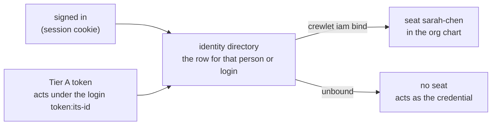
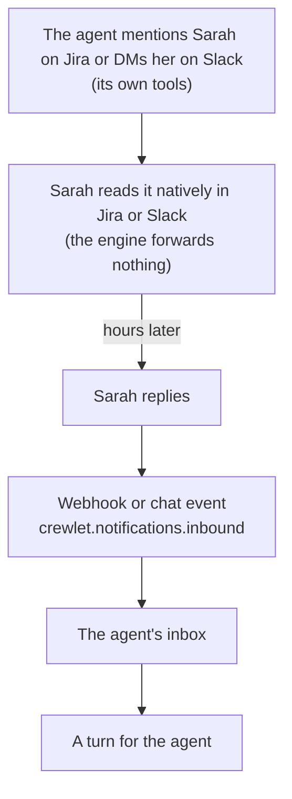
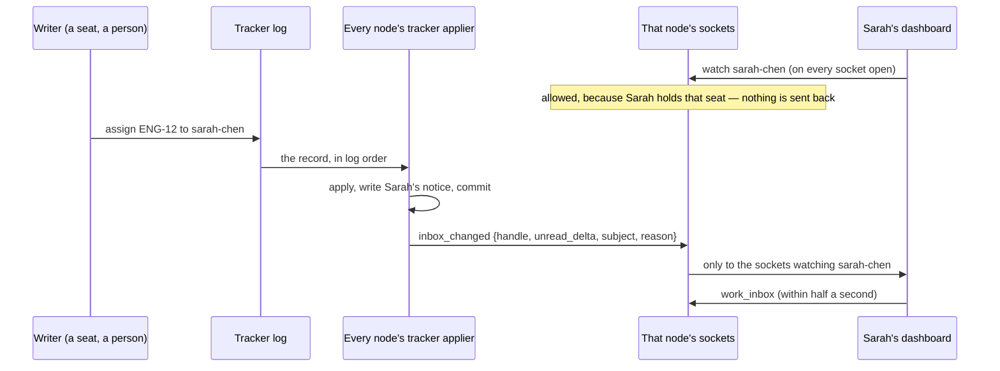

# Humans in the Org Chart

A Role in Crewlet is a **seat** in the org chart, held by either an AI
agent (the default) or a **human teammate**. Human seats participate in
the full hierarchy (they can manage agents, lead units, appear in
rosters, and be escalation targets), but they are never run: no seat
lease, no mailbox, no LLM, no learning rows of their own.

The design follows one observation: agents already collaborate through
human-native surfaces (Slack, Jira, Confluence, GitHub). A human
teammate doesn't need an engine runtime — they need to **exist in the
model** so agents know who they are, how to reach them, and what to
expect when they do. Agents reach humans exactly as they reach each
other: their own colleague-surface tools, with an @-mention. **The
engine never sends as itself** — there is no system bot, no
engine→human notification channel.

---

## Declaring a Human Seat

```yaml
units:
  - name: Core Engineering
    id: core-eng
    type: team
    lead: sarah-chen              # a human can lead an AI team, named by handle
    roles:
      - name: Sarah Chen
        kind: human
        email: sarah@example.com  # indexed for routing, not a delivery channel
        goal: "Keep the team unblocked and own final calls"
        backstory: "20 years in infrastructure"
        responsibilities:
          - "Approvals and vendor decisions"
        contact:                  # how agents mention & reach her — optional
          slack_user_id: U0123456789
          mattermost_user_id: sarah.chen       # Mattermost username, not an ID
          atlassian_account_id: 5b10ac8d-...   # one ID covers Jira + Confluence
          github_login: sarahchen
          gitlab_username: sarahchen
        availability: "CET business hours; replies within ~4h"
      - name: Engineer            # AI agent, unchanged
        goal: "Implement features and ship quality code"
```

### Human seat fields

| Field | Required | Description |
|-------|----------|-------------|
| `kind: human` | yes | Marks the seat as human |
| `contact.slack_user_id` | no | Slack member ID (`U…`) — `<@…>` mentions and the channel an agent DMs on escalation |
| `contact.mattermost_user_id` | no | [Mattermost](../integrations/mattermost.md) **username**: the name an agent writes as a literal `@username` mention, and the account it opens a DM channel with. Not the opaque 26-character user ID. Stored as written, so write it in the case Mattermost shows |
| `contact.atlassian_account_id` | no | Atlassian Cloud account ID. One ID covers Jira assignments, Confluence `<ri:user>` mentions and webhook sender attribution on both |
| `contact.github_login` | no | GitHub username: review requests, sender attribution. Lowercased |
| `contact.gitlab_username` | no | GitLab username: assignment, review and mention routing, sender attribution. Lowercased |
| `email` | no | Indexed so a notification addressed to the address resolves to the seat. **Not** a delivery channel: no agent has an email tool by default |
| `availability` | no | Free text rendered into a lead's roster (timezone, hours, response expectations) |

**Every `contact` identity is optional.** They are how agents mention and
reach a person, and how inbound webhooks attribute their activity by name — so
give a person one for each surface they are on. A person who works only
through the dashboard is on none of them: they act as their seat through the
[identity directory](#acting-as-your-seat-on-the-dashboard-and-the-api), and a
seat with no `contact` block is a legitimate seat rather than a mistake. It is
not refused. What changes is that no agent can @-mention them: a lead's roster
tells its agents to hand that person work by assigning it in the tracker, and
the [continuous report](../reference/api-endpoints.md#the-continuous-report)
(`GET /chart/check`, `crewlet chart check`) names the seat as a
`seat_unreachable` **warning** — the one place the engine says so, and a
warning because the state is legitimate. Add a contact identity when the
person joins a surface the company runs, and the finding clears.

**And no two seats may claim one identity.** Each of these fields is an
external account, and an account belongs to one person. A duplicate is
rejected at validation because it does not fail loudly on its own: inbound
routing keys a map on the identity, so the *last* seat in the chart takes it,
while every walk of the chart answers the *first*. One of the two people
silently stops receiving their own mail, with both entries looking perfectly
ordinary — an inbound message resolves to one seat while the same person's
wakes go to the other. The comparison ignores case and surrounding whitespace,
because the lookups do.

Each of these is a place a message can actually be sent. None of them says who
a person is on the engine's *own* surface — that is the identity directory's,
[below](#acting-as-your-seat-on-the-dashboard-and-the-api) — so nothing a roster
or a colleague card renders is an identity an agent cannot @-mention.

Every `contact` field accepts either a literal ID or exactly one
whole-value `${VAR}` reference, for example
`atlassian_account_id: "${ATLASSIAN_FOUNDER_ACCOUNT_ID}"` in a shipped
example config, where the real ID is instance-specific. Values are
whitespace-stripped when the organization is normalized. A literal
`github_login` or `gitlab_username` is lowercased there; a reference is
stored verbatim (never case-mangled) and its *resolved* value is
lowercased instead. A reference whose variable is unset still counts as a
declared identity — the chart check does not report its seat unreachable —
but the identity is omitted wherever it is consumed until the variable
resolves, so the raw `${VAR}` text is never emitted. The count of unresolved identities is logged on every published company
(`parties_indexed`, field `unresolved`). A value that merely *embeds* a
`${VAR}` inside a longer string (`"acme-${SUFFIX}"`) is rejected at
validation, because substituting part of it would register a wrong
identity that matches nobody.

Where a reference is resolved depends on the consumer. Sender attribution
resolves it the way every other `${VAR}` in the company is resolved: the
[secret store](secret-store.md) first, then the process environment. The
lead's roster and `lookup_colleague` read the process environment only, so
an identity whose value exists only in the secret store attributes inbound
activity correctly but does not appear in those two places.

Human seats keep the descriptive identity fields (`goal`, `backstory`,
`responsibilities`). They are the **routing context** rendered into an
agent lead's roster, so work goes to the person who owns it. They also keep
the hierarchy fields (`manages`, unit `lead`). Every runtime-only field is
**rejected at validation time**, and the refusal names each one as it is
written: `llm` and every per-phase `llm_*` chain, `sandbox`, `token_budget`,
`workers`, `learning_enabled`, `schedules`, `integrations.slack` and
`integrations.mattermost` (a seat's own chat app), `integrations.jira` and
`integrations.confluence` (the project and space a seat owns), `mcp_env` and
`behavioral_guidelines`. A seat's own GitHub App (`integrations.github`) is
refused on a human seat as well, because a person acts on GitHub as their
own `contact.github_login`. That refusal is an [admission
rule](configuration.md#what-a-stored-revision-is-held-to): a stored company
that already carries the block still runs, and the next write that keeps it
is refused. The reverse holds too: `contact` or `availability` on an agent
seat is refused with a hint to set `kind: human`.

A unit's `mcp_env` is shared with its direct **agent** members only. A
human member inherits none of it, so a human seat can sit in, and lead, a
unit whose agents share tool credentials; only an `mcp_env` written on the
human seat itself is refused.

The dashboard draws the same rule rather than restating it. A human seat's
page omits every row a human seat cannot carry — the model chain, the token
budget, the tool credentials, the turn and token tiles — instead of drawing
their fallbacks: "default provider" is a MODEL for a seat that runs none, and
a configured-settings panel asserting one is a panel claiming this company
configured something validation would have refused.

Handles are validated for format (`[a-z0-9][a-z0-9-]*`) and org-wide
uniqueness. They are the canonical seat identity, and an agent and a human
sharing one would misattribute the person's activity to the agent.

---

## Acting as your seat on the dashboard and the API

The engine's own surface — the dashboard, the REST API, and the operator tool
server your assistant reaches — takes no `contact` identity, because nothing is
ever sent there. A person acts **as their seat** on it through the [identity
directory](identity-and-access.md#the-binding-has-two-ends-and-only-one-of-them-arbitrates):
their row is bound to the seat, and every request they make resolves to it.

```
crewlet iam bind <person-id> sarah-chen
```



A person who signs in is a row already, and binding it is the one command
above. Every row carries a **login** — the name an unbound person acts and is
recorded under — which is why an enrolment names one whatever path creates
it, and why an invitation's form proposes one from the address. A **Tier A token** acts under the login `token:<id>`, so it acts as a
seat when the directory holds a row under that login bound to one: enrol it as
a machine (`crewlet iam create -kind machine -login token:<id>`) and bind that
row. The bind is a claim on the seat itself, so two people can never be bound
to one seat — they contend and exactly one wins.

What the binding buys:

- **The work the chart hands a seat reaches you.** `#/inbox` — the
  dashboard's landing screen — shows your notices, the one reason of eighteen
  that routed each one, and what is waiting on a decision; `#/me` is your own
  work. Both ask the engine who is looking, and your own record is kept under
  the seat the directory binds you to — which is where an assignment, a
  mention and a lead's priority list are addressed.
- **Your seat's lead relations are yours.** Every authority rule that asks "do
  you lead this" is asked about the bound seat — so the person holding a unit's
  lead seat may re-route that unit's project's work, declare its fields and set
  a report's priorities, where an unbound credential reaches those only through
  `fleet:operate`. See [the authority
  table](identity-and-access.md#the-authority-table-one-function-decides).

- **Your writes are the seat's.** A write you make — on the dashboard's write
  surface or through your assistant — is recorded under the seat's handle with
  the author kind `human`, which is what keeps you out of the wake your own
  change sends. There is still no way for a caller to name a seat to act as.
  See [who a write is attributed
  to](../reference/api-endpoints.md#who-a-write-is-attributed-to).

**Unbound is ordinary.** An operator outside the org chart, a pipeline, an
automation — each acts as itself under its own login, decided by its grants
alone, and is never refused for it. It has a record of its own all the same:
its pins, its inbox marks, its priorities and its personal views are kept
under that **login**, which is the name every write it makes is attributed to
and the name every personal read answers for — so what its assistant arranges
is what its screens show. What it lacks is the work the chart addresses to a
seat, and the screens say so, naming `crewlet iam bind`.

Read and snooze marks are the assistant's to write, not the screen's: the
dashboard is read-only, and every write in this engine is attributed to
somebody. What it shows is what the engine recorded.

**The binding lives in the directory**, not on the token and not in the
company document. Tier A is the root of trust and may never read Tier B — it
holds the keys to the secret store — so a `seat:` field on an
`api.auth.tokens[]` entry would have the trusted tier depending on the
untrusted one; and a seat's `contact` block says how to reach a person, not
which credential they hold.

**A bound token is held to the chart exactly as a signed-in person is.** Only
an active **machine** row under the token's login binds it — a person can
never hold `token:<id>`, and a suspended machine binds nothing — and the seat
it names is resolved through the same chart lookup a session's is. A renamed
seat is followed to its new handle; a seat that was removed, or is an agent's,
answers `403 seat_unavailable` naming it; a node that has not yet applied the
chart as far as the binding, or cannot read the directory or the chart,
answers `503 identity_unavailable` and is retried. It never quietly acts as
the bare credential instead, because one credential writing under a seat on
one node and under its own name on the next is one actor appearing as two in
the audit trail. An **unbound** token is the exception that keeps break-glass
working: a node whose identity applier is behind still serves it as itself,
since acting as the bare credential is the narrower surface.

---

## How Agents Know Humans Exist

- **Identity prompt**: `Reports to: Sarah Chen (human)`; human direct
  reports carry the same marker.
- **Lead roster**: a human member renders with its handle and a
  **human teammate** marker, its background, goal and responsibilities,
  its resolved contact IDs, its availability, and hand-off guidance
  (assign in the PM tool and mention; no engine turn expected). On a
  large team that full block may not fit — see
  [a capped roster](#a-capped-roster-still-names-the-people-on-it) below.
- **`## Human colleagues` contract block**: appears in the executor prompt
  *only when the org contains human seats*. Reach humans on external
  surfaces, never through `a2a_ask`; they reply asynchronously, so leave
  full context and end the turn; their reply re-triggers you.
- **`lookup_colleague`**: resolves agents *and* humans, by handle, role
  name or a human's contact ID. A match renders the seat's name, handle,
  `kind` and its resolved contact IDs; a human match adds that a person is
  reached with a mention and answers asynchronously, and that `a2a_ask`
  will not reach them. Rows in an ambiguous result carry each candidate's
  kind. It does not render goal, background, responsibilities or
  availability, so a report learns what its **human lead** owns from the
  lead's own messages rather than from this tool (the roster renders only
  downward).
- **Sender attribution**: an inbound notification names its actor through
  the party registry, so a Jira comment from Sarah renders as
  `Sarah Chen (sarah-chen, human colleague)` instead of an opaque account
  ID. Counterparty profiles accrue for humans like anyone else (they are
  keyed by handle).

### A capped roster still names the people on it

A lead's roster and its `Direct reports:` line share one **1,000-token
allowance** — see [the roster allowance](turn-engine.md#the-roster-allowance)
for why, and for the full ladder. A human seat is the most expensive thing a
roster renders (~193 tokens against an agent's ~119, because a person also
carries contact IDs, availability and hand-off guidance), so on a team of any
size some of them will be past the first rung. What a lead sees then:

| Where the seat falls | What the lead is told about them |
|---|---|
| **Full profile** | Everything in the list above |
| **Name and handle only** | `- **Sarah Chen** (sarah-chen) — **human teammate**`. The marker survives the cap deliberately: without it Sarah reads as an agent that can simply be asked, and the lead waits for a turn that is never coming. What it loses is her background, her contact IDs and her availability — so the lead knows *who* to hand the work to and calls `lookup_colleague` for *how* to reach her |
| **Past the cap** | Counted in ``and N more — `lookup_colleague` names them``. She is still a colleague, still managed, still resolvable by name, handle or contact ID — she is simply not described in this prompt |

Two things are deliberately not affected. **The cap is rendering, never
authorization**: a human report the roster had no room to describe is still
managed, still in `manages`, still in every walk of the chart, and still on
the dashboard's own org chart. And **`lookup_colleague` is uncapped**: it
resolves any seat in the company and answers a human match with the contact
IDs, the reminder that they are reached with a mention and answer
asynchronously, and that `a2a_ask` will not reach them — which is exactly what
a roster line that fell to rung 2 or 3 stopped saying.

---

## The Interaction Loop

Agent to human and back needs **no new machinery**: it is the existing
inbound notification pipeline.



Two consequences:

1. **The engine never wakes a human seat.** A seat's mailbox exists to
   wake an *agent* into a turn, and a human has no turn to wake. An inbound
   notification whose recipient resolves to a human seat is skipped at
   info level (`notification_skipped`, reason `human seat`) rather than
   warned about as undeliverable: the person is already notified natively
   by the tool where the work lives (a Jira assignment emails the
   assignee; a Slack mention pings them). A schedule never fires into a
   human seat either (see the table below). What the engine does tell a
   person about is its OWN tracker — see
   [How a person learns they have work](#how-a-person-learns-they-have-work).
2. **Agents must never wait.** The turn model is already asynchronous:
   the prompts and tool errors steer the LLM to leave state on the
   surface and end the turn.

---

## How a person learns they have work

A person hears about work from three places, and which ones they have depends
on where the work lives:

- **The vendor where the work lives.** A Jira assignment emails the assignee,
  a Slack mention pings them, a GitHub review request lands in their GitHub
  inbox. The engine forwards none of it — see the loop above.
- **The engine's own inbox.** Every change to the
  [native tracker](task-engine.md) writes a notice to each person it concerns,
  under the one reason that routed it to them (`assignee`, `mention`,
  `blocking`, …). It is the `work_inbox` question, and the dashboard's landing
  screen.
- **The dashboard, the moment that inbox moves.** For somebody with no Slack or
  Jira account — a person who works in Crewlet only — this is the delivery
  surface.

The third is a **push**, not a poll:



- **Every node applies every tracker record**, so every node that serves
  sockets hears every movement from its own applier, after the batch commits,
  and tells the sockets it holds. Nothing is forwarded between nodes, and a
  person's browser can be connected to any of them.
- **The dashboard watches your own seat** as soon as its socket opens, and
  again on every reconnect: the rail's inbox badge, the Inbox screen and My
  work re-ask within half a second of the frame. The frame carries identifiers
  and a count — the seat, the task, the reason — and never what the notice
  says, which is read through `work_inbox` as before.
- **A watch is decided like the inbox itself.** You may watch your own seat;
  a lead may watch a seat they lead; the admin grant may watch any. A watch
  this node cannot decide because its chart view is behind is not installed,
  and the dashboard asks again a few seconds later.
- **The poll is still there** — a minute for the rail, thirty seconds for the
  screens — and it is the fallback, not the mechanism: a frame dropped under
  backpressure or lost to a reconnect is never re-sent.

A person who is not bound to a seat watches the record kept under their login
— what they follow, and what names them. See [Acting as your
seat](#acting-as-your-seat-on-the-dashboard-and-the-api).

---

## Escalation (reaching a human)

A human seat is the natural **terminus** of an escalation chain, and an
agent reaches one exactly as it reaches any colleague — with its **own
colleague-surface tools** during Execute, never via the engine:

- **Chat (Slack / Mattermost)** — the agent DMs the human's member ID
  (or username) with its own chat tool, mention-prefixed. The engine
  never names that tool: the deployed MCP server's names are not
  knowable here, so the prompts describe the *capability* and the LLM
  picks the match from its catalogue (see
  [Tool Capabilities](tool-capabilities.md)). The human's reply lands on
  the agent's own bot identity and re-enters through the normal inbound
  pipeline, so the answer goes back to the agent that asked.
- **Jira / Confluence / GitHub** — the agent comments / requests review
  with its own tools and the mention markup; the target is the artifact
  (issue / page / PR), the human is mentioned in the body.
- **A2A is not a human surface.** Humans have no inbox, so `a2a_ask`
  against a human returns a failed result telling the agent to mention
  the person on a shared surface instead, and the A2A service itself
  refuses any target that is not an agent seat in the org
  (`a2a.ErrNotAnAgent`), so a typo or a human handle fails visibly
  instead of opening a channel nothing answers. The question the guard
  asks is whether the target is an **agent seat in the org**, not
  whether it is running in the asking process: a colleague owned by
  another node is a normal A2A target, because the wake lands on its
  inbox and that node consumes it.

When a turn only discovers it needs a human at review, the reviewer
returns `self_iterate` with a note, and the executor's next round makes
the mention. Once the mention has gone out the reviewer ends the turn
`done` instead — the human's reply is what re-triggers the agent, so no
further round of that turn can produce it. If the agent genuinely **can't reach the human** (it has no
chat tool, or the human has no contact ID), that surfaces as a gap to
close: give the agent the tool, or route the work through a colleague who
has it. A human with no contact ID at all is the legitimate case of a
person who works only through the dashboard, which the chart check names
(`seat_unreachable`): the roster tells a lead to hand them work by assigning
it in the tracker, and a contact identity is what to add the day they join a
surface the company runs. The engine never manufactures a sender to bridge
the gap: there is no "Crewlet" DM and no engine-side fallback. Escalation is ordinary
colleague-tool use, so a report reaches a human exactly the way it reaches
an agent.

---

## The Founder Seat

The recommended way to put yourself in the company: a **root-level
human seat managing the top agent(s)**. There is no dedicated founder
concept in the engine — the org chart is the model, and the founder is
simply the top of it (the same reasoning behind having no dedicated
escalate tool: the manager handoff IS escalation).

```yaml
roles:
  - name: Jane Founder
    kind: human
    goal: "Own direction; final call on what ships"
    responsibilities: ["Approvals", "Unblock the CEO"]
    manages: [ceo]            # handles: top agents only — lead inheritance
                              # does the rest
    contact:
      slack_user_id: U0FOUNDER
      atlassian_account_id: 5b10ac8d-...
      github_login: janedoe
      gitlab_username: janedoe
```

What this buys, with no further config:

- Top agents' prompts read `Reports to: Jane Founder (human)`, so manager
  handoffs from your most senior agents terminate at a person instead
  of `None (top-level)`. When the CEO is stuck it DMs you on Slack or
  mentions you on Jira with its own tools, and your reply re-triggers
  it.
- Your Slack, Jira and GitHub activity is attributed by name, so agents
  know when the founder is speaking.
- DACI: the Approver is "the driver's manager", so you become the
  approver of last resort for top-level decisions behaviorally.

Two boundaries to keep in mind:

- **The seat is the colleague hat, not the operator hat.** Config
  ownership (`PUT /config`, API auth tokens, the dashboard) stays an
  API-auth concern: the seat makes agents know you, and — once the
  identity directory binds you to it — carries its lead relations onto
  the engine's own surface; your grants make the engine obey you.
  Different hats, deliberately separate.
- **Scope `manages` to the top roles.** A founder managing every unit
  by name lists every seat in those units, and root seats are searched
  first when a seat's manager is resolved, so the founder becomes the
  primary manager and escalation terminus of every one of them, even
  where a unit lead also auto-manages the seat (see
  [Unit Lead](organization-model.md#unit-lead)). Manage the CEO (or the
  unit leads) and let lead inheritance handle the rest; `availability`
  sets response expectations.

See `examples/nimbus.company.yaml` for a complete working org with a
founder seat above the agent CEO. That company's only surface is chat, so
the founder seat there carries a single `contact` identity
(`mattermost_user_id`); add one per surface you connect.

---

## What Humans Never Do

| Subsystem | Behavior |
|-----------|----------|
| Seat placement | Never claimed: only agent seats enter the placement sweep, so a human seat has no lease, no mailbox and no per-role MCP children |
| Inbox | None. A notification resolved to a human seat is skipped (`notification_skipped`, reason `human seat`) |
| Engine notifications | None. The engine never sends as itself; agents reach humans with their own tools |
| Scheduler | `target: each` fans out to agent members only; an enabled `target: lead` schedule under a (possibly inherited) human lead is a **config error**; human seats cannot define role schedules |
| A2A channels | Not addressable; `a2a_ask` returns guidance and the A2A service refuses the target |
| Learning | No diary, no episodes, no synthesized skills (counterparty profiles *about* them still accrue) |
| `GET /agents` | Excluded. They appear in `GET /org` with `"kind": "human"`, and the dashboard org chart badges them `human` |

## Hot Reload

A seat's kind is ordinary configuration, applied like any other change
(see [Organization Model: Hot Reload](organization-model.md#hot-reload)):

- `human` to `agent`: the seat joins the next epoch's seat list, so a node
  claims it, creates its mailbox and starts its per-role MCP children the
  way it would for a newly added seat.
- `agent` to `human`: the seat leaves the seat list, so the node holding it
  releases it, and its mailbox is retired after the grace period described
  in [Seat Ownership: The removed seat](seat-ownership.md#the-removed-seat).
  An agent's id is derived from the company name and the handle it was
  created under (`org.DeriveAgentID`), so flipping the seat back to `agent` later
  reattaches its diary, episodes and onboarding marker.
- Contact and availability edits take effect with the next **published
  company**, which for a seat's own fields means the chart write that carried
  them: every publish builds a new party registry and reconciles the human
  contact IDs into it.
- **Who holds the seat, and at what stage, takes effect with the next
  identity apply**, with no chart write at all: suspending the person bound
  to a seat withdraws its contact IDs, and reinstating them restores them. See
  [A suspended holder is withdrawn](#a-suspended-holder-is-withdrawn-with-no-chart-record).

## Identity Resolution (party registry)

`notify.Registry` answers "who is this?" for one epoch of the company. It
indexes every **party**, agent and human seats alike, and resolves one by
handle (`ByHandle`), exact role name (`ByRole`), derived agent id
(`ByAgentID`, which never matches a human seat because a human has no agent
id), email (`ByEmail`, where a plus-address naming a handle wins over a
seat's declared address), or an external ID on a surface (`ByExternalID`).
Each `Party` carries a `Human` flag, and the notification spine reads it to
skip a human recipient rather than wake it.

The seat indexes are built from the organization and never change: every
published company builds a new registry rather than editing the one a running
turn may be reading. **Published, not activated** — a hire, a move or a rename
is a write to the [org chart's own log](chart-domain.md) with no revision in
it, and a registry rebuilt only on a config apply answers "nobody matches" for
a seat hired this morning, which is the same answer a stranger gets, so nothing
fails and nothing is logged. See
[What follows a published company](configuration.md#what-follows-a-published-company).

The external-identity map is the part written at runtime, under a lock, and it
holds two kinds of entry:

- **Human contact IDs** come from `contact` and are reconciled into each new
  registry (`ReconcileHumanContacts`). A pair the previous reconciliation
  registered and the current organization no longer declares (a contact
  edit, a removed seat, a kind flip) is withdrawn, and an ID already held by
  a different seat is never taken over: the conflict is logged as
  `human_contact_id_conflict` naming both seats.
- **Agent identities** are registered by the integrations: the code host's
  and the tracker's are derived from each seat's credentials, which ride the
  chart, and are re-resolved and rebuilt on every published company — the
  lookups are keyed on the credential and cached, so a company whose
  credentials did not move spends no requests. The chat transports' bot IDs,
  resolved against the live server at connect, are carried across into the
  new registry instead: they are facts about a server rather than about the
  company.

### A suspended holder is withdrawn with no chart record

A human seat's `contact` block is org-chart content, but whether the person
holding the seat may still be reached through it is not: it is a fact about
the **person**, and it lives in the [identity
directory](identity-and-access.md#what-a-suspension-reaches-and-how-fast). So
every registry is built from TWO readings — the org view, and one read of the
directory saying who holds each seat and at what stage — and a seat whose
holder may not be reached registers **no contact identity at all**:

| Holder's standing | Contact IDs |
|---|---|
| `active`, `invited`, `enrolling`, or a binding still being enrolled | registered — each is somebody the company has put in the seat |
| `suspended` | withheld |
| `retired` | withheld |
| removed while holding the seat, and nobody bound since | withheld until the next holder is bound |
| a stage this build cannot name (a newer peer wrote it) | withheld — briefly unreachable is the safe way to be wrong during an upgrade |
| nobody bound | registered — an unheld seat is routed by the chart, as before the directory existed |

A seat with two holders — a duplicate only a restore can produce — is withheld
if either may not be reached, because one contact map cannot say which of them
it belongs to.

**A binding follows its seat through a rename.** The directory keeps the handle
a seat had when its person was bound, and nothing rewrites it when the chart
renames the seat. Each reading is resolved through the seat's former handles
exactly as a sign-in resolves the same binding — live handles first — so
suspending somebody whose seat was renamed after they were bound still withdraws
its contact identities. A former handle another seat has since taken as its own
names that seat, which is also the seat that person's sign-in lands on: the
chart's rule that a former handle resolves until something else claims it.

**Two triggers rebuild the registry, and both rebuild it whole.** A published
company is the first; the second is the identity applier, which signals after
every committed batch that moved a seat's standing (a suspension, a
reinstatement, a bind, an unbind, a removal). The node then reads the
directory once and, if the answer moved, builds a new registry for the same
company and swaps it in — never a diff against the live one, so a reader
always sees one reading of each source. That is **within one apply** of the
record on every node that runs the identity domain, and a thirty-second
re-read is the safety net behind the signal. The log line `parties_indexed`
reports `withheld_seats` and whether a `directory` was consulted.

**A directory this node cannot read keeps the last reading** rather than
falling back to the chart, which would hand every suspended person's seat
back: it logs `party_directory_unreadable` and retries on the net.

**A node that does not run the identity domain routes by the chart alone.**
A seats-only satellite holds an empty copy of the directory, and an empty
copy is not "nobody holds any seat", so it consults nothing and withholds
nothing — exactly the routing every node had before the directory existed.
Every node consumes inbound deliveries, so in a fleet with seats-only nodes a
delivery one of them consumes still attributes a suspended person's message
to their seat. A fleet that must not have that gap runs `ingress` or
`workers` on every node.

**What it does not withdraw** is what agents are *shown*: the roster in a
seat's prompt and `lookup_colleague` read the seat's `contact` block, which is
chart content, so an agent can still address the person on their own vendor
account. To stop that too, edit or remove the seat's `contact` block.

External-ID resolution is plain index lookups, because it runs on every
inbound notification for sender attribution. On each surface it consults
two namespaces, the surface's own (a human's member ID under `slack`) and
the companion bot namespace (an agent's bot user under `slack_bot`), so
agent and human senders are annotated alike.
