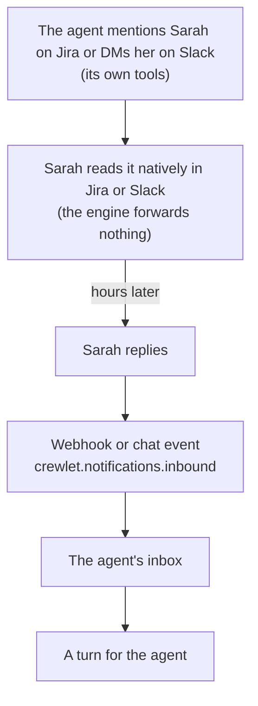

# Humans in the Org Chart

A Role in Crewlet is a **seat** in the org chart, held by either an AI
agent (the default) or a **human teammate**. Human seats participate in
the full hierarchy (they can manage agents, lead units, appear in
rosters, and be escalation targets), but they are never run: no seat
lease, no mailbox, no LLM, no learning rows of their own.

The design follows one observation: agents already collaborate through
human-native surfaces (Slack, Jira, Confluence, GitHub). A human
teammate doesn't need an engine runtime — they need to **exist in the
model** so agents know who they are, how to reach them, and what to
expect when they do. Agents reach humans exactly as they reach each
other: their own colleague-surface tools, with an @-mention. **The
engine never sends as itself** — there is no system bot, no
engine→human notification channel.

---

## Declaring a Human Seat

```yaml
units:
  - name: Core Engineering
    type: team
    lead: Sarah Chen              # a human can lead an AI team
    roles:
      - name: Sarah Chen
        kind: human
        email: sarah@example.com  # indexed for routing, not a delivery channel
        goal: "Keep the team unblocked and own final calls"
        backstory: "20 years in infrastructure"
        responsibilities:
          - "Approvals and vendor decisions"
        contact:                  # how agents mention & reach her
          slack_user_id: U0123456789
          mattermost_user_id: sarah.chen       # Mattermost username, not an ID
          atlassian_account_id: 5b10ac8d-...   # one ID covers Jira + Confluence
          github_login: sarahchen
          gitlab_username: sarahchen
          crewlet_operator_id: sarah            # her api.auth.tokens[] id (Tier A)
        availability: "CET business hours; replies within ~4h"
      - name: Engineer            # AI agent, unchanged
        goal: "Implement features and ship quality code"
```

### Human seat fields

| Field | Required | Description |
|-------|----------|-------------|
| `kind: human` | yes | Marks the seat as human |
| `contact.slack_user_id` | one identity | Slack member ID (`U…`) — `<@…>` mentions and the channel an agent DMs on escalation |
| `contact.mattermost_user_id` | one identity | [Mattermost](../integrations/mattermost.md) **username**: the name an agent writes as a literal `@username` mention, and the account it opens a DM channel with. Not the opaque 26-character user ID. Stored as written, so write it in the case Mattermost shows |
| `contact.atlassian_account_id` | one identity | Atlassian Cloud account ID. One ID covers Jira assignments, Confluence `<ri:user>` mentions and webhook sender attribution on both |
| `contact.github_login` | one identity | GitHub username: review requests, sender attribution. Lowercased |
| `contact.gitlab_username` | one identity | GitLab username: assignment, review and mention routing, sender attribution. Lowercased |
| `contact.crewlet_operator_id` | one identity | One of Tier A's `api.auth.tokens[].id`. Binds that credential to this seat, so a person writing through the dashboard, the REST API or the operator tool server acts as **themselves** — the item they file carries their name and wakes their colleagues. An **attribution, never an address**: the engine never sends as itself, so this id is left out of rosters and `lookup_colleague`, and a seat carrying only this one is reached through their dashboard queue rather than by an @-mention. Leaving a token unbound is ordinary — an operator outside the org chart, a pipeline — and it acts as `operator:<id>` under its own label rather than being refused |
| `email` | no | Indexed so a notification addressed to the address resolves to the seat. **Not** a delivery channel: no agent has an email tool by default |
| `availability` | no | Free text rendered into a lead's roster (timezone, hours, response expectations) |

A human seat needs **at least one `contact` identity** — that is how
agents mention and reach them, and how inbound webhooks attribute their
activity by name. A seat with no contact would be inert (visible in the
chart but unreachable), so it's rejected at validation.

**And no two seats may claim one identity.** Each of these fields is an
external account, and an account belongs to one person. A duplicate is
rejected at validation because it does not fail loudly on its own: inbound
routing keys a map on the identity, so the *last* seat in the chart takes it,
while every walk of the chart answers the *first*. One of the two people
silently stops receiving their own mail, with both entries looking perfectly
ordinary — and with `crewlet_operator_id` the two directions disagree outright,
so a token opens one person's dashboard while their wakes go to another seat.
The comparison ignores case and surrounding whitespace, because the lookups do.

`crewlet_operator_id` satisfies that requirement on its own, and the seat is
still reachable: their queue is the dashboard, not a chat mention. The roster
an agent reads says so explicitly rather than telling it to @-mention somebody
it cannot — a message addressed to a handle that resolves to nobody reads to
everyone else as work handed over.

**The queue is `#/inbox`**, and it is the dashboard's landing screen. Opening it
with an API token resolves that token's id against every seat's
`crewlet_operator_id` and shows the person it names: their notices, the one
reason of eighteen that routed each one, and what is waiting on a decision. A
token bound to no seat is not an error — it is an operator outside the org
chart — and the screen says so rather than showing somebody else's queue or an
empty one, naming the line of company configuration that would give it a
person. `#/me` is the same person's own work, and it is absent for the same
reason when the token names nobody.

Read and snooze marks are the assistant's to write, not the screen's: the
dashboard is read-only, and every write in this engine is attributed to
somebody. What it shows is what the engine recorded.

**Your own writes count as yours — and the record still names the token.**
A work item you file through your assistant is attributed to the **credential**
you filed it with, with author kind `operator`, never to your seat handle.
That is deliberate and it stays: a tracker whose author field is chosen by the
writer is not an audit trail, and there is no way to ask the operator tool
server to act as a seat. So the item records `sarah` as its reporter and its
watcher, while her colleagues assign work to `sarah-chen`.

Both of those are **her**. Every question that answers "mine" — My work's
seven tabs, the inbox, her own record — matches the seat handle *or* the
operator id bound to it, and reports the answer under the seat. Bind the token
and your own work is on your own screen; leave it unbound and you are an
operator outside the chart, acting as `operator:<id>`, which is an ordinary
state and not an error.

**Your own marks and pins are the person's, and the record still names the
token.** *Whose* state a document holds and *who wrote it* are two different
questions with two different answers, and the person tools answer both. When
Sarah's assistant marks her inbox read, pins a view or re-orders her queue, the
record it writes is **`sarah-chen`'s** — the seat her token is bound to — while
the history row it leaves names **`sarah`** with author kind `operator`. The
attribution rule above is untouched: it answers *who did this*, and it stays
the credential. The subject answers *whose inbox is this*, and that is the
person.

Keyed on the credential, as it was, a bound founder accumulated a second record
called `founder`: everything their assistant marked was invisible on `#/inbox`,
which asks under the seat, and `#/me`'s queue tab came back empty. An **unbound
token is unchanged** — it writes its own record under its own id, which is the
ordinary state of an operator outside the chart — and records written before a
company bound its token are still read, the seat's being preferred and the
credential's the fallback.

One change that concerned you under both names is **one** notice, under the
stronger of the two reasons — the same rule that already gives one handle one
reason. And an operator reading somebody else's day is handed *that* person's
two names from the chart, never the credential in their own hand.

**The binding is written on the seat, not on the token.** Tier A is the root of
trust and may never read Tier B — it holds the keys to the secret store — so a
`seat:` field on an `api.auth.tokens[]` entry would have the trusted tier
depending on the untrusted one. Naming the token id from the company document
inverts that: Tier A keeps a bare list of credentials, and the org chart says
which of them is a person.

Every `contact` field accepts either a literal ID or exactly one
whole-value `${VAR}` reference, for example
`atlassian_account_id: "${ATLASSIAN_FOUNDER_ACCOUNT_ID}"` in a shipped
example config, where the real ID is instance-specific. Values are
whitespace-stripped when the organization is normalized. A literal
`github_login` or `gitlab_username` is lowercased there; a reference is
stored verbatim (never case-mangled) and its *resolved* value is
lowercased instead. A reference whose variable is unset counts as a
declared identity for validation, but the identity is omitted wherever it
is consumed until the variable resolves, so the raw `${VAR}` text is never
emitted. The count of unresolved identities is logged on every apply
(`parties_indexed`, field `unresolved`). A value that merely *embeds* a
`${VAR}` inside a longer string (`"acme-${SUFFIX}"`) is rejected at
validation, because substituting part of it would register a wrong
identity that matches nobody.

Where a reference is resolved depends on the consumer. Sender attribution
resolves it the way every other `${VAR}` in the company is resolved: the
[secret store](secret-store.md) first, then the process environment. The
lead's roster and `lookup_colleague` read the process environment only, so
an identity whose value exists only in the secret store attributes inbound
activity correctly but does not appear in those two places.

Human seats keep the descriptive identity fields (`goal`, `backstory`,
`responsibilities`). They are the **routing context** rendered into an
agent lead's roster, so work goes to the person who owns it. They also keep
the hierarchy fields (`manages`, unit `lead`). Every runtime-only field is
**rejected at validation time**, and the refusal names each one as it is
written: `llm` and every per-phase `llm_*` chain, `sandbox`, `token_budget`,
`workers`, `learning_enabled`, `schedules`, `integrations.slack` and
`integrations.mattermost` (a seat's own chat app), `integrations.jira` and
`integrations.confluence` (the project and space a seat owns), `mcp_env` and
`behavioral_guidelines`. A seat's own GitHub App (`integrations.github`) is
refused on a human seat as well, because a person acts on GitHub as their
own `contact.github_login`. That refusal is an [admission
rule](configuration.md#what-a-stored-revision-is-held-to): a stored company
that already carries the block still runs, and the next write that keeps it
is refused. The reverse holds too: `contact` or `availability` on an agent
seat is refused with a hint to set `kind: human`.

A unit's `mcp_env` is shared with its direct **agent** members only. A
human member inherits none of it, so a human seat can sit in, and lead, a
unit whose agents share tool credentials; only an `mcp_env` written on the
human seat itself is refused.

The dashboard draws the same rule rather than restating it. A human seat's
page omits every row a human seat cannot carry — the model chain, the token
budget, the tool credentials, the turn and token tiles — instead of drawing
their fallbacks: "default provider" is a MODEL for a seat that runs none, and
a configured-settings panel asserting one is a panel claiming this company
configured something validation would have refused.

Handles are validated for format (`[a-z0-9][a-z0-9-]*`) and org-wide
uniqueness. They are the canonical seat identity, and an agent and a human
sharing one would misattribute the person's activity to the agent.

---

## How Agents Know Humans Exist

- **Identity prompt**: `Reports to: Sarah Chen (human)`; human direct
  reports carry the same marker.
- **Lead roster**: a human member renders with its handle and a
  **human teammate** marker, its background, goal and responsibilities,
  its resolved contact IDs, its availability, and hand-off guidance
  (assign in the PM tool and mention; no engine turn expected).
- **`## Human colleagues` contract block**: appears in the executor prompt
  *only when the org contains human seats*. Reach humans on external
  surfaces, never through `a2a_ask`; they reply asynchronously, so leave
  full context and end the turn; their reply re-triggers you.
- **`lookup_colleague`**: resolves agents *and* humans, by handle, role
  name or a human's contact ID. A match renders the seat's name, handle,
  `kind` and its resolved contact IDs; a human match adds that a person is
  reached with a mention and answers asynchronously, and that `a2a_ask`
  will not reach them. Rows in an ambiguous result carry each candidate's
  kind. It does not render goal, background, responsibilities or
  availability, so a report learns what its **human lead** owns from the
  lead's own messages rather than from this tool (the roster renders only
  downward).
- **Sender attribution**: an inbound notification names its actor through
  the party registry, so a Jira comment from Sarah renders as
  `Sarah Chen (sarah-chen, human colleague)` instead of an opaque account
  ID. Counterparty profiles accrue for humans like anyone else (they are
  keyed by handle).

---

## The Interaction Loop

Agent to human and back needs **no new machinery**: it is the existing
inbound notification pipeline.



Two consequences:

1. **The engine never pushes to humans.** A seat's inbox exists to wake
   an *agent* into a turn, and a human has no turn to wake. An inbound
   notification whose recipient resolves to a human seat is skipped at
   info level (`notification_skipped`, reason `human seat`) rather than
   warned about as undeliverable: the person is already notified natively
   by the tool where the work lives (a Jira assignment emails the
   assignee; a Slack mention pings them). A schedule never fires into a
   human seat either (see the table below).
2. **Agents must never wait.** The turn model is already asynchronous:
   the prompts and tool errors steer the LLM to leave state on the
   surface and end the turn.

---

## Escalation (reaching a human)

A human seat is the natural **terminus** of an escalation chain, and an
agent reaches one exactly as it reaches any colleague — with its **own
colleague-surface tools** during Execute, never via the engine:

- **Chat (Slack / Mattermost)** — the agent DMs the human's member ID
  (or username) with its own chat tool, mention-prefixed. The engine
  never names that tool: the deployed MCP server's names are not
  knowable here, so the prompts describe the *capability* and the LLM
  picks the match from its catalogue (see
  [Tool Capabilities](tool-capabilities.md)). The human's reply lands on
  the agent's own bot identity and re-enters through the normal inbound
  pipeline, so the answer goes back to the agent that asked.
- **Jira / Confluence / GitHub** — the agent comments / requests review
  with its own tools and the mention markup; the target is the artifact
  (issue / page / PR), the human is mentioned in the body.
- **A2A is not a human surface.** Humans have no inbox, so `a2a_ask`
  against a human returns a failed result telling the agent to mention
  the person on a shared surface instead, and the A2A service itself
  refuses any target that is not an agent seat in the org
  (`a2a.ErrNotAnAgent`), so a typo or a human handle fails visibly
  instead of opening a channel nothing answers. The question the guard
  asks is whether the target is an **agent seat in the org**, not
  whether it is running in the asking process: a colleague owned by
  another node is a normal A2A target, because the wake lands on its
  inbox and that node consumes it.

When a turn only discovers it needs a human at review, the reviewer
returns `self_iterate` with a note, and the executor's next round makes
the mention. Once the mention has gone out the reviewer ends the turn
`done` instead — the human's reply is what re-triggers the agent, so no
further round of that turn can produce it. If the agent genuinely **can't reach the human** (it has no
chat tool, or the human has no contact ID), that surfaces as a config gap
to fix: give the agent the tool, or route the work through a colleague who
has it. The engine never manufactures a sender to bridge the gap: there is
no "Crewlet" DM and no engine-side fallback. Escalation is ordinary
colleague-tool use, so a report reaches a human exactly the way it reaches
an agent.

---

## The Founder Seat

The recommended way to put yourself in the company: a **root-level
human seat managing the top agent(s)**. There is no dedicated founder
concept in the engine — the org chart is the model, and the founder is
simply the top of it (the same reasoning behind having no dedicated
escalate tool: the manager handoff IS escalation).

```yaml
roles:
  - name: Jane Founder
    kind: human
    goal: "Own direction; final call on what ships"
    responsibilities: ["Approvals", "Unblock the CEO"]
    manages: [CEO]            # top agents only — lead inheritance does the rest
    contact:
      slack_user_id: U0FOUNDER
      atlassian_account_id: 5b10ac8d-...
      github_login: janedoe
      gitlab_username: janedoe
```

What this buys, with no further config:

- Top agents' prompts read `Reports to: Jane Founder (human)`, so manager
  handoffs from your most senior agents terminate at a person instead
  of `None (top-level)`. When the CEO is stuck it DMs you on Slack or
  mentions you on Jira with its own tools, and your reply re-triggers
  it.
- Your Slack, Jira and GitHub activity is attributed by name, so agents
  know when the founder is speaking.
- DACI: the Approver is "the driver's manager", so you become the
  approver of last resort for top-level decisions behaviorally.

Two boundaries to keep in mind:

- **The seat is the colleague hat, not the operator hat.** Config
  ownership (`PUT /config`, API auth tokens, the dashboard) stays an
  API-auth concern: the seat makes agents know you; the token makes
  the engine obey you. Different hats, deliberately separate.
- **Scope `manages` to the top roles.** A founder managing every unit
  by name lists every seat in those units, and root seats are searched
  first when a seat's manager is resolved, so the founder becomes the
  primary manager and escalation terminus of every one of them, even
  where a unit lead also auto-manages the seat (see
  [Unit Lead](organization-model.md#unit-lead)). Manage the CEO (or the
  unit leads) and let lead inheritance handle the rest; `availability`
  sets response expectations.

See `examples/nimbus.company.yaml` for a complete working org with a
founder seat above the agent CEO. That company's only surface is chat, so
the founder seat there carries a single `contact` identity
(`mattermost_user_id`); add one per surface you connect.

---

## What Humans Never Do

| Subsystem | Behavior |
|-----------|----------|
| Seat placement | Never claimed: only agent seats enter the placement sweep, so a human seat has no lease, no mailbox and no per-role MCP children |
| Inbox | None. A notification resolved to a human seat is skipped (`notification_skipped`, reason `human seat`) |
| Engine notifications | None. The engine never sends as itself; agents reach humans with their own tools |
| Scheduler | `target: each` fans out to agent members only; an enabled `target: lead` schedule under a (possibly inherited) human lead is a **config error**; human seats cannot define role schedules |
| A2A channels | Not addressable; `a2a_ask` returns guidance and the A2A service refuses the target |
| Learning | No diary, no episodes, no synthesized skills (counterparty profiles *about* them still accrue) |
| `GET /agents` | Excluded. They appear in `GET /org` with `"kind": "human"`, and the dashboard org chart badges them `human` |

## Hot Reload

A seat's kind is ordinary configuration, applied like any other change
(see [Organization Model: Hot Reload](organization-model.md#hot-reload)):

- `human` to `agent`: the seat joins the next epoch's seat list, so a node
  claims it, creates its mailbox and starts its per-role MCP children the
  way it would for a newly added seat.
- `agent` to `human`: the seat leaves the seat list, so the node holding it
  releases it, and its mailbox is retired after the grace period described
  in [Seat Ownership: The removed seat](seat-ownership.md#the-removed-seat).
  An agent's id is derived from the company name and its handle
  (`org.DeriveAgentID`), so flipping the seat back to `agent` later
  reattaches its diary, episodes and onboarding marker.
- Contact and availability edits take effect with the next epoch: every
  apply builds a new party registry and reconciles the human contact IDs
  into it.

## Identity Resolution (party registry)

`notify.Registry` answers "who is this?" for one epoch of the company. It
indexes every **party**, agent and human seats alike, and resolves one by
handle (`ByHandle`), exact role name (`ByRole`), derived agent id
(`ByAgentID`, which never matches a human seat because a human has no agent
id), email (`ByEmail`, where a plus-address naming a handle wins over a
seat's declared address), or an external ID on a surface (`ByExternalID`).
Each `Party` carries a `Human` flag, and the notification spine reads it to
skip a human recipient rather than wake it.

The seat indexes are built from the organization and never change: an apply
builds a new registry rather than editing the one a running turn may be
reading. The external-identity map is the part written at runtime, under a
lock, and it holds two kinds of entry:

- **Human contact IDs** come from `contact` and are reconciled into each new
  registry (`ReconcileHumanContacts`). A pair the previous reconciliation
  registered and the current organization no longer declares (a contact
  edit, a removed seat, a kind flip) is withdrawn, and an ID already held by
  a different seat is never taken over: the conflict is logged as
  `human_contact_id_conflict` naming both seats.
- **Agent identities** are registered by the integrations: the code host's
  and the tracker's are derived from each seat's credentials and rebuilt on
  every apply, while the chat transports' bot IDs, resolved against the live
  server at connect, are carried across into the new registry.

External-ID resolution is plain index lookups, because it runs on every
inbound notification for sender attribution. On each surface it consults
two namespaces, the surface's own (a human's member ID under `slack`) and
the companion bot namespace (an agent's bot user under `slack_bot`), so
agent and human senders are annotated alike.
