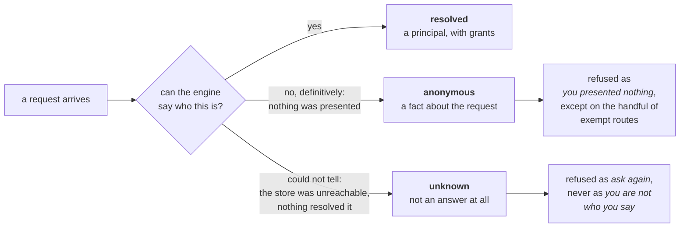
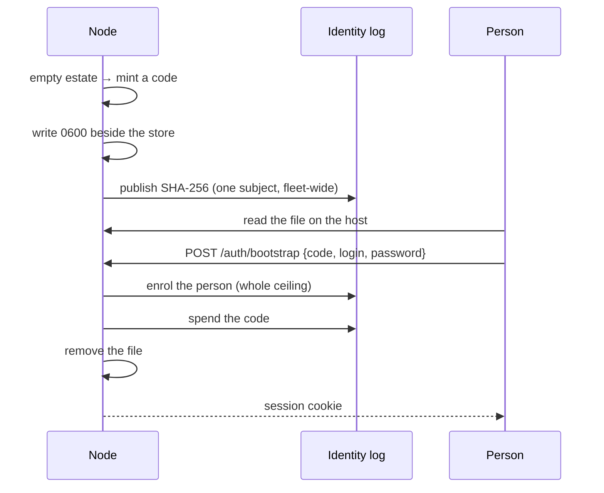

# Identity and Access

Every row this engine keeps — a work item's comment, a page revision, an audit
event — records **who did it**. Every route, query and tool it serves decides
**whether you may**. This page is the vocabulary both of those use: what a
*principal* is, which *grants* exist and what each one opens, and — the part
that matters when something goes wrong — the difference between the engine
knowing you are nobody and the engine not being able to tell.

> The vocabulary lives in `internal/iam`. It is a deliberately small package:
> it names things and classifies them, and it reads nothing, writes nothing
> and stores nothing.

---

## A principal is who is acting

A principal is one actor the engine can name. There are four kinds, and the
kind is not a label — it decides how the actor's work is attributed and what
it is allowed to be.

| Kind | Who that is | Recorded as |
|---|---|---|
| `person` | A human being — the founder at the dashboard, a teammate with a login | `human` if they hold a seat, `operator` if not |
| `seat` | An agent seat acting inside its own turn | `agent` |
| `machine` | A token with nobody behind it: CI, a pipeline, an automation | `operator` |
| `engine` | The engine itself — a duty's repair, a chart apply, a retention trim | `system` |

Those four recorded values (`agent`, `human`, `operator`, `system`) are the
author kinds already stored beside every tracker commit and every page
revision, and they are what an audit filter selects on.

### A person with a seat acts as themselves

A person is the one kind that splits. Bind somebody in the identity directory
to their seat and their work lands under **their own seat handle**, and every
authority rule that asks "do you lead this" is asked about that seat:

```
crewlet iam bind <person-id> founder
```

The binding is a directory row, not a line of the company document — see [The
binding has two ends](#the-binding-has-two-ends-and-only-one-of-them-arbitrates).
A person signed in with a session acts as the seat their row is bound to. A
**Tier A token** acts under the login `token:<id>`, and it acts as a seat the
same way: when the directory holds a row under that login bound to one —
enrolled as a machine (`crewlet iam create -kind machine -login token:<id>`)
and then bound with `crewlet iam bind`.

Without a binding they act as the credential, under its own login. Both are
ordinary — an operator who is not in the org chart, a pipeline, an automation
each act as themselves and are never refused for it. What you cannot do, in
either direction, is *choose* a seat to act as: a tracker whose author field is
picked by the writer is not an audit trail.

A token's binding is held to the chart **exactly as a session's is**: only an
active machine row under its login binds it, and the seat it names goes
through the same lookup a signed-in person's does — followed through a rename,
refused `403 seat_unavailable` naming the seat once it is removed or is an
agent's, and `503` on a node that cannot say (behind the binding on the chart,
past the stall grace, or unable to read the directory). A token answered as the
bare credential there would author under its seat on one node and under its own
name on the next. A token nobody binds is served as itself even by a node whose
identity applier is behind, which is what keeps break-glass working.

### Names can never collide

Three kinds of name land in one author column, with nothing but the kind beside
them, so the engine keeps them apart by their **shape**:

| What | Shape | Example |
|---|---|---|
| A seat handle | one segment, lowercase letters, digits and hyphens | `backend-lead` |
| A person's login | segments joined by **dots** | `jane.doe` |
| A machine's handle | segments joined by a **colon** | `ci:release` |

A seat handle can carry neither a dot nor a colon, and the other two each
require a different one — so no login can be read as a seat, no machine handle
as a login, and an audit feed filtered on a name matches everything that name
did and nothing else. A login without a dot, or a machine handle without a
colon, is refused when it is written rather than discovered later.

**Each shape belongs to its kind, and to no other.** A person's login must be
dotted and a machine's must be coloned — at enrolment, at an invitation's
redemption and at every rename. That matters most for one family of names:
`token:<id>` is the login a Tier A token acts under, so the directory row
holding it is what binds that token to a seat. A person can never hold one, so
no person can make the deployment's own credential act as their seat. The
directory enrols people and machines only; a seat belongs to the chart and the
engine is the node.

**Every principal enrols with a login** — a person as well as a machine,
although a person's address already finds them. The login is the name an
unbound person's work is recorded under, and a person enrolled by address
alone was recorded as `anonymous` beside every change they made. So every
path that creates a person names one: an administrator types it
(`crewlet iam create -login jane.doe -email jane@example.com`), the first
operator types it at the bootstrap, and an invitation's form arrives with one
**proposed from the address** — `jane.doe@example.com` proposes `jane.doe`,
and `jane@example.com` proposes `jane.example`, borrowing the domain's first
label because a login without a dot is not a login. The person keeps it or
changes it; nothing is derived silently. A login is never cleared afterwards,
only renamed — and a rename **claims the new login before it gives up the old
one**, so one refused by its holder's grammar or by somebody else holding it
changes nothing. Moving a person between seats takes the same order. (Releasing
first used to leave a refused rename with no login at all, which recorded the
person as nobody and silently unbound a Tier A token from its seat.)

---

## Grants: the eleven things there are to allow

A grant is one capability. There are eleven, each covering a surface the engine
actually serves, and each is either a **read** or a **write**. The class is
declared rather than derived from the HTTP method, and it is what lets a
narrow service account be cut down to reading: the public read posture
`allow_anonymous_read` used to open is now a credential holding read grants and
nothing else.

**`api.auth.max_grants` bounds all eleven.** A person's grants live in the
replicated store and an identity provider's group mapping is written at the
provider; the ceiling is the operator's statement, in the tier that holds the
keyring, of what either may ever confer. It is required once the API is served.

It is intersected at **decision time, per node, per request**, and nothing is
written when it changes. That is what makes lowering it immediate — no config
apply, no migration, no restart of the fleet — and it is also what makes a
fleet whose nodes disagree a *legal* state rather than a broken one: a rolling
restart **is** that state, for as long as it runs.

Legal and invisible is the problem. Without a signal, a person's authority
depends on which node a load balancer sent them to, and the symptom is an
operator who can revoke a credential on one request and cannot on the next,
with nothing anywhere saying why. So each node publishes a **digest of its own
resolved ceiling** on its presence lease, and `GET /query/fleet` renders it as
`grant_ceiling` per node — two different values on that view is the
disagreement being said out loud. It is a hash rather than the list because
every node reads every other node's lease on every heartbeat, and eleven strings
per node is a payload that grows with the fleet to answer one question. It is
derived from the **sorted, deduplicated** set, so a fleet whose config is
assembled by a template does not report a disagreement it does not have, and it
is **absent** rather than empty on a node that binds no API — a worker has no
opinion, and a blank must not read as a ceiling of nothing.

### Reads

| Grant | What it opens |
|---|---|
| `state:read` | What the company is doing: the board, the pages, the roster, the org chart, the fleet, budgets, schedules — the ordinary dashboard read |
| `audit:read` | The *record* of what happened: `/events`, any seat's `/agents/{id}/memory` and `/agents/{id}/conversations`, and the turn frames on `/ws/stream` carry full prompts, tool arguments, diary entries and what a seat said on a chat surface, and `/iam/audit` carries the identity estate's own trail beside them. A seat's trail is the audit read whoever's seat it is — not its lead's by leading it, and not `fleet:operate`'s |
| `config:read` | The company document — the org chart, every integration, and the *names* of every credential the company holds or has not set yet |
| `secrets:read` | Revealing a stored credential's value (the one `/secrets` route that returns one, which needs an explicit `?reveal=true`, takes `config:read` beside this grant, and logs the access) |

`state:read` and `audit:read` are separate on purpose: showing somebody the
board and showing them every prompt an agent was ever given are not one
decision.

`audit:read` is **one** grant over both trails rather than a transcript read
and an audit read, because they have one audience and one question — what did
this company do, and who asked it to. An agent's turn names the principal that
woke it and a sign-in names the session every later turn carried, so a reader
holding one and refused the other could establish neither half.

`config:read` also covers the `/setup` and `/secrets` *listings*. They carry no
values, but the list of which credentials a company has **not** configured is a
map of what to attack, which is why those surfaces are guarded even for reads.

### Writes

| Grant | What it opens |
|---|---|
| `work:write` | Filing and moving work: create, update, comment, merge, and the project facets a writer may declare |
| `knowledge:write` | Authoring the company's own pages: write, save, comment — except in the tool-skills container, which takes `config:write` as well |
| `config:write` | Changing the company — `PATCH /config` and the epoch activation that rebuilds every seat's tools, providers and MCP children — the tracker's workspace catalogue (`write_work_catalogue`), which is configuration rather than any project's, and a page in the tool-skills container (`pages.skill.write`), which is injected into every seat's turn |
| `secrets:write` | Sealing, rotating, deleting and re-keying the fleet's credentials |
| `fleet:operate` | The deployment's own controls: `POST /backup`, the retention floor, the capacity window, the maintenance gestures, evict and readmit, `POST /budgets/reset`, a work item's purge, and `POST /iam/invalidate-all` |
| `people:manage` | Authority over **person rows**: inviting somebody, changing what they carry, suspending them, revoking their sessions, resetting a second factor, removing them |
| `sandbox:run` | Starting a detached coding run, and holding the per-run credential its MCP bridge mints |

**Connecting an integration has no grant of its own.** `/setup` performs no
write of its own — a credential goes through the store `/secrets` serves, and
the `${VAR}` pointer through the merge and compare-and-set `/config` performs —
so connecting a vendor is exactly `config:write` plus `secrets:write`. A third
grant beside them would be a second answer to one question.

Three splits are worth knowing because they follow a real deployment shape:

- `secrets:read` is separate from `secrets:write` so an automation that
  reseals keys on a schedule can hold the write and never the read.
- `sandbox:run` is separate from `work:write` because a coding run puts
  generated code on a machine and hands it a seat's whole tool surface, which
  is a different risk from filing a ticket.
- `people:manage` is separate from `config:write` although both are
  administrative. Changing the company document rebuilds every seat's tools
  and providers; changing a person's row decides who may do that tomorrow. An
  automation that applies a configuration must not be able to enrol itself a
  colleague, and the person who onboards a team has no business editing
  `mcp_servers`.

**`people:manage` bounds itself.** A caller may not confer a grant they do not
hold — on anybody, themselves included — so holding it does not reach past
whatever else the holder carries. That rule lives at the **record** rather
than at the route, because a record can be published by a CLI, a duty and a
migration, none of which passes through one. Taking a grant *away* is always
allowed: nobody escalates by narrowing, and an administrator who cannot hold
`secrets:read` must still be able to withdraw it from a leaver.

It holds on every record that hands a grant out: an edit of somebody's row,
**an enrolment** — which is a grant change from nothing to what it carries —
and **an invitation**, whose grants are decided once, by whoever issues it.
Two enrolments are not the writer's to authorise, because the node's own
writer performs them and holds only `fleet:operate` and `people:manage`; each
names the authority it rests on instead, and the record checks it in the same
snapshot the grants land from:

| Enrolment | Its authority | What the record refuses |
|---|---|---|
| Created by an administrator (`POST /iam/people`) | The administrator's own grants | Any grant they do not hold, before the first claim is taken |
| Redeeming an invitation | The invitation, as its issuer wrote it | A grant or a reach the invitation did not carry, an address it was not issued to, and a link already spent or aged out |
| The first person | The one-time code | A code that is not on the log, is spent, withdrawn or aged out — and any enrolment once somebody else exists |

**`POST /iam/invalidate-all` takes `fleet:operate` rather than both.** It is
the restore runbook's last step, run by whoever runs the deployment; requiring
`people:manage` as well would mean every SRE who can restore also holds the
grant that can grant, which is worse for least privilege than the blast radius
it was meant to bound. Anybody with `people:manage` can already revoke every
person one at a time — what this adds is doing it *without knowing who was
affected*, which is exactly what a restore needs.

### A grant this build has never heard of

During a rolling upgrade a newer node writes capability strings an older one
cannot read. The older node **ignores that one string and keeps the rest** — it
cannot open a door it has never heard of, and it does not need to in order to
open the doors it has. It does not refuse the principal, because refusing would
log everybody out for the length of the deploy. If you see a node logging
ignored capabilities for longer than a deploy takes, that is a node nobody
finished upgrading.

---

## Stages: whether a principal may act at all

Before any grant is consulted, a principal has to be *enrolled*.

| Stage | May act | Means |
|---|---|---|
| `invited` | no | Created, has proved nothing yet |
| `enrolling` | no | Mid-proof — setting a credential, completing a second factor |
| `active` | **yes** | Enrolled |
| `suspended` | no | Enrolled and blocked, reversibly, with the record kept |
| `retired` | no | Has left; the record is kept so their audit rows still resolve to a name |

Only `active` may act, and that is an allowlist rather than a blocklist: a
stage this build does not recognise may not act either.

Seats and the engine are always `active` — neither enrols, and neither can be
suspended by anything but the org chart and the process.

### What a suspension reaches, and how fast

A suspension is ONE record on the identity log — `crewlet iam suspend`, or a
`PATCH /iam/people/{id}` naming the stage — and no chart write. Every node that runs the
identity domain (`ingress` and `workers`) applies it, and what follows is
decided on each of them from that node's own rows:

| What | When | How |
|---|---|---|
| Signing in | refused from the apply on | the stage is read from the row, and only `active` may act |
| Every session they hold | refused at the next request, `401 session_revoked` | the same stage check, on every request |
| An open dashboard tab | closed `4401` within a minute | the socket re-checks its credential every 60 seconds |
| Their seat's contact identities — the Slack member, the Jira account, the GitHub login | withdrawn within one apply, with a 30-second re-read behind it | the identity applier signals after the commit, and the node rebuilds its party registry for the same company from a fresh read of the directory |
| What agents are shown of them — a lead's roster, `lookup_colleague` | their accounts left out from the next turn | every turn pins the registry's reading beside its org, so the prompt and the tools leave out the same people |
| Their `inbox_changed` watch | gone with the socket | a watch needs a resolved caller |

So a message the person sends from Slack stops being attributed to their
seat — a suspended lead's DM to an agent no longer arrives as "your lead
says" — and nothing about the seat has to be edited to make that true.
Reinstating them (`crewlet iam activate`) restores all of it on the same terms. See
[Humans in the Org Chart: A suspended holder is
withdrawn](humans-in-the-org.md#a-suspended-holder-is-withdrawn-with-no-chart-record)
for the routing rule for every stage, removal included.

**The stage sticks through every edit.** It has one writer — the status
record — and a later rename, grant change or credential change forms its
document from the stage the row holds, so no edit made while somebody is
suspended can quietly reinstate them.

**What it does not reach:**

- **The seat.** It stays in the chart, work can still be assigned to it, and
  the tracker still writes its notices; whoever is bound to it next reads
  them. Suspending a person is not removing a seat.
- **Instantly, on a node that runs no identity domain.** A seats-only
  satellite holds no directory of its own, so it asks the nodes that do on its
  thirty-second re-read: its contact routing withdraws the person within that
  interval rather than within one apply. See [Humans in the Org
  Chart](humans-in-the-org.md#a-suspended-holder-is-withdrawn-with-no-chart-record).

---

## Anonymous is not unknown

This is the distinction to remember when a request is refused.



**Anonymous** is a finding: the resolver ran, and nobody presented a
credential. It is a refusal on every guarded route — the probes, the webhook
edge, the per-run token paths and the dashboard shell are the whole of what is
served without one.

**Unknown** is the absence of a finding: the identity store could not be
reached, a session lookup failed, or nothing resolved the request at all.
Collapsing it into anonymous is the mistake this engine refuses to make
anywhere — treating "could not tell" as "definitely not" is what tears a
healthy company down over a two-second store blip, and on this surface it
would answer *invalid credential* to somebody holding a perfectly good one and
keep answering it for as long as the outage lasted, teaching everybody to go
and reset a password that was never wrong.

So: **if you are refused and the reason says the engine could not determine who
you are, check the engine's health before you check your token.** A silence —
a request nothing resolved at all — is read as unknown too, never as
anonymous: the absence of an answer is not evidence of absence.

---

## How the first person exists

A fresh deployment's identity estate is **empty**. There is nobody to invite
the first operator, and the Tier A token that could create one is a machine
credential rather than a person — so without a way in, a company's only durable
credential is a token in a config file, which is the one you least want it to
be.

So a node that finds an empty estate mints a **one-time code**, writes it beside
its store at `0600`, and publishes its SHA-256 on the identity log. Nothing ever
serves the code: the log line, the health body and the welcome screen carry its
**path**. Reading it means having access to the host, which is the only
credential a company genuinely has before it has any.



Three things about that sequence are load-bearing:

- **It arbitrates on one subject for the whole domain.** Two live bootstrap
  codes is two ways into an engine that has no other way in, so two nodes
  minting at once contend at the broker and exactly one wins.
- **The code is spent on the log before the file is removed.** The record is
  what every *other* node reads to know the company has started; a file deleted
  first leaves a company that has an operator and a node that cannot prove it.
- **The first person receives every grant the ceiling permits.** This is the
  one stated exemption in the authority model, and it is taken at the moment
  nobody holds a credential — the alternative is a first operator who cannot
  grant themselves what they need in order to grant anybody anything. The
  enrolment **names the code** as its authority, and the record honours it
  only while the code is live on the log and nobody else is enrolled; a code
  file whose hash never reached the log is one no node accepts, and a second
  caller racing the first is answered `409 bootstrap_closed`.

Two more keep it honest. **The file is half the check and the log is the
other:** a code is accepted only while its mint record is outstanding — not
withdrawn by a re-issue, not spent, not past its 24 hours — so a stale file on
a host proves nothing. And **the founder is derived from the code** (a uuid7 at
the instant the log minted it), so a bootstrap refused halfway — a login outside
the grammar, a record that did not land — is finished by the corrected retry
rather than blocked by the address its own first attempt claimed.

It **closes for good** the moment anybody is enrolled, whatever the
configuration says, because what it creates is an operator carrying the whole
ceiling. `api.auth.bootstrap: closed` shuts it from the start, which is right
for a deployment restored from a backup where the answer is "ask somebody who
already has an account".

## Everybody after the first arrives by invitation

An invitation is a **claim on an address by somebody who does not have a person
yet**, so it arbitrates where an address does — which is what makes an invite
and an enrolment for one address contend, and what makes two nodes redeeming
one link contend with each other.

What redeeming confers is decided **once, by whoever issued it**, rather than
again by whoever happens to process the redemption. A redemption is therefore
not a way to ask for more than was offered: issuing one is held to the issuer's
own grants, and the redemption names the invitation as its authority, so the
record refuses anything the invitation does not cover — and a link that was
spent or aged out between opening the form and posting it answers
`410 invite_spent`, the same as one that was already spent.

**The GET renders and never spends.** A link is followed by things that are not
the person it was sent to: a mail client prefetching, a security scanner opening
every URL in a message, a chat app building a preview card. Every one of those
is a GET, and an invitation spent by one is an account created for somebody who
never saw it — or, far more often, a person told their link was already used by
whoever scanned their mailbox. So the GET answers what the form needs to render
and changes nothing; the POST is the person, having typed a password.

What the form needs includes **a login to propose**. Every person enrols with
one, and somebody following a link has typed nothing yet, so the GET answers
`login` derived from the address in the person grammar. The POST carries
whatever login the person settled on — the proposal or their own — and an
absent one is refused `400`, as a login somebody else holds is refused `409`
without saying who.

**A redemption can be retried until it lands.** It is a sequence — the address
claim, the login claim, the person — so one refused halfway leaves the address
claimed. The person it creates is therefore **derived from the invitation**
(a uuid7 at the invitation's own instant) rather than minted per request:
every attempt names the same person, a claim the first attempt took is one the
retry already holds, and somebody told their login was taken simply chooses
another. What keeps the link single-use is the link, not the id — a redeemed or
expired invitation is refused before anything is written, and so is one whose
address somebody is already enrolled under (if that is the person this link
created and its spend never landed, the spend is published then).

Absent, redeemed and expired are **one refusal**, because the remedy is the same
and telling them apart would say "this was already used" to somebody whose link
merely aged out, and send them looking for who used it.

**The link is shown once and nothing can read it back.** What the estate holds
is the invitation's id, which *is* the verifier: holding the link is holding
the id. An invitation an administrator lost is re-issued with one more call
rather than recovered — and the address it was for is sealed under the
invitation's own key, minted for it and shredded when it is collected, so an
address somebody typed and never sent leaves no cleartext anywhere.

**The engine never sends mail.** `crewlet iam invite` and `POST
/iam/invitations` hand the inviter the URL; getting it to the person is
theirs. A person whose seat carries a contact identity can also be sent it
over the chat surface the company already runs; somebody who will work only
through the dashboard has none, and the link reaches them however the inviter
chooses.

**It stays redeemable for one week.** That is the security horizon rather than
a convenience: the link is a bearer credential sitting in somebody's mailbox,
so the window is how long a compromised mailbox yields an account. A week
survives somebody being away without making the link a standing way in.

## The binding has two ends, and only one of them arbitrates

A person is bound to a seat, and the two facts live in two domains: the
directory holds `seat_id` on the person's row, and the chart holds the seat.
Each has its own log, its own applier and its own arbitration anchor — so
neither can refuse a write the other is making.

What that means in practice:

- **The bind arbitrates.** `iam.seat.<handle>` is a claim, create-only at an
  expectation of zero, so two people cannot be bound to one seat: they contend
  at the broker and exactly one wins.
- **The seat's removal does not.** The chart's removal decide reads the
  directory inside its own snapshot and refuses a seat somebody holds, naming
  them — but a bind landing on the other log at the same instant passes its own
  decide too. Both can land.

The residue is a person bound to a seat the chart does not hold as a human
seat, and it comes in two forms:

- **Settled** — the seat was removed or tombstoned, or turned into an agent
  seat, and this node's chart has applied everything the bind saw. Nothing
  clears it but a record: `crewlet iam unbind`, or `crewlet iam bind` to
  another seat.
- **Not yet** — the seat is absent from a node whose chart applier has not
  reached the position the bind was decided at. It clears when that applier
  catches up.

Both are **named legal states**, not corruption, and they are the honest price
of two domains: arbitration across them would need one log, and one log for
the chart and the directory would serialise every hire against every sign-in.

What decides a binding is dangling is the [seat table the request path
uses](#validation-is-three-valued-twice) — a binding dangles
exactly when that table would refuse its person or hold them off for want of
the seat — and one evaluation feeds every surface that reports it:

- `crewlet iam check` and [`GET /iam/check`](../reference/api-endpoints.md)
  list each one as `binding_dangling`, with the seat and which form it is in.
  A binding this node's chart **cannot judge** — its applier past the
  60-second stall grace — is counted as `bindings_unchecked` rather than
  reported either way, so a report printed during a chart stall never reads as
  a clean directory.
- The **`iam_binding_dangling`** alarm fires once a residue has persisted past
  the same 60 seconds every other alarm uses. The age is how long this node's
  own evaluations — on the alarm heartbeat, every node, every fifteen seconds —
  have kept finding it, from the first that did to the latest: nothing records
  when a binding began to dangle, so the alarm never claims a persistence
  nobody saw. A bind racing a removal, or a hire a node applies a few seconds
  late, clears before it can fire. A beat that cannot read the directory, or
  whose chart has stalled, changes nothing: a firing alarm stays up and a
  residue keeps its first sighting, so an outage neither clears the alarm nor
  restarts its clock. And a beat re-reads the directory only when the
  directory's or the chart's applied position has moved since the last, or a
  binding went unjudged, so a quiet company's heartbeat costs two position
  reads. See
  [Alarms](../reference/alarms.md).

**A node that cannot read the directory refuses the removal rather than
allowing it.** A node running no identity domain holds an empty copy of those
rows, so reading them answers "nobody holds this seat" for every seat in the
company — which would make a seats-only satellite the one place every removal
succeeds. The refusal names the node, because the remedy is to do it somewhere
else.

## Sessions go stale, and an unset deadline is stale

Every principal carries the instant after which its proof of identity no longer
holds, and **an unset deadline is treated as already stale, not as eternal**.
The two readings are one keystroke apart and only one of them fails safe: a
deadline nobody set is a session nobody bounded, and reading it as "never
expires" turns a field somebody forgot to fill in into a credential that
outlives the company.

A seat binding carries a **chart position** rather than a timestamp, and the
difference is what makes the seat lookup three-valued. The org chart is a
separate log with its own applier, so a seat missing from a node's view means
one of two opposite things — the seat is *gone*, or this node has *not applied
the hire yet* — and those answers are 403 and 503. The binding records the
chart position the decision was made at, so any node can compare its own
position against it and tell them apart. Comparing two nodes' wall clocks is
what the coordination layer states it never does, and a node merely behind on
the chart would otherwise tell everybody it has not caught up with that their
seat does not exist.

---

## What somebody proves themselves with

Everything the engine stores for a credential is a **verifier** — something a
presented secret is checked against, and which cannot be presented to
anything. The identity estate is replicated to every node, snapshotted, backed
up and donated to joining peers, so a value that could be replayed out of it
would be a credential every operator with a backup holds.

| Credential | What is stored | Why that and not something else |
|---|---|---|
| Password | argon2id, 64 MiB, t=3, p=1, as a PHC string | A person chose it, so the space it came from is small enough to grind — and memory is the cost a GPU cannot buy its way around |
| Second factor | The TOTP shared secret, sealed under the credential's own key | Nothing is *presented* to the engine but a six-digit code; the secret is what generates it, so it is encrypted rather than hashed |
| Recovery code | SHA-256 | Minted here from `crypto/rand`, so there is no dictionary to grind and no memory cost to buy |
| Machine token | SHA-256 over the prefix, the credential id and the secret — everything but the log position the value carries, which is a hint about *when* to look and proves nothing | The same, plus: this is presented on *every* request a pipeline makes, and a hundred milliseconds of argon2id on each is a different kind of outage |

The rule is not "hash secrets with argon2id", it is **spend cost where an
attacker has a shortcut** — and against a 32-byte value this engine minted,
there is none.

### Twelve characters, and no other rule

No required digit, no required symbol, no forbidden repeat, no expiry.
Composition rules are measurably counter-productive: they shrink the set people
actually choose from (everybody appends `1!`), an attacker who knows the rule
enumerates it, and they push people to write the result down. Length is the
only property that buys entropy from a human at no cost to them.

Behind that floor there is a small blocklist, and it is deliberately hundreds
of entries rather than a published top-ten-thousand corpus: those lists are
ranked by observed frequency and human-chosen passwords cluster at six to ten
characters, so almost none of one is reachable behind a twelve-character rule.
What *is* reachable is a handful of families — a word with padding after it, a
walk along the keyboard, a repeated block — and a candidate is folded before it
is compared (lower-cased, with `4`→`a`, `3`→`e`, `0`→`o` and the rest undone),
so one entry stands for every spelling of its family. `password1234`,
`P@ssw0rd1234` and `p4$$w0rd1234` are one string.

### Raising the cost re-hashes on the next sign-in

The parameters ride in the stored verifier, which is what makes a cost raise
possible at all: the plaintext is not stored, so the only instant a stronger
digest can be computed is the one where somebody presents their password. A
verifier written under an older cost verifies under *its own* parameters and is
reported stale, and the record that records the successful sign-in rewrites it.

### A code is spent when it is used

Either second factor works at a sign-in or a step-up, whichever the person
holds: an app code, or one of their recovery codes when the phone is not to
hand. Both are **spent by the sign-in they complete**, as a write to the
person's own credentials decided in the same snapshot that checked them:

- an **app code** records the time step it was accepted at, and a code at or
  before that step is refused. Without it, the drift tolerance — the code
  before and after the current one are also accepted, because clocks disagree —
  is a ninety-second window in which one code read over somebody's shoulder
  works as often as it is typed;
- a **recovery code** is removed. It is a one-time value by definition, and one
  that stayed would be a second password written on paper.

Two sign-ins presenting the same code at once are arbitrated like any other
write to the same person: one lands, the other finds the code already spent and
is refused with the same generic error as a wrong code. A sign-in whose spend
cannot be recorded — the identity log is unreachable — or whose outcome nobody
can establish — the broker took the append and never answered — is answered
503 rather than opening a session on a code that would still work afterwards.
Presenting the code again decides afresh: a spend that did land refuses it as
spent.

The same rule holds for every write the sign-in surface and the directory
make: an `unknown` outcome is never built on and never announced. A session
start nobody can confirm mints no cookie, an invitation no link, a machine token
no value, and a logout, a revocation, a removal or a reset says nothing on the
audit feed until its record is durable.

### A sign-in endpoint is not a roster

The failure that shapes this whole surface is not a guessed password — it is an
attacker learning **who works here**, in as many requests as they care to make,
from nothing but which requests were throttled or how long each took. Three
mechanisms close it and none is sufficient alone:

1. **Admission is keyed on the source and happens before the subject is
   resolved.** A throttle keyed on who you claim to be is one that only *real*
   subjects can trigger, so the 429 becomes the oracle it was added to prevent.
2. **A subject that does not exist is still verified against**, with a
   fixed-cost decoy, so the two arms do the same shape of work rather than one
   of them returning immediately. It is an HMAC and not a real argon2id
   derivation: a decoy that ran the password cost would let a stranger spend
   64 MiB and a hundred milliseconds of the node's budget per request against
   names that do not exist.
3. **Both arms answer at one deadline measured from arrival.** That is the
   only one of the three that equalises the *timing*, because argon2id's cost
   varies with load and a decoy's does not.

Under enough load to push a real verification past the deadline the arms
separate again. That is stated rather than hidden: at that point every request
on the node is already slow, and the leak is one an attacker has to generate a
load spike to open.

The refusal itself is **one generic error for every arm** — no such login,
wrong password, wrong code, code already spent. The one exception is choosing a
*new* password, which is answered to somebody who has already proved who they
are and must say what is wrong, or they will type variations until one sticks.

---

## Machine tokens: a person's own, and a service account's

A **machine token** is the third credential, beside the deployment's Tier A
tokens and a person's session: a bearer minted *for somebody in the
directory* — a person's own token for the assistant they work through, or the
token a **service account** (a directory row of kind `machine`, with a coloned
login such as `ci:release`) presents from a pipeline. It is what
`crewlet iam token` prints, and it is a `CREWLET_API_TOKEN` like any other:

```bash
crewlet iam token -person <id> -label "release pipeline" -grants state:read,work:write -days 30
export CREWLET_API_TOKEN=cwl_pat_…
```

The value is `cwl_pat_<credential id>_<log position>_<secret>` and is shown
**once**. The prefix is what a secret scanner matches on; the id and the
position are in the clear so that checking one is a single keyed read of this
node's own rows; the secret is 32 random bytes, and what the estate stores is a
SHA-256 over the prefix, the id and the secret.

**It acts as its owner.** A person's token is that person — their seat when the
directory binds them to one, exactly as their session would be — and a service
account's is that machine, or the seat it is bound to. There is no way to mint
one that acts as anybody else.

**It carries what it was minted with that its owner still holds.** The grants
and the reach are named at the mint (`-grants`, `-colleague`); left out, the
token carries every grant its owner holds that a token may carry, at the
owner's own reach. On every request the minted set is cut to the owner's
**current** grants and to this node's ceiling, and the reach to the narrower of
the two — so demoting a person demotes every token they made, and nothing ever
widens one.

**What a mint refuses:**

| Refused | Why |
|---|---|
| `secrets:read` and `people:manage`, whatever the owner holds | Revealing a credential and deciding who may do anything are gestures that need a person present, and a token is what an attacker holding a pipeline's environment already has |
| A grant the owner does not hold, or a reach wider than theirs | A token narrows its owner and never widens them |
| A grant the **minting party** does not hold | Whoever mints a token sees its value once, so minting one for somebody else is holding their grants oneself — the same rule as an enrolment |
| An owner who is not active, and the machine row that binds a Tier A token (`token:<id>`) | That row is the deployment's credential's place in the directory, not an account |
| No expiry, one already past, or one more than a year away | Ninety days by default and 365 at most: "forever" is deliberately unexpressible |
| A request that presented a machine token | A token minted from a token is one whoever holds a pipeline's environment can renew for ever, a year at a time, with nobody present |

A Tier A token minting one names the owner (`?person=`, or `-person` on the
CLI): it is the deployment's credential and owns no tokens itself.

**What ends one.** Revoking it (`crewlet iam revoke-credential <id> -person
<owner>`, or `DELETE /iam/credentials/{id}`); its expiry; its owner being
suspended, retired or removed; its owner being **signed out everywhere**
(`crewlet iam revoke`), because a token is minted at its owner's revocation
epoch and refused once that moves — which is what makes offboarding complete;
and `crewlet iam invalidate-all`, because it is minted at the company's session
generation too, for [a restore's reason](#two-counters-and-why-there-are-two).

**A token manages no proof.** It is stepped up by construction for the grants
it carries — it has nothing else to present — which is exactly why it is
refused every gesture about *how its owner proves who they are*: it cannot mint
another token, enrol or replace a second factor, regenerate the recovery codes,
or answer a step-up, and `DELETE /iam/credentials/{id}` from one revokes
machine tokens (itself included) and nothing else. Whoever finds a token leaked
can withdraw it from wherever they found it; nobody holding one can take the
account it belongs to.

**Three answers, and the third is not the second.** A node that knows the
token is no good answers `401`. A node that cannot tell answers `503` and a
pipeline retries: one that has not yet applied the mint the token names (the
position in the value is what tells "not yet" from "gone"), one whose identity
applier is past the sixty-second stall grace, one holding a record it cannot
decode about the owner, and one that runs no identity domain at all. A `401`
there would teach a pipeline that a credential that is fine is broken.

---

## Signing in through an identity provider

A login through OpenID Connect is **two requests** — the browser goes to the
provider, and the provider sends it back with a code — and between them the
engine has to remember three values: the `state` it will compare, the `nonce`
it will find in the ID token, and the **PKCE verifier** it will present at the
exchange.

The obvious place to keep them is a map on the node that started the login.
That map is why a fleet cannot serve logins: a load balancer puts the two
requests on whichever nodes it likes, so a login begun on one and finished on
another finds nothing — intermittently, in proportion to how many nodes are
running, and never on the single-node deployment anybody tests on. So the three
values are **sealed into a cookie the browser carries**, under the fleet
keyring every node holds, and no node remembers anything.

Sealed, not merely signed. One of the three is a secret: the PKCE verifier is
what proves the party redeeming the code is the party that asked for it, so an
attacker who can *read* it has defeated exactly the protection PKCE is.

The flight cookie lives ten minutes — long enough for a person to fetch their
phone for a second factor at the provider, short enough that a cookie carrying
a verifier is not sitting in a browser for the length of a meeting.

### What is checked in an ID token, and what each check is for

An ID token is a bearer assertion by a third party. Every check is invisible
while it works — removing any one changes no successful sign-in — and each one,
removed, is a different way to sign in as somebody else.

| Check | Removed, it means |
|---|---|
| The signature, under a key the **issuer** publishes | Anybody who can reach the callback signs in as anybody |
| The **algorithm**, pinned to the asymmetric families | A key source handing back bytes turns a published symmetric key into a signing secret. (The classic confusion attack is refused by the key *type* first; the pin is what still stands when the key source changes) |
| The **issuer**, compared exactly | Any provider's token is accepted — including a free tenant the attacker registered |
| The **audience**, which must contain this client | Every other application at that provider becomes a way in here |
| The **nonce**, from the flight cookie | An ID token captured from any other login replays into this one |
| The **expiry**, required rather than honoured-when-present | A token with no `exp` is valid for ever, so one captured off the wire replays until the provider rotates its key |

Beyond those, a token naming more than one audience must name this client as
its `azp`, and when the company sets `oidc.require_acr` the asserted
authentication context must match — requesting `acr_values` is a request the
provider is free to ignore, so the check on the way back is what enforces it.

### Linking is explicit, and an email match is never a link

The engine does not create a person because a provider asserted an address, and
it does not attach a provider subject to an existing person because the
addresses agree. Both are the same hazard: at most providers a user can set
their own address, so "the addresses match" is a claim the attacker controls —
and the person it would link them to is whoever is most worth becoming. A
subject is bound to a person by an invitation somebody issued, or by an
administrator, once.

There is no `auto_provision`. It is the same decision written as a config
field, and a field is how it ends up on by accident.

### Group grants ride the session that presented them

`api.auth.oidc.group_grants` maps groups onto grants, and the groups are read
from the **one** ID-token claim `api.auth.oidc.groups_claim` names — `groups`
at most providers, `roles` or a namespaced URL at others. One name and never a
list of aliases, because trying several would be a guess about which claim
carries authority; an empty name reads none, and naming none while mapping
groups is refused by validation, since that mapping could never apply. A claim
that is neither a list of names nor one name refuses the sign-in naming the
claim, rather than signing somebody in with nothing their mapping promised.
The result of that mapping is recorded **on the session the sign-in opens**, never
on the person: a person's groups are known only at a login and are true only
for as long as the provider's assertion is, so written to the person's row they
would outlive the provider saying them, and two sessions from two providers
would overwrite each other's. What a signed-in person holds is therefore

> (the grants declared on their own record ∪ the grants their session carries)
> ∩ this node's `api.auth.max_grants`

taken per node, per request. A union rather than a replacement, because the
two answer different questions — a group removal at the provider must not
silently revoke something an administrator granted here. A person who has not
signed in through the provider carries nothing, and group-derived authority
lapses with the session that presented it; a node that has not yet applied a
brand-new session's row serves its reads on the declared set alone, which only
ever narrows. `GET /auth/session` shows the effective set.

### The deactivation probe

A provider that suspends or deletes an account tells nobody. Every other
revocation in this engine is a write somebody makes here and is felt within an
applier's lag; a central deactivation would be felt only when the session's
absolute lifetime ran out.

So the engine asks, hourly by default, using the only thing it has: the refresh
token the login obtained. A provider whose account is gone answers
`invalid_grant`, and the session ends as `idp_revoked`. **Every other error is
`unknown`, and ends nothing** — treating an unreachable provider as a
deactivation would sign the whole company out the first time somebody else's
service had an outage.

The token is **kept when the person signs in**, sealed into the company's secret
store beside the session it belongs to, and nothing on the request path ever
reads it back. A sign-in whose token cannot be kept there is **refused with a
503** and the session it opened is closed: admitted, it would be the one
session the probe exists to reach and never could. A provider that rotates
refresh tokens hands back a new one on each exchange, and the probe records it —
otherwise the next pass would present a token the provider had retired and read
the refusal as an off-boarding. Once a session has ended, by any lever, its
token is dropped on the next pass.

The probe is a fleet singleton, `iam_deactivation_probe`, run by whichever
worker node holds its lease, at `oidc.deactivation_probe`. See
[the identity duties](../guides/retention.md#the-identity-duties) for how it and
the estate's other duties are scheduled.

A provider sign-in resolves the subject through the person's **link**, and only
a live one: a withdrawn or expired link signs nobody in. A subject that two
people hold live links to — which the engine never writes, and a restore can —
signs **neither** of them in, because the subject is the whole of what a
provider sign-in proves. The browser is answered `409 subject_conflict`: a
definite refusal with no `Retry-After`, since waiting never clears it and only
an administrator removing one of the links does. It names neither holder — who
else holds the link is not the caller's to learn — and the node's log line
`api_oidc_subject_ambiguous` names both, for the administrator who decides.

Without `offline_access` there is no refresh token and therefore no probe, and
validation says so rather than leaving you believing an off-boarding is felt
sooner than it is. An unset `api.auth.oidc.scopes` asks for `openid`,
`profile`, `email` and `offline_access`; a list you write replaces that set
whole, so a list without `offline_access` is the one that warns.

---

## The session cookie

A signed-in browser holds one cookie, and it is **signature-stateless and
row-stateful** because neither half works alone. A purely stateless cookie
cannot be revoked before it expires, so off-boarding somebody would be
impossible. A purely stateful one — an opaque id into a table — costs a
database read for every forged cookie an attacker sends, and has nothing to say
at all until the row it names has been applied on the node the request reached.

```
__Host-crewlet_session=v2.<key tag>.<generation>.<lineage>~<rotation>~<person>.<epoch>.<start position>.<absolute expiry>.<idle expiry>.<mac>
                        Path=/; HttpOnly; Secure; SameSite=Lax
```

The name is `__Host-crewlet_session` when `api.external_url` is https, and
`crewlet_session` on a loopback http deployment — the `__Host-` prefix requires
`Secure`, and a browser rejects the `Set-Cookie` outright without it, so a
sign-in would appear to succeed and then not stick. The scheme comes from the
*configured* url rather than from the request, because the engine sits behind a
TLS-terminating proxy and reads no `r.TLS`.

A node **issues** one name and **accepts** either: a deployment that corrects
its url from http to https has every signed-in browser still holding the bare
one, and refusing those would sign everybody out. Signing out follows the same
rule — it ends the session behind whichever name the browser presented and
clears **both** — so a browser can never be accepted under a name the sign-out
does not reach.

A sign-out closes and announces only a session this node's rows still hold. A
cookie past its deadline, a revoked person's cookie and one naming a session a
record already ended are cleared and nothing else: each of them was already
over, whatever ended it already said so, and writing a close per post would let
anybody holding such a cookie author an `iam_session_ended` row per request.
Ending one **named** session reads the same way — its owner and whether it is
still live, in one snapshot — and a node that cannot read its rows records the
close a person asked for without announcing it.

Every field is there because a node has to answer with it and has no other way
to know it:

| Field | What it is for |
|---|---|
| key tag | Which keyring entry signed this, so a verifier looks one key up rather than trying each — which is what makes adding a key zero-downtime |
| generation | The fleet-wide counter `crewlet iam invalidate-all` moves, so one write ends every session — and every machine token — in the company |
| lineage | The session's identity, the subject its records arbitrate on, and — being a uuid7 — the instant it began, which the rotation index is derived from |
| rotation | The window this cookie was issued in, derived from the session's age rather than recorded anywhere |
| person | So a node can read their row without first reading the session's |
| epoch | The person's revocation epoch at sign-in: a node that has **not yet applied** the session's start record still holds proof the sign-in happened |
| start position | What turns "no row" into the two answers it actually is |
| absolute expiry | Never moved by a re-issue |
| idle expiry | Moved by every re-issue, with no store write at all |

Nothing in it is secret and nothing in it grants anything alone: a bearer in a
proxy log discloses a lineage, a person id and two deadlines, and is worthless
without the mac. It deliberately carries nothing *about* the person — no login,
no address, no grants — because a cookie is the value most likely to end up
somewhere nobody meant it to.

**There is no validation cache**, and that is not an omission — there is
nothing to cache. The lookup is a local read of a replicated row and a map
lookup on a pinned chart view, and the store is never on a network path from
the request.

### Rotation is derived, so an hour of use writes nothing

The rotation index is the session's age in `session.rotate_after` windows, and
the age is the instant inside the lineage's own uuid7. Any node recomputes it
with no I/O and nothing is written anywhere — the design this replaces wrote
one record per session per hour, which measured at ten per person per working
day and nine tenths of the authentication trail, to keep a clock in a log.

What an index can and cannot prove is worth stating, because it is easy to
expect more of it. With no rotation record a node holds two numbers: the index
the cookie carries and the index the clock implies. A cookie whose index is
*behind* the clock is produced by two completely different things — somebody
who stopped at noon and came back at two, and somebody replaying a cookie they
captured — and **they are the same bytes**. So a lagging index is served and
re-issued rather than treated as theft; treating it as theft does not detect
theft with a false-positive rate, it detects idleness. What bounds a captured
cookie instead is the idle deadline, the absolute deadline and the revocation
epoch.

What *is* positive evidence, and does bump the person's epoch and end every
session they hold, is an index the engine could not have issued: one ahead of
the clock by more than the two-minute overlap. An index somebody *edited* never
reaches that check at all — it is inside the signed payload, so the bearer is
refused as malformed first.

### Validation is three-valued, twice

The session and the seat are resolved by two tables with the same shape,
because each is a row in a domain that **lags independently**.

| What this node's rows say about the session | Reads | Writes | Step-up surfaces |
|---|---|---|---|
| Signature valid, rotation index current or in overlap, row present, the row's epoch equals the bearer's and the person's, generation current, both deadlines unexpired | serve | serve | serve if `reauth_at` is current |
| Row ended, the person's epoch ahead of the bearer's, the person suspended, or the generation moved | 401 `session_revoked` | 401 | 401 |
| Rotation index ahead of the window past the overlap | 401, and the epoch bump is published | 401 | 401 |
| Row absent, and this node's iam position covers the bearer's start position | 401 `session_revoked` | 401 | 401 |
| Row absent, this node below the bearer's start position, applier lag under 60 s | serve: the signature and the epoch are the proof | 503 `identity_unavailable` | 503, no grace |
| The iam applier stalled past 60 s, the person's bucket deferred, or the replicated store answers `ErrNoEstate` | 503 | 503 | 503 |
| Not a bearer of this format at all | 401 | 401 | 401 |

| What this node's chart view says about the seat | Answer |
|---|---|
| The person holds no binding | The seatless arm: the login is the handle, and the chart is never consulted |
| Seat present in the view, `kind: human`, not tombstoned | The seat's handle is the actor |
| Seat tombstoned, or present and not `kind: human` | 403 forbidden **naming the seat**, whatever this node's chart position: a tombstone and a seat's kind are conclusive, and no amount of catching up changes either |
| Seat absent, and this node's chart position covers the binding's | 403 forbidden **naming the seat**; never a fall-through to an empty handle |
| Seat absent, and this node's chart position is below the binding's, chart applier lag under 60 s | 503 `identity_unavailable` naming the chart |
| The chart applier stalled past 60 s, or the view is not built | 503 |

**`reauth_at` is the session's own proof plus `step_up`.** Every session a
sign-in opens — a password and its second factor, an identity provider's
token, a redeemed invitation, the bootstrap code, a step-up — records the
instant it was proved on its row, and the guard composes the deadline from
that and this node's `api.auth.session.step_up` at decision time. Proof is a
fact about one sign-in rather than about the person, so a proof on a laptop
says nothing about a phone signed in last week, and a step-up re-proves by
opening a new session rather than by moving a field. That new session **ends
the one it replaces** — first, so a close that does not land fails the step-up
rather than leaving two live sessions — and it confirms the sign-in rather
than repeating it: it keeps the replaced session's absolute deadline, or
confirming a session would keep it alive for ever, and the grants its identity
provider's groups conferred, or stepping up would cost the authority it was
for. A session exchanged from a Tier A token is the one exception, and it is
not a session's proof at all: the guard re-composes it from the token's entry
on every request, exactly as it composes the bearer, so it is fresh by
construction for as long as the entry is held — the break-glass credential
must reach a sensitive gesture on the day the identity provider is down. A
node that has not yet applied the session's row — the read-only grace in the
table above — claims no proof it cannot see.

**503 and never 401 on a node that is behind.** A browser reads 401 as "sign in
again" and discards the cookie, so one stalled applier answering 401 would log
everybody on that node out and stampede the identity provider with the
re-authentications. The grace exists only for the arm a lagging node can
honestly serve — reads of a session it has not yet seen — and it ends at the
same sixty seconds the alarm table already calls a stall, so a node serving
stale identity is by definition a node already alarmed.

### The three credential shapes meet at one frame

The guard resolves a request once and attaches an `iam.Principal`, so nothing
downstream branches on how somebody authenticated. A Tier A bearer becomes one
from the configuration alone; a cookie becomes one from the two tables above;
a [machine token](#machine-tokens-a-persons-own-and-a-service-accounts)
becomes its owner from one read of the directory. The two bearers are told
apart by the value's shape, which chooses how it is checked and never admits
anything by itself.

**The header wins when both arrive.** A browser sends its cookie on every
request whether or not the caller meant to present it, and an `Authorization`
header is only ever there because somebody put it there. So `curl -H
'Authorization: Bearer $TOKEN'` from a signed-in browser acts as the token —
and, if the token is wrong, as *nobody*, rather than being quietly upgraded to
the person whose cookie happened to be in the jar.

**A Tier A token can be exchanged for a session** (`POST /auth/token`), so a
browser can use break-glass without holding the token's value — which matters
on the one day it exists for, when the identity provider is down. The session
is the token and nothing else: it names the token's login (`token:<id>`) rather
than a person, and every request re-composes it from the entry this node holds
*now*, through the same function the bearer goes through — the entry's grants
cut to the ceiling, the seat the directory binds the token to, and stepped up
by construction. Its lifetime is one hour. Removing or renaming the entry ends
it on the next request (and clears the cookie) wherever the node stands on the
log, because a configuration entry is never late; `POST /auth/logout/all` from
it ends every session that token opened; and `crewlet iam invalidate-all` ends
it with everybody else's. Rotating the token's *value* under the same id keeps
its exchanged sessions to their hour, so a rotation that answers a leak
renames the entry or invalidates.

**The ceiling applies to a person too.** `api.auth.max_grants` is intersected
into every principal at the moment the request is resolved, so a node whose
ceiling was lowered enforces it on its next request rather than on a row
somebody has to rewrite. A mixed fleet mid-rollout is a legal state, which is
why each node publishes a hash of its own ceiling.

**A seat refusal does not reach `/auth/*`.** The `403` naming the seat is
written for every guarded route *except* that surface, because nothing under
it consults the chart: ending a session, re-proving identity, enrolling a
second factor and regenerating a recovery set are gestures about a person's own
credential. Without the exemption an offboarded person would hold a live cookie
with no way to end it, and every screen they opened would loop through a
refusal.

**A replayed cookie ends every session that person holds.** A rotation index
ahead of what the clock can justify, past the overlap, is the one positive
evidence of theft — and the one thing nobody can establish from it is which of
the two holders is the person. So the revocation epoch is bumped rather than
the lineage ended: ending only the lineage would leave whoever captured it
holding whatever they rotate to next.

The bump is **conditional on the epoch the replayed cookie was minted at**: it
moves the person's epoch only while it is still there. Every node the replay
reaches asks for it, and a node asks again if it has forgotten the session
since, so an unconditional bump would end — once per asking — the sessions the
person opened after the first one. Past that epoch the ask publishes nothing.

---

## Every route is guarded, and the exemptions are the list

There is no "read posture" to configure and no way to open the surface. A
request that presents no credential is refused wherever it lands, **except** on
the routes below — which are exempt because each authenticates by other means,
or because a client must reach it to obtain a credential at all.

| Route | Why it is exempt |
|---|---|
| `/health`, `/ready` | Probes. An orchestrator holds no token, and a liveness check that answers 401 is a liveness check that fails. Exact paths, never prefixes — a `/health-admin` added later must not inherit this. |
| `/webhooks/…` | Every one verifies a provider signature over the body before doing anything, which is a stronger check than a shared bearer. Includes the Slack OAuth landing page, which a browser reaches mid-install with no token in hand. |
| `/otlp/…`, `/mcp/…` | The per-run signed token **in the path** is the credential. Both are reached from *inside a sandbox*, which is the one place the API's own token must never go: it reads the whole company, and the box is running generated code. |
| `/`, `/dashboard`, `/favicon.ico`, `/static/…` | The page that prompts for a credential cannot itself require one. It ships no data — every byte it renders comes from an authenticated fetch. |

Everything else needs one, **reads included**. `allow_anonymous_read` used to
decide this and defaulted to open, so `/events`, `/agents/{id}/memory` and
`/ws/stream` served full LLM transcripts — prompts, tool arguments, diary
entries — and the roster named everybody who works here, to anyone who could
reach the port. It could not be closed durably either: it was an `omitempty`
bool whose safe value was its zero, so `false` did not survive an export round
trip and a deployment that had closed it re-opened itself the first time its
config went through `PUT /config`.

A deliberately public read surface is now an `api.auth.tokens` entry holding
read grants and nothing else — listable, revocable without a restart, and
present in the audit log.

There is deliberately no list of *especially* guarded routes to go with this
one. Guarded is what a route **is**; each surface states its own authority
where it is enforced, as a grant on the route and an
[authority rule](#the-authority-table-one-function-decides) deciding whether
this caller may do that.

### `/operator` is not under `/mcp/`

The operator MCP surface files and moves work and writes the company's
knowledge base, and the credential's own name is what lands on each record as
the author. `/mcp/` is exempt **wholesale**, so mounting it there would have put
a writable company surface behind no credential at all. It has its own
always-guarded prefix for exactly that reason.

---

## A cross-site write is refused by its Origin

A browser's same-origin policy stops an attacker's page **reading** a
cross-origin response. It does not stop the request being *sent* — a form post
and a `fetch` with `credentials: include` both leave the browser and arrive
here with whatever the browser attaches automatically. On a state-changing
request, reading the answer is the part an attacker does not need. CORS
therefore does not cover this, and a separate check does.

The rule, on every method that is not a read:

- **A present `Origin` that does not match is refused**, with `403`
  `csrf_origin`. This is the whole of the browser case: a browser sends the
  header on every non-GET it makes, cross-site or not, and cannot be talked out
  of it.
- **An absent `Origin` is allowed** *unless* the request authenticated by
  cookie. Every non-browser client sends none — curl, the operator CLI, a CI
  pipeline — and refusing them would refuse the callers this API mostly has, to
  close a hole none of them can be used for: a bearer is attached by script, so
  a cross-site page holding no token cannot make one travel.
- **A cookie with no `Origin` is refused**, which is the one arm the rule above
  must not swallow. A browser always sends the header on a non-GET, so a
  cookie-authenticated request carrying none did not come from the browser the
  cookie was issued to.

**What counts as a match** is `api.external_url`'s own origin plus every
`api.auth.allowed_origins` entry — the same list CORS reads, meaning the same
thing here: another address this deployment is genuinely reached at. A
deployment behind two hostnames names both, or the second one's writes are
refused with a message saying exactly that. The **path is dropped** from the
comparison: `api.external_url` legitimately carries one for a path-routing
proxy, while a browser at `https://ops.example.com/crewlet` still sends
`Origin: https://ops.example.com`, so comparing the whole value would refuse
every write from precisely the deployment shape the path exists for.

Reads are never refused for their origin — refusing one would break every
cross-origin dashboard the CORS allowance exists to serve, to prevent a request
that alters nothing. The exempt routes above are not refused either: a vendor's
webhook delivery is a POST from a server carrying no `Origin` and verifying a
signature of its own, and refusing it would take every integration off the air.

A deployment that names **no** address permits no origin at all, which is the
fail-closed direction: nobody has said where this deployment is reached, so no
cross-origin claim can be believed.

---

## The authority table: one function decides

A grant says what a principal *carries*. It does not say whether they may do a
particular thing to a particular object — because most of the interesting
answers are about a **relation**: your own inbox, the project you lead, the
comment you wrote. One function takes that decision, over one table, and every
surface asks it: an HTTP route, a seat's own tool, the operator's assistant.

That matters because there used to be no such function. Three structs carried
pre-resolved booleans into the tracker, each filled by a different surface from
a different lookup, and two of them were filled *wrong* in ways that only
showed up as a support question:

- one flag existed purely because an operator's actor was a token label, which
  is never a handle in the chart — so the lead check was false for every
  operator by construction, and a founder re-ordering an agent's queue was
  refused by the only tool that offered it;
- the project lead lookup answered `false` both for "you do not lead this" and
  for "this node holds no company yet". A node that is booting, installing a
  revision or behind the chart log therefore told every lead in the company
  that they lead nothing — while reporting itself healthy.

And none of those lookups consulted a grant, so the deployment's own
administrator was refused by a tool where every HTTP route let them through.
The tracker still takes an authority value on the writes that need one, but it
states what the table **decided** — never the inputs a caller resolved — and
keeps only the half a chart cannot know: which facet of a write each answer
unlocks.

### The thirteen rules

| Rule | Covers | Decided by |
|---|---|---|
| **Read** | The board, pages, the org chart, the roster, the fleet, spend | `state:read` |
| **Self** | The caller's own diary, episodes, skills and onboarding marker | The caller, and **nobody else** — not even the admin grant |
| **Colleague write** | Filing, commenting, updating, merging; declaring a project's tags; authoring a page; asking a colleague | `work:write` for work, `knowledge:write` for pages |
| **Own record** | Marking an inbox, pinned views | The owner, or `fleet:operate` |
| **Own or lead** | Priorities, a person's day, reading their queue | The owner, whoever leads them, or `fleet:operate` |
| **Saved view** | Saving a view | A **personal** view (one naming an owner): its owner, or `fleet:operate`. A **shared** one: its container's lead — a project's, a unit's, or the person whose page it sits on and whoever leads them — or `fleet:operate`, which is the only way to a workspace-wide tab. Replacing a stored view asks this twice: for the view written, and for the view it overwrites as it stands |
| **Container** | A project's policy — its fields, default assignee, tag renames and archives, archiving the project — re-routing a task to another team, and a page container's own settings | The project's lead or, for pages, the lead of the unit whose `space:` the container is; or `fleet:operate` |
| **Chart object** | The public half of the org chart: a unit's name and purpose, a seat's goal and responsibilities | Whoever leads that unit or seat, or `fleet:operate` — a seat never edits its own |
| **Destructive** | Removing and restoring a task; trashing and restoring a page | The **container's** lead, or `fleet:operate` |
| **Authored** | Editing and removing a page comment | Whoever wrote it, or `fleet:operate` |
| **Operator** | Configuration, secrets, integrations, the node itself, the tracker's workspace catalogue, and writing a page in the tool-skills container | The grant the verb names — `config:write` for a tool skill, which is injected into every seat's turn and so rewrites the prompt the company runs under |
| **Directory read** | Who can reach the company: the directory, one person's row, their credentials and sessions | The person the row is about, `people:manage`, or `audit:read` |
| **Directory self** | Minting and revoking a credential, ending sessions | The person themselves, or `people:manage` |

**Some verbs are no agent's, whatever their rule says.** Purging a task or a
page, archiving a project, and writing a tool skill carry a mark beside their
rule rather than a rule of their own: no seat takes them, whatever it holds or
leads, because an irreversible delete, a project nobody can file into again
and the instructions every seat obeys are not something a model decides inside
a turn. The mark composes with the rule rather than
replacing it — archiving is still the project lead's, and a purge still needs
`fleet:operate` — and it is checked **first**, so an agent is told it is a seat
rather than that it lacks a capability it may well hold.

A lead may re-order what their report works on; marking somebody's mail read is
a different gesture and nobody asked a lead to make it. A colleague may file
work in a project and may not take it out again. Adding a tag and renaming one
are two rules for the same reason: the first files work, the second changes the
word on everybody's board.

**A view's rule is chosen by the view, not by the caller.** The table is keyed
on the verb, so two verbs — one for personal views, one for shared — would let
a caller writing a shared view ask the personal question instead. There is one
verb, and the payload decides: naming an owner makes it that person's strip,
naming none makes it a tab on its container.

**Four relations, and none is asked with another's key.** A unit declares its
tracker project in `project:` and its page container in `space:`, and those are
unrelated strings; a unit is a third key of its own. So the chart is asked four
different questions — who is above this person, who leads this project, who
leads this page container, who leads this unit. Asking one relation with
another's key answers correctly only for a company that happened to spell its
keys the same, and refuses a lead everywhere else with no error to notice.

**Self has no admin path, and that is why it is its own rule.** A seat's memory
tools take no handle at all, because an agent recalling another's episodes
would make the per-seat memory a shared one. An operator *reading* a seat's
memory is a different surface with a grant of its own (`audit:read` over
`/agents/{id}/memory` and `/agents/{id}/conversations`, decided per seat by a
verb of its own), and admitting it here too would be a second answer to one
question.

**Asking a colleague is a write.** It files no row, which is why it looks like
it belongs nowhere — but it spends somebody else's turn and somebody else's
budget, so a credential with no write capability at all must not be able to
make every seat in the company think.

### Every tool call goes through it

A seat's own tools and the operator's assistant serve the same tool
implementations, and every one of them is wrapped once, where it is
registered, by the same decision over the same chart. The verb *is* the tool's
name, so there is exactly one place the check could be forgotten, and a
surface that wired no decision refuses every call rather than allowing it.
What each tool is *about* — which argument names the project, the container or
the person — is read out of the tool's own arguments; a personal tool that
takes no handle is about the caller.

A few checks cannot be taken before the tool runs, because the object is not
in the arguments: which project a task is filed under comes out of the stored
row. Those ask the same table from inside the tool once it has read, under a
verb of their own — re-routing a task, a project's policy facets, archiving it,
setting somebody's priorities. And two rules the table cannot state stay with
the domain that owns them, because they are about the gesture rather than
anybody's authority: an agent never re-orders a colleague's queue even when it
leads them, which the tracker enforces on top of the table's answer, and an
agent never writes into a [reserved page
container](knowledge-system.md#who-may-write-where), which the knowledge base's
own store refuses on every write path.

**A verb with no row is refused.** Not defaulted, not passed through: a default
is how a new verb ships ungated, and it ships looking correct. A walk over the
table fails the build if a verb resolves to no rule, if a rule is declared and
no verb uses it, or if a grant the vocabulary declares opens nothing at all —
that last one is what caught `state:read` being asked for by nothing, back when
reads were "any authenticated principal".

Those three walks hold the table against **itself**, which is not enough on its
own: a verb removed from the engine leaves behind a row that is perfectly
consistent and decides nothing. So a fourth walk holds it against the tools the
build actually registers, over both surfaces — a seat's own and the operator's
assistant — in both directions. It earned its place twice on its first run: two
rows had outlived the goal verbs being removed from the tracker, and seven
tools a seat uses every turn had no rule at all.

A fifth goes one level further down, to the **argument names**. Which argument
a tool's object is read from is data, and each name is checked against the
tool's own schema. It exists because four of them named arguments their tools
do not have: the owner read empty on every call, every personal rule refuses an
empty owner, and so `my_work`, `mark_inbox`, `set_pins` and `save_work_view`
were refused to everybody but an administrator — with nothing to show for it
but a refusal naming a grant the caller already held.

### Cannot-tell is not no

Every rule that asks about the chart can fail to get an answer, and that
outcome is its own: the decision reports **unknown**, and a surface answers
`503 try again` rather than `403 forbidden`. Telling somebody they may not do
something sends them to go and ask for an authority they already hold.

The admin grant is checked *before* the chart on every rule that has one, so an
operator is never told "I cannot tell" by a node that is merely lagging.

### Route policy travels with the route

An HTTP route declares its verb where it is **mounted**, not in a middleware
that inspects the request. A middleware runs before the router matches, so it
has no route identity to decide from — anything it decided from would be a
second router that has to agree with the real one, which is the divergence that
made `/work/items/` and `/work/items/{key}/purge` one gate. A route mounted
without a policy, or naming a verb with no rule, fails where it is written.

One authority concern *does* live outside: a request whose path is not already
canonical is refused, because `/work/items/../config` matches one pattern and
reads to a person as another. It has to be outside, because Go's router cleans
the path and redirects before it matches at all.

---

## The audit feed: what is said, and what never is

Identity has **two trails**, and they answer different questions.

- **`iam_history`** is the *record*. The identity applier writes a row for
  every identity write on every node, from the log, so it is the same on all of
  them and survives any node — see [Two retention horizons](#two-retention-horizons-and-one).
- **The `auth` category** of the ordinary event feed is what *this node saw*:
  who signed in here and how, what ended a session, which token was used, how
  many attempts failed and from where. Each row is published through the
  node's event queue like every other event, so it lands in that node's event
  store, on every dashboard's activity feed under the **auth** chip, and at an
  OpenTelemetry collector. It is the live half, and it is per node — a fleet's
  feeds read side by side, with the source node on each row.

| Event | Published by | How often |
|---|---|---|
| `iam_session_started` | The sign-in surface, on a password, app-code, identity-provider, invitation, bootstrap-code or token sign-in | Once per session |
| `iam_stepup_completed` | The sign-in surface, when a signed-in person confirms who they are: the person, the new session and the one it replaced, the second factor presented and the client — and never which surface it was for, because a step-up proves the session for every surface until `reauth_at`, and the request that prompted it is refused before it and never reaches it, so the only source would be the client's word | Once per step-up |
| `iam_session_ended` | A logout (`logout`, `logout_all`), an administrator (`revoked`, `person_removed`), the deactivation probe (`idp_revoked`), or the request guard noticing a deadline (`idle`, `absolute`) | Once per ending, from the fact that ended it: a deadline once per session per node, when the cookie is next presented, and only for a session no record had already ended — a revoked person's other browser presenting its cookie the next day is not announced again as `absolute` |
| `iam_session_reuse_detected` | The request guard, for a cookie presented past its rotation overlap | Once per session per node — and the sessions the person held are ended once, however often the replay repeats and however many nodes see it: the revocation moves the epoch only while it is still at the replayed cookie's |
| `iam_login_failures` | The engine's own flush loop | One row per client per minute; see below |
| `iam_recovery_code_used` | The sign-in surface | Once per code, with how many are left |
| `iam_credential_minted`, `iam_credential_revoked` | The directory (a machine token) and the sign-in surface (an app code or a new set of recovery codes) | Once per gesture |
| `iam_mfa_reset` | The directory, when an administrator clears somebody's second factor | Once per reset |
| `iam_grants_changed` | The identity writer, from the snapshot it decided the write in | One per person write that moved a grant, with what it added and removed |
| `iam_session_generation_bumped` | The identity writer | Once per company-wide invalidation, with the generation it moved to |
| `iam_token_first_use` | The request guard, for a Tier A token | Once per token per hour per node — or every request, for a token whose entry sets `audit_every_use` |
| `iam_token_overreach` | The request guard, for a Tier A token a route refused with 403 | Coalesced like its use |
| `statelog_record_unverifiable`, `statelog_record_tampered` | Any domain's applier, for a record signed under a key this node lacks, or failing under one it holds | Once per domain and key id per node process, capped at sixteen ids |

### A failed attempt is a count, never a row

Anybody who can reach the API can fail to sign in as often as they like, for
free, with no credential to revoke and no identity on the row. A row per
attempt would hand the size of every node's event store — and of every backup
and snapshot taken from it — to whoever is making the attempts. So a failed
sign-in, a refused second factor, an identity-provider round trip that did not
verify, a wrong bootstrap code, an invitation link that answers `410` (nobody
issued it, it was redeemed or aged out, or its address is already enrolled —
the id in the link is the credential, so a source walking ids is guessing at
one) and a bearer credential refused by a route that needs one each do two
things and publish nothing:

- add one to the `crewlet.auth.attempts.failed` counter, by `method` and
  whether the throttle turned it away — the per-attempt number, for a
  dashboard or an alert (see [Metrics](../reference/metrics.md));
- fold into a tally keyed on the client and the minute.

A credential the guard never relied on is not an attempt. The routes served
without one — the webhooks, the sign-in routes, the per-run sandbox paths —
authenticate by their own means, so what they carry is not the guard's to
count: the Atlassian Forge relay sends its own signed JWT as a bearer on
every Jira and Confluence delivery, and a browser loading the sign-in page
may still hold a cookie signed under a key the deployment has since retired.
Neither is a failed sign-in, and neither is an open dashboard tab re-checking
the credential it connected with. A refusal is counted where a route that
needs a credential answered `401` because of it.

When the minute has closed, the engine publishes **one `iam_login_failures`
row per client** carrying the number of attempts, how many the throttle turned
away, the methods tried, how many *different* names were tried, and the ids of
any people the engine itself resolved an attempt to. A node that stops
publishes the minute it is still holding on the way down.

**It never carries what was typed.** Not the login, not the password somebody
typed into the login box, not a token, and not an unsalted hash of any of them,
which would reverse against the company's own roster in one pass. The count of
different names is taken over digests under a key the process generates at
start and never writes anywhere, and the digests are discarded with the
minute.

Every size here is bounded rather than chosen by the caller: at most 64
clients are named in one minute and the rest fold into a single `*` row that
says how many there were, a distinct-name count saturates at 256, and a row
names at most 16 people. A count at its cap reads "at least", never less than
happened.

### A token's use is one row an hour

A Tier A token driving the operator MCP surface makes a request per tool call,
and a row per request turns one assistant session into thousands of rows that
bury the one worth finding. So a token's use is `iam_token_first_use`, once per
token per hour on each node, naming the route class and the client; and a
request a route **refused** with 403 is `iam_token_overreach`, coalesced the
same way — a credential being pointed at something it was not given is the
signal an audit is for.

A token whose entry in `api.auth.tokens` sets **`audit_every_use: true`** gets
both rows on every request instead. It is off by default and meant for the
credential a company has decided to watch individually: break-glass. See
[Configuration § Auth](../getting-started/configuration.md).

A dashboard socket re-checking the credential it was opened with is not a use;
only a request is.

### What has no event at all

Two facts happen on every request and are deliberately not events, rather than
events filtered out of the store:

- **the authorization decision** — the answer is the response the caller got,
  and the question is the route they asked; a refusal worth auditing is already
  the overreach row, or the failure count;
- **a session being used** — rotation is derived from the session's age, so an
  hour of use writes nothing, and a touch event would be the one row per request
  the rest of this design exists to avoid.

And there is no linking event: this build has no gesture that binds an
identity-provider subject to a person as a step of its own (see [Linking is
explicit](#linking-is-explicit-and-an-email-match-is-never-a-link)), so there
is nothing for one to announce.

---

## Where identity is kept: the fifth state-log domain

The vocabulary above is what the engine *names*. Where it is **stored** is a
replicated state machine of its own — the state log's fifth domain, beside the
work tracker, the vectors, the knowledge base and the [org
chart](chart-domain.md). Every change is one record on one ordered stream
(`CREWLET_IAM_LOG`), applied by a deterministic applier into an identical set
of SQL tables on every node, with the checkpoint committed in the same
transaction as the rows.

> **What is in place today** is the estate itself: the tables, the subject
> grammar, the scope and the Tier A ceiling below. The applier, the sign-in
> routes and the directory arrive with it; until they do, what an operator
> configures is still the token list under [§ What is configured
> today](#what-is-configured-today).

### Uniqueness is arbitrated, not indexed

This is the one decision the whole schema is built around, and it is the
opposite of what an identity database normally does.

The replicated estate **forbids a `UNIQUE` index outside a primary key**. A
constraint violation inside an apply transaction aborts it *deterministically
on every node at once* — so a rare, cosmetic anomaly becomes a fleet-wide
stalled log, and in this domain a stalled log is every login in the company.

So nothing here is unique, and the uniqueness an identity estate obviously
needs is enforced somewhere else entirely: **at the broker, by the subject a
claim arbitrates on.**

| What is claimed | Subject | How it is taken |
|---|---|---|
| An email address | `crewlet.iam.log.email.<blind>` | create-only, expectation zero |
| A login | `crewlet.iam.log.login.<login>` | create-only, expectation zero |
| A seat binding | `crewlet.iam.log.seat.<seat handle>` | create-only, expectation zero |
| A session | `crewlet.iam.log.session.<lineage>` | create-only, expectation zero |
| A person's own content | `crewlet.iam.log.person.<id>` | conditional on the row's version |
| The first-person bootstrap | `crewlet.iam.log.bootstrap` | one object for the whole company |
| Ending every session at once | `crewlet.iam.log.invalidation` | one object for the whole company |

Two administrators enrolling one address publish to the same subject at the
same expectation, the broker accepts exactly one, and the loser is told which
person holds it. Two administrators enrolling *different* addresses never
contend at all.

Because a record has exactly one subject, **an enrolment is a sequence**: take
the address, take the login, then write the person. A sequence that stops
halfway leaves a claimed address with no person — a *reservation*, a legal,
named state rather than a person holding an address somebody else also holds.
Nothing collects it on a clock, because its claims still hold their subjects on
the log and a deleted row would leave an address arbitrated to nobody the
directory can name. `crewlet iam check` reports one older than an hour as
`claim_orphaned`, and removing its id releases what it holds.

That half-finished row is a **reservation**: it holds the address, login or
seat its claims took, and it has no kind, no stage and no credential, so it
may do nothing. Every reader reports it as one rather than as a person —
`GET /iam/people` lists it with `"reserved": true`, a sign-in or a Tier A
token binding through its login finds nobody who can act, a session naming it
finds no person, and the first-person bootstrap does not count it as somebody
enrolled. It is never a reason for a 503.

> **If you are reading the schema and reaching for a unique index as a
> backstop: don't.** A duplicate cannot arise from ordinary traffic, and it
> *can* arise from a restore or a reanchor. Three **non-unique, partial**
> indexes over the address blind, the login and the seat id are what the
> `iam_claims` duty reads to *report* one — a WARN line each hour it stands,
> and a `claim_duplicated` finding in `crewlet iam check` naming everybody who
> holds it. A unique index would convert an anomaly an operator can repair
> into an outage nobody can: a violation inside an apply would stop that
> node's log for good. The engine never picks who keeps a duplicated claim;
> you do, and you release it from the others.

### What is in the clear, and what is not

A person's **name** and **email address** are sealed under that person's own
data encryption key, with their id as additional authenticated data, *before*
the record is published. They are ciphertext on the broker, in every node's
database, in every snapshot and in every backup — and destroying the key is
what removing a person actually does. The row and the id outlive it, because
the audit trail names them.

Sealing happens at the **writer** rather than on each node, which is what keeps
the fleet's byte-for-byte identity claim meaningful: every node writes the same
ciphertext.

A **login** is in the clear, and the asymmetry is deliberate — a login is a
name the company chose, printed beside every change an operator reads. Blinding
a value the dashboard renders on every row would cost you the ability to read
your own audit trail for nothing.

An address is looked up by its **blind**: a keyed hash, so a node holding the
key can compute it from an address and nobody else can go the other way.
Signing in opens nothing.

The key is `iam/blind-index-key` in the company's secret store — in the
[engine's own namespace](secret-store.md#the-engines-own-keys-share-the-bucket-and-never-the-namespace),
which no operator surface lists, reveals, writes or deletes and no `${VAR}`
can name — and **the first node that needs one mints it**, under a fleet-wide
hold, so two nodes booting together cannot each mint their own and go on
deriving blinds the other cannot match. It is never minted over a key that was
deleted: every blind in the estate was derived under the old one, so a new key
would orphan every address in the directory and let each be claimed a second
time. A node that finds the key missing while the estate holds any blinded
value refuses every address write by name instead, until the key comes back
with the coordination store it lived in, from the backup that holds it.
Rotating it is a migration, not a setting.

### The eight tables

| Table | What it holds |
|---|---|
| `iam_people` | One person or machine, and the three claims denormalised onto their row so a duplicate can be *reported* |
| `iam_credentials` | The **verifier** for each way somebody proves themselves — a password digest, an identity-provider subject, a machine token's hash. Never a secret that could be presented to anything |
| `iam_invites` | An address spoken for by somebody who has no person yet, and the grants redeeming it confers |
| `iam_bootstrap_codes` | How a company with nobody in it acquires its first administrator |
| `iam_sessions` | One row per session **lineage**. Rotations are not rows — a rotation id is derived — so this grows with sign-ins, not with requests |
| `iam_revocation_epochs` | One person's **revocation epoch**, in its own table because every request compares against it |
| `iam_session_generation` | The **fleet-wide generation** every bearer carries: one row, about nobody, that `crewlet iam invalidate-all` moves to end every session and machine token in the company at once |
| `iam_history` | The authentication trail: who did what to whom, and why |

Beside those sit three **gate** tables — `iam_evictions`, `iam_log_generations`
and `iam_removed` — which are not objects a record writes but the state an
apply reads *before* it writes anything. They outlive the records that made
them: a removal below the trim floor has no record left on the log to prove it
happened, and `iam_removed` is what still says so.

Beside them sit the log's own three machinery tables — the operation ledger,
the deferred records and their scope index — which are local to each node,
excluded from the identity claim, and scrubbed out of any snapshot a node
donates to a joining peer.

### Two counters, and why there are two

Ending a session is a **counter moving forward**, never a row being deleted and
never two nodes comparing clocks. There are two of them, and they end different
sets of sessions:

- **A person's revocation epoch** (`iam_revocation_epochs`) ends every session
  *that person* holds. Signing out everywhere, a password change and detected
  token reuse all move it, and no capability is needed to move your own:
  gating it would make the fastest response to a stolen cookie the one that
  needs an administrator.
- **The fleet-wide session generation** (`iam_session_generation`) ends *every*
  session in the company, and every machine token. One row, about nobody,
  moved by `crewlet iam invalidate-all`, and it requires `fleet:operate`.

The second is not the first at a larger scale, and the difference is what a
**restore** does. Restoring rolls the identity estate back to the instant the
backup was taken, so a revocation performed after that instant is rolled back
with it and the session somebody revoked comes back. The fleet-wide generation
is the only number that can be pushed *forward* without knowing which sessions
were affected — every cookie in existence carries a value below the new one —
which is why bumping it is the restore runbook's last step.

Both are stated on the record rather than incremented by the applier. An
applier that did `+ 1` would fold over an arrival order, and two nodes at one
checkpoint have seen the same set of records in a different order.

And a session is **opened at** both. The writer reads the person's current
epoch and the fleet's current generation in the same snapshot it forms the
session's start record in, stamps the epoch on the record and hands both to the
sign-in that mints the bearer. A session opened after somebody signed out
everywhere therefore carries the epoch that sign-out moved to, and one opened
after an `invalidate-all` carries the new generation — so each counter ends
exactly the sessions that predate it, never the ones that follow it.

A **machine token is minted at both** in the same way, and refused once either
moves past it. The epoch is what makes signing somebody out everywhere end
their tokens too. The generation is what makes a restore safe for them: a
token revoked after the backup was taken comes back unrevoked, and nothing can
say which ones did — so, exactly as for a session, the only honest move is to
end every one issued before the bump. Pipelines re-mint their tokens after a
restore; the Tier A tokens in the configuration file are not in the estate and
are untouched, which is what keeps a restored deployment reachable.

### Two retention horizons, and one

`iam_history` is the only table here with **two** horizons, separated by a
`class` column the engine derives from the operation rather than taking from
the record:

- a **change** — who suspended this person, who granted this access — is an
  audit somebody asks a year later, and in several jurisdictions one they must
  be able to ask;
- a **session** — who signed in on Tuesday — answers an investigation that is
  days old, and is a record of a person's working hours for as long as it is
  kept.

Keeping the second as long as the first would be storing more about people than
there is a reason to. The operation ledger has its own horizons, which is not
a contradiction: it answers "did my write land", and is measured against the
longest a client will retry — a month for everything a seat may carry an
operation id forward for, and an hour for a session's, which nothing re-asks
after its request.

The sweep that enforces them is a **record on the log**, not a local delete,
and it names a *position range* the publisher resolves once — so two nodes with
skewed clocks delete identical rows. It runs per **bucket**: the estate is
divided into 64 partitions by a hash of the person's id, so one horizon's worth
of deletions is 64 bounded transactions rather than one unbounded one. The
publisher is the `iam_sweep` duty, hourly, and it publishes only for a bucket
holding something at least a day past its horizon, which bounds it at 64
records a day. The same record collects sessions, invitations, bootstrap
codes and credentials a week after they stopped being presentable — whether
they lapsed, were redeemed or were revoked — and a credential leaves the
person's own row as well as the credentials listing, so the next change to
their credentials cannot bring it back. See
[Retention](../guides/retention.md#the-identity-duties).

### Removing somebody destroys a key, not a row

Deleting a person's row removes them from every node's current database and
from nothing else. The backups still hold them, the donated snapshots still
hold them, and the log — which is the only copy of what no node has applied
yet — holds the record that wrote them, byte for byte, for as long as
retention says. A removal that only deleted rows would be a promise the estate
cannot keep.

So each person's name and address are sealed under a key that is **theirs
alone**, kept in the company's sealed secret store, and removing them
**destroys that key**. Every copy of the ciphertext, wherever it already is,
becomes unreadable at once — nothing has to be found or rewritten.

The id survives on purpose, and the row does not. A removal deletes the
person's row, their sessions, their credentials and their revocation epoch, and
leaves a **tombstone** — who removed them, when, and what they held — which is
what every later question about them reads. The authentication trail keeps
naming the id, because a history whose authors evaporate is not an audit
trail: "who suspended this person, and when" has to keep answering after they
have gone.

Two consequences worth knowing before you see them:

- **A removal is durable before the key is destroyed.** The rows commit first;
  the key goes afterwards. The other order would destroy a key for a removal
  that then rolled back, and nothing could put it back. If the key deletion
  fails — a coordination outage — the person is removed everywhere and their
  key lives on, which is a state a duty finds and retries: `iam_key_shred`
  looks every fifteen minutes and destroys each key a removal left behind,
  and `crewlet iam check` names every one still waiting as
  `removal_key_live`. The duty needs no keyring — finding a key and deleting
  it both work on a node that can decrypt nothing.
- **A key is minted before anything owns it.** An enrolment mints the
  person's key and seals their address under it before it claims the
  address, and an invitation mints its own before it publishes itself — so
  two administrators adding one joiner leave the loser a key for somebody
  who never existed, and an invitation the sweep collects leaves its key
  behind. The same duty destroys a key **nobody owns** — no person, no
  reservation, no invitation, no removal — once it is an hour old and only
  on a node that has applied the whole identity log, because on a node that
  is behind, somebody whose enrolment has not arrived yet owns nothing
  either. `crewlet iam check` names each one past the hour as `key_unowned`.
  A refused enrolment does not destroy its own key: the id it was handed may
  be a live person's, and only a pass that has proved nobody owns it may.
- **A value that will not decrypt is not the same as an outage.** The one
  place a removed person is still read is a node that has not applied the
  removal yet, while their key — destroyed by the node that applied it first —
  is already gone; that value is rendered as *removed*. A decryption failure
  for any other reason is a keyring or a key store this node cannot use, and
  is rendered as *sealed*. Rendering the second as the first would tell you
  somebody had been off-boarded who had not.

### A stalled identity log does not stop your agents

This is the first strictly-ordered domain whose health does **not** gate seat
admission, and the reason is worth knowing before you see the alarm.

An agent seat never reads this domain. A seat's principal is its own handle,
its authority is decided from the [org chart](chart-domain.md), and its work
arrives on its mailbox. So a node whose identity applier has stalled runs every
seat it holds exactly as correctly as a node that is current — and shedding a
company's seats because a human cannot sign in would be an outage caused by the
wrong subsystem, at the moment you most need the company still working while
you fix it.

What a stall gates instead is the request path, one request at a time: a node
that has not yet applied a revocation is designed to answer a session with
**503**, never 401. A 401 tells a browser to sign in again, and one stalled
applier would stampede your identity provider.

**A seats-only node does not run this domain at all.** It is the first domain
whose participation narrows on `node.roles`: ingress runs it because it serves
requests, workers runs it because it sweeps, and a satellite that only holds
seats runs neither — so it does not pay the disk, the applier or a share of
the stream budget to hold a directory of people it authenticates nobody
against. The corollary matters when you read a satellite's tables: `iam_people`
there is empty because the domain is not running, **not** because the company
has nobody, and every reader in this estate is three-valued for that reason.

### Sizing `stream.iam_log_max_bytes`

Like the org chart's, this ceiling is **not derived from your disk** — what it
grows with is your headcount and how often people sign in, and your volume has
nothing to say about either. Unlike the org chart's, it genuinely grows.

Sessions are what size it. People, credentials and invitations are hundreds of
records a year; a session writes one record when it opens and one when it
closes and nothing in between. Unset, it takes a flat **512 MiB**, which is
roughly eighteen months of a *completely blocked* trim at a pessimistic rate
for a company of a few hundred people, and about five years at a realistic one.

Set it down toward its **64 MiB** floor for a small company — the broker
reserves a stream's whole ceiling when it creates it, so this number is free
space a node needs before it can boot at all — and up for a large one. See
[Configuration](configuration.md) and [Retention](../guides/retention.md).

---

## What is configured today

The identity vocabulary above is what the engine *names*. What an operator sets
today is smaller, and lives in two places:

- **Tier A, `api.auth`** — `tokens`, the deployment's own credentials,
  each carrying an id recorded as the author of anything written with it, the
  `grants` it may use and the `colleague` level it reaches the company's work
  at; `max_grants`, the ceiling above; `backend`, how people sign in; and the
  `session`, `audit`, `local` and `oidc` blocks under it. `allow_anonymous_read`
  and `disabled` are both retired and refused by name — see
  [Configuration § Auth](configuration.md#auth) for what replaced each.
- **The identity directory** — who is a *person*, who is a machine, and which
  seat each is bound to, written with `crewlet iam` or through `/iam` rather
  than in a file. A token acts as a seat when the directory holds a row under
  its login (`token:<id>`) bound to one. The binding lives there rather than on
  the token because Tier A is the root of trust and may never read Tier B, and
  rather than in the company document because a seat's `contact` block says how
  to reach a person, not which credential they hold. See [Humans in the Org
  Chart](humans-in-the-org.md#acting-as-your-seat-on-the-dashboard-and-the-api).
  The directory is also where a [machine
  token](#machine-tokens-a-persons-own-and-a-service-accounts) is minted —
  for a person or a service account, never in a file.

Which surfaces always need a credential — reads included — is covered in
[Configuration § Auth](configuration.md), and the operator MCP surface an
assistant reaches the company through is in
[Tools and MCP](../guides/tools-and-mcp.md).
