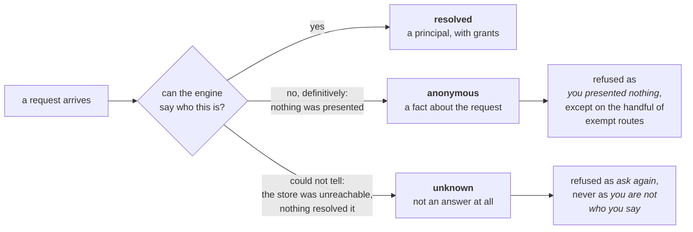
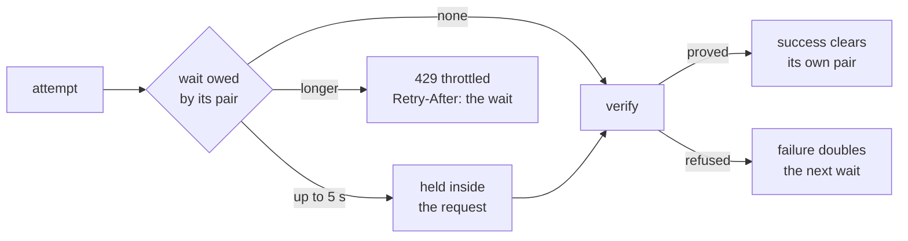

# Identity and Access

Every row this engine keeps — a work item's comment, a page revision, an audit
event — records **who did it**. Every route, query and tool it serves decides
**whether you may**. This page is the vocabulary both of those use: what a
*principal* is, which *grants* exist and what each one opens, and — the part
that matters when something goes wrong — the difference between the engine
knowing you are nobody and the engine not being able to tell.

> The vocabulary lives in `internal/iam`. It is a deliberately small package:
> it names things and classifies them, and it reads nothing, writes nothing
> and stores nothing.

---

## A principal is who is acting

A principal is one actor the engine can name. There are four kinds, and the
kind is not a label — it decides how the actor's work is attributed and what
it is allowed to be.

| Kind | Who that is | Recorded as |
|---|---|---|
| `person` | A human being — the founder at the dashboard, a teammate with a login | `human` if they hold a seat, `operator` if not |
| `seat` | An agent seat acting inside its own turn | `agent` |
| `machine` | A token with nobody behind it: CI, a pipeline, an automation | `operator` |
| `engine` | The engine itself — a duty's repair, a chart apply, a retention trim | `system` |

Those four recorded values (`agent`, `human`, `operator`, `system`) are the
author kinds already stored beside every tracker commit and every page
revision, and they are what an audit filter selects on.

### A person with a seat acts as themselves

A person is the one kind that splits. Bind somebody in the identity directory
to their seat and their work lands under **their own seat handle**, and every
authority rule that asks "do you lead this" is asked about that seat:

```
crewlet iam bind <person-id> founder
```

The binding is a directory row, not a line of the company document — see [The
binding has two ends](#the-binding-has-two-ends-and-only-one-of-them-arbitrates).
A person signed in with a session acts as the seat their row is bound to. A
**Tier A token** acts under the login `token:<id>`, and it acts as a seat the
same way: when the directory holds a row under that login bound to one —
enrolled as a machine (`crewlet iam create -kind machine -login token:<id>`)
and then bound with `crewlet iam bind`.

Without a binding they act as the credential, under its own login. Both are
ordinary — an operator who is not in the org chart, a pipeline, an automation
each act as themselves and are never refused for it. What you cannot do, in
either direction, is *choose* a seat to act as: a tracker whose author field is
picked by the writer is not an audit trail.

A token's binding is held to the chart **exactly as a session's is**: only an
active machine row under its login binds it, and the seat it names goes
through the same lookup a signed-in person's does — followed through a rename,
refused `403 seat_unavailable` naming the seat once it is removed or is an
agent's, and `503` on a node that cannot say (behind the binding on the chart,
past the stall grace, or unable to read the directory). A token answered as the
bare credential there would author under its seat on one node and under its own
name on the next. A token nobody binds is served as itself even by a node whose
identity applier is behind, which is what keeps break-glass working.

### Names can never collide

Three kinds of name land in one author column, with nothing but the kind beside
them, so the engine keeps them apart by their **shape**:

| What | Shape | Example |
|---|---|---|
| A seat handle | one segment, lowercase letters, digits and hyphens | `backend-lead` |
| A person's login | segments joined by **dots** | `jane.doe` |
| A machine's handle | segments joined by a **colon** | `ci:release` |

A seat handle can carry neither a dot nor a colon, and the other two each
require a different one — so no login can be read as a seat, no machine handle
as a login, and an audit feed filtered on a name matches everything that name
did and nothing else. A login without a dot, or a machine handle without a
colon, is refused when it is written rather than discovered later.

**All three stop at 64 characters.** A login is the subject its claim
arbitrates on (`iam.login.<login>`), which the broker indexes for the life of
the deployment, and it sits in the same author column a seat handle does, so it
takes the handle's bound. A Tier A token id therefore stops at 58, since it
acts under `token:<id>`; and an address whose proposed login would run past the
bound proposes none, leaving the person to type one rather than handing them a
name cut at an arbitrary letter.

**Two machine classes are nobody's: `pat` and `session`.** `pat:<credential
id>` is how a [machine token](#machine-tokens-a-persons-own-and-a-service-accounts)
is named in the operator column beside the owner it acts as, and
`session:<lineage>` is how a browser session is named there beside the person
signed in with it — so a service account enrolled as `pat:something` or
`session:something` would be a principal whose name reads as a credential
nobody minted. The machine grammar refuses both classes.

**Each shape belongs to its kind, and to no other.** A person's login must be
dotted and a machine's must be coloned — at enrolment, at an invitation's
redemption and at every rename. That matters most for one family of names:
`token:<id>` is the login a Tier A token acts under, so the directory row
holding it is what binds that token to a seat. A person can never hold one, so
no person can make the deployment's own credential act as their seat. The
directory enrols people and machines only; a seat belongs to the chart and the
engine is the node.

**Every principal enrols with a login** — a person as well as a machine,
although a person's address already finds them. The login is the name an
unbound person's work is recorded under, and a person enrolled by address
alone was recorded as `anonymous` beside every change they made. So every
path that creates a person names one: an administrator types it
(`crewlet iam create -login jane.doe -email jane@example.com`), and an
invitation's form — the first person's included — arrives with one
**proposed from the address** — `jane.doe@example.com` proposes `jane.doe`,
and `jane@example.com` proposes `jane.example`, borrowing the domain's first
label because a login without a dot is not a login. The person keeps it or
changes it; nothing is derived silently. A login is never cleared afterwards,
only renamed — and a rename **claims the new login before it gives up the old
one**, so one refused by its holder's grammar or by somebody else holding it
changes nothing. Moving a person between seats takes the same order. (Releasing
first used to leave a refused rename with no login at all, which recorded the
person as nobody and silently unbound a Tier A token from its seat.)

---

## Grants: the eleven things there are to allow

A grant is one capability. There are eleven, each covering a surface the engine
actually serves, and each is either a **read** or a **write**. The class is
declared rather than derived from the HTTP method, and it is what lets a
narrow service account be cut down to reading: the public read posture
`allow_anonymous_read` used to open is now a credential holding read grants and
nothing else.

**`api.auth.max_grants` bounds all eleven.** A person's grants live in the
replicated store, written by whoever holds `people:manage`; the ceiling is the
operator's statement, in the tier that holds the keyring, of what that
directory may ever confer. It is required once the API is served.

It is intersected at **decision time, per node, per request**, and nothing is
written when it changes. That is what makes lowering it immediate — no config
apply, no migration, no restart of the fleet — and it is also what makes a
fleet whose nodes disagree a *legal* state rather than a broken one: a rolling
restart **is** that state, for as long as it runs.

Legal and invisible is the problem. Without a signal, a person's authority
depends on which node a load balancer sent them to, and the symptom is an
operator who can revoke a credential on one request and cannot on the next,
with nothing anywhere saying why. So each node publishes a **digest of its own
resolved ceiling** on its presence lease, and `GET /query/fleet` renders it as
`grant_ceiling` per node — two different values on that view is the
disagreement being said out loud. It is a hash rather than the list because
every node reads every other node's lease on every heartbeat, and eleven strings
per node is a payload that grows with the fleet to answer one question. It is
derived from the **sorted, deduplicated** set, so a fleet whose config is
assembled by a template does not report a disagreement it does not have, and it
is **absent** rather than empty on a node that binds no API — a worker has no
opinion, and a blank must not read as a ceiling of nothing.

### Reads

| Grant | What it opens |
|---|---|
| `state:read` | What the company is doing: the board, the pages, the roster, the org chart, the fleet, budgets, schedules — the ordinary dashboard read |
| `audit:read` | The *record* of what happened: `/events`, any seat's `/agents/{id}/memory` and `/agents/{id}/conversations`, and the turn frames on `/ws/stream` carry full prompts, tool arguments, diary entries and what a seat said on a chat surface, and `/iam/audit` carries the identity estate's own trail beside them. The org chart's company-wide feed (`/chart/history`) and its continuous report (`/chart/check`) are this read too, and so — beside `people:manage` — is the list of seats nobody holds (`/chart/seats?unheld=true`); one object's own history stays the board's. A seat's trail is the audit read whoever's seat it is — not its lead's by leading it, and not `fleet:operate`'s |
| `config:read` | The company document — the org chart, every integration, and the *names* of every credential the company holds or has not set yet |
| `secrets:read` | Revealing a stored credential's value (the one `/secrets` route that returns one, which needs an explicit `?reveal=true`, takes `config:read` beside this grant, and logs the access) |

`state:read` and `audit:read` are separate on purpose: showing somebody the
board and showing them every prompt an agent was ever given are not one
decision.

`audit:read` is **one** grant over both trails rather than a transcript read
and an audit read, because they have one audience and one question — what did
this company do, and who asked it to. An agent's turn names the principal that
woke it and a sign-in names the session every later turn carried, so a reader
holding one and refused the other could establish neither half.

`config:read` also covers the `/setup` and `/secrets` *listings*. They carry no
values, but the list of which credentials a company has **not** configured is a
map of what to attack, which is why those surfaces are guarded even for reads.

### Writes

| Grant | What it opens |
|---|---|
| `work:write` | Filing and moving work: create, update, comment, merge, and the project facets a writer may declare |
| `knowledge:write` | Authoring the company's own pages: write, save, comment — except in the tool-skills container, which takes `config:write` as well |
| `config:write` | Changing the company — `PATCH /config` and the epoch activation that rebuilds every seat's tools, providers and MCP children; the org chart's structure, its runtime half and the relations authority is derived from; the tracker's workspace catalogue (`write_work_catalogue`), which is configuration rather than any project's; and a page in the tool-skills container (`pages.skill.write`), which is injected into every seat's turn. **It is host access** — see below |
| `secrets:write` | Sealing, rotating, deleting and re-keying the fleet's credentials |
| `fleet:operate` | The deployment's own controls: `POST /backup`, the retention floor, the capacity window, the maintenance gestures, evict and readmit, and the two purges — a work item's and a page's — which no seat may make whatever it holds. With `people:manage` beside it, `POST /iam/invalidate-all`; with `config:write` beside it, taking an object out of the org chart — the one structural change nothing undoes |
| `people:manage` | Authority over **person rows**: inviting somebody, changing what they carry, suspending them, revoking their sessions, resetting a second factor, removing them — and, with `fleet:operate` beside it, ending every session in the company. It also lists the seats nobody holds (`/chart/seats?unheld=true`), which is what an invitation is sent into |
| `sandbox:run` | Starting a detached coding run, and holding the per-run credential its MCP bridge mints |

**`config:write` is host access: running code on every engine host**, and
that is what it confers rather than a side effect of it. It is one grant by
decision, and the configuration it writes runs code — a stdio `mcp_servers`
entry is a `command` the engine starts as its own user on every node that runs
seats; a seat's per-phase model keys (`llm_*`) name a `cli-agent` provider, a
binary the engine runs, and a `sandbox` cell of `run_in: self` does its code
work inside it; a `run_in: direct` sandbox cell runs a coding agent, and every
setup step, as that user; a seat's `mcp_env` decides which credentials its
children are handed; and a seat's worker grants decide which of its tools a
worker holds. The seat's half of that — its model chain, its credentials, its
sandbox cell and its `mcp_env`, the runtime half on the org chart — takes the
same grant through `/chart`. So a holder can run anything on every engine host
and read whatever the engine's user can: the Tier A file, the keyring every
session cookie is signed under, and every credential the store holds — and
every other grant is transitively theirs. A separate "runtime" grant would be
this one's whole reach under a second name, and a ceiling that withheld it
would withhold every settings edit with it. Hand it out as you would a shell on
those hosts. A machine token may carry it — `iamdomain` mints it onto one
deliberately, because applying a configuration from a deploy job is what a
token is for — so minting a token with it is handing that job host access.
Every write that can start a process — the company document, the chart's
runtime half, connecting an integration — asks for a
[recent step-up](#some-gestures-ask-how-recently-you-proved-who-you-are), which
is what keeps a stolen week-old cookie from reaching it, and every child the
engine starts is handed
an [allowlisted environment](../guides/tools-and-mcp.md#what-a-stdio-servers-environment-is)
rather than the engine's own — which stops the engine *handing* its secrets to
a tool server, and does nothing about a holder of this grant, who chose that
server. `people:manage` being its own grant keeps directory changes a
reviewable gesture of their own; it is **not** a bound on a `config:write`
holder, who can reach the store the directory lives in anyway.

**Connecting an integration has no grant of its own.** `/setup` performs no
write of its own — a credential goes through the store `/secrets` serves, and
the `${VAR}` pointer through the merge and compare-and-set `/config` performs —
so connecting a vendor is exactly `config:write` plus `secrets:write`. A third
grant beside them would be a second answer to one question.

Three splits are worth knowing because they follow a real deployment shape:

- `secrets:read` is separate from `secrets:write` so an automation that
  reseals keys on a schedule can hold the write and never the read.
- `sandbox:run` is separate from `work:write` because a coding run puts
  generated code on a machine and hands it a seat's whole tool surface, which
  is a different risk from filing a ticket.
- `people:manage` is separate from `config:write` although both are
  administrative. Changing the company document rebuilds every seat's tools
  and providers; changing a person's row decides who may do that tomorrow. An
  automation that applies a configuration must not be able to enrol itself a
  colleague, and the person who onboards a team has no business editing
  `mcp_servers`.

**`people:manage` bounds itself.** A caller may not confer a grant they do not
hold — on anybody, themselves included — so holding it does not reach past
whatever else the holder carries. That rule lives at the **record** rather
than at the route, because a record can be published by a CLI, a duty and a
migration, none of which passes through one. Taking a grant *away* is always
allowed: nobody escalates by narrowing, and an administrator who cannot hold
`secrets:read` must still be able to withdraw it from a leaver.

It holds on every record that hands a grant out: an edit of somebody's row,
**an enrolment** — which is a grant change from nothing to what it carries —
and **an invitation**, whose grants are decided once, by whoever issues it.
One enrolment is not the writer's to authorise, because the node's own writer
performs it and holds only `fleet:operate` and `people:manage`; it names the
authority it rests on instead, and the record checks it in the same snapshot
the grants land from:

| Enrolment | Its authority | What the record refuses |
|---|---|---|
| Created by an administrator (`POST /iam/people`) | The administrator's own grants | Any grant they do not hold, before the first claim is taken |
| Redeeming an invitation — the company's first person's included | The invitation, as its issuer wrote it, and the secret its link carries | A secret that is not the link's, a grant the invitation did not carry, an address it was not issued to, a seat other than the one it binds — or that one, once it is removed, an agent's or bound to somebody else — and a link already spent or aged out |

An enrolment is a sequence — the seat when it binds one, the address, then the
login, then the person — and the authority in that table is checked **twice**:
once before the first claim, as a read, and again in the person record's own
snapshot, which is the one that counts. The early check is what keeps a refusal
the estate could already establish from leaving anything behind: met only at
the last step, a link that had aged out would be refused *after* the address
and login were claimed, and the reservation that attempt left would hold the
person's own address against the next invitation to it. What can still land
between the two checks is a race — somebody else enrolling, a link withdrawn a
moment ago — and its residue is the ordinary orphaned reservation the claim
report names.

**Every enrolment's person is derived, and none of them rewrites somebody who
exists.** A redemption's person comes from its invitation, and an
administrator's create from the operation's key — the one an `unknown` answer
hands back to retry under — so the retry of either names the person its first
attempt claimed for, and finishes it. The person record is arbitrated rather
than a create, because the claims before it leave a reservation a create would
refuse, so it reads the person in its own snapshot and so does every claim of
the sequence: one who is already enrolled is refused in the terms of the
authority the enrolment named — a link already used, a key that already names
somebody else — unless it is the administrator's very create being retried. A
key reused for another address, or a second redemption of a link, therefore
never hands an existing person a second address or rewrites their credentials.

Whether **anybody exists yet** is one predicate — a person or a machine that is
enrolled and not removed; a reservation is nobody, and a suspended person is
somebody — and it is asked in two places, both about the first person: `GET
/health`'s `identity`, and the line a node logs at boot while the answer is no.

**`POST /iam/invalidate-all` takes both `fleet:operate` and `people:manage`.**
It is the restore runbook's last step, run by whoever runs the deployment, and
it ends every person's authority at once — every session and every machine
token — which is the directory's to decide. The route used to admit on
`fleet:operate` alone while the record it writes refused anybody without
`people:manage`, so an operator the route let through was refused one step
later; now the route, the record and this page say the same thing. The Tier A
token the runbook runs it with holds both, and a machine token can never hold
`people:manage`, so no pipeline's credential signs the company out.

### A grant this build has never heard of

During a rolling upgrade a newer node writes capability strings an older one
cannot read. The older node **ignores that one string and keeps the rest** — it
cannot open a door it has never heard of, and it does not need to in order to
open the doors it has. It does not refuse the principal, because refusing would
log everybody out for the length of the deploy. If you see a node logging
ignored capabilities for longer than a deploy takes, that is a node nobody
finished upgrading.

---

## Stages: whether a principal may act at all

Before any grant is consulted, a principal has to be *enrolled*.

| Stage | May act | Means |
|---|---|---|
| `invited` | no | Created, has proved nothing yet |
| `enrolling` | no | Part-way through proving who they are. Nothing moves a person here on its own; an administrator may set it. A person who must [enrol a required second factor](#a-required-second-factor-is-enrolled-before-anything-else) first is `active`, holding a session that may only do that |
| `active` | **yes** | Enrolled |
| `suspended` | no | Enrolled and blocked, reversibly, with the record kept |
| `retired` | no | Has left; the record is kept so their audit rows still resolve to a name |

Only `active` may act, and that is an allowlist rather than a blocklist: a
stage this build does not recognise may not act either.

Seats and the engine are always `active` — neither enrols, and neither can be
suspended by anything but the org chart and the process.

### What a suspension reaches, and how fast

A suspension is ONE record on the identity log — `crewlet iam suspend`, or a
`PATCH /iam/people/{id}` naming the stage — and no chart write. Every node
applies it, whatever its roles, and what follows is decided on each of them
from that node's own rows:

| What | When | How |
|---|---|---|
| Signing in | refused from the apply on | the stage is read from the row, and only `active` may act |
| Every session they hold | refused at the next request, `401 session_revoked` | the same stage check, on every request |
| An open dashboard tab | closed `4401` within a minute | the socket re-checks its credential every 60 seconds |
| Their seat's contact identities — the Slack member, the Jira account, the GitHub login | withdrawn within one apply, with a 30-second re-read behind it | the identity applier signals after the commit, and the node rebuilds its party registry for the same company from a fresh read of the directory |
| What agents are shown of them — a lead's roster, `lookup_colleague` | their accounts left out from the next turn | every turn pins the registry's reading beside its org, so the prompt and the tools leave out the same people |
| Their `inbox_changed` watch | gone with the socket | a watch needs a resolved caller |

So a message the person sends from Slack stops being attributed to their
seat — a suspended lead's DM to an agent no longer arrives as "your lead
says" — and nothing about the seat has to be edited to make that true.
Reinstating them (`crewlet iam activate`) restores all of it on the same terms. See
[Humans in the Org Chart: A suspended holder is
withdrawn](humans-in-the-org.md#a-suspended-holder-is-withdrawn-with-no-chart-record)
for the routing rule for every stage, removal included.

**The stage sticks through every edit.** It has one writer — the status
record — and a later rename, grant change or credential change forms its
document from the stage the row holds, so no edit made while somebody is
suspended can quietly reinstate them.

**What it does not reach is the seat.** It stays in the chart, work can still
be assigned to it, and the tracker still writes its notices; whoever is bound
to it next reads them. Suspending a person is not removing a seat.

---

## Anonymous is not unknown

This is the distinction to remember when a request is refused.


```mermaid
flowchart LR
    REQ["a request arrives"] --> R{"can the engine<br/>say who this is?"}
    R -->|"yes"| RES["<b>resolved</b><br/>a principal, with grants"]
    R -->|"no, definitively:<br/>nothing was presented"| ANON["<b>anonymous</b><br/>a fact about the request"]
    R -->|"could not tell:<br/>the store was unreachable,<br/>nothing resolved it"| UNK["<b>unknown</b><br/>not an answer at all"]
    ANON --> A2["refused as<br/><i>you presented nothing</i>,<br/>except on the handful of<br/>exempt routes"]
    UNK --> U2["refused as <i>ask again</i>,<br/>never as <i>you are not<br/>who you say</i>"]
```

**Anonymous** is a finding: the resolver ran, and nobody presented a
credential. It is a refusal on every guarded route — the probes, the webhook
edge, the per-run token paths and the dashboard shell are the whole of what is
served without one.

**Unknown** is the absence of a finding: the identity store could not be
reached, a session lookup failed, or nothing resolved the request at all.
Collapsing it into anonymous is the mistake this engine refuses to make
anywhere — treating "could not tell" as "definitely not" is what tears a
healthy company down over a two-second store blip, and on this surface it
would answer *invalid credential* to somebody holding a perfectly good one and
keep answering it for as long as the outage lasted, teaching everybody to go
and reset a password that was never wrong.

So: **if you are refused and the reason says the engine could not determine who
you are, check the engine's health before you check your token.** A silence —
a request nothing resolved at all — is read as unknown too, never as
anonymous: the absence of an answer is not evidence of absence.

---

## How the first person exists

A fresh deployment's identity estate is **empty**, and the one credential it
has is a **Tier A token** — `api.auth.tokens`, which configuration requires on
every node that serves the API for exactly this reason. A Tier A token is an
operator, and it carries the `grants` its own `api.auth.tokens` entry declares,
cut on every request to the node's `max_grants` ceiling — never the whole
ceiling by default (see [Tier A](../getting-started/configuration.md#tier-a)).
So the first person is **invited, like everybody after them**, by whoever holds
a token declaring `people:manage`:

```sh
export CREWLET_API_TOKEN=...   # the value of one of api.auth.tokens
crewlet iam invite founder@example.com \
  -grants state:read,audit:read,config:read,secrets:read,work:write,knowledge:write,config:write,secrets:write,fleet:operate,people:manage,sandbox:run
```

The command prints a link, shown once. The person opens it — the dashboard's
invitation screen — chooses a login (one is proposed from the address) and a
password, and redeems it exactly as the next section describes. Nothing about
the first redemption is special:

- **An invitation confers only what its writer holds**, and a Tier A token holds
  its own declared `grants` within the ceiling — so the token that issues the
  first invitation must itself list `people:manage` and every grant the first
  person is to receive (the quickstart's token lists all eleven), and the
  operator issuing the link decides which of those to give. A grant the token
  does not hold is refused `403`, naming the grants that would have admitted
  it; add it to the token's entry and restart, as [Tier
  A](../getting-started/configuration.md#tier-a) states. Give the first person
  `people:manage`, or nobody after them can be invited except through the token
  again; `crewlet iam check` names a company in that state as
  `no_people_manage_holder`.
- **The node says the company is waiting for it.** `GET /health` answers
  `identity: unclaimed` while nobody is enrolled (`ready` once anybody is, and
  `unknown` where this node cannot read the estate — never folded into
  `unclaimed`), and a node that boots on an empty estate logs `iam_unclaimed`
  naming the command above. Neither ever moves `status`.
- **After that, the token is the way back in, not the way people arrive.** Once
  somebody holds `people:manage`, invitations come from them; the token stays
  the break-glass credential for the day nobody who can invite is reachable.

There used to be a second way — a one-time code a node minted onto its own
disk when it found an empty estate — and it is gone. It bought a first person
who needed no configured token, on a deployment where configuration requires
one anyway, and it cost a code file on every node, a log subject that
arbitrated between two people redeeming two codes at once, and a superuser
claim sitting on disk until somebody enrolled. The token is already the root
of trust, and an invitation is already the path everybody else takes.
`api.auth.bootstrap`, which configured it, is refused by name and points
here.

## Everybody arrives by invitation

An invitation is a **claim on an address by somebody who does not have a person
yet**, so it arbitrates where an address does — which is what makes an invite
and an enrolment for one address contend, and what makes two nodes redeeming
one link contend with each other.

What redeeming confers is decided **once, by whoever issued it**, rather than
again by whoever happens to process the redemption. A redemption is therefore
not a way to ask for more than was offered: issuing one is held to the issuer's
own grants, and the redemption names the invitation as its authority, so the
record refuses anything the invitation does not cover — and a link that was
spent or aged out between opening the form and posting it answers
`410 invite_spent`, the same as one that was already spent.

**The link is an id and a secret, and it opens the dashboard.** An invitation
link reads

```text
https://crewlet.example.com/dashboard#/invite/<id>.<secret>
```

— the dashboard's invitation screen, built from `api.external_url`, with the
credential after the `#`. A browser never sends a URL's fragment to any server,
so neither half reaches a proxy's access log on the way to the page. The screen
then asks `/auth/invite/{id}` itself, with the id in the path and the secret
**beside** it and never in a URL: in the `X-Crewlet-Invite-Secret` header to
render and in the JSON body to redeem. The id alone opens nothing — it is the row's key, in every
snapshot, backup and access log — and what the estate keeps of the secret is
its SHA-256. A missing or wrong secret is answered exactly as an id nobody
issued is: the same `410`, counted against the caller's source, because told
apart it would say which ids exist.

**The GET renders and never spends.** A link is followed by things that are not
the person it was sent to: a mail client prefetching, a security scanner opening
every URL in a message, a chat app building a preview card. Every one of those
is a GET, and an invitation spent by one is an account created for somebody who
never saw it — or, far more often, a person told their link was already used by
whoever scanned their mailbox. So the GET answers what the form needs to render
and changes nothing; the POST is the person, having typed a password.

**An invitation may bind a seat.** `crewlet iam invite -seat <handle>` and `seat`
on `POST /iam/invitations` name a **human seat nobody holds**, and redeeming the
link then binds the person it creates to that seat — onboarding somebody into
their seat with one link rather than an invitation and a bind afterwards. A seat
the chart does not hold, an agent's seat and a seat somebody is already bound to
are refused when the invitation is issued, naming the seat. The invitation
records the seat's **identity** — the handle it was created under — so a rename
before the redemption binds the same seat, and the invitation's page shows it
as the chart calls it then. The redemption claims the seat **first**, before the
address and the login: a seat is the one thing the chart can move in the week a
link is open, and a refusal at the first claim leaves nothing behind, where one
after the address would hold that address against the next invitation to the
same person. A seat that was removed, made an agent's or bound to a colleague
since the issue is refused as the link's own refusal — `410`, ask whoever sent
it for a new one — before anything is written; the rare redemption that races a
colleague's bind to the seat is `409`, saying the seat is taken and naming
nobody.

What the form needs includes **a login to propose**. Every person enrols with
one, and somebody following a link has typed nothing yet, so the GET answers
`login` derived from the address in the person grammar. The POST carries
whatever login the person settled on — the proposal or their own — and an
absent one is refused `400`, as a login somebody else holds is refused `409`
without saying who.

**A redemption can be retried until it lands.** It is a sequence — the seat
claim where there is one, the address claim, the login claim, the person — so
one refused halfway leaves the address claimed. The person it creates is therefore **derived from the invitation**
(a uuid7 at the invitation's own instant) rather than minted per request:
every attempt names the same person, a claim the first attempt took is one the
retry already holds, and somebody told their login was taken simply chooses
another. What keeps the link single-use is the link, not the id — a redeemed or
expired invitation is refused before anything is written, and so is one whose
address somebody is already enrolled under (if that is the person this link
created and its spend never landed, the spend is published then).

Absent, redeemed, expired and a secret that is not the link's are **one
refusal**, because the remedy is the same and telling them apart would say
"this was already used" to somebody whose link merely aged out, and send them
looking for who used it.

**The link is shown once and nothing can read it back.** What the estate holds
is the invitation's id and the SHA-256 of the secret its link carries — the
record that issued it carries the same hash and never the secret, and the
redemption's own record checks the secret against it again where the grants
land. An invitation an administrator lost is re-issued with one more call
rather than recovered; the one answer that carries a link again is a **retry of
the issue itself** under the same key, because the id is derived from the key
and the secret from the id, both under the company's own key. And the address it
was for is sealed under the fleet keyring and bound to the invitation, so an
address somebody typed and never sent leaves no cleartext anywhere — and the
sweep that collects the invitation takes the sealed copy with it.

An invitation issued before links carried a secret has no verifier and is
**redeemable by nobody**: admitting it on its id would admit exactly what the
secret closes. Issue it again. Its record also travels at the identity log's
newest record version, so a node running an older build defers it and answers
the link `410` rather than redeeming it without checking the secret.

**The engine never sends mail.** `crewlet iam invite` and `POST
/iam/invitations` hand the inviter the URL; getting it to the person is
theirs. A person whose seat carries a contact identity can also be sent it
over the chat surface the company already runs; somebody who will work only
through the dashboard has none, and the link reaches them however the inviter
chooses.

**It stays redeemable for one week.** That is the security horizon rather than
a convenience: the link is a bearer credential sitting in somebody's mailbox,
so the window is how long a compromised mailbox yields an account. A week
survives somebody being away without making the link a standing way in.

## The binding has two ends, and only one of them arbitrates

A person is bound to a seat, and the two facts live in two domains: the
directory holds `seat_id` on the person's row, and the chart holds the seat.
Each has its own log, its own applier and its own arbitration anchor — so
neither can refuse a write the other is making.

What that means in practice:

- **A binding names the seat by the handle it was created under.** An
  administrator names a seat by any handle it answers to — its current one, a
  retired one, the original — and the bind resolves that name through the
  chart and records the seat's **identity**: the handle it was *created* under,
  which no rename moves and the chart never issues to another seat. Every
  reader turns it back into a seat the same way — the request path, the
  dangling-binding check, contact routing — so a binding follows its seat through every rename, and never follows an
  old handle to a seat somebody created later. Keyed on the handle typed at the
  time, a renamed seat could be claimed again under its new name, and a
  removed person's claim on the old name went on withholding the seat from
  whoever held it next. See
  [ADR-0027](https://github.com/crewlet/crewlet/blob/main/adr/0027-a-seat-binding-names-the-seat-it-was-created-as.md).
- **The bind arbitrates.** `iam.seat.<identity>` is a claim, create-only at an
  expectation of zero, so two people cannot be bound to one seat, under any of
  its names: they contend at the broker and exactly one wins.
- **The seat's removal does not.** The chart's removal decide reads the
  directory inside its own snapshot and refuses a seat somebody holds, naming
  them — but a bind landing on the other log at the same instant passes its own
  decide too. Both can land.

The residue is a person bound to a seat the chart does not hold as a human
seat, and it comes in two forms:

- **Settled** — the seat was removed or tombstoned, or turned into an agent
  seat, and this node's chart has applied everything the bind saw. Nothing
  clears it but a record: `crewlet iam unbind`, or `crewlet iam bind` to
  another seat.
- **Not yet** — the seat is absent from a node whose chart applier has not
  reached the position the bind was decided at. It clears when that applier
  catches up.

Both are **named legal states**, not corruption, and they are the honest price
of two domains: arbitration across them would need one log, and one log for
the chart and the directory would serialise every hire against every sign-in.

What decides a binding is dangling is the [seat table the request path
uses](#validation-is-three-valued-twice) — a binding dangles
exactly when that table would refuse its person or hold them off for want of
the seat — and one evaluation feeds every surface that reports it:

- `crewlet iam check` and [`GET /iam/check`](../reference/api-endpoints.md)
  list each one as `binding_dangling`, with the seat and which form it is in.
  A binding this node's chart **cannot judge** — its applier past the
  60-second stall grace — is counted as `bindings_unchecked` rather than
  reported either way, so a report printed during a chart stall never reads as
  a clean directory.
- The **`iam_binding_dangling`** alarm fires once a residue has persisted past
  the same 60 seconds every other alarm uses. The age is how long this node's
  own evaluations — on the alarm heartbeat, every fifteen seconds, on every node
  — have kept finding it, from the first that did to the latest: nothing records
  when a binding began to dangle, so the alarm never claims a persistence
  nobody saw. A bind racing a removal, or a hire a node applies a few seconds
  late, clears before it can fire. A beat that cannot read the directory, or
  whose chart has stalled, changes nothing: a firing alarm stays up and a
  residue keeps its first sighting, so an outage neither clears the alarm nor
  restarts its clock. A read that fails is logged the way an alarm is — one
  `iam_binding_walk_failed` when the run of failed beats starts and one
  `iam_binding_walk_recovered` when it ends, carrying how long the alarm stood
  on its old reading — rather than once a beat. And a beat re-reads the
  directory only when the directory's or the chart's applied position has
  moved since the last, or a binding went unjudged, so a quiet company's
  heartbeat costs two position reads. See [Alarms](../reference/alarms.md).

**A node that cannot read the directory refuses the removal rather than
allowing it.** A read that failed has said nothing, and reading that silence as
"nobody holds this seat" would make a store fault the one moment every removal
succeeds. The refusal says the directory could not be read; the remedy is to
try again once it can.

**A Tier A token's binding has a third end, and it is on a node's disk.** A
token acts under the login `token:<id>`, and a directory row holding that
login is what binds it to a seat — but the label is written in a node's Tier A
file and the row through `/iam`, by two people at two times. A label somebody
mistyped on either side names a login nobody holds, and the token goes on
working as itself, unbound, while its operator believes it acts as a seat:
nothing dangles, so `GET /iam/check` has nothing to name, and no directory
read can reach a node's configuration. **`GET /iam/node-tokens`** answers it
per node: each of the answering node's labels — never a value — joined to the
row holding its login (none, a reservation, or a row with its stage), and for a
held row whether it binds the token to a seat and which. It is decided like
every other directory listing, on `people:manage` or `audit:read`, and it is
what Settings › People & access reads.

## Sessions go stale, and an unset deadline is stale

Every principal carries the two instants after which its proof of identity no
longer holds — one for each [step-up window](#some-gestures-ask-how-recently-you-proved-who-you-are)
— and **an unset deadline is treated as already stale, not as eternal**.
The two readings are one keystroke apart and only one of them fails safe: a
deadline nobody set is a session nobody bounded, and reading it as "never
expires" turns a field somebody forgot to fill in into a credential that
outlives the company.

A seat binding carries a **chart position** rather than a timestamp, and the
difference is what makes the seat lookup three-valued. The org chart is a
separate log with its own applier, so a seat missing from a node's view means
one of two opposite things — the seat is *gone*, or this node has *not applied
the hire yet* — and those answers are 403 and 503. The binding records the
chart position the decision was made at, so any node can compare its own
position against it and tell them apart. Comparing two nodes' wall clocks is
what the coordination layer states it never does, and a node merely behind on
the chart would otherwise tell everybody it has not caught up with that their
seat does not exist.

---

## What somebody proves themselves with

Everything the engine stores for a credential is a **verifier** — something a
presented secret is checked against, and which cannot be presented to
anything. The identity estate is replicated to every node, snapshotted, backed
up and donated to joining peers, so a value that could be replayed out of it
would be a credential every operator with a backup holds.

| Credential | What is stored | Why that and not something else |
|---|---|---|
| Password | argon2id, 64 MiB, t=3, p=1, as a PHC string | A person chose it, so the space it came from is small enough to grind — and memory is the cost a GPU cannot buy its way around |
| Second factor | The TOTP shared secret, sealed under the **fleet keyring** and bound to the person, the credential it was enrolled as and the field — see [below](#what-is-in-the-clear-and-what-is-not) | Nothing is *presented* to the engine but a six-digit code; the secret is what generates it, so it is encrypted rather than hashed |
| Recovery code | SHA-256 | Minted here from `crypto/rand`, so there is no dictionary to grind and no memory cost to buy |
| Machine token | SHA-256 over the prefix, the credential id and the secret — everything but the log position the value carries, which is a hint about *when* to look and proves nothing | The same, plus: this is presented on *every* request a pipeline makes, and a hundred milliseconds of argon2id on each is a different kind of outage |

The rule is not "hash secrets with argon2id", it is **spend cost where an
attacker has a shortcut** — and against a 32-byte value this engine minted,
there is none.

**A node runs at most one password derivation per core at once**, hashing and
verifying alike, and the rest queue. Each one holds 64 MiB for as long as it
runs, and verifying is what every sign-in does before anybody is authenticated
— so without the cap a burst of sign-in attempts is 64 MiB per request in
flight, an out-of-memory kill rather than a slow login. Under the cap the same
burst is a queue: sign-in slows down under attack, and the node stays up.

### Twelve characters, and no other rule

No required digit, no required symbol, no forbidden repeat, no expiry.
Composition rules are measurably counter-productive: they shrink the set people
actually choose from (everybody appends `1!`), an attacker who knows the rule
enumerates it, and they push people to write the result down. Length is the
only property that buys entropy from a human at no cost to them.

Twelve is the engine's floor and a deployment may raise it with
`api.auth.local.min_password_length`; nothing lowers it. The raised floor is
the one every password is held to — every redemption's and every change of a
password — and the one `GET /auth/config` and an invitation's view
report, so a form refuses exactly what the route would. It used to be validated
and reported as twelve whatever it said, and enforced by nothing.

Behind that floor there is a small blocklist, and it is deliberately hundreds
of entries rather than a published top-ten-thousand corpus: those lists are
ranked by observed frequency and human-chosen passwords cluster at six to ten
characters, so almost none of one is reachable behind a twelve-character rule.
What *is* reachable is a handful of families — a word with padding after it, a
walk along the keyboard, a repeated block — and a candidate is folded before it
is compared (lower-cased, with `4`→`a`, `3`→`e`, `0`→`o` and the rest undone),
so one entry stands for every spelling of its family. `password1234`,
`P@ssw0rd1234` and `p4$$w0rd1234` are one string.

### Raising the cost re-hashes on the next sign-in

The parameters ride in the stored verifier, which is what makes a cost raise
possible at all: the plaintext is not stored, so the only instant a stronger
digest can be computed is the one where somebody presents their password. A
verifier written under an older cost verifies under *its own* parameters and is
reported stale, and a sign-in or a step-up that has just succeeded on it
rewrites it at the current cost — the same credential, its id kept, one write to
the person's own credentials decided in the write's snapshot, so a password
changed in the meantime keeps its change.

It only ever goes **up**. A verifier is stale when its cost is *below* this
build's in memory, passes or digest length and above it in none — never merely
because its parameters differ. The cost is a property of the build, so it
moves during a rolling upgrade, when a node still on the older build meets the
verifiers the newer one has written at the raised cost; rewriting those at its
own cost would be a downgrade, undone by the person's next sign-in on an
upgraded node and redone by the one after on an old node, for as long as the
rollout lasts. So a verifier at a higher cost verifies and is left exactly as
it is, and so is one that is higher in one parameter and lower in another.
Parallelism is not a cost — it changes how soon one verification finishes, not
what an attacker pays — so it decides nothing. A new cost therefore reaches
existing verifiers only when it lowers none of the three.

It is **best effort and never on the sign-in's time**: the person is waiting
for a session, not a stronger digest, so the rewrite starts only once the
sign-in has answered, in the background, and nothing in the answer waits on it.
It takes a derivation slot only if one is free at that moment — under the load
the cap exists for it skips rather than queueing ahead of the sign-ins behind
it — one rewrite per person runs at a time, and its write has the identity
log's own resolve budget (five seconds). Anything short of a confirmed write is
logged (`api_password_rehash_skipped`, `api_password_rehash_unrecorded`) and
changes nothing: the old verifier still verifies, so the next sign-in asks
again — and every attempt to retire one verifier is one operation, its id
derived from the person and the verifier it replaces. A node shutting down
waits for a rewrite in flight within the listener's shutdown grace and cuts it
after.

### A required second factor is enrolled before anything else

`api.auth.local.totp: required` means **nobody acts on a password alone**. A
person who holds a second factor is asked for it at every password sign-in and
step-up, as they always were. A person who holds **none** — freshly invited,
the company's first person among them, somebody an administrator reset — has
nothing else to present, so
refusing their sign-in would lock them out of the one gesture that satisfies
the rule. Instead the sign-in succeeds into a session that may do **nothing but
enrol one**:

- `POST /auth/login`, `POST /auth/invite/{id}` and a
  password `POST /auth/step-up` that proved a password and no second factor
  answer `200` with `"status": "second_factor_enrolment_required"` and the
  cookie of that session. `GET /auth/session` says the same.
- The request guard answers **every other route** `403
  second_factor_enrolment_required` for that session — `/iam`, `/work`, the
  socket, and the rest of `/auth` too, which regenerates recovery codes and
  signs a person out everywhere. It admits exactly three: `GET /auth/session`,
  `POST /auth/totp` and `POST /auth/step-up` (enrolling asks a proof inside
  `step_up`, and somebody who took longer than that to find their phone
  re-confirms the password without signing out). The sign-out of this
  session, `POST /auth/logout`, is reached too, because the guard does not
  stand in front of it at all — see
  [Every route is guarded](#every-route-is-guarded-and-the-exemptions-are-the-list).
- Completing `POST /auth/totp` through that session **replaces it** with a
  whole one, as a step-up does: the restricted session is ended first, the new
  one keeps its absolute deadline, and the enrolment's
  answer carries the new session beside `"status": "enrolled"`, its cookie on
  the response. It also keeps the restricted session's **proof instant** —
  when the password was proved — and is never dated at the enrolment: the code
  the enrolment checks proves possession of a seed that same session was
  handed a moment earlier, not who is holding it, so it earns no fresh
  step-up window. Recovery codes come after, from the whole session, while the
  password's proof is still inside `step_up` — or after a step-up that
  presents the new factor.
- A restricted session enrols **only while its person holds no second
  factor**, decided in the snapshot the factor would land on. Its proof is a
  password alone, and fresh enough for the enrolment's window, so without this
  whoever held such a session — signed in before the person enrolled their own
  authenticator from somewhere else — could enrol theirs over it, lock the
  person out and be handed a whole session. Once a factor is held that
  enrolment is `403 second_factor_required` and nothing is stored: sign in
  again with the factor. A whole session may still replace its own.

The restriction is **the session's own fact**, decided by the sign-in that
opened it rather than re-derived on each request from the person's credentials
and the node's configuration: what restricts it is what its sign-in proved, and
a per-node derivation would restrict one browser on one node and free it on the
next. It is written in **two places, and both are read**:

- **the cookie itself.** The bearer carries a signed scope, `enrol` (see [The
  session cookie](#the-session-cookie)), so every node reads the restriction
  whether or not it has applied the session's start. It has to: a sign-in
  answers before any node applies the session it opened, and a node that has
  not yet applied it serves reads on the cookie alone — so a restriction only
  the row carried was one every node ignored for the first moments after every
  password sign-in.
- **the session's start record**, which `GET /iam/people/{id}/sessions` reads
  to mark it `"enrolment_only": true`, so an administrator can tell a person
  part-way through their first sign-in from one who is working. It is written
  at the identity log's condition version, so a node running an older build
  defers it rather than recording the session as whole.

A node running an older build refuses the scoped cookie outright, as a cookie
not of its format — during a rolling upgrade somebody part-way through enrolling
may be asked to sign in again there, and is never served whole.

A Tier A token's exchanged session is never restricted. `optional` opens whole sessions on a
password alone, which is why it is refused off loopback unless
`accept_insecure` says so.

### A code is spent when it is used

Either second factor works at a sign-in or a step-up, whichever the person
holds: an app code, or one of their recovery codes when the phone is not to
hand. Both are **spent by the sign-in they complete**, as a write to the
person's own credentials decided in the same snapshot that checked them:

- an **app code** records the time step it was accepted at, and a code at or
  before that step is refused. Without it, the drift tolerance — the code
  before and after the current one are also accepted, because clocks disagree —
  is a ninety-second window in which one code read over somebody's shoulder
  works as often as it is typed;
- a **recovery code** is removed. It is a one-time value by definition, and one
  that stayed would be a second password written on paper.

Two sign-ins presenting the same code at once are arbitrated like any other
write to the same person: one lands, the other finds the code already spent and
is refused with the same generic error as a wrong code. A sign-in whose spend
cannot be recorded — the identity log is unreachable — or whose outcome nobody
can establish — the broker took the append and never answered — is answered
503 rather than opening a session on a code that would still work afterwards.
Presenting the code again decides afresh: a spend that did land refuses it as
spent.

The same rule holds for every write the sign-in surface and the directory
make: an `unknown` outcome is never built on and never announced. A session
start nobody can confirm mints no cookie, an invitation no link, a machine token
no value, and a logout, a revocation, a removal or a reset says nothing on the
audit feed until its record is durable.

### A sign-in endpoint is not a roster

The failure that shapes this whole surface is not a guessed password — it is an
attacker learning **who works here**, in as many requests as they care to make,
from nothing but which requests were throttled or how long each took. Three
mechanisms close it and none is sufficient alone:

1. **The throttle is keyed on what was typed, never on what it resolved to,**
   and decides before anything is looked up. A throttle keyed on the person a
   login turned out to be is one that only *real* people can trigger, so its
   delay becomes the oracle it was added to prevent. Keyed on the typed value,
   a name nobody holds climbs the curve exactly as a real one does.
2. **A subject that does not exist is still verified against**, with a
   decoy, so the two arms do the same shape of work rather than one of them
   returning immediately. The decoy takes the same **turn** at the node's
   verify cap a real verification does and holds its slot for as long as one
   takes — a draw from the node's own recent verifications at its current
   cost, since a verification's time is a spread rather than one number — and
   derives nothing once it has something to draw from, so a name that does not
   exist costs no memory and no CPU, and no more capacity than a real one. A
   person whose password was set before the cost was last raised verifies at
   the cheaper cost it was written at, and holds their slot out to the same
   draw.
3. **Both arms answer at one deadline measured from admission** — the instant
   the throttle let the attempt through, which is the last instant both arms
   share. That is the only one of the three that equalises the *timing*,
   because argon2id's cost varies with load and a decoy's hold is a measure of
   it rather than the thing itself.

**The verify cap is shared out by address, one turn at a time.** A node runs
as many argon2id derivations at once as it has cores, because each holds
64 MiB. Every verification and every decoy a request causes waits for its
address's turn — the client's address as the trusted proxies resolve it, an
IPv6 client by its `/64` — and an address holds at most one turn, its other
attempts waiting behind it in arrival order, while addresses are served in
turn. So one address sending a flood cannot fill the cap, cannot make anybody
elsewhere wait behind its queue, and cannot push anybody's verification past
the deadline. Nor can it separate the arms by queueing its own real names
behind each other, because its decoys queue in the same line for the same
time. A request that goes away while it waits gives up its place: nothing is
derived for it, it is answered `503`, and it counts as no attempt. One that
goes away once its turn has begun holds that turn to its end, a decoy's as much
as a real verification's, because when a turn ends is what the address's next
attempt sees — a decoy that let go when its client hung up would free the line
at once where a real name held it for a whole derivation. What still
separates the arms is a load spike from at least as many addresses as the
node has cores, and then both arms queue alike and differ only by how far a
derivation now is from the recent ones a decoy draws from. The cost falls on
the address that sent the flood — including anybody sharing it, which for a
deployment behind a proxy it was not told to trust is everybody.

The refusal itself is **one generic error for every arm** — no such login,
wrong password, wrong code, code already spent. The one exception is choosing a
*new* password, which is answered to somebody who has already proved who they
are and must say what is wrong, or they will type variations until one sticks.

### A failure costs a wait, never a lockout

A hard refusal after N failures is a lockout an outsider can cause. Keyed on a
login, anybody who can type an administrator's name shuts them out for as long
as they keep typing it; keyed on an address, one guesser shuts out everybody
behind it — an office, or the whole company behind a proxy nobody named in
`api.trusted_proxies`. So a failure costs **time**:


```mermaid
flowchart LR
    A[attempt] --> W{wait owed<br/>by its pair}
    W -- none --> V[verify]
    W -- "up to 5 s" --> S[held inside<br/>the request] --> V
    W -- "longer" --> T["429 throttled<br/>Retry-After: the wait"]
    V -- proved --> OK[success clears<br/>its own pair]
    V -- refused --> F[failure doubles<br/>the next wait]
```

Each failure doubles the wait before the next attempt on its key — 1, 2, 4, 8,
16, then 30 seconds, and never more — and a correct credential after the wait
always succeeds. The key is **the pair**: the subject as typed (an address
folded the way the directory folds one, anything else by case), from one
source — the client's address as the trusted proxies resolve it, an IPv6
client by its `/64`, since every address in it is one customer's. It catches a
run at one account, and has no allowance: the first failure already costs a
second. **A success clears this pair and nothing else**, so somebody holding an
account cannot sign in as themselves between guesses at somebody else's and
wipe the record of every one.

**A second factor also climbs the person's own curve.** Past the password,
the code is decided on the pair's curve *and* on one keyed on the person the
login resolved to, because the pair alone
lets somebody holding the password divide the curve by every address they have
— a `/48` of IPv6 is sixty-five thousand fresh pairs, and six digits fall to
that in about an hour. Every address's wrong codes climb the one curve, a wait
past five seconds is `429`, and the code that completes the sign-in lifts it. It
is keyed on the resolved person here and nowhere else, because only somebody
holding the password can reach it, so it tells nobody who exists. A person's
curve reaching its ceiling is announced as `iam_second_factor_throttled`:
somebody holding their password is guessing at their code, and the password is
what to rotate.

**There is no curve on the source alone.** There was one — ten failures from an
address free, then the same doubling wait — and it was a lockout by another
name: a refusal decided on an address is one anybody sharing it holds shut for
everybody else, so one stranger failing once every twenty-five seconds, at any
name at all, kept every sign-in from that office, that VPN or that proxy at
`429`, the right passwords included; and since an attempt still being checked
counted against it, a dozen colleagues signing in at once met the same `429`
with nobody failing. What that leaves unslowed by a curve is one password tried
against many names from one address. What bounds that is the address's one
turn at the verify cap — one name per derivation, however many it sends at once
— the twelve-character floor and its blocklist, and the pad on every answer;
what shows it is the
audit trail's per-client, per-minute failure tally, which counts how many
different names one client tried.

A credential that **names nobody** — an invitation link — meets no curve at
all: there is no subject to pair with its address, and its secret is 256 bits
from `crypto/rand`, so a curve on the address alone would only have been a way
for one stranger to hold every invitation from that address shut. Every
refusal of one is still a failed attempt in the tally.

An attempt still being checked counts as a failure against its pair until it
resolves, so a burst of concurrent guesses at one account is served one after
another along the curve rather than all at once; and at most sixty-four
attempts are held waiting on a curve at once on a node — past that, a wait is
answered `429` straight away rather than parked on an open connection an
attacker chose to open.

**Each node keeps its own curve.** The window is fifteen minutes — long
enough that a run held at the ceiling, one attempt every thirty seconds, never
ages back down the curve, and short enough that an honest mistake stops
costing anything inside the quarter hour — and the curve lives in the memory
of the node that served the attempt. Nothing about it is written to the
coordination store, so a sign-in never waits on a round trip, and on the single
node most deployments are there is nothing more to say. On a fleet of N nodes
serving sign-ins, a guesser whose attempts a load balancer spreads across all
of them meets N separate curves and is admitted up to **N times as often** as
on one node. That residual is deliberate: the curve was once shared through the
coordination store, which put a read and a write on every step of every sign-in
and a subsystem of its own — clock skew between writers, a per-address budget
for the reads a spray of fresh names drove, a pause for a store that stopped
answering — behind a factor of N on a rate the curve has already cut sixty-fold
at its first step. What still bounds a run at one account on N nodes is what
bounds it on one, times N: at the ceiling, one guess per node every thirty
seconds, each an argon2id verification in its source's turn, against a password
of at least twelve characters that is not on the blocklist — and, for a person
who holds one, a second factor whose own curve a guesser reaches only once they
already hold the password. A node holds a pair under a keyed digest, the key
generated by the process and never written anywhere, never what was typed — a
password typed into the login box is what lands in that field often enough to
matter.

A spent invitation link that **proved itself** — redeemed, expired, its
address already enrolled — is refused like every other `410` and is **not** a
failure: that is the link's holder, or a mail scanner re-reading it, and
counted it named the scanner's address as a guesser. A guesser who does not
hold the link can never reach the difference.

### A bearer is protected by its value, not by a curve

The password routes are not the only place a guess is answered. Every guarded
route compares the bearer it is handed — a Tier A token, a machine token or a
session cookie — and whether it matched is the whole of what the caller learns:
`401`, or the route's own answer. That comparison is answered as fast as
requests arrive, on every guarded route alike, and what makes guessing through
it hopeless is the value itself: a machine token carries 32 bytes from
`crypto/rand`, a session cookie is an HMAC under the fleet's keyring, and a
Tier A value is at least 26 characters — `crewlet validate` refuses a shorter
one, and `crewlet secrets keygen` mints one.

No curve stands in front of the comparison, deliberately. A bearer names
nobody until it is compared, so the only thing a curve there could be keyed on
is the **address**, and a refusal decided on an address is one anybody sharing
it holds shut for everybody else — an office behind one NAT, a VPN's egress, or
the whole internet behind a proxy not named in `api.trusted_proxies`. One was
tried, and one stranger's guess every twenty-five seconds kept every valid
token at that address, the break-glass Tier A token included, answering `429`
on every guarded route; a client with a dozen *valid* requests in flight met
the same `429` with nobody guessing at all. A curve on `POST /auth/token` alone
would slow nobody who is guessing — every other guarded route answers the same
guess the same way — and would still let a stranger at the address close the
one route a break-glass holder uses to reach the dashboard.

What a guess costs the guesser is **visibility**: every refused bearer on a
guarded route is a failed attempt in the audit trail's per-client, per-minute
tally — `iam_login_failures`, naming the client and how many different values
it tried.

An **unguarded** route never compares a bearer at all — `/health`, the
dashboard's assets, the webhooks, the sign-in routes. Nothing there acts on
whom a bearer names, and comparing one anyway answered a right value and a
wrong one at different speeds (a matching Tier A token reads the identity
directory for its seat binding first) on routes whose refusals nothing counts.
Such a request is simply anonymous. The Forge relay's own JWT on `/webhooks/forge` is that route's to
verify, and never the guard's.

---

## Machine tokens: a person's own, and a service account's

A **machine token** is the third credential, beside the deployment's Tier A
tokens and a person's session: a bearer minted *for somebody in the
directory* — a person's own token for the assistant they work through, or the
token a **service account** (a directory row of kind `machine`, with a coloned
login such as `ci:release`) presents from a pipeline. It is what
`crewlet iam token` prints, and it is a `CREWLET_API_TOKEN` like any other:

```bash
# Your own, for the assistant you work through: signs in as you for the one
# request (the password is read without echo), mints, and signs out.
crewlet iam token -login jane.doe -label "my assistant" -grants state:read,work:write

# A service account's, minted by whoever holds people:manage.
crewlet iam token -person <service account id> -label "release pipeline" -grants state:read,work:write -days 30

export CREWLET_API_TOKEN=cwl_pat_…
```

**A person's token is theirs alone to mint.** Whoever mints a token is shown
its value, and the token acts as its owner — so one minted on somebody else's
account is a credential that acts as them, held by somebody who is not them.
`people:manage` therefore mints for **service accounts** and for nobody else;
a person mints their own from their own session, which is `POST
/iam/credentials` with no `?person=` — and `crewlet iam token -login` is that
request, signing in for it exactly as the dashboard does —
the password from the terminal without echo or the first line piped in, a
second-factor code the same way or the line after it, and never either as a
flag, because a recovery code on a command line stays good in the shell's
history — and signs out after,
so the session it opened does not outlive the command. It reads no
`CREWLET_API_TOKEN`. A deployment on `backend: none` signs no people in, so
there is no person there to mint for; its machines are service accounts. The
decision is made in the owner's own snapshot, on the
**id** of the party minting rather than its login, because a login is a name a
rename moves between people — and that party is the one the identity writer was
derived for from the signed-in principal, never a field of the request, so the
rule holds for anything that publishes a mint, not only for the route. Nothing
is minted through a machine token either, whoever it acts as: one minted from
another would renew itself for ever with nobody present.

The value is `cwl_pat_<credential id>_<log position>_<secret>` and is shown
**once**. The prefix is what a secret scanner matches on; the id and the
position are in the clear so that checking one is a single keyed read of this
node's own rows; the secret is 32 random bytes, and what the estate stores is a
SHA-256 over the prefix, the id and the secret.

**Somebody holds at most 64 credentials.** A password, an authenticator and a
recovery set are three; the rest are machine tokens. A revoked or expired one
stays on the person's record — listed with when and why it stopped — until
the retention sweep collects it, seven days after it lapsed, or until a change
needs its place: a mint, a second factor or new recovery codes that would
leave more than 64 drops the credentials that lapsed **earliest**, as many as
it needs and never a live one. Only a change that would leave more than 64
**live** credentials is refused, `400 invalid_body`, and revoking a token
nothing uses makes room at once. The bound is what keeps a person's record —
every credential change republishes all of them — inside the identity log's
128 KiB largest record, which its
[gate reserve](../guides/retention.md#the-gate-reserve) is sized by; a
person's name and address are bounded for the same reason, at 256 and 320
bytes.

**It acts as its owner.** A person's token is that person — their seat when the
directory binds them to one, exactly as their session would be — and a service
account's is that machine, or the seat it is bound to. There is no way to mint
one that acts as anybody else.

**And every write it makes says it was the token.** The owner is the author —
it is their authority being exercised — and the credential rides beside them
as `operator_id: pat:<credential id>` on every work item, page and chart change
it writes, so what somebody's assistant filed is never mistaken for what they
filed themselves. A configuration revision and a stored secret record the same
two — the owner as `created_by` / `updated_by`, with its kind beside it, and
`pat:<credential id>` as `operator_id` — where they used to have room for one
name and gave it to the credential, which named nobody once the token's own
row was swept. The identity estate's audit events carry it beside `by`, and
its own trail, `GET /iam/audit`, beside the actor — which used to name the
owner alone, so whatever a token did to the directory read there as done by
them. The one exception is a removal and a company-wide invalidation: their
records are pinned at their first version for ever, so their trail rows name
the actor alone and the events announcing them carry the token. The `pat`
class is
reserved for exactly this: no service account may enrol under a login that
starts `pat:`, so the name always means a machine token. See [who a write is
attributed to](../reference/api-endpoints.md#who-a-write-is-attributed-to).

**It carries what it was minted with that its owner still holds.** The grants
are named at the mint (`-grants`); left out, the token carries every grant its
owner holds that a token may carry. On every request the minted set is cut to
the owner's **current** grants and to this node's ceiling — so demoting a
person demotes every token they made, and nothing ever widens one.

**What a mint refuses:**

| Refused | Why |
|---|---|
| `secrets:read` and `people:manage`, whatever the owner holds | Revealing a credential and deciding who may do anything are gestures that need a person present, and a token is what an attacker holding a pipeline's environment already has |
| A grant the owner does not hold | A token narrows its owner and never widens them |
| A grant the **minting party** does not hold | Whoever mints a token sees its value once, so minting one for somebody else is holding their grants oneself — the same rule as an enrolment |
| A **person's** token minted by anybody but that person — an administrator included | It acts as them, and its value is shown to whoever minted it |
| A **service account's** token minted without `people:manage` | It has no login page, so nobody can mint for it as itself; minting for it is managing people |
| An owner who is not active, and the machine row that binds a Tier A token (`token:<id>`) | That row is the deployment's credential's place in the directory, not an account |
| No expiry, one already past, or one more than a year away | Ninety days by default and 365 at most: "forever" is deliberately unexpressible |
| A request that presented a machine token | A token minted from a token is one whoever holds a pipeline's environment can renew for ever, a year at a time, with nobody present |

A Tier A token minting one names the service account (`?person=`, or
`-person` on the CLI): it is the deployment's credential and owns no tokens
itself, and a person's are theirs to mint.

**What ends one.** Revoking it (`crewlet iam revoke-credential <id> -person
<owner>`, or `DELETE /iam/credentials/{id}`) — on each node the moment the
revocation's record applies there, whatever instant it is stamped with: the
stamp is the revoking node's clock, kept so the listing can say when, and a
node whose own clock ran behind would otherwise go on serving the token until
it caught up; its expiry; its owner being
suspended, retired or removed; its owner being **signed out everywhere**
(`crewlet iam revoke`), because a token is minted at its owner's revocation
epoch and refused once that moves — which is what makes offboarding complete;
and `crewlet iam invalidate-all`, because it is minted at the company's session
generation too, for [a restore's reason](#two-counters-and-why-there-are-two).

**A token manages no proof.** It is stepped up by construction — it has
nothing else to present — so what keeps it off every gesture about *how its
owner proves who they are* is the credential the request presented, which each
of those refuses before anything is decided: it cannot mint
another token, enrol or replace a second factor, regenerate the recovery codes,
or answer a step-up, and `DELETE /iam/credentials/{id}` from one revokes
machine tokens (itself included) and nothing else. Whoever finds a token leaked
can withdraw it from wherever they found it; nobody holding one can take the
account it belongs to.

**Three answers, and the third is not the second.** A node that knows the
token is no good answers `401`. A node that cannot tell answers `503` and a
pipeline retries: one that has not yet applied the mint the token names (the
position in the value is what tells "not yet" from "gone"), one whose identity
applier is past the sixty-second stall grace, and one holding a record it
cannot decode about the owner. Every node applies the directory from boot,
company or none, so a token minted on a peer is one this node can answer for
once it has applied the mint. A `401` there would teach a pipeline that a
credential that is fine is broken.

---

## The session cookie

A signed-in browser holds one cookie, and it is **signature-stateless and
row-stateful** because neither half works alone. A purely stateless cookie
cannot be revoked before it expires, so off-boarding somebody would be
impossible. A purely stateful one — an opaque id into a table — costs a
database read for every forged cookie an attacker sends, and has nothing to say
at all until the row it names has been applied on the node the request reached.

```
__Host-crewlet_session=v3.<key tag>.<generation>.<lineage>~<person>.<epoch>.<start position>.<absolute expiry>.<idle expiry>[.<scope>][.cred:<binding>].<mac>
                        Path=/; HttpOnly; Secure; SameSite=Lax
```

The name is `__Host-crewlet_session` when `api.external_url` is https, and
`crewlet_session` on a loopback http deployment — the `__Host-` prefix requires
`Secure`, and a browser rejects the `Set-Cookie` outright without it, so a
sign-in would appear to succeed and then not stick. The scheme comes from the
*configured* url rather than from the request, because the engine sits behind a
TLS-terminating proxy and reads no `r.TLS`.

A node **issues** one name and **authenticates only that one**. The prefix is
the whole of what keeps another host's cookie out: a browser sets
`__Host-crewlet_session` only from this exact host, while `crewlet_session` any
sibling host under the same registrable domain can write, with a `Domain`
covering this one. Were the bare name read on https too, a sibling that planted
its *own* valid session would sign a visitor who held none in as that session's
person — and everything they then did would land in an account the sibling's
author can read. So a deployment that corrects its url from http to https
signs each browser in again once. **Signing out reaches both names** — it ends
the session behind either one the browser holds and clears both — so a browser
still holding the bare name from before the move has that session closed, not
merely its cookie forgotten.

A sign-out closes and announces only a session this node's rows still hold. A
cookie past its deadline, a revoked person's cookie and one naming a session a
record already ended are cleared and nothing else: each of them was already
over, whatever ended it already said so, and writing a close per post would let
anybody holding such a cookie author an `iam_session_ended` row per request.
A node that cannot read its rows still records the close `POST /auth/logout`
asked for — the lineage and the person come off the cookie's own verified
signature, so nothing has to be looked up to write it — and announces nothing,
since it cannot say the session was live until then. That is only reachable
because neither sign-out of this session is behind the request guard: guarded,
such a node answered them `503 identity_unavailable` before they ran, and the
cookie stayed set. Ending one **named**
session reads the same way — its owner and whether it is still live, in one
snapshot — but there the owner **is** the read: it is what the caller is
checked against, because a lineage is not a secret. So a node that cannot read
its rows answers `503 identity_unavailable` with a `Retry-After` and writes
nothing, rather than ending a session it cannot say is the caller's.

Every field is there because a node has to answer with it and has no other way
to know it:

| Field | What it is for |
|---|---|
| key tag | Which keyring entry signed this, so a verifier looks one key up rather than trying each — which is what makes adding a key zero-downtime |
| generation | The fleet-wide counter `crewlet iam invalidate-all` moves, so one write ends every session — and every machine token — in the company |
| lineage | The session's identity, and the subject its records arbitrate on |
| person | So a node can read their row without first reading the session's |
| epoch | The person's revocation epoch at sign-in: a node that has **not yet applied** the session's start record still holds proof the sign-in happened |
| start position | What turns "no row" into the two answers it actually is |
| absolute expiry | Never moved by a re-issue |
| idle expiry | Moved by every re-issue, with no store write at all |
| scope | **Present only on a session that may do less than everything**: `enrol`, one that may only [enrol a second factor](#a-required-second-factor-is-enrolled-before-anything-else). Signed with the rest and carried through every re-issue, so a node that has not applied the session's row still knows what it may reach. Absent on a whole session, which is why an ordinary cookie is the same nine fields every build reads, and a scoped one — or a scope a build cannot name — is refused by any build that does not know it rather than served whole |
| binding | **Present only on a session exchanged from a Tier A token** (`cred:<binding>`): a MAC over the token's value under a key derived from the one that signs the cookie, checked on every request against the value configured under the token's id — so a new value ends the session. Recomputed at every re-issue under the new signing key, so a keyring rotation drains an exchanged session onto the new key like any other. A build that does not know the attribute refuses the cookie rather than serving it whatever value the token has now |

Nothing in it is secret and nothing in it grants anything alone: a bearer in a
proxy log discloses a lineage, a person id, two deadlines, whether the
session may only enrol a second factor and — for an exchanged token's — a MAC
nobody without the keyring can test a guess against, and is worthless without
the mac. It deliberately carries nothing *about* the person — no login,
no address, no grants — because a cookie is the value most likely to end up
somewhere nobody meant it to.

**There is no validation cache**, and that is not an omission — there is
nothing to cache. The lookup is a local read of a replicated row and a map
lookup on a pinned chart view, and the store is never on a network path from
the request.

### The dashboard is the browser half

The dashboard holds **no credential of its own**: the cookie above is the whole
of what a browser presents, on every REST call and on the live socket's
handshake alike, and being `HttpOnly` it is out of reach of every script on the
page. There is no token in the browser's storage and none in any URL — the
socket reads no `?token=`, because a query string is written into every proxy's
access log. Its sign-in surface is three screens outside the frame:

| Screen | What it does |
|---|---|
| `#/login?next=` | A login or address and a password, then the six-digit code or a recovery code when the engine answers `second_factor_required`. Where `/auth/config` names no local sign-in it offers only **an API token**, which it sends once, as a header, to `POST /auth/token` and keeps nowhere — the answer is a one-hour session like any other. `next` is honoured only as a route of this dashboard, so a link cannot use the sign-in to send somebody elsewhere |
| `#/invite/<id>.<secret>` | [The invitation link](#everybody-arrives-by-invitation). It renders the invitation with the secret in the `X-Crewlet-Invite-Secret` header, spends nothing by being opened, and redeems it with the login, name and password the person chose — which signs them in |
| `#/enrol?next=` | Where a session that may only [enrol a second factor](#a-required-second-factor-is-enrolled-before-anything-else) goes first: the seed from `POST /auth/totp` (the key and its `otpauth://` address), the first code, and the recovery codes shown once |

A button that changes something — filing work, a save, marking the inbox,
pausing a seat, answering a decision — posts to `POST /operator/act/{tool}`
with that same cookie, so it runs the tool the person's own assistant would
and is decided and recorded exactly as that call would be: as the principal
the session resolves to, never as "the dashboard", and never refused for being
unbound (see [ADR-0024](https://github.com/crewlet/crewlet/blob/main/adr/0024-the-dashboard-acts-as-the-principal-its-session-resolves-to.md)).

What the rest of the dashboard does with the session follows the three answers
a guarded route gives. A `401` — from any call, or from the socket's plain-HTTP
re-ask, since a refused handshake reaches a page with no status — sends the
reader to `#/login` with the screen they were on as `next`; a `403
second_factor_enrolment_required` sends them to `#/enrol`; a `403` of any other
kind is not a sign-in's to fix and is shown where it happened. A `403
step_up_required` opens **one** "Confirm it is you" dialog however many
requests it refused, posts the password (and the code where a second factor is
held) to `POST /auth/step-up`, and replays each refused request once — see
[Some gestures ask how recently you proved who you
are](#some-gestures-ask-how-recently-you-proved-who-you-are). The page bar's
identity menu signs out — `POST /auth/logout`, or `POST /auth/logout/all` for
every session the person holds — and then reloads into the sign-in with the
tab's `sessionStorage` emptied, because a route change would leave the last
person's company in the tab's memory for whoever sits down next. A session
that ended with nobody signing out routes the tab to the sign-in instead, so a
sign-in there by anybody other than the person the tab was read by hands it
over the same way; the same person signing back in carries on where they were.
[Dashboard Design](../reference/dashboard-design.md#signing-in-is-a-screen-outside-the-frame)
has the whole of it.

### A cookie cannot tell its owner from a copy, and nothing pretends it can

A re-issue moves the idle deadline, which lives in the cookie's own signed
payload, so an hour of use writes nothing anywhere. What a cookie **cannot**
carry is evidence that it was copied: somebody who stopped at noon and came
back at two holds a cookie issued two hours ago, and so does somebody replaying
one they captured at noon — **the same bytes**. The only thing that could tell
them apart is a record of what was last issued, one write per session per
re-issue, which is exactly the traffic this design exists not to write.

An earlier format carried a **rotation index** — the session's age in hourly
windows — and treated one *ahead* of the validating node's clock by more than
two minutes as a replay, bumping the person's revocation epoch. The index was
inside the signed payload, so only a node holding the keyring could have
written it, from its own clock: the rule fired on two hosts' clocks
disagreeing and on nothing else, and its answer signed an honest person out of
every session and machine token they held. It is gone, along with
`session.rotate_after`. What bounds a captured cookie is what always did: the
**idle deadline** (twelve hours from the last use), the **absolute deadline**
(`session.absolute`), and one write — the person's revocation epoch through
**sign out everywhere**, or the fleet's generation — which ends it everywhere
at once.

### Validation is three-valued, twice

The session and the seat are resolved by two tables with the same shape,
because each is a row in a domain that **lags independently**.

| What this node's rows say about the session | Reads | Writes | Step-up surfaces |
|---|---|---|---|
| Signature valid, row present, the row's epoch equals the bearer's and the person's, generation current, both deadlines unexpired | serve | serve | serve if the proof is inside the window the gesture asks for; otherwise `403 step_up_required` |
| Row ended, the person's epoch ahead of the bearer's, the person suspended, or the generation moved | 401 `session_revoked` | 401 | 401 |
| Row absent, and this node's iam position covers the bearer's start position | 401 `session_revoked` | 401 | 401 |
| Row absent, this node below the bearer's start position, applier lag under 60 s | serve: the signature and the epoch are the proof, and the cookie's own scope what it may reach | wait up to 5 s for this node to apply the bearer's start position, then decide on the rows; 503 `identity_unavailable` if it has not | the same wait, then the same answer |
| The iam applier stalled past 60 s, the person's bucket deferred, or the replicated store answers `ErrNoEstate` | 503 | 503 | 503 |
| Not a bearer of this format at all | 401 | 401 | 401 |

| What this node's chart view says about the seat | Answer |
|---|---|
| The person holds no binding | The seatless arm: the login is the handle, and the chart is never consulted |
| Seat present in the view, `kind: human`, not tombstoned | The seat's handle is the actor |
| Seat tombstoned, or present and not `kind: human` | 403 forbidden **naming the seat**, whatever this node's chart position: a tombstone and a seat's kind are conclusive, and no amount of catching up changes either |
| Seat absent, and this node's chart position covers the binding's | 403 forbidden **naming the seat**; never a fall-through to an empty handle |
| Seat absent, and this node's chart position is below the binding's, chart applier lag under 60 s | 503 `identity_unavailable` naming the chart |
| The chart applier stalled past 60 s, or the view is not built | 503 |

**`reauth_at` is the session's own proof plus `step_up`.** Every session a
sign-in opens — a password and its second factor, a redeemed invitation, a
step-up — records the instant it was proved on its row, and the guard composes
the deadline from that and this node's window at decision time — which
gestures ask for it is [the authority table's](#some-gestures-ask-how-recently-you-proved-who-you-are). Proof is a
fact about one sign-in rather than about the person, so a proof on a laptop
says nothing about a phone signed in last week, and a step-up re-proves by
opening a new session rather than by moving a field. That new session **ends
the one it replaces** — first, so a close that does not land fails the step-up
rather than leaving two live sessions — and it confirms the sign-in rather
than repeating it: it keeps the replaced session's absolute deadline, or
confirming a session would keep it alive for ever. A session exchanged from a Tier A token is the one exception, and it is
not a session's proof at all: the guard re-composes it from the token's entry
on every request, exactly as it composes the bearer, so it is fresh by
construction for as long as the entry is held — the break-glass credential
must reach a step-up gesture on the day nobody can sign in as a person. A
node that has not yet applied the session's row — the read-only grace in the
table above — claims no proof it cannot see.

**503 and never 401 on a node that is behind.** A browser reads 401 as "sign in
again" and discards the cookie, so one stalled applier answering 401 would log
everybody on that node out and send them all back through the sign-in page —
and its throttle — at once. The grace exists only for the arm a lagging node can
honestly serve — reads of a session it has not yet seen — and it ends at the
same sixty seconds the alarm table already calls a stall, so a node serving
stale identity is by definition a node already alarmed.

**How far behind a node is, is the larger of two figures**: its backlog at the
rate its applier has been draining it, and how long its applier has made no
progress while records were waiting. The first alone cannot see a wedge — the
drain rate is measured while batches run, so an applier that stops with a
handful of records outstanding keeps the rate it last had and would read as a
fraction of a second behind for as long as it stayed stopped, serving sessions
it has not seen and never honouring a revocation stuck in that backlog. With
the second, it reads as stalled a minute after it stops. Both tables above
read it, as does a Tier A token's seat binding. A heartbeat that cannot read
the log's head keeps its last answer rather than reading as caught up.
"Progress" is the applier's **checkpoint**, which moves past a record the node
holds but cannot apply exactly as past one it applied — so holding a newer
build's record during a rollout is never read as a stalled node, which would
answer 503 for everybody on it; it is answered for the people that record is
about, below.

A node holding a record about the person it **cannot apply** — a newer build's
during a rollout, or one signed under a keyring key it was not restarted with
during a key rotation — answers 503 for the same reason, however current its
position reads: its applier moved past that record without writing its rows,
so a missing session row there may be exactly the session that record opened.
It is asked of every record the node has set aside, not only the earliest, and
only for the person's own bucket, so one record about somebody else refuses
nobody here.

**A write waits for the session it presents.** A sign-in answers *before* any
node applies the session it opened — it is the one identity write that does
not wait for its own record, because nothing in its answer reads the row — and
the cookie carries the position the session's start landed at. What the
sign-in owes in return is that whoever reads the cookie next honours that
position. A read already does. A write used to be refused `503` outright on a
node below it, which is every node for the few hundred milliseconds an apply
takes — exactly when a client that signs in and then acts makes its first
request, so `crewlet iam token -login`, which signs in and mints in one breath,
was refused on every real run. Now a write on a node below the cookie's start
position waits for this node's applier to reach that position — at most five
seconds, the same budget a write gives its own record — and is then decided on
the rows like any other request; a node that does not arrive in time is behind
for real and answers `503` with its retry hint. The position waited for is the
one inside the signed cookie, so no caller can name a position of their own to
park a request on.

### The three credential shapes meet at one frame

The guard resolves a request once and attaches an `iam.Principal`, so nothing
downstream branches on how somebody authenticated. A Tier A bearer becomes one
from the configuration alone; a cookie becomes one from the two tables above;
a [machine token](#machine-tokens-a-persons-own-and-a-service-accounts)
becomes its owner from one read of the directory. The two bearers are told
apart by the value's shape, which chooses how it is checked and never admits
anything by itself.

**The header wins when both arrive.** A browser sends its cookie on every
request whether or not the caller meant to present it, and an `Authorization`
header is only ever there because somebody put it there. So `curl -H
'Authorization: Bearer $TOKEN'` from a signed-in browser acts as the token —
and, if the token is wrong, as *nobody*, rather than being quietly upgraded to
the person whose cookie happened to be in the jar.

**A Tier A token can be exchanged for a session** (`POST /auth/token`), so a
browser can use break-glass without holding the token's value — which matters
on the one day it exists for, when nobody can sign in as a person. The session
is the token and nothing else: it names the token's login (`token:<id>`) rather
than a person, and every request re-composes it from the entry this node holds
*now*, through the same function the bearer goes through — the entry's grants
cut to the ceiling, the seat the directory binds the token to, and stepped up
by construction. Its lifetime is one hour. Removing or renaming the entry ends
it on the next request (and clears the cookie) wherever the node stands on the
log, because a configuration entry is never late; `POST /auth/logout` from it
closes it like any other session — the sign-in surface reads a token's session
the way the guard does, from the entry, where the bare estate holds no row for
a token's login and read it as already over; `POST /auth/logout/all` from it
ends every session that token opened; and `crewlet iam invalidate-all` ends it
with everybody else's. So does **putting a new value under the same id**: the
cookie carries a binding to the value it was exchanged with — a MAC under a key
derived from the keyring, never the value or a bare digest of it, which in a
cookie would be an offline guessing oracle for the break-glass credential — and
every node checks it against the value it holds under that id, applied or not.
Rotating a leaked token's value therefore ends every session the leaked value
opened, on the next request, everywhere.

**The ceiling applies to a person too.** `api.auth.max_grants` is intersected
into every principal at the moment the request is resolved, so a node whose
ceiling was lowered enforces it on its next request rather than on a row
somebody has to rewrite. A mixed fleet mid-rollout is a legal state, which is
why each node publishes a hash of its own ceiling.

**A seat refusal does not reach `/auth/*`.** The `403` naming the seat is
written for every guarded route *except* that surface, because nothing under
it consults the chart: ending a session, re-proving identity, enrolling a
second factor and regenerating a recovery set are gestures about a person's own
credential. Without the exemption an offboarded person would hold a live cookie
with no way to end it, and every screen they opened would loop through a
refusal.

---

## Every route is guarded, and the exemptions are the list

There is no "read posture" to configure and no way to open the surface. A
request that presents no credential is refused wherever it lands, **except** on
the routes below — which are exempt because each authenticates by other means,
or because a client must reach it to obtain a credential at all.

| Route | Why it is exempt |
|---|---|
| `/health`, `/ready` | Probes. An orchestrator holds no token, and a liveness check that answers 401 is a liveness check that fails. Exact paths, never prefixes — a `/health-admin` added later must not inherit this. |
| `/webhooks/…` | Every one verifies a provider signature over the body before doing anything, which is a stronger check than a shared bearer. Includes the Slack OAuth landing page, which a browser reaches mid-install with no token in hand. |
| `/otlp/…`, `/mcp/…` | The per-run signed token **in the path** is the credential. Both are reached from *inside a sandbox*, which is the one place the API's own token must never go: it reads the whole company, and the box is running generated code. |
| `/`, `/dashboard`, `/favicon.ico`, `/static/…` | The page that prompts for a credential cannot itself require one. It ships no data — every byte it renders comes from an authenticated fetch. |
| `/auth/config`, `/auth/login`, `/auth/invite/…` | A login cannot require a login: these are how somebody **obtains** a credential, and an invitation's link is the credential. Exact paths plus the one prefix, never `/auth/` — the same surface ends every session a person holds and enrols second factors. What stands in for the guard is the sign-in throttle and the origin check below, which they are not exempt from. |
| `/auth/logout` | Signing out of **this** session clears the cookie whatever the node can read — guarded, a node that could not read its identity estate answered it `503` before it ran, and a person left a shared machine still signed in. It verifies every bearer the browser holds itself and ends only a session its rows hold, and the origin check still judges it. Signing out everywhere and ending a named session stay guarded, because they act on a caller the guard resolved. |

Everything else needs one, **reads included**. `allow_anonymous_read` used to
decide this and defaulted to open, so `/events`, `/agents/{id}/memory` and
`/ws/stream` served full LLM transcripts — prompts, tool arguments, diary
entries — and the roster named everybody who works here, to anyone who could
reach the port. It could not be closed durably either: it was an `omitempty`
bool whose safe value was its zero, so `false` did not survive an export round
trip and a deployment that had closed it re-opened itself the first time its
config went through `PUT /config`.

A deliberately public read surface is now an `api.auth.tokens` entry holding
read grants and nothing else — listable, revocable without a restart, and
present in the audit log.

There is deliberately no list of *especially* guarded routes to go with this
one. Guarded is what a route **is**; each surface states its own authority
where it is enforced, as a grant on the route and an
[authority rule](#the-authority-table-one-function-decides) deciding whether
this caller may do that.

### `/operator` is not under `/mcp/`

The operator surface files and moves work and writes the company's knowledge
base — over MCP at `/operator/mcp` for a person's assistant, and over
`/operator/act` for the dashboard's buttons — and every record it writes names
the caller as `iam.ActorFor` makes them: a person the directory binds to a
seat writes as the seat, with author kind `human`; anybody else under their
own login, with author kind `operator`; and the credential it came through
beside either, as `operator_id`. `/mcp/` is exempt **wholesale**, so mounting
it there would have put a writable company surface behind no credential at
all. It has its own always-guarded prefix for exactly that reason.

---

## A cross-site write is refused by its Origin

A browser's same-origin policy stops an attacker's page **reading** a
cross-origin response. It does not stop the request being *sent* — a form post
and a `fetch` with `credentials: include` both leave the browser and arrive
here with whatever the browser attaches automatically. On a state-changing
request, reading the answer is the part an attacker does not need. CORS
therefore does not cover this, and a separate check does.

The rule, on every method that is not a read:

- **A present `Origin` that does not match is refused**, with `403`
  `csrf_origin`. This is the whole of the browser case: a browser sends the
  header on every non-GET it makes, cross-site or not, and cannot be talked out
  of it.
- **An absent `Origin` is allowed** *unless* the request authenticated by
  cookie. Every non-browser client sends none — curl, the operator CLI, a CI
  pipeline — and refusing them would refuse the callers this API mostly has, to
  close a hole none of them can be used for: a bearer is attached by script, so
  a cross-site page holding no token cannot make one travel.
- **A cookie with no `Origin` is refused**, which is the one arm the rule above
  must not swallow. A browser always sends the header on a non-GET, so a
  cookie-authenticated request carrying none did not come from the browser the
  cookie was issued to.

**What counts as a match** is `api.external_url`'s own origin plus every
`api.auth.allowed_origins` entry — the same list CORS reads, meaning the same
thing here: another address this deployment is genuinely reached at. A
deployment behind two hostnames names both, or the second one's writes are
refused with a message saying exactly that. The **path is dropped** from the
comparison: `api.external_url` legitimately carries one for a path-routing
proxy, while a browser at `https://ops.example.com/crewlet` still sends
`Origin: https://ops.example.com`, so comparing the whole value would refuse
every write from precisely the deployment shape the path exists for.

Reads are never refused for their origin — refusing one would break every
cross-origin dashboard the CORS allowance exists to serve, to prevent a request
that alters nothing. The **server-to-server edges** are not refused either —
`/webhooks/…`, `/otlp/…` and `/mcp/…`: a vendor's webhook delivery is a POST
from a server carrying no `Origin` and verifying a signature of its own, a
sandbox box presents the signed token in its path, and refusing either would
take every integration off the air.

**The sign-in routes are judged, although no credential guards them.** A login
cannot require a login, so `POST /auth/login` and `/auth/invite/{id}` are
exempt from the *guard* — and from nothing else. They
are routes a browser posts to, and each one ends with that browser holding a
session: a form on somebody else's page that could post an attacker's password
to the sign-in or redeem an attacker's invitation would leave the victim signed
in as somebody the attacker controls, doing their work in an account the
attacker can read (login CSRF). They used to be exempt from this check too.

A deployment that names **no** address permits no origin at all, which is the
fail-closed direction: nobody has said where this deployment is reached, so no
cross-origin claim can be believed.

---

## The authority table: one function decides

A grant says what a principal *carries*. It does not say whether they may do a
particular thing to a particular object — because most of the interesting
answers are about a **relation**: your own inbox, the project you lead, the
comment you wrote. One function takes that decision, over one table, and every
surface asks it: an HTTP route, a seat's own tool, the operator's assistant.

That matters because there used to be no such function. Three structs carried
pre-resolved booleans into the tracker, each filled by a different surface from
a different lookup, and two of them were filled *wrong* in ways that only
showed up as a support question:

- one flag existed purely because an operator's actor was a token label, which
  is never a handle in the chart — so the lead check was false for every
  operator by construction, and a founder re-ordering an agent's queue was
  refused by the only tool that offered it;
- the project lead lookup answered `false` both for "you do not lead this" and
  for "this node holds no company yet". A node that is booting, installing a
  revision or behind the chart log therefore told every lead in the company
  that they lead nothing — while reporting itself healthy.

And none of those lookups consulted a grant, so the deployment's own
administrator was refused by a tool where every HTTP route let them through.
The tracker still takes an authority value on the writes that need one, but it
states what the table **decided** — never the inputs a caller resolved — and
keeps only the half a chart cannot know: which facet of a write each answer
unlocks.

### The thirteen rules

| Rule | Covers | Decided by |
|---|---|---|
| **Read** | The board, pages, the org chart, the roster, the fleet, spend; and a person's question answered from the company's knowledge (`answer_knowledge`), which a principal no seat binds is refused, because it runs on the bound seat's model | `state:read` |
| **Self** | The caller's own diary, episodes, skills and onboarding marker | The caller, and **nobody else** — not even the admin grant |
| **Colleague write** | Filing, commenting, updating, merging; declaring a project's tags; authoring a page; asking a colleague | `work:write` for work, `knowledge:write` for pages |
| **Own record** | Marking an inbox, pinned views | The owner, or `fleet:operate` |
| **Own or lead** | Priorities, a person's day, reading their queue; whether a seat works — pausing it, resuming it, a note to the turn it is running (`pause_seat`, `resume_seat`, `steer_turn`) — and answering the question a coding run parked on (`answer_run`) | The owner, whoever leads them, or `fleet:operate`. For a seat's controls the owner is the person bound to the seat; for a run's question it is the run's **requester** — the person whose message woke the turn that launched it — and otherwise whoever leads the run's seat, so nobody who merely leads the requester answers a question the run put to them |
| **Saved view** | Saving a view | A **personal** view (one naming an owner): its owner, or `fleet:operate`. A **shared** one: its container's lead — a project's, a unit's, or the person whose page it sits on and whoever leads them — or `fleet:operate`, which is the only way to a workspace-wide tab. Replacing a stored view asks this twice: for the view written, and for the view it overwrites as it stands |
| **Container** | A project's policy — its fields, default assignee, tag renames and archives, archiving the project — re-routing a task to another team, and a page container's own settings | The project's lead or, for pages, the lead of the unit whose `space:` the container is; or `fleet:operate` |
| **Chart object** | The prose of the org chart: a unit's name and purpose, a seat's goal and responsibilities. The relations authority is derived from — a seat's `project`, `space` and `email`, a unit's `project`, `space` and `channel` — and the runtime half are not in it: they take `config:write`, whoever leads the object. Nor is whom a seat manages, which is the chart's structure | Whoever leads that unit or seat, or `config:write` — the one relation rule whose admin path is the company's grant rather than `fleet:operate`, because the chart is what that grant restructures and what every seat's prompt is built from. A seat never edits its own |
| **Destructive** | Removing and restoring a task; trashing and restoring a page | The **container's** lead, or `fleet:operate` |
| **Authored** | Editing and removing a page comment | Whoever wrote it, or `fleet:operate` |
| **Operator** | Configuration, secrets, integrations, the node itself, the tracker's workspace catalogue, writing a page in the tool-skills container, and the org chart's structure | The grant the verb names — `config:write` for a tool skill, which is injected into every seat's turn and so rewrites the prompt the company runs under, and for the chart's structure; a chart **removal** names two, `config:write` and `fleet:operate`, and so does ending every session in the company (`fleet:operate` and `people:manage`) |
| **Directory read** | Who can reach the company: the directory, one person's row, their credentials and sessions, and the answering node's Tier A token labels joined to the rows holding their logins (`GET /iam/node-tokens`) | The person the row is about, `people:manage`, or `audit:read` |
| **Directory self** | Minting and revoking a credential, ending sessions | The person themselves, or `people:manage` |

**Some verbs are no agent's, whatever their rule says.** Purging a task or a
page, archiving a project, and writing a tool skill carry a mark beside their
rule rather than a rule of their own: no seat takes them, whatever it holds or
leads, because an irreversible delete, a project nobody can file into again
and the instructions every seat obeys are not something a model decides inside
a turn. The seat controls and the two answers carry it too: a seat that could
pause a colleague, resume itself, steer another's turn or answer its own run's
question would be overruling the people who run it, and a seat already has
`search_knowledge` and a model of its own. The mark composes with the rule rather than
replacing it — archiving is still the project lead's, and a purge still needs
`fleet:operate` — and it is checked **first**, so an agent is told it is a seat
rather than that it lacks a capability it may well hold.

A lead may re-order what their report works on; marking somebody's mail read is
a different gesture and nobody asked a lead to make it. And whether a seat
works is its lead's to decide, or the deployment's, exactly as what it works
on is — never any reader's: everybody signed in holds a credential, so "any
operator" would let every reader of the board stop any seat in the company,
end the turn it is on, or put words in it. Each seat control is decided on
the seat, inside its tool, because the seat is never simply what the
arguments state: a typed handle resolves through the chart, a turn names its
seat only to the node running it — so a note asks that node first, and a probe
nobody answers is `unavailable` rather than a refusal — and a run names the
seat its row recorded. A colleague may file
work in a project and may not take it out again. Adding a tag and renaming one
are two rules for the same reason: the first files work, the second changes the
word on everybody's board.

**A view's rule is chosen by the view, not by the caller.** The table is keyed
on the verb, so two verbs — one for personal views, one for shared — would let
a caller writing a shared view ask the personal question instead. There is one
verb, and the payload decides: naming an owner makes it that person's strip,
naming none makes it a tab on its container.

**Four relations, and none is asked with another's key.** A unit declares its
tracker project in `project:` and its page container in `space:`, and those are
unrelated strings; a unit is a third key of its own. So the chart is asked four
different questions — who is above this person, who leads this project, who
leads this page container, who leads this unit. Asking one relation with
another's key answers correctly only for a company that happened to spell its
keys the same, and refuses a lead everywhere else with no error to notice.

**Self has no admin path, and that is why it is its own rule.** A seat's memory
tools take no handle at all, because an agent recalling another's episodes
would make the per-seat memory a shared one. An operator *reading* a seat's
memory is a different surface with a grant of its own (`audit:read` over
`/agents/{id}/memory` and `/agents/{id}/conversations`, decided per seat by a
verb of its own), and admitting it here too would be a second answer to one
question.

**Asking a colleague is a write.** It files no row, which is why it looks like
it belongs nowhere — but it spends somebody else's turn and somebody else's
budget, so a credential with no write capability at all must not be able to
make every seat in the company think.

### Every tool call goes through it

A seat's own tools and the operator's assistant serve the same tool
implementations, and every one of them is wrapped once, where it is
registered, by the same decision over the same chart. The verb *is* the tool's
name, so there is exactly one place the check could be forgotten, and a
surface that wired no decision refuses every call rather than allowing it.
What each tool is *about* — which argument names the project, the container or
the person — is read out of the tool's own arguments; a personal tool that
takes no handle is about the caller.

A few checks cannot be taken before the tool runs, because the object is not
in the arguments: which project a task is filed under comes out of the stored
row. Those ask the same table from inside the tool once it has read, under a
verb of their own — re-routing a task, a project's policy facets, archiving it,
setting somebody's priorities. And two rules the table cannot state stay with
the domain that owns them, because they are about the gesture rather than
anybody's authority: an agent never re-orders a colleague's queue even when it
leads them, which the tracker enforces on top of the table's answer, and an
agent never writes into a [reserved page
container](knowledge-system.md#who-may-write-where), which the knowledge base's
own store refuses on every write path.

**A verb with no row is refused.** Not defaulted, not passed through: a default
is how a new verb ships ungated, and it ships looking correct. A walk over the
table fails the build if a verb resolves to no rule, if a rule is declared and
no verb uses it, or if a grant the vocabulary declares opens nothing at all —
that last one is what caught `state:read` being asked for by nothing, back when
reads were "any authenticated principal".

Those three walks hold the table against **itself**, which is not enough on its
own: a verb removed from the engine leaves behind a row that is perfectly
consistent and decides nothing. So a fourth walk holds it against the tools the
build actually registers, over both surfaces — a seat's own and the operator's
assistant — in both directions. It earned its place twice on its first run: two
rows had outlived the goal verbs being removed from the tracker, and seven
tools a seat uses every turn had no rule at all.

A fifth goes one level further down, to the **argument names**. Which argument
a tool's object is read from is data, and each name is checked against the
tool's own schema. It exists because four of them named arguments their tools
do not have: the owner read empty on every call, every personal rule refuses an
empty owner, and so `my_work`, `mark_inbox`, `set_pins` and `save_work_view`
were refused to everybody but an administrator — with nothing to show for it
but a refusal naming a grant the caller already held.

### Cannot-tell is not no

Every rule that asks about the chart can fail to get an answer, and that
outcome is its own: the decision reports **unknown**, and a surface answers
`503 try again` rather than `403 forbidden`. Telling somebody they may not do
something sends them to go and ask for an authority they already hold.

The admin grant is checked *before* the chart on every rule that has one, so an
operator is never told "I cannot tell" by a node that is merely lagging.

### Some gestures ask how recently you proved who you are

A session lives for days and a laptop is left unlocked, so the gestures that
change what a company *is* ask for a proof of identity taken recently rather
than on Monday — the **step-up**. Every row of the table states whether its
verb asks for one:

| Window | Sized by | Asked by |
|---|---|---|
| none | — | Every read; every work and knowledge verb; ending your own sessions — while an administrator ending *somebody else's* asks `step_up`, because one row states a window for each arm |
| `step_up` | `api.auth.session.step_up` (1 hour) | The company's configuration and chart writes (a lead editing their own team included), connecting an integration, writing a credential and revealing a secret's value, the deployment's own controls — a budget reset, a backup, the retention and capacity gestures, ending every session in the company — and every identity-directory write: enrolling, inviting, editing or removing somebody, resetting their second factor, minting or revoking a machine token or any other credential, ending somebody else's sessions, and enrolling or replacing your own second factor or regenerating your recovery codes |

**One window, not two.** It is the practice of GitHub's sudo mode — one window
over every sensitive gesture — at the stricter end of it (GitHub's is two
hours). A second, shorter window once stood beside it for the gestures that
hand over a value or an authority somebody already holds; it sent an
administrator who had proved half an hour earlier to prove again between one
screen and the next, while what actually keeps those gestures from a stolen
credential is not the age of a proof — see below. Changing how somebody proves
who they are is one rule whichever door it comes through — the `/iam` reset,
revoking a factor through `/iam/credentials`, or replacing your own factor
through `/auth/totp` — because each is the others by another name.

It is decided **on the row**, beside the grant, for the same reason the grant
is: a REST route and a tool asking about one verb get one answer. A row may ask
its **self arm** a different window from its capability arm, and one does:
ending every session somebody holds asks nothing of the person themselves —
it is the first thing they do on finding an intruder in their account, and a
re-proof of a password the intruder may also hold would make the fastest
response the slowest — while an administrator ending a colleague's, which
stops every pipeline they run too, asks the ordinary window. It used to be
a setting nothing read — the sign-in surface recorded when a session proved
who its holder was, and no surface outside it ever asked — so a cookie from last
week reached every one of these. Every row states its window, and a row that
states none is refused by a check in the engine's own build: read as "no proof
needed", it would be a step-up verb shipped open to anybody's week-old session.

The proof is asked **after** the rule admits you. Somebody who could never make
the gesture is told what they lack, rather than sent to confirm who they are
only to be refused by a rule the confirmation never changes. A proof that is too
old is `403 step_up_required` naming the window it needs, and the remedy is the
caller's own: confirm who you are and send the same request again —
`POST /auth/step-up` with your password and second factor. The step-up
replaces the session it was made from with one proved now.

What counts as having proved is a fact about the **credential**. A session
proved when it signed in or stepped up, and each node composes the deadline
from that instant and its own window on every request, so a shortened window
takes effect at once. A credential with nobody at a keyboard is **fresh by
construction**, because there is nothing else it could ever present: a Tier A
token, the session exchanged from one, the development principal, and a
**personal access or service token**. The break-glass credential has to reach
a step-up gesture on the day nobody can sign in as a person.

So what keeps a machine token off the gestures that need a person present —
revealing a secret, changing somebody's authority or how they prove who they
are, ending sessions that are not its owner's — is never the clock. It is two
locks, and the build holds both:

- A token can never carry `secrets:read` or `people:manage`, the grants behind
  every one of those gestures about anybody but its owner — refused at its
  mint and stripped from what it carries on every request — so each is refused
  on the grant.
- The gestures a person makes about *themselves* on no grant at all —
  enrolling or replacing a second factor, regenerating the recovery codes,
  answering a step-up, revoking a password, a second factor or the recovery
  codes — are refused to any request that **presented a machine token**, by
  every surface that makes them, before anything is decided.

And **no tool** asks for a proof — a seat has no keyboard, and the operator's
assistant's surface is not a step-up surface — which the build checks too.

### Route policy travels with the route

An HTTP route declares its verb where it is **mounted**, not in a middleware
that inspects the request. A middleware runs before the router matches, so it
has no route identity to decide from — anything it decided from would be a
second router that has to agree with the real one, which is the divergence that
made `/work/items/` and `/work/items/{key}/purge` one gate. A route mounted
without a policy, or naming a verb with no rule, fails where it is written.

One authority concern *does* live outside: a request whose path is not already
canonical is refused, because `/work/items/../config` matches one pattern and
reads to a person as another. It has to be outside, because Go's router cleans
the path and redirects before it matches at all.

---

## The audit feed: what is said, and what never is

Identity has **two trails**, and they answer different questions.

- **`iam_history`** is the *record*. The identity applier writes a row for
  every identity write on every node, from the log, so it is the same on all of
  them and survives any node — see [Two retention horizons](#two-retention-horizons-and-one).
  Each row names its **actor** and, beside it, the **credential** the actor
  acted through (`operator_id`): a machine token's `pat:<id>`, a browser
  session's `session:<lineage>`, a Tier A token's own login. A token acts as
  its owner, so the actor is the owner either way, and the credential is what
  says their token did it. Three kinds of row name none: what the sign-in
  surface and the duties write, since the node acts on nobody's credential; a
  **removal** and a company-wide **invalidation**, whose records are gates
  pinned at their first version for ever — the events announcing them
  (`iam_session_ended` with `person_removed`, `iam_session_generation_bumped`)
  carry the credential instead; and every row written before the field
  existed.
- **The `auth` category** of the ordinary event feed is what *this node saw*:
  who signed in here and how, what ended a session, which token was used, how
  many attempts failed and from where. Each row is published through the
  node's event queue like every other event, so it lands in that node's event
  store, on every dashboard's activity feed under the **auth** chip, and at an
  OpenTelemetry collector. It is the live half, and it is per node — a fleet's
  feeds read side by side, with the source node on each row.

| Event | Published by | How often |
|---|---|---|
| `iam_session_started` | The sign-in surface, on a password, app-code, invitation or token sign-in | Once per session |
| `iam_stepup_completed` | The sign-in surface, when a signed-in person confirms who they are: the person, the new session and the one it replaced, the second factor presented and the client — and never which surface it was for, because a step-up proves the session for every surface until `reauth_at`, and the request that prompted it is refused before it and never reaches it, so the only source would be the client's word | Once per step-up |
| `iam_session_ended` | A logout (`logout`, `logout_all`), an administrator (`revoked`, `person_removed`), or the request guard noticing a deadline (`idle`, `absolute`) or a token's exchanged session whose value changed or whose entry was removed (`credential_changed`) | Once per ending, from the fact that ended it: a deadline or a changed credential once per session per node, when the cookie is next presented, and only for a session no record had already ended — a revoked person's other browser presenting its cookie the next day is not announced again as `absolute`, and a token's session past its deadline by the time it is presented after a rotation is announced by the deadline |
| `iam_login_failures` | The engine's own flush loop | One row per client per minute; see below |
| `iam_recovery_code_used` | The sign-in surface | Once per code, with how many are left |
| `iam_second_factor_throttled` | The sign-in surface, when a person's second-factor curve reaches its ceiling — somebody holding their password is guessing at their code, so the password is what to rotate | Once per person per fifteen-minute window per node, naming the address the failure that took it there came from |
| `iam_credential_minted`, `iam_credential_revoked` | The directory (a machine token) and the sign-in surface (an app code or a new set of recovery codes) | Once per gesture |
| `iam_mfa_reset` | The directory, when an administrator clears somebody's second factor | Once per reset |
| `iam_grants_changed` | The identity writer, from the snapshot it decided the write in | One per person write that moved a grant, with what it added and removed |
| `iam_session_generation_bumped` | The identity writer | Once per company-wide invalidation, with the generation it moved to |
| `iam_token_first_use` | The request guard, for a Tier A token | Once per token per hour per node — or every request, for a token whose entry sets `audit_every_use` |
| `iam_token_overreach` | The request guard, for a Tier A token a route refused with 403 | Coalesced like its use |
| `statelog_record_unverifiable`, `statelog_record_tampered` | Any domain's applier, for a record signed under a key this node lacks, or failing under one it holds | Once per domain and key id per node process, capped at sixteen ids |

### A failed attempt is a count, never a row

Anybody who can reach the API can fail to sign in as often as they like, for
free, with no credential to revoke and no identity on the row. A row per
attempt would hand the size of every node's event store — and of every backup
and snapshot taken from it — to whoever is making the attempts. So a failed
sign-in, a refused second factor, an
invitation link that answers `410` (nobody
issued it, it was redeemed or aged out, or its address is already enrolled —
the id in the link is the credential, so a source walking ids is guessing at
one) and a bearer credential refused by a route that needs one each do two
things and publish nothing:

- add one to the `crewlet.auth.attempts.failed` counter, by `method` and
  whether the throttle turned it away — the per-attempt number, for a
  dashboard or an alert (see [Metrics](../reference/metrics.md));
- fold into a tally keyed on the client and the minute.

A credential the guard never relied on is not an attempt. The routes served
without one — the webhooks, the sign-in routes, the per-run sandbox paths —
authenticate by their own means, so what they carry is not the guard's to
count: the Atlassian Forge relay sends its own signed JWT as a bearer on
every Jira and Confluence delivery, and a browser loading the sign-in page
may still hold a cookie signed under a key the deployment has since retired.
Neither is a failed sign-in, and neither is an open dashboard tab re-checking
the credential it connected with. A refusal is counted where a route that
needs a credential answered `401` because of it.

When the minute has closed, the engine publishes **one `iam_login_failures`
row per client** carrying the number of attempts, how many the throttle turned
away, the methods tried, how many *different* names were tried, and the ids of
any people the engine itself resolved an attempt to. A node that stops
publishes the minute it is still holding on the way down.

**It never carries what was typed.** Not the login, not the password somebody
typed into the login box, not a token, and not an unsalted hash of any of them,
which would reverse against the company's own roster in one pass. The count of
different names is taken over digests under a key the process generates at
start and never writes anywhere, and the digests are discarded with the
minute.

Every size here is bounded rather than chosen by the caller: at most 64
clients are named in one minute and the rest fold into a single `*` row that
says how many there were, a distinct-name count saturates at 256, and a row
names at most 16 people. A count at its cap reads "at least", never less than
happened.

### A token's use is one row an hour

A Tier A token driving the operator MCP surface makes a request per tool call,
and a row per request turns one assistant session into thousands of rows that
bury the one worth finding. So a token's use is `iam_token_first_use`, once per
token per hour on each node, naming the route class and the client; and a
request a route **refused** with 403 is `iam_token_overreach`, coalesced the
same way — a credential being pointed at something it was not given is the
signal an audit is for.

A token whose entry in `api.auth.tokens` sets **`audit_every_use: true`** gets
both rows on every request instead. It is off by default and meant for the
credential a company has decided to watch individually: break-glass. See
[Configuration § Auth](../getting-started/configuration.md).

A dashboard socket re-checking the credential it was opened with is not a use;
only a request is.

### What has no event at all

Two facts happen on every request and are deliberately not events, rather than
events filtered out of the store:

- **the authorization decision** — the answer is the response the caller got,
  and the question is the route they asked; a refusal worth auditing is already
  the overreach row, or the failure count;
- **a session being used** — a re-issue moves a deadline inside the cookie's
  own signature, so an hour of use writes nothing, and a touch event would be
  the one row per request the rest of this design exists to avoid.

---

## Where identity is kept: the fifth state-log domain

The vocabulary above is what the engine *names*. Where it is **stored** is a
replicated state machine of its own — the state log's fifth domain, beside the
work tracker, the vectors, the knowledge base and the [org
chart](chart-domain.md). Every change is one record on one ordered stream
(`CREWLET_IAM_LOG`), applied by a deterministic applier into an identical set
of SQL tables on every node, with the checkpoint committed in the same
transaction as the rows.

> **What is in place today** is the estate itself: the tables, the subject
> grammar, the scope and the Tier A ceiling below. The applier, the sign-in
> routes and the directory arrive with it; until they do, what an operator
> configures is still the token list under [§ What is configured
> today](#what-is-configured-today).

### Uniqueness is arbitrated, not indexed

This is the one decision the whole schema is built around, and it is the
opposite of what an identity database normally does.

The replicated estate **forbids a `UNIQUE` index outside a primary key**. A
constraint violation inside an apply transaction aborts it *deterministically
on every node at once* — so a rare, cosmetic anomaly becomes a fleet-wide
stalled log, and in this domain a stalled log is every login in the company.

So nothing here is unique, and the uniqueness an identity estate obviously
needs is enforced somewhere else entirely: **at the broker, by the subject a
claim arbitrates on.**

| What is claimed | Subject | How it is taken |
|---|---|---|
| An email address | `crewlet.iam.log.email.<blind>` | create-only, expectation zero |
| A login | `crewlet.iam.log.login.<login>` | create-only, expectation zero |
| A seat binding | `crewlet.iam.log.seat.<seat handle>` | create-only, expectation zero |
| A session | `crewlet.iam.log.session.<lineage>` | create-only, expectation zero |
| A person's own content | `crewlet.iam.log.person.<id>` | conditional on the row's version |
| Ending every session at once | `crewlet.iam.log.invalidation` | one object for the whole company |

Two administrators enrolling one address publish to the same subject at the
same expectation, the broker accepts exactly one, and the loser is told which
person holds it. Two administrators enrolling *different* addresses never
contend at all.

Because a record has exactly one subject, **an enrolment is a sequence**: take
the address, take the login, then write the person. A sequence that stops
halfway leaves a claimed address with no person — a *reservation*, a legal,
named state rather than a person holding an address somebody else also holds.
Nothing collects it on a clock, because its claims still hold their subjects on
the log and a deleted row would leave an address arbitrated to nobody the
directory can name. `crewlet iam check` reports one older than an hour as
`claim_orphaned`, and removing its id releases what it holds.

That half-finished row is a **reservation**: it holds the address, login or
seat its claims took, and it has no kind, no stage and no
credential, so it may do nothing. Every reader reports it as one rather than as
a person — `GET /iam/people` lists it with `"reserved": true`, a sign-in or a
Tier A token binding through its login finds nobody who can act, a session naming it finds no person, and
`/health` does not count it as somebody enrolled. It is never a reason for a
503.

> **If you are reading the schema and reaching for a unique index as a
> backstop: don't.** A duplicate cannot arise from ordinary traffic, and it
> *can* arise from a restore or a reanchor. Three **non-unique, partial**
> indexes — over the address blind, the login and the seat id on a person's
> row — are what the
> `iam_claims` duty reads to *report* one — a WARN line each hour it stands,
> and a `claim_duplicated` finding in `crewlet iam check` naming everybody who
> holds it. A unique index would convert an anomaly an operator can repair
> into an outage nobody can: a violation inside an apply would stop that
> node's log for good. The engine never picks who keeps a duplicated claim;
> you do, and you release it from the others.

### What is in the clear, and what is not

A person's **name** and **email address** are sealed under the **fleet
keyring** — the Tier A `secrets.keys` every node already holds — *before* the
record is published, with the person's id and which of their values it is as
additional authenticated data. They are ciphertext on the broker, in every
node's database, in every snapshot and in every backup, and a value moved to
another person's row, or to another column of the same row, does not open.

Sealing happens at the **writer** rather than on each node, which is what keeps
the fleet's byte-for-byte identity claim meaningful: every node writes the same
ciphertext, and the applier never opens anything.

An authenticator app's **seed** is sealed the same way. It is the one
credential this estate keeps as a secret rather than a verifier — TOTP is
symmetric, so an engine holding only a digest could check nothing — and the
enrolment seals it before the write is formed, so the person's document, their
credential row and the trail entry all carry ciphertext. Its associated data is
the person, **the credential it was enrolled as**, and the field: without the
credential a replaced seed sitting in an old backup could be pasted over the
current one and would open. It is opened only to check a code, at a sign-in and
a step-up. A seed that does not open is never a match — one that is not this
credential's, or one sealed under a key this node's ring no longer holds — and
it is refused like a wrong code and logged (`api_totp_seed_unopenable`, naming
the person and the credential), because it is a row somebody has to repair and
no retry of the code could change it.

An invitation's address is sealed under the same keyring, bound to the
**invitation** rather than to a person, because there is no person yet.

**A seed enrolled before seeds were sealed was stored in the clear**, and it is
in the identity log, every snapshot and every backup taken since. Such a seed no
longer verifies; treat it as disclosed rather than sealing it after the fact,
which would leave every copy already written readable. The person signs in with
a recovery code and enrols their app again, or an administrator resets their
second factor (`crewlet iam reset-mfa`), which ends their sessions and has them
enrol afresh.

A **login** is in the clear, and the asymmetry is deliberate — a login is a
name the company chose, printed beside every change an operator reads. Blinding
a value the dashboard renders on every row would cost you the ability to read
your own audit trail for nothing.

**Rotating the keyring moves these values too.** `crewlet secrets rekey`
re-seals the secret store's rows in place; these rows are derived from the log,
so a node that rewrote its own would disagree with its peers — the rekey
therefore publishes one record per person holding a value under an old key,
which every node applies, and reports how many it moved. It counts the
addresses of **outstanding invitations** under an old key as well and leaves
them: only a re-issue could carry one again, so the old key stays on the ring
until each is redeemed or lapses — at most a week. See [the secret store's
rotation runbook](secret-store.md#rotating-the-keyring-with-nothing-in-flight-lost).

An address is looked up by its **blind**: a keyed hash, so a node holding the
key can compute it from an address and nobody else can go the other way.
Signing in opens nothing.

The key is `iam/blind-index-key` in the company's secret store — in the
[engine's own namespace](secret-store.md#the-engines-own-keys-share-the-bucket-and-never-the-namespace),
which no operator surface lists, reveals, writes or deletes and no `${VAR}`
can name — and **the first node that needs one mints it**, under a fleet-wide
hold, so two nodes booting together cannot each mint their own and go on
deriving blinds the other cannot match. It is never minted over a key that was
deleted: every blind in the estate was derived under the old one, so a new key
would orphan every address in the directory and let each be claimed a second
time. A node that finds the key missing while the estate holds any blinded
value refuses every address write by name instead, until the key comes back
with the coordination store it lived in, from the backup that holds it.
Rotating it is a migration, not a setting.

### The seven tables

| Table | What it holds |
|---|---|
| `iam_people` | One person or machine, and the three claims denormalised onto their row so a duplicate can be *reported* |
| `iam_credentials` | The **verifier** for each way somebody proves themselves — a password digest, a machine token's hash, the recovery codes' digests, and an app code's sealed seed. Never a secret that could be presented to anything |
| `iam_invites` | An address spoken for by somebody who has no person yet, and the grants redeeming it confers |
| `iam_sessions` | One row per session **lineage**. A re-issue is not a row — the deadline it moves is inside the cookie's own signature — so this grows with sign-ins, not with requests |
| `iam_revocation_epochs` | One person's **revocation epoch**, in its own table because every request compares against it |
| `iam_session_generation` | The **fleet-wide generation** every bearer carries: one row, about nobody, that `crewlet iam invalidate-all` moves to end every session and machine token in the company at once |
| `iam_history` | The authentication trail: who did what to whom, through which credential, and why |

Beside those sit three **gate** tables — `iam_evictions`, `iam_log_generations`
and `iam_removed` — which are not objects a record writes but the state an
apply reads *before* it writes anything. They outlive the records that made
them: a removal below the trim floor has no record left on the log to prove it
happened, and `iam_removed` is what still says so.

Beside them sit the log's own three machinery tables — the operation ledger,
the deferred records and their scope index — all excluded from the identity
claim. They do not all travel. The deferred records and their scope are this
node's own verdict about bytes its build could not decode, and are scrubbed
out of any snapshot a node donates to a joining peer. The operation ledger
**travels** with the snapshot: its rows are what every node writes from the
same records, only the instant each node applied them differs, and a joiner
that arrived without them could not tell a retry of something the donor
applied from a first attempt — in this estate, a second enrolment, a second
grant change or a second bump of somebody's revocation epoch.

### Two counters, and why there are two

Ending a session is a **counter moving forward**, never a row being deleted and
never two nodes comparing clocks. There are two of them, and they end different
sets of sessions:

- **A person's revocation epoch** (`iam_revocation_epochs`) ends every session
  *that person* holds. Signing out everywhere, an administrator ending their
  sessions and a second-factor reset all move it, and no capability is needed
  to move your own:
  gating it would make the fastest response to a stolen cookie the one that
  needs an administrator.
- **The fleet-wide session generation** (`iam_session_generation`) ends *every*
  session in the company, and every machine token. One row, about nobody,
  moved by `crewlet iam invalidate-all`, and it requires `fleet:operate` and
  `people:manage` both.

The second is not the first at a larger scale, and the difference is what a
**restore** does. Restoring rolls the identity estate back to the instant the
backup was taken, so a revocation performed after that instant is rolled back
with it and the session somebody revoked comes back. The fleet-wide generation
is the only number that can be pushed *forward* without knowing which sessions
were affected — every cookie in existence carries a value below the new one —
which is why bumping it is the restore runbook's last step.

It ends **bearers**, and nothing else. A restore rolls back every other change
to the directory made after the artefact was taken as well — a removal, a
suspension, a withdrawn credential, a reduced grant — and none of those is a
bearer: the person comes back holding the password, the second factor and the
grants they had, and signs in again like everybody else. No number moved
forward can undo those, because each one is about somebody in particular, so
the runbook re-applies them by hand, from a record kept outside the estate,
before it bumps the generation
([Backups & Restore](../guides/backup.md#the-last-step-is-crewlet-iam-invalidate-all)).

Both counters are stated on the record rather than incremented by the applier.
An applier that did `+ 1` would fold over an arrival order, and two nodes at
one checkpoint have seen the same set of records in a different order.

And a session is **opened at** both. The writer reads the person's current
epoch and the fleet's current generation in the same snapshot it forms the
session's start record in, stamps the epoch on the record and hands both to the
sign-in that mints the bearer. A session opened after somebody signed out
everywhere therefore carries the epoch that sign-out moved to, and one opened
after an `invalidate-all` carries the new generation — so each counter ends
exactly the sessions that predate it, never the ones that follow it.

A **machine token is minted at both** in the same way, and refused once either
moves past it. The epoch is what makes signing somebody out everywhere end
their tokens too. The generation is what makes a restore safe for them: a
token revoked after the backup was taken comes back unrevoked, and nothing can
say which ones did — so, exactly as for a session, the only honest move is to
end every one issued before the bump. Pipelines re-mint their tokens after a
restore; the Tier A tokens in the configuration file are not in the estate and
are untouched, which is what keeps a restored deployment reachable.

### Two retention horizons, and one

`iam_history` is the only table here with **two** horizons, separated by a
`class` column the engine derives from the operation rather than taking from
the record:

- a **change** — who suspended this person, who granted this access — is an
  audit somebody asks a year later, and in several jurisdictions one they must
  be able to ask;
- a **session** — who signed in on Tuesday — answers an investigation that is
  days old, and is a record of a person's working hours for as long as it is
  kept.

Keeping the second as long as the first would be storing more about people than
there is a reason to. The operation ledger has its own horizons, which is not
a contradiction: it answers "did my write land", and is measured against the
longest a client will retry — a month for everything a seat may carry an
operation id forward for, and an hour for a session's, which nothing re-asks
after its request.

The sweep that enforces them is a **record on the log**, not a local delete,
and it names a *position range* the publisher resolves once — so two nodes with
skewed clocks delete identical rows. It runs per **bucket**: the estate is
divided into 64 partitions by a hash of the person's id, so one horizon's worth
of deletions is 64 bounded transactions rather than one unbounded one. The
publisher is the `iam_sweep` duty, hourly, and it publishes only for a bucket
holding something at least a day past its horizon, which bounds it at 64
records a day. The same record collects sessions, invitations and credentials
a week after they stopped being presentable — whether
they lapsed, were redeemed or were revoked — and a credential leaves the
person's own row as well as the credentials listing, so the next change to
their credentials cannot bring it back. See
[Retention](../guides/retention.md#the-identity-duties).

### Removing somebody erases what is theirs from every node's rows

A removal deletes the person's row, their credentials, their sessions and their
revocation epoch, and leaves a **tombstone** — who removed them, when, and what
they held — which is what every later question about them reads. Two kinds of
row outlive them on purpose, and the removal **erases** its sealed values from
both in the same transaction:

- an **invitation** that was addressed to them keeps its row until the sweep
  collects it, so an operator can still see who invited whom — without its
  sealed address;
- the **authentication trail** keeps a row per record that changed them,
  because a history whose authors evaporate is not an audit trail — and each
  row carried the record that wrote it, whose payload held their name, their
  address and any seed they enrolled. Every sealed value in it is cleared; the
  ids, the logins, the actors, the operations and the instants stay.

An invitation and its trail row name nobody — they are about an **address** —
so the removal finds them by every address that was theirs: the one it
releases, and the one any invitation they redeemed was sent to, which is not
the same address once another has been claimed for them since.

After the removal applies, **no row on any node holds a value of theirs that
opens** under any keyring, and every snapshot a node donates from then on is a
copy of those rows. Every node erases the same bytes, so the fleet's
byte-for-byte identity claim holds across it — including a node that held back
an invitation to one of those addresses (one signed under a keyring key it was
not restarted with, or a newer build's): an invitation is filed under its
address's bucket rather than a person's, so the removal's record names those
buckets as well as the person's, and that node applies the invitation first
and erases it, exactly as its peers did.

**What a removal cannot reach, and when each copy goes.** Everything below is
sealed under the fleet keyring, so it is readable only by whoever holds the
keyring and the copy — which you, the operator, do by design:

- **The identity log.** The records that wrote their name, address and seed
  stay on `CREWLET_IAM_LOG` until the [trim](../guides/retention.md#a-removed-persons-values-stay-on-the-identity-log-until-the-trim)
  passes them: never before `min_age` (a week by default), and later while a
  trim term holds the log. A node that retained one of those records — a newer
  build's, or one signed under a keyring key it was not restarted with — keeps
  its copy in its deferred table until it applies it.
- **Backups.** A `crewlet backup` carries the stream as well as the rows, so a
  backup taken before the removal holds the person whole, and one taken after
  it still holds the log's records for as long as the log did when it was
  taken. The erasure finishes in each only when it is deleted or ages out: on
  the [tiered schedule](../guides/backup.md#where-to-put-it-and-how-often), a
  fortnight after it was taken. [Restoring
  one](../guides/backup.md#the-last-step-is-crewlet-iam-invalidate-all) taken
  before the removal brings the person back whole.
- **A raw copy of `stream.store_dir`** — the cold runbook's copy, or a
  filesystem or volume snapshot — holds the log as it was, and the broker
  reclaims a trimmed record's bytes only when it rewrites the file holding
  them, so a raw copy can carry them *even when it was taken after the trim*.
- **An external NATS cluster's own backups**, on a node that dials one
  (`stream.type: nats`): the log is that cluster's stream, on that cluster's
  retention rather than yours.

So when an erasure has to be complete — a request you must answer, not a leaver
you are tidying up after — remove the person, let `min_age` pass with the
identity log's trim unblocked (`crewlet retention status` names any term
holding it), and then delete or expire every backup and raw copy taken before
the trim passed the records. There was once a
per-person key a removal destroyed, which made every copy unreadable at the
instant of the removal; it cost a key per person in the secret store, a duty
that retried and collected keys, and a sign-in that could fail on a
coordination read, and it is gone.

**The login is not sealed, and it outlives the removal in the clear.** A
login is printed beside everything its holder does, so it is deliberately a
plain value rather than a sealed one, and the erasure leaves it where it is:
on the removal record in the identity log — and so in every backup and donated
snapshot for as long as retention keeps the log — in the tombstone's
`iam_removed.claims_json`, and in the trail rows that recorded an unbound
person's changes under it. The login an invitation's form **proposes** is
derived from the address (`jane.doe@example.com` proposes `jane.doe`, and
`jane@example.com` proposes `jane.example`), so a removed person's address is,
more often than not, still partly readable from their login. If an erasure
request has to reach the login too, the only way is not to have put personal
data in it: give such a person a login that names nothing about them, and do
not accept the proposed one.

**A value that will not open is not a removed person.** A removal deletes the
row, so a node that has not applied it yet still shows the person — opened, as
before — and one that has shows nobody. A value that does not open is a key
this node's keyring does not hold: dropped from the ring before `crewlet
secrets rekey` moved the values off it, or a restore under a different keyring.
It is rendered as *sealed*, and putting the key back on the ring ends it.

### A stalled identity log does not stop your agents

This is the first strictly-ordered domain whose health does **not** gate seat
admission, and the reason is worth knowing before you see the alarm.

An agent seat never reads this domain. A seat's principal is its own handle,
its authority is decided from the [org chart](chart-domain.md), and its work
arrives on its mailbox. So a node whose identity applier has stalled runs every
seat it holds exactly as correctly as a node that is current — and shedding a
company's seats because a human cannot sign in would be an outage caused by the
wrong subsystem, at the moment you most need the company still working while
you fix it.

What a stall gates instead is the request path, one request at a time: a node
that has not yet applied a revocation is designed to answer a session with
**503**, never 401. A 401 tells a browser to sign in again, and one stalled
applier would sign everybody on that node out at once.

**Every node runs this domain, a seats-only satellite included.** It once
narrowed — a satellite that serves no request and runs no duty skipped it —
and the narrowing cost more than the disk it saved: a satellite still routes
inbound deliveries by who holds each seat, so it had to ask the fleet for the
directory over a signed request-and-reply of its own, adoption had to strip the
estate out of every snapshot it installed, and the trim had to know which
peers declined which log. None of that protected anything, because a
satellite's host holds the fleet keyring — which it needs to verify every
record on every log — and the keyring opens the company's secret store and
every person's sealed values alike. See
[what a satellite holds](../guides/satellite-nodes.md#what-a-satellite-holds).

### Sizing `stream.iam_log_max_bytes`

Like the org chart's, this ceiling is **not derived from your disk** — what it
grows with is your headcount and how often people sign in, and your volume has
nothing to say about either. Unlike the org chart's, it genuinely grows.

Sessions are what size it. People, credentials and invitations are hundreds of
records a year; a session writes one record when it opens and one when it
closes and nothing in between. Unset, it takes a flat **512 MiB**, which is
roughly eighteen months of a *completely blocked* trim at a pessimistic rate
for a company of a few hundred people, and about five years at a realistic one.

Set it down toward its **64 MiB** floor for a small company — the broker
reserves a stream's whole ceiling when it creates it, so this number is free
space a node needs before it can boot at all — and up for a large one. Its top
sixteenth is the log's
[gate reserve](../guides/retention.md#the-gate-reserve), kept for evictions:
one record here is at most 128 KiB, so seven nodes' appends in flight need
less than that. See [Configuration](configuration.md) and
[Retention](../guides/retention.md).

---

## What is configured today

The identity vocabulary above is what the engine *names*. What an operator sets
today is smaller, and lives in two places:

- **Tier A, `api.auth`** — `tokens`, the deployment's own credentials,
  each carrying an id recorded as the author of anything written with it and
  the `grants` it may use; `max_grants`, the ceiling above; `backend`, how people sign in; and the
  `session`, `audit` and `local` blocks under it. `allow_anonymous_read`,
  `disabled` and `oidc` are all retired and refused by name — see
  [Configuration § Auth](configuration.md#auth) for what replaced each.
- **The identity directory** — who is a *person*, who is a machine, and which
  seat each is bound to, written with `crewlet iam` or through `/iam` rather
  than in a file. A token acts as a seat when the directory holds a row under
  its login (`token:<id>`) bound to one. The binding lives there rather than on
  the token because Tier A is the root of trust and may never read Tier B, and
  rather than in the company document because a seat's `contact` block says how
  to reach a person, not which credential they hold. See [Humans in the Org
  Chart](humans-in-the-org.md#acting-as-your-seat-on-the-dashboard-and-the-api).
  The directory is also where a [machine
  token](#machine-tokens-a-persons-own-and-a-service-accounts) is minted —
  for a person or a service account, never in a file.

Which surfaces always need a credential — reads included — is covered in
[Configuration § Auth](configuration.md), and the operator MCP surface an
assistant reaches the company through is in
[Tools and MCP](../guides/tools-and-mcp.md).
