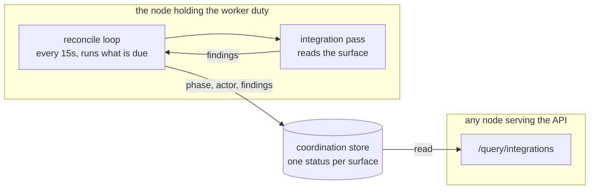

# Integration Reconcile

Every integration can break quietly. A seat's tracker token gets revoked, an administrator narrows a group's access, somebody deletes a webhook while tidying. Nothing about that is visible from the engine: a webhook that stopped arriving looks exactly like a quiet afternoon, and an agent that hears nothing does nothing, which is what an idle agent looks like too.

The **reconcile loop** (`internal/integration`) is what looks. It runs each configured surface on a cadence, reports what it found in one vocabulary shared by every third-party app, and records the result where the API and dashboard read it.

---

## What a pass reports

A pass produces **findings**, and a finding is one observation that is not "fine". A third-party app says what it found; it does not decide what that means or which of several findings matters most, because those two decisions have to agree across every surface and cannot be checked from inside any one of them.

| Finding | Means |
|---|---|
| `credential_missing` | The block is enabled and the credential its `${VAR}` names resolved to nothing. |
| `credential_rejected` | The credential resolved and the third-party app refused it: a revoked token, a rotated key, an account that lost its access. |
| `approval_required` | A person must install or approve something at the third-party app. |
| `ingress_blocked` | Deliveries cannot reach this engine, and it will not fix itself. |
| `ingress_pending` | The delivery path is not established yet; the next pass tries again. |
| `identity_missing` | A seat has no account at the third-party app yet. |
| `identity_failed` | A seat's account could not be created or its credential was refused. |
| `grant_pending` | The third-party app accepted access and has not applied it yet. Atlassian's directory is the case to picture: an invitation is accepted immediately and the account appears in the organization's directory some time later, so the grant this engine just made reads back as *no such user*. That is a wait, not a failure — reported as one, it sent operators looking for a broken organization key while the invite was in flight. |
| `unknown_tier` | The company document names something the third-party app does not have. |
| `grant_short` | A seat holds less access than its role asks for. |
| `grant_excess` | A seat holds **more** access than its role asks for. |
| `registration_orphaned` | Something this engine registered at the third-party app that it no longer manages, because the name it is held under changed. Datadog's webhook definition is the case: it is addressed by NAME, that name is also the handle a monitor writes, and Datadog serves no listing — so the previous definition goes on delivering correctly for every monitor still naming it, and nothing could ever find it again. Reported rather than removed, because removing it would silence exactly those monitors. |

Those findings fold into one **report**, which is what an operator reads:

- **`phase`** is where the integration got to: `disconnecting`, `unconfigured`, `awaiting_admin`, `provisioning`, `activating`, `degraded` or `ready`.
- **`actor`** is who has to act for the phase to end: nobody, the `engine`, the `provider`, an `admin` (a person, at the third-party app), or the `operator` (a person, in this deployment's own config).
- **`detail`** is one sentence naming what is outstanding, and **`action_url`** is where the person named by `actor` goes to do it. Both are filled only when a person owes something.

### The advisories are always last

Two findings have a verdict of **ready**: `grant_excess` and `registration_orphaned`. Everything below is about the first, and applies to both.

`grant_excess` is the older of the two. The engine did not grant that access and cannot revoke it: it comes from the operator's own scheme, usually inherited from a parent group or a second role. Agents keep working, so the integration is ready with a note rather than blocked.

That makes its rank load-bearing. Anything the advisory outranks disappears from the report entirely, so it is ranked below every real problem. The control plane this was ported from wrote one classifier per integration and three of them returned the advisory early, which hid a short grant, a failed agent, and a webhook that reached nobody. The ordering now lives in one place with a test that pins it.

---

## The cadence follows who has to act

Not what failed. A third-party app applying a grant it already accepted finishes in seconds; a person told to install an app is usually installing it as they read; a `${VAR}` nobody set will still be unset in an hour. One retry interval would be wrong for all three.

| The report says | Next pass |
|---|---|
| `ready` | 10 minutes |
| the `engine` or the `provider` is working | 30 seconds, doubling to 5 minutes |
| an `admin` must act at the third-party app | 15 seconds, doubling to 10 minutes |
| the `operator` must edit config | 1 hour, flat |

The brisk admin cadence is the point of the whole design: install the app, and provisioning continues without you pressing anything. The flat operator cadence is the opposite case, because nothing at the third-party app will ever change a variable this deployment did not set, so backing off buys nothing and asking often only spends requests.

**An applied revision ignores all of it and reconciles now.** Every interval above is a wait for asking a *third-party app* again. A configuration change is the answer changing *here*, so it marks every surface due and brings the tick forward instead of waiting out the cadence: save the setup dialog and the pass runs within about a second, not at the end of whatever wait the last report earned. One operator action is one pass, because the dialog writes one request per surface (saving Atlassian applies three revisions in a row) and the applies inside a short window fold into a single tick.

**Slack is not on this cadence, because it is not reconciled at all.** Its apps are created from the command line — one per agent, from a manifest — so there is nothing here to converge: it is registered teardown-only, which gives a disconnect somewhere to run without giving the loop a pass to run. It carries no reconcile report, and its row holds only the address its setup form was saved against (below) — a row that now *ends* when the `slack:` block leaves the document. It used to outlive it for the life of the deployment, because the only thing that forgets a departed surface is a pass reporting `ErrNotConfigured` and Slack has no pass; a company that removed and later re-added the block inherited an address from before. Slack is the one surface the loop asks the document about directly, precisely because it is the one with nothing to ask.

A surface *can* be given a settled interval of its own, for a third-party app whose reads are rate limited hard enough that the shared ten minutes would be spent waiting. No surface in this build sets one.

---

## When the deployment's address moves

Every registration a third-party app holds points at `integrations.public_base_url` as it was when the registration was made, and that value moves: a tunnel restarts, a deployment is renamed, a proxy goes in front.

Where a pass registers the hook, the next tick registers it again at the new address and the surface heals itself. Jira and Confluence match their own hook **by name**, so the address is a field they rewrite; GitLab and GitHub match **by delivery URL**, so they create one at the new address and leave the old one behind, which is debris rather than an outage.

Where nothing registers the hook, nothing heals. Slack's request URL lives in each agent's app at Slack and can only be read back with an app-configuration token an operator may not have, so the engine cannot see that it is stale, cannot fix it, and the app goes on delivering to an address that no longer answers. And nothing reconciles Slack at all, so the surface reports **no phase** — the dashboard draws that as *Connecting*, which is what it means for a configured block the loop has not reported on — and the first symptom is an agent that stopped replying.

So the address is **recorded and compared**. Every pass stamps the base it ran against onto the surface's status row, and a surface no pass converges is stamped when its setup form is saved. A row whose recorded address is not the one in force is an **ingress fault**: the card reads *Action needed*, the surface carries an `address moved` badge, and the note names both addresses, because the fix is to replace one with the other at the third-party app and a badge cannot say that.

It clears itself where it should. A surface with a pass is re-stamped on the next tick, so the warning appears only where a person really does have to act. A surface nothing has recorded an address for reports `null` rather than `false`: "nothing here can say" is not the claim "the address moved", and a fresh company must not open with a warning on every card.

---

## A fleet singleton

The loop is a **worker duty**, claimed per tick like the retention sweep and the sandbox waiter, so exactly one node runs it at a time. Here that is correctness rather than economy: two nodes reconciling one surface at the same moment both read a third-party app that has no account for a seat, and both create one. The third-party app ends up with two identities for one agent, and no later pass can detect or repair that.

Three separate things stop a node running it, and a reader debugging *"why is nothing being reconciled"* needs all three:

- **`node.roles` excludes `workers`** — the node never claims the duty at all.
- **The coordination store cannot say** whether this node holds it — treated as **not held**, because entering the two-nodes case on a store blip is exactly what the singleton exists to rule out.
- **This node's [config posture](control-plane.md) is `shed` or `stuck`** — it declines, and does so *before* claiming, so its lease lapses and a peer on the current revision takes the loop over. Every reconciler reads the live company document, so a node the fleet has moved past would converge a third-party app to a revision that has been replaced. This is the only one of the three that says so in the log: `integration_reconcile_shed` going in, `integration_reconcile_resumed` coming out, once per transition rather than once per tick.

**The duty outlives one pass, deliberately.** Its TTL is derived from the deadline a single pass may take rather than from the tick interval, because a pass is allowed minutes and a tick is fifteen seconds: a short TTL lapsed mid-sweep, a peer claimed it, and both nodes swept the surfaces the other had not reached. Nothing unsafe followed — the *surface's* own lease is what stops two writers at one third-party app — but the sweep stopped being deterministic. The cost is on the other side and is worth knowing: a node that dies holding the duty leaves it unclaimable for that long rather than for three ticks.

The status itself lives on the **coordination store**, not in the node's own database, because the node that reads it is usually not the node that wrote it: `-roles ingress` puts the API and the seats on separate hosts on purpose.



---

## What the loop does, and what it leaves alone

**It does not tear anything down.** Removing an integration block from the company document says what the engine should stop talking to. It does not say that fifteen service accounts, and everything attributable to them, should be destroyed. A removed block makes the loop forget the surface's status and nothing else; decommissioning stays an explicit flag on the third-party app's own subcommand, where you type it and read what it is about to delete.

**It does not rotate a credential that works.** A third-party app serves a token once, so the tempting reading of "reconcile" is to mint every pass, and that is an outage on a timer: the engine is authenticating with the old value, and rotating revokes what every running agent is using. Rotation is a flag on the subcommand.

**It registers webhooks, and it creates the accounts.** The loop runs each third-party app's pass with the sink and the public base URL supplied, so a pass mints a signing secret when the config's `${VAR}` resolves to nothing, creates or updates the hook, and creates the service account each seat acts as.

That is a reversal, and the reason is what connecting an integration means. The loop used to withhold both, on the reasoning that a webhook base is permission to register a hook and a sink is permission to mint a credential, and neither is a decision a timer gets to make. What that produced was an integration nobody could finish from the dashboard: a person connected an app, the loop reported it incomplete forever, and finishing it meant pressing a second button whose whole content was "yes, I meant it". Connecting **is** the permission. It is an explicit act, by a person, naming one third-party app, and the credential it hands over is an administrator's, given for exactly this.

**It still does not tear anything down on its own, and it still does not rotate a credential that works** (above). Provisioning converges towards the company's seats: an account that should exist is created, and one that should not is left alone until somebody disconnects the integration, which is the explicit act on the other end.

**A pass that seals a credential re-activates the revision.** `${VAR}` resolves from a snapshot taken at apply time — that is what keeps the secret store off the path of every config read — so a pass that mints a seat's token lands in a company where everything reading that token already resolved it, to nothing, at the last apply. Refreshing the snapshot fixes the *next* read, and for the seat identities, parsers, transports, provider clients and MCP children there is no next read: each is built by the apply and by nothing else. So the pass makes one, through the control plane's own [rotation gesture](control-plane.md#rotation) — re-activating the current revision unchanged, which every node is already watching.

Measured, before it did: connecting Atlassian created an agent's Jira account and sealed its API token, the reconcile reported the surface ready from its own check, and Jira's live routing held zero seat identities — resolved minutes earlier against a token that did not exist yet. Every issue naming that agent fell through to its project's lead, indefinitely, while the card said the integration was fine. On a node with no config surface — a worker-only one — the values are still sealed and the rebuild is logged as outstanding, naming `POST /config/reload`.

**Re-activations are coalesced into one apply per 15 seconds**, and both halves of that matter. Connecting a third-party app is a **burst**: the setup dialog writes one request per surface, and Atlassian's alone applies three revisions in a row — so an apply per seal turns one button press into several whole-company rebuilds and several permanent config revisions. The first request in a quiet period still runs immediately, because somebody pressed Connect and is watching; the ones behind it fold into a single run at the end of the window. Nothing is dropped — a skipped rebuild is exactly the state this mechanism exists to prevent.

> **The bound is not optional, and believing it was is what made an incident worse.** This used to argue it could not loop, because only a real write triggers it and every reconciler is [certified](#adding-a-surface-to-the-loop) against "a converged pass writes nothing". That is an argument about a *converged* world, and a pass that can never converge writes on every tick by construction. One did: GitLab created a service account with an address that could not be confirmed, GitLab refused its tokens, the pass read the refusal as a stale credential and minted another. At the reconcile cadence that was a slow leak; behind an apply that wakes the pass which caused it, it ran every five seconds and left 144 live year-long `api`-scoped tokens from a single connect. [That vendor fault is fixed where it lives](../integrations/gitlab.md#provisioning) — this is what stops the next one being amplified.

**A pass also re-resolves this node's own seat identities.** A tracker or code-host webhook names people by *account*, and nothing in the org model says which account a seat holds — so the engine asks, with that seat's own credential, and registers whatever answers. That lookup happens during an apply, and a seat whose lookup failed used to stay unresolved until the next one: nothing schedules an apply, so a failure that cleared itself a second later persisted until somebody edited something unrelated. Measured: a seat's token was created and sealed, the tracker checked it one second afterwards, the account was not grantable yet and answered `403` — and the surface held zero seat identities with every card reading Connected, still not having asked again two minutes later.

So each visit re-resolves before it reports, and a seat still holding no account is an `identity_missing` finding. That is one change doing two jobs: the surface stops classifying `ready` over an agent that receives nothing, and because it is no longer ready the loop keeps visiting it on the **engine's** cadence — 30 seconds doubling to 5 minutes, which is exactly the shape of a lookup that will probably succeed shortly. A seat that resolves is registered into the **live** registry and starts receiving work immediately, with no config change and nothing for an operator to press. A seat holding no credential at all is never reported: it has opted out of the surface, and listing it would put every human seat on the card.

**A person can still ask for a pass.** `POST /setup/integrations/{kind}/provision` runs the same function on demand, under the same guard, and folds its outcome into this same status. That guard is one thing, not two: a surface's own lease **plus** an in-process claim, taken by the operator's pass, by the loop's tick and by a disconnect's teardown alike. Both halves are needed — a lease claim by an owner that already holds it doubles as a renew, so two goroutines in one process would both be told yes, and a single-node install has no lease at all — and with them, two writers at one third-party app never overlap.

**And it is held across the write that records the pass, not only across the pass.** That is the half that was missing, and "taken first" was satisfied without it. Each writer took the guard, ran its pass, released it, and only then folded the outcome into a status row it had read *before the pass began* — so a disconnect an operator pressed in that window was silently overwritten by the loop's own tick, the card went from *Disconnecting* back to *Connected*, and they pressed the button again. The guard now spans the row re-read, the pass and the write, and the decision of *what to do* — converge or tear down — is made from the re-read row, so a disconnect arriving a moment earlier is answered by a teardown rather than by a converge pass that finds the block still present, converges the surface and reports it healthy.

**The pass is bounded inside its own lease.** The lease is taken once and never renewed, so work that outlived it would go on creating accounts with nothing left excluding a peer — the two-identities-for-one-seat case again, arriving by the clock instead of by a missing lock. `internal/setup` holds the two values together: a pass is cut off strictly before the lease expires, and the margin between them is what the status write runs in. Nothing in the dashboard calls it any more, because there is nothing left for it to grant: it is there for an operator who wants a pass to run now rather than at the next tick. See [Setting an integration up](../reference/api-endpoints.md#running-the-provisioning-pass).

---

## Reading the status

Every row of the `integrations` question carries a `reconcile` object, or `null`.

```
GET /query/integrations
```

```json
{
  "key": "jira",
  "configured": true,
  "enabled": true,
  "routes": true,
  "reconcile": {
    "phase": "degraded",
    "phase_label": "needs attention",
    "actor": "admin",
    "detail": "swe has no Jira account, so no issue reaches it: no credential under mcp_env.atlassian",
    "action_url": "",
    "outcome": "blocked",
    "attempts": 3,
    "last_error": "",
    "last_attempt_at": "2026-03-01T12:00:00Z",
    "settled_at": "2026-03-01T09:14:00Z",
    "next_attempt_at": "2026-03-01T13:00:00Z",
    "findings": [
      { "kind": "identity_failed", "subject": "swe", "detail": "...", "action_url": "" }
    ]
  }
}
```

`reconcile` is **three-valued**, like `routes` and `secret_usable` beside it:

- **`null`** means this process cannot say. A standalone API has no loop to ask, and reporting that as "nothing has been reconciled" would put an alarming claim on a screen that had simply asked the wrong node. A surface the loop has not reached yet is also `null`.
- An object is a real finding.

The **findings list travels as well as the report**, because the two answer different questions. The report says what to do next; the findings say what is actually wrong. A company with a broken webhook and four under-granted seats reports the webhook, and an operator who fixes it should not have to wait a full pass to discover there were four more things behind it.

`phase_label` is the same phase in the words a person reads, derived **once, in the engine**, so a client never has to know what a phase value means. **The words are the control plane's**, so one company reads the same status whichever console it is looking at: backlet's `ReconcilePhase` is this vocabulary under another name, and these are the labels its console renders.

| Phase | Label |
|---|---|
| `ready` | Connected |
| `degraded` | Action required |
| `awaiting_admin` | Action needed |
| `provisioning` | Setting up agents |
| `activating` | Waiting for the provider |
| `unconfigured` | Failed |
| `disconnecting` | Disconnecting |

`unconfigured` reads as **Failed** rather than "not connected" because this phase is only ever reached with a block present: an absent one is `ErrNotConfigured`, and the row is forgotten rather than reported. So what it names is an integration somebody configured whose credential is missing or the third-party app refused, and "not connected" would read as nobody having tried. A phase a newer node wrote is rendered as its own value with the underscores opened up, never guessed at.

One of backlet's phases has no counterpart here, and it is not an omission:

- `disconnected` is a tenant who has not connected an integration yet. Here that is a company document with no block, so there is no row and no phase. The screen shows **no status badge at all**, only a Connect button. A tool nobody has configured has nothing to report.

`disconnecting` is a phase this engine does have, and it sorts **first**, so it wins a tool row's tag over every other surface: disconnect asks the third-party app to remove what the engine registered there before the block leaves the document, so a surface sits in `disconnecting` for as long as that takes and reports it if it fails. Nothing about a surface that is going away is worth reporting over the fact that it is going away.

Two labels the dashboard adds for situations that are not phases: **Connecting**, for a block that is configured and that the loop has not reported on yet, which is the window of one reconcile interval after somebody connects, and **Paused**, for one whose surfaces are all disabled. Neither claims the integration works, which is the distinction the whole screen turns on.

**On the dashboard** the Integrations screen shows one row per *tool*, not per surface: Atlassian is one row over the Jira, Confluence and Forge relay surfaces. A row's tag is the least ready phase among its surfaces, ordered by `Phases` above, so an `activating` surface outranks a `degraded` one (a degraded integration is still working; one still coming up is not) and a phase the dashboard build does not know sits between the two, never presented as ready and never masking a phase it does know.

The status line under the name is that surface's `detail`, prefixed with the surface's name when the tool has more than one, so "Jira: swe has no Jira account" reads on the Atlassian row. **A `ready` phase does not silence a broken ingress.** The loop says nothing about deliveries at all (see above), while `secret_usable` and `routes` are computed from what the process resolved and which parsers registered, so the three answer different questions: a tool whose phase is `ready` and whose webhook secret did not resolve is tagged `ready` and still carries the line that says every delivery is refused. What the line is *drawn* as follows the `actor`, not the phase: amber and an alert icon only where a person owes the next step (`admin` or `operator`) or where ingress is broken, because nothing the engine or a third-party app is doing needs a person told about it.

Everything else in the object above, the actor, the link, the fault, the findings the phase was not derived from, sits under the row's **Details** disclosure, per surface, beside that surface's inbound counts and path.

`last_error` is a **fault**, not a finding: the engine or the third-party app failing to look at the world at all, rather than a statement about it. A pass that fails drops the previous pass's findings rather than leaving them standing under a fresh timestamp, because a pass that failed did not observe anything.

A fault is normally reported as `activating`, owned by the engine, because almost every fault is a third-party app briefly unreachable and the next pass clears it. **One fault is not a wait.** When the third-party app answers `401` or `403`, it did look, and it refused the credential: every later pass is refused identically until a person changes it. That is reported as `credential_rejected`, which makes the surface `unconfigured` and the operator's to fix, so nobody is left watching a retry that cannot succeed. Rate limits, timeouts, `404`s and `5xx`es stay waits.

---

## Adding a surface to the loop

A third-party app contributes one method:

```go
type Reconciler interface {
    Kind() Kind
    Reconcile(ctx context.Context) ([]Finding, error)
}
```

and is registered in `internal/engine/integrations.go`. Findings and errors are different answers and must not be collapsed: findings are statements about your world, and an error is a failure to read it.

Every implementation is certified against **one suite**, `internal/integration/integrationtest`, in the same tradition as `queuetest` and `coordtest`. Each third-party app's package holds its own harness, which stands its world up already converged — every seat has its account, every credential works, every webhook points at the address in force — and then counts what the pass writes into it.

Its load-bearing case is that **a pass over a converged world writes nothing**, because that is the clause most likely to be wrong and the one whose failure is a credential rotated every ten minutes for ever. A write here means anything a person would have to undo, which is wider than a request to the third-party app — a pass that re-seals a seat's credential into this deployment's own sealed store on every run is writing too — and narrower than a non-`GET`, because some third-party apps model a listing as a `POST` and a counter keyed on the method would make the clause impossible to satisfy. Count by route.

That clause is what makes "safe to leave switched on" a fact rather than an intention, and it was not one for a while: the suite existed, was believed, and was pointed only at a stub, while three of the seven reconcilers wrote at their third-party app on every single pass. The fix in each case was to **read the current state and write only on a real difference** — never to soften the clause, which is the pressure a suite like this has to be able to resist.
