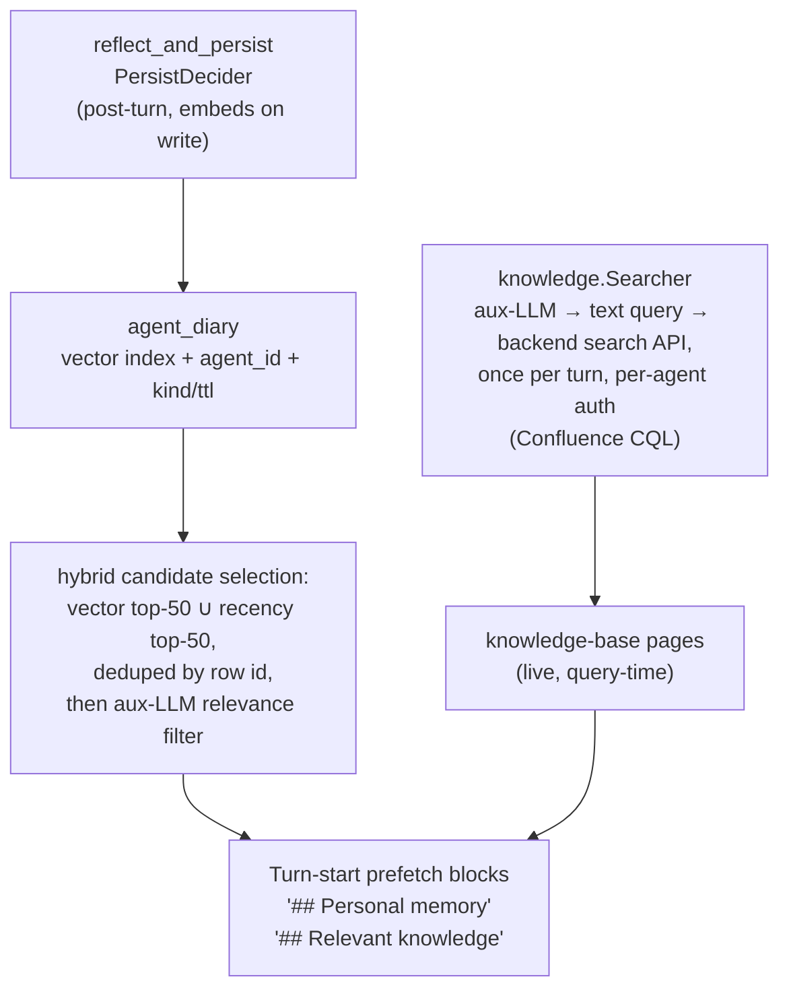

# Knowledge System

The knowledge system (`internal/knowledge`) is the read path agents use to find context they don't already have in their system prompt. It is two purpose-specific reads composed into the agent runtime:

- **Shared knowledge** — the team knowledge base, searched live at query time. There is no synced local copy. The knowledge base is a single backend — [Confluence](../integrations/confluence.md) pages — behind a seam that keeps it swappable: a `knowledge.Searcher` translates the turn's trigger into a plain-text search query (once per turn, via the auxiliary LLM) and runs it against the backend's own search API, authenticating as the agent's own user so the backend enforces its page permissions natively.
- **`agent_diary`** (vector-indexed) — the agent's private observation log. One row per declarative fact the agent captured for itself via `reflect_and_persist` (or that the post-turn `PersistDecider` saved on its behalf), scoped to the agent's id. Rows are embedded on write; the `## Personal memory` prefetch picks candidates via a **hybrid selection** — the union of a vector top-K (semantic matches to the trigger) and a recency top-K (broadly-applicable operational rules that may not be a topical match), deduped by row id (the two halves are 50 each, so the union is the bound), then handed to an aux-LLM relevance filter.

There is no shared vector index and no scope ladder for shared docs — no synced local copy of the knowledge base exists anywhere in the engine. Shared knowledge is read straight from the backend on demand, so there is no sync worker to run, no index to keep fresh, and no staleness window.

---

## Data flow



The two reads are independent: the diary is read by hybrid candidate selection (vector top-K ∪ recency top-K → aux-LLM relevance filter), scoped to the calling agent; the knowledge base is searched live, scoped by the company's read scope. Neither depends on the other, and each renders into its own block of the executor's prompt.

---

## The knowledge.Searcher seam

`internal/knowledge` defines the one seam between the agent runtime and the knowledge backend:

```go
type Hit struct {
    Title     string
    URL       string   // shareable human link; "" when unbuildable
    Container string   // Confluence space key
    PageID    string
    Snippet   string   // plain text, <= 200 chars; may be ""
    Ancestors []string // ancestor page titles, outermost first
}

type Query struct {
    Text             string            // plain language, never a CQL fragment
    Seat             *org.Role         // whose credential the search runs as
    Org              *org.Organization // supplies the read scope, per call
    Limit            int               // 0 takes DefaultLimit (8)
    ExcludeAncestors []string          // nil takes the auto-draft default
}

type Searcher interface {
    // Backend names the integration answering, for logs and for the
    // operator surface that reports which one a company wired.
    Backend() string

    // CanSearch is the cheap, no-I/O pre-gate.
    CanSearch(seat *org.Role, o *org.Organization) bool

    // Search returns up to Query.Limit ranked hits. It never reports an
    // error: every failure path is an empty result.
    Search(ctx context.Context, q Query) []Hit
}
```

Contract semantics every backend honors:

- **Scope lives behind the seam.** `Search` derives its container scope from the organization ([`knowledge.confluence_spaces`](#accessible-containers), normalised by `knowledge.Scope`); callers pass a seat, a plain-text query, and ancestor-title exclusions, never CQL fragments, space keys, or project lists. Because the organization is a per-call parameter, live config edits to the `knowledge.*` scope flow through with no engine refresh hook.
- **Unscoped-vs-nothing is enforced inside `Search`**: empty scope + a self-authenticating role ⇒ unscoped search (the backend's own ACLs bound the hits); empty scope + a credential-less role ⇒ no results.
- **`CanSearch` is a cheap, no-I/O pre-gate** — "could a search possibly hit anything?" Its only job is letting the [relevant-knowledge prefetch](#relevant-knowledge-prefetch) skip the aux-LLM query-generation call when the search is a guaranteed no-op.
- **Best-effort**: `Search` never reports an error; every failure path returns no hits and the prompt block renders empty.
- **`Query.ExcludeAncestors`** drops hits whose ancestor/parent chain matches any listed title. Left nil it takes the default, `"Auto-Drafted Skills"` (`knowledge.AutoDraftedParent`), so unreviewed [promotion drafts](agent-learning.md) never surface before a lead publishes them; an empty, non-nil list disables the exclusion. Every draft title also carries the `[Auto-draft] ` prefix (`knowledge.AutoDraftTitlePrefix`) as a fail-closed backstop for a backend whose parent lookup fails.

**Selection is by integration presence, and single-homed.** The engine holds exactly one searcher: the Confluence searcher when `integrations.confluence` is configured. One knowledge home is what makes the turn-start prefetch and the `search_knowledge` builtin agree with each other, and with the skill-promotion pass that drafts into the same backend, about what the company knows: two searchers would make an agent's answer depend on which was asked, and neither would be wrong. With no backend configured, `Engine.Knowledge` answers nil, the `## Relevant knowledge` block renders empty and `search_knowledge` says the knowledge base is not searchable. Every apply reconciles the Confluence integration against the new revision and replaces or removes the searcher, and each consumer reads the current one when it runs, so there is no re-pointing step.

**The seam stays an interface with one implementation, deliberately.** `knowledge.Searcher` is declared by its consumers (the prefetch and the `search_knowledge` builtin) so a second backend is a new implementation rather than a rewrite of everything that searches. A seam collapsed into its last backend is what makes the next one a rewrite.

### Confluence backend — the Confluence searcher

`internal/confluence` (`confluence.Searcher`). The query text is wrapped into a Confluence CQL `text ~ "..."` clause (`confluence.BuildCQL`), optionally narrowed by `space IN (...)` from the [read scope](#accessible-containers), and run against the Confluence REST API (`/rest/api/content/search`), so Confluence's own search backend does the matching and the relevance ranking. Authentication is **as the agent's own Atlassian user**, using the seat's Confluence credential from its `mcp_env` (the `atlassian` or `confluence` server entry, read by `atlassian.CredentialOf`, which accepts `CONFLUENCE_API_TOKEN`, `CONFLUENCE_PERSONAL_TOKEN`, `CONFLUENCE_TOKEN` or `ATLASSIAN_API_TOKEN`, and a `JIRA_API_TOKEN` on the shared `atlassian` entry). Confluence enforces its page permissions natively: a restricted page the agent's user cannot see simply doesn't come back, and there is no engine-side restricted-page handling. Seats without their own credential fall back to the **org token** (`integrations.confluence.token`); an agent on the org token sees whatever that account sees, subject to the empty-scope rule below. Hits carry the full ancestor-title chain, so the auto-draft exclusion filters on any depth.

---

## Accessible containers

The search scope is set by **one** thing: the org-wide `knowledge.*` scope list for the active backend, normalised by `knowledge.Scope` (trimmed, uppercased, deduplicated):

```text
knowledge.confluence_spaces: ["HANDBOOK"]   # scoped to these containers
knowledge.confluence_spaces: []             # empty ⇒ unscoped / ACL-bound for
                                            # self-authenticating agents
```

It is **role- and unit-independent** — every agent has the same read scope.

> **Read scope ≠ team identity.** A unit's own container, `integrations.confluence.space` on the unit (runtime `org.Unit.ConfluenceSpace`), is *integration identity*: it decides webhook routing (page activity → the unit lead) and is the team's write / skill-promotion home. It deliberately does **not** narrow reads. An Engineering agent isn't limited to the `ENG` space when searching; it searches across everything its own account can read. (See [Confluence § integration identity](../integrations/confluence.md).)

**The list is optional — and empty is the useful default.** When the scope list is empty, behaviour depends on how the search authenticates (per-agent token vs. engine/admin fallback):

- A role with **its own backend credentials** searches **unscoped**: the container clause is dropped and the backend's own ACLs bound the results — the agent finds anything its account can read that matches the query.
- A **credential-less** role (engine/admin-token fallback) searches **nothing**: an unscoped query would read the shared account's entire view, so the empty list means "no search" rather than "everything".

So set `knowledge.confluence_spaces` only to *narrow* reads to a curated floor (e.g. a company handbook); a fully per-agent-credentialled org leaves it unset and lets the backend's ACLs do the scoping. The backend's own permissions remain the hard boundary regardless.

> **Single-homed.** One backend per company. With one implementation behind the seam that is now structural rather than enforced; what validation still refuses is a read scope naming a backend the company does not configure — `confluence_spaces` without `integrations.confluence` reads as a working narrowing and narrows nothing.

---

## Where content comes from

Shared knowledge **is** the backend — there is no separate engine-managed store to populate. The writers feeding the two reads:

| Writer | Read by | Reach |
|---|---|---|
| Humans + agents via the backend's MCP tools (`confluence_create_page` / `confluence_update_page` / `confluence_add_comment`) | `knowledge.Searcher` (live query) | Whoever the page's backend permissions allow |
| `crewlet confluence import` ([below](#publishing-knowledge-docs)) | `knowledge.Searcher` (live query) | Same |
| Agents via `reflect_and_persist` (in-flight) and `PersistDecider` (post-turn) | `agent_diary` (hybrid vector ∪ recency selection → aux-LLM filter) | The writing agent only |

Static org configuration (mission, vision, policies, role profile, team roster, unit context, integration hints) is a third source, but it is not "knowledge" in the read-path sense: it renders straight into the executor's system prompt via the section builders in `internal/agent/prompts`. There is no startup seed step and no reconcile pass, because the prompt **is** the configuration. Documents that change frequently (procedures, ADRs, runbooks) live in the knowledge base, where humans and agents already author them.

---

## Publishing knowledge docs

Most shared knowledge is authored directly in the backend by humans and agents. For docs an operator wants to keep in version control — onboarding pages, runbooks, playbooks — the import CLI publishes local markdown:

```
crewlet confluence import <company.yaml> <directory>
```

The first positional argument is the **Tier B company YAML** (the importer reads the backend credentials from its `integrations.confluence` block); the second is the directory to publish, walked recursively, with dot-directories skipped. The importer routes each `.md` file by frontmatter: a file with a `trigger:` is a [Tool Skill](tool-skills.md) (published to the Tool Skills container); **every other file is a knowledge doc.**

Knowledge docs follow a **directory-based convention** — the files are pure prose, no frontmatter required:

- **Container = the file's immediate parent directory name.** A file at `<root>/ENG/onboarding.md` publishes to Confluence space `ENG`.
- **Title = the file's first `# H1` heading.** That H1 line is stripped from the published body (the backend shows the page title separately, so leaving it would duplicate the title on the page).

`examples/nimbus-docs/` is a worked set of these: the pages the Nimbus
example company publishes. `examples/nimbus.company.yaml` carries the
`integrations.confluence` block the importer reads its credentials from, so it is the
positional argument as it ships. (The smaller
`examples/nimbus-claude-cli.company.yaml` has no wiki at all; add a block
per [Confluence](../integrations/confluence.md) first.)

```
examples/nimbus-docs/
├── ENG/
│   └── Onboarding.md          → space ENG,  title "Onboarding"
├── LEAD/
│   ├── Onboarding.md          → space LEAD, title "Onboarding"
│   ├── Repo Ownership.md      → space LEAD, title "Repo Ownership"
│   └── Manager 1-1.md         → space LEAD, title "Manager 1:1"
└── PROD/
    └── Onboarding.md          → space PROD, title "Onboarding"
```

```markdown
# Onboarding

## Who is here
...
```

Optional frontmatter is supported **only for overrides** — a plain-prose doc needs none of it:

| Field | Required | Description |
|---|---|---|
| `title` | no | Overrides the H1 as the page title. (Onboarding pages must be titled exactly `Onboarding` — see the [onboarding convention](organization-model.md#onboarding-convention); name the file `Onboarding.md` and that falls out of the H1 automatically.) |
| `space` | no | Overrides the container for a doc that lives somewhere the tree cannot express. |
| `parent` | no | The title of a page in the same space to nest this one under. The plan is ordered parents-first, so a parent published by the **same run** resolves; a `parent:` cycle stops the walk naming the files. A parent nobody publishes is a note and a page at the space root — a doc nobody can read is worse than a doc in the wrong place. An *existing* page is **never re-parented**: where a page sits is something people move deliberately, and a run that dragged it back every time would be fighting them with no way to say so. |
| `labels` | no | The author's own page labels, lower-cased and de-duplicated because that is what Confluence stores and answers with. Attached on every run, not only on create; a label that will not attach is a note, not a page failure. |

A doc with neither a frontmatter `title:` nor an `# H1` has no determinable title and **stops the walk** naming the fix. So do two files that would publish as the same page. Both are things an operator corrects in their editor, and a run that skipped them would report success with a doc silently unpublished.

Key properties:

- **Clean prose.** Knowledge-doc pages render the markdown body straight to the backend's page format (Confluence storage XHTML) — no YAML metadata box on the page (unlike skill pages, which carry a binding-metadata code block the engine parses back out).
- **Idempotent, and always a write.** A page that exists is updated in place. This is a publisher, and skipping existing pages would mean an edited file never reaching the backend. `-dry-run` previews without page writes. The match key is `(space, title)`. The importer never creates its container: a missing space fails before a single page is written, naming the space to create.
- **Searched live, not registered.** Knowledge docs are read on demand through the query-time `## Relevant knowledge` search — they are **not** loaded into any in-memory registry, so there is nothing to resync (`crewlet confluence resync` is skills-only).

---

## Wiring it up

There is no orchestrator object to construct. The two reads are wired independently by engine start:

- **The `knowledge.Searcher`** is constructed from the configured knowledge integration: the Confluence searcher for `integrations.confluence` (see [the seam](#the-knowledgesearcher-seam)). It needs the backend connection; the prefetch that calls it needs an auxiliary model for query generation. It does **not** need a store or an embeddings provider. Without the integration, the `## Relevant knowledge` block stays empty.
- **`learning.Diary`** is built over the node's store (`learning.NewDiary`), so a node with no store has no diary and the `## Personal memory` block stays empty without error. Writes are embedded when `providers.embeddings` is configured; without it the diary degrades to a pure recency list (vector candidate selection becomes a no-op) but writes and recency reads still work.

The two are independent: an org can have knowledge search without reflection, or reflection without knowledge search.

---

## Relevant-knowledge prefetch

Beyond agents calling the backend's search tools directly, the executor's prompt carries a `## Relevant knowledge` block that pre-runs a knowledge-base search for the seat. Once per turn, the auxiliary LLM generates a short plain-text search query from the trigger context, the searcher runs it live (scoped to the role's accessible containers), and the executor sees title + snippet bullets without having to think to call a tool. When the block is thin — a pointer trigger gates the search off — the executor searches the same seam itself with the `search_knowledge` builtin, once it knows what the task actually needs. The `CanSearch` pre-gate skips the aux-LLM call entirely when a search could not return anything. Because the search runs as the agent's own backend user, restricted pages the agent cannot see never appear — there is no draft-page or restriction filter to apply engine-side.

Full page bodies open via the backend's page-read MCP tool; further searches via its search MCP tool (`confluence_get_page` / `confluence_search`).

See [Agent Learning § Relevant-knowledge prefetch](agent-learning.md#relevant-knowledge-prefetch) for the design rationale and failure modes.

---

## Onboarding markers

The `mark_onboarded` builtin records that an agent has read its team's Onboarding pages so the onboarding hint stops re-rendering on every turn. Markers live in their own small table, `agent_onboarding_markers`, keyed by `agent_id` with UPSERT semantics (so re-onboarding never accumulates stale rows). The marker carries a `chain_hash` over the agent's org chain (`learning.ChainHash`); a chain change (role moved units, ancestor renamed, new unit inserted) silently invalidates the marker, and the dedicated onboarding pass runs again until the agent re-reads and re-marks. The same row holds the cross-process pass lease that stops two turns onboarding one seat at once.

A dedicated table, because `learning.Onboarding.Onboarded` answers with one indexed equality lookup instead of a per-agent metadata-filter scan.

---

## Configuration

The knowledge system has no YAML configuration block of its own (beyond the `knowledge.*` scope lists). Two upstream configs determine how it behaves:

- **`integrations.confluence`**: required for the `knowledge.Searcher` to read shared knowledge. The query-time search authenticates with each seat's own credential (its `mcp_env` Atlassian or Confluence entry), falling back to the org-level token (`integrations.confluence.token`). Without the integration the `## Relevant knowledge` block stays empty and only the agent's diary contributes.
- **`providers.embeddings`** — required for the diary's vector candidate path (the vector half of the `## Personal memory` prefetch's hybrid selection, plus the diary write-side embedding step) **and** for `episodes` vector recall in the learning subsystem (`query_episodes` and the `## Similar prior work` prefetch). Knowledge search does **not** use embeddings. Without an embeddings provider the diary degrades to its recency-only path (still functional, just without semantic candidate matching) and episodic recall is disabled.

See [Configuration](../getting-started/configuration.md) for the full YAML shape, [Confluence integration](../integrations/confluence.md) for setup, and [Agent Learning](agent-learning.md) for diary mechanics.
