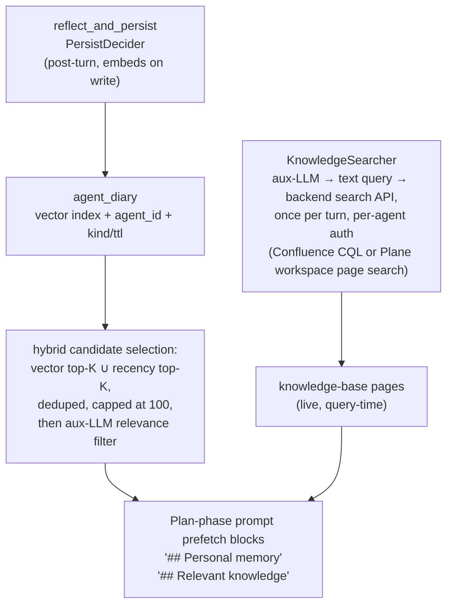

# Knowledge System

The knowledge system (`crewlet.knowledge`) is the read path agents use to find context they don't already have in their system prompt. It is two purpose-specific reads composed into the agent runtime:

- **Shared knowledge** — the team knowledge base, searched live at query time. There is no synced local copy. The knowledge base is **one** of two backends — Confluence or [Plane](../integrations/plane.md) pages — behind a single seam: a `KnowledgeSearcher` translates the turn's trigger into a plain-text search query (once per turn, via the auxiliary LLM) and runs it against the backend's own search API, authenticating as the agent's own user so the backend enforces its page permissions natively.
- **`agent_diary`** (vector-indexed) — the agent's private observation log. One row per declarative fact the agent captured for itself via `reflect_and_persist` (or that the post-turn `PersistDecider` saved on its behalf), scoped to the agent's id. Rows are embedded on write; the `## Personal memory` prefetch picks candidates via a **hybrid selection** — the union of a vector top-K (semantic matches to the trigger) and a recency top-K (broadly-applicable operational rules that may not be a topical match), deduped by row id and capped at 100, then handed to an aux-LLM relevance filter.

There is no shared vector index and no scope ladder for shared docs — no synced local copy of the knowledge base exists anywhere in the engine. Shared knowledge is read straight from the backend on demand, so there is no sync worker to run, no index to keep fresh, and no staleness window.

---

## Data flow



The two reads are independent: the diary is read by hybrid candidate selection (vector top-K ∪ recency top-K → aux-LLM relevance filter), scoped to the calling agent; the knowledge base is searched live, scoped to the role's accessible containers. Neither depends on the other, and each renders into its own Plan-phase prompt block.

---

## The KnowledgeSearcher seam

`internal/knowledge` defines the one seam between the agent runtime and the knowledge backend:

```go
type Hit struct {
    Title     string
    URL       string   // shareable human link; "" when unbuildable
    Container string   // Confluence space key / Plane project identifier
    PageID    string
    Snippet   string   // plain text, <= 200 chars; may be ""
    Ancestors []string // ancestor page titles, outermost first; nil on Plane
}

type Searcher interface {
    // Backend names the integration answering, for logs and for the
    // operator surface that reports which one a company wired.
    Backend() string

    // CanSearch is the cheap, no-I/O pre-gate.
    CanSearch(seat *org.Role, o *org.Organization) bool

    // Search returns up to Query.Limit ranked hits. It never reports an
    // error: every failure path is an empty result.
    Search(ctx context.Context, q Query) []Hit
}
```

Contract semantics every backend honors:

- **Scope lives behind the seam.** `Search` derives its container scope from the organization ([`accessible_spaces` / `accessible_projects`](#accessible-containers)); callers pass a role, a plain-text query, and ancestor-title exclusions — never CQL fragments, space keys, or project lists. Because the organization is a per-call parameter, live config edits to the `knowledge.*` scope flow through with no engine refresh hook.
- **Unscoped-vs-nothing is enforced inside `Search`**: empty scope + a self-authenticating role ⇒ unscoped search (the backend's own ACLs bound the hits); empty scope + a credential-less role ⇒ no results.
- **`CanSearch` is a cheap, no-I/O pre-gate** — "could a search possibly hit anything?" Its only job is letting the [relevant-knowledge prefetch](#relevant-knowledge-prefetch) skip the aux-LLM query-generation call when the search is a guaranteed no-op.
- **Best-effort**: `Search` never reports an error; every failure path returns no hits and the prompt block renders empty.
- **`Query.ExcludeAncestors`** drops hits whose ancestor/parent chain matches any listed title. The prefetch defaults it to `["Auto-Drafted Skills"]` (`AUTO_DRAFTED_PARENT` in `internal/knowledge/knowledge.go`) so unreviewed [promotion drafts](agent-learning.md) never surface before a lead publishes them.

**Selection is by integration presence, and single-homed.** Engine start constructs exactly one searcher: `ConfluenceSearcher` when `confluence` is configured, `PlaneSearcher` when an enabled `integrations.plane` is — config validation rejects both at once, so the Plan-phase prefetch, onboarding hints, and skill promotion always share one knowledge home. With neither, the searcher stays unwired and the `## Relevant knowledge` block renders empty. A live config change that rebuilds or removes a transport re-points the running `TurnEngine` at the new searcher (or at none) via `set_knowledge_searcher`.

### Confluence backend — `ConfluenceSearcher`

`crewlet.knowledge.confluence_search`. The query text is wrapped into a Confluence CQL `text ~ "..."` clause, optionally narrowed by `space IN (...)` from [accessible spaces](#accessible-containers), and run against the Confluence REST API (`/rest/api/content/search`) — Confluence's own search backend does the matching and the relevance ranking. Authentication is **as the agent's own Atlassian user**, using the per-agent token already configured for direct Confluence MCP calls in `role.mcp_env["atlassian"]` (Cloud: `CONFLUENCE_USERNAME` + `CONFLUENCE_API_TOKEN`; Data Center: `CONFLUENCE_PERSONAL_TOKEN`). Confluence enforces its page permissions natively — a restricted page the agent's user cannot see simply doesn't come back; there is no engine-side restricted-page handling. Roles without a per-agent token fall back to the **org admin token** (`confluence.token`); an agent on the admin token sees whatever that account sees. Hits carry the full ancestor-title chain, so the auto-draft exclusion filters on any depth.

### Plane backend — `PlaneSearcher`

`crewlet.knowledge.plane_search`. The query goes to the [fork's workspace page-search endpoint](../integrations/plane.md#the-fork), which tokenises it server-side — AND across whitespace-split tokens against page name and stripped body text. Because that is a **strict conjunction**, a many-keyword query over a modest corpus easily matches nothing even when its leading terms name the right document — so on zero hits the searcher **relaxes**: full token list first, then the 4-token and 2-token leading prefixes (at most three requests), stopping at the first non-empty result set; queries are also pre-trimmed to the server's 16-distinct-token cap, which it otherwise rejects with a 400. Authentication mirrors Confluence: the agent's own `mcp_env.plane.PLANE_API_KEY` when present — Plane then enforces **project membership** and page access natively — falling back to the engine's `integrations.plane.token` read client. Backend differences that matter:

- **Ranking is recency, not relevance** — the fork's page search orders by `-updated_at`. The most recently edited match wins, not the best match.
- **Membership is a hard precondition**: every seat must be a member of every project in `knowledge.plane_projects` (or of whatever projects its unscoped search should reach), or its search silently returns nothing from them. See [Plane § Knowledge scope](../integrations/plane.md#knowledge-scope).
- **Exclusions are Plane-shaped and fail closed**: the Tool Skills project is dropped from results wholesale, and auto-drafts are hidden by a depth-1 parent-page match (with a `[Auto-draft] ` title-prefix backstop when the parent lookup fails) rather than an ancestor-chain walk. A hit whose project can't be established — no `project_id` on the row, or a configured skills project that won't resolve — is dropped rather than served unchecked — see [Plane § Query-time knowledge search](../integrations/plane.md#query-time-knowledge-search).
- Hits carry no ancestor chain (`ancestors=[]`) and a match snippet built by the server.

---

## Accessible containers

The search scope is set by **one** thing: the org-wide `knowledge.*` scope list for the active backend, normalised once by `internal/knowledge` —

```text
knowledge.plane_projects: ["HANDBOOK"]   # scoped to these containers
knowledge.plane_projects: []             # empty ⇒ unscoped / ACL-bound for
                                         # self-authenticating agents
```

It is **role- and unit-independent** — every agent has the same read scope.

> **Read scope ≠ team identity.** A unit's own container — `integrations.confluence.space` (runtime `OrgUnit.confluence_space`) or `integrations.plane.project` (`OrgUnit.plane_project`) — is *integration identity*: it decides webhook routing (page activity → the unit lead) and is the team's write / skill-promotion home. It deliberately does **not** narrow reads. An Engineering agent isn't limited to the `ENG` space or project when searching; it searches across everything its own account can read. (See [Confluence § integration identity](../integrations/confluence.md) and [Plane § Project identity](../integrations/plane.md#project-identity).)

**The list is optional — and empty is the useful default.** When the scope list is empty, behaviour depends on how the search authenticates (per-agent token vs. engine/admin fallback):

- A role with **its own backend credentials** searches **unscoped**: the container clause is dropped and the backend's own ACLs bound the results — the agent finds anything its account can read that matches the query.
- A **credential-less** role (engine/admin-token fallback) searches **nothing**: an unscoped query would read the shared account's entire view, so the empty list means "no search" rather than "everything".

So set `knowledge.confluence_spaces` / `knowledge.plane_projects` only to *narrow* reads to a curated floor (e.g. a company handbook); a fully per-agent-credentialled org leaves it unset and lets the backend's ACLs do the scoping. The backend's own permissions remain the hard boundary regardless.

> **Single-homed.** The knowledge backend is exclusive: `integrations.confluence` and an enabled `integrations.plane` are mutually exclusive, and a scope list for the disabled backend (`confluence_spaces` with Plane active, `plane_projects` with Confluence active, `plane_projects` without an enabled Plane) is rejected at validation.

---

## Where content comes from

Shared knowledge **is** the backend — there is no separate engine-managed store to populate. The writers feeding the two reads:

| Writer | Read by | Reach |
|---|---|---|
| Humans + agents via the backend's MCP tools (Confluence `confluence_create_page` / `confluence_update_page` / `confluence_add_comment`; Plane page tools) | `KnowledgeSearcher` (live query) | Whoever the page's backend permissions allow |
| `crewlet confluence import` / `crewlet plane import` ([below](#publishing-knowledge-docs)) | `KnowledgeSearcher` (live query) | Same |
| Agents via `reflect_and_persist` (in-flight) and `PersistDecider` (post-turn) | `agent_diary` (hybrid vector ∪ recency selection → aux-LLM filter) | The writing agent only |

Static org configuration (mission, vision, policies, role profile, team roster, unit context, integration hints) is a third source, but it is not "knowledge" in the read-path sense — it renders straight into the Plan-phase system prompt via the section builders in `crewlet.agent.definition`. There is no startup seed step and no reconcile pass — the prompt **is** the configuration. Documents that change frequently (procedures, ADRs, runbooks) live in the knowledge base, where humans and agents already author them.

---

## Publishing knowledge docs

Most shared knowledge is authored directly in the backend by humans and agents. For docs an operator wants to keep in version control — onboarding pages, runbooks, playbooks — the unified import CLI publishes local markdown:

```
crewlet confluence import <company.yaml> [DIR]     # Confluence backend
crewlet plane import      <company.yaml> [DIR]     # Plane backend
```

The positional config is the **Tier B company YAML** (the importer reads the backend credentials from its `confluence:` / `integrations.plane` block). The path defaults to `examples/` and is walked recursively. Both importers route each `.md` file by frontmatter: a file with a `trigger:` is a [Tool Skill](tool-skills.md) (published to the Tool Skills container); **every other file is a knowledge doc.**

Knowledge docs follow a **directory-based convention** — the files are pure prose, no frontmatter required:

- **Container = the file's immediate parent directory name.** A file at `<root>/ENG/onboarding.md` publishes to Confluence space `ENG` — or, on Plane, to the project whose identifier is `ENG`.
- **Title = the file's first `# H1` heading.** That H1 line is stripped from the published body (the backend shows the page title separately, so leaving it would duplicate the title on the page).

```
examples/nimbus-docs/
├── ENG/
│   └── Onboarding.md          → space/project ENG,  title "Onboarding"
├── LEAD/
│   ├── Onboarding.md          → space/project LEAD, title "Onboarding"
│   ├── Repo Ownership.md      → space/project LEAD, title "Repo Ownership"
│   └── Manager 1-1.md         → space/project LEAD, title "Manager 1:1"
└── PROD/
    └── Onboarding.md          → space/project PROD, title "Onboarding"
```

```markdown
# Onboarding

## Who is here
...
```

Optional frontmatter is supported **only for overrides** — a plain-prose doc needs none of it:

| Field | Required | Description |
|---|---|---|
| `title` | no | Overrides the H1 as the page title. (Onboarding pages must be titled exactly `Onboarding` — see the [onboarding convention](organization-model.md#onboarding-convention); name the file `Onboarding.md` and that falls out of the H1 automatically.) |
| `parent` | no | Parent page title to nest a **newly created** page under, resolved by exact title in the target container. A missing parent falls back to the container root with a hint log; an *existing* page is never re-parented — operators own the position of pages already published. |
| `labels` | no | Confluence only: extra labels to attach (every doc also gets the `crewlet-doc` marker + a per-doc key label). On Plane, `labels` is ignored with a one-time log — Plane pages carry no free-form labels; the `external_id`/`external_source` pair is the marker. |

There is **no** `space:` frontmatter field — the container always comes from the directory. A doc with neither a frontmatter `title:` nor an `# H1` has no determinable title and is **skipped with a warning** (no publish).

Key properties:

- **Clean prose.** Knowledge-doc pages render the markdown body straight to the backend's page format (Confluence storage XHTML / Plane `description_html`) — no YAML metadata box on the page (unlike skill pages, which carry a binding-metadata code block the engine parses back out).
- **Idempotent.** Re-running skips an existing page unless `--update` is passed; `--dry-run` previews without page writes. The match key is per-backend: Confluence docs are keyed by `(space, title)`; Plane docs by the fork's `external_id` contract (`external_source="crewlet"`, `external_id="doc:<title>"`), which makes them rename-stable — see [Plane § Publishing docs + skills](../integrations/plane.md#publishing-docs--skills--crewlet-plane-import). `--create-space` (Confluence only) auto-creates a missing target space; the Plane importer never creates projects — a missing project fails the pre-flight with remediation.
- **Searched live, not registered.** Knowledge docs are read on demand through the query-time `## Relevant knowledge` search — they are **not** loaded into any in-memory registry, so there is nothing to resync (`crewlet confluence resync` / `crewlet plane resync` are skills-only).

---

## Wiring it up

There is no orchestrator object to construct. The two reads are wired independently by `Engine.start()`:

- **The `KnowledgeSearcher`** is constructed from whichever knowledge integration is configured — `ConfluenceSearcher` for `confluence`, `PlaneSearcher` for an enabled `integrations.plane` (exactly one; see [the seam](#the-knowledgesearcher-seam)). It needs the backend connection and an LLM for query generation; it does **not** need a database or an embeddings provider. Without either integration, the `## Relevant knowledge` block stays empty.
- **`AgentDiary`** is constructed when a real `Database` is available (reflection enabled) and takes an `EmbeddingProvider` so writes can be embedded for vector recall. In-memory mode (no DB) leaves it unwired; the `## Personal memory` block stays empty without error. Without an embeddings provider the diary degrades to a pure recency list — vector candidate selection becomes a no-op — but writes and recency reads still work.

The two are independent: an org can have knowledge search without reflection, or reflection without knowledge search.

---

## Relevant-knowledge prefetch

Beyond agents calling the backend's search tools directly, the Plan-phase prompt carries a `## Relevant knowledge` block that pre-runs a knowledge-base search for the planner. Once per turn, the auxiliary LLM generates a short plain-text search query from the trigger context, the searcher runs it live (scoped to the role's accessible containers), and the planner sees title + snippet bullets without having to think to call a tool. The `CanSearch` pre-gate skips the aux-LLM call entirely when a search could not return anything. Because the search runs as the agent's own backend user, restricted pages the agent cannot see never appear — there is no draft-page or restriction filter to apply engine-side.

Full page bodies open via the backend's page-read MCP tool; further searches via its search MCP tool (e.g. `confluence_get_page` / `confluence_search` on Confluence, the `plane` server's page tools on Plane).

See [Agent Learning § Relevant-knowledge prefetch](agent-learning.md#relevant-knowledge-prefetch) for the design rationale and failure modes.

---

## Onboarding markers

The `mark_onboarded` builtin records that an agent has read its team's Onboarding pages so the Plan-phase onboarding hint stops re-rendering on every turn. Markers live in their own small table — `agent_onboarding_markers` — keyed by `agent_id` with UPSERT semantics (so re-onboarding never accumulates stale rows). The marker carries a `chain_hash` over the agent's org chain; a chain change (role moved units, ancestor renamed, new unit inserted) silently invalidates the marker, and the hint re-fires until the agent re-reads and re-marks.

A dedicated table — `is_onboarded` answers with one indexed equality lookup instead of a per-agent metadata-filter scan.

---

## Configuration

The knowledge system has no YAML configuration block of its own (beyond the `knowledge.*` scope lists). Two upstream configs determine how it behaves:

- **`confluence` or an enabled `integrations.plane`** — exactly one; required for the `KnowledgeSearcher` to read shared knowledge. The query-time search authenticates with each role's per-agent token (`mcp_env.atlassian` / `mcp_env.plane`), falling back to the org-level token (`confluence.token` / `integrations.plane.token`). Without either integration the `## Relevant knowledge` block stays empty and only the agent's diary contributes.
- **`providers.embeddings`** — required for the diary's vector candidate path (the vector half of the `## Personal memory` prefetch's hybrid selection, plus the diary write-side embedding step) **and** for `episodes` vector recall in the learning subsystem (`query_episodes` and the `## Similar prior work` prefetch). Knowledge search does **not** use embeddings. Without an embeddings provider the diary degrades to its recency-only path (still functional, just without semantic candidate matching) and episodic recall is disabled.

See [Configuration](../getting-started/configuration.md) for the full YAML shape, [Confluence integration](../integrations/confluence.md) / [Plane integration](../integrations/plane.md) for setup, and [Agent Learning](agent-learning.md) for diary mechanics.
