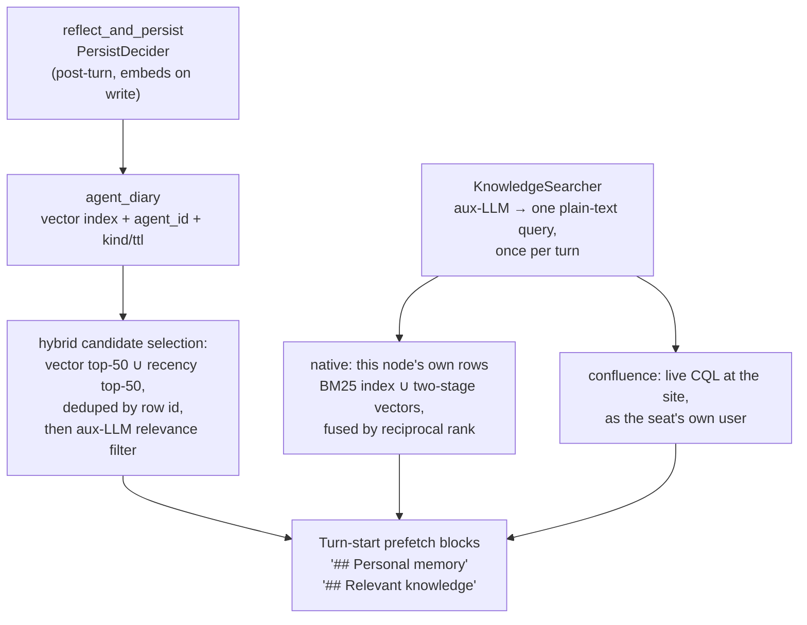

# Knowledge System

The knowledge system (`internal/knowledge`) is the read path agents use to find context they don't already have in their system prompt. It is two purpose-specific reads composed into the agent runtime:

- **Shared knowledge** — the team knowledge base. **Exactly one backend per company**, chosen by `knowledge.backend`, behind a `knowledge.Searcher` seam that every consumer reads through. A `Searcher` takes plain text — never a backend fragment, never a space key — and answers ranked hits; the turn-start prefetch translates the trigger into that plain text once per turn with the auxiliary LLM, and the executor can re-run the same search itself with `search_knowledge`.
- **`agent_diary`** (vector-indexed) — the agent's private observation log. One row per declarative fact the agent captured for itself via `reflect_and_persist` (or that the post-turn `PersistDecider` saved on its behalf), scoped to the agent's id. Rows are embedded on write; the `## Personal memory` prefetch picks candidates via a **hybrid selection** — the union of a vector top-K (semantic matches to the trigger) and a recency top-K (broadly-applicable operational rules that may not be a topical match), deduped by row id (the two halves are 50 each, so the union is the bound), then handed to an aux-LLM relevance filter.

**One backend, and that is a rule rather than a limitation.** "What do we already know about this" must not depend on which searcher was asked, so the config refuses a company that wires two.

## The two backends

```yaml
knowledge:
  backend: native      # the default — the engine's own pages
# backend: confluence  # a live search against Confluence at query time
# backend: none        # no knowledge base; every turn gets an empty block
```

| | `native` | `confluence` |
|---|---|---|
| Where pages live | the fleet's own ordered log, applied into every node's database | a Confluence site |
| How search works | keyword (BM25 over the node's own lexical index), semantic (two-stage 1-bit retrieval with an exact rerank), or `hybrid` — both, fused | CQL against the site's search API, live at query time |
| Who it searches as | the engine — every seat reads every page, so there is no per-seat credential to be missing | **the agent's own user**, so Confluence enforces its page permissions natively |
| Staleness | the index is built behind the node's own applied rows; a node still indexing SAYS SO rather than answering empty | none — there is no local copy at all |
| What it costs to set up | nothing | a site, a space, and a per-seat account |

### Native: an index, and what that means

There is a local copy, and being honest about it is the whole design. Every
page change is one record on an ordered log, every node applies it into its own
database, and a lexical index is built behind those rows asynchronously —
tokenising a large wiki takes minutes, and doing it inline would put the whole
index build inside the apply transaction that holds the node's only writer.

So a search on a freshly joined node can be against an index that is still
building, and that is **a different fact from an empty company**. Both the
dashboard and a seat's own prompt say which: a seat is told "the knowledge
base is not searchable from this node yet — ask a colleague rather than
concluding nothing has been written down", because a seat that read an empty
result would act on it by writing a page that already exists.

Ranking is BM25 with term-frequency saturation and length normalisation — the
part that stops a 20 KB runbook outranking the one-paragraph page that is
actually the answer. There is no phrase query, no proximity and no query
language, because the seam deliberately does not have one: an agent writes a
keyword line and a person types into a box.

A hit's snippet is cut from the page's **real body**, centred on the first
query term it contains — not from the index's stored opening. A window over a
document's first 600 bytes cannot centre on a match that is deeper in, so
every hit on a long page used to come back as the page's preamble, and a
snippet that does not contain the search term reads as a wrong result even
when the ranking is right. The bodies are read per query for the ranked hits
alone, never for the corpus, and a read that cannot be taken falls back to the
stored opening rather than failing the search.

One term contributes at most **5 000 documents** to a query. A word in nearly
every page — the company's own name, or "the" — otherwise makes one query a
scan of the whole corpus for a term whose weight is near zero, and the
ranking is decided by the query's other words anyway. What the cap drops is
the **bottom** of that term's list: the read is ordered by the term's own BM25
contribution, so a document it leaves out is one that would have ranked below
five thousand others of its own. Ordering by raw term count instead would keep
the longest documents, which is the same runbook-over-page inversion the
length normalisation above exists to prevent, reintroduced underneath it.

### Semantic search: two stages, no index, no new dependency

Keyword search finds what shares words. Semantic search finds what shares
*meaning* — the question "how do we handle rate limits" against the page
titled "429 backoff in the GitLab client", which share no term at all. That is
the class the semantic half exists for, and it is worth naming precisely
because it is also the class that is hardest to keep: a document only the
semantic half found leaves the fused answer entirely if the semantic half
drops it, where a document both halves found merely slides down.

There is **no approximate-nearest-neighbour index**, because the driver this
engine ships has none — `internal/store/caps.go` probes for one on every open
and reports what it found. The alternatives were a full exact scan of every
vector on every query, or embedding a search library with its own index
format, file and backup story on every node. Instead the search is **two
stages**, which is the shape every production vector engine uses anyway:

1. **Stage one** scans a narrow table of **1-bit sign codes** — one bit per
   dimension, 387 bytes at 3 072 dimensions against 12 KB for the vector — and
   keeps the nearest 1 200 by Hamming distance.
2. **Stage two** reranks exactly those candidates against their full vectors,
   by primary key, and returns 150.

The narrow *sibling table* is the load-bearing part rather than a compression
detail. A row is stored contiguously, so reading any column of a 12 KB row
costs traversing that row's overflow pages: the identical 1-bit column
measures 7.31 µs/row inside the wide row and 0.99 µs/row in a narrow one. A
generated column, an expression index and a second column on the vector table
all buy the compression; none of them buys the speed.

**The score you see is always the exact one.** A sign code decides which
documents are looked at and never how they are ordered.

#### What the quality of this can and cannot be promised

A sign code keeps only each vector's orthant, and how much an orthant says
about cosine rank is a property of *your corpus's* distribution and of nothing
else. Over a family of embedding-shaped generators at one corpus size, recall
at the shipped over-fetch spans **0.29 to 0.98**. So the engine's own gate
measures the *arithmetic* — that an exact rerank over a 1-bit candidate pool
recovers the exact ranking at sufficient depth — and deliberately makes no
claim about recall on your documents.

`crewlet search eval` is what answers that, against your own vectors. The
ground truth is the exact scan's own top-K, so nobody authors a judgement:

```console
$ crewlet search eval -store /var/lib/crewlet/crewlet-replicated.db
corpus       118432 sources, text-embedding-3-large at 3072 dimensions
measured     25 queries at depth 150 from 1200 candidates
recall       0.9761  (floor 0.9312 for this corpus size)
worst query  0.9467
head misses  0  (documents dropped from the exact top ten)
verdict      the two-stage search recovers the exact ranking at the shipped depth
```

It exits non-zero when the recall is below the floor for that corpus size, so
it can go in a schedule. Run it **monthly, and after any change to
`providers.embeddings.model` or `.dimensions`** — those are the two inputs
that move the answer. It reads a *file* rather than a running node: point it
at the copy inside a backup, which needs nothing stopped and measures the same
rows.

The floor is a **curve** rather than a number, because recall from a sign code
decreases as the corpus grows — 0.98 at twenty thousand sources, 0.93 at a
hundred and twenty thousand, 0.88 at half a million. A single threshold would
certify the smallest deployment and say nothing about the largest.

If a run comes back below the floor, the remedy is decided in advance:

1. Raise the quantization over-fetch. It measured **free** in latency, because
   stage one is a full scan whose cost does not depend on how many candidates
   it keeps.
2. Failing that, an 8-bit first stage, which is a code change shipped in the
   same release that moves the model default.

#### Where the vectors come from

Embedding a document costs a provider call, and it is the one thing in the
search path a node cannot recompute on its own. So it is not done per node and
not on the write path — a page save would otherwise carry a third-party HTTP
round trip inside its own transaction. One **fleet-singleton duty** embeds each
source once and publishes a record; every node applies it. The company pays the
bill once and holds the answer everywhere.

The duty ticks **every minute** and spends at most **8 batched provider calls**
per tick, 128 sources apiece — so a tick on a caught-up company is one indexed
anti-join that returns nothing and stops, and a tick on one that is behind
cannot monopolise either the provider budget or the singleton lease it holds.
Both source kinds are covered: the tracker's work items and the knowledge
base's published pages. A **rename does not re-embed a page** — the vector is
stored against the page's own edit number rather than the log version a rename
also stamps.

Those 8 calls are the **whole company's**, not each corpus's, and they are
handed out **round robin** between the two. With both behind, each gets four a
tick; with one caught up, the other takes all eight. So a tracker being
cold-filled — or written to faster than 1 024 items a minute — **cannot stop
the wiki being embedded**, which is the failure the division exists to prevent:
a corpus that is never reached is not slow, it is permanently unsearchable by
meaning, and the coverage figure below sums both corpora and would report it as
merely behind. Equal shares rather than shares weighted by backlog, so how
stale a corpus gets depends on *its own* size rather than on the size of the
biggest corpus in the company.

A cold fill of 110 000 sources is roughly **108 minutes and 860 batched
requests** — again across every corpus together — and those numbers do not move
with the configured width: providers bill per input *token*, and `dimensions`
is a truncation parameter the request already carries.

**A batch response has to say which input each vector answers.** The duty sends
128 texts in one request, and the API allows the results back in any order — so
each one is filed by the `index` it carries rather than by where it arrived.
The engine accepts only a response that maps onto the batch exactly once: as
many results as inputs, every index inside the batch, no index twice, and
either every result indexed or none of them. A response carrying no indices at
all is read in arrival order, which is what keeps a compatible server that
omits the field working; one that indexes only some of its results is refused,
because position and index are two different claims about the same result and
nothing in the response says which to believe.

**“No index” means the field is absent, and only that.** An `index` that comes
back `null`, or holding anything that is not a position in the batch, is
refused rather than read as silence — it is a claim the server *did* make and
the engine could not parse, and taking the arrival-order fallback there would
file a batch somebody deliberately ordered onto whatever turned up first, which
is the one outcome the index exists to prevent.

That is a requirement on a self-hosted endpoint or a gateway rather than on
OpenAI itself, and the refusal is why it is stated: a response that repeated an
index would store one document's vector against another — a wrong search answer
with nothing left to trace it to, since a stored vector carries no evidence of
the text it came from — and leave a third document with no vector at all, which
the duty reads as "nothing to embed" and re-selects on every pass for ever. So
a non-conformant endpoint surfaces as coverage that never rises, the refusal
named in the log, and eventually the alarm below; it never surfaces as a corpus
that is quietly wrong.

**How much of the corpus is covered is published**, as
`crewlet.tracker.vector.coverage` — the fraction of sources carrying a current
vector, summed across both corpora rather than averaged, so a small fully
embedded corpus cannot mask a large uncovered one. The
[`recall_below_floor`](../reference/alarms.md) alarm fires below 95 %, which is
how a stalled backlog is reported: it never drops a seat, and semantic recall
answering from a corpus it does not cover has no other symptom. A company with
no embeddings configured measures nothing rather than zero.

**A model change at the same width is the case to know about.** Until the
refill finishes, the corpus holds two incompatible embedding spaces, and a
search filters on the *pair* — so documents still on the old model are not
ranked badly, they are simply not in the candidate pool. `crewlet search eval`
names every space it finds, which is how you see a refill in progress.

### Every document carries a bucket

Both halves of the native backend stamp each document with a **search shard** —
a stable hash of its own identity into 64 fixed buckets, written beside the row
by the same function in both estates.

It is unrelated to everything else the engine partitions on. Not a stream, not a
project, not a container, not a log position, not the node holding the row. That
independence is the point:

- **A source that moves keeps its bucket.** Bucketing on the filed project would
  re-bucket every task a re-file touches, and a search over the old bucket would
  miss it — silently, because a result set that is one document short looks
  exactly like a corpus that is one document short.
- **The division follows the corpus, not the company's shape.** Bucketing on a
  project puts the busiest project in one bucket.
- **A document with no embedding is still in a bucket**, because the bucket is a
  function of the id rather than of anything derived from it.

**A single node reads every bucket**, exactly as it did before the column
existed. A fleet above 10 000 documents divides them: each live node scans a
contiguous range, returns its best candidates *with scores*, and the asking node
merges. There is no routing plan to compute and nothing to configure — the
division is a sorted roster and a remainder, and every node computes the same
one. See [Search](../guides/search.md) for the merge order, why BM25 stays
comparable across a divided scan, and what a partial answer names.

The count is fixed for the life of a deployment and is deliberately not
configurable. Changing it re-buckets every document, which costs a full index
rebuild rather than a rebalance — a knob that can be turned exactly once, at the
price of the whole index, is one that gets turned by somebody who did not know
the price.

### Confluence: no local copy at all

Shared knowledge is read straight from the backend on demand, so there is no sync worker to run, no index to keep fresh, and no staleness window. It authenticates as the agent's own user, which is what makes the backend's own permissions the ones that apply.

There is no shared vector index and no scope ladder for shared docs on this backend.

---

## Data flow



The two reads are independent: the diary is read by hybrid candidate selection (vector top-K ∪ recency top-K → aux-LLM relevance filter), scoped to the calling agent; the knowledge base is read through whichever backend the company wired — this node's own applied rows natively, a live query at the site on Confluence — scoped to the role's accessible containers. Neither depends on the other, and each renders into its own block of the executor's prompt.

---

## The knowledge.Searcher seam

`internal/knowledge` defines the one seam between the agent runtime and the knowledge backend:

```go
type Hit struct {
    Title     string
    URL       string   // shareable human link; "" when unbuildable
    Container string   // Confluence space key
    PageID    string
    Snippet   string   // plain text, <= 200 chars; may be ""
    Ancestors []string // ancestor page titles, outermost first
}

type Query struct {
    Text             string            // plain language, never a CQL fragment
    Seat             *org.Role         // whose credential the search runs as
    Org              *org.Organization // supplies the read scope, per call
    Limit            int               // 0 takes DefaultLimit (8)
    ExcludeAncestors []string          // nil takes the auto-draft default
}

type Searcher interface {
    // Backend names the integration answering, for logs and for the
    // operator surface that reports which one a company wired.
    Backend() string

    // CanSearch is the cheap, no-I/O pre-gate.
    CanSearch(seat *org.Role, o *org.Organization) bool

    // Search returns up to Query.Limit ranked hits. It never reports an
    // error: every failure path is an empty result.
    Search(ctx context.Context, q Query) []Hit
}
```

Contract semantics every backend honors:

- **Scope lives behind the seam.** `Search` derives its container scope from the organization ([`knowledge.scope`](#accessible-containers)); callers pass a role, a plain-text query, and ancestor-title exclusions — never CQL fragments, space keys, or project lists. Because the organization is a per-call parameter, live config edits to `knowledge.scope` flow through with no engine refresh hook.
- **Unscoped-vs-nothing is enforced inside `Search`**: empty scope + a self-authenticating role ⇒ unscoped search (the backend's own ACLs bound the hits); empty scope + a credential-less role ⇒ no results.
- **`CanSearch` is a cheap, no-I/O pre-gate** — "could a search possibly hit anything?" Its only job is letting the [relevant-knowledge prefetch](#relevant-knowledge-prefetch) skip the aux-LLM query-generation call when the search is a guaranteed no-op.
- **Best-effort**: `Search` never reports an error; every failure path returns no hits and the prompt block renders empty.
- **`Query.ExcludeAncestors`** drops hits whose ancestor/parent chain matches any listed title. Left nil it takes the default, `"Auto-Drafted Skills"` (`knowledge.AutoDraftedParent`), so unreviewed [promotion drafts](agent-learning.md) never surface before a lead publishes them; an empty, non-nil list disables the exclusion. Every draft title also carries the `[Auto-draft] ` prefix (`knowledge.AutoDraftTitlePrefix`) as a fail-closed backstop for a backend whose parent lookup fails.

**Selection is by `knowledge.backend`, and single-homed.** Engine start constructs exactly one searcher: the native one over this node's own page index, or the Confluence one, or none. One knowledge home is what makes the turn-start prefetch, the `search_knowledge` builtin, onboarding hints and skill promotion agree about what the company knows — two searchers would make an agent's answer depend on which was asked, and neither would be wrong. With `backend: none`, the searcher stays unwired and the `## Relevant knowledge` block renders empty. A live config change re-points the running turn engine at the new searcher (or at none).

An empty `backend` **derives** rather than defaulting blindly: a company that declares `integrations.confluence` gets `confluence`, and one that declares nothing gets `native`. That is the compatible half of the rename — an Atlassian company that has not read this page keeps the backend it had, and a quickstart company gets a wiki without asking for one.

**The seam has two implementations, and it was written for the second.** `knowledge.Searcher` is declared by its consumers — the prefetch, the onboarding hint, the promotion pass — so the native backend arrived as a new implementation rather than a rewrite of everything that searches. A seam collapsed into its last backend is what makes the next one a rewrite.

### Native backend — the engine's own pages

`internal/pages` + `internal/search`. The knowledge base is a [state-log domain](../guides/replication.md): every change is one record on `CREWLET_PAGES_LOG`, a deterministic applier writes it into every node's replicated database, and a lexical index is built behind those rows. The log's byte ceiling is `stream.pages_log_max_bytes`, reserved beside the tracker's and the vector index's inside one budget (see [how the byte ceilings are sized](../guides/replication.md#how-the-byte-ceilings-are-sized)). A search is BM25 over that index: term-frequency saturation and length normalisation, so a long runbook that mentions a word thirty times does not outrank the short page that is about it.

> **The semantic half is computed and stored, and not yet queried.** Every piece of it exists — the embedding duty fills a vector per document, the state-log domain replicates them, and `Quantize` / `TwoStage` / `Fuse` are the arithmetic a fused answer would use — but no caller computes a QUERY embedding: the two production callers of the fan-out pass text, sources and a limit and never a vector, so every live search skips the semantic slice and answers lexical-only. `knowledge.vectors` has no reader. Until a query embedding is wired, treat every statement about fusion in this document as describing the design rather than the running system.

Two properties differ from the vendor path and both are visible:

- **Every seat reads every page.** There is no per-seat credential, so `CanSearch` reduces to "is there an index at all" — the credential-less case below does not arise.
- **An index that is still building says so.** It is a different fact from an empty company, and a seat is told which: "the knowledge base is not searchable from this node yet — ask a colleague rather than concluding nothing has been written down". A seat that read an empty result would act on it, by writing a page that already exists. The gate is this node's FIRST BUILD — one lap over every corpus — and not "nothing is waiting to be indexed": a page saved a moment ago is ordinary staleness, and reading the gate off a pending count made every empty search on a company with people in it answer "still building" instead. After the first lap a search is a true answer over slightly older rows, which is what a search always is.
- **A CONTAINER IS A DOCUMENT**, and the engine writes one for every `space:`
  the org chart names — a unit's, a seat's own — plus the two reserved ones,
  on every config apply and every boot. It is idempotent: a container whose
  row already says what the chart says is not written again, so the log grows
  with edits rather than with restarts.

  A page merely **names** its container, so a page can exist in a container
  with no document — it is reachable by address and by search, and it is
  missing from `GET /containers` and from the Knowledge rail. That is what a
  space nobody declared looks like.
- **A BODY HAS A HISTORY**, and revision N is the body at version N. The
  dashboard reads any one of them back and shows what a save changed against
  the version before it, by line.
- **A body is MARKDOWN**, and the only format — see `internal/pages`. The
  dashboard renders it (headings, lists, tables, code, links), with raw HTML
  shown as its own text and a link's scheme restricted to `http(s):`,
  `mailto:` and the app's own routes: a page is written by an agent acting on
  content it read somewhere else, so a href in one is untrusted input.
- **A title is an ADDRESS.** It is unique within its container, claimed
  first-writer-wins on the fleet, and a page is fetched by `CONTAINER/Title`
  as readily as by its id. The address is the title NORMALISED — lowercased
  and with runs of whitespace collapsed — so `ENG/deploy runbook` reaches a
  page called "Deploy  Runbook", and two people cannot create pages whose
  titles differ only in spacing or case.
- **The address and the displayed title are two things, and a rename can move
  either.** The page stores both: the address it is claimed at, and the title
  as its author capitalised it — a link is resolved by the first and rendered
  by the second. So renaming "Deploy Runbook" to "Deploy Guide" moves the
  address (the old one is freed and can be taken again), while renaming it to
  "DEPLOY RUNBOOK" leaves the address exactly where it is and changes only what
  every reader sees. **Both are real changes**: each writes a revision to the
  page's history and tells its watchers. Only a rename to the title the page
  already displays does nothing — and it reports success, because it has
  already happened.

The tool-skills container is excluded from every result. A tool skill is machinery the engine injects into a phase, and a seat told to read one as knowledge would follow it as an instruction.

### Confluence backend — the Confluence searcher

`internal/confluence` (`confluence.Searcher`). The query text is wrapped into a Confluence CQL `text ~ "..."` clause (`confluence.BuildCQL`), optionally narrowed by `space IN (...)` from the [read scope](#accessible-containers), and run against the Confluence REST API (`/rest/api/content/search`), so Confluence's own search backend does the matching and the relevance ranking. Authentication is **as the agent's own Atlassian user**, using the seat's Confluence credential from its `mcp_env` (the `atlassian` or `confluence` server entry, read by `atlassian.CredentialOf`, which accepts `CONFLUENCE_API_TOKEN`, `CONFLUENCE_PERSONAL_TOKEN`, `CONFLUENCE_TOKEN` or `ATLASSIAN_API_TOKEN`, and a `JIRA_API_TOKEN` on the shared `atlassian` entry). Confluence enforces its page permissions natively: a restricted page the agent's user cannot see simply doesn't come back, and there is no engine-side restricted-page handling. Seats without their own credential fall back to the **org token** (`integrations.confluence.token`); an agent on the org token sees whatever that account sees, subject to the empty-scope rule below. Hits carry the full ancestor-title chain, so the auto-draft exclusion filters on any depth.

---

## Accessible containers

The search scope is set by **one** thing: the org-wide `knowledge.scope` list, normalised once by `internal/knowledge` —

```text
knowledge.scope: ["HANDBOOK"]   # scoped to these containers
knowledge.scope: []             # empty ⇒ unscoped / ACL-bound for
                                            # self-authenticating agents
```

It is **role- and unit-independent** — every agent has the same read scope.

> **Read scope ≠ team identity.** A unit's own container — `space` (runtime `org.Unit.Space`) — is *integration identity*: it decides webhook routing (page activity → the unit lead) and is the team's write / skill-promotion home. It deliberately does **not** narrow reads. An Engineering agent isn't limited to the `ENG` space when searching; it searches across everything its own account can read. (See [Confluence § integration identity](../integrations/confluence.md).)

**The list is optional — and empty is the useful default.** When the scope list is empty, behaviour depends on how the search authenticates (per-agent token vs. engine/admin fallback):

- A role with **its own backend credentials** searches **unscoped**: the container clause is dropped and the backend's own ACLs bound the results — the agent finds anything its account can read that matches the query.
- A **credential-less** role (engine/admin-token fallback) searches **nothing**: an unscoped query would read the shared account's entire view, so the empty list means "no search" rather than "everything".

So set `knowledge.scope` only to *narrow* reads to a curated floor (e.g. a company handbook); a fully per-agent-credentialled org leaves it unset and lets the backend's ACLs do the scoping. The backend's own permissions remain the hard boundary regardless.

> **Single-homed, and validation enforces it.** A company that sets `knowledge.backend: native` *and* declares `integrations.confluence` is refused, because "what do we already know about this" would depend on which searcher was asked. Also refused: a read scope with no backend behind it — `knowledge.scope` under `backend: none` reads as a working narrowing and narrows nothing.

---

## Where content comes from

Shared knowledge **is** the backend — there is no separate engine-managed store to populate. The writers feeding the two reads:

| Writer | Read by | Reach |
|---|---|---|
| Humans + agents via the backend's MCP tools (`confluence_create_page` / `confluence_update_page` / `confluence_add_comment`) | `knowledge.Searcher` (live query) | Whoever the page's backend permissions allow |
| `crewlet confluence import` ([below](#publishing-knowledge-docs)) | `knowledge.Searcher` (live query) | Same |
| Agents via `reflect_and_persist` (in-flight) and `PersistDecider` (post-turn) | `agent_diary` (hybrid vector ∪ recency selection → aux-LLM filter) | The writing agent only |

Static org configuration (mission, vision, policies, role profile, team roster, unit context, integration hints) is a third source, but it is not "knowledge" in the read-path sense: it renders straight into the executor's system prompt via the section builders in `internal/agent/prompts`. There is no startup seed step and no reconcile pass, because the prompt **is** the configuration. Documents that change frequently (procedures, ADRs, runbooks) live in the knowledge base, where humans and agents already author them.

---

## Publishing knowledge docs

Most shared knowledge is authored directly by humans and agents — a seat calls
`write_page` (native) or the vendor's own MCP tools (Confluence). For docs an
operator wants to keep in **version control** — onboarding pages, runbooks,
playbooks — there are two paths, one per backend.

### On the native backend: your own assistant

There is no import CLI, and there does not need to be one. Point any MCP client
at [`/operator/mcp`](../reference/api-endpoints.md#operatormcp--your-own-assistant)
with your API token and tell it what to publish:

> Publish everything under `examples/nimbus-docs/` — one container per
> directory, the page title from each file's first `# H1`.

It calls `write_page` per file, with your token's own name on each page as the
author. That handles the parts a flag-driven CLI handles badly: the parent
chain, a title that already exists (`save_page` with the version it read), and
a file that turns out to be a [tool skill](tool-skills.md) rather than prose.

The [reserved containers](#accessible-containers) are refused to it, exactly as
they are to a seat — a page written into the tool-skills container would be
injected into a phase as an instruction rather than read as knowledge.

### On Confluence: the import CLI

```
crewlet confluence import <company.yaml> <directory>
```

The first positional argument is the **Tier B company YAML** (the importer reads the backend credentials from its `integrations.confluence` block); the second is the directory to publish, walked recursively, with dot-directories skipped. The importer routes each `.md` file by frontmatter: a file with a `trigger:` is a [Tool Skill](tool-skills.md) (published to the Tool Skills container); **every other file is a knowledge doc.**

Knowledge docs follow a **directory-based convention** — the files are pure prose, no frontmatter required:

- **Container = the file's immediate parent directory name.** A file at `<root>/ENG/onboarding.md` publishes to the container `ENG` — a native container, or a Confluence space of that key.
- **Title = the file's first `# H1` heading.** That H1 line is stripped from the published body (the backend shows the page title separately, so leaving it would duplicate the title on the page).

`examples/nimbus-docs/` is a worked set of these: the pages the Nimbus
example company publishes. Both bundled examples run the **native**
knowledge base, so neither is an argument to this CLI: they publish
through the assistant path above. A company that moves to Confluence adds
the `confluence:` block per [Confluence](../integrations/confluence.md),
and its company YAML is then the positional argument the importer reads
those credentials from.

```
examples/nimbus-docs/
├── HOME/
│   └── Onboarding.md          → the ROOT container: the page every seat
│                                reads before its own team's
├── ENG/
│   └── Onboarding.md          → space ENG,  title "Onboarding"
├── LEAD/
│   ├── Onboarding.md          → space LEAD, title "Onboarding"
│   ├── Repo Ownership.md      → space LEAD, title "Repo Ownership"
│   └── Manager 1-1.md         → space LEAD, title "Manager 1:1"
└── PROD/
    └── Onboarding.md          → space PROD, title "Onboarding"
```

`HOME` is `knowledge.root_space`'s default. It holds what is true of the
whole company, which is what makes it worth a container of its own: the
alternative is the same four paragraphs in every team's `Onboarding`, where
three of the four copies go stale and nobody can tell which.

```markdown
# Onboarding

## Who is here
...
```

Optional frontmatter is supported **only for overrides** — a plain-prose doc needs none of it:

| Field | Required | Description |
|---|---|---|
| `title` | no | Overrides the H1 as the page title. (Onboarding pages must be titled exactly `Onboarding` — see the [onboarding convention](organization-model.md#onboarding-convention); name the file `Onboarding.md` and that falls out of the H1 automatically.) |
| `space` | no | Overrides the container for a doc that lives somewhere the tree cannot express. |
| `parent` | no | The title of a page in the same space to nest this one under. The plan is ordered parents-first, so a parent published by the **same run** resolves; a `parent:` cycle stops the walk naming the files. A parent nobody publishes is a note and a page at the space root — a doc nobody can read is worse than a doc in the wrong place. An *existing* page is **never re-parented**: where a page sits is something people move deliberately, and a run that dragged it back every time would be fighting them with no way to say so. |
| `labels` | no | The author's own page labels, lower-cased and de-duplicated because that is what Confluence stores and answers with. Attached on every run, not only on create; a label that will not attach is a note, not a page failure. |

A doc with neither a frontmatter `title:` nor an `# H1` has no determinable title and **stops the walk** naming the fix. So do two files that would publish as the same page. Both are things an operator corrects in their editor, and a run that skipped them would report success with a doc silently unpublished.

Key properties:

- **Clean prose.** Knowledge-doc pages render the markdown body straight to the backend's page format (Confluence storage XHTML) — no YAML metadata box on the page (unlike skill pages, which carry a binding-metadata code block the engine parses back out).
- **Idempotent, and always a write.** A page that exists is updated in place. This is a publisher, and skipping existing pages would mean an edited file never reaching the backend. `-dry-run` previews without page writes. The match key is `(space, title)`. The importer never creates its container: a missing space fails before a single page is written, naming the space to create.
- **Searched live, not registered.** Knowledge docs are read on demand through the query-time `## Relevant knowledge` search — they are **not** loaded into any in-memory registry, so there is nothing to resync (`crewlet confluence resync` is skills-only).

---

## Wiring it up

There is no orchestrator object to construct. The two reads are wired independently by engine start:

- **The `knowledge.Searcher`** is constructed from whichever backend `knowledge.backend` names (see [the seam](#the-knowledgesearcher-seam)): the Confluence searcher, which needs the site connection and nothing local; or the native one, which needs this node's own store and its lexical index. (It does not fuse the [semantic half](#semantic-search-two-stages-no-index-no-new-dependency) today — see the note under [the native backend](#native-backend): the vectors are written but nothing queries them.) Neither takes an LLM — writing the query text is the [prefetch's](#relevant-knowledge-prefetch) job, on the seat's auxiliary model, and `search_knowledge` has the executor's own words to search with. With `backend: none`, or a `confluence` company whose integration is missing, no searcher is wired and the `## Relevant knowledge` block stays empty.
- **`learning.Diary`** is built over the node's store (`learning.NewDiary`), so a node with no store has no diary and the `## Personal memory` block stays empty without error. Writes are embedded when `providers.embeddings` is configured; without it the diary degrades to a pure recency list (vector candidate selection becomes a no-op) but writes and recency reads still work.

The two are independent: an org can have knowledge search without reflection, or reflection without knowledge search.

---

## Relevant-knowledge prefetch

Beyond agents calling the backend's search tools directly, the executor's prompt carries a `## Relevant knowledge` block that pre-runs a knowledge-base search for the seat. Once per turn, the auxiliary LLM generates a short plain-text search query from the trigger context, the searcher runs it live (scoped to the role's accessible containers), and the executor sees title + snippet bullets without having to think to call a tool. When the block is thin — a pointer trigger gates the search off — the executor searches the same seam itself with the `search_knowledge` builtin, once it knows what the task actually needs. The `CanSearch` pre-gate skips the aux-LLM call entirely when a search could not return anything. Because the search runs as the agent's own backend user, restricted pages the agent cannot see never appear — there is no draft-page or restriction filter to apply engine-side.

Full page bodies open via the backend's page-read MCP tool; further searches via its search MCP tool (`confluence_get_page` / `confluence_search`).

See [Agent Learning § Relevant-knowledge prefetch](agent-learning.md#relevant-knowledge-prefetch) for the design rationale and failure modes.

---

## Onboarding markers

The `mark_onboarded` builtin records that an agent has read its team's Onboarding pages so the onboarding hint stops re-rendering on every turn. Markers live in their own small table, `agent_onboarding_markers`, keyed by `agent_id` with UPSERT semantics (so re-onboarding never accumulates stale rows). The marker carries a `chain_hash` over the agent's org chain (`learning.ChainHash`); a chain change (role moved units, ancestor renamed, new unit inserted) silently invalidates the marker, and the dedicated onboarding pass runs again until the agent re-reads and re-marks. The same row holds the cross-process pass lease that stops two turns onboarding one seat at once.

A dedicated table, because `learning.Onboarding.Onboarded` answers with one indexed equality lookup instead of a per-agent metadata-filter scan.

---

## Configuration

The knowledge system has a block of its own — `knowledge.backend`, `knowledge.scope`, `knowledge.skills_container`, `knowledge.root_space` and `knowledge.vectors`, field by field in [Configuration](../getting-started/configuration.md#knowledge). Two upstream configs determine the rest:

- **`integrations.confluence`** — required by `backend: confluence`, and refused beside `backend: native` because pages would then live in two places with nothing keeping them in step. The query-time search authenticates with each role's per-agent token (`mcp_env.atlassian`), falling back to the org-level token (`confluence.token`); a `confluence` company missing it has no searcher at all, so the `## Relevant knowledge` block stays empty and only the agent's diary contributes. The native backend needs none of it — it searches as the engine, over this node's own applied rows.
- **`providers.embeddings`** — required for the diary's vector candidate path (the vector half of the `## Personal memory` prefetch's hybrid selection, plus the diary write-side embedding step), for `episodes` vector recall in the learning subsystem (`query_episodes` and the `## Similar prior work` prefetch), **and** for the [semantic half](#semantic-search-two-stages-no-index-no-new-dependency) of the native knowledge search. `knowledge.vectors` is the switch that is MEANT to fuse that half into the query — it has no reader today, so it fuses nothing — and it **derives** from whether this block is configured — so a company already paying for embeddings for its diary gets the better search, and an explicit `vectors: true` with no provider is refused at validation rather than degrading quietly. Without an embeddings provider the native search is lexical only (BM25 over this node's own index), the diary degrades to its recency-only path (still functional, just without semantic candidate matching), and episodic recall is disabled. On `backend: confluence` the question does not arise: that search is a live CQL query against the site, which embeds nothing either way.

See [Configuration](../getting-started/configuration.md) for the full YAML shape, [Confluence integration](../integrations/confluence.md) for setup, and [Agent Learning](agent-learning.md) for diary mechanics.
