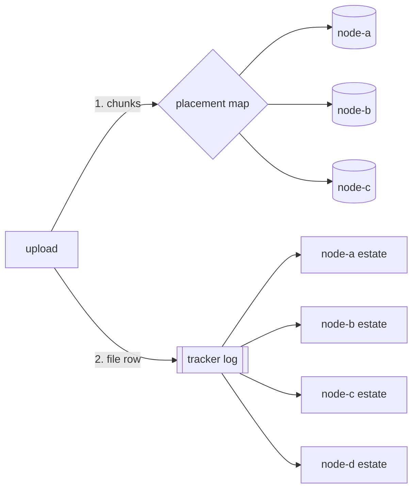

# Object Store

Where a company's **files** live, and why they are the one thing a fleet does
not copy onto every node.

Everything else the engine keeps durably — a task, a page, the history of both
— is held **whole** on every data node: each one applies the same ordered log
into its own identical copy (see [Scaling Out](scaling.md)). That is the right
shape for rows a seat reads on every turn. It is the wrong one for a
spreadsheet somebody uploaded, because files grow without bound and a fleet of
five would pay for every one of them five times.

So a file is split in two:

- **What the company has to agree on** — that the file exists, its path, its
  type, its version, who wrote it, which chunks make it up — is a row in the
  replicated estate, written through the tracker's log like any other change.
- **The bytes** are cut into chunks, and each chunk is kept by a few data nodes
  chosen by a **placement map** every node evaluates the same way.



Today the store holds [a project's files](../guides/work-tracker.md#a-projects-files).
It is built for more than that — chat attachments and anything else a row can
name by hash — and every consumer follows the same rule: the estate names the
object, and the map places its bytes.

---

## Chunks

A file is cut into **1 MiB chunks**, and each chunk is named by the SHA-256 of
its own bytes. The name is the whole address, which buys three things:

- **The same bytes are stored once.** Two files that share a chunk share its
  copies, and a file written again unchanged stores no new bytes.
- **Every byte is checked against its name, both ways.** A node refuses a chunk
  that does not hash to the name it was sent under, and a chunk that no longer
  hashes to its name on the way out is a disk that rotted: it is removed and
  reported missing rather than served, and repair fetches a good copy.
- **A whole file is checked as well.** A file's row carries the hash of its
  entire content, and a download that does not reproduce it fails rather than
  handing somebody bytes that merely look complete.

A write is **durable before it is acknowledged**: each chunk goes to a
temporary file, is synced, renamed into place and its directory synced, so a
node that loses power holds either the whole chunk or none of it.

---

## Placement

Chunks are grouped into **256 placement groups** by their hash, and it is the
*group* that is placed. A map change is then a comparison over 256 entries
rather than over every chunk a company has, and a repair walks a group at a
time. The count is fixed for the life of a deployment: changing it would
re-place every chunk.

Each group is held by the **replica count** data nodes with the highest draw in
a **weighted rendezvous**. A node of weight *w* draws *w* hashes of the group
and its own id and keeps the best, so its chance of holding any given group is
its weight over the total. Adding a node moves only the groups it now wins;
removing one moves only the groups it held. The draws are integers — the
standard formula (CRUSH's straw2) uses a logarithm, and two CPUs disagreeing in
the last bit of a float would place a group on different nodes.

| | |
|---|---|
| Replica count | `stream.replicas` — 1 on a single node, 3 in a fleet — so the bytes are exactly as durable as the log that names them. Never more than the number of data nodes |
| A write succeeds at | a majority of the replica count: 2 of 3 |
| A node's share | `store.objects.weight`, 1 to 64 — set it in proportion to the space its directory has |

### The map

The map is one record in the coordination store: the data nodes, their
weights, the replica count and an **epoch** that moves whenever any of them
does. Every node reads it every 10 seconds and places by what it read.

It is maintained by **one node at a time** — the `object-map` fleet duty, held
by a node with the `workers` role — which compares the map with who is live and
writes the next one by compare-and-set, so a holder that lost the duty
mid-write loses the race rather than overwriting its successor.

- **A data node that comes up is added** at the weight it offers, within one
  presence heartbeat.
- **A data node that goes away is noted, not removed.** It stays in the map for
  **10 minutes** — the interval Ceph waits before marking a device out, for the
  same reason: a restart, a reboot and a rolling upgrade's turn at a node are
  all minutes, and taking a node out moves its whole share across the fleet.
- **Past that it is taken out**, and every group it held is re-placed on the
  nodes that remain.

A node that is reading an older epoch places by the older map, which is
correct for as long as it takes to read the next one: nothing a newer map
moves is deleted from where the older one put it until the new holders have
confirmed their copies (below).

---

## Writing and reading

**A write goes to the group's holders in parallel**, over the broker — the one
channel every node already has; the object store opens no port of its own.
When a holder does not answer, the write goes to the **next node in the same
ranking** instead, so a node that is down costs a copy in a different place
rather than a copy fewer. The write is reported stored once a majority holds
it; fewer is an error, never a success with a footnote.

**An upload stores every chunk before it writes the row** that names them. A
file that is listed is therefore always a file whose bytes the fleet holds, and
an upload cut off halfway leaves only chunks nothing names, which the collector
removes a day later.

**A read looks on this node first**, then down the same ranking a write walks:
the group's holders, then wherever a displaced write or an older map left a
copy. A holder that did not answer is asked last for 30 seconds, so a dead node
costs one timeout per reader rather than one per chunk. A download streams, a
few chunks ahead, and never holds the file in memory.

---

## Keeping the copies where the map says

Every data node runs two passes over its own directory, one at a time.

**Repair** — every 10 minutes, and at once whenever the map's epoch moves. It
works out which chunks this node should hold — every chunk the estate names,
through the map — and fetches the ones it is missing from wherever a copy is.
The inventory is **derived, never kept**: which chunks exist is what this node's
own tables name, so there is no second list to drift from them. A chunk the
repair can find on no node at all is counted toward the
[`objects_missing`](../reference/alarms.md) alarm.

**Collection** — every hour. Deleting is the only dangerous thing either pass
does, so it has two rules:

- **A chunk nothing names** is deleted once it is more than **24 hours** old
  *and* this node's copy of the estate is both current and complete: the pass
  first waits for everything the log had committed when it started, and
  deletes nothing unnamed while this node holds a record it could not apply —
  that record might be the one naming the chunk. The 24 hours cover the other
  window: bytes are uploaded before the row that names them, so every chunk
  starts its life unnamed. Uploading the same bytes again restarts the clock.
- **A chunk that is named but that the map no longer places here** — left by an
  older map, or by a write that went past a silent node — is deleted only when
  *every* node the map places it on says it holds the chunk **and** that its
  own map places it there, at the same epoch. "It has a copy" alone is not
  enough: two nodes reading different maps could each vouch for the other and
  both drop theirs.

---

## Running it

A data node needs nothing configured: it keeps its share in `objects/` beside
its database and offers a share of weight 1.

```yaml
store:
  path: /var/lib/crewlet/company.db
  objects:
    dir: /mnt/objects     # a separate volume, once files outgrow the database's
    weight: 4             # four times the share of a weight-1 node
```

See [Configuration](../getting-started/configuration.md) for both fields.

**A node without `data` holds no chunks.** A [stateless node](scaling.md#a-node-that-holds-no-data)
reads and writes files exactly as a data node does — through the nodes that
hold them — and `store.objects` is refused on it.

**Sizing.** A fleet holds each chunk `stream.replicas` times, spread across the
data nodes by weight. Three data nodes of equal weight at three replicas each
hold every chunk; a fourth takes about a quarter of every node's share onto
itself and frees that space on the others.

**Adding a data node** needs nothing beyond starting it. It is in the map
within one presence heartbeat (15 seconds), and repair moves its share onto
it. A brand-new fleet's first map is written within a second of its first
data node starting; an upload in that second is refused as unavailable
rather than stored nowhere.

**Removing one for good** is stopping it: ten minutes later the map re-places
its groups and the remaining nodes repair from each other. Take one node out at
a time and let `objects_missing` stay clear between them — at three replicas
the fleet survives any one loss, not two at once.

**Watching it.** The dashboard's Fleet screen draws the map — each data
node's share, how many copies of every chunk the fleet holds against how many
it asks for, and which member the map is still counting while it is gone —
from [`GET /fleet`](../reference/api-endpoints.md#get-fleet). A chunk no node
holds raises [`objects_missing`](../reference/alarms.md) on the node the map
places it on.

**Backups carry every chunk.** A node holds only its share, so a copy of its
directory is a fraction of the company's files. A backup instead reads every
chunk the store copy names, from wherever the fleet holds it, into an
`objects/` directory beside the database copy — see
[Backup and restore](../guides/backup.md).

---

## What it does not do

- **It does not place the estate.** Tasks, pages and every other row are still
  whole on every data node; only what a row can name by hash is placed.
- **It does not version bytes on its own.** A new version of a file is a new
  row naming new chunks; the previous version's chunks are collected once no
  row names them.
- **It is not for artefacts larger than 1 GiB.** Those belong in a store built
  for them, with a link in the project.

The decision is [ADR-0019](https://github.com/crewlet/crewlet/blob/main/adr/0019-the-estate-names-an-object-and-a-map-places-its-bytes.md).
