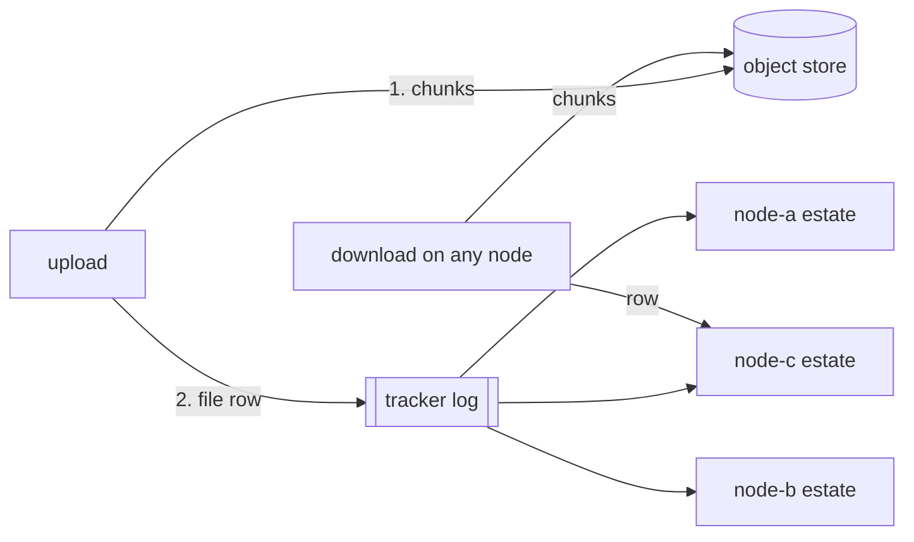

# Object Store

Where a company's **files** live, and why they are kept apart from everything
else a fleet holds.

Everything else the engine keeps durably — a task, a page, the history of both
— is held **whole** on every data node: each one applies the same ordered log
into its own identical copy (see [Scaling Out](scaling.md)). That is the right
shape for rows a seat reads on every turn. It is the wrong one for a
spreadsheet somebody uploaded, because files grow without bound and are read
rarely, so a copy of each in every data node's database is a cost nothing
reads back.

So a file is split in two:

- **What the company has to agree on** — that the file exists, its path, its
  type, its version, who wrote it, which chunks make it up — is a row in the
  replicated estate, written through the tracker's log like any other change.
- **The bytes** are cut into chunks and kept in **one store the whole fleet
  shares**: by default a bucket on the fleet's own broker, replicated across
  its members like every stream, or an S3-compatible bucket.


```mermaid
flowchart LR
    W[upload] -->|1. chunks| S[(object store)]
    W -->|2. file row| L[[tracker log]]
    L --> A[node-a estate]
    L --> B[node-b estate]
    L --> C[node-c estate]
    R[download on any node] -->|row| C
    R -->|chunks| S
```

Today the store holds [a project's files](../guides/work-tracker.md#a-projects-files).
It is built for more than that — chat attachments and anything else a row can
name by hash — and every consumer follows the same rule: the estate names the
object, and the store keeps its bytes.

---

## Chunks

A file is cut into **1 MiB chunks**, and each chunk is named by the SHA-256 of
its own bytes. The name is the whole address, which buys three things:

- **The same bytes are stored once.** Two files that share a chunk share it, and
  a file written again unchanged stores no new bytes.
- **Every byte is checked against its name, both ways.** A write of bytes that
  do not hash to the name they were sent under is refused, and a chunk that no
  longer hashes to its name on the way out is refused as corrupt rather than
  served.
- **A whole file is checked as well.** A file's row carries the hash of its
  entire content, and a download that does not reproduce it fails rather than
  handing somebody bytes that merely look complete.

---

## Where the chunks live

`store.objects` in the [bootstrap config](../getting-started/configuration.md)
names the backend. It is **Tier A** — an endpoint, a bucket and the
credentials to reach it are the operator's, like the stream — and **every node
carries it**, a node without `data` included: an upload or a download on a
stateless node goes to the store directly, exactly as on a data node.

### The fleet's own bucket — `nats`, the default

```yaml
store:
  objects:
    backend: nats   # or leave the block out
```

The chunks go into a JetStream **object store** bucket, `crewlet_files`,
on the same broker every log already runs on. It is backed by an ordinary
stream (`OBJ_crewlet_files`), created at boot at **`stream.replicas`**
copies — so the company's files survive exactly what its logs survive, on the
same members:

- **The data nodes are the broker's members**, and they keep the copies. A
  three-node fleet at `stream.replicas: 3` holds every chunk three times, one
  on each; a member that fails is caught up by the broker as every other
  stream is, and there is no repair, map or membership for the engine to run
  beside it.
- **A node without `data` reaches the bucket across its leaf link**, with the
  rest of the fleet's JetStream API — it holds nothing.
- **Quorum is the broker's.** Writing a chunk is a replicated stream append, so
  it needs a majority of the stream's replicas, as a tracker write does: a
  three-member fleet keeps writing files with one member down, and a
  two-member fleet at two replicas cannot write with either down. Reads are
  served by whichever replica answers. Nothing about files changes what a fleet
  of a given size survives — it is the same arithmetic as its logs (see
  [Scaling Out](scaling.md)).
- **A backup carries it as a stream.** The stream snapshot every backup takes
  includes `OBJ_crewlet_files`, so no chunk is copied on its own; a restore
  brings the bucket back with every other stream.

What it costs is that **every member holding a copy holds every chunk**: the
bucket is one stream on one replica set. For the three or five data nodes a
fleet runs that is what any placement would have done anyway. A company whose
files outgrow one member's disk, or that would rather its files lived in
storage it already runs, takes the S3 backend.

### An S3 bucket — `s3`

```yaml
store:
  objects:
    backend: s3
    s3:
      endpoint: https://s3.eu-west-1.amazonaws.com   # empty: Amazon's own for the region
      region: eu-west-1                              # required; R2: auto, MinIO: us-east-1
      bucket: acme-files
      prefix: crewlet/                               # optional: one bucket, several companies
      path_style: false                              # true for MinIO and most self-hosted gateways
      access_key_id: ${S3_ACCESS_KEY_ID}             # both, or neither for the SDK's own chain
      secret_access_key: ${S3_SECRET_ACCESS_KEY}
```

Each chunk is one object, `<prefix><hash>`. Any S3-compatible store works —
Amazon S3, Cloudflare R2, MinIO, Ceph's gateway, GCS through its
interoperability endpoint. The bucket keeps whatever copies its provider
promises, and its size is the provider's problem rather than any node's disk.

- **Credentials** are `${VAR}` references resolved at boot, or neither, which
  takes the SDK's default chain: the environment (`AWS_ACCESS_KEY_ID`…), a
  shared profile, a web identity token or the instance's role.
- **A private CA** is read from `AWS_CA_BUNDLE`, added to the system roots for
  the bucket's requests only.
- **The bucket is checked at boot.** A node that cannot reach it, or whose
  credentials it refuses, does not start — a node that started anyway would
  accept an upload it could not store.
- **Every request goes out from the node that serves the upload or the
  download**, a stateless node included, so every node needs to reach the
  endpoint.

### One store per fleet

The first node to boot records the store it was configured with in the
coordination store — `nats`, or `s3:<endpoint>/<bucket>/<prefix>` — and every
node after it compares its own: **a node configured with another store refuses
to boot**, naming both. Two nodes writing to two stores would each list files
whose bytes the other cannot read, and each one's collector would see the other
store's chunks as nothing at all. Credentials are not part of the record — two
nodes may reach one bucket with different keys.

Moving a company from one store to the other is a migration, not a config
change: copy every object across (on S3, `objects/` in a backup is exactly the
bucket's layout), stop the fleet, delete the `backend` record from the
`crewlet_objects` coordination bucket, and boot every node with the new block.

---

## Writing and reading

**An upload stores every chunk before it writes the row** that names them. A
file that is listed is therefore always a file whose bytes are in the store,
and an upload cut off halfway leaves only chunks nothing names, which the
collector removes a day later.

**A download streams**, a few chunks ahead, and never holds the file in memory.
Each chunk is checked against its name as it arrives.

---

## Collection and audit

Chunks are never deleted when a file is: a chunk may be shared by another file,
or by the previous version of the same one. Instead one data node at a time —
the `object-collector` fleet duty — runs two passes against the store, both
judged against the replicated estate the data node holds:

- **Collection, hourly.** It pins the estate (a barrier on the tracker's log,
  so it reads every row committed when it began), lists the store, and deletes
  every chunk **written more than a day ago that no row names**. The day is the
  grace an upload in flight is given between storing its chunks and writing its
  row. A collection that cannot read the whole estate — this node holds a
  record it could not apply — **deletes nothing**: a row it could not read may
  name any chunk.
- **Audit, daily.** It asks the store about every chunk a row names. One that
  is not there is a file that cannot be downloaded, and raises
  [`objects_missing`](#alarms) with the count and the first hundred hashes.

A pass that fails is tried again ten minutes later. The duty records each pass
in the coordination store, so every node's [`/fleet`](../reference/api-endpoints.md#get-fleet)
and `crewlet objects status` show the same report, naming the node that ran it,
and a node taking the duty over picks up the schedule where the last holder
left it rather than running both passes again.

### Why a deletion takes a lock

A chunk the collector judged unnamed can be named again in the same moment: a
new upload of the same bytes stores the chunk again (a replace, which resets
its age) and then writes its row. If the deletion landed between the two, the
new row would name a chunk that was just deleted.

So the collector deletes a chunk **only under that chunk's lock**, in the
coordination store, and only after reading its age again under it — and a
writer storing a chunk that **already exists** takes the same lock for its
write. A writer that got there first leaves the chunk fresh, and the collector
keeps it; a collector that got there first has deleted it, and the writer
stores it anew. A first write of a chunk takes no lock: there is nothing to
delete.

---

## Alarms

| Alarm | Fires when |
|---|---|
| `objects_missing` | the collector's last audit found chunks a row names that the store does not hold — on the node holding the collector's duty, since one node's audit of a shared store is the fleet's |

A missing chunk is a store that lost bytes it acknowledged: check the store's
own health (the `OBJ_crewlet_files` stream on the data nodes, or the
bucket's) and restore the chunks named in the report from a
[backup](../guides/backup.md).

---

## Running it

### Choosing a backend

Keep **`nats`** unless a reason below applies. It needs nothing the engine does
not already run, survives what the logs survive, and is backed up with them.

Take **`s3`** when:

- the files will outgrow a data node's disk — every member keeps every chunk;
- the company already keeps its data in a bucket it backs up, versions or
  replicates across regions on its own terms;
- the fleet's broker is an external NATS cluster whose operators would rather
  not hold files.

### Taking a data node away

There is nothing to drain for the files. On `nats` a member that leaves is a
broker member leaving, handled as for every stream (see
[Fleet](../guides/fleet.md)); on `s3` no node holds a chunk at all.

### Watching it

`crewlet objects status` prints the store, the node that ran the last passes,
and what each found; `--json` prints the fleet answer's `objects` block. The
dashboard draws the same under **Settings › Nodes**.

---

## How far it scales

- **`nats`: the copies follow the broker.** The bucket lives on the stream's
  replica set, so its capacity is the smallest member's disk and its write
  throughput is the stream's — every upload of a 1 GiB file at three copies is
  three gibibytes across the broker's routes. Adding data nodes adds broker
  members; it does not add space for files.
- **`s3`: the bucket's.** Capacity and throughput are the provider's; each node
  pays only the requests its own uploads and downloads make.
- **The collector lists the whole store.** A listing streams rather than
  holding the inventory in memory, and judges it 500 chunks to a query against
  an index on the chunk column, so a pass over a few million chunks takes
  minutes, once an hour, on one node.
- **The estate is still whole on every data node.** Only file bytes leave it.
  Every row — a file's included — is on every data node.

## What it does not do

- **It does not place the estate.** Tasks, pages and every other row are still
  whole on every data node; only what a row can name by hash is in the store.
- **It does not version bytes on its own.** A new version of a file is a new
  row naming new chunks; the previous version's chunks are collected once no
  row names them.
- **It is not for artefacts larger than 1 GiB.** Those belong in a store built
  for them, with a link in the project.

The decision is
[ADR-0026](https://github.com/crewlet/crewlet/blob/main/adr/0026-the-estate-names-an-object-and-a-store-keeps-its-bytes.md)
— the estate names an object, and a store the fleet shares keeps its bytes.
