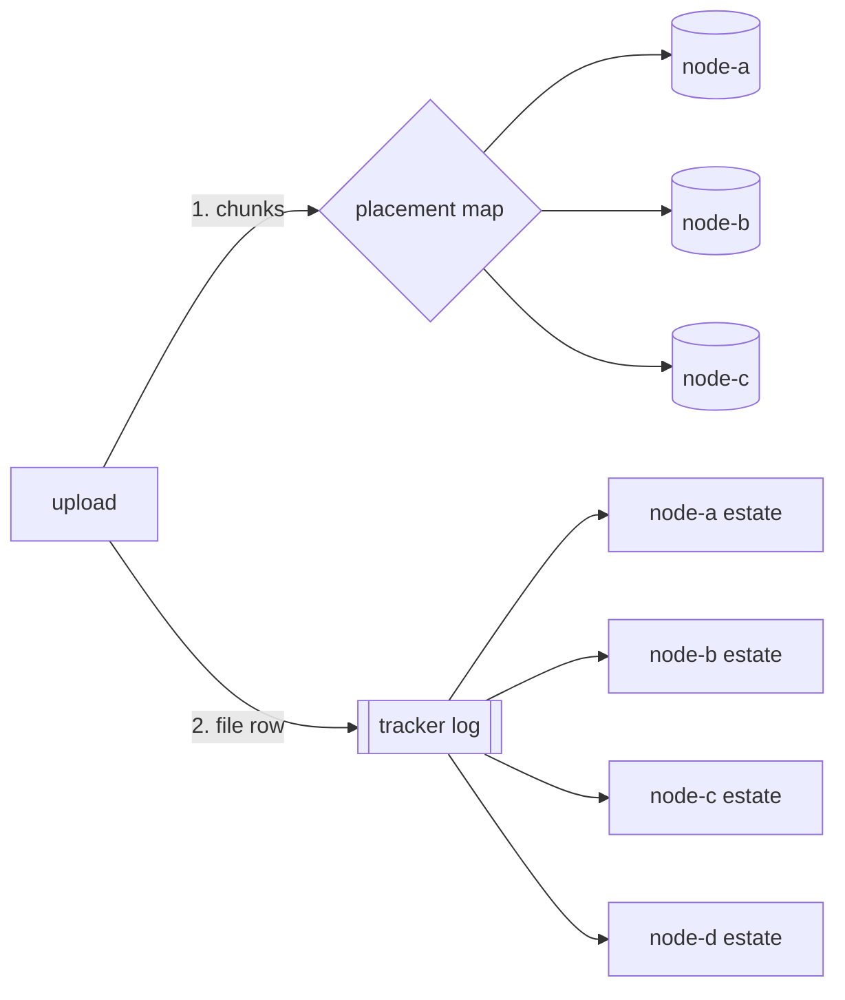
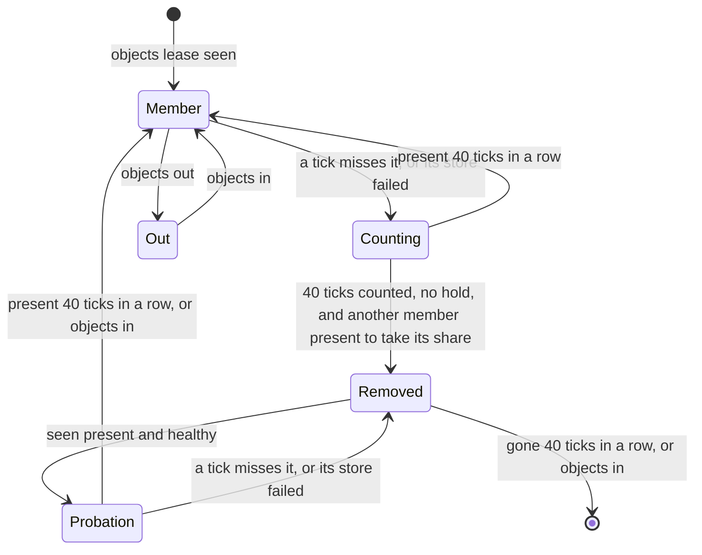

# Object Store

Where a company's **files** live, and why they are the one thing a fleet does
not copy onto every node.

Everything else the engine keeps durably — a task, a page, the history of both
— is held **whole** on every data node: each one applies the same ordered log
into its own identical copy (see [Scaling Out](scaling.md)). That is the right
shape for rows a seat reads on every turn. It is the wrong one for a
spreadsheet somebody uploaded, because files grow without bound and a fleet of
five would pay for every one of them five times.

So a file is split in two:

- **What the company has to agree on** — that the file exists, its path, its
  type, its version, who wrote it, which chunks make it up — is a row in the
  replicated estate, written through the tracker's log like any other change.
- **The bytes** are cut into chunks, and each chunk is kept by a few data nodes
  chosen by a **placement map** every node evaluates the same way.


```mermaid
flowchart LR
    W[upload] -->|1. chunks| P{placement map}
    P --> A[(node-a)]
    P --> B[(node-b)]
    P --> C[(node-c)]
    W -->|2. file row| L[[tracker log]]
    L --> A2[node-a estate]
    L --> B2[node-b estate]
    L --> C2[node-c estate]
    L --> D2[node-d estate]
```

Today the store holds [a project's files](../guides/work-tracker.md#a-projects-files).
It is built for more than that — chat attachments and anything else a row can
name by hash — and every consumer follows the same rule: the estate names the
object, and the map places its bytes.

---

## Chunks

A file is cut into **1 MiB chunks**, and each chunk is named by the SHA-256 of
its own bytes. The name is the whole address, which buys three things:

- **The same bytes are stored once.** Two files that share a chunk share its
  copies, and a file written again unchanged stores no new bytes.
- **Every byte is checked against its name, both ways.** A node refuses a chunk
  that does not hash to the name it was sent under, and a chunk that no longer
  hashes to its name on the way out is a disk that rotted: it is removed and
  reported missing rather than served, and repair fetches a good copy. A copy
  the disk will not return at all — a file that opens and then fails to read —
  goes the same way: removed and reported missing, so the chunk is fetched
  again rather than counted as held and never repaired.
- **A whole file is checked as well.** A file's row carries the hash of its
  entire content, and a download that does not reproduce it fails rather than
  handing somebody bytes that merely look complete.

A write is **durable before it is acknowledged**: each chunk goes to a
temporary file, is synced, renamed into place and its directory synced, so a
node that loses power holds either the whole chunk or none of it.

---

## Placement

### Slots, and groups that split

A chunk's **slot** is the first two bytes of its name — one of 65,536, fixed by
its bytes for ever. The slot is what a file's row stores beside each chunk and
what a data node's directory is laid out by, so nothing about a chunk is ever
rewritten when the map changes.

What the map places is a **placement group**: a run of consecutive slots. A
small fleet's map has 256 groups, and a map change is compared group by group
rather than chunk by chunk. The count is not fixed, because a node's share of the data
is a *count of groups*, and a count of a few groups is mostly noise: at 256
groups the fullest of thirty data nodes held about one and a half times its
fair share, and of two hundred more than two and a half times. So the count
**grows with the fleet** — to the smallest power of two that gives every data
node about a hundred group copies, Ceph's own target — up to one group per
slot.

Growing it **splits** every group in two: group *p* becomes *2p*, its lower
half, and *2p + 1*. The draws are seeded so that *2p* is held by exactly the
nodes that held *p* and only *2p + 1* is placed afresh, so a doubling
re-places **half** the data rather than all of it — 49.5% of the slots over ten
data nodes, measured. Groups never merge, since a merge would move the data a
split kept still, and a split waits for a fleet that has finished moving the
last change (see [The map](#splits-and-balances-each-an-epoch-of-their-own)).

### Which nodes hold a group

A group is held by as many **copies** as the map asks for, each on a different
data node, chosen by **straw2** — Ceph's own draw. Every node scores
`log(u) / share` for a number `u` hashed from the group and the node, and the
highest scores win. That is an exponential race, so a node's chance of the top
place is its share over the total; and adding a node moves only the groups it
now wins, while removing one moves only the groups it held. An eleventh node
joining ten at three copies over 1024 groups enters 26% of the groups, taking
8.7% of the copies against the 1/11 it is entitled to — and nothing moves
between the other ten.

The logarithm is computed in **integers**, as Ceph's `crush_ln` is, rather than
with the CPU's floating point: two nodes disagreeing in the last bit of a float
would place one group on two different holders.

### Weights, and the shares a balance finds

A data node's **weight** (`store.objects.weight`, 1 to 64) is the fraction of
the copies it should hold. Drawing by weight alone is proportional only for the
*first* copy: the second and third are drawn among the nodes left, so at three
copies over ten nodes a node of weight 4 would hold about 2.8 times what a
weight-1 node holds, not 4.

So the map carries a **share** per node as well: the number its draws are
divided by, found by a **balance** that lays the map out, counts every node's
copies, and corrects each share toward its weight — until every node holds
within **2%** of the copies its weight entitles it to, or sixty rounds have
passed. *Within 2%* is a statement about **group copies**: a node of weight 2
in a fleet of total weight 10, at three copies over 1024 groups, is entitled to
614.4 of the 3072 copies and holds between 603 and 626 of them. A slot is part
of a SHA-256 and therefore uniform, so the bytes a node holds follow its copies
once each group holds more than a handful of chunks.

**2% is promised only where 2% is at least a copy and a half** of a node's
target — 75 copies or more — because a copy count is a whole number: within 2%
of 24.5 copies lies neither 24 nor 25. The group count is sized so a node of
the fleet's mean weight is entitled to about a hundred copies, which puts every
node of an equal-weight fleet inside the promise, and every node of a mixed
fleet down to about three quarters of the mean weight — **unless a failure
domain is capped**. A domain holds at most one copy of each group, so the nodes
of a domain carrying more than a copy's worth of the fleet's weight divide only
the groups between them: twelve equal nodes in zones of one, one and ten at
three copies are entitled to 51.2 copies each over 512 groups, however equal
their weights. Within the promise, every fleet measured converged in at most 32
rounds, a median of five. Outside it the balance still nearly always lands
within 2% while that is at least a copy, less often below that: nine nodes of
weight 64 and one of weight 1 at three copies over 512 groups entitle the light
node to 2.66 copies, and it stays about 13% off. Such a balance stops at sixty
rounds with the closest layout it measured and says so, in the map itself: the
`balance` block on [`GET /fleet`](../reference/api-endpoints.md#get-fleet)
carries the deviation it reached, the tolerance and the rounds it ran. The
Fleet screen's placement card reads *not converged: 13.1% after 60 rounds*
where a balance that landed reads *balanced within 1.3%*, and `crewlet objects
status` says `NOT CONVERGED: after 60 rounds a member is still 13.1% off…` —
each beside every node's measured `share_percent`, which shows which node is
off. The logs carry it too, on whichever node ran the balance:
`balance_converged=false` on the map keeper's `object_map_changed`, and on the
`object_map_gesture` of the node that served an **out** or **in**. The cure is
more groups, not more rounds.

The balance runs wherever a change to what the map places is **written**: on
the node keeping the map, for its own tick's changes — a node joining or
removed, a weight, the copies, the label, the measurement after a split — and
on whichever node serves an operator's **out** or **in**, which applies the
gesture itself, up to three times if the map moves under it. It starts from the
shares the map already has, so that a small change moves little, and stores its
answer in the map — so no node **reading** the map recomputes it, and nothing
computed in floating point is ever compared between two nodes. What a balance
costs, and where that lands, is under [How far it scales](#how-far-it-scales).

### Failure domains

The company may name a node **label** — `zone`, `rack`, `host` — as its
[`objects.failure_domain`](../getting-started/configuration.md#objects). Each
data node's value of that label, from its own
[`node.labels`](configuration.md#nodelabels), is its **domain**, and a group's
copies then go to nodes in **different** domains: no two copies of anything in
one zone.

When the fleet spans fewer domains than there are copies, the extra copies go
to the best remaining nodes whatever their domain — so some groups keep two
copies in one domain — and the map says so (`domain_limited` on
[`GET /fleet`](../reference/api-endpoints.md#get-fleet)) rather than refusing
to place: a store that refused would lose writes to guard against a failure it
can no longer avoid. A data node **missing** the label is a domain of its own,
which never collides with anything; `crewlet validate` warns about one, because
its failures are ones the domain rule cannot see.

### Members that take no copies

A data node an operator has **taken out** stays in the map but takes no copies:
every group it held is placed on the others, and it sits at the very end of
every group's ranking, so a reader still finds the copies it holds until they
have moved. See [Taking a data node away](#taking-a-data-node-away).

A node **on probation** — one the map removed for being gone, now back and
proving itself stable — is placed exactly as an out member is, for the same
reason: it may hold the only copies of what it held when it went, and a node a
reader cannot find is a node whose copies read as lost. The two are separate
marks with separate ends — out is an operator's, lifted only by an operator;
probation the map's, lifted by the ticks — and a member can carry both. See
[Absence is counted in ticks](#absence-is-counted-in-ticks).

| | |
|---|---|
| Copies | the company's [`objects.replicas`](../getting-started/configuration.md#objects), 1 to 10 and 3 by default — a decision about the company's data, applied by every node from the same activation, never a node's own setting. A fleet with fewer data nodes than that keeps one copy on each, and reaches the full count as nodes join |
| Spread across | the company's `objects.failure_domain`, a node label key: no two copies of a group share its value while enough values exist. Unset spreads copies across nodes only |
| A write succeeds at | a majority of the copies placed: 2 of 3 |
| A node's share | `store.objects.weight`, 1 to 64 — set it in proportion to the space its directory has |

---

## The map

The map is one record in the coordination store, and every node places by the
copy of it that it last read — every 10 seconds, and at once by a node holding
none, so the first upload after a fleet's first map is written does not wait
for the next read. It carries:

- a **generation**, minted when the map is first written, so a map written
  after its key was lost — whose epochs start again — is never mistaken for
  the one before it;
- an **epoch** that moves whenever anything a placement depends on does;
- the **copies** and the **failure-domain label**, and the company activation
  they were read from;
- the group count;
- every member's **weight**, **share**, **domain**, and whether it is **out**
  or **on probation**;
- and what the node keeping it has to remember from one tick to the next: who
  is gone and for how many ticks, who was removed, an operator's hold, and who
  took which member out and why.

It is maintained by **one node at a time** — the `object-map` fleet duty, held
by a node with the `workers` role — once every **15 seconds**, a *tick*. Each
tick reads which data nodes are live and what the company says, and writes the
next map by compare-and-set, so a holder that lost the duty mid-write loses the
race rather than overwriting its successor. A brand-new fleet's first map is
written within a second of its first data node starting.

### The company's copies

The copies and the failure-domain label are read from the **company**
configuration running on the node that holds the duty, stamped with the
instant that configuration was activated. A tick applies them only from an
activation at least as recent as the one the map was last set by, so a holder
that has not yet applied the latest revision cannot set the map back — and the
duty moving between nodes cannot move the answer. A revision that changes
either takes effect at the next tick, with no restart. The decision, and what
the alternative cost, is
[ADR-0020](https://github.com/crewlet/crewlet/blob/main/adr/0020-the-company-decides-how-many-copies-and-across-what.md).

### Membership is the objects lease

A data node is a member while it holds its **objects lease**, `objects:{node}`:
a lease the object store claims for **itself**, renewed every 15 seconds and
given back only once the node has stopped serving chunks. It carries the
node's weight, its `node.labels`, its store's own [health](#health), and what
its [repair, collection and scrub](#keeping-the-copies-where-the-map-says) last
found.

It is deliberately not the node's presence. A shutdown **drain** gives presence
up at its very first step, while the node is still serving every chunk it
holds — so a drain longer than the grace below used to move the node's whole
share to the others and back. And presence carries what a node was configured
with, where the lease carries whether its store still works.

- **A data node that comes up is added** at its weight within one tick of its
  lease, starting from the share the rest of the fleet has for that weight —
  on probation, if it is one the map removed ([below](#absence-is-counted-in-ticks)).
- **A data node that goes away is noted, not removed** — and so is one whose
  store reports itself **failed**, because to everybody reading its chunks a
  node that answers for none of them is a node that is not there.

### Absence is counted in ticks

A member missing from a tick — no live lease, or a failed store — has that tick
**counted**. At **40** counted ticks, ten minutes at one every 15 seconds, it is
**removed**, and every group it held is re-placed on the members that remain.
Ten minutes is the interval Ceph waits before marking a device out, for the
same reason: a restart, a reboot and a rolling upgrade's turn at a node are all
minutes, and removing a node moves its whole share across the fleet.

It is a **count, never a deadline**. The node keeping the map changes, and each
has its own clock: a deadline compared across two clocks would be stretched or
skipped by the skew between them. A tick is counted only by the node making it,
so a gap while the duty moves delays a removal — the safe direction — and never
hastens one.

A member that comes back keeps the ticks it has counted until it has been
present **40 ticks in a row**. That is what removes a member that **flaps**:
up for thirty seconds in every few minutes, it is never gone ten minutes at a
stretch, and a count cleared on any single sighting would keep it placed on
for ever while it was mostly gone.

A node removed for absence is **remembered**, so that a flapping node is not
placed on and removed again every cycle. Seen back, present and healthy, it is
a member again **at once, on probation**: at the tail of every group's ranking,
so readers and repairs find whatever it held when it went — for a group whose
other holders went with it, the only copy there is — but placed on nothing. It
is trusted, and placed on again, once it has been present 40 ticks in a row. A
tick that misses it while it is on probation removes it again at once, its
count lost — leaving is exactly what it was being watched for — and a hold does
not keep it, since it holds no share for a hold to protect. A removed node gone
40 ticks in a row is forgotten, and rejoins like any new node. `crewlet objects
in` vouches for a removed node instead: one on probation is placed on at once,
and one not seen since is placed on from its next sighting.

The map never removes a member **onto nothing**. A member that takes copies is
removed only while some other member that takes copies is present and healthy
**on that same tick** to take its share. So a whole tier going dark together —
a zone lost, the data nodes cut off from the coordination store — removes
nobody however long it lasts, rather than removing every member but the last
onto others that are just as gone, and the map is as it was when the tier
returns. `crewlet objects out` asks the same question, and refuses to take out
the last member present to place copies on.


```mermaid
stateDiagram-v2
    [*] --> Member: objects lease seen
    Member --> Counting: a tick misses it, or its store failed
    Counting --> Member: present 40 ticks in a row
    Counting --> Removed: 40 ticks counted, no hold, and another member present to take its share
    Removed --> Probation: seen present and healthy
    Probation --> Member: present 40 ticks in a row, or objects in
    Probation --> Removed: a tick misses it, or its store failed
    Removed --> [*]: gone 40 ticks in a row, or objects in
    Member --> Out: objects out
    Out --> Member: objects in
```

### Holding the map

For maintenance known to outlast ten minutes, **hold** the map
(`crewlet objects hold -for 2h`, or **Hold map** on the Fleet screen): no member
is removed while the hold lasts, and absences go on being counted, so a node
still gone when it ends is removed at the next tick. A hold lasts at most a day
and always ends by itself — Ceph's `noout` has no expiry, and a flag set for a
maintenance window and forgotten pins a dead node's groups a copy short until
somebody notices. Holding changes no placement and moves no epoch.

A hold sent again **replaces** the one in force, with its length counted from
the resend: a hold is the operator saying, now, how much longer the maintenance
needs, so the newest statement stands — a shorter one included, which ends the
hold sooner. A member on probation is not kept by a hold: it holds no share for
the hold to protect, and a tick that misses it removes it again.

### Splits and balances, each an epoch of their own

A map whose group count is short of its fleet's target **splits** one bit at a
tick — and only on a **clean** fleet: no member counted absent or on
probation, and every member that takes copies finished a repair at the current
epoch with nothing pending. A split re-places half the data, so it never starts while the last
change's data is still moving. The epoch that splits changes nothing else, so
every lower child keeps its parent's holders exactly; the next tick measures
the split map and, if it is more than 4% out of balance, balances it as an
epoch of its own. Each moves as little as it can.

Every other change to what the map places — a member added, removed, taken out
or put back, a weight, the copies, the label — is balanced in the epoch that
makes it.

### A node on an older map

A node reading an older epoch places by the older map, which is correct for as
long as it takes to read the next one: nothing a newer map moves is deleted
from where the older one put it until the new holders have confirmed their
copies (below).

---

## Writing and reading

**A write goes to the group's holders in parallel**, over the broker — the one
channel every node already has; the object store opens no port of its own.
When a holder does not answer, or refuses because its own store is **full** or
**failed**, the write goes to the **next node in the same ranking** instead, so
a node that is down costs a copy in a different place rather than a copy
fewer. A write never goes to a member the map does not place on: one that is
**out** is being emptied, and one [on probation](#absence-is-counted-in-ticks)
goes straight back to removed at its next missed tick, so a majority counted on
it would be counted on the member the fleet has least reason to trust. The
write is reported stored once a majority holds it; fewer is an error, never a
success with a footnote.

**An upload stores every chunk before it writes the row** that names them. A
file that is listed is therefore always a file whose bytes the fleet holds, and
an upload cut off halfway leaves only chunks nothing names, which the collector
removes a day later.

**A read looks on this node first**, then down the same ranking a write walks:
the group's holders, then wherever a displaced write or an older map left a
copy, members taken out or on probation last. A holder that did not answer is asked last for 30
seconds, so a dead node costs one timeout per reader rather than one per chunk.
A download streams, a few chunks ahead, and never holds the file in memory.

A read that finds a chunk nowhere says which of two things is true, because
only one of them is lost data: **missing** when every member answered that it
has no copy, and **unreachable** when some member could not say — it did not
answer, refused, or could not read its own copy.

---

## Keeping the copies where the map says

Every data node runs three passes over its own directory. Repair and
collection take turns on one loop, because a repair copying a group in and a
collection judging the same group at the same instant would each be reasoning
about a directory the other is changing. The scrub runs beside them, because it
only checks bytes against their names and decides nothing about which chunks
belong.

**Repair** — as soon as this node reads a map with a new epoch, which is within
about twenty seconds of it being written, and every 10 minutes regardless. It
first waits for this node's estate to reach everything the log had committed,
so a node back from being away repairs what was written while it was gone.
Then, for every group the map places on this node, it lists the chunks the
estate names in that group's slots and fetches the ones it lacks — four at a
time, a recovery throttle in the sense of Ceph's `osd_recovery_max_active`, so
a node handed a large share cannot saturate the broker every upload and read
also rides. The inventory is **derived, never kept**: which chunks exist is
what this node's own tables name, so there is no second list to drift from
them.

A pass reports what the map places here, what it holds, what it fetched and
what is still **pending**, and splits what it could not fetch in two:
**missing**, a chunk every member answered it does not hold, which raises
[`objects_missing`](../reference/alarms.md); and **unreachable**, one a member
that did not answer may hold. A pass that did not finish, or left anything
unreachable, is tried again after 30 seconds, then a minute, doubling up to the
ten-minute interval.

**Collection** — every hour, and once more for every new epoch as soon as the
fleet has **settled** at it: every member the map places on has finished a
repair at that epoch with nothing pending. That is the moment every copy the
epoch moved away from a node is held by the members it now belongs to, so it is
when those copies can go — and a member taken out holds its whole share of
them. Every node checks for it on its ten-second poll, once its own repair at
the epoch has finished, reading the members' reports off their objects leases,
which are renewed every heartbeat (15 seconds by default): the pass starts
within about half a minute of the last member finishing. A pass that fails, or that keeps copies because a
member did not confirm its own at that moment, is tried again after 30 seconds,
then a minute, doubling up to the hour. Deleting is the only dangerous thing
any pass does, so it has two rules:

- **A chunk nothing names** is deleted once it is more than **24 hours** old
  *and* this node's copy of the estate is both current and complete: the pass
  first waits for everything the log had committed when it started, and
  deletes nothing unnamed while this node holds a record it could not apply —
  that record might be the one naming the chunk. The 24 hours cover the other
  window: bytes are uploaded before the row that names them, so every chunk
  starts its life unnamed. Uploading the same bytes again restarts the clock.
- **A chunk that is named but that the map no longer places here** — a
  **stray**, left by an older map, by a write that went past a silent node, or
  on a member taken out — is deleted only when *every* node the map places it
  on says it holds an **intact** copy, read and checked against its name before
  it answers, **and** that its own map places the chunk there, at the same
  epoch. "It has a copy" alone is not enough: two nodes reading different maps
  could each vouch for the other and both drop theirs, and a copy that rotted
  must never vouch for deleting a good one. A node the map does not hold at all
  deletes no stray: it has just come back and not yet been re-added, and what
  it holds may be the copy the members have not repaired yet. Nor does a member
  on probation, unless it is also taken out: the tick that trusts it gives it
  back most of the same groups, so dropping them while it proves itself would
  copy its share away only to copy most of it back.

Each collection counts the strays it still holds, which is what an operator
waits on before stopping a node that was taken out. A node reports that count
only from a collection that walked its whole disk at the map's current epoch —
a pass that stopped short never looked at most of it, and a node taken out at
epoch N held no strays at all under N−1 — so until one has, the count is
absent rather than zero.

**Scrub** — continuously, a slot after another. A chunk is checked against its
name whenever it is read, but a chunk nobody reads is never read, so the scrub
reads every chunk this node holds once a **week** — Ceph's deep-scrub interval
— paced to spread the week, never slower than 1 MiB/s nor faster than 32 MiB/s,
so it never competes with serving. A chunk that rotted is removed and counted,
and the next repair fetches a good copy while the other copies are still good.
A chunk the disk will not return at all is counted apart, as **unreadable**:
one that opens and then fails to read is removed for repair to replace as a
rotten one is, and one the disk will not even open is counted and left where it
is — a permissions fault must not empty a healthy store — and counts toward the
store's [health](#health). Either way the scrub steps past it rather than
stopping on it, so a count that keeps rising is a disk failing chunk by chunk,
and `crewlet objects status` and the Fleet screen say so. What stops a scrub
outright — a directory the disk will not list — is reported beside the counts,
and the scrub tries again shortly.
Its place in the week is kept in the chunk directory (`.scrub`), so a restart
resumes the week rather than starting it again.

---

## Health

A data node's store says whether it can hold chunks, and the map acts on it.
Every 15 seconds the node **probes** its own directory — writes, syncs, reads
back and removes a small file — and measures the volume:

| State | When | What happens |
|---|---|---|
| `ok` | the probe works and the volume is under 85% used | nothing |
| `nearfull` | 85% used — Ceph's `nearfull_ratio` | still takes new chunks, and raises `objects_store_nearfull` |
| `full` | 95% used — Ceph's `full_ratio` | refuses every new chunk, so a writer puts the copy on the next member; still serves what it holds; raises `objects_store_unhealthy` |
| `failed` | a probe failed, or three chunk operations in a row failed on I/O | counted **absent** by the map, and removed after the grace; raises `objects_store_unhealthy`. The next probe that works clears it |

The state rides the node's objects lease, so the map, `GET /fleet` and
`crewlet objects status` all read the node's own account of it.

## Alarms

Four [alarms](../reference/alarms.md) belong to the object store, each raised
on the node it describes:

| Alarm | Raised when |
|---|---|
| `objects_missing` | a chunk the map places on this node is held by **no** member — every member asked answered that it has no copy. Counted by the last completed repair: a pass that stopped short can raise the count but never clear it. A removed node that comes back is a member on probation from its first tick, so a chunk only it held is found, not missing |
| `objects_degraded` | this node's last completed repair at the current epoch left chunks pending, or no repair has completed for more than **twice** the ten-minute repair interval — counted from the last completed repair at the current epoch, or from when the node first placed by that epoch if none has — so a repair loop that keeps failing raises it while the map stands still: some files have fewer copies than the company asked for |
| `objects_store_unhealthy` | this node's store is `failed` or `full` |
| `objects_store_nearfull` | this node's volume is past 85% used |

Each fires at a threshold another decision already made — twice the repair
interval, the full and nearfull marks — rather than at one of its own. Twice,
because measured from the last completed pass a healthy node crosses one
interval every cycle: the next pass is due an interval later and then takes its
own time to finish.

---

## Running it

A data node needs nothing configured: it keeps its share in `objects/` beside
its database and offers a share of weight 1.

```yaml
store:
  path: /var/lib/crewlet/company.db
  objects:
    dir: /mnt/objects     # a separate volume, once files outgrow the database's
    weight: 4             # four times the share of a weight-1 node
```

How many copies, and across what, is the **company's**, in Tier B:

```yaml
objects:
  replicas: 3             # 1..10; unset is 3
  failure_domain: zone    # a key every data node sets under node.labels
```

See [Configuration](../getting-started/configuration.md) for every field.

**A node without `data` holds no chunks.** A [stateless node](scaling.md#a-node-that-holds-no-data)
reads and writes files exactly as a data node does — through the nodes that
hold them — and `store.objects` is refused on it.

**Sizing.** A fleet holds each chunk `objects.replicas` times, spread across the
data nodes by weight. Three data nodes of equal weight at three copies each
hold every chunk; a fourth takes about a quarter of every node's share onto
itself and frees that space on the others.

**Adding a data node** needs nothing beyond starting it. It is in the map
within one tick of its objects lease — 15 seconds — and repair moves its share
onto it. An upload in a brand-new fleet's first second, before any map exists,
is refused as unavailable rather than stored nowhere.

### Taking a data node away

Take it **out** first — `crewlet objects out <node> -confirm <node>`, or
**Take out** on the Fleet screen. The map stops placing on it, and its share is
copied to the other members *while it keeps serving every chunk it holds*, so
the removal is a copy from a live source rather than a recovery from the
survivors. Then:

1. **Wait for `crewlet objects status` to say the node may be stopped for
   good**: every member has finished a repair at the map's current epoch with
   nothing pending, and the node itself holds no strays. It counts those in a
   collection that starts within about half a minute of the last member
   finishing, not on the hour; until that pass has walked its whole disk the
   count is absent, and the status says to keep waiting.
2. **Stop it.** Ten minutes later the map removes it.

A node taken out and then wanted back is put back with `crewlet objects in`.
Taking out the last member present to place copies on is refused: every write
would have nowhere to land. So is taking out a node the map has already removed
and not seen back (`removed_member`): nothing is placed on it to move, and `in`
is the gesture that names it. A member on probation can be taken out, and stays
out once its probation ends.

A gesture whose answer was lost can be sent again. An out, an in or a release
the map already says changes nothing — the record of who took a member out,
why and when included — and writes nothing. A hold always writes: sent again,
it replaces the one in force and its length is counted from the resend, so read
`crewlet objects status` before re-sending one.

A node that is simply **stopped** is re-placed ten minutes later, and the
remaining nodes repair from each other's copies. At three copies the fleet
survives any one loss, not two at once — so take one node away at a time, and
never stop another while `objects_degraded` is raised on any member.

### Restarting one

A restart moves nothing if the node is back within ten minutes. For longer
maintenance, **hold** the map first and release it once the node is back. In a
rolling upgrade, `crewlet objects status` says when the fleet has settled and
the next data node may be stopped.

### Watching it

The dashboard's Fleet screen and `crewlet objects status` draw the map from
[`GET /fleet`](../reference/api-endpoints.md#get-fleet) — each data node's
measured share, its domain, how many copies of every chunk the fleet holds
against how many the company asks for, whether the last balance brought every
share within its tolerance or ran out of rounds short of it, how far a member's
absence or probation has run, its store's health, what its last repair left
pending, the strays it holds and what its scrub could not read — and say what
the fleet is still waiting for before the next data node may be stopped.

**Backups carry every chunk.** A node holds only its share, so a copy of its
directory is a fraction of the company's files. A backup instead reads every
chunk the store copy names, from wherever the fleet holds it, into an
`objects/` directory beside the database copy, laid out as a data node's own
directory is — see [Backup and restore](../guides/backup.md).

---

## How far it scales

The object store is built so that the **bytes** grow with the fleet, and it is
plain about what does not:

- **The map is cheap to read, and its balance is bounded.** Laying out every
  group's holders takes about 12 ms at 50 data nodes over 2048 groups and
  185 ms at 200 over 8192, once per map on each node. A balance at 200 data
  nodes takes about half a second when it converges — thirteen rounds for an
  equal-weight fleet — and at most about 1.8 s when it cannot, holding a table
  of up to 32 MiB; at 50 data nodes, 25 ms and 120 ms. It is paid by the node
  keeping the map on its tick, and by **whichever node serves an operator's
  out or in** — an ingress node included — up to three times per gesture if
  the map moves under it, so size a node that serves those gestures for it.
  The finest map — a group per slot — still gives about two thousand data
  nodes their hundred copies each at three copies.
- **Every data node is a broker member.** On an embedded stream a data node
  holds a share of the broker's replicas and votes in its quorums — Tier A
  refuses a data node on a leaf until the partitioned estate is live — and chunks
  travel over the broker's routes: an upload of a 1 GiB file at three copies
  is three gibibytes across them. Adding data nodes for space adds members to
  the broker's cluster as well.
- **The estate is still whole on every data node.** Only file bytes are placed.
  Every row — a file's included — is on every data node, so the estate is
  bounded by the smallest data node's disk however many there are.

## What it does not do

- **It does not place the estate.** Tasks, pages and every other row are still
  whole on every data node; only what a row can name by hash is placed.
- **It does not version bytes on its own.** A new version of a file is a new
  row naming new chunks; the previous version's chunks are collected once no
  row names them.
- **It is not for artefacts larger than 1 GiB.** Those belong in a store built
  for them, with a link in the project.

The decisions are
[ADR-0019](https://github.com/crewlet/crewlet/blob/main/adr/0019-the-estate-names-an-object-and-a-map-places-its-bytes.md)
— the estate names an object, and a map places its bytes — and
[ADR-0020](https://github.com/crewlet/crewlet/blob/main/adr/0020-the-company-decides-how-many-copies-and-across-what.md)
— the company decides how many copies, and across what.
