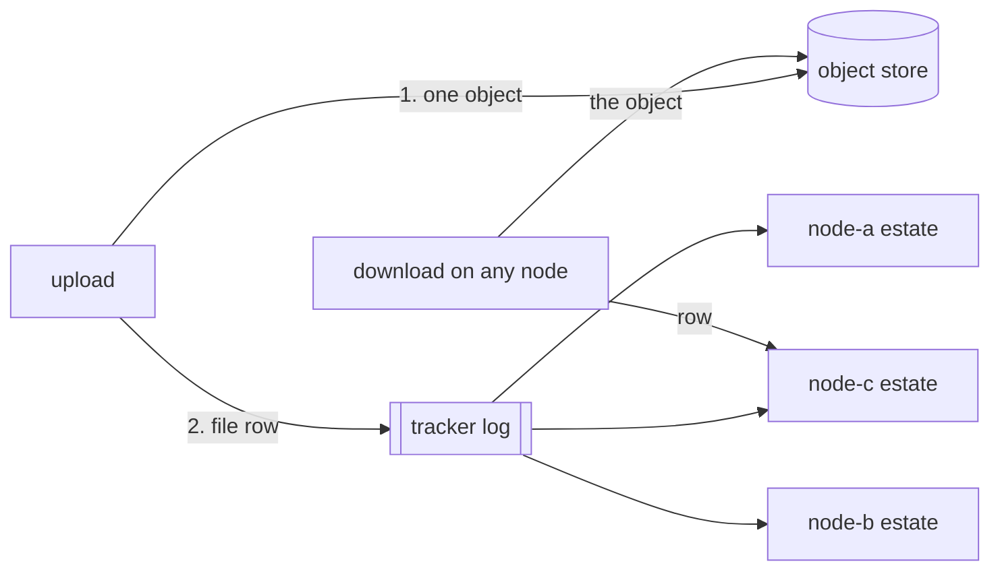

# Object Store

Where a company's **files** live, and why they are kept apart from everything
else a fleet holds.

Everything else the engine keeps durably — a task, a page, the history of both
— is held **whole** on every data node: each one applies the same ordered log
into its own identical copy (see [Scaling Out](scaling.md)). That is the right
shape for rows a seat reads on every turn. It is the wrong one for a
spreadsheet somebody uploaded, because files grow without bound and are read
rarely, so a copy of each in every data node's database is a cost nothing
reads back.

So a file is split in two:

- **What the company has to agree on** — that the file exists, its path, its
  type, its version, who wrote it, its size and SHA-256, and the key of the
  object holding its bytes — is a row in the replicated estate, written
  through the tracker's log like any other change.
- **The bytes** are **one object** in **one store the whole fleet shares**: by
  default a bucket on the fleet's own broker, replicated across its members
  like every stream, or an S3-compatible bucket.


```mermaid
flowchart LR
    W[upload] -->|1. one object| S[(object store)]
    W -->|2. file row| L[[tracker log]]
    L --> A[node-a estate]
    L --> B[node-b estate]
    L --> C[node-c estate]
    R[download on any node] -->|row| C
    R -->|the object| S
```

Today the store holds [a project's files](../guides/work-tracker.md#a-projects-files).
It is built for more than that — chat attachments and anything else a row can
name by key — and every consumer follows the same rule: the estate names the
object, and the store keeps its bytes.

---

## One object per upload

Every upload is stored as **one object under a key minted for that upload**,
and a key is never used again. The key is a UUIDv7 — random bits, plus the
instant it was minted — written by the node that receives the bytes,
immediately before it streams them into the store. It is never derived from
the content, the request or the person, so two uploads of the same bytes are
two objects, and a retry of one upload is a second object rather than the
first one again.

That one rule is what the rest of this page leans on:

- **A row names the object it was written with, and nothing else ever names
  it.** No later write can re-use an object somebody else stored, so the
  collector deleting an object nothing names has no writer to race (see
  [Why a deletion needs no lock](#why-a-deletion-needs-no-lock)).
- **The row checks the bytes, not the name.** The key says nothing about what
  the object holds, so the file's row carries the SHA-256 and the size of its
  whole content, computed while the upload streamed, and every read is held
  to both.
- **There is no dedupe.** The same bytes written twice are stored twice, and
  so is a file that is moved: a move is a write at the new path and a removal
  of the old one, and the write uploads the bytes again. A seat writing a file
  whose content is exactly what the file already holds is told so and writes
  nothing. The older copy is deleted by the collector's next hourly pass once
  nothing names it and it was uploaded more than a day ago, so a copy older
  than a day goes within the hour of being replaced or removed. The day is the
  grace an upload gets before the row naming it lands, not a window in which a
  replaced version can be recovered from the store.

---

## Where the objects live

`store.objects` in the [bootstrap config](../getting-started/configuration.md)
names the backend. It is **Tier A** — an endpoint, a bucket and the
credentials to reach it are the operator's, like the stream — and **every node
carries it**, a node without `data` included: an upload or a download on a
stateless node goes to the store directly, exactly as on a data node.

Every object the engine stores is named `files/<key>` — under the prefix, on
S3 — so a store shared with anything else keeps the engine's objects in a
corner of their own.

### The fleet's own bucket — `nats`, the default

```yaml
store:
  objects:
    backend: nats   # or leave the block out
```

The objects go into a JetStream **object store** bucket, `crewlet_files`, on
the same broker every log already runs on, in NATS's own object store format —
so `nats object ls crewlet_files` and `nats object get` read it. It is backed
by an ordinary stream (`OBJ_crewlet_files`), created at boot at
**`stream.replicas`** copies — so the company's files survive exactly what its
logs survive, on the same members:

- **The data nodes are the broker's members**, and they keep the copies. A
  three-node fleet at `stream.replicas: 3` holds every object three times, one
  on each; a member that fails is caught up by the broker as every other
  stream is, and there is no repair, map or membership for the engine to run
  beside it.
- **An object is a run of 128 KiB messages**, closed by one message naming
  them — so an upload holds 128 KiB of it at a time, and a stateless node's
  upload never holds its leaf link for longer than one message takes to
  cross.
- **A node without `data` reaches the bucket across its leaf link**, with the
  rest of the fleet's JetStream API — it holds nothing.
- **The bucket is created once and never rewritten.** A node looks the bucket
  up at boot and creates it only when it is not there; a node that finds it
  binds it as it is, whichever node made it. A bucket kept at fewer copies
  than this node's `stream.replicas` stops the node from starting, naming the
  setting, rather than taking uploads it would prove fewer copies of. Every
  node used to write the bucket's configuration on every boot, and on a fleet
  booting together that write was never answered for fifteen seconds. A
  lookup and create still running after ten seconds says so, once, as
  `natsobj_bucket_slow` — see [Deployment](../guides/deployment.md#a-clustered-node-is-given-longer-to-create-them).
- **A read the broker loses its reader under carries on.** A download, a
  listing and a page's walk each read through a consumer the broker keeps for
  them, and a broker that loses it part way — reaped under a slow reader, or
  gone in a leader change — gets a new one, made from the last message read,
  so every byte and every name still arrives exactly once. It is made within
  **ten seconds** of the loss (the request it was waiting on expiring), where
  it used to take thirty.
- **A delete marker another client left is no object.** The engine deletes by
  purging, but `nats object rm` — or any other client of the format — leaves a
  marker under the name. The engine reads the name as holding nothing, and
  the collector lists it and clears it like any other object no row names.
- **Quorum is the broker's.** Every message of an object is a replicated
  stream append, so it needs a majority of the stream's replicas, as a tracker
  write does: a three-member fleet keeps writing files with one member down,
  and a two-member fleet at two replicas cannot write with either down. What
  an object holds is read from the stream's **leader**, so a file uploaded on
  one node is readable on the next the moment its upload answered. Nothing
  about files changes what a fleet of a given size survives — it is the same
  arithmetic as its logs (see [Scaling Out](scaling.md)).
- **A backup carries it as a stream.** The stream snapshot every backup takes
  includes `OBJ_crewlet_files`, so no object is copied on its own; a restore
  brings the bucket back with every other stream.

What it costs is that **every member holding a copy holds every object**: the
bucket is one stream on one replica set. For the three or five data nodes a
fleet runs that is what any placement would have done anyway. A company whose
files outgrow one member's disk, or that would rather its files lived in
storage it already runs, takes the S3 backend.

The stream declares **no byte ceiling**, unlike the state logs: the engine
reserves disk for the company's own records, whose growth the trim governs,
and the bucket is bounded by the collector instead, which deletes what no row
names a day after it was written. Size the members' disks for the files as
well as the logs.

### An S3 bucket — `s3`

```yaml
store:
  objects:
    backend: s3
    s3:
      endpoint: https://s3.eu-west-1.amazonaws.com   # empty: Amazon's own for the region
      region: eu-west-1                              # required; R2: auto, MinIO: us-east-1
      bucket: acme-files
      prefix: crewlet/                               # optional: one bucket, several companies
      path_style: false                              # true for MinIO and most self-hosted gateways
      access_key_id: ${S3_ACCESS_KEY_ID}             # both, or neither for the SDK's own chain
      secret_access_key: ${S3_SECRET_ACCESS_KEY}
```

Each object is one S3 object, `<prefix>files/<key>`. Any S3-compatible store
works — Amazon S3, Cloudflare R2, MinIO, Ceph's gateway, GCS through its
interoperability endpoint. The bucket keeps whatever copies its provider
promises, and its size is the provider's problem rather than any node's disk.

- **An upload of up to 8 MiB is one `PutObject`; a larger one is a multipart
  upload** of equal 8 MiB parts, sent one after another through one buffer, so
  an upload holds 8 MiB in memory whatever the file's size. An upload that
  fails part of the way through is aborted; one a process was killed in the
  middle of is aborted by the [collector](#unfinished-uploads) a day later.
- **Credentials** are `${VAR}` references resolved at boot, or neither, which
  takes the SDK's default chain: the environment (`AWS_ACCESS_KEY_ID`…), a
  shared profile, a web identity token or the instance's role.
- **The identity needs six permissions** on the bucket and its objects under
  the prefix: `s3:PutObject` (a single upload, and every step of one in parts),
  `s3:GetObject`, `s3:DeleteObject`, `s3:ListBucket` (the check at boot and the
  collector's listing), and `s3:ListBucketMultipartUploads` and
  `s3:AbortMultipartUpload` (finding and aborting unfinished uploads). Without
  the last two, uploads still work and the collector reports what it could
  not sweep as `sweep_error`.
- **A private CA** is read from `AWS_CA_BUNDLE`, added to the system roots for
  the bucket's requests only.
- **The bucket is checked at boot.** A node that cannot reach it, or whose
  credentials it refuses, does not start — a node that started anyway would
  accept an upload it could not store.
- **Every request goes out from the node that serves the upload or the
  download**, a stateless node included, so every node needs to reach the
  endpoint.
- **Every request carries a deadline of its own**, so a bucket that stops
  answering fails the request rather than holding it: thirty seconds for one
  that moves no body, the same plus thirty seconds a mebibyte for one that
  carries bytes up, and five minutes for completing an upload made in parts. A
  read is bounded by the reader's own deadline (see
  [Writing and reading](#writing-and-reading)).
- **The prefix is optional**, and with or without one the engine touches only
  names under its own `files/` corner: another application's objects in the
  same bucket are never listed as the engine's, judged or deleted.

### One store per fleet

The first node to boot records the store it was configured with in the
coordination store — `nats`, or `s3:<endpoint>/<bucket>/<prefix>` — and every
node after it compares its own: **a node configured with another store refuses
to boot**, naming both. Two nodes writing to two stores would each list files
whose bytes the other cannot read, and each one's collector would see the other
store's objects as nothing at all. Credentials are not part of the record — two
nodes may reach one bucket with different keys.

Moving a company from one store to the other is a migration, not a config
change: copy every object across (on S3, `objects/` in a backup is exactly the
bucket's layout under the prefix), stop the fleet, delete the `backend` record
from the `crewlet_objects` coordination bucket, and boot every node with the
new block.

---

## Writing and reading

**An upload stores its object before it writes the row** that names it. A
file that is listed is therefore always a file whose bytes are in the store,
and an upload cut off halfway leaves only an object nothing names, which the
collector removes a day later. Before any of the body is read, an upload whose
declared length is already over 1 GiB, or whose project does not exist or is
archived, is refused. While it streams, the node counts and hashes every byte,
and the 1 GiB limit ends the upload the moment the body passes it — leaving
nothing behind in the store. **A body ends only where the client ended it**:
one cut short — a connection that closed mid-body included — is refused, never
recorded as the part of the file that arrived.

**A row must be written within twelve hours of its key being minted.** The
write is refused (`409 upload_expired` over REST) when the upload took longer
than that — far more than the slowest upload the API accepts (1 GiB at thirty
seconds a mebibyte is eight and a half hours). That bound is what lets the
collector delete without a lock. **A refused write deletes nothing**: the same
write may already have landed through another node, so its object is left for
the collector, which removes it a day later if nothing names it.

**A download streams** and never holds the file in memory. Every byte is
counted and hashed on its way out, and **the last bytes are held back until
the whole file has checked out** against its row's size and SHA-256: a stored
object whose content is not what the row records is never handed over whole.
Over HTTP that is a download that ends short of its `Content-Length`; a
corruption found before the response began is a `500 content_corrupt`.

A read is bounded twice: by a deadline that grows with the file's size — a
minute, plus thirty seconds a mebibyte on each of the two legs its bytes
cross, from the store to the node and from the node to whoever is reading —
and by a **stall** limit, which ends a read whose store has handed over
nothing for a minute. A store that stops answering part way through a
download therefore cuts it within a minute rather than holding it for hours.

**A seat reads a file a page at a time** (`read_project_file`). A page is
checked for its length only — a part of a file cannot be held to the whole
file's hash. On S3 a page is one ranged request. On `nats` there is no ranged
read of an object, so a page deep into a large file first walks the headers of
every 128 KiB message before it — a few dozen bytes each rather than the bytes
themselves, but still work that grows with the page's offset. A seat reads
pages near the start of a file far more often than pages a gibibyte in.

---

## Collection and audit

An object is never deleted when its file is: the delete is a row, and the
object is garbage from then on. Instead one data node at a time — the
`object-collector` fleet duty — runs two passes against the store, both
judged against the replicated estate the data node holds:

- **Collection, hourly.** It pins the estate (a barrier on the tracker's log,
  so it reads every row committed when it began), lists the store, and deletes
  every object **stored more than a day ago, whose key was minted more than a
  day ago, that no row names**. The day is the grace an upload in flight is
  given between storing its object and writing its row. Only a name under the
  engine's `files/` corner is the collector's: anything else in the bucket, or
  under the prefix, is never counted, judged or deleted. A collection that
  cannot read the whole estate — this node holds a record it could not apply
  — **stops deleting**: a row it could not read may name any object, and the
  report says what it deleted before it stopped and why it stopped.
- **Audit, daily.** It asks the store about every object a row names, a page
  of rows at a time. An object the store does not hold (**missing** — asked
  about once more at the end of the pass, before it is called so) or holds at
  another size, or under another SHA-256 where the store keeps one
  (**damaged** — `nats` keeps one, S3 does not), is a file that cannot be
  downloaded, and raises [`objects_missing`](#alarms) naming the first hundred
  such files as `PROJECT/path`.

A pass that fails is tried again ten minutes later. The duty records each pass
in the coordination store, so every node's [`/fleet`](../reference/api-endpoints.md#get-fleet)
and `crewlet objects status` show the same report, naming the node that ran it,
and a node taking the duty over picks up the schedule and the last audit's
findings where the last holder left them, rather than running both passes
again or forgetting what was missing. An audit that fails never hides what the
last one to run to its end found.

### Unfinished uploads

An upload that died part of the way through — a node killed mid-upload, or a
delete interrupted between its two halves — leaves bytes **no name reaches**:
on S3 a multipart upload nobody completed or aborted, which the provider bills
for; on `nats` the messages of an object no closing message names. No listing
of the store's names shows them, and each can be a gibibyte. So every
collection also asks the store for them and abandons each begun more than a
day ago — every upload still in flight is unfinished too, and none takes that
long — unless it was being stored under somebody else's name. The count is
`abandoned` in the report; a store that refuses the question (an S3 identity
without `s3:ListBucketMultipartUploads` or `s3:AbortMultipartUpload`) is
reported as `sweep_error` and does not fail the collection.

### Why a deletion needs no lock

The collector's danger is deleting an object at the moment a write comes to
name it. With one object per upload, the only write that can ever name an
object is the one that uploaded it — so the question is only whether that
write can land **after** the collector judged the object unnamed. Two rules
close it:

- **A write may name a key minted at most twelve hours before it is
  decided**, by the deciding node's clock, and is refused otherwise.
- **The collector deletes only an object whose key was minted, and which was
  stored, more than a day ago**, by its own clock, and that a complete,
  pinned estate does not name.

An object the collector deletes is past the twelve hours by a margin of twelve
more, so no write that could still land can name it. The rule holds as long as
the clocks of the node deciding a write and the node running the collector
disagree by less than that margin. There is no lock, no second look and no
coordination round trip, and two collectors running at once are safe —
deleting an object that is already gone is not an error. The decision is
[ADR-0027](https://github.com/crewlet/crewlet/blob/main/adr/0027-a-deletion-from-the-shared-store-needs-no-lock.md).

---

## Alarms

| Alarm | Fires when |
|---|---|
| `objects_missing` | the collector's last audit to run to its end found files whose object the store does not hold, or holds at the wrong size or under the wrong digest — on the node holding the collector's duty, since one node's audit of a shared store is the fleet's |

A missing or damaged object is a store that lost or changed bytes it
acknowledged: check the store's own health (the `OBJ_crewlet_files` stream on
the data nodes, or the bucket's) and restore the files the report names from a
[backup](../guides/backup.md), or upload them again.

---

## Running it

### Choosing a backend

Keep **`nats`** unless a reason below applies. It needs nothing the engine does
not already run, survives what the logs survive, and is backed up with them.

Take **`s3`** when:

- the files will outgrow a data node's disk — every member keeps every object;
- the company already keeps its data in a bucket it backs up, versions or
  replicates across regions on its own terms;
- the fleet's broker is an external NATS cluster whose operators would rather
  not hold files.

**A versioned bucket keeps every object the collector deletes**, as a
noncurrent version, for as long as the bucket's own rules say — and every
upload is an object of its own, so a file rewritten daily leaves a noncurrent
copy of itself every day. Give a versioned bucket a lifecycle rule that expires
noncurrent versions (S3's `NoncurrentVersionExpiration`, or your provider's
equivalent) after however long you want deleted files recoverable, or its size
grows for the life of the company.

**An S3-compatible gateway must date what it lists.** The collector judges an
object's age by the `LastModified` its bucket listing carries and an unfinished
upload's by its `Initiated`, and a gateway that leaves either out has the
engine leave that entry alone rather than read it as older than every grace —
which would abandon an upload still in flight. Such a pass reports what it
left alone in its `error` (an object) or `sweep_error` (an upload) on
`crewlet objects status`. Uploads left that way are billed until the bucket
aborts them itself, so give such a bucket a lifecycle rule for incomplete
multipart uploads (S3's `AbortIncompleteMultipartUpload`).

### Taking a data node away

There is nothing to drain for the files. On `nats` a member that leaves is a
broker member leaving, handled as for every stream (see
[Fleet](../guides/fleet.md)); on `s3` no node holds an object at all.

### Watching it

`crewlet objects status` prints the store, the node that ran the last passes,
and what each found; `--json` prints the fleet answer's `objects` block. The
dashboard draws the same under **Settings › Nodes**.

---

## How far it scales

- **`nats`: the copies follow the broker.** The bucket lives on the stream's
  replica set, so its capacity is the smallest member's disk and its write
  throughput is the stream's — every upload of a 1 GiB file at three copies is
  three gibibytes across the broker's routes. Adding data nodes adds broker
  members; it does not add space for files.
- **`s3`: the bucket's.** Capacity and throughput are the provider's; each node
  pays only the requests its own uploads and downloads make.
- **The collector lists the whole store.** A listing streams rather than
  holding the inventory in memory, and judges it 500 keys to a query against
  an index on the file row's object column, so a pass over a few million
  objects takes minutes, once an hour, on one node. The audit reads the rows
  a page at a time and asks the store about each between pages, so it never
  holds a read of the estate open across the store's round trips.
- **The estate is still whole on every data node.** Only file bytes leave it.
  Every row — a file's included — is on every data node.

## What it does not do

- **It does not place the estate.** Tasks, pages and every other row are still
  whole on every data node; only what a row names by key is in the store.
- **It does not version bytes on its own.** A new version of a file is a new
  upload, a new object and a new row naming it; the previous version's object
  is collected at the first hourly pass after no row names it, once it is more
  than a day old.
- **It does not dedupe.** Identical bytes uploaded twice are two objects — see
  [One object per upload](#one-object-per-upload).
- **It is not for artefacts larger than 1 GiB.** Those belong in a store built
  for them, with a link in the project.

The decision is
[ADR-0026](https://github.com/crewlet/crewlet/blob/main/adr/0026-the-estate-names-an-object-and-a-store-keeps-its-bytes.md)
— the estate names an object, and a store the fleet shares keeps its bytes.
