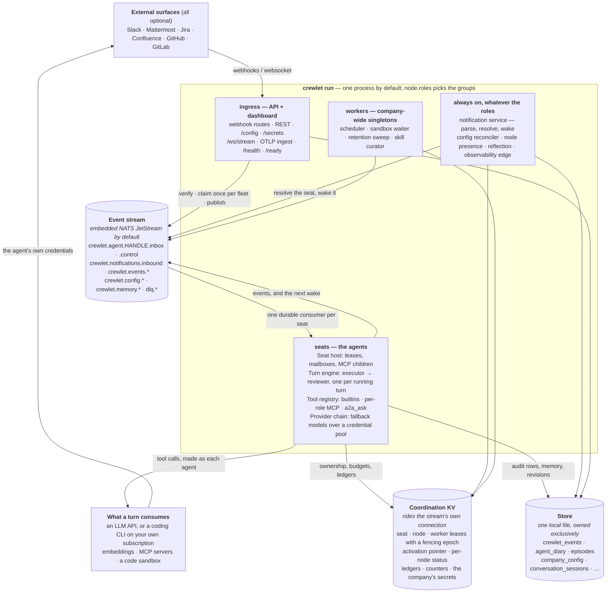

# Overview

Crewlet is an open-source engine for orchestrating hierarchically organized AI agent companies. It provides the runtime, event system, task management, agent lifecycle, and knowledge infrastructure needed to operate a network of AI agents modeled after a real corporate structure.

Crewlet ships as **an engine plus a thin operational surface**: the engine does the work, and a REST API + a web dashboard (embedded in the engine process by default, or run as its own process) provide configuration, webhooks, and observability. Anything beyond that — custom UIs, metrics exporters, bespoke automations — is built *outside* the process: the engine loads no plugins, and its surfaces to the outside are the REST API, the `/ws/stream` socket, OTLP, and [MCP](../guides/tools-and-mcp.md#extending-the-engine) for anything an agent should be able to call.

---

## Vision

Crewlet enables a founder to design a company structure, define its mission, and deploy a network of AI agents that operate within that structure. Each agent acts as a role within the company — with its own backstory, skills, and responsibilities — collaborating with other agents through the organizational hierarchy.

The framework models the same structures found in real companies:

- **Organizational hierarchy** — departments, teams, and individual roles; seats are held by AI agents or [human teammates](humans-in-the-org.md)
- **Communication** — channels, direct messages, and external tools (Slack or self-hosted [Mattermost](../integrations/mattermost.md), the work-item tracker, the code host)
- **Task management** — the engine's own work tracker by default (items, threads, hand-offs, a board and an MCP surface), or an external PM tool it deliberately mirrors none of (Jira, GitHub/GitLab issues) — see [The Tracker](task-engine.md)
- **Code hosting** — agents read, review, and track code via GitHub or GitLab MCP tools, and author code through the [code sandbox](code-sandbox.md)
- **Knowledge** — a shared knowledge base behind one seam, either the engine's own pages (BM25 over a per-node index) or a live Confluence search, plus a per-agent private diary (vector similarity computed by the database — hybrid vector ∪ recency candidate selection)
- **Decision-making** — structured DACI framework with clear authority

---

## The Org Chart Is the Execution Graph

Crewlet treats the organizational hierarchy as its primary orchestration structure. Knowledge, permissions, communication, and downward delegation are all scoped by a seat's position in the tree — the chart a founder draws **is** the graph the engine executes.

| Dimension | How Crewlet models it |
|---|---|
| **Mental model** | A corporate org chart — departments, teams, and named seats |
| **Hierarchy** | A native tree: identity, downward delegation, manager-handoff target, and scoping all derive from it |
| **Communication** | Event-driven pub/sub with org-scoped channels |
| **Knowledge** | A knowledge base — the engine's own, or a vendor's searched live — plus a per-agent private diary |
| **Decision model** | The DACI framework (Driver / Approver / Contributor / Informed) |
| **Lifetime** | A long-running, persistent company |
| **Config style** | A YAML org chart, versioned in the store and edited live |
| **Extensibility** | A full extension system — providers, hooks, middleware |

The hierarchy is informational + delegation-routing, not a special upward escalation mechanism. When an agent is stuck, it hands off to its manager using the same colleague-surface tools (a chat mention, a work-item comment, A2A) that a human teammate would use; the manager's handle comes from the agent's identity prompt. Engine-detected failures (stall, max-iter, unhandled exception, LLM unavailable) surface to the operator via structured logs and a dashboard `afk` state — see [Turn Engine](turn-engine.md) and [The Tracker](task-engine.md).

---

## Design Principles

- **Event-driven** — agents are reactive; events trigger agent work, agent work produces events
- **Concurrent by default** — a seat's turn, its MCP children and the node's own duties run in parallel, and every shared structure is checked under the race detector
- **Provider-agnostic** — pluggable LLM, storage, tracker, knowledge and embedding backends; external tools via MCP. Only the LLM is required: the tracker and the knowledge base ship with the engine, so a company with an API key and nothing else runs
- **Config-driven** — a company is a YAML document, validated against a schema generated from the same types the engine runs on
- **Extension-oriented** — anything beyond running the company is an extension, not core
- **Observable** — structured logging, tracing hooks, and metrics from day one

---

## High-Level Architecture



That is the whole engine at a glance; **[Architecture](architecture.md)** draws
it at six zoom levels — what sits outside the boundary, what runs inside one
node, the hop-by-hop path a trigger takes across a fleet, what a turn does,
where every table and bucket lives, and what changes when a second node
appears.

**Infrastructure**: none to operate. The stream is a NATS JetStream server the process embeds, and the store is a local file it creates. Outgrowing one node moves only the stream: the embedded servers join one cluster, or every node dials one external NATS (see [Running a Fleet](../guides/fleet.md)). It is the same client code either way — embedded versus external is a connection choice, not a second backend — and the store stays each node's own file. OpenTelemetry for distributed tracing.

**One node type**: `crewlet run` is the node, and what it does is a config value — `node.roles` picks from `ingress` (serve the HTTP API and its webhooks), `seats` (run agents), and `workers` (the company-wide singleton duties). The default is all three: one process serving the API and the dashboard and running every agent, which is the whole stack. Splitting the API off is the same command with `-roles ingress`, so both topologies are the same code path rather than two wirings that have to be kept in step.

**One node is enough, and more than one is supported.** Agents are stateful seats, not interchangeable workers, so which node runs which seat is decided by a lease — see [Seat ownership](seat-ownership.md). Scale up (a bigger host, a higher `node.max_concurrent`) before scaling out: a single engine handles many concurrent turns, and one node is the design's degenerate case rather than a lesser path. Run a fleet when a node's failure is not acceptable downtime, when traffic has to terminate separately from the agents, or when some seats must run somewhere specific — [Running a Fleet](../guides/fleet.md) covers all three, and [Scaling Out](scaling.md) is the model underneath them.

---

## Technology Stack

| Component | Technology | Rationale |
|---|---|---|
| Language | Go 1.27+ | One self-contained binary, real parallelism, a standard library that covers most of this table |
| Distribution | A single `CGO_ENABLED=0` binary | Nothing to install alongside it. The matrix is linux and macOS on amd64 and arm64 — bounded by the platforms the store driver embeds its database engine for, not by the compiler. The linux binaries need glibc: that engine is loaded with `dlopen`, which no pure-Go build avoids |
| Event stream | Embedded NATS JetStream | Persistent pub/sub *inside the process* — a company runs with no broker to operate. An external NATS cluster takes the same slot for a fleet, on the same client code. A seat's mailbox is a durable consumer created with nothing attached, which here is an ordinary API call (~1.7 ms) rather than an admin endpoint |
| Store | Turso | One local file this process owns exclusively; pure Go, SQLite file format, and the vector functions the learning subsystem's recall is written against |
| Vector search | The store's vector distance functions | The per-agent diary and the episodic store, in the same file as everything else. The *arithmetic* is the database's; there is no ANN index reachable from the Go driver yet, so recall is a scan behind the per-agent index |
| Event store | A table in that file | LLM-invocation observability and the event dashboards, written inline by a publish listener |
| Coordination | TTL leases with a fencing epoch | Seat ownership and the fleet's shared counters, in a KV riding the stream's own NATS connection — never the store file, and never a second connection that could fail on its own |
| Config | YAML → typed structs → generated JSON Schema | One definition drives validation, the schema editors read, and the docs |
| Tracing | OpenTelemetry | W3C Trace Context, automatic propagation, OTLP export to Jaeger/Tempo |
| LLM clients | Official vendor SDKs | Anthropic and OpenAI, plus any OpenAI-compatible endpoint |
| Structured logging | `log/slog` | Standard library, machine-parsable, one component-bound logger per subsystem |
| Testing | `testing` | Standard library, no assertion framework; one shared conformance suite per multi-backend contract |

---

## Provider Layer

All external dependencies are abstracted behind `Protocol` interfaces, enabling pluggable backends and easy testing.

### LLM Provider

The `LLMProvider` protocol defines two methods — `complete()` for single-shot completions (with optional tool definitions, temperature, max tokens, and tool choice) and `stream()` for streaming responses — plus a `model: str` attribute that names the model id the provider answers as. Telemetry (phase events, OTel spans, the dashboard's per-model token breakdown) reads `model` directly, so every concrete provider must expose it; `FallbackLLMProvider` surfaces the wrapped provider's value through a property.

Built-in providers: **OpenAI**, **Anthropic** (using their official SDKs), and **`cli-agent`** — a locally installed coding CLI (`claude`, `codex`, `gemini`, `opencode`, …) driven as a headless text model on the operator's *subscription* rather than a metered API key. Different roles can use different providers/models (e.g., executives use Claude, junior agents use GPT-4o-mini).

**Subscription backends.** The `cli-agent` provider is the one built-in that is not an HTTP client: it spawns a local process, so it needs per-seat filesystem isolation (a coding CLI keeps sessions, history and project memory under one home, and one provider instance serves every seat), an in-prompt JSON envelope in place of a native tool-call channel, and its own auth story. All three are covered in [Subscription LLM Backends](subscription-llm-backends.md). A spent subscription window classifies as `RATE_LIMIT`, so the ordinary fallback chain carries a role onto a metered key until it resets.

**Prompt caching.** Each call's large static prefix — the per-phase system prompt plus the tool-definition array — is the dominant repeated content of an agent turn: it is re-sent on every round of the [tool loop](agent-runtime.md#the-llm--tool-proxy) and is byte-stable across successive turns for the same agent (org config does not change mid-run). Both built-in providers cache it so it is re-read at a fraction of the base input price instead of re-billed in full each round. The Anthropic provider sets explicit `cache_control` breakpoints on the system block and the final tool definition (caching the whole `tools + system` prefix); the OpenAI provider relies on the platform's automatic prefix caching — the static system prompt is already first in the message array, which is what auto-caching requires. This is why the per-phase prompts can carry their full incident-hardened guidance (see [Turn Engine](turn-engine.md)) without the repetition dominating cost.

`Completion.InputTokens` always reports the **full** prompt-token count regardless of cache state, so the budget cascade stays correct: Anthropic reports cache reads/writes *separately* from its raw `input_tokens`, so the provider sums all three; OpenAI's `prompt_tokens` already includes the cached portion. `Completion.CacheReadInputTokens` / `cache_creation_input_tokens` break that total down for cost observability and are logged on every `llm_complete` event.

### Embedding Provider

The `EmbeddingProvider` protocol defines `embed()` (batch text → vectors) and a `dimensions` property. Used by the [agent-learning subsystem](agent-learning.md) for vector-based retrieval over the agent's private `agent_diary` (the vector half of the `## Personal memory` prefetch's hybrid candidate selection) and `episodes` (the `## Similar prior work` prefetch and the `query_episodes` builtin). Knowledge-base content is searched live and is **not** embedded. Built-in provider: **OpenAI** (works with any OpenAI-compatible endpoint via `base_url`). Configured under `providers.embeddings` in YAML.

### Database

One local file, opened by Turso — a pure-Go driver over the SQLite file format — and built from a forward-only migration sequence. There was a second certified driver (mainline SQLite) as an escape hatch, and it is retired: it could not serve a database with rows in it, because it has no vector functions and recall degraded to nothing without saying so. **The engine owns that file exclusively** — a second process pointed at the same path is corruption waiting for a schedule to collide, which is why everything genuinely shared between nodes lives in the coordination KV instead. The load-bearing tables:

- **`agent_diary`** (vector-indexed) — each agent's private observation log; the read-side counterpart of `reflect_and_persist`. Rows are embedded on write; the read path is hybrid candidate selection (vector top-50 ∪ recency top-50, deduped by row id) handed to an aux-LLM relevance filter. Shared knowledge is a separate read: on the native backend it is this node's own projection of the company's pages, indexed for BM25 search; on Confluence it is a live query with no local copy at all (see [knowledge system](knowledge-system.md)).
- **`episodes`** (vector-indexed) — one row per completed turn; raw and LLM-compacted aggregates share the same table.
- **`synthesized_skills` / `synthesized_skill_versions`** — auto-drafted skills the agent can load via `use_skill`, with refinement history.
- **`counterparty_profiles`** — per-(observer, subject) profiles built up from observed interactions.
- **`agent_onboarding_markers`** — `mark_onboarded` bookkeeping (one row per agent, UPSERT-keyed).
- **`conversation_sessions`** — the [conversation ledger](conversation-sessions.md): one row per completed turn, keyed on the seat and the conversation it served, rendered back into that conversation's next turn. Deduped on the work key, trimmed on write, swept on a retention horizon.
- **`secret_values`** — the local half of the [secret store](secret-store.md), and now only its bootstrap path: the company's credentials live on the coordination KV where every node reads them, and rows written here while the engine was stopped are migrated there at its next start. Sealed with the Tier A keyring either way; no plaintext mode.

Alongside them sit the durable runtime tables a turn leaves behind — `crewlet_events`, `scheduled_runs`, `chat_thread_follows` — and the config plane's `company_config` payloads. The full migration list is in `internal/store/schema/`.

What is *not* here is as deliberate: the completion ledger, the delivery dedupe, the notification valve, the credential cooldowns, the token counter, the activation pointer and each node's apply status all answer a question the whole **company** has to agree on, so they live in the fleet's [coordination store](coordination.md) rather than in any one node's file.

Everything else is YAML config, in-memory state, or an external tool.

---

## Package Structure

```
cmd/crewlet/              # The one binary: run, validate, schema, migrate,
                          #   budgets, secrets, config, llm, and the six
                          #   vendor CLIs — gitlab/github/jira/slack
                          #   `provision`, confluence `import|resync`,
                          #   mattermost `provision|doctor`
internal/
├── engine/               # The wiring: which concrete thing satisfies which seam
├── config/               # The two config tiers → typed structs → JSON Schema
├── org/                  # Organization model (hierarchy, roles, seat identity)
├── agent/                # The agent runtime, one package per hard part:
│                         #   turn/ (the two-stage loop), toolloop/ (the
│                         #   model↔tool round-trip and its suspend),
│                         #   inbox/ (what wakes a seat, and what must not
│                         #   wake it twice), ledger/ (iteration, conversation
│                         #   and budget ledgers), structured/ (how a phase
│                         #   gives a typed answer), prefetch/, prompts/,
│                         #   skills/, builtin/, subagent/ (workers)
├── queue/                # The EventQueue contract + the jetstream backend
│                         #   and the in-memory twin, both certified by one
│                         #   suite
├── coord/                # TTL leases with a fencing epoch + the shared KV
├── seat/                 # Which seats this node runs, and the watchdog
├── store/                # The local file: events, learning, runtime state
├── events/               # The envelope and the typed-payload registry
├── a2a/                  # Agent-to-agent channels (one ask, one answer)
├── schedule/             # Role/unit cron-style recurring work
├── learning/             # What a seat remembers, and memsync/ — the changelog
│                         #   that carries it when a seat moves node
│                         #   (there is no task package:
│                         #   task state lives in the PM tool, and the engine
│                         #   mirrors none of it)
├── knowledge/            # The backend-neutral knowledge-search seam
├── providers/            # llm/ (+ chain, credential rotation), embeddings/
├── sandbox/              # Code work as a suspended Execute phase
├── mcp/                  # MCP client and child-process supervision
├── tools/                # The registry, and the per-phase tool surfaces
├── notify/               # The backend-neutral notification spine
├── mattermost/ slack/    # The six vendors: client, parser, transport,
│   jira/ confluence/     #   prompt, provisioning reconcile — each
│   gitlab/ github/       #   contributing only what is genuinely its own,
│                         #   which is why Jira has no transport
├── configplane/          # The activation pointer's cadence and postures
├── node/                 # The node's own identity, presence and drain
├── provision/            # The shared provisioning grammar and its sinks
├── backup/               # A verified copy of both estates, taken from inside
│                         #   the engine — the only place either is reachable
├── maintenance/          # The retention sweep, behind one singleton duty
├── tokens/               # Token accounting shared by the meter and the API
├── hostbox/ procgroup/   # The local sandbox host, and process-tree teardown
├── whsec/                # Webhook signing secrets: minting and verification
├── httpx/ textcut/      # The shared HTTP transport; rune-safe shortening
├── api/                  # REST + dashboard: webhooks/, stream/, queries/,
│                         #   livestate/, configapi/, auth/, httpjson/
├── observe/              # The observability edge (store row + live push)
├── tracing/              # OpenTelemetry: one provider, W3C propagation, and
│                         #   the bridge to the envelope's trace fields
├── secrets/              # Config encryption at rest + the ${VAR} resolver
└── version/ logging/ redact/ envref/ envfile/ workkey/  # small shared grammars

dashboard/                # The dashboard's SOURCE — React + TypeScript, built
                          #   by Vite. Its output is committed to
                          #   static/dashboard, so `go build ./...` needs no
                          #   Node. See reference/dashboard-design.md
static/dashboard/         # That build output, embedded in the binary — a
                          #   store mirroring the server projection, one
                          #   websocket as the only data channel, a hash
                          #   router, one file per screen
```

Every package states its own rationale in its package doc, so `go doc ./internal/coord` is the authority on coordination rather than this page.
