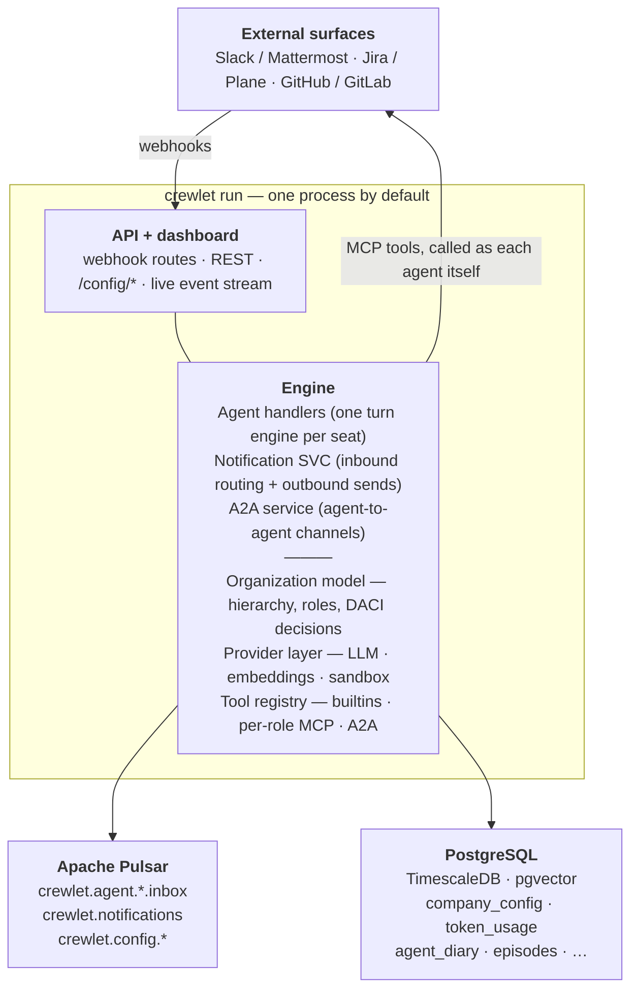

# Overview

Crewlet is an open-source engine for orchestrating hierarchically organized AI agent companies. It provides the runtime, event system, task management, agent lifecycle, and knowledge infrastructure needed to operate a network of AI agents modeled after a real corporate structure.

Crewlet ships as **an engine plus a thin operational surface**: the engine does the work, and a REST API + zero-build web dashboard (embedded in the engine process by default, or run as its own process) provide configuration, webhooks, and observability. Anything beyond that — custom UIs, metrics exporters, bespoke automations — is built as [extensions](../guides/extensions.md) on top of the engine.

---

## Vision

Crewlet enables a founder to design a company structure, define its mission, and deploy a network of AI agents that operate within that structure. Each agent acts as a role within the company — with its own backstory, skills, and responsibilities — collaborating with other agents through the organizational hierarchy.

The framework models the same structures found in real companies:

- **Organizational hierarchy** — departments, teams, and individual roles; seats are held by AI agents or [human teammates](humans-in-the-org.md)
- **Communication** — channels, direct messages, and external tools (Slack or self-hosted [Mattermost](../integrations/mattermost.md), the work-item tracker, the code host)
- **Task management** — integrated with external PM tools (Jira, Plane, GitHub/GitLab issues)
- **Code hosting** — agents read, review, and track code via GitHub or GitLab MCP tools, and author code through the [code sandbox](code-sandbox.md)
- **Knowledge** — query-time knowledge-base search (Confluence or Plane) for shared docs + per-agent private diary (pgvector — hybrid vector ∪ recency candidate selection)
- **Decision-making** — structured DACI framework with clear authority

---

## The Org Chart Is the Execution Graph

Crewlet treats the organizational hierarchy as its primary orchestration structure. Knowledge, permissions, communication, and downward delegation are all scoped by a seat's position in the tree — the chart a founder draws **is** the graph the engine executes.

| Dimension | How Crewlet models it |
|---|---|
| **Mental model** | A corporate org chart — departments, teams, and named seats |
| **Hierarchy** | A native tree: identity, downward delegation, manager-handoff target, and scoping all derive from it |
| **Communication** | Event-driven pub/sub with org-scoped channels |
| **Knowledge** | A knowledge base (Confluence or Plane) searched live at query time, plus a per-agent private diary |
| **Decision model** | The DACI framework (Driver / Approver / Contributor / Informed) |
| **Lifetime** | A long-running, persistent company |
| **Config style** | A YAML org chart, with Python overrides |
| **Extensibility** | A full extension system — providers, hooks, middleware |

The hierarchy is informational + delegation-routing, not a special upward escalation mechanism. When an agent is stuck, it hands off to its manager using the same colleague-surface tools (Slack mention, Jira comment, Confluence comment, A2A) that a human teammate would use; the manager's handle comes from the agent's identity prompt. Engine-detected failures (stall, max-iter, unhandled exception, LLM unavailable) surface to the operator via structured logs and a dashboard `afk` state — see [Turn Engine](turn-engine.md) and [Task Engine](task-engine.md).

---

## Design Principles

- **Event-driven** — agents are reactive; events trigger agent work, agent work produces events
- **Async-first** — all I/O (LLM calls, storage, retrieval) is async
- **Provider-agnostic** — pluggable LLM, storage, and embedding backends; external tools (including the knowledge base) via MCP
- **Config-driven AND programmatic** — define companies via YAML or Python API
- **Extension-oriented** — anything beyond running the company is an extension, not core
- **Observable** — structured logging, tracing hooks, and metrics from day one

---

## High-Level Architecture



**Infrastructure**: Apache Pulsar + PostgreSQL with TimescaleDB and pgvector extensions (one database for operational state, the per-agent diary vector store, the episodic vector store, and the event store). OpenTelemetry for distributed tracing.

**One node type**: `crewlet run` is the node, and what it does is a config value — `node.roles` picks from `ingress` (serve the HTTP API and its webhooks), `seats` (run agents), and `workers` (the company-wide singleton duties). The default is all three: one process serving the API and the dashboard and running every agent, which is the whole stack. Splitting the API off is the same command with `--roles ingress`, so both topologies are the same code path rather than two wirings that have to be kept in step.

**One node is enough, and more than one is supported.** Agents are stateful seats, not interchangeable workers, so which node runs which seat is decided by a lease — see [Seat ownership](seat-ownership.md). Scale up (a bigger host, a higher `max_concurrent`) before scaling out: a single engine handles many concurrent turns, and one node is the design's degenerate case rather than a lesser path. Run a fleet when a node's failure is not acceptable downtime, when traffic has to terminate separately from the agents, or when some seats must run somewhere specific — [Running a Fleet](../guides/fleet.md) covers all three, and [Scaling Out](scaling.md) is the model underneath them.

---

## Technology Stack

| Component | Technology | Rationale |
|---|---|---|
| Language | Python 3.12+ | AI ecosystem, async/await, type hints, protocols |
| Async runtime | asyncio | Standard library, broad compatibility |
| Data models | Pydantic v2 | Validation, serialization, JSON Schema generation |
| Config parsing | PyYAML + Pydantic | YAML config → validated Pydantic models |
| Message queue | Apache Pulsar | Persistent pub/sub, durable shared subscriptions (consumer groups), dead-letter queues |
| Database | PostgreSQL + pgvector | Operational state + per-agent diary vector store + episodic vector store |
| Event store | TimescaleDB (hypertable in the main PostgreSQL) | LLM invocation observability, event dashboards (direct write via publish listeners) |
| Tracing | OpenTelemetry SDK | W3C Trace Context, automatic propagation, OTLP export to Jaeger/Tempo |
| LLM clients | openai + anthropic SDKs | Official SDKs for each provider |
| Structured logging | structlog | Machine-parsable, context-rich logging |
| Testing | pytest + pytest-asyncio | Standard for async Python |
| Packaging | uv | Modern Python packaging |

---

## Provider Layer

All external dependencies are abstracted behind `Protocol` interfaces, enabling pluggable backends and easy testing.

### LLM Provider

The `LLMProvider` protocol defines two methods — `complete()` for single-shot completions (with optional tool definitions, temperature, max tokens, and tool choice) and `stream()` for streaming responses — plus a `model: str` attribute that names the model id the provider answers as. Telemetry (phase events, OTel spans, the dashboard's per-model token breakdown) reads `model` directly, so every concrete provider must expose it; `FallbackLLMProvider` surfaces the wrapped provider's value through a property.

Built-in providers: **OpenAI**, **Anthropic** (using their official SDKs), and **`cli-agent`** — a locally installed coding CLI (`claude`, `codex`, `gemini`, `opencode`, …) driven as a headless text model on the operator's *subscription* rather than a metered API key. Different roles can use different providers/models (e.g., executives use Claude, junior agents use GPT-4o-mini).

**Subscription backends.** The `cli-agent` provider is the one built-in that is not an HTTP client: it spawns a local process, so it needs per-seat filesystem isolation (a coding CLI keeps sessions, history and project memory under one home, and one provider instance serves every seat), an in-prompt JSON envelope in place of a native tool-call channel, and its own auth story. All three are covered in [Subscription LLM Backends](subscription-llm-backends.md). A spent subscription window classifies as `RATE_LIMIT`, so the ordinary fallback chain carries a role onto a metered key until it resets.

**Prompt caching.** Each call's large static prefix — the per-phase system prompt plus the tool-definition array — is the dominant repeated content of an agent turn: it is re-sent on every round of the [tool loop](agent-runtime.md#the-llm--tool-proxy) and is byte-stable across successive turns for the same agent (org config does not change mid-run). Both built-in providers cache it so it is re-read at a fraction of the base input price instead of re-billed in full each round. The Anthropic provider sets explicit `cache_control` breakpoints on the system block and the final tool definition (caching the whole `tools + system` prefix); the OpenAI provider relies on the platform's automatic prefix caching — the static system prompt is already first in the message array, which is what auto-caching requires. This is why the per-phase prompts can carry their full incident-hardened guidance (see [Turn Engine](turn-engine.md)) without the repetition dominating cost.

`Completion.input_tokens` always reports the **full** prompt-token count regardless of cache state, so the budget cascade and the `token_usage` ledger stay correct: Anthropic reports cache reads/writes *separately* from its raw `input_tokens`, so the provider sums all three; OpenAI's `prompt_tokens` already includes the cached portion. `Completion.cache_read_input_tokens` / `cache_creation_input_tokens` break that total down for cost observability and are logged on every `llm_complete` event.

### Embedding Provider

The `EmbeddingProvider` protocol defines `embed()` (batch text → vectors) and a `dimensions` property. Used by the [agent-learning subsystem](agent-learning.md) for vector-based retrieval over the agent's private `agent_diary` (the vector half of the `## Personal memory` prefetch's hybrid candidate selection) and `episodes` (the `## Similar prior work` prefetch and the `query_episodes` builtin). Knowledge-base content (Confluence or Plane) is searched live and is **not** embedded. Built-in provider: **OpenAI** (works with any OpenAI-compatible endpoint via `base_url`). Configured under `providers.embeddings` in YAML.

### Database

PostgreSQL via `asyncpg`. The schema is built from a forward-only migration sequence; the load-bearing tables:

- **`token_usage`** — per-agent cumulative token consumption, upserted by the turn engine's shared tool loop after each LLM completion that passes the budget check. Durable audit record; not used to hydrate the in-memory `BudgetManager` on startup.
- **`agent_diary`** (pgvector) — each agent's private observation log; the read-side counterpart of `reflect_and_persist`. Rows are embedded on write; the read path is hybrid candidate selection (vector top-K ∪ recency top-K, deduped, capped at 100) handed to an aux-LLM relevance filter. Shared knowledge is **not** in the database — the knowledge base (Confluence or Plane) is searched live (see [knowledge system](knowledge-system.md)).
- **`episodes`** (TimescaleDB hypertable, pgvector embedding) — one row per completed turn; raw + LLM-compacted aggregates share the same table.
- **`synthesized_skills` / `synthesized_skill_versions`** — auto-drafted skills the agent can load via `use_skill`, with refinement history.
- **`counterparty_profiles`** — per-(observer, subject) profiles built up from observed interactions.
- **`agent_onboarding_markers`** — `mark_onboarded` bookkeeping (one row per agent, UPSERT-keyed).
- **`conversation_sessions`** — the [conversation ledger](conversation-sessions.md): one row per completed turn, keyed on the seat and the conversation it served, rendered back into that conversation's next turn. Deduped on the work key, trimmed on write, swept on a retention horizon.
- **`secret_values`** — the [secret store](secret-store.md): one encrypted row per env-var name, consulted ahead of `os.environ` when the config layer resolves a `${VAR}` reference. Sealed with the Tier A keyring; no plaintext mode.

Everything else is YAML config, in-memory state, external PM tools, or Apache Pulsar. The full migration list is in `src/crewlet/db/migrations/`.

---

## Package Structure

```
src/crewlet/
├── engine.py             # Engine class — central entry point
├── config.py             # YAML config → Pydantic models
├── cli.py                # CLI commands (run, validate, api)
├── org/                  # Organization model (hierarchy, roles)
├── agent/                # Agent runtime (definition, instance, pool, turn engine:
│                         #   turn, plan, execute, review, subagent, guards,
│                         #   prompts, turn_context, phase_model, llm_loop,
│                         #   iteration_log — within-turn prior-work ledger,
│                         #   conversation_log — the cross-turn one
│                         #     (see conversation-sessions.md),
│                         #   skills/ — knowledge-base-sourced tool-skill registry)
├── queue/                # EventQueue protocol (Pulsar + memory)
├── a2a/                  # Agent-to-agent channels (durable state, service)
├── db/                   # Database layer (asyncpg, migrations, token_usage,
│                         #   deterministic agent-id derivation)
├── secrets/              # Company-config encryption at rest (SecretCipher,
│                         #   AES-256-GCM keyring, redaction helpers) + the
│                         #   secret-store resolver installed ahead of
│                         #   os.environ for ${VAR} (see secret-store.md)
├── task/                 # Task engine (models, tracker, escalation)
├── schedule/             # Scheduler — role/unit cron-style recurring work
├── events/               # Event types, routing (subscriptions via EventQueue)
├── knowledge/            # Shared-knowledge read (KnowledgeSearcher protocol
│                         #   + the query-time Confluence and Plane searchers,
│                         #   accessibility, shared markdown-doc helpers)
├── confluence/           # Confluence page write side — generic page ops,
│                         #   promotion writer, + unified `crewlet confluence
│                         #   import` CLI (routes each .md: trigger=skill,
│                         #   otherwise a knowledge doc whose space=parent
│                         #   dir, title=H1; `crewlet plane import` is the
│                         #   Plane analog, in plane/)
├── learning/             # Agent-learning subsystem (ReflectEngine, PersistDecider,
│                         #   SkillSynthesizer/Refiner, EpisodeStore + lifecycle,
│                         #   AgentDiary, CounterpartyProfiler, OnboardingMarkerStore)
├── providers/            # LLM + Embeddings protocols and implementations
├── sandbox/              # Code sandbox — the run_sandbox Execute tool's
│                         #   runtime (E2B provider, coding-agent runners,
│                         #   suspend/resume coordinator; see code-sandbox.md)
├── notifications/        # External notification system (outbound transports;
│                         #   typing_status.py — Slack "is thinking…" working
│                         #   indicator driven by the TurnEngine)
├── slack/                # Slack app provisioning (`crewlet slack provision`):
│                         #   canonical per-agent app manifest + App Manifest
│                         #   API client + OAuth install + .env/ledger writing
├── mattermost/           # Mattermost — self-hosted OSS chat: REST client,
│                         #   the per-seat websocket event fleet (Mattermost
│                         #   has no usable inbound webhook), and
│                         #   `crewlet mattermost provision`
├── tools/                # Agent tool system (builtins + A2A tools)
├── github/               # GitHub integration (per-role remote MCP)
├── gitlab/               # GitLab integration (async REST client + the
│                         #   `crewlet gitlab provision` seat-provisioning CLI)
├── plane/                # Plane integration (REST client, provisioning,
│                         #   page import CLI, promotion writer)
├── mcp/                  # MCP integration (stdio + HTTP/SSE)
├── timescaledb/          # TimescaleDB event store (observability)
├── api/                  # Standalone REST API (Starlette): routes/ handlers,
│                         #   live_state.py projection (in-flight live_call),
│                         #   streaming.py StreamService (/ws/stream); serves
│                         #   the dashboard from the top-level static/ below
├── static/               # Web assets served by the API — static/dashboard/
│                         #   is the zero-build ES-module dashboard (reactive
│                         #   store, WS client, hash router, per-view modules;
│                         #   styles/ is the crewlet.io panel language — see
│                         #   reference/dashboard-design.md;
│                         #   llm.js renders LLM invocations with collapsible,
│                         #   height-capped prompt messages + a Source block
│                         #   naming the event that triggered the turn
│                         #   (notification triggers show a branded
│                         #   integration badge + sender); eventDetail.js
│                         #   renders inbound notifications as a readable
│                         #   integration-branded view)
└── extensions/           # Extension system
```
