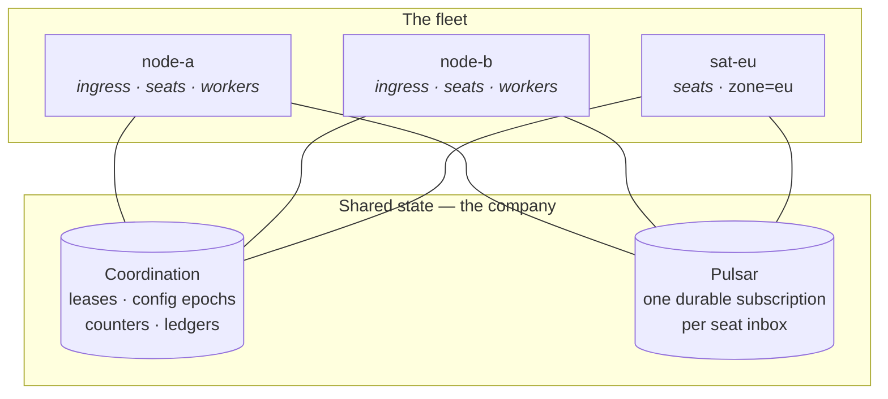

# Scaling Out

**One node is the whole company, and more than one is supported.** A single
`crewlet run` holds every seat, serves the API, and runs every company-wide
duty. That is the design's degenerate case, not a lesser path — a fleet takes
exactly the same code down exactly the same paths, with the leases held by more
than one process.

So the standing advice is **scale up before you scale out**. Agent handlers are
goroutines, so a single engine's practical ceiling is LLM provider rate
limits and host memory, not process count. A fleet buys availability, traffic
separation, and placement — not throughput. [Running a Fleet](../guides/fleet.md)
is the operator guide; this page is the model underneath it.

---

## What a node is

A node is one process that has declared what it is willing to do. Everything
else about it — which seats it runs, which duties it holds, which config
revision it is on — is discovered at runtime from shared state, never
configured per node.

```yaml
# Tier A, per node
node:
  id: "${CREWLET_NODE_ID}"           # distinct and stable, per process
  roles: [ingress, seats, workers]   # the default; omit the key
  labels: {zone: eu}                 # optional, matched by role.placement
  max_concurrent: 32                 # agent turns this process runs at once
```

| Role | What it does |
|---|---|
| `ingress` | Serves the HTTP API — every integration's webhooks, the dashboard, the REST and WebSocket read surface |
| `seats` | Claims seat leases, spawns the agents, consumes their inboxes, runs turns |
| `workers` | The company-wide [singleton duties](seat-ownership.md#singleton-duties) — scheduler tick, sandbox waiter, retention sweep, skill clustering and curation, seat-subscription creation. These read their work list from the **org**, never from the node's own seats: a `workers` node runs no seats at all, so a duty that iterated the local agent pool would cover nothing |



**The node id must be distinct and stable across restarts.** It comes from the
deployment (`CREWLET_NODE_ID`, or `node.id` in the Tier A file) rather than
being generated, because a fresh value per boot orphans whatever the previous
incarnation registered under the old one. Two nodes sharing an id miscount the
fleet and each compute too small a share of the seats.

A role is subtracted from **this node, not from the company**, so a fleet can be
assembled node by node into a shape where a whole job is done by nobody while no
single node's config is wrong. The engine checks the assembled shape against
live node presence and logs `fleet_role_unmanned` when a role has nobody doing
it. See [the fleet guide](../guides/fleet.md#node-roles).

---

## What had to be true for this to work

Running two engines against one company is not a matter of adding a lock. The
couplings that made it unsafe fall into five kinds, and **only one of them is
what a lock fixes**:

| | The coupling | What resolves it |
|---|---|---|
| **1** | **Control plane** — config activation, secret rotation, identity maps were delivered over a competing-consumer subscription, so exactly one replica applied a revision and the rest ran the previous company forever | An append-only activation epoch every node polls — see [Control Plane](control-plane.md) |
| **2** | **Process-bound resources** — a seat's stdio MCP servers are child processes of the engine holding its credentials. A seat's tools live where its subprocesses live, so "any node can serve any seat" is false unless placement decides tools *and* routing together | Seat leases: claiming a seat is what spawns its MCP children — see [Seat Ownership](seat-ownership.md) |
| **3** | **Per-seat exclusion** — two nodes attached to one seat's Shared subscription split its traffic, running one agent's conversation as two interleaved turn streams that neither can see | A TTL lease with an epoch fencing token. **This is the class a lock fixes**, and it is one of five |
| **4** | **Shared mutable counters** — budgets, concurrency, webhook dedupe, credential cooldowns were per-process, so an org cap of 500 k tokens silently became N × 500 k | Shared storage, not exclusion — see [what the fleet shares](#what-the-fleet-shares) below |
| **5** | **Boot walks with external side effects** — schema migration, sandbox recovery, skill clustering all ran unconditionally at boot, where "abandoned by a dead engine" is a valid inference only when there is exactly one engine | Singleton duty leases, an advisory lock on `migrate()`, and per-seat recovery inside the acquire hook |

Class 3 is the one everybody expects and the only one a mutex addresses. The
other four are why "just take a lock and run N replicas" does not work, and why
the answer is a node model rather than a lock.

---

## What the fleet shares

Everything that must be true for the *company* rather than for a process lives
in the coordination slot — a fleet-shared key/value store, distinct from the
node's own database. A fleet is not configured; it is discovered from these
slots, which is why adding a node is starting a process and removing one is
stopping it.

| Slot | Answers | Documented in |
|---|---|---|
| `leases` | Which node runs which seat, which node holds which duty, and which nodes are alive at all | [Seat Ownership](seat-ownership.md#the-lease) |
| `config` · `status` | Which company revision is current, and which nodes have reached it | [Control Plane](control-plane.md) |
| `ledger` | Has this trigger already been worked — read before a turn, written after one | [The completion ledger](seat-ownership.md#the-completion-ledger) |
| `claims` | Has this inbound delivery been seen — the dedupe that used to be a per-process map, and that GitHub and GitLab did not have at all | [Event System](event-system.md) |
| `cooldowns` | Which provider key is cooling after a 429. Per-process monotonic values are not even *comparable* across nodes | [Deployment](../guides/deployment.md) |
| `rate` | The notification valve | [Event System](event-system.md) |
| `budgets` | Org and per-seat spend against the cap. Caps stay config-derived in memory; only *usage* is shared | [Deployment § Token budgets](../guides/deployment.md#token-budgets) |

The full list, what each retention is sized from, and what deliberately stays
node-local are in [Coordination](coordination.md).

The broker carries the other half: one durable Shared subscription per seat
inbox, attached only by the node holding that seat's lease. The subscription is
what holds an unowned seat's mail until somebody claims it — which is why two
Pulsar reapers **must** be turned off, since an unowned seat's subscription has
no connected consumer and both reapers delete exactly that. See
[the fleet guide](../guides/fleet.md#what-a-fleet-needs).

### What stays per-process, deliberately

- **`max_concurrent`.** Tier A's `node.max_concurrent` (default 32) is the gate
  every agent turn passes through, and it is per node — so an org's ceiling is
  N × the configured value. Size it per node, not per company. This is the one
  knob a fleet genuinely changes the meaning of. (A cli-agent provider's own
  `max_concurrent`, under `providers.llm.<name>.cli`, is a different knob: it
  caps that provider's subprocesses.)
- **A seat's MCP subprocesses.** They are children of the node that claimed the
  seat, and they die with the release.
- **The tool-skill registry.** It warms a local cache rather than producing
  shared state, so every node runs the boot walk — a node that skipped it would
  have agents with no tool skills at all. The test for whether periodic work is
  a [singleton duty](seat-ownership.md#singleton-duties) is exactly this: shared
  state, or a local cache?
- **The dashboard's live-state projection.** Each ingress node builds its own
  from the event stream, so any node can answer without a fan-out.

---

## Where the constants come from

The seat-handover numbers were measured against **Apache Pulsar standalone**
with `apache/pulsar-client-go`, and are recorded in full — method, broker
version and client version — in
[d-104](https://github.com/crewlet/crewlet/blob/main/decisions/104-pulsar-redelivery-economics.md).
`internal/queue/pulsar/conformance_test.go` is what holds them, and it is worth
being exact about how: it asserts the **behaviour** each number describes — that
a close returns everything unacked at `redeliveryCount` 0, that a subscription
retains mail with nothing attached, that the prefetch hostage is bounded by
`receiver_queue_size` — and it asserts no timing. A broker that got slower would
not fail the build; a broker that stopped behaving this way would.

| Measurement | Result |
|---|---|
| Redelivery after a **graceful close** | **9 ms**, all held messages recovered |
| Redelivery from a **wedged** consumer that never closes | never — held until the connection dies (this client has no ack timeout) |
| **Cursor continuity** on owner handoff | owner acked `[0,1,2]`, successor saw `[3,4,5]`, replayed `[]` |
| **Attach latency** to an existing subscription | **4.9 ms** |
| **Prefetch hostage** at `receiver_queue_size=64` | **64** of 256 held (the 1000 default would have held all 256) |

What each one decides:

- **Owner-only Shared subscriptions are sound.** The shared cursor survives a
  change of owner with no replay and no loss. That was the entire case against
  Exclusive subscriptions, and it is measured rather than asserted.
- **The broker imposes no floor on the lease TTL.** A graceful close releases in
  9 ms and attaching costs 5 ms, so a successor is productive essentially
  immediately. The **45-second TTL** is therefore bounded by heartbeat
  reliability — 15 s interval × 2 tolerated consecutive misses, plus headroom
  for clock skew — and not by anything the broker does.
- **The claim-rate limit is not about attaching.** At 5 ms attach is free; the
  real cost of a takeover is spawning that seat's MCP children, which is what
  the limiter is sized against.
- **A wedged-but-alive node holds its prefetch until its connection dies.**
  Not for a timeout — for as long as the process lives. `apache/pulsar-client-go`
  has no `ConsumerOptions.AckTimeout` and Pulsar has no broker-side equivalent
  for a *connected* consumer, and the client answers keepalives from IO threads
  a stalled duty never touches, so nothing releases that mail on its own. There
  is no clock to wait out. That is precisely why correctness against zombies
  comes from epoch fencing rather than from waiting, and why the **64-message
  prefetch cap** matters: it bounds how much of a seat's mail one wedged node
  can hold hostage indefinitely. Above all it is why the
  [event-loop watchdog](seat-ownership.md#the-wedged-node-and-why-it-leaves)
  **ends the process** rather than trying to signal a loop that has stopped
  turning: killing the client is the only thing that ends the session, and it
  collapses an unbounded hold to 9 ms.

---

## What the design does not promise

Stated plainly, because each of these is a real window rather than a
theoretical one:

- **Exactly-once external side effects do not exist.** Not here and not in any
  design that calls non-transactional external APIs at-least-once. The
  [completion ledger](seat-ownership.md#the-completion-ledger) and the per-round
  fence *bound* the duplicate window; they cannot close it. A node dying
  mid-turn may repeat a Slack post — the same window a single engine has on
  force-stop and broker redelivery, now named.
- **A wedged-alive zombie can act for up to one LLM round plus one heartbeat
  interval** after losing its lease. Fencing bounds the damage to that window;
  it does not prevent the window.
- **Two seat-scoped writes still duplicate, deliberately.** A
  differently-worded `agent_diary` entry (identical content already
  collapses on write) and a `token_usage` row. Nothing can key a reworded
  memory to its twin — that needs the duplicate *turn* not to happen, which
  is the completion ledger's job — and `token_usage` is observability on a
  high-volume path swept on a TTL, where a guard costs more than the skew.
  Budget *enforcement* is unaffected: it reads the fleet's shared
  counter. `episodes` and the counterparty interaction
  count are collapsed against the reader that matters — both live in the
  node's own database, which only that node reads, so the duplicate the
  work key removes is the one *that* node would otherwise write twice — and
  onboarding was already exclusive; see
  [Keying a write on the work](seat-ownership.md#keying-a-write-on-the-work).
- **Per-company singletons remain singletons.** They sit behind leases so any
  node can host them, but the scheduler tick, the curator, clustering and the
  sandbox waiter are each one logical instance at a time. A fleet does not
  parallelise them.
- **A rolling upgrade across a protocol bump has a visible outage window**, and
  a rollback across one needs a full drain. See
  [Mixed-version fleets](seat-ownership.md#mixed-version-fleets).

---

## See also

- [Running a Fleet](../guides/fleet.md) — the operator guide: node roles, seat placement, draining and rolling upgrades
- [Running One Agent Somewhere Else](../guides/satellite-nodes.md) — the satellite shape, walked end to end
- [Seat Ownership](seat-ownership.md) — leases, epoch fencing, admission, the completion ledger, singleton duties
- [Control Plane](control-plane.md) — how a config revision reaches every node, and the posture a lagging one takes
- [Deployment](../guides/deployment.md) — processes, database, broker settings, probes
