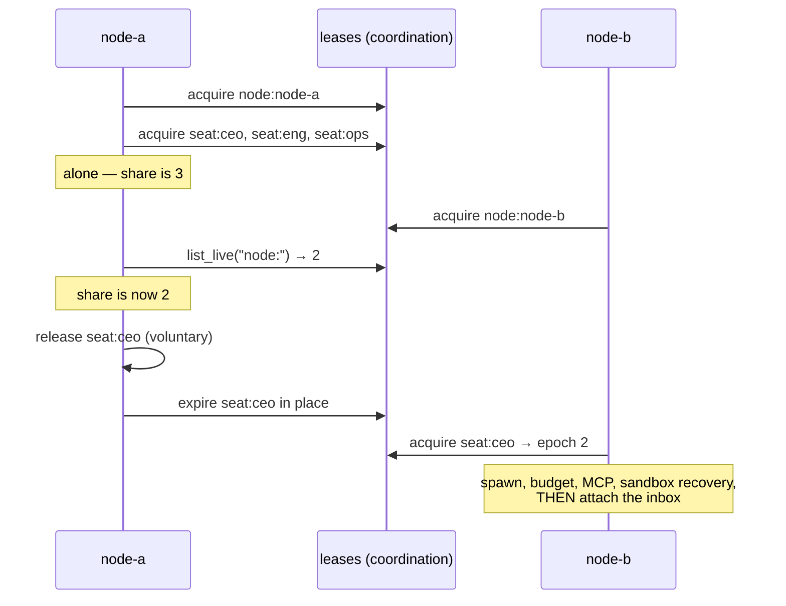

# Seat Ownership

A **seat** is a role in the org chart, addressed by its handle. **Seat ownership** is how a fleet of Crewlet nodes decides which node runs which seat — and, more importantly, how it guarantees that no two of them run the same one.

The rule the whole design serves is one sentence: **a seat is not a thing you can half-own.** A node either holds a seat's lease, runs its agent, consumes its inbox and answers its sandbox completions, or it does none of those things.

---

## The problem

Every seat has a durable inbox topic, `crewlet.agent.{handle}.inbox`, consumed under a **Shared** subscription named `agent-{handle}`. Shared means competing consumers: each message goes to exactly one attached member.

That is exactly right when the members are one node's consumer. It is catastrophic when two nodes both attach: the broker splits the seat's traffic between them, so one agent's conversation runs as two interleaved turn streams on two processes, each unaware of the other. Turn exclusion is in-process state; neither node can see the collision, and nothing raises.

So attachment has to be exclusive, and exclusivity has to be provable across processes. That is what a lease is for.

---

## The lease

Ownership is a row in the `leases` table (`internal/coord`) with a TTL and a monotonic `epoch`:

```
seat:{handle}   owner=node-a:9f3c1e70   epoch=7   expires_at=…   preferred=node-a
```

Three properties carry everything above it:

- **The owner is a process incarnation, not a machine.** `{node_id}:{random}`, minted fresh at boot. A live lease is renewable by its own owner string, so two processes sharing an identity would both hold the seat at the same epoch — and the default node id is the shared constant `node-0`. The *stable* node id goes in `preferred`, where restart-stability is what you actually want.
- **The epoch is a fencing token, monotonic for the resource's lifetime.** Releasing expires the row in place rather than deleting it: a deleted row would restart the counter at 1 and hand the next owner a token its predecessor is still using.
- **A lapsed lease cannot be renewed, only re-acquired** — and re-acquiring bumps the epoch even for the same owner, because during the gap that owner's in-flight work was unprotected and must be fenced against its own past self.

## Placement

Placement is deliberately dumb, and lives in `internal/seat`:

- Every node holds a `node:{id}` presence lease, renewed on the same heartbeat as its seats. Counting the live ones is how a node learns the fleet size. It cannot be inferred from seat ownership: a fleet where nobody has claimed anything yet would read as zero nodes, and every node would then take every seat.
- A node claims up to `ceil(seats / live nodes)` — its **fair share** — trying `preferred`-hinted seats first for stickiness, and never more than `SEAT_CLAIM_LIMIT_PER_SWEEP` per pass, because each takeover costs an MCP spawn.
- A node holding **more** than its share hands the excess back, at most `SEAT_RELEASE_LIMIT_PER_SWEEP` per pass. Claiming alone converges only for a fleet that shrinks: a node that booted alone holds every seat, and a peer joining later computes a share it can never reach. Without the give-back, scaling out does nothing until something dies.

The share is a ceiling, so shares sum to at least the seat count and a node at its share has no room to re-claim what it just released. Rebalancing converges rather than oscillating.



## Establishing a seat, and giving it back

The acquire hook establishes the seat in a known state and attaches the consumer **last**: agent instance, budget cap, per-role MCP children, interrupted sandbox-run recovery, *then* the inbox and control subscriptions. A seat that starts receiving work before its MCP children are up runs its first turn with an empty tool surface. The release hook is the mirror: the seat's children die with its lease, because the credentials in one *are* that seat's identity and a child left running would let this node keep acting as an agent a peer now serves. See [Tools & MCP](../guides/tools-and-mcp.md#shared-vs-per-role-servers).

Releasing has **two modes**, because losing a lease and choosing to let go are opposites:

| Mode | When | What happens |
|---|---|---|
| **Voluntary** | drain, capacity rebalance, role decommissioned | quiesce → let the in-flight handler finish under a bounded wait → detach → release the lease |
| **Fenced** | renew returned `False`, the TTL grace expired, an acquire hook failed, config posture went `shed`/`stuck` | **detach first**, abandon in-flight work, republish nothing |

Fenced release never republishes. A peer may already be running the seat; republishing hands it a second copy of work it is already doing, and sends those messages to the topic tail while the successor replays its prefetched siblings from the head — which reorders the conversation.

**A teardown that cannot be proven does not release the lease.** A lease held too long costs latency; one released too early costs correctness. So a seat whose `on_release` hook raises goes *undead*: out of the held set, so this node starts nothing new on it, and still renewed, so no peer can take a seat this process may still be consuming.

Undead is a state, not a grave. The teardown is retried on **every heartbeat**, and the lease is released the instant one succeeds — the usual causes are transient (a consumer mid-delivery, an MCP child that has not finished dying), and the retry is what returns the seat to the fleet. A retry that keeps failing keeps the seat, and re-raises its alarm every twenty heartbeats with the elapsed time, because the failure itself is not news but *still failing* is.

Only a restart of that process can free a seat whose teardown never succeeds — its leases lapse at the TTL and peers pick them up. That is an operator's call rather than an automatic one: it also moves every healthy seat on the node, which is the wrong trade for one stuck MCP child and the right one for a process that has stopped being able to close anything.

## Deferring a delivery

A handler has two ordinary outcomes: return (ack) or raise (negative-ack, which spends the message's dead-letter budget). Seat handoff needs a third, so the queue protocol has one:

```go
return queue.Defer(fmt.Sprintf("seat %q is not owned here", handle))
```

The delivery is left **unacked** and the attachment stops consuming. Measured against a real broker, a close-driven handoff does *not* increment `redeliveryCount`: the messages return to the seat's next owner in order, at count 0. A NAK would burn the budget on messages nothing is wrong with.

Three paths use it, and they are the three ways this node can be the wrong one to run a delivery it was just handed: the seat is not owned here, the in-turn fence tripped mid-dispatch, or the config posture went `shed`/`stuck`. Each also records the deferral, because a deferral quiesces the consumer and the resume is edge-triggered on the next successful renew — without it the seat is owned, attached and deaf.

## Admission: freshness, not membership

"Do I hold this seat?" is a question about a local snapshot refreshed on a 15-second heartbeat against a 45-second TTL, so the honest answer can be a full TTL stale — precisely the window an ownership check exists to close. A membership check cannot meet its own exit criterion.

What *is* provable is that a successful renew at time *t* bought exclusivity through *t + ttl*. So `seat.Host.MayStart` returns the epoch only when the last successful renew is inside one heartbeat interval, and `None` otherwise. Every turn that starts is then certified owned for at least `ttl - heartbeat`.

That also gives the right answer during a database blip. The lease row is untouched by an unreachable store, so the seat is **kept** — shedding on a two-second outage would tear a healthy company down — but new turns stop at the first failed renew. The consumer is quiesced, and un-quiesced when a renew succeeds again. Both edges matter: without the second one the node comes back healthy, still owning the seat, still attached to it, and never reads from it again.

## Fencing: what it protects, and what it cannot

The epoch is threaded into the **sandbox run state** — every mutation on a live run record is refused when the record's `owner_epoch` outranks the writer's — and checked in the turn loop before every round and before every write-capable tool. A zombie's late write to a run it no longer owns bounces; a zombie's turn stops within a round.

It is **not** on every seat-scoped write, and the honest inventory is narrower than "the learning tables are unfenced". What a duplicate write actually does, per table:

| Table | A second writer today |
|---|---|
| `episodes` | **Collapsed** against the reader that matters. One row per unit of work in the node's own store, which is the only one its recall reads — see [Keying a write on the work](#keying-a-write-on-the-work) below |
| `counterparty_profiles.interaction_count` | **Collapsed.** The increment is skipped when the last counted work key repeats |
| `agent_onboarding_markers` | Upsert *plus* `try_claim_pass`, a cross-process single-flight claim: already exclusive |
| `agent_diary` | Byte-identical content collapses on write. Two turns that word the same fact differently still land twice |
| `token_usage` | Two rows, skewing the dashboard rollup. **Not** budget enforcement, which reads the fleet's shared counter and stays correct |

The last two are deliberate. Nothing can key a *differently worded* diary entry to its twin — that needs the duplicate turn not to happen, which is the completion ledger's job, not a write guard's. And `token_usage` is observability on a high-volume insert path swept on a TTL; a guard there costs more than the skew it prevents.

## Keying a write on the work

The instinct is to fence these the way a sandbox run is fenced, on `owner_epoch`. That works for a mutation of an existing row and fails here twice over: an insert has no prior row to hang the condition on, and a fence **loses data in the case where nothing went wrong** — a node that completes a turn, acks the delivery and only then lapses would have its episode refused. The turn happened; the memory of it is gone.

So the write is keyed on the work rather than fenced on the writer. Every turn dispatched from a ledgerable trigger carries a `work_key` derived from its constituent event ids — the same identity the completion ledger uses, and the one thing that is stable across a re-run (two nodes mint two `turn_id`s, so anything keyed on those records the duplicate instead of collapsing it).

|  | epoch fence | work key |
|---|---|---|
| Zombie and owner both complete, same node | one row | one row |
| Owner completes, acks, *then* lapses | **row lost** | one row |
| Ledger fails open, turn legitimately re-runs | two rows | one row |

Exclusion is a **unique index** on `(agent_handle, work_key)` plus `INSERT … ON CONFLICT DO NOTHING` — one statement, no read-then-write, so two writers racing inside one process cannot both see "not there" and both insert. It is per agent rather than global: two seats legitimately act on one trigger (a broadcast, a task assigned to a unit) and each one's episode is its own memory. The column is nullable and an empty key maps to SQL `NULL`, which SQLite's index treats as distinct from every other `NULL` — so an unkeyed turn is never deduped against another, which is the whole reason it is nullable rather than defaulting to `''`.

**The index is the node's**, like the table it is on, and that is the honest scope of the guarantee. `episodes` is a seat's memory and lives in [the node's own database](coordination.md#what-stays-node-local) — read by the node running that seat, never by a peer. So a duplicate written on two *different* nodes is two rows in two databases, neither of which the other reads, and no recall or synthesis anywhere sees both. What the index collapses is the case that actually recurs against one reader: **one node writing twice** — a redelivery it worked again, or a legitimate re-run after the [completion ledger](#the-completion-ledger) failed open.

A turn with no ledgerable trigger — a scheduled fire, a sub-agent, a sandbox resume — carries an empty key, skips the guard entirely, and writes exactly as it always did. It has no cross-node duplicate to collapse.

**Fencing protects database state. It cannot protect outbound effects.** `run_sandbox` makes this concrete: it acquires a real, billed sandbox *before* the pending row is written, so no epoch-fenced insert can undo a box that is already pushing commits. The property the design offers is **bounded duplication**, not none — and what bounds it is the in-turn fence.

## The completion ledger

Fencing and admission bound the window in which two nodes could be working one seat. They do not close a narrower one: a turn **finishes**, its outbound effects ship, and the node dies before the delivery is acked. At-least-once then hands that trigger to the seat's next owner, which re-runs the whole turn — the same Slack reply, the same Jira comment, from an agent with no idea it already spoke.

The **completion ledger** records what finished, and is read before the next turn starts. It lives in the fleet's [coordination store](coordination.md), not in a node's own database — a redelivery that lands on a peer has to find it, and a ledger each node kept privately would find nothing and run the turn again, which is the exact failure it exists to prevent.

It is deliberately **not** a claim, and the absences are the design:

- **No `in_progress` state.** The seat lease is already the mutual exclusion — one consuming node, serial within it — so a claim's only honest disposition for a stale in-progress row is "supersede and re-run", which is exactly what you do with no row at all. An earlier design had one; five of five reviewers rejected it, because every other defect they found existed only to service that state.
- **No expiry, no supersede rule.** A record means the work is done, and done does not lapse. Records age out on the bucket's own seven-day retention — garbage collection, not semantics, and its floor is the scheduler's catchup ceiling rather than a round number: forgetting a completion a tick could still evaluate lets that fire run twice.
- **Keyed on *constituent* event ids.** A multi-event partition is merged into one digest before the turn runs, and that digest is minted fresh on every coalesce, so a key taken from it would differ on every redelivery and match nothing. Recording constituents also means a redelivery that overlaps a previous partition only partially — A+B ran, then A+B+C arrives — skips A and B and runs C.

**Both directions fail open, and that is the whole failure policy.** An unreadable ledger cannot tell you whether work was done, and the only safe answer to that is the one the engine gave before the table existed: run it. Failing closed would park real work during a database blip — and the seat's own admission gate already refuses new turns within one heartbeat of a store it cannot reach. The write happens *after* the side effects shipped, so failing to record them cannot un-ship them.

Two notes on coverage:

- **Only trigger types that run a turn are consulted.** The informational ones (`task_created` / `task_completed` / `task_delegated`) are logged and dropped, so recording them would be bookkeeping about nothing.
- **A suspended sandbox turn IS recorded, at the suspend.** Past that point the pending run's own at-most-once flip is the authority for the rest of the work, and the trigger itself is finished with.

[A2A](event-system.md#ephemeral-a2a-channels-crewleta2a) was exempt while its content rode a process-local queue that `_handle_a2a` drained destructively — a re-run found an empty channel whatever the ledger said, so neither branch of the choice could be honoured. The content rides the durable wake event now, and the exemption is gone. The hop that carries the **answer back** is the one that needs it: the responder is guarded twice over (it replies and closes, and a closed channel refuses a second answer), but the reply reaching the asker lands on a channel that is already closed by design, so the ledger is the only thing between a redelivery and a second turn spent acting on the same answer.

A short-circuited trigger publishes `TurnTriggerSkipped`. Without it, "the agent never answered" and "the agent already answered, on a node that has since died" are the same observation.

## The unowned seat

A seat is unowned during a lease gap, a claim ramp, a rebalance, or a full fleet restart. Its mail must survive all of them.

It does, because the **durable subscription** is what retains messages, and the subscription exists whether or not anything is attached to it:

- Every seat's subscription is created at boot, behind the `worker:seat-subscriptions` singleton lease, at the **earliest** message. Behind a singleton because creating one by *subscribing* joins a Shared subscription a peer may be actively serving and takes a share of that seat's live traffic into the joining process — manufacturing the very state this design exists to prevent. Creation runs over the broker's admin API instead, which needs no consumer.
- Detach is non-destructive: the subscription and its cursor survive, so unacked messages return to whoever attaches next.
- Deleting one is explicit (`delete_subscription`) and reserved for a decommissioned role, whose inbox must not accumulate undeliverable events forever.

> **The broker's reapers will delete an unowned seat's subscription.**
>
> Two Pulsar reapers are enabled by default and both destroy the thing this invariant depends on. `brokerDeleteInactiveTopicsEnabled` removes an idle topic outright; `subscriptionExpirationTimeMinutes` deletes a subscription whose last-active time is older than the threshold.
>
> Under owner-only attachment a seat's subscription has **no connected consumer for as long as the seat is unowned**, so both settings become lossy. Set subscription expiry off (or far above any credible unowned window) and inactive-topic deletion off, or to `delete_when_subscriptions_caught_up`. The repo's `docker-compose.yml` ships the correct values; an operator who upgrades the engine without changing the broker gets a fleet that quietly loses a quiet seat's mail, and nothing in the engine can detect it.

## The wedged node, and why it leaves

Every failure above assumes a node either works or dies. The one that is neither is a process whose **duties have stopped turning while the process stays alive** — a deadlock, a duty blocked on something that never returns — and it is the worst case, because the two halves of ownership come apart:

- Its seat leases lapse, because nothing is renewing them. Peers take the seats over, correctly.
- Its **broker session does not lapse.** The Pulsar client answers keepalives from its own IO threads, so the broker goes on treating it as a live consumer and holding its prefetch of those seats' messages — measured at the full unacked-message timeout, roughly **30 minutes** at the engine's setting. The new owner cannot see mail that is already reserved for a corpse.

Nothing can be scheduled out of that state either: the duty that stalled is the one that would have to run the recovery, so anything queued behind it waits on the very blockage it is reacting to. **What a watcher can do unilaterally is end the process** — and that is the whole remedy, because the client dies with the process, the broker sees the session end, and redelivery is immediate (9 ms, measured).

So every node runs a **watchdog**: each duty stamps a beat as it turns, a separate goroutine compares, and it calls `os.Exit(75)` when the lag passes the **lease TTL**. Four things about it are deliberate:

- **The threshold is not a config knob.** It is the same number the lease TTL is. Past it the node is provably not the owner, and letting the two drift is how a process gets to be simultaneously "not the owner" and "still holding the mail".
- **The exit is the crudest possible one** — `os.Exit`, which runs no deferred function, rather than a panic, a signal, or a graceful shutdown. The duty that stalled is the one that would have to run the shutdown, so anything waiting on it hangs; trying is how a watchdog ends up wedged too. The notice goes straight to stderr rather than through the logger for the same reason: a configured handler may batch, format, or ship lines somewhere, which is more machinery than a wedged process has earned. Exit code **75** is distinct from any ordinary failure, so an orchestrator's restart log says what happened.
- **It is disarmed for the whole of a normal shutdown.** Teardown is the one part of the process that legitimately blocks the loop — reaping MCP subprocesses, joining threads, tearing sandboxes down — and exiting through the middle of it would abandon the seat release that makes a drain graceful. A shutdown that hangs is a `SIGKILL` away; a shutdown that exits without releasing costs every peer a full TTL of dark seats.
- **The beat cadence is scaled to the threshold, not set independently.** A beat slower than the threshold makes a perfectly healthy node shoot itself, so both the stamp interval and the poll interval are ceilings derived from it.

- **A duty that is *gone* is not a duty that is *wedged*.** From the watcher the two are indistinguishable — the beat simply stops refreshing — and they are opposite situations. A wedged duty is still alive and still holding a peer's mail, which is the entire reason to exit. A duty that has finished took its share of the client with it, so there is nothing left to hold. The watchdog therefore stands down when nothing it watches is live any more, rather than exiting. Without that check, every engine abandoned rather than stopped arms a suicide timer that fires one TTL later on a perfectly healthy process — which is not hypothetical: it killed this repository's own test suite at 63%, exit 75, with zero test failures.

Single node or fleet, it is armed the same way. With one node nothing is waiting on the prefetch, but a wedged engine is a dead engine either way, and leaving is what lets a supervisor notice.

## Sandbox control is owner-routed

A detached coding run outlives the node that started it, so its completion has to reach whichever node owns the seat *now*. Each seat has a control topic, `crewlet.agent.{handle}.control`, attached and detached alongside the inbox — so routing emerges from who subscribes, exactly as it does for the inbox, rather than from any "which node" computation.

It cannot ride the inbox itself: while a seat is `AWAITING_SANDBOX` the inbox is paused, and a completion riding it would queue behind the very pause it exists to lift.

The run record carries `owner` and `owner_epoch`, so a run is recovered by the node that owns the seat, under that node's epoch, as a step inside `on_acquire`. The record lives in the [coordination store](coordination.md), which is what makes that possible at all: on the node's own database the successor's recovery pass listed nothing, and the run's box was neither resumed nor reaped.

## Routing is org-derived, never instance-derived

Agents exist only on the seat's owner, so **any code that resolves a recipient through the local agent pool is broken in a fleet**. A fleet-wide consumer group hands a delivery to an arbitrary node; that node looks the recipient up in its own pool, finds nothing, and drops it — `(N−1)/N` of the time.

Routing needs only `handle → (inbox topic, agent id)`, and both are derivable from the org every node has in full:

```go
topic := topics.AgentInbox(handle)
seat := org.AgentSeatByHandle(handle)
agentID, ok := org.AgentIDFor(seat)   // uuid5 over (org name, handle)
```

Both are derived from the ORGANIZATION, which every node holds in full. The
running agent is an *execution* detail; it must never be a *routing* one — a
lookup among the seats this process happens to be running answers "is this
agent here?", and a miss means "not on this node", never "does not exist".

## Singleton duties

Some work belongs to the company rather than to a seat. Running it on every node is not merely wasteful, it races — N reapers deciding independently to expire the same paused sandbox, N clustering passes writing N sets of near-identical auto-drafted skills.

Each sits behind a `worker:{duty}` lease, **claimed per tick rather than held**, so a node that dies mid-duty releases it by lapsing and a peer picks it up on its next tick with no handoff protocol. There are six:

| Duty | What it does | Why once |
|---|---|---|
| `seat-subscriptions` | Creates every seat's inbox and control subscription at boot | Only needs doing once per company; no reason for every node to walk every seat at every boot |
| `sandbox-waiter` | Polls live sandbox boxes, keeps them alive, reaps expired pauses | Each poll is a reconnect, so N nodes means N reconnects per box per tick — and N racing reapers |
| `scheduler` | Evaluates every schedule and fires what is due | The fleet's fire claim already makes a dispatch at-most-once, so peers are not *wrong* — they lose the race on every fire, having walked the whole org to get there |
| `skill-clustering` | Synthesises skills from episodes | Reads every agent's episodes and **writes** skills: N nodes produce N sets of near-identical pages and N× the LLM spend |
| `skill-curator` | Transitions skills active → stale → archived | Publishes a lifecycle event per transition, and races its own optimistic-concurrency guard |
| `maintenance` | Retention sweeps for every short-horizon table in the node's own database — `events`, `scheduled_runs`, `conversation_sessions`, `chat_thread_follows` — plus both halves of the A2A channel sweep: the idle-close of an ask no turn ever answered, and the delete of one closed long enough. The channel record is the one *shared* thing swept here, and the [coordination store](coordination.md#retention-is-a-buckets-age) says why: its other slots expire on a bucket's age, which cannot tell an open channel from a closed one | Idempotent range deletes, so peers are harmless — just N times the write amplification and vacuum churn |

Without a placement host — the single-node case — the answer is always yes: there is no fleet to be a singleton within. A duty claim that *fails* (an unreachable lease store) skips the tick rather than proceeding: unknown ownership is not ownership, and assuming otherwise is how every node decides it is the singleton at once.

**Not everything periodic is a duty.** The tool-skill boot walk looks like one and is not: it populates a *process-local* registry, so every node has to run it or its agents have no tool skills at all. The test is whether the work produces shared state (a duty) or warms a local cache (not one). The episode-lifecycle worker is a third shape — it consumes a fleet-wide subscription, so the broker already delivers each request to exactly one node and a lease would add nothing.

## Mixed-version fleets

A rolling upgrade puts a vN and a vN+1 node on the same lease table and the same topics at the same time. That is fine as long as both agree on *what holding a lease means*, and catastrophic when they do not.

The rule is asymmetric: **a node refuses to claim anything while a live lease is held at a lower protocol version.** Older nodes keep working (they cannot know about a check that postdates them); newer ones wait, visibly, until the last old lease lapses. A rolling deploy converges because that is what a rolling deploy does.

Two consequences worth stating plainly:

- **Lease schema evolution is additive-only.** A column the older build does not select is invisible to it; one it *requires* is a crash.
- **A downgrade across a protocol bump needs a full drain.** An older build has no protocol check at all, so it will happily take over a newer node's expired leases. Stop the whole fleet before rolling back.
- **The wait is an outage window, and it is the point.** New nodes claim *nothing* until the last old lease lapses or is released — at the shipped 45-second TTL plus however long the old nodes take to drain. Plan the rollout for it rather than being surprised by it: the alternative is two builds disagreeing about what a lease obliges them to do, which is silent and unbounded rather than visible and finite.

The current protocol is **3**, and it has moved twice — each time because holding a lease came to *mean* something a previous build could not honour:

- **v2 — the completion ledger.** Holding a seat lease now means consulting and settling the completion ledger. A v1 node cannot: it takes a seat over, never reads the record, and re-runs a turn whose effects already shipped.
- **v3 — placement.** Holding a seat lease now means "and this node satisfies the seat's `role.placement`". A v2 node has no such concept, so it claims a seat pinned to a node id or a label it does not carry — and *succeeds*, because the lease is only a mutex and knows nothing about where a seat belongs. The operator's pin is silently violated: the seat runs, on the wrong node, with nothing to see.

## What ownership looks like from outside

`GET /health` reports a `seats` block per node: seats held, the computed capacity, the live node count, the last claim, the last loss, and the protocol floor when an older peer is blocking claims. The `inbox_attached` / `inbox_detached` log lines carry the seat, the epoch and the elapsed milliseconds.

`unproven_seconds` is the number to watch — a map of seat to how long its teardown has been failing. Alert on the **duration**, not on `unproven` itself: a teardown that fails once and succeeds on the next heartbeat retry is a working system, while a seat still stranded minutes later is a seat nothing in the fleet is running.

## Single node

Everything above runs unchanged on one node — it is the degenerate case, not a second code path. With no database configured the leases live in memory, which means the process believes it owns the whole company. That is correct for one node and catastrophic for two, so the engine says so at boot:

```
seat_placement_is_process_local  node=node-0
  hint=no database configured, so seat leases are held in this process only…
```

Configure `providers.database.dsn` to run a fleet.

---

## See also

- [Scaling Out](scaling.md) — the model this sits inside: what a node is, what the fleet shares, and where these constants were measured
- [Control Plane](control-plane.md) — how nodes converge on one company config, and the posture a lagging node takes
- [Event System](event-system.md) — topics, groups, inbox batching
- [Code Sandbox](code-sandbox.md) — the detached run whose completion this routes
- [Deployment](../guides/deployment.md) — running more than one node
