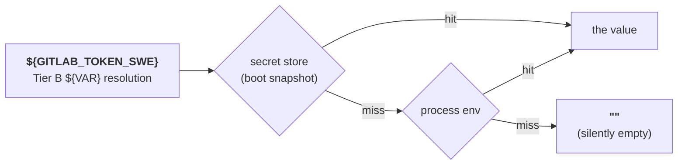

# Secret Store

The **secret store** is the company's encrypted credential store: one sealed value per `${VAR}` name, held on the coordination KV where **every node reads the same rows**, and consulted ahead of the process environment. It gives Crewlet a place to *keep* a secret that the engine can read back — so a provisioner that mints a credential can hand it straight to the engine instead of writing a file a human must source, and a rotation reaches the whole fleet rather than the one node an operator pointed a command at.

It is optional and inert until used. With nothing stored, `${VAR}` resolution is byte-for-byte what it has always been: the process environment.

> Related: [Configuration § Secrets](configuration.md#secrets) covers whole-config encryption at rest — a *different* mechanism with the same keyring. See [Which one do I want?](#which-one-do-i-want) below.

---

## The problem

`${VAR}` substitution has exactly one choke point in the engine, and its only source used to be the process environment. The stored config keeps the *reference* (`"${GITLAB_TOKEN_SWE}"`); only `os.Getenv` could answer it.

That is why the provisioning CLIs write `.env` files: the environment was the only address the reader knew. It leaves an awkward seam in an otherwise automated flow —

```
crewlet gitlab provision company.yaml    # mints PATs → .env.gitlab
source .env.gitlab                       # ← a human, in the right shell
crewlet run                              # ← restarted, in that same shell
```

— and every step in the middle is a way to get it wrong. The failure is silent: a `${VAR}` nothing answers resolves to `""`, which produces an empty Bearer token that looks live to every layer until the provider rejects it.

## The design

One record per environment-variable name, each value sealed with the Tier A keyring before it leaves the process:

```
_secrets (a coordination KV bucket, no TTL)
  name        the key            -- "GITLAB_TOKEN_SWE"
  value       "enc:v1:<key_id>:<base64>"
  key_id      which keyring entry sealed it
  updated_at
  updated_by
  source      "cli" | "api" | "gitlab-provision" | "rekey" | "migrated"
```

**Coordination owns the bytes; the engine owns the key.** The bucket holds an envelope whose key it does not have, which is what makes a shared store safe to put credentials in: a peer that can read the bucket learns which names exist and when they changed, not what they are. It is the same cipher, the same keyring and the same bucket family the company config already travels through.

The bucket has **no TTL**, unlike the delivery dedupe and the notification valve beside it. Retention elsewhere in coordination is a bucket's age; a credential is not short-horizon state, and an expiring secret is an outage on a timer.

At boot the engine loads every record into a process-local snapshot and installs it as the **secret source**. From then on `${VAR}` resolution asks the store first and falls back to the process environment:



Because substitution has a single choke point, that one change covers everything downstream: LLM API keys, per-role `mcp_env`, sandbox env, webhook secrets, contact identities, knowledge-search tokens.

### Store wins; the environment is the fallback

Deliberately, and not negotiable: env-first would let a stale `.env` shadow a freshly rotated secret, which is exactly the failure this removes. A rotation would appear to succeed and then quietly not take effect, surfacing days later as an auth error far from its cause.

When a name exists in both with **different** values, boot logs `secret_shadowed_env` at WARNING with the names (never the values). That is a cue to delete the stale export, not a problem in itself.

### A keyring is required

Unlike `company_config` — which supports a plaintext mode so pre-encryption deployments keep working — the secret store has **no plaintext mode**. There is no legacy corpus to stay compatible with, and a store whose whole purpose is holding secrets should not be able to hold them in the clear. A node with no keyring is still a supported deployment; it simply does not use the store, and resolves from the environment.

Each value is sealed with AES-256-GCM and the record's own `name` bound in as associated data, so a ciphertext moved to another name fails to decrypt rather than silently impersonating a different secret. That is also what makes a **read fail closed**: a snapshot that skipped a record it could not open would let the environment answer for it, which is exactly the stale-`.env` shadowing the store exists to prevent — so an unopenable record refuses the whole snapshot, loudly, and the previous one keeps serving.

### Two things that can never live in the store

The **store's own address** and the **keyring** itself. Tier A carries exactly what is needed to reach and decrypt the store, so it cannot source values from it. That boundary is explicit in the code — Tier A resolves through `config.EnvOnly()` — not an accident of boot ordering.

```yaml
# crewlet.yaml (Tier A) — always env/file-sourced, never from the store
store:
  path: /var/lib/crewlet/index.db
secrets:
  active_key_id: "2026-01"
  keys:
    - id: "2026-01"
      material: "${CREWLET_SECRET_KEY_2026_01}"
```

---

## Using it

### From the CLI

```bash
crewlet secrets keygen                           # a fresh key for the keyring
echo "$TOKEN" | crewlet secrets set GITLAB_TOKEN_SWE
crewlet secrets set SLACK_BOT_TOKEN_CEO          # reads stdin
crewlet secrets list                             # names + metadata, never values
crewlet secrets unset STALE_TOKEN
crewlet secrets get TOKEN -reveal                # break-glass; logged
crewlet secrets rekey                            # after a keyring rotation
```

The value is read from **stdin** by default rather than from `-value`, because an argv value is visible in `ps` output and lands in shell history. Exactly one trailing newline is stripped, so `echo "$TOKEN" | ...` does the right thing — and no more than one, because a secret may legitimately end in whitespace and altering it silently is a failure nobody can see.

Reading a value back is **break-glass on both sides**. `crewlet secrets get` refuses without `-reveal`, and the route behind it (`GET /secrets/{name}`) serves only metadata unless the request carries an explicit `?reveal=true` — a spelling a crawl or a link cannot reach by accident. Both log the access by name, against the operator the API guard authenticated; the answer is marked `Cache-Control: no-store` so it cannot sit in a shared proxy. The refusal points at `list`, because the common need is "is X set and when did it last change" — which the listing answers without putting a credential into a terminal, a scrollback buffer and a screen-share.

### Which store the CLI writes

`crewlet secrets` reaches the fleet's rows through a **running node's authenticated API**, because on the default topology the coordination KV lives inside the engine's own process and listens on no socket. There is nothing to guess about which route it takes: the engine holds an exclusive lock on its database for as long as it runs, so a locked store means "the engine is up, write through it" with a pid attached, and an unlocked one means it is not.

| The engine on this node is | `crewlet secrets` writes | Reaches |
|---|---|---|
| **running** | its `/secrets` API | every node, immediately |
| **stopped** | this node's own `secret_values` table | this node, until it starts |

A write made while the node was stopped is not stranded: at its next start the engine **migrates** those rows onto the fleet and removes them locally, preserving the original author and stamping `source=migrated`. That is the bootstrap path — the equivalent of `crewlet config import` against a stopped node — and the CLI says which of the two it used after every write.

`-api URL` writes through a named node instead, which is how the command works from a machine that is not the node at all. It authenticates with `CREWLET_API_TOKEN` when set, and otherwise with the first entry in the Tier A `api.auth.tokens` list; the token's id is recorded as the author of the write.

`crewlet secrets keygen` needs no config and no store: it is what an operator runs *before* either exists, and it prints the base64 form the keyring's `material` field takes.

Every other command reads the **Tier A** config for its keyring, never the company document. The store holds only ciphertext; the key material lives in the bootstrap file — on disk or in the environment, never in the database it opens.

### From a provisioner

Every provisioning CLI takes `-secret-store` in place of `-env-file`:

```bash
GITLAB_ADMIN_TOKEN="$GITLAB_ADMIN_TOKEN" crewlet gitlab provision company.yaml \
  -public-url https://engine.example.com \
  -secret-store
```

Minted PATs and the generated webhook signing secret go straight into the encrypted table under the same `${VAR}` names the config already references. The three-step dance collapses to one command — no file to source, no shell to be in.

`-secret-store` follows the same routing as `crewlet secrets`: against a
running node it writes through that node's API and the minted credential is on
every node at once, and it takes the same `-api URL` flag. Against a stopped
one it writes the local table, which the engine migrates at its next start.

`crewlet slack provision -secret-store` and
`crewlet mattermost provision -secret-store` work identically. Slack's own
app-configuration token pair is the one credential that does **not** go here:
it is the operator's, not the company's, and it lives in the
[app ledger](../integrations/slack.md#the-ledger-slack-appsjson) beside the company file.

Where it pays off most is a credential the vendor shows **once**. Every vendor
here returns a token's value once and never again — so the recorded copy *is*
the credential. A file someone has to remember to source is a worse home
for that than an encrypted table the engine reads back itself.

### Propagation

| When | What picks up a new value |
|---|---|
| `crewlet run` boot (every node role) | Reads the whole store before resolving any Tier B `${VAR}` |
| A config revision activates (`PUT /config`, `crewlet config import`) | Every node re-reads the **fleet's** store as it converges on the new activation epoch — engine and API halves alike |
| Otherwise | The running process keeps its snapshot |

**A write reaches every node, and the value is a value rather than a file to copy.** `crewlet secrets set` against a running node puts one sealed record on the coordination KV; every peer reads that same record at its next boot or activation. Nothing has to be run once per node, and nothing has to be copied to a node that scales up at 3am.

> **The node-local table is still there, and it is the bootstrap path.** The
> engine takes an exclusive lock on its database for as long as it runs — the
> store is **one file, one process**, and the driver does not reliably refuse a
> second writer, so before the lock existed a `crewlet secrets` against a live
> node corrupted the database silently. That lock is now also the *routing*
> signal: a locked store sends the command to the node's API, and an unlocked
> one means the engine is stopped and the local table is the only place a value
> can go until it starts.
>
> The lock is released by the kernel when the engine exits, however it exits —
> a crash, a `kill -9` and an OOM all free it, and there is no stale lock to
> clear by hand.

So `crewlet secrets set` against a running node takes effect fleet-wide at the next config activation or restart — the CLI says so after each write. Re-activating the *current* revision is a valid way to ask a running engine to pick up a rotated credential; the apply re-reads the store before it builds anything precisely so that gesture works, and the pointer's own KV sequence is the epoch — the store assigns a new one on every write — precisely so a re-activation still moves what every node is watching (see [Control Plane](control-plane.md)).

**What "picks up" means.** A rotated value is not useful until the things that *captured* it are rebuilt — an MCP child baked the resolved value into its spawn environment, an LLM provider holds it inside a constructed client, a transport holds it in a header. So re-activating an unchanged revision has to rebuild them, even though its payload is byte-identical.

It reaches most of them, and the reason is the shape of the control plane rather than a comparison. The pointer's KV sequence is the epoch and the store assigns a new one on every write, so re-activating a revision mints a new epoch; a node's reconciler skips on the *epoch* it has applied, never on the payload, so a re-activation always applies. `${VAR}` references stay verbatim in the stored revision and are resolved where a provider is **constructed** — and the secret snapshot is re-read immediately before that. There is no payload-equality shortcut for a rotation to slip through.

**Two holders it does not reach**, and both need naming before you plan a rotation around this gesture. A **per-role** MCP child belongs to its seat's lease rather than to the epoch, so it keeps the value it was spawned with until that seat next changes hands. The **Mattermost and Slack transports** are built once, at boot, and no apply rebuilds them — a rotated chat bot token needs a process restart. [Control Plane § Rotation](control-plane.md#rotation) has the full table of what a re-activation does and does not replace.

> One more surface, and it is out of the engine's hands entirely rather than merely off the apply path: a **running code sandbox** received its credentials in the box's environment at launch, and no engine-side refresh reaches a live box. There the effective bound is the run's duration plus any clarification pause, not seconds. Tear the run down if a rotation is a revocation.

---

## Which one do I want?

Two mechanisms share the Tier A keyring and are easy to confuse:

| | [Whole-config encryption](configuration.md#secrets) | Secret store (this page) |
|---|---|---|
| **What is encrypted** | The entire `company_config` payload as one blob | One value per row |
| **Keyed by** | Revision | Environment-variable name |
| **Where the secret lives** | Inline in the config document | In the `_secrets` coordination bucket, referenced by `${VAR}` |
| **Rotation** | New revision (a full immutable copy) | `UPDATE` of one row |
| **Written by** | `PUT /config`, `crewlet config import` | `PUT /secrets/{name}`, `crewlet secrets set`, provisioners |

They compose: encrypt the config document *and* keep credentials in the store. That is the recommended shape for any provisioned deployment, on one node or twenty — both travel the same replicated path, sealed with the same keyring.

**Why credentials belong in the store rather than inlined as literals in the config**, even though the config is itself encrypted:

- **Rotation would archive the old secret forever.** Every revision is an immutable full copy and revisions are never scrubbed, so each rotation leaves the superseded credential readable in history.
- **One credential, several pointers.** `role.integrations.slack.bot_token` and `role.mcp_env.slack.SLACK_MCP_XOXB_TOKEN` reference the *same* variable — one credential with two readers. Inlining literals duplicates it across pointers that must then update atomically or the identity split-brains. Keying by variable name keeps it one row.
- **Blast radius.** Losing the keyring with inlined literals loses your credentials, not just your config.

---

## How a node gets its secrets in the first place

The store is an **overlay**, not the source of truth, and knowing which is
which answers most operational questions about it.

Resolution order on any node, for any `${VAR}`:

1. **Tier A** (`crewlet.yaml`) resolves from the **process environment alone**.
   It has to: this file holds the keyring that opens the store, so a resolver
   reaching into the store would have Tier A reading from the thing it
   describes.
2. The engine connects to coordination and takes a **snapshot** of the whole
   secret store. (It also migrates any rows left in its own table first — see
   [Which store the CLI writes](#which-store-the-cli-writes).)
3. **Tier B** (the company document) resolves **store first, environment
   second**.

So a node with an empty store — or no keyring at all — resolves everything
from the environment and runs normally. That is not a degraded mode: *"no
keyring is a supported deployment; secrets come from the environment and the
store is simply not in use"* is the engine's own comment at the point it
decides. **A brand-new node always starts from the environment.** Nothing has
to be copied to it, and there is no first-boot step that reads a peer.

### Which one to use

| | Where credentials live | Rotation | New node starts |
|---|---|---|---|
| **One node** | Store (env as the fallback) | `crewlet secrets set`, then re-activate | From the env, then the store overlays it |
| **A fleet** | Store (env as the fallback) | `crewlet secrets set` against any node, then re-activate | From the env, then the same store every peer reads |

**The two columns are the same, and that is the point.** A credential is company-wide state, so it lives where the company config lives: one sealed copy on the coordination KV, written through any node's authenticated API, read by all of them.

The **environment stays the bootstrap path**, and it is a perfectly good place to keep credentials if your platform already does — a Kubernetes `Secret` projected as env, systemd's `EnvironmentFile=`, Compose's `env_file:`. A node with no keyring, or an empty store, resolves everything from the environment and runs normally. What is no longer true is that a fleet *has* to work that way.

> **Provisioner-minted credentials work fleet-wide too.** `crewlet gitlab
> provision`, `crewlet slack provision` and the rest MINT credentials, and
> `-secret-store` against a running node records them where every node reads
> them. Run it against a **stopped** node and the credential is that node's
> alone until it starts and migrates — which is fine for a first
> provisioning run and wrong for a rotation on a live fleet. `-env-file PATH`
> and `-print` remain for feeding a secret manager instead.

---

## What still has to be in the environment

Most `${VAR}` resolution funnels through one function, so the store covers it. A handful of places read a variable by name instead, and each was decided deliberately:

| Site | Source | Why |
|---|---|---|
| `providers.llm.*` / embeddings conventional-key fallback (`OPENAI_API_KEY`, `ANTHROPIC_API_KEY`) | **Store, then env** | Otherwise `crewlet secrets set OPENAI_API_KEY` would work through a config reference but not through the fallback |
| Everything a provisioning command reads out of the company document (`integrations.*.url`, `.workspace`, `.token`, `.signing_secret`) | **Store, then env** | The same chain the engine resolves through. A command that saw only the environment read an empty string for every value already rotated into the store — and for the GitLab signing secret, empty is the signal to *mint*, so a re-run replaced a working webhook secret at the vendor. Each command takes `-config` for this |
| Sandbox launch credential check | **Store, then env** | A seat whose token lives only in the store must not read as unresolved |
| Tier A bootstrap (`providers.database.dsn`, `secrets.keys[].material`) | **Env/file only** | Root of trust — this is what opens and decrypts the store |
| Operator provisioning credentials (`GITLAB_ADMIN_TOKEN`, `MATTERMOST_ADMIN_TOKEN`) | **Env only** | Human operator credentials, never persisted by Crewlet **and never read back from the store**: a GitLab admin PAT carries `api` scope over the whole group, and the store is read by every node holding the keyring. Reading one from it would imply it may be kept there |
| OTLP endpoint / protocol / headers, `CREWLET_SANDBOX_OTEL_RECEIVER_URL` | **Env only** | Deployment-environment settings that belong to the host, not the company; several are read before the store loads |
| `CREWLET_TOOL_SKILLS_SPACE` | **Env only** | Not secrets — flag defaults for the import/resync commands, read by nothing else |
| MCP stdio subprocess environment | **Env only, plus declared creds** | Servers read undeclared conventional variables (`PATH`, proxy vars, vendor SDK keys), so the host env is inherited. Store values are **not** poured in — each server gets exactly the credentials its `mcp_env` declares, already resolved. Injecting the whole store would hand every seat's token to every subprocess |

Nothing writes a minted value back into the process environment. **The sink is the only durability path**, and a value minted this run is read back through the sink — which is why a run must name one before it touches the vendor, and why `-print` reports itself as holding nothing rather than pretending otherwise.

A `-print` run that ROLLS BACK emits `unset VAR` for every value it printed,
followed by the comment saying why. The stream is meant to be sourced — that
is the whole reason it emits `export` lines — and a comment is a no-op to a
shell, so an operator who piped the output into `source` and then hit a
rollback would keep a revoked token exported in their session. Sourcing the
stream to its end now leaves the environment as it started.

**No sink feeds the engine directly.** `-env-file` writes a file to `source`
before the engine starts; the engine itself reads `${VAR}` from this store and
then from the process environment, and from nowhere else. `-secret-store` is
the one that needs no file and no restart — see [`crewlet config
activate`](../reference/cli.md#crewlet-config-activate).

---

## Operational notes

- **A missing value still resolves to `""`.** The store removes the most common cause, not the failure mode itself. `sandbox_env_unresolved` warns (names only) when a sandbox launch references something nothing answers, and the sandbox credential check refuses to launch a coding agent on an empty credential.
- **Backups.** The bucket holds only ciphertext; the keyring is the sole root of trust and lives in Tier A. Back them up separately — a coordination backup alone is unrecoverable, which is the point.
- **Key rotation.** Add the new key to `secrets.keys` **on every node**, set `active_key_id`, then run **both** `crewlet config rekey` and `crewlet secrets rekey` before dropping the old key. Each record's envelope names the key that sealed it, so mixed-key states are readable throughout. The store is shared, so `crewlet secrets rekey` is run **once** for the fleet, not once per node — and it refuses if the node it reaches seals under a different `active_key_id` than the config it was given, because a silent success there would report a rotation that did not happen. It aborts rather than half-completing if any record cannot be opened with the keyring in hand.
- **The `_secrets` bucket is created on demand** by the first node to open coordination, and it is durable: on the embedded topology it lives under `stream.store_dir` like every other bucket, so a restart does not lose it. Back that directory up alongside the keyring.
- **Rows left in a node's own `secret_values` table** — written before this change, or while its engine was stopped — are migrated onto the fleet at that node's next start and removed locally. The pass copies before it deletes and never overwrites a name the fleet already holds, because the fleet's copy is by definition the newer write. A failure leaves the local rows in place and logs `secret_migration_incomplete`; the node keeps serving from them and retries at the next start.

---

## See also

- [Configuration](configuration.md) — the two-tier split and whole-config encryption
- [CLI reference](../reference/cli.md#crewlet-secrets) — every `crewlet secrets` subcommand
- [Environment variables](../reference/environment-variables.md) — what still has to be in the environment
- [GitLab](../integrations/gitlab.md#provisioning) — the provisioning CLIs and their sinks
