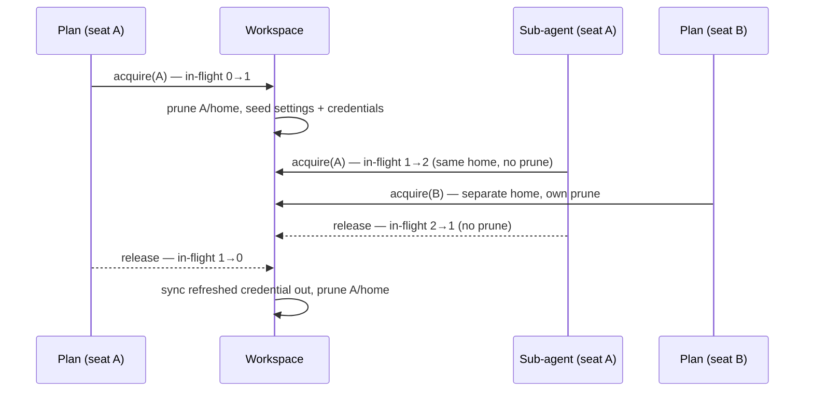

# Subscription LLM Backends

Run agents on a **coding CLI you already pay a subscription for** —
Claude Code, Codex, Gemini CLI, Qwen Code, OpenCode, Cursor, Copilot,
Grok or Muse Code — instead of a metered API key.
[Supported CLIs](#supported-clis) below is the full list.

The `cli-agent` provider type drives the vendor's own command-line tool
as a headless text model. The CLI holds the operator's OAuth login;
Crewlet never sees a password and never re-implements a vendor's auth.

```yaml
providers:
  llm:
    default:
      type: cli-agent
      model: sonnet              # whatever the CLI's --model accepts
      cli:
        agent: claude-code
```

```bash
# Already have the CLI logged in on this machine? Adopt that login:
crewlet llm login default -from-host
# Otherwise log in (or mint a headless token) inside Crewlet's own dir:
crewlet llm login default -capture-token
crewlet llm doctor default                  # verify before the first turn
```

> **The trade-off up front.** A subscription CLI is a *process*, not an
> HTTP endpoint. It is slower to start, its tool calls ride a JSON
> envelope rather than a native tool-call channel, and most vendors'
> terms are written for interactive use. It is an excellent fit for
> development, evaluation, and a small company you run yourself; a
> metered key remains the better fit for a large, latency-sensitive
> fleet. The two compose — see [Falling back to a metered
> key](#falling-back-to-a-metered-key). There is also a second way to
> spend a subscription that is not this page's backend at all — an
> [OAuth proxy behind an ordinary HTTP entry](#the-other-shape-an-oauth-proxy-in-front-of-an-http-entry),
> with a different set of trade-offs you own rather than Crewlet.

---

## Why this needs more than "shell out to a CLI"

Three problems have to be solved before a coding CLI can sit behind
[`LLMProvider`](overview.md#llm-provider), and each one is a section
below.

| Problem | Why it bites | Where it's solved |
|---|---|---|
| **Shared memory** | A CLI keeps sessions, history, todos, and project notes under one home. Seven seats on one subscription would read each other's transcripts. | [Isolation](#isolation-the-part-that-actually-matters) |
| **One model per entry** | A CLI takes `--model`, so per-phase models mean several entries — which must not mean several logins. | [Per-phase models](#per-phase-models) |
| **No tool channel** | The tool loop needs `tool_calls` back. A CLI prints prose. | [Tool calls](#tool-calls) |
| **Browser-only auth** | Vendor logins are OAuth (PKCE) with MFA — no password grant to script. | [Authentication](#authentication) |

---

## Isolation: the part that actually matters

One provider instance serves every seat in the org. Each **call** gets
its own place to run:

```
<state_dir>/
├── credentials/                  # the subscription login — ONE per provider
└── seats/
    ├── sarah-chen/
    │   ├── cache/                # XDG_CACHE_HOME — warm, holds no conversation
    │   ├── home/                 # HOME + XDG config/data/state + vendor dirs
    │   └── work/<call-id>/       # cwd for one call, then deleted
    └── marcus-rivera/
        └── …
```

**Between seats.** Every seat gets its own `home`. `HOME`,
`XDG_CONFIG_HOME`, `XDG_DATA_HOME`, `XDG_STATE_HOME`, `TMPDIR` and the
vendor's own relocation variable (`CLAUDE_CONFIG_DIR`, `CODEX_HOME`, …)
all point inside it. Nothing in a CLI's state layout is reachable across
that boundary.

**Between turns.** Each profile declares its `volatile_paths` —
sessions, transcripts, history, todo state. They are deleted before and
after every call. Crewlet's memory model is the [agent
diary](agent-learning.md) and the episode store; a second, invisible
memory inside the CLI would make turns non-reproducible and would carry
one task's context into the next.

**Between the seat and the host.** The child process gets an
**allowlisted** environment — `PATH`, locale, TLS trust, proxy settings,
plus whatever the profile and your `cli.env` declare — never
the process environment. Inheriting the engine's environment would hand every seat
the org's `SLACK_BOT_TOKEN` and database DSN. It would also, for a
subscription backend, silently bill a metered `ANTHROPIC_API_KEY` that
happened to be exported.

**Working directory.** Each call runs in an empty, per-call scratch
directory that is removed afterwards — so a CLI that reads `AGENTS.md` /
`CLAUDE.md` from `cwd`, or writes scratch files, finds nothing from
anyone else.

### Concurrency within a seat

Delegated [workers](turn-engine.md#workers) run in parallel and belong to the
*same* agent, so they share that seat's home — sharing memory between an
agent and its own workers is harmless by definition. Pruning is keyed
to the seat's in-flight count crossing zero: the first concurrent call
wipes and seeds, the last one to finish wipes again. Parallelism inside a
seat is preserved; nothing crosses a seat or a turn.



---

## Two modes: a text model, or the agent itself

A cli-agent entry runs one of two ways, named on the entry with
`cli.mode`. There is deliberately **no default beyond `text`** and no
inference, because both are defensible for the same CLI on the same
seat.

| | `mode: text` (default) | `mode: agent` |
|---|---|---|
| Who drives the loop | Crewlet's own tool loop | the CLI's |
| The CLI's shell and editor | denied | **enabled** — that is the point |
| Crewlet's tools | ride the prompt envelope; the engine executes them | reach the run over the [MCP bridge](#the-tool-bridge) |
| Where it runs | a subprocess of this engine | a sandbox box (`cli.run_in`) |
| Lifetime | one call, inside the phase | **detached** — outlives the turn, resumes it later |
| Needs | a login on this host | a login *plus* `providers.sandbox` and a reachable bridge URL |

**Text mode is predictable**: the tool log is the engine's own, every
call goes through the permission model and redaction, and it works with
no reachable API. **Agent mode is the vendor's own harness**: a real
shell, a real editor and a real checkout, which is what makes it worth
having for code work.

Only the **executor** branches. Every other phase — the reviewer, a
delegated worker, the summariser, the round-cap judge — is a text call on
the same entry, and a seat pointing `llm` at an agent-mode entry keeps
all of them. The reviewer in particular stays native and stays a separate
model call: the point of a reviewer is that it is not the thing being
reviewed.

### Agent mode

```yaml
providers:
  llm:
    subscription:
      type: cli-agent
      model: sonnet
      cli:
        agent: claude-code
        mode: agent                    # text (default) | agent
        run_in: direct                 # direct | container | e2b
```

`run_in` names a cell of [`providers.sandbox`](code-sandbox.md), and it
sits on the **entry** rather than on the seat because it is a property of
this runtime: the CLI's subscription login lives on the engine host, so
`direct` and `container` reach it directly while a remote cell needs the
headless token instead. Want both? Make two entries and point each seat
at the one that is right for it — the same way you already choose between
two models. Empty takes `providers.sandbox.default_run_in`.

The cell is checked like a seat's, at validation rather than at the
seat's first turn: it must be one the catalogue configures, an empty one
needs a default to fall to, and agent mode in a company with no
`providers.sandbox` at all is refused outright. The backend behind the
cell is built for it, so `run_in: container` needs `local.image` exactly
as a seat's would. `self` is not accepted here — it is a *seat's* answer,
meaning "my code work rides my executor's run", and an agent-mode entry
**is** that run. Only entries some seat's executor actually resolves to
are checked and built for; an entry nobody runs on is checked the day a
seat points at it. A seat that names no `llm` resolves the company-wide
fallback (the entry called `default`, else the first declared), so an
agent-mode entry can be reached without any seat naming it — but a
**human seat** never resolves one at all: it is addressable and never
spawned, so it runs no executor and reaches no entry.

The credential guard that refuses a remote run whose login cannot follow
it (see [Code Sandbox](code-sandbox.md#failure-modes)) reads **this**
entry for an agent-mode run — the run *is* the executor — and the seat's
`llm_sandbox` only for `run_sandbox` work.

An agent-mode run is a **detached coding run** and reuses that machinery
whole: the executor phase suspends, the run's state goes on a durable row
in the [coordination store](coordination.md), the completion poll collects
it, and the *same turn* resumes — possibly in another process on another
node, days later. Nothing about that is new for agent mode; see
[Code Sandbox](code-sandbox.md#how-a-coding-task-runs).

#### The tool bridge

The seat's tools cannot be shipped into the box: most are MCP children
holding the **seat's** credentials, several are engine control, and the
whole point of a sandbox is that its credentials are not the company's.
So the box gets exactly one MCP server — on the engine, named `crewlet` —
and every call comes back out through the *same* `tools.Surface` a native
loop would call. A tool denied natively is denied there; the skill guard,
the recording and the failure shape are the ones already tested. That
name is **reserved**: an `mcp_servers` entry may not use it, because the
bridge is written into every agent-mode box's server list under it and
would replace the entry there. The bridge advertises the seat's *live*
tool set — a tool the coding agent activates mid-run with `activate_tool`
is listed and callable on its next request, over the connection it already
holds — and every MCP session the box opened is closed the moment the run
ends, whatever ended it.

The endpoint is a per-run URL carrying a signed token that expires with
the run, and the session is closed the moment the run ends, whatever
ended it. Set **`CREWLET_MCP_BRIDGE_URL`** to a URL a sandbox can reach;
without it agent mode is **refused** at launch rather than started — a
coding agent with none of the seat's tools cannot answer anybody, cannot
touch a ticket and cannot submit its work.

> **In a fleet, that URL must address the node itself — not a load
> balancer in front of several, and not a standalone API process.** A
> session is a live tool surface: the seat's MCP children, its skill
> guard, its per-turn recording, all objects in the process that claimed
> the seat. Signing shares *authentication* across a fleet; it does not
> and could not share the surface. Each node mints its endpoint from its
> own value, so a per-node-addressable one is correct and a shared one
> sends calls to peers that never held the session. Those answer 401
> forever, and the response deliberately cannot say why — but the log
> can, and does: `mcp_bridge_unresolved` names this setting when the
> token is one the fleet signed.

The run ends by calling `submit_work` over that bridge, exactly as a
native loop ends by calling it locally, so the outcome vocabulary and the
rescue path are shared. A run that stops without submitting is rescued as
`incomplete` and judged on its record — the engine never reads the prose
a CLI happened to end with as a delivery.

Every bridged call is appended to the run's own durable row, bounded at
200 with the **middle** dropped, because that log is the whole record a
resume has: the process collecting a run may not be the one that launched
it, and without it a restart mid-run would leave the reviewer judging a
turn whose entire tool log is gone.

#### Code work inside the run

A seat whose executor already holds a shell has no use for a second box
beside it — two filesystems, with the work in the one the turn cannot
see. That is what [`role.sandbox.run_in: self`](code-sandbox.md#where-code-work-runs)
names: code work rides the executor's own run, `run_sandbox` refuses with
a message saying to use the shell it already has, and no second box is
provisioned. `self` is refused on any other runtime, and is not offerable
as a company-wide default.

## The system prompt in text mode

A coding CLI takes a prompt, not a conversation, so the transcript is
flattened into one text: `## system`, `## user`, `## assistant`,
`## tool result: name (call id)`. Everything below is about the one
section that does **not** belong there.

Folded into that text, a system prompt arrives as **user content** — the
model is asked to treat an ordinary message as its standing instructions,
underneath a vendor default that keeps saying what it is. So where a CLI
has a channel of its own for it, the profile names it in
`system_prompt_args` and the text travels there instead. Claude Code's is
declared as:

```yaml
system_prompt_args: ["--system-prompt-file", "{file}"]
```

Two decisions in that one line, both measured against Claude Code 2.1.263
rather than assumed:

- **Replace, not append.** Asked "who are you?" as a PM seat, the same
  model answers *"I'm Agent PM at Nimbus, an AI assistant helping with
  software engineering tasks and project work through Claude Code"* with
  the default prompt in force, and *"I'm Agent PM at Nimbus, your AI
  assistant for project management and technical collaboration"* with it
  replaced. A coding-agent identity over the top of whatever seat is
  actually being served is not a cosmetic problem: it is the seat's
  standing instructions arguing with themselves. The default prose also
  costs ~3.5k input tokens on every round of every phase, describing
  tools this backend denies. Replacing it leaves the web tools working —
  a `WebFetch` probe still fetches, which is what `crewlet llm doctor`
  measures on every run.
- **The file variant, not the inline one.** A seat's system prompt
  carries the org chart, the company's policies, that seat's backstory
  and roster, and its `## Personal memory` and `## Relevant knowledge`
  prefetches. On argv all of that is readable by every account on the
  machine through `/proc/<pid>/cmdline`, and bounded by `ARG_MAX`
  (256 KB on macOS — the limit the `copilot` profile's argv prompt
  already lives under). The text is written `0600` into the per-call
  working directory, which is created empty for one call and removed on
  release, so it cannot outlive the call or reach the next one.

`{file}` substitutes that path; `{system}` substitutes the text straight
into argv, for a CLI that offers no file variant. A profile that declares
neither leaves the system prompt in the transcript, which is what a CLI
with no such flag can take.

### Which CLIs actually have one

Checked by running each CLI's own `--help`, at the version named — not
from vendor documentation, which lags:

| `cli.agent` | version checked | flag | in the profile |
|---|---|---|---|
| `claude-code` | 2.1.263 | flag, file: `--system-prompt-file` (`--append-…-file` appends) | `system_prompt_args: ["--system-prompt-file", "{file}"]` |
| `gemini-cli` | 0.58.0 | **env var, file**: `GEMINI_SYSTEM_MD` — no flag exists | `system_prompt_env: GEMINI_SYSTEM_MD` |
| `qwen-code` | 0.23.0 | **both**: `QWEN_SYSTEM_MD` (file) *and* `--system-prompt` (string) | `system_prompt_env: QWEN_SYSTEM_MD` |
| `grok` | 1.0.13 | flag, string: `--system-prompt-override` (`--rules` appends) | `system_prompt_args: ["--system-prompt-override", "{system}"]` |
| `codex` | 0.153.4 | none, on `codex` or `codex exec` alike | — |
| `opencode` | 1.18.29 | none (`--agent` names a persona from its own config, not a per-call prompt) | — |
| `copilot` | 1.0.83 | none (`--no-custom-instructions` only disables its own) | — |
| `cursor-agent` | 2026.09.02 | none | — |
| `muse-code` | 1.0.3 | none (`AGENTS.md` / `CLAUDE.md` only, and only in a **trusted** workspace) | — |

**There are two channels, and `--help` only shows one of them.** A CLI may
take the prompt as an *argument* (`system_prompt_args`, with `{file}`
substituting a path and `{system}` the text itself) or from a *file named by
an environment variable* (`system_prompt_env`). Gemini CLI and its Qwen fork
have no flag at all and are configured entirely through the second — which is
why both were once recorded here as having no system-prompt channel, on the
strength of reading `--help`. A profile declares one or the other; naming
both is refused at load, because which copy a CLI honours when handed the
same prompt twice is the vendor's business.

**Prefer the file wherever both exist.** `{system}` puts the seat's system
prompt — the org chart, the policies, that seat's own memory — into argv,
where `/proc/<pid>/cmdline` makes it readable by every account on the
machine. `qwen-code` is the one CLI offering both, and this profile takes the
variable for exactly that reason. `grok` has only the string form, but its
*prompt* already travels on argv (`prompt_mode: argv`) so nothing changes
there; on a shared host, `cli.overrides.system_prompt_args: []` puts the
prompt back in the transcript.

**A vendor's project file is not a system-prompt channel.** `muse-code`
reads `AGENTS.md` and `CLAUDE.md`, but only once a workspace has been
*trusted* — and Crewlet runs it in a per-call directory created empty and
never trusted, precisely so that no rule, skill or hook from a checkout the
engine does not control is admitted. Writing the seat's identity there
would mean trusting that directory, which trades the whole guard for a
channel the transcript already provides.

**Check the CLI you actually have.** `grok` is the trap: xAI's own CLI
(`x.ai/cli`, [xai-org/grok-build](https://github.com/xai-org/grok-build))
and a same-named community package on npm both put a `grok` on PATH, and
they are different programs — the official one has the flag, the npm one
has none of this profile's flags at all. If `grok --version` prints a
`0.0.x`, you have the other one.

**Qwen Code is where the Gemini fork has diverged.** It renamed its parent's
variable (`QWEN_SYSTEM_MD`, and this build reads neither the other's) and
added two flags its parent does not have, so "same shape as `gemini-cli`" no
longer holds here.

For the five with no channel at all, `cli.overrides.system_prompt_args` and
`cli.overrides.system_prompt_env` are how you adopt one the day its vendor
ships it — no engine release needed.

---

## How the prompt itself travels

The rendered prompt is the *largest* thing this backend hands a CLI and,
after the system prompt, the most sensitive: the flattened transcript, the
tool catalogue, the conversation and every tool result in it. `prompt_mode`
says which channel carries it, and the three are not equivalent:

| `prompt_mode` | How | Ceiling | On `/proc/<pid>/cmdline`? |
|---|---|---|---|
| `stdin` (default) | written to the child's stdin | none | no |
| `file` | written `0600` into the per-call working directory; `prompt_args` carries the **path** through `{file}` | none | no — only the path |
| `argv` | appended as the last argument (or as `prompt_args`' value) | `ARG_MAX` — ~2 MB on Linux, 256 KB on macOS | **yes, in full** |

`argv` is a last resort, taken only where a vendor offers nothing else —
`copilot` and `grok` today. It has both failure modes: a long transcript
fails at `exec` rather than at the model, and every account on the machine
can read the conversation out of the process table while the call runs.

`file` is the same trade this backend already makes for the system prompt,
in the same directory, at the same mode, and for the same reasons. It needs
a vendor flag that takes a path; `muse-code` is the first built-in profile
whose CLI has one (`muse exec --prompt-file`), and its profile is

```yaml
prompt_mode: file
prompt_args: ["--prompt-file", "{file}"]
```

A `file` profile whose `prompt_args` contains no `{file}` is refused at
load: without it the CLI is run with no prompt at all, which a vendor
answers by opening an interactive session or printing usage — neither of
which looks like the configuration error it is.

---

## Tool calls in text mode

Every one of these CLIs has its own tools — file edits, shell, web
fetch. In **text mode** Crewlet does **not** use them: they run in the CLI's sandbox,
invisible to the [tool registry](../guides/tools-and-mcp.md), the
permission model, secret redaction, and the event stream. Routing agent
work through them would fork the engine's tool surface in two.

So every profile **denies the CLI's shell and file tools** wherever the
vendor offers a way to, and each says how: a flag on the command line
(Claude Code's `--disallowedTools`, Copilot's `--deny-tool`, grok's
`--disallowed-tools`, Codex's read-only sandbox) or a settings file the
engine writes into the seat's own home or the per-call working directory
before every call (Gemini's `settings.json`, OpenCode's `opencode.json`,
Cursor's `.cursor/cli.json`, Muse Code's `run.toolset`). The shell is the one that matters: the
seat's home and environment are isolated, but the filesystem is not, and
a CLI with a shell on the engine host reads whatever the engine user can
read. A vendor with no such switch is declared as
`local_tools: vendor-default` with a note saying which switch is missing
— and `crewlet llm doctor` **measures** the stance rather than trusting
it (see [Operating it](#operating-it)).

**A deny list, not an allow list, where a vendor offers both.** grok has
both and the profile takes `--disallowed-tools`, which reads backwards
until you look at how each is applied. Its allowlist is honoured only if
*every* entry resolves: one name the build does not recognise and the whole
filter is skipped with a warning, leaving every tool enabled. The deny list
always applies and only warns about the entry that matched nothing. So a
name this profile gets wrong costs one tool on a deny list and costs
everything on an allow list — and a vendor renaming a tool is exactly the
drift these profiles are built to expect.

**A refusal and a removal are not the same guard, and only one of them
is a denial.** `muse-code` is the profile that makes the difference
concrete. Its `--disable-shell` and `--disable-write` flags read like tool
denials and are not: measured against 1.0.3, `bash`, `bash_input`,
`write_file` and `edit_file` are still *advertised to the model*,
byte-identical to the baseline surface — the flags refuse the call when it
comes. A model that can see a shell will try to use it, and every such
attempt is a wasted round inside a CLI whose tool log the engine never
sees. What actually removes them is `run.toolset` in the seeded
`settings.json`: an allowlist of exact tool names, validated against the
CLI's own registry at startup, which replaces the surface outright. The
profile ships both — the allowlist because it is the denial, the flags
because a settings file that failed to apply should still refuse the call.
`codex` sits at the other end of the same distinction: its `--sandbox
read-only` contains the shell rather than removing it, and reads stay.
That residual is why `local_tools: denied` is a claim `crewlet llm doctor`
**measures** rather than one you take on trust.

**An approval prompt is a wedge in a headless run.** A CLI that stops to
ask sits on the seat's concurrency slot until `timeout_seconds` fires,
because there is nobody to answer. Every profile therefore removes the
asking rather than the guard: OpenCode's seeded policy is all `allow` and
`deny` and denies the tool that asks a person, and `muse-code` passes
`--disable-approval`, which is the posture its own vendor's headless
guidance asks for — approval prompts off, the OS sandbox still on.

**Web is the one local tool that stays on.** A subscription seat must
not have less reach than the same CLI at a terminal, and a fetch is a
read — it never gates a delivery. Where a vendor gates its web tools
behind an approval a headless run cannot answer, the profile allows them
explicitly (`--allowedTools WebFetch WebSearch`, Copilot's
`--allow-tool`); where its default web search answers from an offline
index, the profile switches it live (Codex's `web_search="live"`). What
the CLI reads on the web is not in the engine's event stream — the cost
of an unrecorded read, accepted. Seats on API models reach the web the
way they reach everything external, through the MCP servers you configure.

Both stances are profile fields, so an operator can override them like
any other — `cli.overrides.local_tools`, `cli.overrides.local_tools_note`,
and `cli.overrides.seed_files` (a list of `{path, in: home|work, content}`;
lists replace wholesale).

Instead the CLI is used strictly as a text model, and the tool channel
rides in the prompt:

1. The phase's messages flatten into a labelled transcript.
2. The `tools=[…]` array renders as a JSON catalogue (name, description,
   JSON Schema).
3. A response contract asks for one fenced JSON block:

   ```json
   {
     "message": "Short note to the operator, or an empty string.",
     "tool_calls": [{ "name": "tool_name", "arguments": { "arg": "value" } }]
   }
   ```

4. The reply is parsed back into `Completion.content` +
   `Completion.ToolCalls`.

The parser is deliberately forgiving — it accepts the last fenced block,
a bare object, `arguments` as a JSON string, and `message` / `content` /
`text` / `response` as synonyms. When nothing parses, the whole reply
becomes assistant content with no tool calls, and the tool loop's
existing `tool_choice="required"` corrective re-prompt takes over. A
malformed reply costs a round; it never crashes a turn.

**A call with no tools gets no contract.** Auxiliary work
(summarisation, the relevance filter) sends a plain prompt and reads a
plain answer, with no envelope to get wrong.

### Finding the answer in the CLI's output

Before any of that, something has to decide *which part of what the CLI
printed is the model's reply*. That is `output` plus `text_paths` on the
profile: `text` takes the whole of stdout, `json` reads one document and
`jsonl` concatenates every event that carries a text path, in stream
order. `text_paths` is a **list** so a vendor that moved the field
between releases needs no override — the first path that resolves to a
non-empty string wins, and an empty one falls through to the next.

**An enveloped stream needs one more thing than paths.** Muse Code wraps
every event in a single envelope shape and puts the kind in
`payload_type`, so `payload.text` is a *token fragment* of the reply on a
`run.output.delta`, a *tool's output* on a `tool.result`, and the
assembled reply on `run.terminal.completed`. A path walk cannot tell the
three apart: it would splice the tool output into the answer and then
repeat the answer. `event_type_path` names where the kind lives and
`text_events` says which kinds carry the reply:

```yaml
output: jsonl
event_type_path: ["payload_type"]
text_events: ["run.terminal.completed"]
text_paths: [["payload", "text"]]
```

Both or neither — one without the other configures nothing and is refused
at load, as is either on a profile that is not `jsonl`. They scope **text
only**: usage and error paths are still read across the whole stream,
because a stream reports those wherever it likes and the last value wins.
A profile that names an event filter also *streams* through it, so a
`jsonl` profile taking its answer from one terminal event delivers that
answer in a single delta at the end rather than pushing a tool's output
through as though the model had said it.

Four outcomes, kept apart on purpose, because three of them used to be
one — and only two of them are failures:

| What happened | What the engine does |
|---|---|
| A text path resolved to text | That text is the reply. |
| A text path resolved and every one was **empty** | The CLI answered with nothing. **An answer, not a failure**: a completion with empty content and the round's real token usage attached, which is exactly what the `openai` and `anthropic` backends return for a model that spends its whole budget thinking. The [tool loop](agent-runtime.md) corrects it — see [When the CLI answers with nothing](#when-the-cli-answers-with-nothing). |
| **No** text path resolved at all | The profile no longer matches the installed CLI. A retryable `SERVER` failure that names `text_paths`, points at `crewlet llm doctor`, and prints the **tail** of what the CLI output so you can write the override. |
| The CLI printed **nothing at all** on a zero exit | Its own message, because neither of the two above can say anything true about output that does not exist. A retryable `SERVER` failure carrying whatever it wrote on stderr, which is the only clue there is. |

Output that is not JSON at all is still an answer: a CLI that printed a
banner, a warning, or the vendor's own sentence about a spent plan is
read as prose rather than refused, which is what lets the
[limit sentinels](#falling-back-to-a-metered-key) be recognised on a
zero exit. Those sentinels are matched against the CLI's whole stdout
and stderr, so a drifted profile still yields a real `RATE_LIMIT` with
the vendor's own reset instant rather than a server fault.

**Why the last two are failures rather than answers.** They used to be
one case with the empty one, and the answer handed back was the CLI's raw
stdout — on the reasoning that an operator would then see the shape and
write an override. They would, but only after it had been *spoken as an
agent* first: an empty `result` on a Claude Code envelope meant the
seat's reply became
`{"duration_api_ms":11377,…,"result":"","type":"result"}`, the tool loop
appended that to the conversation and re-sent it every round, the
reviewer judged the turn on it, and the dashboard printed it as the
sentence the agent had said. The shape belongs in the error message,
where the only person who can act on it is the only one reading. Both
remaining failures are about *this build not being able to read the CLI*,
which is a fact about your machine — so the chain walking to another
entry is the right move.

### When the CLI answers with nothing

A model that spends its whole output budget on hidden reasoning exits 0,
reports success, bills hundreds of output tokens and leaves the answer
field **empty**. That is a *model* outcome, so the backend hands it back
as an answer of nothing rather than dressing it as an outage:

- **The round is charged.** An empty answer costs tokens, and it used to
  be the one outcome that spent them without ever reaching a budget.
- **The tool loop asks again, once.** A round that produced neither prose
  nor a tool call gets one corrective re-prompt naming what went wrong.
  One and not two: unlike a declined tool call, a second identical nudge
  is just the same prompt against the same model. A phase that required a
  tool call gets that corrective instead — `call one of these tools` is
  the better instruction and already covers it.
- **It is counted.** `empty_answer_rounds` on the phase record is the
  number of rounds that reached nobody. A seat whose model habitually
  answers nothing shows up there, and in `crewlet llm doctor`, which
  names an empty answer as such rather than reporting `it said: ""`.

If you see it repeatedly, the entry's **`model`** is the field to change.
`reasoning_effort` and `reasoning_budget_tokens` are refused on a
cli-agent entry precisely so nobody spends an afternoon on them: they are
per-call API parameters and a headless coding CLI takes neither.

### Token accounting

`Completion.InputTokens` / `output_tokens` come from the CLI's own
usage report where the profile can find one (Claude Code and Codex
report it; Gemini CLI's shape varies by version). Where it can't, the
counts are estimated at four characters per token — an approximation, but
[budgets](../getting-started/quickstart.md#token-budgets-optional) must
keep moving or a seat on this backend would run with no ceiling.
`crewlet llm doctor` tells you which of the two you are getting.

---

## Authentication

Vendor subscription logins are browser OAuth with PKCE, often with SSO,
MFA, or a one-time code. **There is no username/password grant to
script**, and driving a headless browser to type into one would break on
the vendor's next login-page change. Crewlet does not pretend otherwise.
What it does instead covers every deployment shape:

### 0. Already logged in on this machine? Adopt it

```bash
crewlet llm login default -from-host
```

The usual starting point: you have been running `claude` on this box
yourself for months. Crewlet **does not** use that login on its own —
the child process is given its own `HOME`, so your `~/.claude` is
invisible to it, which is exactly the isolation the rest of this page
depends on. `-from-host` copies the CLI's credential files out of your
home directory into Crewlet's, once, on request.

It is a *copy*, not a redirect: agents never write into your personal
credential file, so a fleet refreshing a token mid-session is not a
surprise you get handed. The cost is that both copies then descend from
one refresh token, and a vendor that rotates refresh tokens can log out
whichever side refreshes second. Where the CLI mints a headless token
(option 2 below), that is the better answer and avoids the fork
entirely — `crewlet llm login -from-host` says so after it runs.

`-home PATH` reads from somewhere other than the engine user's own home,
for a deployment where the engine runs as a different user than the one
that logged the CLI in.

`crewlet llm doctor` looks for a host login too, so "no login" on a
machine where the CLI plainly works explains itself:

```
credentials   : none on disk
host login    : .claude/.credentials.json (not adopted)
problems:
  - no login of its own, but this machine has one at
    ~/.claude/.credentials.json — adopt it with
    `crewlet llm login default -from-host`, or mint a headless
    CLAUDE_CODE_OAUTH_TOKEN with `-capture-token` (preferred: no
    shared refresh token)
```

### 1. Broker the vendor's own login (any CLI)

```bash
crewlet llm login default
```

Runs the real `claude auth login` / `codex login` / `opencode auth login`
attached to your terminal — follow its prompts exactly as you would by
hand. The only thing Crewlet controls is *where* the credential lands:
in the provider's isolated `credentials/` directory, separate from your
personal CLI login on the same machine.

Each profile names its vendor's own one-shot **auth subcommand**, which
prints its OAuth URL and returns once you have signed in. A profile that
named an in-session slash command instead would open an interactive
session rather than run a login: the session asks you to sign in itself,
then replays the slash command and asks a *second* time, and leaves you
in a REPL you have to interrupt — after a login that had already
succeeded. `crewlet llm login` returning you to your shell is the
signal that it worked; `crewlet llm doctor <KEY>` confirms it.

### 2. Capture a headless token (best where it exists)

```bash
crewlet llm login default -capture-token
```

Runs the vendor's token-minting command (`claude setup-token`) and puts
the result in the [encrypted secret store](secret-store.md) under the
profile's token variable — `CLAUDE_CODE_OAUTH_TOKEN` for Claude Code.
**Prefer this whenever the CLI offers it:** no credential files to sync,
no refresh-token rotation, and it survives an ephemeral container with
no persistent volume.

Minting is *interactive* — the CLI opens the same browser sign-in as
option 1 — so its prompts and its sign-in URL are shown on your terminal
while the token itself is captured. The token never touches stdout, which
is what leaves `-print-token` free to pipe cleanly into your own secret
manager.

Already have a token from elsewhere?

```bash
pass show anthropic/crewlet-oauth | crewlet llm login default -token-stdin
```

### 3. Username / password, where the CLI genuinely has one

```bash
vault read -field=password secret/gateway |
  crewlet llm login default -username ops@example.com -password-stdin
```

Available for a profile that declares `stdin_login` — the built-in
`opencode` profile, an operator's own wrapper, or a self-hosted gateway
CLI. The password is read from stdin or a declared environment variable,
never from argv (which is visible in `ps` and lands in shell history).

The Claude, Codex, and Gemini profiles deliberately leave `stdin_login`
unset, and the command says so rather than failing obscurely:

```
Error: the 'claude-code' CLI authenticates through the vendor's browser
OAuth flow — there is no username/password login to drive. Run
`crewlet llm login` (which brokers that flow), or
`crewlet llm login -capture-token` where the vendor mints a headless
token. If your build of this CLI does accept a credential, declare it
under providers.llm.<key>.cli.overrides.stdin_login.
```

If your CLI *does* accept a credential, wire it yourself — no Crewlet
change needed:

```yaml
cli:
  agent: custom
  overrides:
    binary: my-gateway-llm
    complete_args: ["--json"]
    stdin_login:
      args: ["login", "--user", "{username}"]
      stdin_template: "{password}\n"
```

### 4. Move a login onto another host

The engine may run in a container that is rebuilt on every deploy, or on
several hosts. Export the credential directory as one blob into the
encrypted secret store:

```bash
crewlet llm export default -secret-store
```

That engine restores it at boot when its own `credentials/` directory is
empty, so a fresh container on the same store comes up already authenticated.
It is **that node's** store and nothing else's — the rows do not travel, and a
second host needs its own `crewlet llm login`, or the same bundle handed to it
through `providers.llm[].auth.credential_bundle`. The blob is validated on the way back in — only the
profile's own credential paths, files only, size-capped — because an
archive is an execution surface if it is unpacked on trust.

Only the credential files travel. Sessions, history, and caches never go
into a bundle.

**Between two hosts that share no database**, pipe it instead:

```bash
crewlet llm export default | ssh other-host crewlet llm import default
```

`import` reads the bundle from **stdin** — a credential on argv is visible in
`ps` and lands in shell history — and refuses to overwrite a login the target
already has. A host that has been running holds the fresher refresh token, and
restoring a boot-time blob over it is how a fleet logs itself out; `crewlet
llm logout <KEY>` first if you mean to replace it.

### Token refresh across seats

OAuth access tokens expire in hours, and the CLI refreshes them
mid-run. Most vendors rotate the *refresh* token at the same time, so
Crewlet syncs a changed credential file back to the shared directory
when a seat's generation closes — otherwise the whole fleet would be
logged out at the next expiry. Two seats refreshing at the same instant
can still race, exactly as two terminals running the vendor's CLI would.
A headless token (option 2) has no refresh file and sidesteps this
entirely.

---

## Supported CLIs

| `cli.agent` | Binary | Subscription | Notes |
|---|---|---|---|
| `claude-code` | `claude` | Claude Pro / Max | `claude auth login` (and `auth status` / `auth logout`). `claude setup-token` gives a headless `CLAUDE_CODE_OAUTH_TOKEN`. Reports full usage incl. cache tokens. |
| `codex` | `codex` | ChatGPT Plus / Pro | `codex login`. Streams JSONL events; runs `--sandbox read-only`. |
| `gemini-cli` | `gemini` | Google AI Pro / free tier | First run starts the auth picker. `GOOGLE_CLOUD_PROJECT` passes through. |
| `qwen-code` | `qwen` | Qwen OAuth | Gemini CLI fork; same shape. |
| `opencode` | `opencode` | Anthropic / Copilot / any | `opencode auth login`; the one built-in profile with a credential login. |
| `cursor-agent` | `cursor-agent` | Cursor seat | `cursor-agent login`. |
| `copilot` | `copilot` | GitHub Copilot seat | Prompt goes on argv, so very long transcripts are bounded by `ARG_MAX`. Authenticates with a GitHub token, so `GITHUB_TOKEN` is its `api_key_env` — reached via `auth.mode: api-key` or `inherit-env`, never forwarded silently. |
| `grok` | `grok` | xAI | **xAI's own CLI** from [x.ai/cli](https://x.ai/cli), not the same-named npm package. Accepts `XAI_API_KEY` (the variable its own signed-out message names) through `auth.mode: api-key`. |
| `muse-code` | `muse` | Muse Code subscription (Everyday / High / Power Usage), or pay-as-you-go | `muse login` / `muse logout`; the browser sign-in stores `~/.config/muse/auth.json`, which `-from-host` adopts. **No status command** — this CLI has none. Mints no headless token: `META_API_KEY` is a *metered* Model API key, reached through `auth.mode: api-key`. Runs `muse exec --json`, denies its tools through a seeded `run.toolset`, and puts the prompt in a **file** rather than on argv. Reports no token counts anywhere on its stream, so they are estimated. |
| `custom` | — | — | Ships nothing; declare everything under `overrides`. |

### CLI flags drift — and that's a config edit, not a release

Every field of every profile is replaceable from YAML. When a vendor
renames a flag or changes its JSON shape, fix it in place:

```yaml
cli:
  agent: codex
  overrides:
    binary: /opt/homebrew/bin/codex
    complete_args: ["exec", "--json", "--skip-git-repo-check", "-"]
    text_paths: [["item", "text"], ["msg", "message"]]
```

Lists replace wholesale (position matters in an argv). Overrides are
validated against the profile model, so a typo fails `crewlet validate`
rather than an agent's first turn. `crewlet llm doctor` prints the CLI
version the built-in profile was written against next to the version you
actually have.

A drift that only shows up at *runtime* — the flags still work, the JSON
still parses, and the answer field moved — names itself: the completion
fails with the `text_paths` this profile looked in and the output the CLI
actually produced. See
[Finding the answer in the CLI's output](#finding-the-answer-in-the-clis-output).

**`limit_markers` and `auth_markers` drift the most quietly.** Every other
field fails visibly when it goes stale — a renamed flag is a non-zero exit
`doctor` reports on the spot. A sentinel is matched *verbatim* against the
CLI's own prose, so one the vendor has reworded simply never fires: a spent
plan then classifies as a fatal error instead of `RATE_LIMIT`, the
[fallback chain](#falling-back-to-a-metered-key) never carries the seat onto
a metered key, and nothing says so until somebody hits their cap. If your
CLI's wording differs from the built-in profile's, override it:

```yaml
cli:
  agent: claude-code
  overrides:
    limit_markers:
      - sentinel: "Usage limit reached"
    auth_markers:
      - sentinel: "Please run /login"
```

Take the sentinel from what your CLI actually prints, not from what it used
to print.

**And check where it prints it.** A sentinel can only match what the CLI
puts on stdout or stderr, and one vendor puts the failure *nowhere a
plain run would show it*: `muse exec` writes the fixed string `run ended
with Failed` to stderr and carries the real reason only in its
`run.terminal.failed` event. That is why the `muse-code` profile runs
with `--json` even though the event stream buys it no token counts — the
answer would read fine without it, and a spent plan would arrive as a
bare exit 1 that no marker could classify, so the seat would never fall
through to its metered key.

---

## Configuration reference

```yaml
providers:
  llm:
    subscription:
      type: cli-agent
      model: sonnet                    # passed to the CLI's --model
      cli:
        agent: claude-code             # or codex | gemini-cli | opencode
                                       #    | muse-code | …
        mode: text                     # text (default) | agent — see above
        run_in: ""                     # agent mode only: direct | container | e2b

        state_dir: /var/lib/crewlet/llm-cli/claude
        # Where credentials and per-seat homes live. Empty uses
        # $CREWLET_LLM_CLI_HOME/<key>, falling back to
        # ~/.crewlet/llm-cli/<key>. Point at a persistent volume when
        # the engine runs in an ephemeral container. A LITERAL PATH —
        # unlike the credential fields here it is not ${VAR}-expanded,
        # because it names where the engine keeps files rather than a
        # secret (the same reason the store path is a Tier A field).

        timeout_seconds: 300           # one CLI invocation, wall clock
        max_concurrent: 4              # CLI processes at once

        env:                           # extra child env, ${VAR}-resolved
          ANTHROPIC_SMALL_FAST_MODEL: haiku

        auth:
          mode: subscription           # subscription | api-key | inherit-env
          token: "${MY_OAUTH_TOKEN}"   # else the profile's own token var
          credential_bundle: "${MY_BUNDLE}"  # else CREWLET_LLM_CLI_<KEY>_CREDENTIALS

        overrides: {}                  # any CLIAgentProfile field
```

**`timeout_seconds` is separate from the entry's own
`timeout_seconds`** because the transports are not comparable: that one
is an HTTP client timeout (default 120 s), while this covers a process
launch — a Node runtime costs seconds before the first byte — plus the
model call and the CLI's internal retries. On breach the process *group*
is terminated (so the runtime's helpers go too) and the call is reported
as `TIMEOUT`, which the role's fallback chain retries.

**`max_concurrent: 4`** keeps peak memory near 1.5 GB: each CLI is a
full Node or Rust runtime at roughly 200–400 MB resident, and an
unbounded fleet of seats entering Plan together can exhaust a small
engine host. Subscription plans also throttle concurrency well below
what an API key allows, so a much higher number mostly buys rate-limit
errors. Raise it on a large host with a plan that permits it.

**`auth.mode` defaults to `subscription`, not `inherit-env`**, on
purpose: a backend that silently picked up a stray `ANTHROPIC_API_KEY`
would bill the metered account while you believed you were on a flat-rate
plan.

**A profile's `passthrough_env` may not name a credential**, and the
engine refuses one that does. Everything listed there is forwarded from
the engine's own environment *before* `auth.mode` is consulted, so a key
named there would reach every seat whatever the mode says — the same
metered-bill-on-a-flat-rate-plan failure the mode exists to prevent. Use
it for genuine non-secret configuration (`GOOGLE_CLOUD_PROJECT`, a
region); a CLI's key belongs in `api_key_env` or `token_env`, and
`auth.mode: inherit-env` is the deliberate way to let the host's value
through.

---

## Per-phase models

Nothing changes. Phase selection resolves by `providers.llm` **key**,
and the resolver never looks at a provider's type — so `llm`,
`llm_review`, `llm_subagent`, `llm_auxiliary`,
`llm_judge` and `llm_sandbox` all behave exactly as they do for API
entries, including mixing the two kinds in one role and including
list-form fallback chains. See
[Turn Engine — per-phase LLM models](turn-engine.md#per-phase-llm-models).

The one difference is *where the model string goes*: an API entry sends
it as a request field, a `cli-agent` entry passes it as `--model`. One
entry is still one model, so per-phase models mean one entry per model:

```yaml
providers:
  llm:
    opus-sub:
      type: cli-agent
      model: opus
      cli: { agent: claude-code, state_dir: /var/lib/crewlet/llm-cli/claude }
    sonnet-sub:
      type: cli-agent
      model: sonnet
      cli: { agent: claude-code, state_dir: /var/lib/crewlet/llm-cli/claude }
    cheap:
      type: openai
      model: gpt-4o-mini
      api_keys: ["${OPENAI_API_KEY}"]

roles:
  - name: Engineer
    llm: [opus-sub, cheap]          # the executor: subscription first, key when spent
    llm_review: sonnet-sub          # the reviewer, on a cheaper subscription model
    llm_auxiliary: cheap            # see the latency note below
```

**Point them at the same `state_dir` and they share one login.** Both
entries above then use the credential directory a single `crewlet llm
login` wrote, instead of needing one login per entry — the default
`state_dir` is per provider key precisely so unrelated providers do
*not* collide, which means entries that should share must say so. They
also share one set of per-seat homes and one generation, so a call on
one entry never wipes a live call on the other.

Entries sharing a `state_dir` must drive the **same** CLI: two different
CLIs disagree about which files are credentials and which are
conversation memory, so each would prune the other's state.
`crewlet validate` rejects that combination by name.

**Concurrency is per entry.** `max_concurrent` caps one provider's
processes, so two entries at the default of 4 can run 8 CLI processes at
once. Size them together against the engine host's memory.

**Auxiliary work is the one phase to think twice about.** Every
reflection, summarisation and the turn-start relevance prefetch goes through
`llm_auxiliary`, and each one pays a process launch on this backend.
Point it at a cheap API model unless you have no key at all. (Crewlet
does handle the latency: the auxiliary call's 60-second deadline is
widened to the provider's own `cli.timeout_seconds`, so a subscription
aux provider is not cut off mid-call — it is simply slower than it needs
to be.)

---

## Falling back to a metered key

A spent subscription window arrives as prose on a *successful* exit
("Usage limit reached · continuing automatically"). Crewlet matches that
wording — and, where the CLI relays the API's own error instead, the
`"type":"rate_limit_error"` in it — and
reports it as `RATE_LIMIT`, which is retryable — so the ordinary
[provider chain](turn-engine.md#per-phase-llm-models) carries the role
onto a metered key for the rest of the window and back again afterwards,
with no operator intervention:

```yaml
providers:
  llm:
    subscription:
      type: cli-agent
      model: sonnet
      cli: { agent: claude-code }
    metered:
      type: anthropic
      model: claude-sonnet-5
      api_keys: ["${ANTHROPIC_API_KEY}"]

roles:
  - name: Engineer
    llm: [subscription, metered]      # subscription first, key as backstop
```

An expired login classifies as `AUTH`, which is also retryable — so the
chain keeps the seat working while you re-run `crewlet llm login`.

### What a sentinel may be

Both recognitions are `limit_markers` / `auth_markers` on the profile: a
literal substring the vendor emits, plus (where it carries one) the field
holding the reset instant, so the retry-after is a datum rather than a
guess. They are matched against whatever the CLI printed — which on a
healthy call is **the model's own answer** — and a match benches the
credential for a cooldown and hands the seat to the next entry in the
chain.

So a sentinel has to be the vendor's *wording*, and a profile is refused
at `crewlet validate` if one contains no letters. The rule exists because
a shipped profile carried `sentinel: "429"`, and three digits matched as
a substring is not a rate limit — it is a model quoting an HTTP status, a
stack trace's line number, a token count, or any ten-digit epoch. Every
one of those took a working subscription out of service.

The other way a sentinel stops working is quieter — the vendor reworded
it, so it simply never fires. Both are fixed the same way, with
`cli.overrides.limit_markers`; see
[CLI flags drift](#cli-flags-drift--and-thats-a-config-edit-not-a-release)
for the shape, and take the wording from the sentence your CLI actually
printed, which a `FATAL` failure carries verbatim so that you can.

---

## The other shape: an OAuth proxy in front of an HTTP entry

Everything above drives the vendor's CLI as a **process**. There is a
second way to spend a subscription, which Crewlet supports without
knowing anything about it: run a **proxy** that holds the OAuth login
itself and re-exposes it as an ordinary Anthropic- or OpenAI-shaped HTTP
endpoint, then point a normal provider entry at it.

Crewlet needs no `cli-agent` block for this. It is an HTTP entry like any
other, and `base_url` is all that changes:

```yaml
providers:
  llm:
    # The proxy speaks the Anthropic Messages API.
    subscription-proxy:
      type: anthropic
      model: claude-sonnet-5
      base_url: "${LLM_PROXY_URL}"      # e.g. http://127.0.0.1:8317
      api_keys: ["${LLM_PROXY_KEY}"]    # the proxy's OWN inbound key

    # Or it speaks the OpenAI wire format.
    subscription-proxy-oai:
      type: openai-compatible
      model: gpt-5
      base_url: "${LLM_PROXY_URL}/v1"
      api_keys: ["${LLM_PROXY_KEY}"]
```

**`base_url` is not an `openai-compatible` field.** It is honoured on
`anthropic` and `openai` entries too — it is only *required* for
`openai-compatible`, which has no vendor default to fall back to. The
same field is what points an entry at a corporate egress proxy or an
Anthropic-API gateway, and the [code sandbox](code-sandbox.md) forwards
an `anthropic` entry's value to Claude Code as `ANTHROPIC_BASE_URL`.

**Which header your proxy will be handed** depends on the entry's type,
because each backend sends its vendor's native one:

| Entry type | Credential arrives as |
|---|---|
| `anthropic` | `x-api-key` — and only that. The backend builds its client with `WithoutEnvironmentDefaults`, which deliberately disables the SDK's own bearer-token path so an ambient `ANTHROPIC_AUTH_TOKEN` cannot redirect a company's auth |
| `openai`, `openai-compatible` | `Authorization: Bearer` |

The `api_keys` value is the credential for **the proxy**, not for the
vendor: the vendor login lives inside the proxy. Rotation, cooldowns and
the fleet-shared credential bench all apply to that inbound key as they
would to any other.

### What you gain, and what becomes yours

Against the `cli-agent` backend you get a real HTTP provider back: native
tool calls instead of the [in-prompt JSON envelope](#tool-calls), no
process launch per call, and whatever token accounting the endpoint
reports. Against a metered key you get flat-rate cost.

What you take on is everything this page's design otherwise handles for
you:

- **The isolation guarantees do not apply.** [Per-seat homes, volatile
  path pruning and the allowlisted child environment](#isolation-the-part-that-actually-matters)
  exist because a CLI keeps conversation state under one home. A proxy is
  one process serving every seat, so whatever session, cache or history
  it keeps is shared across your whole company — that is the proxy's
  design to answer, not Crewlet's.
- **`crewlet llm` does not see it.** `list`, `doctor`, `login` and the
  rest build `cli-agent` providers only, so there is no login state to
  report and no smoke test to run. Keeping the proxy authenticated is a
  separate operational job.
- **A spent window is not translated.** The [prose sentinel](#falling-back-to-a-metered-key)
  that turns "Usage limit reached" into a retryable `RATE_LIMIT` is the
  CLI backend's. Over HTTP you get whatever status the proxy returns, and
  only a 429 / 401 / 403 / 402 / 408 / 5xx is [retryable](turn-engine.md#per-phase-llm-models);
  anything else is fatal and the role's fallback chain will **not** walk
  to the next provider. Check what your proxy returns on an exhausted
  plan before you rely on `llm: [proxy, metered]`.

### Before you choose this

A proxy that spends a *subscription* rather than an API key has to
present itself to the vendor as the vendor's own client. In practice
that means reproducing a specific client build's headers, its beta
flags, sometimes its TLS fingerprint, and often injecting that client's
system prompt ahead of yours — which quietly changes what your prompts
say and where prompt-cache breakpoints land.

Vendor terms generally do not permit a third-party client to route
requests through consumer subscription credentials, and vendors have
enforced that. Crewlet's `cli-agent` backend is on the other side of
that line **by construction**: it runs the vendor's own unmodified CLI,
logged in by you, as a child process — Crewlet never sees a password,
never re-implements an auth flow, and never impersonates a client.
Pointing `base_url` at a proxy is a supported configuration and a
decision you are making, exactly as the note at the end of this page
says about plan terms generally.

None of this applies to an ordinary **gateway** — LiteLLM, a corporate
egress proxy, a self-hosted vLLM — reached through the same field with a
key you were issued. That is just an endpoint.

---

## Operating it

```bash
crewlet llm list                      # providers, agent, model, login state
crewlet llm doctor                    # verify all of them, end to end
crewlet llm doctor default -no-smoke # skip the real completion
crewlet llm status default            # ask the CLI who it's logged in as
crewlet llm logout default            # revoke locally + delete credentials
```

`doctor` is the command that matters. It checks the binary is on `PATH`,
runs its version probe, reports whether a login is present, says whether
token counts will be real or estimated — and then runs **three real
completions**: a smoke test with a real tool, because a profile can look
perfect and still not produce a parseable tool call; a **shell probe**,
which asks the CLI to run `date +%s` with its own shell and believes it
only if the answer is within minutes of the engine's clock (a model can
write a token it was asked to echo, but it cannot guess the current
epoch); and a **web probe**, which asks the CLI to fetch a public
endpoint that reports its own clock and applies the same test:

```
provider      : subscription
cli agent     : claude-code
mode          : text (a model behind the engine's tool loop)
binary        : /usr/local/bin/claude
version       : 2.0.31 (Claude Code)
written for   : Claude Code CLI 2.x (`claude --version`)
state dir     : /var/lib/crewlet/llm-cli/subscription
credentials   : present
token env     : set
token usage   : reported by CLI
smoke test    : ok — 812 in / 34 out
local tools   : denied by profile — probe: refused
web           : ok — fetched https://www.cloudflare.com/cdn-cgi/trace
problems      : none
```

On an **agent-mode** entry the report carries two more lines, and both
check something that fails at a seat's *first turn* and nowhere earlier:

```
mode          : agent (the CLI runs the executor)
agent runtime : runner: "claude-code" is registered
              : tool bridge: https://engine.example.com
```

The **runner** line is whether this build can actually drive that CLI as
a coding agent. Agent mode reuses the coding-agent runners rather than
growing a second way to invoke the same binary, and there are two of
them — `claude-code` and `opencode`. An entry naming any other CLI in
agent mode validates cleanly, appears in the schema and reports a
configured provider, then refuses the moment a seat has work. The
**tool bridge** line is `CREWLET_MCP_BRIDGE_URL`: without it every
agent-mode launch is refused, because a coding agent with none of the
seat's tools cannot answer anybody, touch a ticket or submit its work.

A text-mode entry reports neither, rather than reporting that it would
not work in a mode it is not in.

A profile that says `denied` while the shell ran is a problem naming the
installed version, because the vendor's switch is not taking effect on
it; a `vendor-default` profile whose shell ran is a problem stating the
trust you are taking on; a web tool that could not fetch is a problem
pointing at the vendor's sandbox flags and the egress proxy the child
environment was told about.

One caveat worth stating plainly: `doctor` spends three real completions.
On a subscription that is a few thousand tokens of your plan's allowance,
which is why `-no-smoke` exists for a scripted health check that runs
often — it skips all three and says so on each line.

---

## Limits and caveats

- **The CLI runs on the engine host.** It must be installed there, and
  the engine process must be able to execute it. This is not a remote
  service.
- **Agent mode needs more than a login.** A CLI with a coding-agent
  runner, a `providers.sandbox` catalogue to place the run in, and a
  bridge URL a box can dial. `crewlet llm doctor` checks all of it —
  see [Operating it](#operating-it).
- **Code work needs one more decision.** A subscription *can* back the
  [code sandbox](code-sandbox.md), two ways. On any backend including
  remote E2B, the headless token travels: `crewlet llm login <key>
  -capture-token` and Claude Code in the box bills your plan. For a CLI
  that mints no such token (Codex, Gemini CLI), use
  a [local cell](code-sandbox.md#local-sandboxes) — `providers.sandbox.local`
  plus `run_in: direct` or `container` — where the coding agent runs on
  the engine host and reads the login directly. The credential *files* never travel to a remote box: they
  carry a refresh token whose rotation is shared fleet state.
- **Latency.** Process launch plus model call. Point `llm_auxiliary` at
  a cheap API-key model rather than paying process startup for every
  summarisation.
- **No streaming.** `stream()` completes and yields one chunk. Crewlet's
  phases use `complete()`, so nothing in the engine is affected.
- **No `reasoning` switch.** The CLI's own plan carries its reasoning
  configuration and exposes no per-call setting; pick a reasoning model
  via `model` instead. Setting `reasoning: true` on a `cli-agent` entry
  is rejected at validation.
- **Check the vendor's terms.** Subscription plans are generally written
  for interactive use by the subscriber. Running a fleet of agents on
  one may not be permitted by your plan — that is a decision for you,
  not something Crewlet can decide for you. It is the sharper question
  for [the proxy shape](#the-other-shape-an-oauth-proxy-in-front-of-an-http-entry),
  where a third-party client is presenting itself as the vendor's own.

---

## See also

- [Overview — Provider Layer](overview.md#provider-layer)
- [Turn Engine — per-phase LLM models](turn-engine.md#per-phase-llm-models)
- [Secret Store](secret-store.md) — where tokens and credential bundles live
- [Code Sandbox](code-sandbox.md) — the *other* place Crewlet runs a coding agent
