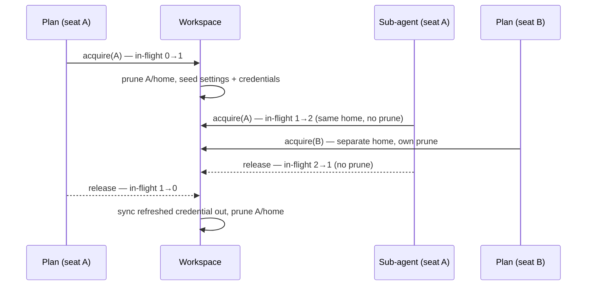

# Subscription LLM Backends

Run agents on a **coding CLI you already pay a subscription for** —
Claude Code, Codex, Gemini CLI, OpenCode, Cursor, Copilot — instead of a
metered API key.

The `cli-agent` provider type drives the vendor's own command-line tool
as a headless text model. The CLI holds the operator's OAuth login;
Crewlet never sees a password and never re-implements a vendor's auth.

```yaml
providers:
  llm:
    default:
      type: cli-agent
      model: sonnet              # whatever the CLI's --model accepts
      cli:
        agent: claude-code
```

```bash
# Already have the CLI logged in on this machine? Adopt that login:
crewlet llm login default -from-host
# Otherwise log in (or mint a headless token) inside Crewlet's own dir:
crewlet llm login default -capture-token
crewlet llm doctor default                  # verify before the first turn
```

> **The trade-off up front.** A subscription CLI is a *process*, not an
> HTTP endpoint. It is slower to start, its tool calls ride a JSON
> envelope rather than a native tool-call channel, and most vendors'
> terms are written for interactive use. It is an excellent fit for
> development, evaluation, and a small company you run yourself; a
> metered key remains the better fit for a large, latency-sensitive
> fleet. The two compose — see [Falling back to a metered
> key](#falling-back-to-a-metered-key). There is also a second way to
> spend a subscription that is not this page's backend at all — an
> [OAuth proxy behind an ordinary HTTP entry](#the-other-shape-an-oauth-proxy-in-front-of-an-http-entry),
> with a different set of trade-offs you own rather than Crewlet.

---

## Why this needs more than "shell out to a CLI"

Three problems have to be solved before a coding CLI can sit behind
[`LLMProvider`](overview.md#llm-provider), and each one is a section
below.

| Problem | Why it bites | Where it's solved |
|---|---|---|
| **Shared memory** | A CLI keeps sessions, history, todos, and project notes under one home. Seven seats on one subscription would read each other's transcripts. | [Isolation](#isolation-the-part-that-actually-matters) |
| **One model per entry** | A CLI takes `--model`, so per-phase models mean several entries — which must not mean several logins. | [Per-phase models](#per-phase-models) |
| **No tool channel** | The tool loop needs `tool_calls` back. A CLI prints prose. | [Tool calls](#tool-calls) |
| **Browser-only auth** | Vendor logins are OAuth (PKCE) with MFA — no password grant to script. | [Authentication](#authentication) |

---

## Isolation: the part that actually matters

One provider instance serves every seat in the org. Each **call** gets
its own place to run:

```
<state_dir>/
├── credentials/                  # the subscription login — ONE per provider
└── seats/
    ├── sarah-chen/
    │   ├── cache/                # XDG_CACHE_HOME — warm, holds no conversation
    │   ├── home/                 # HOME + XDG config/data/state + vendor dirs
    │   └── work/<call-id>/       # cwd for one call, then deleted
    └── marcus-rivera/
        └── …
```

**Between seats.** Every seat gets its own `home`. `HOME`,
`XDG_CONFIG_HOME`, `XDG_DATA_HOME`, `XDG_STATE_HOME`, `TMPDIR` and the
vendor's own relocation variable (`CLAUDE_CONFIG_DIR`, `CODEX_HOME`, …)
all point inside it. Nothing in a CLI's state layout is reachable across
that boundary.

**Between turns.** Each profile declares its `volatile_paths` —
sessions, transcripts, history, todo state. They are deleted before and
after every call. Crewlet's memory model is the [agent
diary](agent-learning.md) and the episode store; a second, invisible
memory inside the CLI would make turns non-reproducible and would carry
one task's context into the next.

**Between the seat and the host.** The child process gets an
**allowlisted** environment — `PATH`, locale, TLS trust, proxy settings,
plus whatever the profile and your `cli.env` declare — never
the process environment. Inheriting the engine's environment would hand every seat
the org's `SLACK_BOT_TOKEN` and database DSN. It would also, for a
subscription backend, silently bill a metered `ANTHROPIC_API_KEY` that
happened to be exported.

**Working directory.** Each call runs in an empty, per-call scratch
directory that is removed afterwards — so a CLI that reads `AGENTS.md` /
`CLAUDE.md` from `cwd`, or writes scratch files, finds nothing from
anyone else.

### Concurrency within a seat

Delegated [workers](turn-engine.md#workers) run in parallel and belong to the
*same* agent, so they share that seat's home — sharing memory between an
agent and its own workers is harmless by definition. Pruning is keyed
to the seat's in-flight count crossing zero: the first concurrent call
wipes and seeds, the last one to finish wipes again. Parallelism inside a
seat is preserved; nothing crosses a seat or a turn.



---

## Tool calls

Every one of these CLIs has its own tools — file edits, shell, web
fetch. Crewlet does **not** use them: they run in the CLI's sandbox,
invisible to the [tool registry](../guides/tools-and-mcp.md), the
permission model, secret redaction, and the event stream. Routing agent
work through them would fork the engine's tool surface in two.

So every profile **denies the CLI's shell and file tools** wherever the
vendor offers a way to, and each says how: a flag on the command line
(Claude Code's `--disallowedTools`, Copilot's `--deny-tool`, Codex's
read-only sandbox) or a settings file the engine writes into the seat's
own home or the per-call working directory before every call (Gemini's
`settings.json`, OpenCode's `opencode.json`, Cursor's `.cursor/cli.json`).
The shell is the one that matters: the seat's home and environment are
isolated, but the filesystem is not, and a CLI with a shell on the engine
host reads whatever the engine user can read. A vendor with no such
switch is declared as `local_tools: vendor-default` with a note saying
which switch is missing — and `crewlet llm doctor` **measures** the
stance rather than trusting it (see [Operating it](#operating-it)).

**Web is the one local tool that stays on.** A subscription seat must
not have less reach than the same CLI at a terminal, and a fetch is a
read — it never gates a delivery. Where a vendor gates its web tools
behind an approval a headless run cannot answer, the profile allows them
explicitly (`--allowedTools WebFetch WebSearch`, Copilot's
`--allow-tool`); where its default web search answers from an offline
index, the profile switches it live (Codex's `web_search="live"`). What
the CLI reads on the web is not in the engine's event stream — the cost
of an unrecorded read, accepted. Seats on API models reach the web the
way they reach everything external, through the MCP servers you configure.

Both stances are profile fields, so an operator can override them like
any other — `cli.overrides.local_tools`, `cli.overrides.local_tools_note`,
and `cli.overrides.seed_files` (a list of `{path, in: home|work, content}`;
lists replace wholesale).

Instead the CLI is used strictly as a text model, and the tool channel
rides in the prompt:

1. The phase's messages flatten into a labelled transcript.
2. The `tools=[…]` array renders as a JSON catalogue (name, description,
   JSON Schema).
3. A response contract asks for one fenced JSON block:

   ```json
   {
     "message": "Short note to the operator, or an empty string.",
     "tool_calls": [{ "name": "tool_name", "arguments": { "arg": "value" } }]
   }
   ```

4. The reply is parsed back into `Completion.content` +
   `Completion.ToolCalls`.

The parser is deliberately forgiving — it accepts the last fenced block,
a bare object, `arguments` as a JSON string, and `message` / `content` /
`text` / `response` as synonyms. When nothing parses, the whole reply
becomes assistant content with no tool calls, and the tool loop's
existing `tool_choice="required"` corrective re-prompt takes over. A
malformed reply costs a round; it never crashes a turn.

**A call with no tools gets no contract.** Auxiliary work
(summarisation, the relevance filter) sends a plain prompt and reads a
plain answer, with no envelope to get wrong.

### Token accounting

`Completion.InputTokens` / `output_tokens` come from the CLI's own
usage report where the profile can find one (Claude Code and Codex
report it; Gemini CLI's shape varies by version). Where it can't, the
counts are estimated at four characters per token — an approximation, but
[budgets](../getting-started/quickstart.md#token-budgets-optional) must
keep moving or a seat on this backend would run with no ceiling.
`crewlet llm doctor` tells you which of the two you are getting.

---

## Authentication

Vendor subscription logins are browser OAuth with PKCE, often with SSO,
MFA, or a one-time code. **There is no username/password grant to
script**, and driving a headless browser to type into one would break on
the vendor's next login-page change. Crewlet does not pretend otherwise.
What it does instead covers every deployment shape:

### 0. Already logged in on this machine? Adopt it

```bash
crewlet llm login default -from-host
```

The usual starting point: you have been running `claude` on this box
yourself for months. Crewlet **does not** use that login on its own —
the child process is given its own `HOME`, so your `~/.claude` is
invisible to it, which is exactly the isolation the rest of this page
depends on. `-from-host` copies the CLI's credential files out of your
home directory into Crewlet's, once, on request.

It is a *copy*, not a redirect: agents never write into your personal
credential file, so a fleet refreshing a token mid-session is not a
surprise you get handed. The cost is that both copies then descend from
one refresh token, and a vendor that rotates refresh tokens can log out
whichever side refreshes second. Where the CLI mints a headless token
(option 2 below), that is the better answer and avoids the fork
entirely — `crewlet llm login -from-host` says so after it runs.

`-home PATH` reads from somewhere other than the engine user's own home,
for a deployment where the engine runs as a different user than the one
that logged the CLI in.

`crewlet llm doctor` looks for a host login too, so "no login" on a
machine where the CLI plainly works explains itself:

```
credentials   : none on disk
host login    : .claude/.credentials.json (not adopted)
problems:
  - no login of its own, but this machine has one at
    ~/.claude/.credentials.json — adopt it with
    `crewlet llm login default -from-host`, or mint a headless
    CLAUDE_CODE_OAUTH_TOKEN with `-capture-token` (preferred: no
    shared refresh token)
```

### 1. Broker the vendor's own login (any CLI)

```bash
crewlet llm login default
```

Runs the real `claude /login` / `codex login` / `opencode auth login`
attached to your terminal — follow its prompts exactly as you would by
hand. The only thing Crewlet controls is *where* the credential lands:
in the provider's isolated `credentials/` directory, separate from your
personal CLI login on the same machine.

### 2. Capture a headless token (best where it exists)

```bash
crewlet llm login default -capture-token
```

Runs the vendor's token-minting command (`claude setup-token`) and puts
the result in the [encrypted secret store](secret-store.md) under the
profile's token variable — `CLAUDE_CODE_OAUTH_TOKEN` for Claude Code.
**Prefer this whenever the CLI offers it:** no credential files to sync,
no refresh-token rotation, and it survives an ephemeral container with
no persistent volume.

Already have a token from elsewhere?

```bash
pass show anthropic/crewlet-oauth | crewlet llm login default -token-stdin
```

### 3. Username / password, where the CLI genuinely has one

```bash
vault read -field=password secret/gateway |
  crewlet llm login default -username ops@example.com -password-stdin
```

Available for a profile that declares `stdin_login` — the built-in
`opencode` profile, an operator's own wrapper, or a self-hosted gateway
CLI. The password is read from stdin or a declared environment variable,
never from argv (which is visible in `ps` and lands in shell history).

The Claude, Codex, and Gemini profiles deliberately leave `stdin_login`
unset, and the command says so rather than failing obscurely:

```
Error: the 'claude-code' CLI authenticates through the vendor's browser
OAuth flow — there is no username/password login to drive. Run
`crewlet llm login` (which brokers that flow), or
`crewlet llm login -capture-token` where the vendor mints a headless
token. If your build of this CLI does accept a credential, declare it
under providers.llm.<key>.cli.overrides.stdin_login.
```

If your CLI *does* accept a credential, wire it yourself — no Crewlet
change needed:

```yaml
cli:
  agent: custom
  overrides:
    binary: my-gateway-llm
    complete_args: ["--json"]
    stdin_login:
      args: ["login", "--user", "{username}"]
      stdin_template: "{password}\n"
```

### 4. Move a login onto another host

The engine may run in a container that is rebuilt on every deploy, or on
several hosts. Export the credential directory as one blob into the
encrypted secret store:

```bash
crewlet llm export default -secret-store
```

That engine restores it at boot when its own `credentials/` directory is
empty, so a fresh container on the same store comes up already authenticated.
It is **that node's** store and nothing else's — the rows do not travel, and a
second host needs its own `crewlet llm login`, or the same bundle handed to it
through `providers.llm[].auth.credential_bundle`. The blob is validated on the way back in — only the
profile's own credential paths, files only, size-capped — because an
archive is an execution surface if it is unpacked on trust.

Only the credential files travel. Sessions, history, and caches never go
into a bundle.

**Between two hosts that share no database**, pipe it instead:

```bash
crewlet llm export default | ssh other-host crewlet llm import default
```

`import` reads the bundle from **stdin** — a credential on argv is visible in
`ps` and lands in shell history — and refuses to overwrite a login the target
already has. A host that has been running holds the fresher refresh token, and
restoring a boot-time blob over it is how a fleet logs itself out; `crewlet
llm logout <KEY>` first if you mean to replace it.

### Token refresh across seats

OAuth access tokens expire in hours, and the CLI refreshes them
mid-run. Most vendors rotate the *refresh* token at the same time, so
Crewlet syncs a changed credential file back to the shared directory
when a seat's generation closes — otherwise the whole fleet would be
logged out at the next expiry. Two seats refreshing at the same instant
can still race, exactly as two terminals running the vendor's CLI would.
A headless token (option 2) has no refresh file and sidesteps this
entirely.

---

## Supported CLIs

| `cli.agent` | Binary | Subscription | Notes |
|---|---|---|---|
| `claude-code` | `claude` | Claude Pro / Max | `claude setup-token` gives a headless `CLAUDE_CODE_OAUTH_TOKEN`. Reports full usage incl. cache tokens. |
| `codex` | `codex` | ChatGPT Plus / Pro | `codex login`. Streams JSONL events; runs `--sandbox read-only`. |
| `gemini-cli` | `gemini` | Google AI Pro / free tier | First run starts the auth picker. `GOOGLE_CLOUD_PROJECT` passes through. |
| `qwen-code` | `qwen` | Qwen OAuth | Gemini CLI fork; same shape. |
| `opencode` | `opencode` | Anthropic / Copilot / any | `opencode auth login`; the one built-in profile with a credential login. |
| `cursor-agent` | `cursor-agent` | Cursor seat | `cursor-agent login`. |
| `copilot` | `copilot` | GitHub Copilot seat | Prompt goes on argv, so very long transcripts are bounded by `ARG_MAX`. Authenticates with a GitHub token, so `GITHUB_TOKEN` is its `api_key_env` — reached via `auth.mode: api-key` or `inherit-env`, never forwarded silently. |
| `grok` | `grok` | xAI | Accepts `GROK_API_KEY` (or `XAI_API_KEY`, via an `api_key_env` override) through `auth.mode: api-key`. |
| `custom` | — | — | Ships nothing; declare everything under `overrides`. |

### CLI flags drift — and that's a config edit, not a release

Every field of every profile is replaceable from YAML. When a vendor
renames a flag or changes its JSON shape, fix it in place:

```yaml
cli:
  agent: codex
  overrides:
    binary: /opt/homebrew/bin/codex
    complete_args: ["exec", "--json", "--skip-git-repo-check", "-"]
    text_paths: [["item", "text"], ["msg", "message"]]
```

Lists replace wholesale (position matters in an argv). Overrides are
validated against the profile model, so a typo fails `crewlet validate`
rather than an agent's first turn. `crewlet llm doctor` prints the CLI
version the built-in profile was written against next to the version you
actually have.

---

## Configuration reference

```yaml
providers:
  llm:
    subscription:
      type: cli-agent
      model: sonnet                    # passed to the CLI's --model
      cli:
        agent: claude-code             # or codex | gemini-cli | opencode | …

        state_dir: /var/lib/crewlet/llm-cli/claude
        # Where credentials and per-seat homes live. Empty uses
        # $CREWLET_LLM_CLI_HOME/<key>, falling back to
        # ~/.crewlet/llm-cli/<key>. Point at a persistent volume when
        # the engine runs in an ephemeral container.

        timeout_seconds: 300           # one CLI invocation, wall clock
        max_concurrent: 4              # CLI processes at once

        env:                           # extra child env, ${VAR}-resolved
          ANTHROPIC_SMALL_FAST_MODEL: haiku

        auth:
          mode: subscription           # subscription | api-key | inherit-env
          token: "${MY_OAUTH_TOKEN}"   # else the profile's own token var
          credential_bundle: "${MY_BUNDLE}"  # else CREWLET_LLM_CLI_<KEY>_CREDENTIALS

        overrides: {}                  # any CLIAgentProfile field
```

**`timeout_seconds` is separate from the entry's own
`timeout_seconds`** because the transports are not comparable: that one
is an HTTP client timeout (default 120 s), while this covers a process
launch — a Node runtime costs seconds before the first byte — plus the
model call and the CLI's internal retries. On breach the process *group*
is terminated (so the runtime's helpers go too) and the call is reported
as `TIMEOUT`, which the role's fallback chain retries.

**`max_concurrent: 4`** keeps peak memory near 1.5 GB: each CLI is a
full Node or Rust runtime at roughly 200–400 MB resident, and an
unbounded fleet of seats entering Plan together can exhaust a small
engine host. Subscription plans also throttle concurrency well below
what an API key allows, so a much higher number mostly buys rate-limit
errors. Raise it on a large host with a plan that permits it.

**`auth.mode` defaults to `subscription`, not `inherit-env`**, on
purpose: a backend that silently picked up a stray `ANTHROPIC_API_KEY`
would bill the metered account while you believed you were on a flat-rate
plan.

**A profile's `passthrough_env` may not name a credential**, and the
engine refuses one that does. Everything listed there is forwarded from
the engine's own environment *before* `auth.mode` is consulted, so a key
named there would reach every seat whatever the mode says — the same
metered-bill-on-a-flat-rate-plan failure the mode exists to prevent. Use
it for genuine non-secret configuration (`GOOGLE_CLOUD_PROJECT`, a
region); a CLI's key belongs in `api_key_env` or `token_env`, and
`auth.mode: inherit-env` is the deliberate way to let the host's value
through.

---

## Per-phase models

Nothing changes. Phase selection resolves by `providers.llm` **key**,
and the resolver never looks at a provider's type — so `llm`,
`llm_review`, `llm_subagent`, `llm_auxiliary`,
`llm_judge` and `llm_sandbox` all behave exactly as they do for API
entries, including mixing the two kinds in one role and including
list-form fallback chains. See
[Turn Engine — per-phase LLM models](turn-engine.md#per-phase-llm-models).

The one difference is *where the model string goes*: an API entry sends
it as a request field, a `cli-agent` entry passes it as `--model`. One
entry is still one model, so per-phase models mean one entry per model:

```yaml
providers:
  llm:
    opus-sub:
      type: cli-agent
      model: opus
      cli: { agent: claude-code, state_dir: /var/lib/crewlet/llm-cli/claude }
    sonnet-sub:
      type: cli-agent
      model: sonnet
      cli: { agent: claude-code, state_dir: /var/lib/crewlet/llm-cli/claude }
    cheap:
      type: openai
      model: gpt-4o-mini
      api_keys: ["${OPENAI_API_KEY}"]

roles:
  - name: Engineer
    llm: [opus-sub, cheap]          # the executor: subscription first, key when spent
    llm_review: sonnet-sub          # the reviewer, on a cheaper subscription model
    llm_auxiliary: cheap            # see the latency note below
```

**Point them at the same `state_dir` and they share one login.** Both
entries above then use the credential directory a single `crewlet llm
login` wrote, instead of needing one login per entry — the default
`state_dir` is per provider key precisely so unrelated providers do
*not* collide, which means entries that should share must say so. They
also share one set of per-seat homes and one generation, so a call on
one entry never wipes a live call on the other.

Entries sharing a `state_dir` must drive the **same** CLI: two different
CLIs disagree about which files are credentials and which are
conversation memory, so each would prune the other's state.
`crewlet validate` rejects that combination by name.

**Concurrency is per entry.** `max_concurrent` caps one provider's
processes, so two entries at the default of 4 can run 8 CLI processes at
once. Size them together against the engine host's memory.

**Auxiliary work is the one phase to think twice about.** Every
reflection, summarisation and the turn-start relevance prefetch goes through
`llm_auxiliary`, and each one pays a process launch on this backend.
Point it at a cheap API model unless you have no key at all. (Crewlet
does handle the latency: the auxiliary call's 60-second deadline is
widened to the provider's own `cli.timeout_seconds`, so a subscription
aux provider is not cut off mid-call — it is simply slower than it needs
to be.)

---

## Falling back to a metered key

A spent subscription window arrives as prose on a *successful* exit
("Usage limit reached. Resets at 4pm."). Crewlet matches that wording and
reports it as `RATE_LIMIT`, which is retryable — so the ordinary
[provider chain](turn-engine.md#per-phase-llm-models) carries the role
onto a metered key for the rest of the window and back again afterwards,
with no operator intervention:

```yaml
providers:
  llm:
    subscription:
      type: cli-agent
      model: sonnet
      cli: { agent: claude-code }
    metered:
      type: anthropic
      model: claude-sonnet-5
      api_keys: ["${ANTHROPIC_API_KEY}"]

roles:
  - name: Engineer
    llm: [subscription, metered]      # subscription first, key as backstop
```

An expired login classifies as `AUTH`, which is also retryable — so the
chain keeps the seat working while you re-run `crewlet llm login`.

---

## The other shape: an OAuth proxy in front of an HTTP entry

Everything above drives the vendor's CLI as a **process**. There is a
second way to spend a subscription, which Crewlet supports without
knowing anything about it: run a **proxy** that holds the OAuth login
itself and re-exposes it as an ordinary Anthropic- or OpenAI-shaped HTTP
endpoint, then point a normal provider entry at it.

Crewlet needs no `cli-agent` block for this. It is an HTTP entry like any
other, and `base_url` is all that changes:

```yaml
providers:
  llm:
    # The proxy speaks the Anthropic Messages API.
    subscription-proxy:
      type: anthropic
      model: claude-sonnet-5
      base_url: "${LLM_PROXY_URL}"      # e.g. http://127.0.0.1:8317
      api_keys: ["${LLM_PROXY_KEY}"]    # the proxy's OWN inbound key

    # Or it speaks the OpenAI wire format.
    subscription-proxy-oai:
      type: openai-compatible
      model: gpt-5
      base_url: "${LLM_PROXY_URL}/v1"
      api_keys: ["${LLM_PROXY_KEY}"]
```

**`base_url` is not an `openai-compatible` field.** It is honoured on
`anthropic` and `openai` entries too — it is only *required* for
`openai-compatible`, which has no vendor default to fall back to. The
same field is what points an entry at a corporate egress proxy or an
Anthropic-API gateway, and the [code sandbox](code-sandbox.md) forwards
an `anthropic` entry's value to Claude Code as `ANTHROPIC_BASE_URL`.

**Which header your proxy will be handed** depends on the entry's type,
because each backend sends its vendor's native one:

| Entry type | Credential arrives as |
|---|---|
| `anthropic` | `x-api-key` — and only that. The backend builds its client with `WithoutEnvironmentDefaults`, which deliberately disables the SDK's own bearer-token path so an ambient `ANTHROPIC_AUTH_TOKEN` cannot redirect a company's auth |
| `openai`, `openai-compatible` | `Authorization: Bearer` |

The `api_keys` value is the credential for **the proxy**, not for the
vendor: the vendor login lives inside the proxy. Rotation, cooldowns and
the fleet-shared credential bench all apply to that inbound key as they
would to any other.

### What you gain, and what becomes yours

Against the `cli-agent` backend you get a real HTTP provider back: native
tool calls instead of the [in-prompt JSON envelope](#tool-calls), no
process launch per call, and whatever token accounting the endpoint
reports. Against a metered key you get flat-rate cost.

What you take on is everything this page's design otherwise handles for
you:

- **The isolation guarantees do not apply.** [Per-seat homes, volatile
  path pruning and the allowlisted child environment](#isolation-the-part-that-actually-matters)
  exist because a CLI keeps conversation state under one home. A proxy is
  one process serving every seat, so whatever session, cache or history
  it keeps is shared across your whole company — that is the proxy's
  design to answer, not Crewlet's.
- **`crewlet llm` does not see it.** `list`, `doctor`, `login` and the
  rest build `cli-agent` providers only, so there is no login state to
  report and no smoke test to run. Keeping the proxy authenticated is a
  separate operational job.
- **A spent window is not translated.** The [prose sentinel](#falling-back-to-a-metered-key)
  that turns "Usage limit reached" into a retryable `RATE_LIMIT` is the
  CLI backend's. Over HTTP you get whatever status the proxy returns, and
  only a 429 / 401 / 403 / 402 / 408 / 5xx is [retryable](turn-engine.md#per-phase-llm-models);
  anything else is fatal and the role's fallback chain will **not** walk
  to the next provider. Check what your proxy returns on an exhausted
  plan before you rely on `llm: [proxy, metered]`.

### Before you choose this

A proxy that spends a *subscription* rather than an API key has to
present itself to the vendor as the vendor's own client. In practice
that means reproducing a specific client build's headers, its beta
flags, sometimes its TLS fingerprint, and often injecting that client's
system prompt ahead of yours — which quietly changes what your prompts
say and where prompt-cache breakpoints land.

Vendor terms generally do not permit a third-party client to route
requests through consumer subscription credentials, and vendors have
enforced that. Crewlet's `cli-agent` backend is on the other side of
that line **by construction**: it runs the vendor's own unmodified CLI,
logged in by you, as a child process — Crewlet never sees a password,
never re-implements an auth flow, and never impersonates a client.
Pointing `base_url` at a proxy is a supported configuration and a
decision you are making, exactly as the note at the end of this page
says about plan terms generally.

None of this applies to an ordinary **gateway** — LiteLLM, a corporate
egress proxy, a self-hosted vLLM — reached through the same field with a
key you were issued. That is just an endpoint.

---

## Operating it

```bash
crewlet llm list                      # providers, agent, model, login state
crewlet llm doctor                    # verify all of them, end to end
crewlet llm doctor default -no-smoke # skip the real completion
crewlet llm status default            # ask the CLI who it's logged in as
crewlet llm logout default            # revoke locally + delete credentials
```

`doctor` is the command that matters. It checks the binary is on `PATH`,
runs its version probe, reports whether a login is present, says whether
token counts will be real or estimated — and then runs **three real
completions**: a smoke test with a real tool, because a profile can look
perfect and still not produce a parseable tool call; a **shell probe**,
which asks the CLI to run `date +%s` with its own shell and believes it
only if the answer is within minutes of the engine's clock (a model can
write a token it was asked to echo, but it cannot guess the current
epoch); and a **web probe**, which asks the CLI to fetch a public
endpoint that reports its own clock and applies the same test:

```
provider      : subscription
cli agent     : claude-code
binary        : /usr/local/bin/claude
version       : 2.0.31 (Claude Code)
written for   : Claude Code CLI 2.x (`claude --version`)
state dir     : /var/lib/crewlet/llm-cli/subscription
credentials   : present
token env     : set
token usage   : reported by CLI
smoke test    : ok — 812 in / 34 out
local tools   : denied by profile — probe: refused
web           : ok — fetched https://www.cloudflare.com/cdn-cgi/trace
problems      : none
```

A profile that says `denied` while the shell ran is a problem naming the
installed version, because the vendor's switch is not taking effect on
it; a `vendor-default` profile whose shell ran is a problem stating the
trust you are taking on; a web tool that could not fetch is a problem
pointing at the vendor's sandbox flags and the egress proxy the child
environment was told about.

One caveat worth stating plainly: `doctor` spends three real completions.
On a subscription that is a few thousand tokens of your plan's allowance,
which is why `-no-smoke` exists for a scripted health check that runs
often — it skips all three and says so on each line.

---

## Limits and caveats

- **The CLI runs on the engine host.** It must be installed there, and
  the engine process must be able to execute it. This is not a remote
  service.
- **Code work needs one more decision.** A subscription *can* back the
  [code sandbox](code-sandbox.md), two ways. On any backend including
  remote E2B, the headless token travels: `crewlet llm login <key>
  -capture-token` and Claude Code in the box bills your plan. For a CLI
  that mints no such token (Codex, Gemini CLI), use
  a [local cell](code-sandbox.md#local-sandboxes) — `providers.sandbox.local`
  plus `run_in: direct` or `container` — where the coding agent runs on
  the engine host and reads the login directly. The credential *files* never travel to a remote box: they
  carry a refresh token whose rotation is shared fleet state.
- **Latency.** Process launch plus model call. Point `llm_auxiliary` at
  a cheap API-key model rather than paying process startup for every
  summarisation.
- **No streaming.** `stream()` completes and yields one chunk. Crewlet's
  phases use `complete()`, so nothing in the engine is affected.
- **No `reasoning` switch.** The CLI's own plan carries its reasoning
  configuration and exposes no per-call setting; pick a reasoning model
  via `model` instead. Setting `reasoning: true` on a `cli-agent` entry
  is rejected at validation.
- **Check the vendor's terms.** Subscription plans are generally written
  for interactive use by the subscriber. Running a fleet of agents on
  one may not be permitted by your plan — that is a decision for you,
  not something Crewlet can decide for you. It is the sharper question
  for [the proxy shape](#the-other-shape-an-oauth-proxy-in-front-of-an-http-entry),
  where a third-party client is presenting itself as the vendor's own.

---

## See also

- [Overview — Provider Layer](overview.md#provider-layer)
- [Turn Engine — per-phase LLM models](turn-engine.md#per-phase-llm-models)
- [Secret Store](secret-store.md) — where tokens and credential bundles live
- [Code Sandbox](code-sandbox.md) — the *other* place Crewlet runs a coding agent
