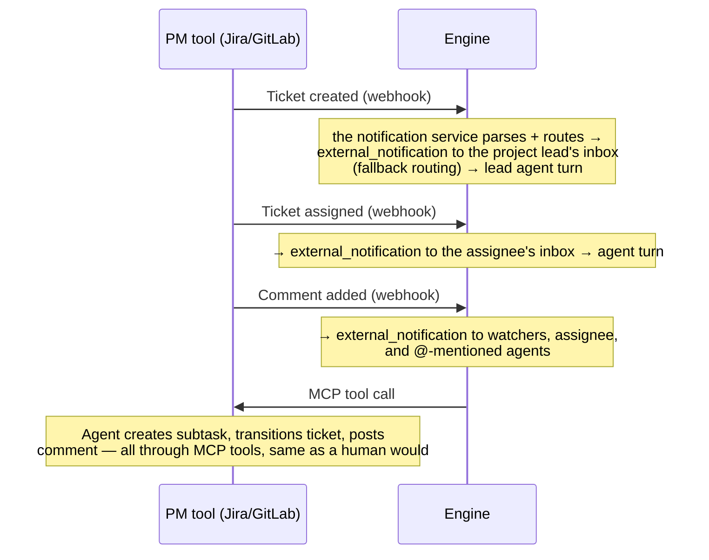
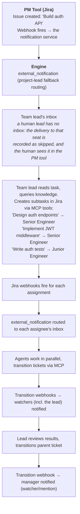
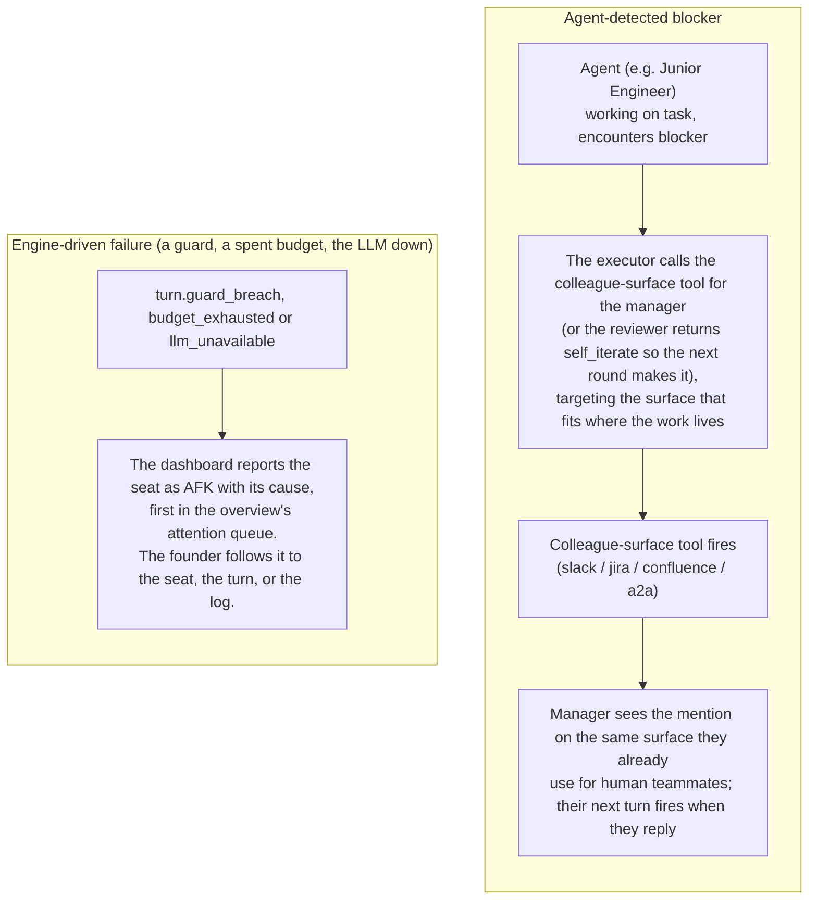

# Task Engine

**There is no task engine.** Task lifecycle lives entirely in an external PM
tool — Jira, GitHub or GitLab issues — and the engine mirrors none of
it: no task table, no status field, no assignee map, no dependency graph, no
reconciliation poller. A ticket's state is whatever the PM tool says it is,
read live through an agent's own MCP tools.

That is the design, not a gap. A mirror of somebody else's task state is a
cache with no invalidation story: every webhook you miss, every edit made in
the PM tool's own UI, and every retry that arrives out of order leaves the
engine confidently wrong about work a person can see is finished. Keeping
nothing means there is nothing to be stale.

---

## How It Works with Webhooks

PM-tool webhooks do **not** become dedicated task events. Every webhook is parsed by the notification service into an `external_notification` delivered to the routed agents' inboxes: the assignee, watchers, @-mentioned agents, or the project lead as a fallback (see [Jira Integration](../integrations/jira.md)). The woken agent then acts on the PM tool through its own MCP tools.

The `task_assigned` event type (`types.TaskAssigned`) exists for engine-internal work injection (the [Scheduler](scheduling.md) publishes it to a seat's inbox for cron-style recurring tasks, `internal/schedule/scheduler.go`) and never for the PM-tool webhook pipeline, which produces `external_notification` instead. The two are deliberately different types: one is the engine giving a seat work, the other is the world telling a seat something happened.

---

## Assignment: Team Lead as Decision Maker

See [Organization Model](organization-model.md#unit-lead) for how unit leads and rosters are configured.

Task assignment is **not** an algorithmic strategy: it is a **team lead agent's reasoning decision**. When a work item appears in the PM tool, its webhook reaches the team lead (as the project lead, or because the lead is assigned, watching or mentioned). The lead reasons from the team roster in its prompt (each direct report's background, goal and responsibilities) and assigns the item by setting the assignee in the PM tool through its MCP tools; there is no engine assignment tool. The assignment webhook then wakes the assigned agent.

A human can also assign directly in the PM tool — the same webhook fires, the same agent wakes up. For **top-level tasks** (no team lead above), the founder assigns directly in the PM tool, or a C-level agent role acts as the top-level assigner.

---

## Manager handoffs (no special escalation)

There is no special escalation mechanism in Crewlet. When an agent is blocked or out of its depth, it hands off the same way a human would:

- The agent reaches its manager from the executor with the colleague-surface tool that fits where the work lives: a Jira comment, a Slack mention, or `a2a_ask` for tight-loop sync. If the blocker only becomes clear at review, the reviewer returns `self_iterate` with a note saying so, and the executor's next round makes the outreach.
- The `getting-unstuck` tool skill (see `examples/tool-skills/getting-unstuck.md`) teaches the agent the discipline: include what you tried, options you see, your recommendation, and urgency. Never hand a naked problem.
- The agent's identity prompt names its manager, so the handoff target is always resolvable.

When the engine itself stops a turn it ends it as `failed` and publishes the cause: `turn.guard_breach` for a fired guard (stall, max-iteration exhaustion, the delegation-depth cap, a scheduled turn's wall-clock cap), `budget_exhausted` for a spent token budget, or `llm_unavailable` for an exhausted provider chain. The dashboard derives an `afk` state from those events and surfaces a cause-specific status line so the founder sees what happened.

---

## Data Flow Examples

### Task Created in PM Tool

### Manager-handoff Flow

