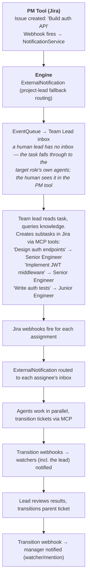
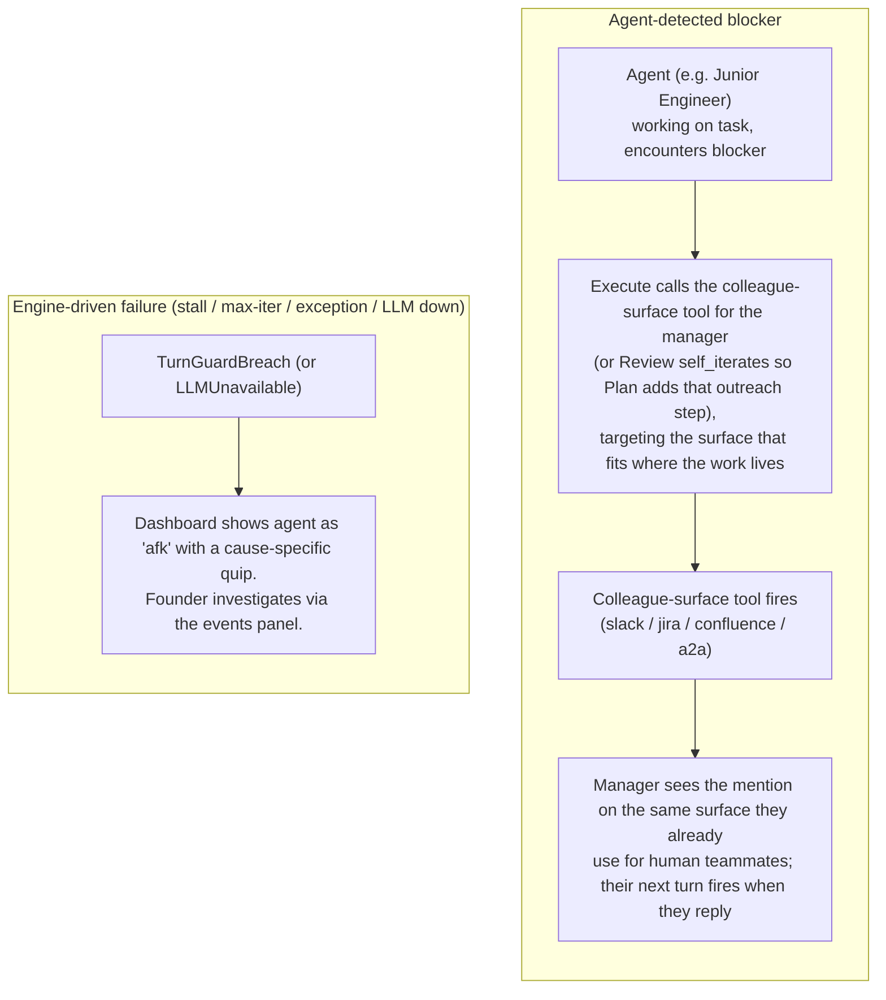

# Task Engine

Task lifecycle management lives in an external PM tool (Jira, Plane, GitHub/GitLab issues). The engine uses `ExecutionTracker` — a thin orchestration layer that tracks which agent is working on which issue and the dependency graph between issues — the orchestration concerns the PM tool doesn't cover.

---

## ExecutionTracker

The `ExecutionTracker` is a passive data structure — it emits no events and enforces no transitions. Events originate from webhooks via the the notification service.

**What it tracks**: bidirectional agent ↔ issue mappings and a dependency graph between issues.

**What it does NOT track**: task status, transitions, storage, or lifecycle — all of that lives in the PM tool.

**Interface**:

| Method | Purpose |
|--------|---------|
| `track(issue_key, agent_id)` | Record that an agent is working on an issue (webhook assigned) |
| `untrack(issue_key)` | Remove tracking (webhook resolved) |
| `get_agent(issue_key)` | Look up which agent is on an issue |
| `get_issue(issue_key)` | Get the full tracked issue metadata |
| `get_issues(agent_id)` | List all issues an agent is working on |
| `add_dependency(a, blocked_by_b)` | Record that issue A is blocked by issue B |
| `dependencies_met(issue_key)` | Check if all blocking issues are resolved |

---

## How It Works with Webhooks

PM-tool webhooks do **not** become dedicated task events. Every webhook is parsed by the the notification service into an `ExternalNotification` delivered to the routed agents' inboxes — the assignee, watchers, @-mentioned agents, or the project lead as a fallback (see [Jira Integration](../integrations/jira.md)). The woken agent then acts on the PM tool through its own MCP tools.

The `TaskAssigned` event type exists for engine-internal work injection — the [Scheduler](scheduling.md) fires it for cron-style recurring tasks — not for the PM-tool webhook pipeline. The execution tracker itself is passive plumbing read through the turn context; the engine's only built-in mutation is untracking a removed role's issues during org hot-reload.

---

## Assignment: Team Lead as Decision Maker

See [Organization Model](organization-model.md#unit-lead) for how unit leads and rosters are configured.

Task assignment is **not** an algorithmic strategy — it is a **team lead agent's reasoning decision**. When a task appears (via webhook or builtin tool), the engine notifies the team lead. The lead reasons about each member's backstory, skills, workload, and knowledge scopes, then assigns the task — either via a builtin tool or by setting the assignee in the PM tool via MCP. The engine then wakes the assigned agent.

A human can also assign directly in the PM tool — the same webhook fires, the same agent wakes up. For **top-level tasks** (no team lead above), the founder assigns directly in the PM tool, or a C-level agent role acts as the top-level assigner.

---

## Manager handoffs (no special escalation)

There is no special escalation mechanism in Crewlet. When an agent is blocked or out of its depth, it hands off the same way a human would:

- The agent reaches its manager during Execute with the colleague-surface tool that fits where the work lives — a Jira comment, a Slack mention, or `a2a_ask` for tight-loop sync. If the blocker only becomes clear at Review, Review returns `decision="self_iterate"` with a note telling Plan to add that outreach step, and the next pass makes the call.
- The `getting-unstuck` tool skill (see `examples/tool-skills/getting-unstuck.md`) teaches the agent the discipline: include what you tried, options you see, your recommendation, and urgency. Never hand a naked problem.
- The agent's identity prompt names its manager, so the handoff target is always resolvable.

When the engine itself can't continue — stall guard fires, max-iter exhausted, unhandled exception, LLM unavailable — it publishes a `turn.guard_breach` (or `llm_unavailable`) event and terminates the turn as `failed`. The dashboard derives an `afk` state from the latest failure event and surfaces a cause-specific status line so the founder sees what happened.

---

## Data Flow Examples

### Task Created in PM Tool

### Manager-handoff Flow

