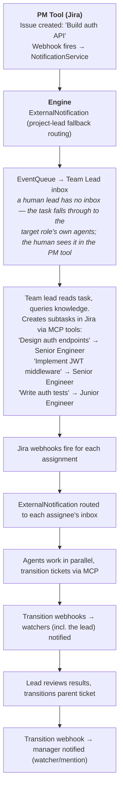
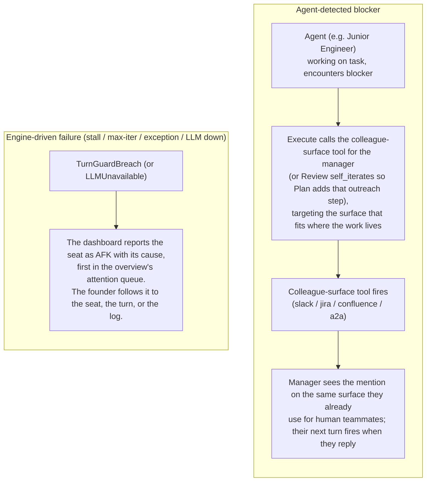

# The Tracker

A company's work has to live somewhere. Crewlet gives you two shapes, chosen
with one field:

```yaml
tracker:
  backend: native    # the default — the engine is the tracker
# backend: jira      # the tracker is Jira, and the engine mirrors none of it
```

The two are not variations on one design. They are opposite answers to the
same question, and each is coherent on its own terms.

## `native` — the engine is the tracker

Every change to the company's work is one **record on an ordered log the whole
fleet shares**, and every node derives the same SQL tables from that log — see
[the log and the copies](#the-log-and-the-copies). There is a board on the
dashboard, tools a seat calls, and an
[MCP surface](../reference/api-endpoints.md#operatormcp--your-own-assistant)
your own AI assistant can reach.

**This is not a mirror.** The log here *is* the source of truth, so the
staleness argument below does not apply to it: there is no other copy to
disagree with, no webhook to miss, and no reconciliation poller because
nothing is being reconciled. A node's own tables can be behind the log, and
that is handled by saying so — every answer carries how far this node has
applied and what it could not account for, and a read that cannot be served
refuses rather than answering "there is no such item", because the second is
an answer somebody acts on.

What it is deliberately **not** is a Jira. There is **no workflow engine and
no permission scheme**, and nothing has to be configured before a company can
file its first ticket: declaring a unit with a project key in the config
creates the project, on every node, with no gesture from anybody.

What it does carry is what an agent company actually uses — a key, a type from
a per-project catalogue, a status from a closed set of six in four groups, an
assignee, a thread, a history, subtasks, tags, typed custom fields, sprints,
goals, and saved views in three shapes. The line is between **structure a
company records** and **process a tool enforces**: the first is here, the
second is not. There is no gate that refuses a transition, no scheme that
hides a field from a role, and no configuration screen standing between a
founder and their first task.

The whole surface is in **[The Work Tracker](../guides/work-tracker.md)**.

### Why the engine grew one

Because the alternative — the paragraph below — costs a founder an Atlassian
site, a project, six service accounts and a webhook before their company can
record that it did anything. That is a real barrier for the case Crewlet is
for, and the vendor path stays fully supported for the companies that are
already on it.

## `jira` — the tracker is somebody else's

Task lifecycle lives entirely in an external PM tool — Jira, GitHub or GitLab
issues — and **the engine mirrors none of it**: no task table, no status
field, no assignee map, no dependency graph, no reconciliation poller. A
ticket's state is whatever the PM tool says it is, read live through an
agent's own MCP tools.

That is the design, not a gap. A mirror of somebody else's task state is a
cache with no invalidation story: every webhook you miss, every edit made in
the PM tool's own UI, and every retry that arrives out of order leaves the
engine confidently wrong about work a person can see is finished. Keeping
nothing means there is nothing to be stale.

## What is identical either way

Everything below this line. Routing, assignment, hand-offs, the lead fallback,
the way a webhook becomes a turn — none of it knows which backend answered. A
unit's `project` key names its project on whichever tracker the company runs,
which is why the field is not called `jira_project`.

## The log and the copies

On the native backend a write does not go to a node's database. It is
**published as a record** onto the domain's own log, on the subject of the
object it changes — one task, one project, one sprint — and the broker
arbitrates: two writers racing on one task contend there and exactly one wins,
while two writers on different tasks never contend at all. Every node then
consumes that log in order and applies the same records into its own SQL
tables, committing **the rows and its position on the log in one
transaction**. There is no node whose copy is the real one and no leader, and
every node arrives at the same rows because they all replay the same order.

What that shape buys is that a copy can say exactly how far along it is, which
a cache cannot:

- **Every answer carries the level it was actually served at**, never the one
  the caller asked for. A read never silently downgrades, so the two can
  differ only by a refusal you can see.
- **A write's outcome has three values, not two.** `applied` means the record
  is durable *and* in this node's rows. `pending` means it is durable and this
  node has not consumed it yet — which is a fact about this node, not a failed
  write, and never something to retry. `unknown` means the acknowledgement was
  lost and the record may or may not be there; that is the one worth retrying,
  and the reply carries the operation id to retry it with, which collapses a
  duplicate rather than filing one.
- **A write can wait for itself.** A turn that files a task and then lists the
  project sees what it just filed, because the tool waits for this node to
  apply its own position before it reads.
- **An answer that could not account for everything says so.** A node holding
  a record a newer build wrote — one this build cannot decode — reports the
  answer as incomplete, names how many records and which objects, and the
  board renders that above the rows. It is a different fact from staleness,
  and a screen that showed only staleness would look confidently right.
- **A node claims no new seats until every domain that gates admission is
  established.** A seat whose tools read incomplete tables would answer "there
  is no such task" and act on it, by filing the duplicate or telling a person
  their link is dead. The node keeps every seat it already holds — catching up
  is not a reason to drop work in hand — and the fleet view reports how many
  of its copies are ready.

**A node too far behind to catch up adopts a peer's snapshot.** The log does
not keep records for ever (see below), so a node that was down long enough, or
that has never run, can be below the oldest record the log still holds — and
there is nothing left for it to replay. At boot it asks the fleet, verifies
what it is offered against its own requirements and checksum, and installs it
wholesale before anything reads from it. A company with no peer able to donate
starts anyway, on the history it has, and says what it cannot account for.

Retention is the one asymmetry worth knowing: tasks, comments and pages are
kept **for ever** — a tracker that forgot would stop answering the question it
exists for — while a domain's log keeps only the replay window, which is
bounded by durability rather than by age: a record is trimmed once every node
has applied past it, a complete backup covers it, and it is at least a week
old. A company that never backs up never trims, deliberately.

---

## How it works with webhooks

A change is a change, whoever recorded it: a Jira webhook and a native item's
own change record both arrive at the notification service as a delivery and
both become an `ExternalNotification`. Nothing above that seam knows which.

PM-tool webhooks do **not** become dedicated task events. Every webhook is parsed by the notification service into an `ExternalNotification` delivered to the routed agents' inboxes — the assignee, watchers, @-mentioned agents, or the project lead as a fallback (see [Jira Integration](../integrations/jira.md)). The woken agent then acts on the PM tool through its own MCP tools.


The `TaskAssigned` event type exists for engine-internal work injection — the [Scheduler](scheduling.md) fires it for cron-style recurring tasks (`internal/schedule/scheduler.go`) — and never for the PM-tool webhook pipeline, which produces `ExternalNotification` instead. The two are deliberately different types: one is the engine giving a seat work, the other is the world telling a seat something happened.

---

## Assignment: Team Lead as Decision Maker

See [Organization Model](organization-model.md#unit-lead) for how unit leads and rosters are configured.

Task assignment is **not** an algorithmic strategy — it is a **team lead agent's reasoning decision**. When a task appears (via webhook or builtin tool), the engine notifies the team lead. The lead reasons about each member's backstory, skills, workload, and knowledge scopes, then assigns the task — either via a builtin tool or by setting the assignee in the PM tool via MCP. The engine then wakes the assigned agent.

A human can also assign directly in the PM tool — the same webhook fires, the same agent wakes up. For **top-level tasks** (no team lead above), the founder assigns directly in the PM tool, or a C-level agent role acts as the top-level assigner.

---

## Manager handoffs (no special escalation)

There is no special escalation mechanism in Crewlet. When an agent is blocked or out of its depth, it hands off the same way a human would:

- The agent reaches its manager during Execute with the colleague-surface tool that fits where the work lives — a Jira comment, a Slack mention, or `a2a_ask` for tight-loop sync. If the blocker only becomes clear at Review, Review returns `decision="self_iterate"` with a note telling Plan to add that outreach step, and the next pass makes the call.
- The `getting-unstuck` tool skill (see `examples/tool-skills/getting-unstuck.md`) teaches the agent the discipline: include what you tried, options you see, your recommendation, and urgency. Never hand a naked problem.
- The agent's identity prompt names its manager, so the handoff target is always resolvable.

When the engine itself can't continue — stall guard fires, max-iter exhausted, unhandled exception, LLM unavailable — it publishes a `turn.guard_breach` (or `llm_unavailable`) event and terminates the turn as `failed`. The dashboard derives an `afk` state from the latest failure event and surfaces a cause-specific status line so the founder sees what happened.

---

## Data Flow Examples

### Task Created in PM Tool



### Manager-handoff Flow


