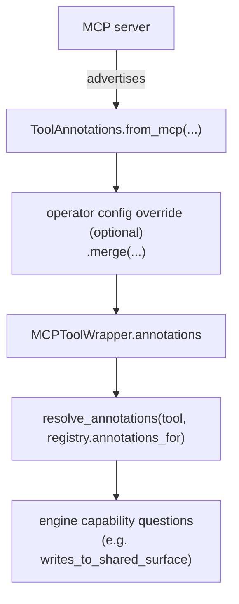

# Tool Capabilities

Crewlet is **tool-stack agnostic**. The engine ships zero hardcoded
knowledge of any specific integration — not in its prompts, not in its
runtime logic. When the engine needs to reason about *what a tool does*
(rather than *that a particular named tool exists*), it derives the
answer from the tool's **capabilities**, sourced from the MCP server
that advertises the tool. The LLM, in turn, chooses *which* tool to call
from the descriptions in its catalogue.

This is what lets the same engine run a company on Slack + Jira +
Confluence + GitHub, or on Microsoft Teams + Linear + Notion + GitLab,
with no code change — only different MCP servers in config.

---

## Two halves of the decoupling

| Concern | Coupled approach (rejected) | Crewlet's approach |
|---|---|---|
| *Which* tool should the LLM call to deliver a reply? | Name `slack_conversations_add_message` etc. in the prompt | Prompt names the **capability** ("the reply tool for the channel the trigger arrived on"); the LLM maps it to a tool in its catalogue by the tool's description |
| *May a sub-agent call this tool?* | A hardcoded denylist of `slack_*` / `jira_*` / `confluence_*` / `*copilot*` names | Derived from the tool's **MCP annotations** (`readOnlyHint` / `destructiveHint` / `openWorldHint`) |

The first half is "let the LLM reason from descriptions." The second is
"let the engine reason from annotations." Neither requires the engine to
know a single concrete tool name.

---

## Tool annotations

The [MCP spec](https://modelcontextprotocol.io) lets a server advertise
behavioural *hints* per tool. Crewlet captures them
(`crewlet.tools.capabilities.ToolAnnotations`) and exposes them on every
bridged tool (`MCPToolWrapper.annotations`):

| Field | MCP hint | Meaning |
|---|---|---|
| `read_only` | `readOnlyHint` | The tool does not modify state |
| `destructive` | `destructiveHint` | The tool may perform irreversible updates |
| `idempotent` | `idempotentHint` | Repeat calls have no additional effect |
| `open_world` | `openWorldHint` | The tool touches entities outside the local system (the network, external services, shared surfaces a human can see) |
| `title` | `title` | Human-friendly name |

Every field is **tri-state** — `True` / `False` / `None` (the server
didn't say). `None` is never coerced to `False`: "unknown" and
"explicitly safe" are different, and the classifiers depend on the
distinction.

First-party builtins declare their own annotations in code (registered
via `tools.Registry.RegisterWith` and read back with
`annotations_for`), so the same classification works for them.

### Where annotations come from



---

## The classifier: `writes_to_shared_surface`

Today the one runtime question the engine asks is: *would a sub-agent
calling this tool write to a surface a human reads, under the parent
agent's identity?* A sub-agent posting to a channel or commenting on an
issue as its parent would leak identity onto a transcript, so the
[sub-agent guard](turn-engine.md#runtime-invariants) denies such tools.

`writes_to_shared_surface(ann)` answers it, conservatively about
unknowns:

- `read_only is True` → **no** (a pure read).
- `destructive is True` → **yes**.
- `read_only is False` and `open_world` not explicitly `False` → **yes**
  (a write to the outside world).
- everything unknown → **no**. The engine does not block what it cannot
  classify; the parent's explicit allowlist already curates the
  sub-agent surface.

First-party control tools (`spawn_subagent`, `a2a_ask`, the discovery
meta-tools, `run_sandbox`) are denied separately by name — they are
Crewlet's *own* tools, so naming them is not a third-party coupling.
`run_sandbox` is on that list because a detached coding run is keyed to
the **parent** turn: the pending row carries the parent's `turn_id` and
the launch pauses the parent seat's inbox, while a sub-agent cannot park
for the result. The parent turn would finish without persisting the
suspended conversation, leaving the seat deaf for the whole coding run
with nothing to resume into.

---

## Operator overrides for under-annotating servers

Most modern MCP servers (the official GitHub server, recent
`mcp-atlassian`) advertise annotations. For a server that does not, an
operator can supply them in config — without touching engine code — via
`tool_annotations` on an `mcp_servers` entry, keyed by **bare tool
name**:

```yaml
mcp_servers:
  - name: linear
    command: uvx
    args: ["mcp-linear"]
    tool_annotations:
      linear_create_comment: { read_only: false, open_world: true }
      linear_get_issue:      { read_only: true }
```

Keys accept snake_case (`read_only`) or the MCP camelCase
(`readOnlyHint`). Overrides win over whatever the server advertised
(`ToolAnnotations.merge`). The **tool-name key** matches either the
server's raw name or the engine's prefixed catalogue name (e.g. a Slack
server's `conversations_add_message` **or** `slack_conversations_add_message`),
so keying by the name you see in the catalogue never silently no-ops.

Every tool server — including Jira/Confluence (`atlassian`), Slack, and
GitHub — is an `mcp_servers` entry, so `tool_annotations` is declared
there for all of them, the same way:

```yaml
mcp_servers:
  - name: atlassian          # shared by Jira + Confluence
    shared: false
    command: uvx
    args: ["mcp-atlassian"]
    tool_annotations:
      jira_add_comment:       { read_only: false, open_world: true }
      confluence_create_page: { read_only: false, open_world: true }
  - name: slack
    shared: false
    command: npx
    args: ["slack-mcp-server@latest"]
    tool_annotations:
      conversations_add_message: { read_only: false, open_world: true }
  - name: github
    transport: http
    shared: false
    url: "https://api.githubcopilot.com/mcp/"
    tool_annotations:
      create_pull_request: { destructive: true }
```

Jira and Confluence share one `mcp-atlassian` server: declare it once as
`atlassian` and put both products' overrides on that single entry. The
official GitHub server and recent `mcp-atlassian` already annotate their
tools, so these overrides are usually unnecessary — they exist so an
under-annotating build of any server is correctable without engine
changes.

If a server under-annotates and no override is supplied, the only effect
is that the sub-agent guard cannot auto-deny that server's write tools —
the parent's explicit allowlist remains the curation, exactly as before.

---

## Why not classify with an LLM, or by tool name?

- **By tool name** couples the engine to one vendor's tool catalogue
  and silently fails open for every other.
- **By an LLM pass at boot** would be non-deterministic and add latency
  and cost to startup for a yes/no the MCP spec already answers
  declaratively.

MCP annotations are the right primitive: declarative, per-tool, supplied
by the party that actually knows the tool's behaviour (the server),
overridable by the operator when the server falls short.

---

## See also

- [Turn Engine](turn-engine.md) — the sub-agent guard and runtime invariants.
- [Tool Skills](tool-skills.md) — the *how-to* half of tool decoupling (knowledge-base-sourced per-tool guidance).
- [Agent Runtime](agent-runtime.md) — the tool registry and MCP bridge.
- [Tools & MCP guide](../guides/tools-and-mcp.md) — `mcp_servers[].tool_annotations` config.
