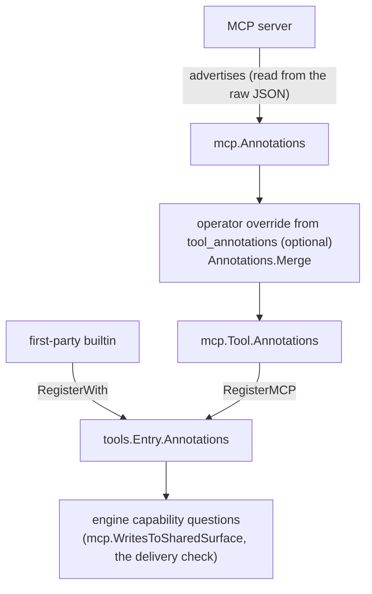

# Tool Capabilities

Crewlet is **tool-stack agnostic**. The engine ships zero hardcoded
knowledge of any specific integration — not in its prompts, not in its
runtime logic. When the engine needs to reason about *what a tool does*
(rather than *that a particular named tool exists*), it derives the
answer from the tool's **capabilities**, sourced from the MCP server
that advertises the tool. The LLM, in turn, chooses *which* tool to call
from the descriptions in its catalogue.

This is what lets the same engine run a company on Slack + Jira +
Confluence + GitHub, or on Microsoft Teams + Linear + Notion + GitLab,
with no code change — only different MCP servers in config.

---

## Two halves of the decoupling

| Concern | Coupled approach (rejected) | Crewlet's approach |
|---|---|---|
| *Which* tool should the LLM call to deliver a reply? | Name `slack_conversations_add_message` etc. in the prompt | Prompt names the **capability** ("the reply tool for the channel the trigger arrived on"); the LLM maps it to a tool in its catalogue by the tool's description |
| *May a sub-agent call this tool?* | A hardcoded denylist of `slack_*` / `jira_*` / `confluence_*` / `*copilot*` names | Derived from the tool's **MCP annotations** (`readOnlyHint` / `destructiveHint` / `openWorldHint`) |

The first half is "let the LLM reason from descriptions." The second is
"let the engine reason from annotations." Neither requires the engine to
know a single concrete tool name.

---

## Tool annotations

The [MCP spec](https://modelcontextprotocol.io) lets a server advertise
behavioural *hints* per tool. Crewlet captures them as `mcp.Annotations`
(`internal/mcp/annotations.go`), carries them on every bridged tool
(`mcp.Tool.Annotations`), and files them beside the tool in the registry
(`tools.Entry.Annotations`):

| Field | MCP hint | Meaning |
|---|---|---|
| `read_only` | `readOnlyHint` | The tool does not modify state |
| `destructive` | `destructiveHint` | The tool may perform irreversible updates |
| `idempotent` | `idempotentHint` | Repeat calls have no additional effect |
| `open_world` | `openWorldHint` | The tool touches entities outside the local system (the network, external services, shared surfaces a human can see) |
| `title` | `title` | Human-friendly name |

Every hint has **three values**, `mcp.Yes`, `mcp.No` and `mcp.Unknown`
(the server did not say). `Unknown` is never coerced to `No`: "unknown"
and "explicitly safe" are different, and the classifiers depend on the
distinction. A value that is not a JSON boolean is read as `Unknown`.

First-party builtins declare their own annotations in code, registered
with `tools.Registry.RegisterWith`, so the same classification works for
them.

### Where annotations come from



---

## The classifiers

The engine asks annotations two questions, and they deliberately fail in
opposite directions.

### `mcp.WritesToSharedSurface`: may a worker call this?

*Would a worker calling this tool write to a surface a human reads, under
the parent agent's identity?* A worker posting to a channel or commenting
on an issue as its parent would leak identity onto a transcript, so the
[worker guard](turn-engine.md#runtime-invariants) (`subagent.Permit`)
denies such tools.

`mcp.WritesToSharedSurface` answers it, conservatively about unknowns:

- `ReadOnly` is `Yes` → **no** (a pure read).
- `Destructive` is `Yes` → **yes**.
- `ReadOnly` is `No` and `OpenWorld` is not `No` → **yes** (a write to
  the outside world).
- everything else, including all-unknown → **no**. The engine does not
  block what it cannot classify; the task's (or its template's) explicit
  allowlist already curates the worker surface.

First-party control tools (`delegate`, `run_sandbox`, `a2a_ask` and the
parent's `activate_tool` / `list_mcp_server_tools` pair) are denied
separately by name, because they are Crewlet's *own* tools and naming them
is not a third-party coupling. `run_sandbox` is on that list because a
detached coding run is keyed to the **parent** turn: the pending row
carries the parent's `turn_id` and a completion resumes the parent's
suspended executor, while a worker's loop cannot suspend. The parent turn
would finish without persisting a suspended conversation, and the run
would come back with nothing to resume into.

### The delivery check: did this answer reach anybody?

The [delivery check](turn-engine.md#three-checks-in-increasing-cost) asks
the opposite question and fails closed: a successful call counts as a
possible delivery when the tool is backed by an MCP server and **not
positively** annotated read-only (`turn.Deliverable`). An unannotated
tool therefore counts. A fence that reused `!WritesToSharedSurface` here
would admit every under-annotated write tool, which is why
`mcp.ReadOnlyProven` exists beside it.

### `open_world` is a tri-state, and unset is not `false`

Read the third rule again: `ReadOnly` is `No` **and** `OpenWorld` *not
explicitly* `No`. A tool that writes only *private* state (an agent's
own diary, its own learned skills, its own onboarding marker) is not a
write to a surface a human reads, but saying so takes an explicit
`open_world: false`. Leaving the hint unset classifies it with the public
writes.

That is deliberate for a third-party server, where "nobody said" has to
mean "assume the worst" — it is the fail-closed default, and the engine reads a
server's annotations off the wire because the MCP Go SDK flattens the absent case for
`readOnlyHint` and `idempotentHint`, which would otherwise make every
under-annotated tool look exactly like a public write.

It is a trap for **first-party** tools, and Crewlet fell into it: three
builtins that write nothing but the agent's own memory (`reflect_and_persist`,
`refine_skill`, `mark_onboarded`) declared `read_only: false` and said
nothing about `open_world`, so the guard denied them to workers their
parent had explicitly granted them — blaming a write to a shared surface
that never happens. They say `open_world: false` now. The same applies to
`tool_annotations`: a server tool that genuinely stays inside your network
needs the key written out, because omitting it is a claim in the other
direction.

---

## Operator overrides for under-annotating servers

Most modern MCP servers (the official GitHub server, recent
`mcp-atlassian`) advertise annotations. For a server that does not, an
operator can supply them in config — without touching engine code — via
`tool_annotations` on an `mcp_servers` entry, keyed by **bare tool
name**:

```yaml
mcp_servers:
  - name: linear
    command: uvx
    args: ["mcp-linear"]
    tool_annotations:
      linear_create_comment: { read_only: false, open_world: true }
      linear_get_issue:      { read_only: true }
```

Keys accept snake_case (`read_only`) or the MCP camelCase
(`readOnlyHint`). Overrides win over whatever the server advertised
(`mcp.Annotations.Merge`), and a hint the override leaves unset keeps
the server's value. The **tool-name key** matches either the server's raw
name or the catalogue name with the entry's `tool_prefix` applied (for a
Slack server with `tool_prefix: slack_`, `conversations_add_message`
**or** `slack_conversations_add_message`; the raw name wins when both are
present), so keying by the name you see in the catalogue never silently
no-ops.

Every tool server — including Jira/Confluence (`atlassian`), Slack, and
GitHub — is an `mcp_servers` entry, so `tool_annotations` is declared
there for all of them, the same way:

```yaml
mcp_servers:
  - name: atlassian          # shared by Jira + Confluence
    shared: false
    command: uvx
    args: ["mcp-atlassian"]
    tool_annotations:
      jira_add_comment:       { read_only: false, open_world: true }
      confluence_create_page: { read_only: false, open_world: true }
  - name: slack
    shared: false
    command: npx
    args: ["slack-mcp-server@latest"]
    tool_annotations:
      conversations_add_message: { read_only: false, open_world: true }
  - name: github
    transport: http
    shared: false
    url: "https://api.githubcopilot.com/mcp/"
    tool_annotations:
      create_pull_request: { destructive: true }
```

Jira and Confluence share one `mcp-atlassian` server: declare it once as
`atlassian` and put both products' overrides on that single entry. The
official GitHub server and recent `mcp-atlassian` already annotate their
tools, so these overrides are usually unnecessary — they exist so an
under-annotating build of any server is correctable without engine
changes.

If a server under-annotates and no override is supplied, the worker
guard cannot auto-deny that server's write tools (the parent's explicit
allowlist remains the curation), and the delivery check counts every one
of its tools, reads included, as a possible delivery.

---

## Why not classify with an LLM, or by tool name?

- **By tool name** couples the engine to one vendor's tool catalogue
  and silently fails open for every other.
- **By an LLM pass at boot** would be non-deterministic and add latency
  and cost to startup for a yes/no the MCP spec already answers
  declaratively.

MCP annotations are the right primitive: declarative, per-tool, supplied
by the party that actually knows the tool's behaviour (the server),
overridable by the operator when the server falls short.

---

## See also

- [Turn Engine](turn-engine.md): the worker guard, the delivery check and the runtime invariants.
- [Tool Skills](tool-skills.md): the *how-to* half of tool decoupling (knowledge-base-sourced per-tool guidance).
- [Agent Runtime](agent-runtime.md): the tool registry and MCP bridge.
- [Tools & MCP guide](../guides/tools-and-mcp.md): `mcp_servers[].tool_annotations` config.
