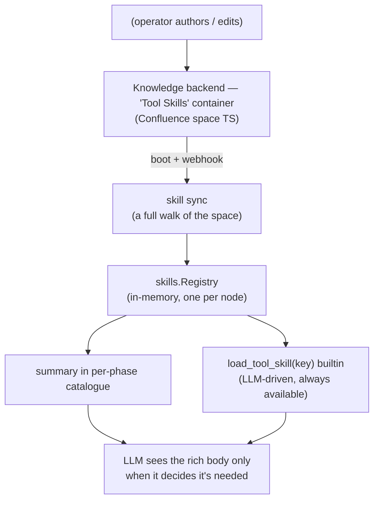

# Tool Skills

Tool Skills are modular prompt fragments that teach an agent *how to use* a particular tool or MCP server. Each skill lives as one page in a dedicated container of the knowledge backend (a Confluence **space**), is loaded into the node's in-memory `skills.Registry` at boot, and is kept fresh by the backend's page webhooks at runtime.

**Two-tier consumption:**

- A short **summary** (≤240 bytes) always appears in the per-phase prompt catalogue so the executor knows the skill exists.
- A rich **body** (at most 32 KB) loads on demand via the `load_tool_skill(key)` builtin, which the executor always carries and a worker receives whenever its parent can reach it.

This keeps the prompt prefix small (no eager body inlining) while still making rich skill content available the moment the agent decides it needs it.

Skills are also **enforced by default**: the engine blocks calls to the tools a skill's trigger covers until the body has been loaded in the current session. Mark orientation / hint-grade content `required: false` to keep it advisory — see [Required skills](#required-skills--load-before-use-enforcement).

---

## Why pages, not engine prose

The engine hardcodes no tool-specific guidance — no per-tool prompt constants, no per-MCP-server hint sections in the prompt builders. All of that prose lives in the knowledge backend (Confluence pages). Adding a new MCP server or tweaking the guidance for an existing one is a page edit — no engine code change, no release.

This covers the *how-to* half of tool decoupling. The structural half — the engine's phase contracts, sub-agent guard, and builtins not naming concrete tools either — is covered by [Tool Capabilities](tool-capabilities.md): prompts describe a tool by its *capability* and the LLM picks the match from its catalogue, while the engine derives any runtime tool classification from MCP annotations rather than a tool-name list.

---

## How it works



**No database row.** The registry is in-memory and belongs to the node rather than to an epoch, so a config apply keeps it (an apply refreshes only the `skill_variables` map). A restart re-walks every page in the container.

**No code defaults.** The engine ships zero skill prose. An empty container →
empty registry → just the tool catalogue. Operators seed it by publishing
markdown: with their own assistant over
[`/operator/mcp`](../reference/api-endpoints.md#operatormcp--your-own-assistant)
on the native backend, or `crewlet confluence import` on Confluence (see below).

**One sync, matching the single-homed knowledge backend** (see [Knowledge System](knowledge-system.md#the-knowledgesearcher-seam)). Every walk applies the same **admission test** (`skills.Admit`), at boot and on every re-read alike: a page in the configured space is a skill when its leading YAML frontmatter block declares a `trigger:`. A page with no frontmatter, or frontmatter that names no trigger, is an ordinary page and is skipped quietly; a page that declares a trigger and does not parse is reported (`skill_page_undecodable`) and skipped. The replace is wholesale and all or nothing: a walk that cannot enumerate the whole space leaves the registry as it was, and a previously admitted page that stops being a skill (deleted, moved out, or edited into a non-skill) is gone after the next walk rather than left serving its last-good body.

**What triggers a re-read differs by backend, and only one of them is a
webhook.** On Confluence it is the same page webhook the engine already uses
for notification routing: any page change in the skills space, including a
removal, re-walks the whole space and replaces the registry, because a page
that is simply absent from the next walk is how a deleted skill goes away.
Natively there is no webhook, and there is deliberately no delivery either:
the change feed **drops** a skill-page change rather than waking a team about
a procedure written for one phase of one turn. So the *projection's apply* is
what notices — it already derives the skill flag on every page it writes, so
it is the one thing that sees both a page becoming a skill and a page ceasing
to be one. It reports that after the batch commits, coalesced to one re-read
however many skill pages moved in it, and a failed batch reports nothing: the
registry replaces wholesale, so a re-read triggered by rows that rolled back
is how a company loses every skill it has.

---

## Skill file format

Skills are authored as markdown files with YAML frontmatter, the same format the backend pages round-trip to via the per-backend codec ([below](#page-representation)). The repository ships ten bundled examples under `examples/tool-skills/`.

```markdown
---
key: skill:code_runtime
trigger:
  mcp_server: gitlab
phases: [execute]
required: false
title: Running code work in the sandbox
summary: |
  For real code work, call the run_sandbox tool: a coding agent
  implements in an isolated checkout and opens an MR.
---

When a task needs you to implement or modify code, run tests, or
reproduce a bug, call `run_sandbox` with a concrete brief …
```

### Frontmatter fields

| Field | Required | Description |
|---|---|---|
| `key` | yes | Stable identifier. By convention `mcp:<server>`, `tool:<name>`, or `skill:<descriptive>`. Used for idempotency on re-import, prefix-cache ordering, and as the argument to `load_tool_skill`. |
| `trigger` | yes | A discriminated expression; see *Triggers* below. |
| `phases` | yes | List of turn phases this skill is **catalogued** in: any subset of `execute`, `review`, `subagent`. |
| `title` | yes | Rendered as the header when the body loads. |
| `summary` | yes | ≤240-byte one-liner. Always inline in the per-phase catalogue, regardless of whether the LLM ends up loading the body. Keep it tight. |
| `required` | no (default `true`) | Load-before-use safeguard. When `true` (the default), the engine **rejects** calls to the tools the trigger covers until the LLM has loaded this skill via `load_tool_skill` in the current session. Set `false` for advisory orientation / hint content. See *Required skills* below. |

### Triggers

Exactly one of these fields:

| Trigger | Fires when |
|---|---|
| `tool: <name>` | `<name>` is in the phase's tool surface |
| `mcp_server: <server>` | `<server>` is a key in the role's resolved `mcp_env` (the servers the seat has credentials for) |
| `any_of: [...]` | Any sub-trigger fires (logical OR) |
| `all_of: [...]` | Every sub-trigger fires (logical AND) |

Examples:

```yaml
# Single MCP server
trigger:
  mcp_server: github

# Several tools that share guidance
trigger:
  any_of:
    - tool: query_episodes
    - tool: confluence_search
    - tool: refresh_memory

# Composite: only when an agent has both atlassian AND slack
trigger:
  all_of:
    - mcp_server: atlassian
    - mcp_server: slack
```

### Body / summary caps

- Body: **32 KB UTF-8** (`skills.MaxBodyBytes`). Looser than a prompt-prefix cap because bodies load on demand, not on every turn. Skills bigger than this almost always want to be split.
- Summary: **240 bytes UTF-8** (`skills.MaxSummaryBytes`). The summary appears on every turn for every role triggering the skill, so keep it tight.

Both caps are enforced when a skill is validated, at parse time and again when the registry takes it (`skill_refused` names the skill and the cap), as a small defence against accidental or malicious prompt-injection prose. The caps bound the **source** bytes; a skill that references skill variables (below) can render slightly longer.

---

## Skill variables

A skill body is the same static text for every company, but some guidance needs a per-org *fact* the body can't know — the canonical case is the org's tracker/knowledge-base base URL, so an agent shares a human-clickable link instead of what its tools hand back (`mcp-atlassian` under `cloud_id` auth returns `api.atlassian.com/ex/…` gateway URLs colleagues can't open, and a tool result's `self` link is a REST endpoint).

Skills are therefore **parameterized**. A skill writes `${name}` where it needs an operator-supplied value, and the founder sets the value once in `company.yaml`:

```yaml
skill_variables:
  jira_base_url: "https://nimbus.atlassian.net"          # values support ${ENV}
  confluence_base_url: "https://nimbus.atlassian.net/wiki"
```

The bundled `platform_mentions` skill uses them:

```markdown
- **Work item:** `${jira_base_url}/browse/{ISSUE-KEY}`
- **Page:** `${confluence_base_url}/spaces/{SPACE}/pages/{page-id}`
```

(See [Confluence](../integrations/confluence.md#mcp-server-agents-control-confluence) / [Jira](../integrations/jira.md) for where each base comes from.)

The engine substitutes the variables at **render time**, everywhere a skill's `summary` / `title` / `body` reaches the LLM — the per-phase catalogue, the `load_tool_skill` result, and the required-skill block message. The rule lives in the knowledge-base-authored skill page; only the *value* comes from config. The engine carries **no** integration-specific code — `skill_variables` is generic, so the same mechanism serves a repo base URL, a support email, a runbook root, or any other per-org fact a skill wants to name.

**Substitution grammar (deliberately narrow):**

- Only the **braced identifier** form `${name}` is substituted, and only when `name` is a declared variable. A bare `$name`, a literal `$$`, the agent-facing single-brace placeholders skill bodies use (`{project-uuid}`, `{page-id}`), and an unknown `${other}` are all left **byte-for-byte unchanged**. This is why skill prose dense with shell / regex / currency `$` is safe, and why an unchanged variable map keeps catalogue summaries byte-stable for prompt prefix caching.
- Keys must be identifiers (`^[A-Za-z_][A-Za-z0-9_]*$`), validated at config load so the operator key-space matches the render grammar exactly (a key like `base-url` is rejected up front rather than silently never matching). This identifier-only grammar also means a `${name}` can never name a config path or traversal — there are no paths in the flow, just a flat operator map.
- A variable that resolves to empty (unset `${ENV}`) is dropped, so its `${name}` reference renders as the literal `${name}` — visibly broken and debuggable, never a silently malformed value.
- Because that literal only ever shows up inside an LLM prompt (which no operator reads), the registry also emits a `skill_variable_unresolved` **warning** whenever a registered skill references a `${name}` missing from the map — checked at skill seed/upsert and re-checked for every skill on each config apply, so a dropped variable surfaces in the logs immediately.

**What this fix is — and is not.** Skill variables are *enforced-reading* guidance: the required-skill guard guarantees the rule and the correct base URL are in the agent's context before it can post, but the engine deliberately does **not** rewrite MCP tool results (that would be content-mangling middleware around a tool stack it stays agnostic to). If your MCP server itself returns unshareable links in its tool results (e.g. `mcp-atlassian` under `cloud_id` auth builds every result link from the gateway `CONFLUENCE_URL`), the deterministic complement is to fix that in the server so its results carry the human-readable base — the prompt-layer rule then remains as defense-in-depth and continues to cover links the agent *composes* itself (Jira `browse` links are always composed: Jira tool results only carry REST self-links).

**Trust + secrets.** Values are set by the Tier-B config operator; a Confluence skill author (lower trust) can only *reference* keys, never define values, and an undeclared reference renders inert. Because resolved values render into prompts — and, like any prompt content, into the durable event store and dashboard — treat a `skill_variables` value exactly as you would a `policies` or `backstory` string: **do not reference secrets.** The map is an explicit allowlist of the handful of values the operator deliberately exposes, which is why it is safer than letting skills reach into arbitrary config.

`skill_variables` is **company-wide** and hot-reloadable: changing a value on `PUT /config` re-renders every skill on the next turn.

---

## Phase scoping (catalogue visibility)

A skill is **catalogued** in a phase's prompt when its declared `phases` includes that phase **and** its `trigger` matches the active surface:

| Phase | Tool surface seen | Notes |
|---|---|---|
| **Execute** | every first-party tool plus whatever the executor has activated, and the role's MCP server names | The executor's live surface, so a skill for a tool it discovered mid-run is catalogued from the next round. |
| **Review** | empty (Review has no domain tools) | MCP-server-keyed skills still appear when an operator scopes a skill to the Review phase (lists it in the skill's `phases`), even though Review has no domain-tool surface. |
| **Sub-agent** | the worker's granted tools | Same matching as Execute, against the worker's narrower surface. `subagent` is the wire name of the worker phase |

`execute`, `review` and `subagent` are the only names a skill's `phases:` accepts; an unrecognised one is a parse error rather than a skill offered in no phase.

Within a phase, catalogue entries are sorted in **alphabetical key order** so the prompt prefix stays byte-stable across turns (LLM prefix-cache stability).

Catalogue position: skills land **immediately before the `## Available tools` block** in Execute — one conceptual section, how-to then names — and **immediately after the review header** in Review, so guidance precedes the evidence it is meant to be weighed against.

---

## Body loading

Catalogue entries carry only the summary. The full body reaches the LLM via `load_tool_skill(key)`, a built-in tool registered alongside `lookup_colleague`, `use_skill` and the rest whenever the node has a skill registry. The LLM calls it when the summary's hint suggests detail it needs:

```
load_tool_skill(key="mcp:github") → returns the full body as a tool result
```

Available in **Execute** (active from the first round) and **Sub-agent** (it rides along on a worker's grant whenever the parent can reach it, without the task naming it). Returns an error with the list of registered keys if the key doesn't exist, so the LLM can recover.

Review intentionally doesn't have it: Review's contract is the decision enum, not domain action. Onboarding doesn't carry it active either, and needs no guard, because its surface is the fixed read, persist and mark workflow.

The engine deliberately does **not** auto-inject skill bodies. All loads are LLM-driven so the prompt prefix stays small and the model's tool-call log is the complete record of what guidance it consulted.

---

## Required skills — load-before-use enforcement

A skill is practices for the tools its trigger names — and in practice models sometimes skip the `load_tool_skill` call and use the tool without reading them. Skills are therefore **enforced by default** (`required: true`): the guard enforces the load **in code, not in prompts**. Every tool call in Execute and Sub-agent sessions passes through the engine's dispatch gate; a call to a tool the skill's trigger covers is rejected until the LLM has successfully called `load_tool_skill(key)` **in the same session**:

```
Tool 'create_pull_request' is gated behind a required tool skill you
have not loaded in this session:
- 'mcp:github': Read / search / review code + issues + PRs. Author code via the sandbox …

Call `load_tool_skill(key='mcp:github')` to read the required
practice(s), then retry 'create_pull_request'. Loading is needed once
per session; after that the tool works normally.
```

The blocked call never executes; the LLM loads the skill on the next round and retries.

**Session scope, not turn scope.** "Loaded" means the body is in *this model's context*, and the executor, the reviewer and each worker are separate message histories — so a skill loaded by one is genuinely not in front of the others, and each session loads it itself. A round-cap extension continues the same session and keeps the load; a `self_iterate` starts a fresh session and therefore a fresh guard, because its context started over too. A **suspended** executor is the exception in the other direction: it is re-entered as the same message history, possibly on another node, so its loaded keys ride the saved conversation and the rebuilt guard starts from them.

**The exempt set is about deadlock, not policy.** `load_tool_skill` itself, the discovery meta-tools, and the phase submitters are never blocked, whatever a trigger says: gating the unlock would make a session unrecoverable, gating discovery would add rounds without protecting anything, and gating a submitter would brick the phase. A misauthored trigger can cost a phase some tools; it can never cost the phase. Every block also publishes a `phase.tool_skill_blocked` event (agent, phase, tool, skill keys, turn id) so operators can see agents attempting to skip required practices.

### Opting out — advisory skills

Mark a skill `required: false` when you want its content available as a pure hint — catalogued exactly as before (summary inline, body on demand) but never blocking anything:

```yaml
required: false
```

### Controlling the cost — keep enforced triggers narrow, broad bodies tiny

Because enforcement derives from the trigger, the per-session cost of an enforced skill is governed by two knobs the author controls:

- **Trigger width** decides *which calls wait*. Prefer **exact tool names** — the tools the practices actually apply to. The bundled `skill:platform_mentions` triggers on the write tools only (posting broken mention markup is visible to humans; Atlassian/Mattermost *reads* never wait on it) — its leaves name the write tools of `mcp-atlassian` and the version-pinned `mcp-server-mattermost==0.5.1` release (`jira_add_comment`, `confluence_create_page`, `mattermost_post_message`, …), which is exactly why the example org pins the server versions it can: an unpinned upgrade could rename a tool out from under the gate. `tool:refine_skill` triggers on the single `refine_skill` builtin (no other tool waits on skill-refinement conventions).
- **Body size** decides *what each wait costs*. An enforced `mcp_server` trigger gates every tool on that server, so its body must be a one-pager: the bundled `mcp:github` orientation is ~100 tokens, making the once-per-session load before any GitHub work near-free. If a server-wide skill's body grows past orientation size, split it — keep the tiny server-wide overview and move the detailed practices into a narrow tool-triggered skill.

### What a trigger covers

Enforcement gates exactly the tools the trigger names:

- `tool: <name>` — that one tool.
- `mcp_server: <server>` — every tool served by that MCP server.
- `any_of` / `all_of` — the union of their leaves' tools. An `all_of` skill only gates when its **full** trigger matches the session's surface (a role with only one of the two servers is not the skill's audience), but once matched, tools from each named surface are covered.

### Session scope — why "per phase", not "per turn"

"Loaded" is tracked per **LLM session**: one phase's message history. The executor, the reviewer and each worker run on separate message histories, so a body loaded by a worker is *not in its parent's context* — and the same applies to every `self_iterate` iteration (each starts a fresh phase session). This is deliberate: the entire point of a required skill is that the practices are in the context window of the model actually making the call. Round-cap extension loops continue the same message history, so loads carry across extensions without re-loading.

### Discoverability and guardrails

- Catalogued required skills carry a visible `(required — load before use)` marker plus a one-line enforcement note in the `## Tool skills` section, so the model learns the contract up front; the block message is the recovery path, not the discovery path. Review renders required skills *unmarked* — it has no domain tools and no `load_tool_skill`, so nothing is enforced there.
- Engine plumbing is exempt (`skills.ExemptTools`: `load_tool_skill` itself, `activate_tool`, `list_mcp_server_tools`, `submit_work`, `submit_review`, `mark_onboarded`), so a misauthored trigger cannot brick a phase.
- The guard only arms when the session can satisfy it (`skills.NewGuard`): the executor always carries `load_tool_skill`, and it rides along on every worker surface that can reach it. A session whose surface lacks the loader, the reviewer's included, gets no guard at all rather than a soft-locked LLM.
- A failed `load_tool_skill` call (wrong key, registry error) does **not** unlock anything.

An enforced skill costs the session one extra tool round plus the body tokens, only in sessions that actually use a covered tool — cheap when triggers are narrow and bodies are sized to their blast radius (the tokens are the point: the practices end up in context before the call). When several enforced skills cover the same tool, the block message lists every missing key and the LLM can load them all in a single round of parallel `load_tool_skill` calls. **Most bundled examples ship enforced**: narrow practices like `skill:platform_mentions` gate only their exact tools, and the server-wide enforced skills (`mcp:github` / `mcp:gitlab`) keep their bodies to ~100-token orientation one-pagers so the per-session load is near-free. Three bundled skills are advisory (`required: false`): `skill:code_runtime` (a "plan a sandbox Execute for code work" hint, not markup correctness), and `skill:getting_unstuck` / `skill:retrieval_research` — each carries a server-wide `mcp_server: atlassian` leaf in its trigger, and *enforcing* advisory practice prose at that width would gate every Jira and Confluence read, inverting the trigger-width rule above.

---

## Operator workflow

`crewlet confluence import` is a **unified publisher**: it routes every `.md` file by its frontmatter and publishes both tool-skill pages **and** general [knowledge docs](knowledge-system.md#publishing-knowledge-docs) in one pass. A file whose frontmatter declares `trigger:` is a Tool Skill and goes to the Tool Skills space; **any other file** is a knowledge doc whose **space is its parent directory** and whose **title is its first `# H1`**. The two land in different spaces with different encodings; everything below is the skill side.

### One-time seed at install

```
crewlet confluence import company.yaml examples/tool-skills
```

The first positional argument is the **Tier B company YAML**: the importer reads the Confluence credentials from its `integrations.confluence` block, resolving `${VAR}` references through the secret store when `-config` names a bootstrap file. The second is the directory to publish, walked recursively. Each skill file is encoded in the page format and written to the Tool Skills space. Re-running is safe: a page is identified by its **title within its space** (Confluence has no external id field), so an existing page is updated in place and Confluence keeps the prior version in page history; a page renamed in the UI is published again under its source title. Every skill page the importer writes is labelled `crewlet-skill`.

Flags (see the [CLI reference](../reference/cli.md) for the full per-command tables):

- `-dry-run`: print the plan and write nothing.
- `-prune`: after publishing, delete the skill pages in the Tool Skills space that carry the `crewlet-skill` label and parse as a skill whose key no local file published (for example a renamed or removed bundled skill). It never touches a page without the label, and a space it cannot enumerate completely stops the prune rather than shrinking it.
- `-space KEY`: target a different Tool Skills space (skill files only; knowledge docs take their space from their parent directory). Empty reads `CREWLET_TOOL_SKILLS_SPACE`, then `knowledge.skills_container`.

The importer never creates a space: a plan that names a space the instance does not have publishes nothing and says which space to create.

### Publishing before the engine starts

Publish, then run — two commands, in that order:

```bash
crewlet confluence import company.yaml ./skills/   # publish the pages
crewlet run -config crewlet.yaml -company company.yaml
```

The importer reads the backend's credentials from the **Tier B company
YAML**, not from the Tier A bootstrap, so it works before a node is
configured at all. Running it first on a fresh deployment means the
engine's own boot-time sync picks up the pages that are already there.

### Edit at runtime

Open the page in your browser, edit, save. The Confluence page webhook fires, the engine checks the page is in the skills space, re-walks the space and replaces the in-memory registry. The next agent turn sees the new body. No restart, no CLI invocation, no deploy. The webhook reaches the node that receives it, so on a fleet a node that does not receive the delivery keeps its previous registry until its next restart or the next webhook it does receive.

### Drift recovery

If you suspect a webhook was missed during a long outage:

```
crewlet confluence resync company.yaml
```

Runs the engine's own walk and admission test against a *throwaway* registry and prints the space's page count, the skills it admitted and any page that declares a trigger and did not parse (which also makes the command exit non-zero). `resync` is **skills-only**: knowledge docs are never loaded into a registry, so there is nothing to resync for them. Restart the engine (or wait for the next webhook) to apply changes to the running registry, because the CLI doesn't reach into a live engine process.

---

## Page representation

The shape is one idea: a machine-readable YAML frontmatter block at the top of the page (edit to change binding metadata: `key`, `trigger`, `phases`, `title`), followed by the guidance rendered as a normal page body (edit to change the prose). When the sync worker reads a page back, it parses the YAML and flattens the body HTML to plain text for the LLM. The conversion is intentionally lossy on formatting (bullets and headings flatten to text-with-newlines) because the body's only consumer is an LLM, not a human reader. Operators who want exact source-text fidelity should keep the `.md` files in version control and re-run the import when they change; an existing page is updated in place.

Every synced skill records the backend page it came from in `skills.Skill.SourcePageID` and `SourcePageVersion`, as provenance. Confluence stamps its integer page version; a backend without one leaves `SourcePageVersion` at 0.

### Confluence

Each skill page combines a leading YAML frontmatter `code` **macro** (the small box at the top of the page) with the markdown body rendered to Confluence storage XHTML. The walk reads every page in the space (`Client.PagesIn`, refusing a space too large to be a skills container) and decodes the leading code macro back into frontmatter (`confluence.DecodeSkillPage`). Confluence's auto-generated space home page and other non-skill content carry no frontmatter with a trigger, so admission skips them as ordinary pages. The `crewlet-skill` label is the importer's provenance marker, read only by `-prune`; a skill page written by hand in the space loads without it.

---

## Configuration

| Setting | Default | Description |
|---|---|---|
| `knowledge.skills_container` | `TS` | Confluence space key the engine watches when Confluence is the knowledge backend — read by the skill sync, the searcher's result exclusion and the parser's routing exclusion alike. |
| `-space <key>` (CLI flag) | the config field | Per-invocation override of the Tool Skills space for `crewlet confluence import` / `resync` (skill files only — knowledge docs take their container from their parent directory). |
| `CREWLET_TOOL_SKILLS_SPACE` (env var) | — | The **flag default** for those two commands, so an operator running them repeatedly does not retype the space. Nothing else reads it. |

**The field is three-valued, and the empty string is an answer.** Absent takes the reserved default `TS`; a named space takes that space; an explicit `skills_container: ""` turns tool skills **off** — no sync, no routing exclusion, no search exclusion, and an import that meets a skill file refuses rather than filing it as prose. The off switch exists because the default reserves a real space key: a company whose ordinary work space happens to be `TS` would otherwise have it silently dropped from every knowledge search and every routing decision, with no way in the config to say otherwise.

**The engine reads the config field and only the config field.** The environment variables are flag defaults for the operator commands and nothing more: a fleet whose nodes each read a container out of whoever's shell started them would disagree about which one holds the skills, and the symptom is agents on one node following guidance the others have never heard of. A routing decision belongs in the versioned document describing the company.

The Tool Skills container holds engine-managed scaffolding, not general knowledge. Crewlet does not maintain a synced knowledge index, so there is nothing for the container to pollute; just don't add it to the knowledge read scope (`knowledge.scope`) and skill pages won't surface in the `## Relevant knowledge` query-time search — the searcher drops the skills space from results wholesale as well, since a skill page is machinery rather than knowledge.

The container is also **excluded from notification routing**. A webhook for a tool-skill page still drives the registry update, because the Confluence parser runs its page indexer (`ParserOptions.OnPage`) before any routing filter, and then returns no notification for a page in the skills space (`ParserOptions.SkillsSpace`), so engine-managed pages never wake a seat or surface as undeliverable. Page edits in the Tool Skills container have no human or agent recipient by design: only the engine consumes them.

---

## Failure modes

| What happens | Effect |
|---|---|
| Knowledge backend unreachable at boot | The boot walk runs once, in the background, so a node never waits on its wiki to start taking work. A walk that cannot enumerate the space completely replaces nothing (a partial walk must not silently delete skills): it logs `tool_skill_sync_failed` (error) and the registry keeps what it holds, which at boot is empty. Nothing retries the walk on a timer, so the registry fills on the next page webhook from that space or the next restart. |
| Webhook lost during a long outage | The next engine restart's boot-time full populate reconciles, and so does the next webhook for that page. `crewlet confluence resync` is **a read-only diagnostic**, not a way to fix it: it prints what the container holds so you can see the drift, and deliberately does not reach into a running engine — see [Drift recovery](#drift-recovery) above. |
| Skill body over the 32 KB cap | The page fails validation and is skipped with `skill_page_undecodable`, which names the page and the cap; other skills load normally. |
| Page is missing the leading YAML frontmatter block, or its frontmatter names no trigger | Not a skill: the walk counts it as an ordinary page and skips it without a warning, and a page that was previously a skill drops out of the registry on that walk. A page that declares a trigger and does not parse is logged as `skill_page_undecodable`. |
| Misauthored skill body | Degrades every agent on the matching tool/MCP surface on the next webhook tick. Use Confluence's native page history to roll back, or re-push the source file with `crewlet confluence import`, which updates the existing page. |
| Chronic `phase.tool_skill_blocked` events on one skill | The model keeps trying the tool before loading the required skill. Recovery works (the block message names the key), but each block wastes a round — rewrite the catalogue `summary` so the load happens proactively, or narrow the `trigger` if the skill is over-scoped. |
| Required skill on a surface without `load_tool_skill` | The guard is not armed for that session instead of soft-locking it. Execute always carries the loader and a worker receives it whenever its parent can reach it, so this affects a worker whose parent lacks the loader and the reviewer, which has no domain tools to gate. |
| Skill references a `${var}` missing from `skill_variables` | The literal `${name}` would only ever surface inside an LLM prompt, so the registry logs `skill_variable_unresolved` (skill key + variable + field) at skill seed/upsert and re-checks every skill on each config apply. |
| Trigger names a tool that exists nowhere (e.g. an upstream MCP server renamed it) | Trigger matching is exact-string, so the skill silently stops cataloguing and, if required, stops gating. The engine checks every skill against the epoch's tool surface after every walk (boot and webhook alike) and on every config apply, which is where an MCP server is added or removed (`skills.Registry.Audit`): a **partially live** skill with a dangling tool name logs `skill_trigger_partially_dangling` (warning: near-certain name drift), while a skill whose whole trigger matches nothing logs `skill_trigger_matches_nothing` (info: plausibly authored for a stack this org doesn't run). |

---

## See also

- [Agent Runtime](agent-runtime.md): where the per-phase prompt builders live and how the registry reaches a turn.
- [Turn Engine](turn-engine.md): phase contracts and the tool surface each one gets.
- [CLI Reference](../reference/cli.md): full flag reference for `crewlet confluence import` and `crewlet confluence resync`.
- [Environment Variables](../reference/environment-variables.md): `CREWLET_TOOL_SKILLS_SPACE` (the import and resync flag default; the engine reads `knowledge.skills_container`).
