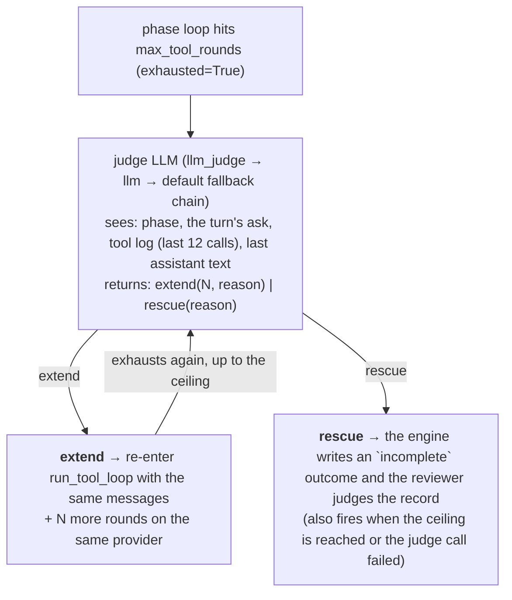

# Turn Engine

Each agent turn in Crewlet runs through a two-stage **Executor → Reviewer** loop orchestrated by the turn engine (`internal/agent/turn/loop.go`). Each stage is an LLM call with its own system prompt, its own tool surface, and optionally its own model. The turn engine also owns ephemeral sub-agent spawning and enforces the delegation-depth / stall / sub-agent allowlist invariants in code.

---

## Why two stages?

The engine used to plan in one conversation and act in another. That split cost the actor everything the planner learned: tool RESULTS were not forwarded, so content had to be smuggled through the plan's own steps, and the planner had to NAME the tools it expected to call — against a catalogue it was never shown, so it guessed. Every guess that missed became a "phantom" the engine then had to reason about, and the delivery gate was built entirely out of reconciling those guesses with reality. Both recorded delivery incidents came from that reconciliation.

One agentic loop removes the reconciliation rather than improving it. What remains:

- **Onboarding** (first turn only, conditional) runs *before* the executor when the agent has no onboarding marker for its current org chain. It reads the team's `Onboarding` pages, captures conventions via `reflect_and_persist`, and calls `mark_onboarded`. It has its **own** round budget (`turn_engine.onboarding_max_tool_rounds`, default 10) so onboarding never competes with the turn's own budget — if it ran inside the executor it could consume every round before the agent ever called `submit_work`, silently dropping a first-turn request. Skipped on resume turns and once the agent is marked. See [First-turn onboarding](#first-turn-onboarding).
- **Executor** decides what to do and does it, in one conversation. It starts with every first-party tool and the *slim* catalogue (builtin names + MCP server names); it discovers and activates MCP tools as it turns out to need them. It ends by calling `submit_work` with an outcome, a summary, and the deliveries it claims.
- **Reviewer** judges the work. No domain tools; a single `submit_review` structured-output tool forces the decision enum. There is no handoff decision: when the turn is blocked and needs a manager or peer, the reviewer picks `self_iterate` and the note tells the next round to reach the colleague with its own colleague-surface tools — the same tools a human teammate would use (there is no special escalation mechanism).

Sub-agents (`spawn_subagent`) are bespoke short-lived workers with a parent-chosen tool allowlist — ideal for web research, code execution, or other capability-focused subtasks that shouldn't count as colleague delegation. They start with the tools the parent named but can also discover and activate more *read-only* tools themselves (`list_mcp_server_tools` → `activate_tool`), so a sub-agent handed a vague "find X" task can locate the right read tool instead of failing when the parent guessed the tool name wrong. One call runs several such workers in parallel — `tasks` takes an array — under one shared budget slice, so a greedy first child can leave its siblings less to spend.

---

## Phase-specific tool surfaces

Each phase gets a filtered view over the shared `ToolRegistry` via `ToolSurface` (`internal/tools/surface.go`). This is the key constraint that keeps LLM payloads tight while still letting the executor recover from an under-specified catalogue.

| Phase | `tools=[...]` | System prompt | Notes |
|-------|---------------|---------------|-------|
| **Onboarding** | `reflect_and_persist`, `mark_onboarded`, `load_tool_skill` always-on, plus the `activate_tool` / `list_mcp_server_tools` discovery meta-tools | One-line identity + the onboarding instructions (which pages to read, persist conventions, then `mark_onboarded`) + slim discovery catalogue | Runs only on a first turn for an unmarked agent, on its own budget. Discovers its knowledge-base tools via `list_mcp_server_tools` → `activate_tool` exactly like the executor. **No required-skill guard** — onboarding is a fixed read → persist → mark workflow and the prompt is its own guidance, so the load-before-use tax is skipped. Terminates on `mark_onboarded`; on budget exhaustion the agent stays unmarked and retries next turn. |
| **Executor** | Every first-party tool except `mark_onboarded`, plus `submit_work`, `activate_tool`, `list_mcp_server_tools`, and any MCP tool it has activated this turn | Identity + **full policy text** + role profile + skills metadata + roster (leads) + the executor's contract + prefetch blocks + **slim** tool catalogue (builtin tool names + MCP server names only) | The slim catalogue lists every builtin tool but only the NAMES of MCP servers — individual MCP tool names (often 50–150 per role) stay out of the prompt. To use one the agent calls `list_mcp_server_tools(server)` for discovery, then `activate_tool(name)` to promote it into `tools=[...]` so its schema arrives on the next round. Nothing is named in advance, so nothing has to be reconciled afterwards. Mission, vision, backstory, full policy text, and behavioral guidelines render directly into the prompt from the in-memory `Organization` model — no DB seed step. `mark_onboarded` is the whole phase-scoped denylist: a seat that could mark itself here would permanently skip orientation. |
| **Review** | `submit_review` meta-tool only | One-line identity + the round's intent, outcome, tool log and produced text + decision-enum contract | No catalogue, no policies, no prefetch. Whether anything was DELIVERED is settled before this prompt is built — the reviewer's question is whether the work is any good. |
| **Sub-agent** | Parent-named allowlist minus the engine-control denylist (`spawn_subagent`, `a2a_ask`, the discovery meta-tools) **and** minus any tool whose [MCP annotations](tool-capabilities.md) mark it a write to a shared surface | Parent's task prompt + mandated preamble | Fresh context; a wall-clock timeout; runtime-clamped `max_turns`. Sub-agents have a fixed parent-chosen surface and cannot grow it via `activate_tool` / `list_mcp_server_tools` — those names are on the first-party control denylist. External-write tools are denied by *capability* (derived from MCP annotations), not by a hardcoded tool-name list, so the guard holds for any tool stack. |

---

## First-turn onboarding

A fresh agent (no onboarding marker for its current org chain) needs to read its team's `Onboarding` knowledge-base pages and internalise the conventions before doing real work. This runs as a **dedicated phase before the executor** (`internal/agent/runner/onboarding.go`), gated on the marker store (`agent_onboarding_markers`):

1. The engine checks the marker. The read is **tri-state**: `True` (marked for the current chain) skips; `False` (definitively unmarked) runs the pass; `None` (the lookup *failed* — state unknown) **skips this turn and retries the check next turn**. Collapsing a failed lookup into "not onboarded" would re-run a full onboarding pass for an already-marked agent on any transient DB error. Two further guards make onboarding strictly run-once per org chain: a **process-local latch** (the seat's onboarded-chain hash, set the moment a pass marks or a read confirms the marker) short-circuits before any DB read, and a **single-flight lock** (the seat's onboarding lock) holds a concurrent turn at the gate while a pass runs — turns are normally serialized per agent, but the sandbox busy-state transitions can free the agent while an earlier turn is still mid-flight, and without the lock both turns would read "unmarked" and run duplicate passes.
2. Otherwise it runs `run_onboarding_phase` with its **own** round budget (`turn_engine.onboarding_max_tool_rounds`, default 10). The agent discovers its knowledge-base tools (`list_mcp_server_tools` → `activate_tool`), reads the pages, captures conventions with `reflect_and_persist`, and calls `mark_onboarded` (which terminates the phase). Onboarding is a **discovery-capable phase** — its surface exposes the slim tool catalogue and supports `activate_tool` exactly like the executor. (Without that, the agent could *see* its knowledge-base tools via `list_mcp_server_tools` but every `activate_tool` would hit an "availability gate" — it would never read its pages, never mark, and the pass would re-fire every turn.) Its rounds are governed by the same round-cap **extension judge** as the executor: the base cap can be extended up to `onboarding_max_tool_rounds_ceiling` (default 20) when the agent is still making progress, so a near-done pass isn't cut off mid-read.
3. The turn then proceeds to the executor with the onboarding hint **suppressed for the rest of the turn**, so onboarding can't also happen inside it and re-spend the turn's budget. The hint path applies the same tri-state + latch rules: it renders only when the agent is *definitively* unmarked — never on a failed lookup, which would otherwise trigger a repeat onboarding for an already-marked agent.

**Why a separate phase.** If onboarding were only a hint injected into the executor's prompt, the agent would do the page-reads + `reflect_and_persist` + `mark_onboarded` inside its own round budget — on a first turn that could burn every round before it ever called `submit_work`, and the turn would fall through to a silent skip (the request dropped). Giving onboarding its own budget means a first turn always has its full budget for actual work.

The marker invalidates itself when the org chain changes (`compute_chain_hash`), so a role move / reorg re-triggers onboarding for the new context. Set `onboarding_max_tool_rounds: 0` to disable the dedicated pass. When the marker store isn't wired (no DB), onboarding is skipped — there's no way to record completion, so it would otherwise run every turn.

On the dashboard, onboarding renders as its own phase within the turn it rode in on, with a neutral tag rather than one of the phase hues — it is one-time setup that happens to ride the first turn, not part of that turn's task, and colour is reserved for the phases a reader tracks across every screen.

---

## The work submission

The executor ends by calling `submit_work` (`internal/agent/runner/submit.go`), which is where the turn's account of itself becomes something the engine can act on:

```go
type Work struct {
    // Outcome is the executor's own account: delivered | no_action |
    // blocked, or the engine-written `incomplete` when it never submitted.
    Outcome Outcome
    Summary string

    // Deliveries are the tools it cites as having delivered. Reported
    // rather than trusted — the engine's own record is what decides.
    Deliveries []string

    Evidence      string // required when blocked: what was tried, what stopped it
    OpenQuestions string

    Text  string        // the final prose
    Calls []ledger.Call // engine-recorded, not self-reported
}
```

To hand a task off to a colleague the executor reaches them where the work lives — a chat mention, an issue comment or reassignment, or `a2a_ask` — and reports that as the delivery. There is no dedicated `delegate` outcome: a handoff is just a colleague-surface tool call.

**Real code work** is the `run_sandbox` tool. For a role gated with `role.sandbox.enabled`, the executor calls it to run a coding agent (Claude Code / OpenCode) in an isolated sandbox. The call **suspends** the tool loop (detached run); when the run completes the engine **resumes the same loop** with the result spliced in as that call's reply, so the agent reports and acts in the same turn. See [Code Sandbox](code-sandbox.md).

### Who is waiting, and how they get an answer

Whether a turn OWES an answer is derived by the engine at dispatch, from the trigger's own type, before any model runs (`engine.ReplyFor`). It is the half of the delivery question a model cannot get wrong — the old engine asked the planner to declare its own intent, and a turn that declared `skip` on a direct @mention read to the person who sent it exactly like the message never arriving.

| `Reply` | Trigger | What delivery means |
|---|---|---|
| `none` | A schedule fired, a broadcast mentioned the seat in passing, an internal event woke it | Nothing is owed. The turn may end having done nothing at all, which is what makes triage cheap |
| `tool` | An assignment, or a notification the source's own routing marks as an ask — a direct message, a personal mention | The answer only exists if a tool put it there |
| `engine` | A colleague asked over A2A | The engine returns the turn's artifact on the channel the ask opened; there is no tool to call |

A source's reading of its own routing is [`notify.Prompt.Addressed`](../integrations/index.md) — a tracker answers from its routing reason (assigned, mentioned), a chat backend from the channel type and whether the seat was named. The conservative answer is FALSE: a seat wrongly told nobody is waiting keeps the freedom to stay silent, while one wrongly told somebody is must post on every broadcast it observes. A coalesced trigger takes the STRONGEST obligation of its constituents — a merge must not be able to launder an ask.

### Three checks, in increasing cost

The turn engine checks the executor's account against its own record three times, and the order is the design (`internal/agent/turn/verify.go`):

1. **At decode time**, inside the loop. A `delivered` on a `tool`-awaited turn must cite a call the engine recorded; a `no_action` on any awaited turn is refused outright ("silence is not a decline"); a `blocked` needs evidence. A wrong claim costs one bounced tool call the model can fix — not a review round, and not a silently accepted no-op. The refusal lists what IS citable, because the failure this catches is usually a model naming the tool it MEANT to call.
2. **Before the reviewer** (`Check`). Two of its three answers cost no model call: a `no_action` nobody asked for and nothing acted on ends the turn as skipped; a claim the record refutes loops back with an engine correction. What it cannot do is judge whether the work was any GOOD — everything that passes goes to the reviewer.
3. **After the reviewer** (`OverrideDone`). A `done` on a `tool`-awaited turn where no tool that acts outside the engine ran is overturned to `self_iterate`. This is the recorded failure: the reviewer's model judges the produced TEXT, finds a good answer in it, and says done even though nothing put that answer anywhere a person can see. The engine's correction is appended LAST, because on this path the reviewer wrote none of its own.

**What counts as a delivery** is one rule, applied everywhere: a tool is `Deliverable` when it is **server-backed and not positively annotated read-only**. A delivery to a shared surface only ever comes from an MCP server, so a first-party builtin never counts however much it writes — `reflect_and_persist` records a thought, `use_skill` loads a page, and neither is an answer anybody is waiting for. "Not a known read" is POSITIVE: an unannotated tool counts as a possible delivery, which is the fail-closed direction, since the alternative exempts every tool a server forgot to [annotate](tool-capabilities.md). Only SUCCESSFUL calls count — a failed post did not post, and counting it would close the check on exactly the turn that needs to iterate.

`no_action` is narrowly scoped: it means **"nobody was actually asking the agent to do anything"** — informational triggers, passing references, broadcasts where the addressee was clearly someone else. When the agent *was* directly asked / @mentioned / assigned but is declining (out of scope, wrong owner, already handled, deferring), it must instead post a brief explanation via the originating channel's reply tool and report that as `delivered`. A direct request answered with silence looks like the ping was lost; the one-line decline closes the loop. The executor's contract enforces this in prose, the decoder enforces it in code, and each vendor's notification prompt carries the same rule on the triage side.

The per-phase headers are deliberately verbose — each rule traces to an observed turn-ending failure, and `internal/agent/prompts/budget_test.go` holds them under explicit token budgets (executor < 2,200, review < 750, and the whole turn < 3,000) so the prose can't grow unchecked. The repeated cost of re-sending these static headers on every round of the tool loop is absorbed by **[provider prompt caching](overview.md#llm-provider)**, not by trimming the guidance: the `system + tools` prefix is byte-stable within a phase and across an agent's turns, so it is cached and re-read cheaply rather than re-billed each round. Slimming a header to save tokens is therefore the wrong trade — it re-opens the incidents the rules were added to close, for a saving caching already captures.

---

## ReviewOutcome

```go
type Review struct {
    Decision phase.Decision // "done" | "self_iterate" | "failed"
    Notes    string

    // CompletedWork is what already landed, in the reviewer's own words.
    CompletedWork string

    // FinalArtifact is what the reviewer wants returned. Empty reuses the
    // executor's text.
    FinalArtifact string
}
```

- `done` → return `FinalArtifact` (fallback: the executor's text), unless the post-review override overturns it.
- `self_iterate` → record the round in the [prior-work ledger](#prior-work-ledger-across-self_iterate-rounds) and loop back. Capped at `turn_engine.max_iterations` (default 3); two unchanged-artifact rounds publish a `turn.guard_breach(kind="stall")` and terminate the turn as `failed` (engine-driven, not an LLM decision).
- `failed` → the reviewer's own judgement that another round would not change the answer. No guard fired, so none is reported.

When a turn is blocked and needs a manager or peer — a capability gap requiring someone else's identity / credentials, or a decision above the agent's authority — the reviewer chooses `self_iterate` and says so in `notes`. The next round reaches the colleague directly with its own colleague-surface tools (a Slack mention, a Jira comment, `a2a_ask`) — the same way a human teammate asks for help, and the same way an agent reaches a [human seat](humans-in-the-org.md). The colleague replies asynchronously and that re-triggers the agent. There is **no** engine-side handoff dispatcher, **no** `ask_colleague` decision, and **no** `role.fallback` chain: escalation is ordinary tool use.

### Prior-work ledger across `self_iterate` rounds

Every phase rebuilds its LLM conversation from scratch on each round — the executor starts from `[system, user]` every time. Without a record kept *outside* that conversation, a `self_iterate` round starts blind: it cannot tell that round 1 already posted to Slack, so it does it again and the side effect fires twice.

The turn's iteration ledger is that record. The engine appends one `ledger.Iteration` (`internal/agent/ledger/iteration.go`) immediately before each loop-back, and renders the accumulated records into two places:

| Consumer | Where | Why |
|---|---|---|
| **Executor** | `## Already done earlier in this turn` in the **user** message | Do the gap, not the whole task again — and it is what actually fires side effects, so it holds the evidence |
| **Review** | `## Earlier rounds (already delivered)` in the system prompt | Makes the duplicate-delivery rule work turn-wide instead of only inside one round |

The block rides the **user** message for the executor, never its system prompt: that prompt is frozen at turn start (the prefetch blocks) so its prefix stays byte-stable for provider prefix caching, and a section that grows each round would invalidate that cache on every loop. On round 1 the ledger is empty and the message is byte-identical to a single-pass turn.

**ONE call list per round**, because one phase makes the calls. It was two while the turn planned in one conversation and acted in another, and the split was load-bearing then: the delivery gate took a different view of each. Nothing takes two views of one list. (A row written by the three-phase engine still resumes — see `internal/agent/execstate/compat_v1.go`, which concatenates the two in the order they ran.)

**Two layers, deliberately.** The tool-call list is *engine-recorded*, so it cannot be forgotten — which matters most on the post-review `done` → `self_iterate` override, where the reviewer decided `done` and therefore wrote no prose at all, yet a partial delivery may already have landed. `Review.CompletedWork` is the reviewer's gloss on top, expressing what the mechanical log cannot: *"the post landed and reads fine — follow up in that thread rather than re-posting."* Same trust order the reviewer already applies to `## What the agent did` over `## What the agent produced`.

**Reads are marked, not merged with writes.** Tool *results* are deliberately not carried across rounds, so a read the next round needs must be re-run — telling it "do not repeat" a `jira_get_issue` would push it to invent the data instead. Each record carries the positively-known read names the delivery check resolves from [MCP annotations](tool-capabilities.md), reads render as `→ success (read)`, and the prompt permits re-running exactly those. Failed calls stay marked `→ error`: they did not take effect and may be retried. Only the reads the round actually CALLED are recorded, not the whole surface's annotation set: the row is persisted across a sandbox suspend, and carrying every read-only tool on a large MCP surface makes it grow with the catalogue rather than with what the round did.

### What the ledger trims, and why

One principle decides every budget: **elide payloads, never structure.**

A *payload* — a message body, page HTML, a diff — is unbounded, gets re-authored next round, and can never answer "did this already fire". Carrying it only buries the two lines that can. *Structure* — the round's own account of what it set out to do, the draft under review, the reviewer's correction — is bounded in practice and is exactly what the next round must act on, so it is cut only as a guard against pathological output, never as routine trimming.

The budgets are guards, not a diet. Prompt caching keys on the system+tools prefix, which the ledger never touches, so a larger block costs little; the reason to bound it at all is that an unbounded one eats the turn's own `PhaseBudget` and drowns the signal.

| Budget | Value | Anchored on |
|---|---|---|
| `ValueLimit` | 200 | A Confluence/GitHub URL with query params runs ~180 chars, so the whole discriminator survives while bodies are cut by an order of magnitude |
| `BlobLimit` | 800 | ~12 identifier-shaped arguments — more than any real delivery tool takes |
| `IntentLimit` | 1200 | A realistic multi-step account renders ~850 chars; 1200 covers ~8 |
| `ArtifactLimit` | 2000 | The same budget the reviewer's own copy of the draft gets — same content, same question |
| `NoteLimit` | 2000 | `notes` is the correction and the ledger is its only carrier, so it gets the artifact's budget |
| `MaxReadCalls` | 12 | The recon a normal round does; only reads are ever dropped |

Arguments use **per-value** elision, never a cap on the serialised blob. Serialisation preserves key order, so capping the object would drop whichever keys sort last — and the discriminating argument (`channel`, `key`, `page_id`) is usually the *shortest* one. A line that kept a 400-char message body but lost `channel` would look precise while hiding which of two deliveries actually fired. When even fully elided values exceed `BlobLimit`, the backstop drops **whole keys** — shortest-value-first, so identifiers survive — and appends `+N more` rather than cutting mid-serialisation. The same priority governs the read-line cap: only reads are ever omitted, never a write.

**The ledger survives a sandbox suspend.** A detached `run_sandbox` ends the turn and its completion resumes it in another process, so the records are serialised into the pending run's `execute_state` ([`internal/agent/execstate`](../reference/index.md)) and rehydrated onto the resumed turn. Without that round-trip, a turn that self-iterated before suspending would forget those rounds and re-fire their deliveries after the resume. That blob carries an explicit version and a permanent reader for the previous one, because a parked run can outlive the build that suspended it and nothing rewrites a parked row.

The **task description** is not mutated by a `self_iterate` round: the correction is prefixed to the user MESSAGE instead. Appending review notes to the task leaked them into the knowledge-search query builders, the sandbox brief, and the episode / turn-completed publishers — all of which want the requester's actual ask.

### The same ledger, one scope wider

Everything above is scoped to a single turn. The cross-turn counterpart —
what this seat already said in *this Slack thread / issue / pull request*,
carried into that conversation's next turn — is
[Conversation Sessions](conversation-sessions.md). It inherits this section's
doctrine wholesale (elide payloads never structure, writes never dropped,
reads marked so they are re-run rather than trusted) and rides the same user
message, immediately above `Task:`. The executor receives it; the reviewer does
not, because the reviewer judges *this* turn's work and the ledger above already
carries its duplicate-delivery rule.

### Engine-driven `failed` outcome

`failed` is not an LLM-emitted decision; it's set by the engine on guard breaches (stall, max-iter exhaustion, depth cap, unhandled exception, `LLMUnavailable`). Every `failed` turn publishes a `turn.guard_breach` event (with the specific `kind`) and an `AgentTurnCompleted(decision="failed")` carrying the classified `error` / `error_kind`.

**The phase that died publishes too.** A phase runner that raises never reaches its own `publish_phase_completed`, so a failed phase used to leave nothing behind but the `AgentPhaseStarted` that opened it — the dashboard showed an in-flight LLM call whose response never arrived, and read "No response text yet" where the error belonged. `phase_failure_guard` (installed once, at the sub-agent's own phase run, which every operator-visible phase goes through) publishes the missing `AgentPhaseCompleted` with `failed=True`, the classified `error_kind`, and whatever the loop managed before it died: the conversation, the tool calls that ran, the tokens already billed, the round it was on. It then re-raises the original exception untouched, so the `LLMChainExhausted` / wall-clock-timeout / guard-breach handling above is unchanged.

The dashboard renders that record as a failed invocation — error first, partial work beneath it — and keeps it on screen. AFK is sticky until the agent does real work again: the failure event and the `TaskFailed` that follows it land microseconds apart, so a projection that took the newest event at face value showed a healthy idle seat immediately after the failure that stopped it.

---

## Colleague-surface tools

Agents collaborate per surface through the upstream MCP tools directly, not a generic `ask_colleague` tool or engine-side wrappers (thin `slack_message` / `jira_comment`-style 1:1 MCP forwards would only accumulate maintenance debt). Each tool description encodes when to use that surface — workplace manners live in tool descriptions, not a routing layer. Agents call these tools during Execute for every kind of collaboration — questions, status updates, handoffs, and manager escalation alike.

The engine prompts never name these tools (see [Tool Capabilities](tool-capabilities.md)) — they describe the *capability* ("the reply tool for the channel the trigger arrived on") and the LLM picks the matching tool from its catalogue. The table below is an example for the common Slack + Atlassian + GitHub stack; a deployment on Linear / Teams / GitLab gets the same behaviour with its own tools.

| Tool (example) | Surface | Purpose |
|------|---------|---------|
| `slack_conversations_postMessage` | Slack | DM or channel post; conversational updates, questions, handoffs |
| `jira_add_comment` / `jira_update_issue` | Jira | In-ticket collaboration and reassignment |
| `confluence_add_footer_comment` / `confluence_add_comment` | Confluence | Page discussion; `@mention` uses the [platform-mentions skill](tool-skills.md) markup. The exact comment tool name is mcp-atlassian-version dependent; the LLM discovers whichever name the deployed server registered via `list_mcp_server_tools` |
| `request_copilot_review` | GitHub | Request an automated review on an existing PR (an un-promoted lightweight option; code authoring goes through the [code sandbox](code-sandbox.md), not here) |
| `a2a_ask` | Private A2A channel | The one engine builtin (`internal/agent/builtin/colleague.go`). Narrowly scoped: tight-loop / mechanical sync only — one ask, one answer, then the channel closes. The answering turn's final response *is* the reply; there is no send/close tool. See the tool description |

### What a delegation records

Delegation bookkeeping rides on the base `Event` model (`crewlet.events.types.Event`) rather than on an event of its own: `delegation_depth`, `parent_turn_id` and `delegation_chain` are stamped onto every event the turn engine publishes for a turn, so each one names the turn it descends from and the handles the work has already passed through. A chain that reaches `turn_engine.delegation_depth_limit` ends the turn with `turn.guard_breach(kind="depth_cap")` before any phase runs.

`a2a_ask` is the only colleague call the engine itself mediates, so it is the only one that also records the *edge*: `A2AService.request_channel` publishes `a2a_channel_opened` (`requester`, `target`, `participants`), wakes the target with an `a2a_request` carrying `delegation_depth + 1` and the requester appended to the chain, and `a2a_message_sent` / `a2a_message_delivered` / `a2a_channel_closed` follow it.

A delegation graph drawn from this is therefore an **A2A graph, not a company-wide one**. Every other row above is an upstream MCP tool called like any other: the engine records that `jira_update_issue` ran, not who now holds the ticket, so a handoff across a shared surface is observed at neither end. It comes back as an inbound webhook, and no shipped integration round-trips the delegation metadata through the external surface, so that trigger arrives at depth 0 with an empty chain — a cross-surface hop breaks the chain rather than extending it.

---

## Per-phase LLM models

`llm` IS the executor's chain — the seat's model, and what its own work runs
on. There is no `llm_execute` beside it: the turn's work happens in one
conversation, so a second field naming the model that conversation runs on
would be two spellings of one setting.

What a role CAN route separately are the satellites, each of which an operator
may point somewhere cheaper:

```yaml
roles:
  - name: Senior Engineer
    handle: sarah-chen
    llm:
      default: claude-sonnet   # the executor
      review: claude-haiku
      subagent: claude-haiku
      auxiliary: claude-haiku  # memory / knowledge / summary passes
      judge: claude-haiku      # the round-cap extension judge
      sandbox: claude-sonnet   # the coding agent inside a box
```

Or the shorthand string form (everything runs on one model):

```yaml
roles:
  - name: Senior Engineer
    llm: claude-sonnet
```

Resolution order for a satellite: `role.llm_<phase>` → `role.llm` → the provider keyed `"default"` → the first provider registered. The flat field wins over the same key inside the mapping, so a seat can take a shared mapping and override one phase without restating the block.

---

## Round-cap extension judge

The executor has a tool-call round cap (`max_tool_rounds`, 24 by default);
onboarding has its own. When the LLM exhausts the cap before finishing, the
rescue path synthesises an `incomplete` outcome and hands the round to the
reviewer as-is. That throws away in-progress work whenever the agent was
actually close to done — the cap is a static guess, not a progress check.

The **extension judge** interposes between exhaustion and rescue: a
cheap LLM call inspects the tool log and the last assistant message and
decides:

- `extend` — the agent is making meaningful progress; grant
  `additional_rounds` more rounds (bounded by the per-phase ceiling and
  `extension_round_step`).
- `rescue` — the agent is thrashing / stuck; fall through to the
  existing rescue path.

Extensions chain: when an extended run exhausts again, the judge fires
once more, up to the configured ceiling. Token budget cascade still
bounds the whole thing economically; the ceiling is a sanity check.



The judge is best-effort: any failure (timeout, provider error, parse
error) maps to a conservative `rescue` decision so a flaky judge can
never block the host phase. The judge's own LLM call is published as
an `AgentPhaseCompleted` event with `phase="judge"` so dashboards can
see how often it fires and which decisions it makes.

**Forced tool calls are enforced, not just requested.** The rescue
paths and the extension judge call the tool loop with
`tool_choice="required"` to force a structured-output call (the executor's
`submit_work`, the reviewer's `submit_review`, the judge's
`submit_extension_decision`). Some endpoints
don't honor `tool_choice`, and some models "think then stop" — emitting
reasoning with no tool call. The loop treats a no-tool-call completion
on a `required` round as a non-terminal miss: it re-prompts with an
explicit corrective ("you must call `<tool>` now — no prose") and
retries within the round budget (bounded by `_MAX_FORCED_TOOL_RETRIES`
and `max_rounds`), instead of silently accepting the prose as a finish.
Without this, a single think-without-act response would defeat the
executor, the judge, *and* the rescue at once, and the turn would fall
through to a silent skip. Normal (`tool_choice="auto"`) rounds are
unaffected — a text answer there is a legitimate finish.

**No submission never goes silent.** An executor that ran out of rounds, or
simply stopped, has produced text and no account of itself. Discarding the
turn wastes everything it did; calling it delivered puts words in its mouth on
the one question that matters. So the engine writes the outcome `incomplete`
and marks the round RESCUED — both load-bearing. `incomplete` is its own value
rather than a defaulted `delivered` because the two must stay
distinguishable: an engine-written word carries none of the model's
commitment. The mark is what makes the pre-review checks stand down (there is
nothing anybody committed to) and what tells the reviewer, in prose, that the
word it is reading is the engine's.

**Configuration** (per `turn_engine`):

| Field | Default | Purpose |
|-------|---------|---------|
| `extension_enabled` | `true` | Master switch |
| `execute_max_tool_rounds_ceiling` | `48` | Hard cap on total executor rounds with extensions (2x base 24) |
| `onboarding_max_tool_rounds_ceiling` | `20` | Hard cap on total onboarding rounds with extensions (2x base 10) |
| `extension_round_step` | `8` | Max rounds the judge may grant per call |

The judge covers **the executor and onboarding**; each has its own base cap and ceiling. (The reviewer has no knob: it holds one submission tool, so its budget is a structural fact rather than an operator preference.) (Onboarding has no rescue path — a `rescue`/ceiling outcome just ends the pass unmarked and it retries next turn — so the judge is purely additive there.)

**Per-role provider**: set `role.llm_judge` to a small/fast model
(Haiku-class). Resolution follows the standard phase chain:
`role.llm_judge` → `role.llm` → `"default"` → first provider. If
unset, the judge runs on whatever the role's primary model is.

---

## Runtime invariants

Every invariant is enforced in code, not in prompts (`internal/agent/turn/guards.go`, `internal/tools/surface.go`, `internal/agent/skills/guard.go`):

1. **Sub-agents cannot spawn sub-agents, contact colleagues, or write to shared surfaces.** `subagent.Permit` denies the first-party control tools (`spawn_subagent`, `run_sandbox`, `a2a_ask`, the discovery pair) and any tool whose [MCP annotations](tool-capabilities.md) classify it a write to an external shared surface — regardless of the parent's allowlist. It also denies anything the parent cannot itself call, read LIVE: a tool the executor activated mid-phase is inheritable, and one it never had is not. The latter is derived from capability, not a tool-name list, so it covers any tool stack. Sub-agents **can** discover and activate *read-only* tools themselves (see invariant 7): the discovery catalogue is built from the same three filters as the grant, so a sub-agent can find the read tool it needs (e.g. a Jira JQL search) but can never widen itself into a write or a control tool.
2. **No recruitment.** Colleague tools require an explicit handle / channel / issue_key / PR URL. There is no "find someone to help me" primitive that would auto-create a role.
3. **Delegation depth cap.** The trigger event carries `delegation_depth`. When it meets `turn_engine.delegation_depth_limit` (default 3), the engine publishes a `turn.guard_breach(kind="depth_cap")` and terminates the turn as `failed` before any phase runs. This is the always-on backstop against runaway / circular delegation: it is checked at the top of every turn regardless of how the turn was triggered, and `a2a_ask` propagates the chain so the recipient's turn inherits the accumulated depth.
4. **Per-turn budget cascade.** Agent budget → phase budgets → sub-agent budget (default 20% of parent's remaining). Exhaustion publishes `budget_exhausted` and marks the turn failed. A *batched* `spawn_subagent` shares one fractional-budget wrapper across all children; the wrapper reserves tokens under a lock before charging, so concurrent children can't both pass the cap check and overshoot.
5. **Sub-agent timeout.** A per-call deadline from `turn_engine.subagent_timeout_seconds` (default 120 s). A batched call additionally has an aggregate `subagent_batch_timeout_seconds` cap and a `subagent_max_parallel` concurrency limit. Hitting the aggregate cap does *not* discard the children that already finished — they come back with their real answers, and only the ones still running are reported as timed out. Their tokens were spent either way.
6. **Stall detection.** Two `self_iterate` decisions with the same artifact hash publish a `turn.guard_breach(kind="stall")` and terminate the turn as `failed`. The threshold is a constant, not a knob: two identical rounds is the earliest point at which "unchanged" is a fact rather than a single sample, and the round cap already bounds how long a turn that IS changing may run. Max-iteration exhaustion (the executor/reviewer loop hit `max_iterations` without `done`) publishes `turn.guard_breach(kind="max_iter")` with the same terminal effect.
7. **Tool surface isolation between phases.** Each phase builds its tool list from scratch. The executor and sub-agents carry the same *slim* catalogue (builtins + MCP server names) and the same `activate_tool` / `list_mcp_server_tools` discovery meta-tools — a sub-agent's catalogue is the safety-filtered universe the grant was cut from (read-only / non-control / non-shared-write), so discovery cannot breach invariant 1. Review and Judge carry no catalogue and cannot discover tools. A `self_iterate` builds a fresh surface, which is correct: its LLM context started over too. A RESUMED executor is the exception — it replays the surface and the skill-guard state it suspended with, because it is re-entering the same conversation.
8. **Required-skill guard (load-before-use).** A [tool skill](tool-skills.md) gates the tools its trigger covers (the `required: true` default; `required: false` opts out for advisory content): within one phase session, calls to those tools are rejected (with an instructive error and a `phase.tool_skill_blocked` event) until the LLM has loaded the skill body via `load_tool_skill`. Enforced at the shared dispatch gate; tracked per LLM session because the executor and each sub-agent run on separate message histories — and replayed across a sandbox suspend, since the resumed executor is the same session and the bodies it loaded are still in its transcript.
9. **A busy agent queues — it never drops.** `run_turn` on a `WORKING` agent **waits** for the current turn to finish (raced against the shutdown gate, which NAKs the trigger to the next engine), keeping per-agent turns strictly serialized without erroring: erroring instead would NAK the triggering event into bounded redelivery (3 fast retries) and then the dead-letter topic, silently losing events that arrived during a minutes-long turn. An agent parked on a detached sandbox job (`AWAITING_SANDBOX` — potentially hours) is handled differently: the inbox handler **requeues + acks** those deliveries (the coordinator keeps the topic paused), so nothing is held against a broker ack window. `CREATED`/`TERMINATED` still fail fast — that's a caller bug, not queuing.
10. **A suspended turn owns its busy transition.** A turn whose Execute suspended for a detached sandbox run flips its agent `WORKING → AWAITING_SANDBOX` in its own `finally` — the state never passes through `IDLE`, so a queued event cannot slip a turn in between the suspend and the coordinator's (asynchronous) `SandboxRunStarted` handling. The coordinator only pauses the inbox and re-enters the busy state after an engine restart; on completion the agent stays busy through result collection and is freed immediately before the resume dispatch, whose failure un-claims the run row so a redelivery can retry (the suspended Execute loop is never lost).

---

## Slack working status

A turn triggered by a Slack message raises a **working status** in that
thread — "*Agent SWE is thinking…*" under the composer — for as long as the
agent is on it. The turn engine owns the lifecycle:

| Point in the turn | Effect |
|---|---|
| Turn start (before the agent / concurrency gates) | Indicator raised, so a ping to a *busy* agent is acknowledged while the turn queues |
| Each phase boundary | Next line drawn from that phase's pool — *is getting crewleted in…* → *is crewleting…* → *is marking its own homework…* (see [Slack § Behaviour](../integrations/slack.md#behaviour)) |
| Turn end (reply, a skipped turn, failure, budget exhaustion, shutdown refusal) | Indicator cleared |
| The executor suspended for a detached sandbox run | Indicator **held** — the agent has neither replied nor given up, and the same `turn_id` resumes when the job completes |

The mechanism is Slack's
[`assistant.threads.setStatus`](https://docs.slack.dev/reference/methods/assistant.threads.setStatus/)
(there is no public typing API for bots —
[slackapi/bolt-js#885](https://github.com/slackapi/bolt-js/issues/885)),
driven by `internal/notify` and posted with the
agent's own bot token. Sessions are keyed by `(handle, channel, thread_ts)`
and reference-counted by `turn_id`, so a suspend/resume pair shares one
heartbeat. Every call is best-effort — the indicator is cosmetic and can
never fail a turn — and a liveness probe drops it within one refresh if the
owning turn dies without clearing.

Whether it appears at all is the org-wide `integrations.slack.typing_status`
setting (`addressed` by default); the wording comes from per-phase pools
that `integrations.slack.status_phrases` can replace. See
[Slack § Working Status](../integrations/slack.md#working-status-is-thinking).

---

## Events and tracing

Every turn opens one `agent.turn` OTel span with child spans `agent.turn.execute`, `agent.turn.review`, `agent.turn.judge` (one per extension-judge call, nested under the phase that fired it). A sub-agent does not open a span of its own; it reports as an `agent_phase_completed` event with `phase=subagent` and `host_phase=execute`, so a dashboard groups it under the Execute round that spawned it, and a batch also emits one `subagent_batched`. The trigger event's OTel context is restored exactly once at the turn boundary so the span hierarchy is stable across agents.

The extension judge additionally emits an `AgentPhaseCompleted` event with `phase="judge"` carrying its system prompt, user prompt, response, token counts, and decision (`extend` / `rescue`) — the same shape as the executor / review phase events, so **Model activity** and the seat's own transcript render judge calls alongside the main phases without any frontend change.

### What streams during a turn

A phase is not one LLM call — it is a loop of them, and an operator
watching the dashboard is watching that loop. Two events carry it:

| Event | When | Persisted |
|---|---|---|
| `AgentTurnProgress` | Once before the first call, then twice per tool-call round | No — stream only |
| `AgentPhaseCompleted` | Once, when the phase ends | Yes |

**Before the first call**, because the phase's prompt exists before its
answer does. `AgentPhaseStarted` cannot carry it — every phase runner
publishes that event and only then builds its prompt — so the projection
seeds a placeholder call with no messages, and a live row showed "No
prompt recorded" for the whole of the phase's first and largest LLM call.
The opening update carries `prompt_messages` and nothing else, tagged
`round_num = -1` (consumers read `round_num + 1` as "rounds so far", so
the sentinel keeps it at zero rather than claiming a round).

**Twice per round**, because a round has two moments worth showing. The
first fires the instant the model has answered, before any of that
round's tools run: the model's prose and its reasoning are what explain
the tool call that is about to happen, and holding them back until the
round's slowest tool returns is holding them back for exactly as long as
they are most useful. The second fires once that round's tool results are
in. A round that emits only a tool call and no text has nothing new to
show at the first moment and skips it, so a tool-only round still costs
one event. The final round — the one that ends the phase by making no
tool call — publishes at the first moment and then ends the loop, which
is how a phase's closing answer streams at all.

**The same text either way.** Both events build their `response` with
`internal/agent/toolloop` over the same
message list, so what streams live is what you read when you expand the
finished turn — not a second assembly of it that can disagree. Reasoning
from an extended-thinking model rides in that string wrapped in
`<think>...</think>` (the wire format is
`internal/events/types`, shared with the
[auxiliary-LLM telemetry](agent-learning.md)).

**A round is published while it is being written.** `llm.Request.OnDelta`
asks a backend to stream; the tool loop accumulates the fragments into the
round in flight and republishes at most five times a second, which is below
the rate at which appearing text stops reading as live and well inside what
the socket hub can carry. The fragment rides `partial_round` on
`agent_turn_progress` — live-only, so nothing persists a half-written
sentence — and is cleared the instant the round commits, because from then on
its narration is authoritative. Streaming is opt-in per CALL, not a property
of a backend: twelve of the engine's thirteen provider call sites want an
answer rather than a running commentary. An endpoint that accepts a streaming
request and answers without streaming is negotiated down to the unary call,
once per process.

**`response` is a join, so the split travels beside it.** That string is
every round's assistant turn joined with a blank line, and the join cannot
be undone — its parts are separated by a blank line and prose contains
blank lines. A reader that split it on the leading `<think>` tag therefore
showed the FIRST round's thinking as "the reasoning" and every later
round's thinking as "the answer", tags and all. So both events also carry
`round_narration`: one `{round, reasoning, content}` per round, recorded
where the round's assistant message is appended, which is the last frame
that knows which round the turn belongs to. Its `round` matches
`tool_executions[].round`, and that shared number is the whole contract —
it is what lets a consumer interleave the two lists into one ledger of
"what it thought, what it said, what it called" without a second ordering
rule. The reasoning stays collapsed by default: it is long, it is not the
answer, and a reader scanning a turn for what it DID should not have to
scroll past what it considered. The three builders of that field used to be three
hand-written assemblies, and the live one omitted reasoning entirely: a
thinking model's live row streamed tool calls against an empty response
and only grew its reasoning once the phase was over.

**Never load-bearing.** Every progress publish is a live view of the
phase, not part of it: failures are logged (`turn_progress_publish_failed`)
and swallowed, so a broker hiccup cannot kill an otherwise healthy turn,
and cannot stand in for the real error when the phase is already dying.
This matters most for the opening update, which fires before the provider
is called at all — an unguarded raise there would end a phase that had
not yet run.

On a **resumed** executor phase — one that suspended on `run_sandbox` and
picked up when the detached run landed — both events are scoped to the
post-resume slice of the conversation, because the pre-suspend segment
was already published as its own record. The live row and the record
therefore still agree across a suspend.

### Turn source (the triggering event)

Every per-phase telemetry event (`AgentPhaseStarted`, `AgentPhaseCompleted`, `AgentTurnProgress`) and the `AgentTurnCompleted` aggregate carries a compact `trigger` descriptor — built by `internal/events/types` from the turn's the turn's trigger event. It records the `{id, type, summary, actor, timestamp}` of the event that *caused* the turn (a task assignment, notification, A2A request, or schedule tick). When the trigger is an external notification it additionally carries the originating `integration` (slack / jira / github / …), the human `sender`, and the `source_event_type`, so the dashboard labels the source with the actual integration — a branded Slack/Jira badge with the sender — instead of a generic "external notification". **Model activity** renders this as the turn's own header line — what woke it, and the integration badge when one did — and the seat's transcript carries the same, linking to the full event when the trigger was persisted (`#/events/{id}`). The descriptor is empty for engine-internal turns with no trigger.

Each phase row in that view is keyed to its **phase colour** (execute / review / auxiliary / sub-agent / judge — the same hue as the phase pill): a left accent stripe identifies the phase at a glance even while the row is collapsed, and expanding a row tints its border, header, and body with that colour so several open sections stay visually distinct instead of blurring into one neutral stack. The standalone per-phase detail card carries the same accent.

| Event | Purpose |
|-------|---------|
| `task_started` / `task_completed` / `task_failed` | Task lifecycle markers around the turn |
| `agent_turn_completed` | Extended with top-level fields `turn_id`, `execute_model`, `review_model`, `subagent_count`, `subagent_tokens`, `iterations`, `decision`, `trigger` (the turn's source descriptor) (inherits `delegation_depth` / `parent_turn_id` / `delegation_chain` from the `Event` base) |
| `turn.guard_breach` | A runtime invariant stopped the turn; `kind` names which one (`depth_cap`, `stall`, `max_iter`) and `detail` carries its message |
| `a2a_channel_opened` / `a2a_message_sent` / `a2a_message_delivered` / `a2a_channel_closed` | The channel an `a2a_ask` opened and its traffic — the only *recorded* delegation edge (see [What a delegation records](#what-a-delegation-records)). The target's `a2a_request` wake carries `delegation_depth + 1` and the requester appended to `delegation_chain` |
| `phase.tool_activated` | The executor promoted a catalogue tool into its active surface via `activate_tool`. Routine: nothing names its tools in advance, so discovery is how every MCP tool reaches a turn |
| `phase.tool_skill_blocked` | The required-skill guard rejected a tool call: the session tried a tool covered by a required [tool skill](tool-skills.md) (the default; `required: false` opts out) before loading it via `load_tool_skill`. Carries the tool name and the missing skill keys; the LLM recovers by loading and retrying |
| `budget_exhausted` | Unchanged; emitted by the shared tool-loop's budget check |

---

## Configuration

```yaml
turn_engine:
  max_iterations: 3
  max_tool_rounds: 24                    # base executor cap
  onboarding_max_tool_rounds: 10         # dedicated first-turn onboarding pass (0 = disabled)
  subagent_max_turns: 20
  subagent_timeout_seconds: 120
  subagent_budget_fraction: 0.2          # for a batched call this is the TOTAL slice across children
  subagent_max_parallel: 3               # children a batched spawn_subagent runs concurrently
  subagent_batch_timeout_seconds: 120    # aggregate wall-clock cap for one batched call
  subagent_min_per_child_tokens: 500     # batch rejected if the per-child slice would fall below this
  sandbox_min_budget_tokens: 2000        # refuse a coding run below this remaining budget
  delegation_depth_limit: 3
  extension_enabled: true                # round-cap extension judge (executor + onboarding)
  execute_max_tool_rounds_ceiling: 48    # hard cap on total executor rounds with extensions
  onboarding_max_tool_rounds_ceiling: 20 # hard cap on total onboarding rounds with extensions
  extension_round_step: 8                # max rounds the judge may grant per call

roles:
  - name: Senior Engineer
    handle: alex-kim
    llm:
      default: claude-sonnet             # the executor's chain — `llm` IS the seat's model
      review: claude-haiku
      subagent: claude-haiku
      judge: claude-haiku                # cheap model for the extension judge
      sandbox: claude-sonnet             # the coding agent inside the box
```

All fields are optional; defaults apply when absent.

---

## Implementation map

| Package / file | Role |
|--------|------|
| `internal/agent/turn/loop.go` | The turn entry point and phase orchestrator |
| `internal/agent/turnctx/` | Per-turn state (ids, depth, chain, budgets, model keys), carried as a context value |
| `internal/agent/phase/registry.go` | Which provider chain serves a role's phase — `Chain` and `Head` |
| `internal/agent/turn/verify.go` | Who is waiting, what counts as a delivery, and the two engine checks around the reviewer |
| `internal/agent/prompts/` | The per-phase prompt builders: `executor.go`, `review.go`, `subagent.go`, `onboarding.go`, and `sections.go` for the org detail every one of them shares |
| `internal/agent/runner/phases.go` | The executor and reviewer runners, and the one `runPhase` body they share |
| `internal/agent/runner/submit.go` | The `submit_work` / `submit_review` meta-tools and what a valid submission IS |
| `internal/agent/structured/` | How a phase gives a typed answer at all: schema → tool → decoder, and the three rules that travel with it |
| `internal/agent/runner/discovery.go` | The `activate_tool` / `list_mcp_server_tools` meta-tools |
| `internal/agent/runner/resume.go` | Re-entering a suspended executor loop when a detached run completes |
| `internal/agent/execstate/` | The wire format that suspended loop is serialised into, and the permanent reader for the previous version of it |
| `internal/agent/subagent/` | `spawn_subagent` and its runtime invariants |
| `internal/agent/turn/guards.go` | Depth cap, stall detector |
| `internal/agent/ledger/iteration.go` | Prior-work ledger: the iteration record and how it renders into the next round |
| `internal/agent/ledger/conversation.go` | The cross-turn ledger — what this seat already said in one thread |
| `internal/agent/skills/guard.go` | Required-skill guard: load-before-use enforcement for `required: true` tool skills |
| `internal/agent/extension/` | Round-cap extension judge |
| `internal/agent/toolloop/` | The shared tool loop — one call plus its tool round-trips, across every phase — and the suspend primitive a detached run returns through |
| `internal/tools/surface.go` | Phase-specific tool surface (filter + catalogue) |
| `internal/agent/builtin/colleague.go` | `a2a_ask` — the only surviving colleague wrapper; outreach to a vendor goes through that vendor's MCP tools directly |
| `internal/notify/status.go` | Working-status sessions: conversation resolution, `addressed` gating, heartbeat + clear |

---

## Further reading

- [Agent Runtime](agent-runtime.md) — lifecycle, state machine, agent pool.
- [Organization Model](organization-model.md) — hierarchy, roles, handles.
- [Event System](event-system.md) — EventQueue, topics, routing.
- [Tools & MCP](../guides/tools-and-mcp.md) — tool registry, built-ins, MCP.
